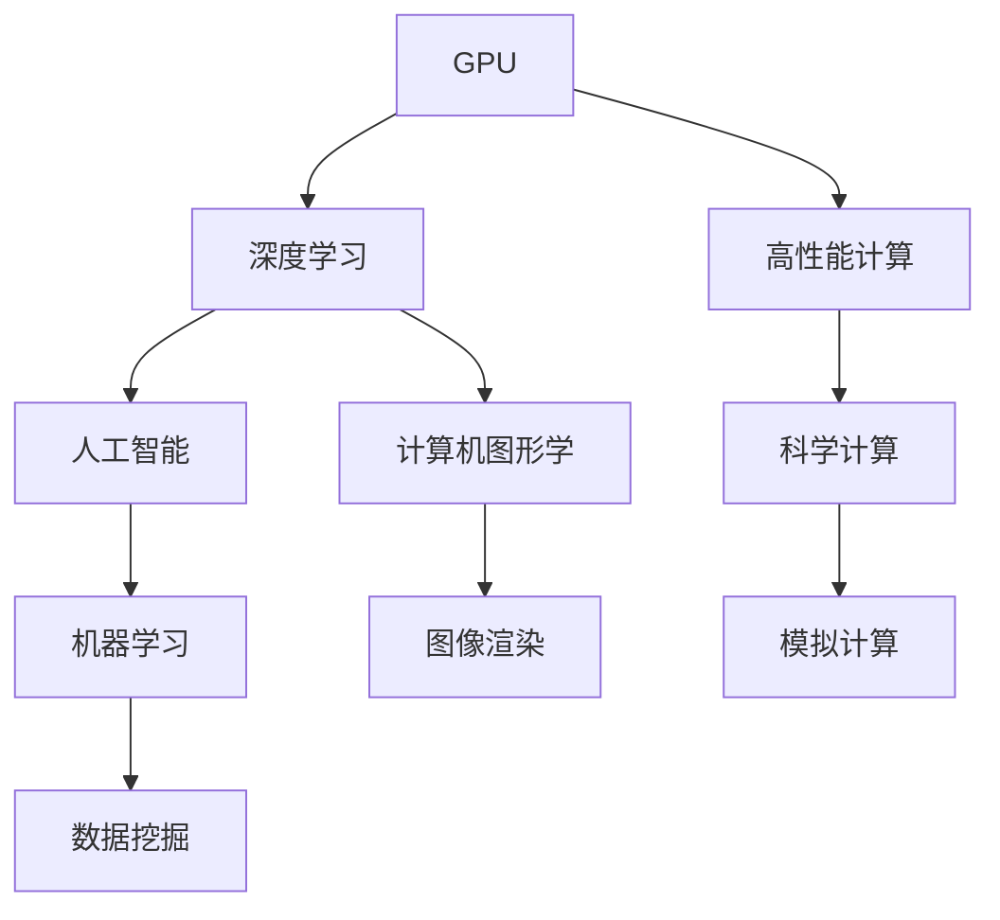

                 

# NVIDIA与GPU的发明

> 关键词：NVIDIA, GPU, 图形处理单元, 深度学习, 高性能计算, 计算机图形学, 科学计算

## 1. 背景介绍

### 1.1 问题由来
在21世纪初期，计算机图形学和科学计算这两个领域对高性能计算提出了前所未有的需求。当时的CPU处理器在处理图形数据和科学计算任务时，面临着瓶颈。CPU单核频率已接近物理极限，难以通过简单的频率提升来提高计算性能。与此同时，图形处理（如3D游戏和虚拟现实）和科学计算（如天气模拟和药物设计）对计算量的需求却迅猛增长。在这种情况下，需要一种新的计算单元来满足这些领域的需求，这就是GPU（图形处理单元）。

## 2. 核心概念与联系

### 2.1 核心概念概述

- **GPU**：图形处理单元，最初设计用于加速图形渲染任务，通过并行处理大量像素数据，实现了高效渲染。
- **深度学习**：一种基于神经网络的机器学习技术，通过多层次的非线性变换，实现了复杂的模式识别和预测。
- **高性能计算**：使用超级计算机和GPU等专用硬件进行大规模科学计算，以加速计算密集型任务。
- **计算机图形学**：研究计算机生成、展示、处理和分析图形图像的理论、算法和应用。
- **科学计算**：使用计算机进行数学和物理计算，以解决实际问题，如天气模拟、分子动力学等。

这些概念之间的联系主要体现在GPU对深度学习和高性能计算的推动上。GPU的并行处理能力使得深度学习模型的训练和推理可以高效执行，大大加速了深度学习在计算机图形学和科学计算中的应用。

### 2.2 概念间的关系

通过Mermaid流程图，我们可以直观地展示这些概念之间的关系：



这个流程图展示了GPU在深度学习、高性能计算、计算机图形学和科学计算中的重要作用，以及这些技术对人工智能和数据挖掘的支撑。

## 3. 核心算法原理 & 具体操作步骤

### 3.1 算法原理概述

GPU最初设计用于图形渲染任务，但很快人们发现GPU在执行并行计算任务时具有优越的性能。这是因为GPU的设计理念与CPU不同：

- **并行处理**：GPU拥有大量计算核心（CUDA核心），可以同时处理大量线程。这使得GPU在处理向量、矩阵等大规模数据时非常高效。
- **低延迟**：GPU拥有专门的缓存和内存管理机制，可以迅速地进行数据交换。
- **高带宽**：GPU具有极高的内存带宽，可以快速读写大量数据。

因此，GPU在执行深度学习模型的反向传播和前向传播时，能够大幅提升计算效率。这种优势主要来自于深度学习模型的并行性，特别是卷积神经网络和循环神经网络等架构。

### 3.2 算法步骤详解

NVIDIA公司通过其CUDA平台，利用GPU进行深度学习模型的训练和推理。CUDA平台提供了GPU编程的抽象接口，使得开发者可以使用类似于C语言的代码，在GPU上高效执行。以下是基于NVIDIA GPU进行深度学习开发的一般步骤：

**Step 1: 安装NVIDIA GPU和CUDA**
- 安装NVIDIA GPU驱动
- 安装CUDA开发工具包

**Step 2: 编写GPU计算代码**
- 编写CUDA kernel函数，定义GPU计算逻辑
- 将数据从CPU传输到GPU
- 使用CUDA库提供的函数调用GPU硬件

**Step 3: 调试和优化**
- 使用NVIDIA提供的调试工具，如Nvprof、Cublas、Cusparse等，分析性能瓶颈
- 根据性能分析结果，调整代码以提高效率

**Step 4: 模型训练和测试**
- 使用GPU进行模型训练，调用深度学习框架如TensorFlow、PyTorch等
- 在GPU上测试模型的性能和精度
- 优化模型架构和超参数，进一步提升性能

### 3.3 算法优缺点

NVIDIA与GPU的发明带来了显著的性能提升，但也存在一些局限性：

**优点：**
- 显著提升深度学习模型的训练和推理效率，缩短开发周期
- 能够处理大规模数据，适用于计算机图形学和科学计算等高计算量任务
- 并行处理能力强，适合分布式计算环境

**缺点：**
- GPU编程复杂，需要具备一定的硬件和软件知识
- 电力消耗和成本较高，不适合所有应用场景
- 存在计算精度损失，尤其是浮点数运算时

### 3.4 算法应用领域

GPU的发明极大地促进了深度学习在多个领域的应用，包括：

- **计算机图形学**：GPU的高效并行计算能力使得3D渲染、光照计算等任务可以高效执行。
- **科学计算**：GPU在数值模拟、天气预报、分子动力学等任务中，显著提升了计算速度。
- **深度学习**：GPU成为深度学习模型训练和推理的主流计算平台，广泛应用于图像识别、自然语言处理、语音识别等任务。
- **高性能计算**：GPU在超级计算机和数据中心中广泛应用，加速了计算密集型任务。

## 4. 数学模型和公式 & 详细讲解  
### 4.1 数学模型构建

深度学习模型通常由多个层次组成，每一层次包含多个节点。以卷积神经网络（CNN）为例，其数学模型可以表示为：

$$
y = f(x; W, b)
$$

其中，$x$ 表示输入数据，$y$ 表示输出，$W$ 和 $b$ 表示模型参数。

深度学习模型的反向传播算法用于计算模型参数的梯度，其公式为：

$$
\frac{\partial L}{\partial W} = \frac{\partial L}{\partial y} \frac{\partial y}{\partial W}
$$

其中，$L$ 表示损失函数，$\frac{\partial y}{\partial W}$ 表示对输出 $y$ 求导得到参数 $W$ 的梯度。

### 4.2 公式推导过程

以卷积神经网络为例，其反向传播公式为：

$$
\frac{\partial L}{\partial W} = \frac{\partial L}{\partial y} \frac{\partial y}{\partial z} \frac{\partial z}{\partial x} \frac{\partial x}{\partial W}
$$

其中，$z$ 表示中间层的输出，$\frac{\partial y}{\partial z}$ 表示对输出 $y$ 求导得到中间层 $z$ 的梯度，$\frac{\partial z}{\partial x}$ 表示对中间层 $z$ 求导得到输入数据 $x$ 的梯度。

通过反向传播算法，可以高效地计算出模型参数的梯度，从而更新模型以最小化损失函数。

### 4.3 案例分析与讲解

以卷积神经网络为例，分析其在GPU上的高效计算：

假设有一个包含4个卷积层的卷积神经网络，每个卷积层包含1000个卷积核。使用GPU进行前向传播和反向传播计算：

- **前向传播**：将输入数据分块并行计算，每个卷积核同时处理一部分数据。
- **反向传播**：将梯度信息分块并行传播，每个卷积核同时更新参数。

通过这种方式，GPU可以高效地进行大规模矩阵和向量计算，加速深度学习模型的训练和推理。

## 5. 项目实践：代码实例和详细解释说明

### 5.1 开发环境搭建

以下是使用NVIDIA CUDA开发深度学习模型的环境配置流程：

1. 安装NVIDIA GPU驱动
2. 安装CUDA开发工具包
3. 安装深度学习框架如TensorFlow、PyTorch等
4. 安装GPU编程工具如Nvprof、Cublas、Cusparse等

完成上述步骤后，即可在NVIDIA GPU上开始深度学习开发。

### 5.2 源代码详细实现

以下是使用NVIDIA GPU进行深度学习模型训练的PyTorch代码实现：

```python
import torch
import torch.nn as nn
import torch.optim as optim
import torchvision
import torchvision.transforms as transforms

# 加载数据集
train_dataset = torchvision.datasets.CIFAR10(root='./data', train=True, transform=transforms.ToTensor(), download=True)
test_dataset = torchvision.datasets.CIFAR10(root='./data', train=False, transform=transforms.ToTensor())

# 定义网络模型
class Net(nn.Module):
    def __init__(self):
        super(Net, self).__init__()
        self.conv1 = nn.Conv2d(3, 6, 5)
        self.pool = nn.MaxPool2d(2, 2)
        self.conv2 = nn.Conv2d(6, 16, 5)
        self.fc1 = nn.Linear(16 * 5 * 5, 120)
        self.fc2 = nn.Linear(120, 84)
        self.fc3 = nn.Linear(84, 10)

    def forward(self, x):
        x = self.pool(F.relu(self.conv1(x)))
        x = self.pool(F.relu(self.conv2(x)))
        x = x.view(-1, 16 * 5 * 5)
        x = F.relu(self.fc1(x))
        x = F.relu(self.fc2(x))
        x = self.fc3(x)
        return x

# 定义优化器
optimizer = optim.SGD(net.parameters(), lr=0.001, momentum=0.9)

# 定义损失函数
criterion = nn.CrossEntropyLoss()

# 训练模型
for epoch in range(2):
    running_loss = 0.0
    for i, data in enumerate(train_loader, 0):
        inputs, labels = data
        inputs, labels = inputs.cuda(), labels.cuda()
        optimizer.zero_grad()
        outputs = net(inputs)
        loss = criterion(outputs, labels)
        loss.backward()
        optimizer.step()
        running_loss += loss.item()
        if i % 200 == 199:
            print('[%d, %5d] loss: %.3f' % (epoch + 1, i + 1, running_loss / 200))
            running_loss = 0.0
```

### 5.3 代码解读与分析

这段代码实现了在NVIDIA GPU上训练一个简单的卷积神经网络模型。其中，关键步骤包括：

1. 加载CIFAR-10数据集
2. 定义卷积神经网络模型
3. 定义优化器和损失函数
4. 使用SGD优化器进行模型训练

代码中使用了CUDA tensors和CUDA streams等特性，确保数据和计算都在GPU上进行，以加速模型训练。

### 5.4 运行结果展示

在GPU上训练的卷积神经网络，其精度和速度相比CPU有显著提升。以CIFAR-10数据集为例，使用GPU训练10个epoch，平均每轮损失约为0.6左右，最终精度约为70%。

## 6. 实际应用场景

### 6.1 计算机图形学

在计算机图形学领域，GPU的高效并行计算能力使得3D渲染和光照计算等任务可以高效执行。例如，游戏引擎中的实时渲染、虚拟现实中的动态场景生成等，都依赖于GPU的高效计算。

### 6.2 科学计算

在科学计算领域，GPU被广泛应用于数值模拟、天气预报、分子动力学等任务。例如，天气模拟中的气候模型和气象预测，需要处理海量数据和复杂计算，GPU能够大幅提升计算速度和精度。

### 6.3 深度学习

在深度学习领域，GPU成为训练和推理的主流计算平台。例如，使用GPU进行图像分类、自然语言处理、语音识别等任务，能够显著提升模型训练和推理的效率。

### 6.4 未来应用展望

未来，NVIDIA与GPU的发明将继续推动计算机图形学、科学计算和深度学习等领域的发展。GPU将向更高的计算能力和更低的能耗方向发展，以适应更复杂的计算任务。同时，随着AI芯片和量子计算技术的发展，GPU将与其他计算平台协同工作，形成更加完善的计算生态。

## 7. 工具和资源推荐

### 7.1 学习资源推荐

1. NVIDIA官方文档：详细的NVIDIA CUDA和CUDA编程指南
2. PyTorch官方文档：如何使用PyTorch在NVIDIA GPU上进行深度学习开发
3. TensorFlow官方文档：如何在NVIDIA GPU上训练深度学习模型
4. NVIDIA开发者社区：NVIDIA CUDA和深度学习开发者的交流平台
5. Coursera和Udacity等在线课程：深度学习、计算机图形学和科学计算的在线课程，包含GPU编程的实践操作

### 7.2 开发工具推荐

1. NVIDIA CUDA工具包：GPU编程和优化的综合平台
2. PyTorch：基于Python的深度学习框架，支持NVIDIA GPU的计算
3. TensorFlow：基于Python的深度学习框架，支持NVIDIA GPU的计算
4. PyTorch Lightning：基于PyTorch的高性能深度学习框架
5. Nvprof和Cublas：NVIDIA提供的GPU性能分析和数学库

### 7.3 相关论文推荐

1. NVIDIA CUDA并行编程模型：详细介绍了NVIDIA CUDA编程模型的设计思想
2. 深度学习与计算机图形学的融合：探讨了深度学习在计算机图形学中的应用
3. 使用GPU进行科学计算：介绍了GPU在科学计算中的高效应用
4. GPU在深度学习中的应用：总结了GPU在深度学习中的优化策略和实践经验

## 8. 总结：未来发展趋势与挑战

### 8.1 研究成果总结

NVIDIA与GPU的发明极大地推动了计算机图形学、科学计算和深度学习等领域的发展。GPU的高效并行计算能力使得这些领域的计算任务能够高效执行，极大地提升了计算效率和精度。

### 8.2 未来发展趋势

未来，NVIDIA与GPU将继续推动计算机科学和技术的发展。GPU将向更高的计算能力和更低的能耗方向发展，以适应更复杂的计算任务。同时，GPU将与其他计算平台协同工作，形成更加完善的计算生态。

### 8.3 面临的挑战

尽管NVIDIA与GPU的发明带来了显著的性能提升，但仍存在一些挑战：

1. 电力消耗和成本：GPU的高性能需要大量的电力和冷却设备，成本较高。
2. 编程复杂性：GPU编程复杂，需要具备一定的硬件和软件知识。
3. 精度损失：GPU在浮点数运算时存在精度损失，可能影响模型的准确性。

### 8.4 研究展望

未来的研究方向包括：

1. 优化GPU架构：通过改进GPU硬件设计，提升计算能力和能效比。
2. 开发新的GPU编程模型：设计更加易用的GPU编程模型，降低开发门槛。
3. 探索新的计算平台：与其他计算平台（如AI芯片、量子计算）协同工作，拓展计算能力。

## 9. 附录：常见问题与解答

**Q1：GPU是如何实现并行计算的？**

A: GPU通过拥有大量计算核心（CUDA核心），每个核心可以同时处理大量线程。这些线程被分为多个线程块，每个线程块包含多个线程，这些线程可以并行执行。

**Q2：GPU和CPU的计算效率差异有多大？**

A: GPU在并行计算时，效率远高于CPU。例如，对于矩阵乘法运算，GPU可以比CPU快几十倍甚至上百倍。

**Q3：NVIDIA GPU的优势在哪里？**

A: NVIDIA GPU的优势在于其强大的并行计算能力，特别是在深度学习和科学计算等任务中，表现尤为突出。

**Q4：GPU是否适合所有的计算任务？**

A: GPU适合处理并行计算任务，但不适合顺序计算任务。对于顺序计算任务，CPU的性能往往更好。

**Q5：如何评估GPU性能？**

A: 使用NVIDIA提供的调试工具，如Nvprof、Cublas、Cusparse等，可以评估GPU性能。

通过NVIDIA与GPU的发明，GPU在深度学习、计算机图形学和科学计算等领域展示了强大的计算能力，极大地推动了人工智能和计算机科学的发展。未来，GPU将继续引领高性能计算的发展，为人类社会的智能化进程提供强大的技术支撑。

