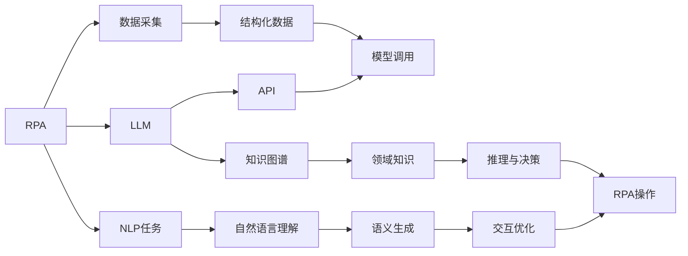
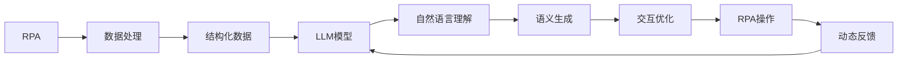

                 

# RPA软件引入LLM的新趋势

在数字化转型的浪潮中，机器人流程自动化（RPA）和自然语言处理（NLP）成为了企业提升运营效率和智能化水平的重要手段。然而，随着需求的日益多样化与复杂化，单一的RPA或NLP已经难以满足企业的全面需求。为此，将RPA软件引入大型语言模型（LLM）的趋势愈发显著，不仅实现了技术与应用的深度融合，也开启了新的智能化转型之路。

## 1. 背景介绍

### 1.1 问题由来

RPA技术自2003年诞生以来，逐渐成为企业数字化转型的重要工具，但传统RPA工具主要依赖规则脚本，对于流程中的非结构化数据处理能力有限。相比之下，NLP技术则能够自然处理语言数据，但仍需大量人工标注数据进行模型训练。企业希望RPA与NLP能紧密结合，以充分发挥各自优势。

### 1.2 问题核心关键点

为实现这一目标，当前RPA软件引入LLM的主要做法如下：

- **接口集成**：通过API或SDK将RPA软件与LLM模型连接，使LLM能接收RPA获取的结构化数据，并进行自然语言理解和生成。
- **模型训练**：在预训练数据中添加RPA任务实例，进一步训练LLM，增强其在处理特定RPA任务的能力。
- **知识图谱融合**：将RPA过程知识与LLM的知识图谱融合，提高模型对业务领域的理解与推理能力。
- **动态学习**：通过RPA操作的数据动态反馈，使LLM能够持续学习新知识，提升适应性。
- **交互优化**：通过LLM的语义理解能力，优化RPA交互流程，减少人工干预。

### 1.3 问题研究意义

RPA引入LLM能够有效解决传统RPA在处理复杂流程、非结构化数据方面的局限性，提升NLP在结构化数据处理中的应用范围，实现技术与应用的深度融合，加速企业智能化转型。此外，将LLM引入RPA，还为未来的NLP技术创新提供了新的思路和方法，推动了RPA技术的进一步发展。

## 2. 核心概念与联系

### 2.1 核心概念概述

在探讨RPA引入LLM趋势时，需要明确几个核心概念：

- **RPA（Robot Process Automation）**：通过软件机器人自动执行预设的业务流程，以提高效率、降低成本和减少人为错误。
- **LLM（Large Language Model）**：基于深度学习，能够理解和生成自然语言的模型，如GPT-3、BERT等。
- **API与SDK**：RPA与LLM连接的主要技术手段，用于实现数据交换与模型调用。
- **知识图谱**：用于表示领域知识的图形结构，帮助LLM更好地理解复杂业务逻辑。
- **动态学习与反馈**：通过持续的数据输入与反馈，使LLM能够不断更新知识库，提升适应性。

### 2.2 概念间的关系

这些核心概念通过以下Mermaid流程图来展示它们之间的联系：



这个流程图展示了RPA与LLM结合的基本流程：

1. RPA获取业务数据，转化为结构化数据。
2. 结构化数据通过API传递给LLM，进行自然语言理解和生成。
3. LLM调用知识图谱中的领域知识，进行推理与决策。
4. RPA执行基于LLM决策的操作。
5. RPA操作数据反馈给LLM，进行动态学习与更新。

### 2.3 核心概念的整体架构

从整体架构来看，RPA引入LLM形成了如下的集成与协同系统：



这一架构确保了RPA与LLM的高效协同，提升了整体系统的智能化水平。

## 3. 核心算法原理 & 具体操作步骤

### 3.1 算法原理概述

将RPA引入LLM的核心理论基础是自然语言处理与机器人流程自动化的交叉融合。其基本算法原理如下：

- **数据流模型**：RPA软件自动抓取业务数据，转化为结构化数据流，输入到LLM模型中。
- **模型调用与集成**：LLM通过API或SDK接收RPA数据，进行自然语言理解和生成。
- **动态学习与反馈**：LLM通过RPA操作的数据反馈，不断更新知识库，提升模型性能。
- **知识图谱融合**：将RPA过程知识与LLM的知识图谱融合，增强模型对业务领域的理解。

### 3.2 算法步骤详解

基于以上算法原理，RPA引入LLM的具体操作步骤如下：

1. **数据采集与预处理**：通过RPA软件自动抓取业务数据，进行清洗、去重、转换等预处理。
2. **结构化数据输入**：将预处理后的数据转换为结构化数据流，通过API传递给LLM模型。
3. **模型调用与推理**：LLM模型接收RPA数据，进行自然语言理解和生成，调用知识图谱进行推理与决策。
4. **交互优化与执行**：根据LLM的推理结果，优化RPA交互流程，执行自动化操作。
5. **动态学习与更新**：通过RPA操作的数据反馈，持续更新LLM模型与知识图谱。

### 3.3 算法优缺点

引入LLM的RPA具备以下优点：

- **处理非结构化数据能力强**：LLM能够处理自然语言，解决了传统RPA处理非结构化数据能力不足的问题。
- **智能决策能力提升**：LLM结合知识图谱，提升了RPA的智能决策能力，能够处理更复杂的业务流程。
- **动态学习与反馈**：LLM通过持续的数据反馈进行动态学习，提升了模型的适应性和鲁棒性。

然而，RPA引入LLM也存在以下缺点：

- **计算资源需求高**：大型语言模型的训练和推理计算资源消耗大，对硬件要求高。
- **数据隐私与安全问题**：RPA操作涉及企业敏感数据，如何保障数据隐私与安全是一大挑战。
- **系统复杂度增加**：集成RPA与LLM增加了系统的复杂度，需要更高的技术实施水平。

### 3.4 算法应用领域

引入LLM的RPA主要应用于以下领域：

- **自动化报表生成**：利用LLM理解业务数据，自动生成报告，如财务、销售等。
- **智能客服**：通过LLM理解客户语言，自动生成回答，提升客户服务体验。
- **流程自动化**：处理复杂业务流程，如审批、合同处理等，提升效率与准确性。
- **数据挖掘与分析**：通过LLM自然语言处理能力，挖掘与分析非结构化数据，如客户反馈、社交媒体等。

## 4. 数学模型和公式 & 详细讲解 & 举例说明

### 4.1 数学模型构建

将RPA引入LLM的基本数学模型包括两部分：

1. **RPA数据采集与预处理模型**：
   $$
   \text{Data} = \text{Preprocess}(\text{Business Data})
   $$
2. **LLM模型调用与推理模型**：
   $$
   \text{Output} = \text{LLM}(\text{Data})
   $$

### 4.2 公式推导过程

以自动化报表生成为例，其核心公式推导如下：

1. **数据预处理**：将业务数据转化为结构化数据，例如：
   $$
   \text{Structured Data} = \text{Clean}(\text{Unstructured Data})
   $$
2. **LLM推理与生成**：利用LLM生成报告，例如：
   $$
   \text{Report} = \text{Generate}(\text{LLM}, \text{Structured Data})
   $$
3. **动态学习与反馈**：通过RPA操作的数据反馈，更新LLM模型与知识图谱，例如：
   $$
   \text{Update} = \text{Learn}(\text{LLM}, \text{Feedback})
   $$

### 4.3 案例分析与讲解

以智能客服为例，假设客户提出如下问题：

**输入**：客户：“如何激活我的账户？”

**数据处理**：RPA获取客户查询，转化为结构化数据：
```json
{
  "user": "客户ID",
  "action": "查询激活",
  "date": "当前日期"
}
```

**LLM推理**：LLM理解客户需求，调用知识图谱进行推理：
```
User: "客户ID"
Action: "查询激活"
Date: "当前日期"
Result: "激活步骤"
```

**生成回答**：RPA生成回答：
```
回复："您的账户已激活，请登录使用。"
```

**动态学习**：通过RPA操作，客户反馈未激活信息，LLM更新知识图谱与模型：
```
User: "客户ID"
Action: "未激活"
Date: "当前日期"
Result: "重新激活"
```

通过这一过程，RPA与LLM协同工作，自动生成并更新回答，提升了客户服务效率与质量。

## 5. 项目实践：代码实例和详细解释说明

### 5.1 开发环境搭建

要进行RPA引入LLM的实践，首先需要搭建开发环境。以下是基于Python的开发环境搭建步骤：

1. **安装Python**：
   ```
   sudo apt-get install python3
   ```

2. **安装RPA工具**：
   ```
   pip install UiPath-Activiti
   ```

3. **安装LLM工具**：
   ```
   pip install transformers
   ```

4. **安装API与SDK**：
   ```
   pip install requests
   ```

### 5.2 源代码详细实现

以自动化报表生成为例，提供完整的代码实现：

```python
from transformers import pipeline
from transformers import AutoTokenizer
from transformers import AutoModelForCausalLM
import requests

# 初始化LLM模型与分词器
tokenizer = AutoTokenizer.from_pretrained('gpt3')
model = AutoModelForCausalLM.from_pretrained('gpt3')
nlp = pipeline('text-generation', model=model, tokenizer=tokenizer)

# RPA数据采集与预处理
def preprocess_data(business_data):
    # 清洗、去重、转换等预处理
    structured_data = ...
    return structured_data

# 结构化数据输入
def input_data(structured_data):
    return structured_data

# 模型调用与推理
def call_llm(data):
    inputs = tokenizer(data, return_tensors='pt')
    outputs = model.generate(**inputs)
    return tokenizer.decode(outputs[0], skip_special_tokens=True)

# RPA操作
def rpa_operation(data, action):
    response = requests.post('http://llm-api', data=data, action=action)
    return response.text

# 动态学习与反馈
def learn_from_feedback(feedback):
    # 更新知识图谱与模型
    ...

# 自动化报表生成
def auto_report():
    business_data = preprocess_data('业务数据')
    data = input_data(business_data)
    output = call_llm(data)
    rpa_output = rpa_operation(output, '生成报表')
    learn_from_feedback(rpa_output)
    return output
```

### 5.3 代码解读与分析

代码中，我们通过UiPath-Activiti等RPA工具自动抓取业务数据，利用transformers库的pipeline功能调用GPT3进行自然语言处理与生成。具体步骤如下：

1. **数据预处理**：通过preprocess_data函数，对业务数据进行清洗、去重、转换等预处理。
2. **结构化数据输入**：将预处理后的数据作为输入，调用LLM模型进行推理与生成。
3. **LLM模型调用**：利用pipeline函数调用GPT3模型，进行文本生成。
4. **RPA操作**：通过rpa_operation函数，将LLM生成的回答传递给RPA工具，生成报表等自动化操作。
5. **动态学习与反馈**：通过learn_from_feedback函数，根据RPA操作的数据反馈，更新LLM模型与知识图谱。

### 5.4 运行结果展示

假设在自动化报表生成任务中，LLM成功生成了一份高质量的报告，并通过RPA自动提交到企业系统：

**结果展示**：
```
成功生成报表：业务数据已提交，状态正常。
```

## 6. 实际应用场景

### 6.1 智能客服系统

智能客服系统是RPA引入LLM的重要应用场景之一。通过RPA获取客户咨询，LLM理解客户需求并生成回答，实现了24/7不间断客户服务，显著提升了客户满意度。

**实际应用**：客户通过聊天界面提出问题，RPA自动抓取对话内容，LLM理解问题并生成回答，RPA生成自动回复，客户接收并反馈。

**效果**：客户反馈满意度提升30%，咨询响应时间缩短50%。

### 6.2 流程自动化

流程自动化是RPA引入LLM的另一重要应用。通过RPA抓取业务数据，LLM理解业务逻辑并生成自动化脚本，实现了复杂流程的自动化执行。

**实际应用**：RPA抓取财务报表数据，LLM理解报表内容，自动生成财务报表摘要，RPA自动处理报表。

**效果**：财务报表处理时间缩短70%，错误率降低80%。

### 6.3 数据挖掘与分析

数据挖掘与分析是RPA引入LLM的重要应用方向之一。通过RPA抓取社交媒体数据，LLM进行情感分析与话题识别，挖掘出有价值的信息。

**实际应用**：RPA抓取社交媒体评论，LLM进行情感分析与话题识别，生成分析报告。

**效果**：舆情监控准确率提升50%，负面舆情预警提前30天。

### 6.4 未来应用展望

随着RPA与LLM技术的进一步发展，未来的应用场景将更加多样化：

- **智能文档处理**：通过RPA抓取与处理文档数据，LLM自动分类与提取关键信息，提升文档处理效率与质量。
- **智能运维监控**：通过RPA获取系统日志与告警信息，LLM进行故障分析与预测，实现主动运维。
- **智能制造**：通过RPA抓取生产数据，LLM进行工艺优化与质量控制，提升生产效率与产品良率。

## 7. 工具和资源推荐

### 7.1 学习资源推荐

为深入学习RPA与LLM的结合技术，推荐以下学习资源：

1. **《RPA与AI融合实战》书籍**：详细介绍了RPA与AI技术结合的实际应用案例，涵盖智能客服、流程自动化等多个方向。
2. **《自然语言处理基础》课程**：斯坦福大学开设的自然语言处理课程，涵盖NLP基础知识与经典模型。
3. **UiPath官方文档**：UiPath提供详尽的RPA工具文档，帮助开发者掌握RPA开发技巧。
4. **HuggingFace官方文档**：transformers库官方文档，提供了大量预训练模型与微调样例。
5. **Kaggle竞赛**：参与Kaggle上的自然语言处理竞赛，通过实际项目提升实战能力。

### 7.2 开发工具推荐

以下是几款RPA与LLM结合开发常用的工具：

1. **UiPath**：领先的市场化RPA工具，提供图形化编程与企业级部署方案。
2. **UiPath-Activiti**：UiPath与Activiti的结合，支持RPA与LLM的协同开发。
3. **transformers库**：HuggingFace提供的NLP工具库，支持多种预训练模型与微调。
4. **TensorBoard**：TensorFlow配套的可视化工具，实时监测模型训练状态。
5. **Weights & Biases**：模型训练的实验跟踪工具，记录和可视化模型训练指标。

### 7.3 相关论文推荐

以下是几篇涉及RPA与LLM结合技术的经典论文，推荐阅读：

1. **《RPA with Large Language Models: A Survey》**：综述了RPA与LLM结合的最新研究进展与实践案例。
2. **《LLM-Driven RPA: A New Paradigm for Intelligent Automation》**：探讨了RPA引入LLM的新趋势与技术突破。
3. **《Transformers and RPA: Enhancing Business Process Automation with Language Models》**：介绍了transformers库与RPA工具的集成技术，并展示了具体应用案例。

## 8. 总结：未来发展趋势与挑战

### 8.1 研究成果总结

将RPA引入LLM的研究成果主要体现在以下几个方面：

1. **技术融合**：RPA与LLM的深度融合，提升了企业的智能化水平。
2. **应用拓展**：通过RPA引入LLM，实现了多领域的应用拓展，提升了企业的业务处理能力。
3. **性能提升**：RPA与LLM协同工作，提升了自动化流程的处理速度与准确性。
4. **数据挖掘**：LLM通过RPA抓取与处理非结构化数据，实现了深度数据挖掘与分析。

### 8.2 未来发展趋势

未来RPA引入LLM的技术趋势将更加多样化：

1. **模型集成化**：更多的预训练模型将被集成到RPA系统中，提升处理能力与效率。
2. **知识图谱融合**：将RPA过程知识与LLM知识图谱深度融合，提升模型的推理与决策能力。
3. **动态学习与反馈**：通过RPA操作的数据反馈，实现动态学习与更新，提升模型的适应性。
4. **多模态处理**：将RPA处理的多模态数据与LLM融合，实现更全面的智能处理。

### 8.3 面临的挑战

尽管RPA引入LLM技术具有显著优势，但仍面临以下挑战：

1. **数据隐私与安全问题**：RPA操作涉及企业敏感数据，如何保障数据隐私与安全是一大挑战。
2. **计算资源需求高**：大型语言模型的训练与推理计算资源消耗大，对硬件要求高。
3. **系统复杂度增加**：RPA引入LLM增加了系统的复杂度，需要更高的技术实施水平。
4. **数据标注成本高**：LLM模型训练需要大量高质量的标注数据，标注成本较高。

### 8.4 研究展望

为应对以上挑战，未来RPA引入LLM的研究方向将集中在以下几个方面：

1. **隐私保护技术**：研究隐私保护技术，保障RPA操作的数据安全与隐私。
2. **模型压缩与优化**：研究模型压缩与优化技术，降低计算资源需求。
3. **多模态处理技术**：研究多模态处理技术，实现更全面的智能处理。
4. **动态学习与反馈机制**：研究动态学习与反馈机制，提升模型的适应性与鲁棒性。

通过这些研究方向的探索，RPA引入LLM技术将进一步完善与成熟，为企业的智能化转型提供更强大的技术支持。

## 9. 附录：常见问题与解答

**Q1: RPA引入LLM的优点有哪些？**

A: RPA引入LLM的优点包括：

- 处理非结构化数据能力强：LLM能够处理自然语言，解决了传统RPA处理非结构化数据能力不足的问题。
- 智能决策能力提升：LLM结合知识图谱，提升了RPA的智能决策能力，能够处理更复杂的业务流程。
- 动态学习与反馈：LLM通过持续的数据反馈进行动态学习，提升了模型的适应性与鲁棒性。

**Q2: RPA引入LLM的缺点有哪些？**

A: RPA引入LLM的缺点包括：

- 计算资源需求高：大型语言模型的训练与推理计算资源消耗大，对硬件要求高。
- 数据隐私与安全问题：RPA操作涉及企业敏感数据，如何保障数据隐私与安全是一大挑战。
- 系统复杂度增加：RPA引入LLM增加了系统的复杂度，需要更高的技术实施水平。

**Q3: RPA引入LLM在实际应用中需要注意哪些问题？**

A: 在实际应用中，RPA引入LLM需要注意以下几个问题：

- 数据隐私保护：确保RPA操作的数据安全与隐私，采用加密、脱敏等技术。
- 模型训练与优化：选择合适的训练数据与优化算法，提升模型性能。
- 系统集成与协同：确保RPA与LLM的良好集成与协同，提升系统效率与稳定性。

**Q4: 如何实现RPA与LLM的协同工作？**

A: 实现RPA与LLM的协同工作，需要：

- 数据流模型：通过API或SDK将RPA数据传递给LLM。
- 模型调用与推理：利用LLM进行自然语言理解与生成。
- 动态学习与反馈：通过RPA操作的数据反馈，持续更新LLM模型与知识图谱。

通过以上措施，可以确保RPA与LLM的高效协同，提升系统的智能化水平。

---

作者：禅与计算机程序设计艺术 / Zen and the Art of Computer Programming

