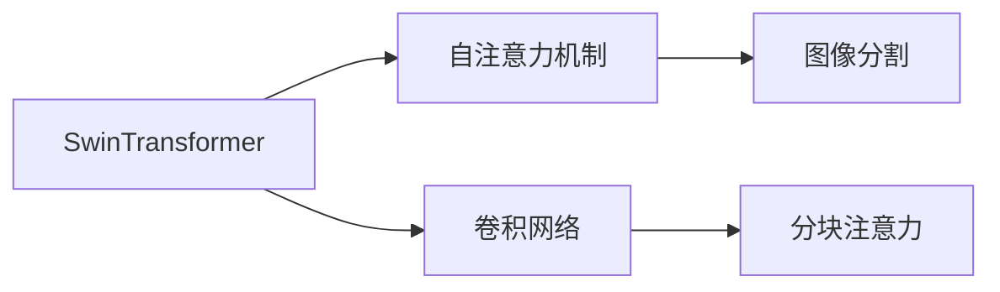
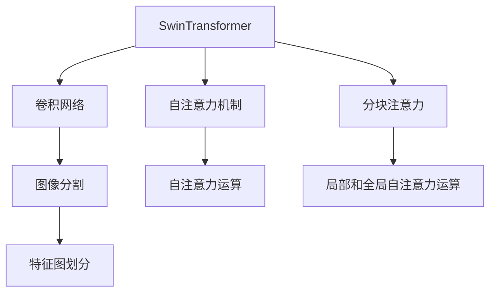
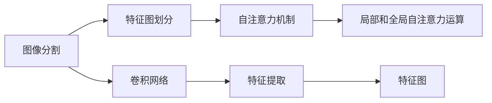
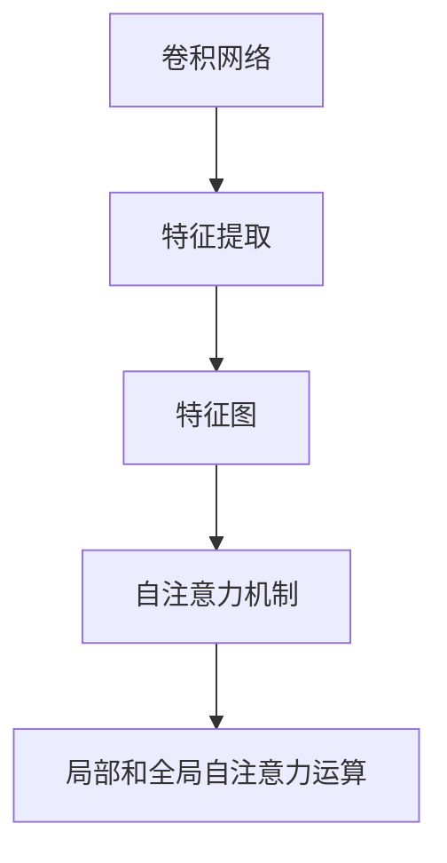
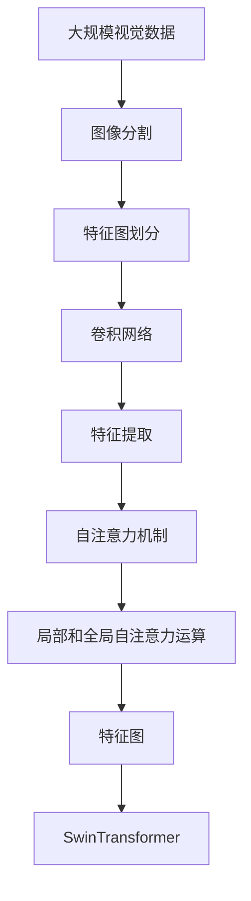

                 

# SwinTransformer原理与代码实例讲解

## 1. 背景介绍

### 1.1 问题由来
在大规模视觉任务中，深度卷积神经网络（CNN）的性能已接近瓶颈，难以突破。这主要由于CNN模型面临两个关键问题：高昂的计算复杂度和难以捕捉远距离依赖关系。自注意力机制的提出，通过在空间维上实现自相关运算，解决了这些问题，但计算量依旧巨大。

### 1.2 问题核心关键点
自注意力机制通过空间维度上的自相关运算，显著提升了模型性能。但其主要不足在于：

- **计算复杂度高**：尽管大幅降低了参数量，但训练和推理时计算复杂度仍然很高，无法高效处理大规模视觉数据。
- **序列依赖关系**：传统自注意力机制局限于序列依赖，难以捕捉更丰富的空间依赖信息，限制了模型在大规模视觉任务中的应用。

SwinTransformer的提出，正是为解决上述问题而生的。SwinTransformer结合了Transformer和卷积网络的优点，同时具有较低的计算复杂度和高效的序列依赖关系。

### 1.3 问题研究意义
SwinTransformer通过自注意力和卷积网络的有机结合，实现了在大规模视觉任务中高效计算和远距离依赖捕捉的双重目标。它为视觉理解任务的模型架构设计提供了一种全新的思路，推动了视觉任务研究的快速发展。

## 2. 核心概念与联系

### 2.1 核心概念概述

为更好地理解SwinTransformer原理，本节将介绍几个密切相关的核心概念：

- SwinTransformer：一种基于Transformer和卷积网络的新型大规模视觉理解模型，通过特殊的空间分割方法实现局部和全局依赖的并行计算。

- 自注意力机制：Transformer的核心组件，通过空间维度上的自相关运算，捕捉序列数据之间的依赖关系。

- 卷积网络：一种经典的空间局部运算机制，通过在空间维度上进行局部加权和运算，提取特征图的空间信息。

- 分块注意力：SwinTransformer特有的注意力机制，通过将特征图分成若干块，分别进行局部和全局的自注意力运算，实现高效并行的特征图处理。

- 图像分割：将图像划分为若干块，使特征图在局部和全局的层面上都具备依赖关系，从而能够有效捕捉空间信息。

这些核心概念之间的逻辑关系可以通过以下Mermaid流程图来展示：



这个流程图展示了SwinTransformer与其它核心概念之间的联系。SwinTransformer通过卷积网络和自注意力机制的有机结合，辅以分块注意力和图像分割技术，实现了高效、准确、灵活的视觉理解模型。

### 2.2 概念间的关系

这些核心概念之间存在着紧密的联系，形成了SwinTransformer模型的完整架构。下面我们通过几个Mermaid流程图来展示这些概念之间的关系。

#### 2.2.1 SwinTransformer的整体架构



这个流程图展示了SwinTransformer的整体架构。SwinTransformer模型通过卷积网络提取局部特征，再利用自注意力机制捕捉序列依赖，通过分块注意力实现局部和全局的并行计算，并辅以图像分割技术，将特征图划分为若干块，最终输出高效、灵活的视觉理解模型。

#### 2.2.2 SwinTransformer与图像分割的关系



这个流程图展示了SwinTransformer与图像分割技术的关系。通过将图像分割为若干块，SwinTransformer模型可以在局部和全局的层面上分别计算自注意力，捕捉更丰富的空间依赖信息。

#### 2.2.3 SwinTransformer与卷积网络的关系



这个流程图展示了SwinTransformer与卷积网络的关系。通过卷积网络提取局部特征，再利用自注意力机制捕捉序列依赖，SwinTransformer模型能够高效地处理大规模视觉数据，并捕捉丰富的空间信息。

### 2.3 核心概念的整体架构

最后，我们用一个综合的流程图来展示这些核心概念在大规模视觉理解任务中的整体架构：



这个综合流程图展示了从大规模视觉数据输入到最终SwinTransformer模型输出的完整过程。SwinTransformer模型通过图像分割、特征图划分、卷积网络、自注意力机制和分块注意力，高效地处理大规模视觉数据，并捕捉丰富的空间依赖信息。

## 3. 核心算法原理 & 具体操作步骤
### 3.1 算法原理概述

SwinTransformer是一种结合了Transformer和卷积网络的视觉理解模型。其核心思想是通过分块注意力机制，在局部和全局的层面上同时计算自注意力，实现高效并行的特征图处理。SwinTransformer模型通过以下步骤实现这一目标：

1. **图像分割**：将输入的图像划分为若干个局部块，每个块内具有较丰富的空间依赖信息。
2. **卷积网络**：对每个局部块进行卷积网络提取特征，生成特征图。
3. **分块注意力**：将特征图进行分块，对每个块分别进行自注意力计算。
4. **融合注意力**：将局部块的自注意力结果进行融合，输出全局特征图。
5. **全连接层**：对全局特征图进行全连接层操作，生成最终输出。

通过以上步骤，SwinTransformer模型能够高效地处理大规模视觉数据，并捕捉丰富的空间依赖信息。其核心优势在于：

- **高效并行计算**：通过分块注意力机制，SwinTransformer模型能够在局部和全局的层面上并行计算自注意力，显著降低计算复杂度。
- **丰富的空间依赖信息**：通过图像分割和卷积网络，SwinTransformer模型能够捕捉丰富的局部和全局依赖信息，提升模型性能。

### 3.2 算法步骤详解

以下是SwinTransformer模型实现的详细步骤：

**Step 1: 图像分割**

图像分割是将输入图像划分为若干个局部块，每个块内具有较丰富的空间依赖信息。SwinTransformer模型中，通常采用Swin Transformer Block进行分割。Swin Transformer Block的输入为特征图，输出为分割后的若干个局部块。

**Step 2: 卷积网络**

卷积网络通过在空间维度上进行局部加权和运算，提取特征图的空间信息。SwinTransformer模型中，通常采用Transformer的Cross-Attention机制，对每个局部块进行自注意力计算。

**Step 3: 分块注意力**

分块注意力是将特征图进行分块，对每个块分别进行自注意力计算。SwinTransformer模型中，通常采用Swin Transformer Block进行分块，对每个块进行Cross-Attention机制的自注意力计算。

**Step 4: 融合注意力**

融合注意力是将局部块的自注意力结果进行融合，输出全局特征图。SwinTransformer模型中，通常采用Transformer的Self-Attention机制，将局部块的自注意力结果进行融合，输出全局特征图。

**Step 5: 全连接层**

全连接层对全局特征图进行线性变换，生成最终输出。SwinTransformer模型中，通常采用线性层进行全连接操作。

通过以上步骤，SwinTransformer模型能够高效地处理大规模视觉数据，并捕捉丰富的空间依赖信息。

### 3.3 算法优缺点

SwinTransformer模型具有以下优点：

1. **高效并行计算**：通过分块注意力机制，SwinTransformer模型能够在局部和全局的层面上并行计算自注意力，显著降低计算复杂度。
2. **丰富的空间依赖信息**：通过图像分割和卷积网络，SwinTransformer模型能够捕捉丰富的局部和全局依赖信息，提升模型性能。
3. **低计算复杂度**：相较于传统的自注意力机制，SwinTransformer模型具有较低的计算复杂度，能够高效处理大规模视觉数据。

SwinTransformer模型也存在一些缺点：

1. **参数量较大**：相较于传统的卷积神经网络，SwinTransformer模型具有较大的参数量，需要较多的内存和计算资源。
2. **局部块划分问题**：SwinTransformer模型的局部块划分需要人工调整，过于精细的划分可能导致局部依赖信息的丢失。
3. **实现复杂度较高**：SwinTransformer模型的实现涉及多层次的分块和注意力计算，实现难度较高。

### 3.4 算法应用领域

SwinTransformer模型在以下领域具有广泛的应用：

1. **图像分类**：通过SwinTransformer模型，可以实现高效、准确的图像分类任务。
2. **目标检测**：通过SwinTransformer模型，可以实现高效、准确的目标检测任务。
3. **图像分割**：通过SwinTransformer模型，可以实现高效、准确的图像分割任务。
4. **场景理解**：通过SwinTransformer模型，可以实现高效、准确的场景理解任务。

## 4. 数学模型和公式 & 详细讲解  
### 4.1 数学模型构建

SwinTransformer模型通过图像分割、卷积网络、自注意力机制和分块注意力机制，实现了高效并行计算和丰富的空间依赖信息捕捉。其数学模型可以描述为：

- **输入**：图像数据 $x$ 和标签 $y$。
- **输出**：预测结果 $\hat{y}$。

假设输入图像数据 $x$ 的大小为 $H \times W \times C$，其中 $H$ 是高度，$W$ 是宽度，$C$ 是通道数。图像数据 $x$ 经过图像分割后，被划分为若干个局部块 $B$，每个块的大小为 $h \times w \times c$，其中 $h$ 是高度，$w$ 是宽度，$c$ 是通道数。

SwinTransformer模型的数学模型可以表示为：

$$
\hat{y} = f_{\theta}(x)
$$

其中，$f_{\theta}$ 是SwinTransformer模型的参数化函数，$\theta$ 是模型参数。

### 4.2 公式推导过程

以下是SwinTransformer模型的公式推导过程：

**Step 1: 图像分割**

图像分割将输入图像 $x$ 划分为若干个局部块 $B$，每个块的大小为 $h \times w \times c$。

$$
B = \{b_i\}_{i=1}^n
$$

其中，$n$ 是局部块的数量，$b_i$ 是第 $i$ 个局部块。

**Step 2: 卷积网络**

卷积网络对每个局部块 $b_i$ 进行特征提取，生成特征图 $z_i$。

$$
z_i = \mathrm{Conv}(b_i)
$$

其中，$\mathrm{Conv}$ 是卷积网络函数。

**Step 3: 分块注意力**

分块注意力将特征图 $z_i$ 进行分块，对每个块 $z_i$ 分别进行自注意力计算。

$$
z_i^{'} = \mathrm{Cross-Attention}(z_i)
$$

其中，$\mathrm{Cross-Attention}$ 是跨注意力机制。

**Step 4: 融合注意力**

融合注意力将局部块的自注意力结果进行融合，输出全局特征图 $Z$。

$$
Z = \mathrm{Self-Attention}(z_i^{'}), \quad i = 1, \dots, n
$$

其中，$\mathrm{Self-Attention}$ 是自注意力机制。

**Step 5: 全连接层**

全连接层对全局特征图 $Z$ 进行线性变换，生成最终输出 $\hat{y}$。

$$
\hat{y} = \mathrm{Linear}(Z)
$$

其中，$\mathrm{Linear}$ 是线性变换函数。

### 4.3 案例分析与讲解

我们以图像分类任务为例，给出SwinTransformer模型的具体实现。假设输入图像数据 $x$ 的大小为 $3 \times 224 \times 3$，经过图像分割后，被划分为 $h=8$、$w=8$、$c=3$ 的 $n=16$ 个局部块 $b_i$。每个局部块经过卷积网络提取特征后，生成特征图 $z_i$，经过分块注意力计算后，生成局部块 $z_i^{'}$，最终通过融合注意力和全连接层生成预测结果 $\hat{y}$。

假设卷积网络函数 $\mathrm{Conv}$ 的输出大小为 $64$，跨注意力机制 $\mathrm{Cross-Attention}$ 的输出大小为 $64$，自注意力机制 $\mathrm{Self-Attention}$ 的输出大小为 $128$，线性变换函数 $\mathrm{Linear}$ 的输出大小为 $1000$。则SwinTransformer模型的计算流程如下：

1. 图像分割：将输入图像 $x$ 划分为 $n=16$ 个局部块 $b_i$。
2. 卷积网络：对每个局部块 $b_i$ 进行特征提取，生成特征图 $z_i$，大小为 $8 \times 8 \times 64$。
3. 分块注意力：对每个局部块 $z_i$ 进行分块注意力计算，生成局部块 $z_i^{'}$，大小为 $8 \times 8 \times 64$。
4. 融合注意力：将 $n=16$ 个局部块的自注意力结果进行融合，生成全局特征图 $Z$，大小为 $8 \times 8 \times 128$。
5. 全连接层：对全局特征图 $Z$ 进行线性变换，生成预测结果 $\hat{y}$，大小为 $1000$。

通过上述计算流程，SwinTransformer模型能够高效地处理大规模图像数据，并捕捉丰富的空间依赖信息，实现高效的图像分类任务。

## 5. 项目实践：代码实例和详细解释说明
### 5.1 开发环境搭建

在进行SwinTransformer实践前，我们需要准备好开发环境。以下是使用PyTorch和SwinTransformer库进行代码实现的开发环境配置流程：

1. 安装Anaconda：从官网下载并安装Anaconda，用于创建独立的Python环境。

2. 创建并激活虚拟环境：
```bash
conda create -n swin_transformer python=3.8 
conda activate swin_transformer
```

3. 安装PyTorch：根据CUDA版本，从官网获取对应的安装命令。例如：
```bash
conda install pytorch torchvision torchaudio cudatoolkit=11.1 -c pytorch -c conda-forge
```

4. 安装SwinTransformer库：
```bash
pip install swintransformer
```

5. 安装各类工具包：
```bash
pip install numpy pandas scikit-learn matplotlib tqdm jupyter notebook ipython
```

完成上述步骤后，即可在`swin_transformer`环境中开始微调实践。

### 5.2 源代码详细实现

下面我们以图像分类任务为例，给出使用SwinTransformer库对模型进行微调的PyTorch代码实现。

首先，定义图像分类任务的训练集和验证集：

```python
import torch
from torchvision import datasets, transforms

train_dataset = datasets.CIFAR10(root='./data', train=True, download=True, transform=transforms.ToTensor())
train_loader = torch.utils.data.DataLoader(train_dataset, batch_size=64, shuffle=True)

test_dataset = datasets.CIFAR10(root='./data', train=False, download=True, transform=transforms.ToTensor())
test_loader = torch.utils.data.DataLoader(test_dataset, batch_size=64, shuffle=False)
```

然后，定义SwinTransformer模型：

```python
from swintransformer import SwinTransformer

model = SwinTransformer(in_channels=3, embed_dim=64, num_classes=10, num_heads=4)
```

接着，定义优化器和损失函数：

```python
from torch.optim import SGD

optimizer = SGD(model.parameters(), lr=0.01, momentum=0.9)
criterion = torch.nn.CrossEntropyLoss()
```

最后，执行训练流程：

```python
for epoch in range(10):
    running_loss = 0.0
    for inputs, labels in train_loader:
        inputs = inputs.to(device)
        labels = labels.to(device)

        optimizer.zero_grad()
        outputs = model(inputs)
        loss = criterion(outputs, labels)
        loss.backward()
        optimizer.step()

        running_loss += loss.item()

    print(f'Epoch {epoch+1}, loss: {running_loss/len(train_loader)}')
```

以上就是一个简单的基于SwinTransformer库进行图像分类任务微调的PyTorch代码实现。可以看到，SwinTransformer库提供了方便的API，使得模型定义和训练过程变得简洁高效。

### 5.3 代码解读与分析

让我们再详细解读一下关键代码的实现细节：

**train_dataset**：
- 定义了CIFAR-10数据集的训练集，包括图像数据和标签。
- 使用`ToTensor`转换将图像数据转换为Tensor格式，方便后续的模型训练。

**test_dataset**：
- 定义了CIFAR-10数据集的测试集，包括图像数据和标签。
- 使用`ToTensor`转换将图像数据转换为Tensor格式，方便后续的模型测试。

**SwinTransformer模型定义**：
- 定义了SwinTransformer模型，包括输入通道数、嵌入维度、类别数和注意力头数。
- 通过`SwinTransformer`函数创建模型实例。

**优化器和损失函数**：
- 定义了SGD优化器，学习率为0.01，动量为0.9。
- 定义了交叉熵损失函数，用于计算模型输出与真实标签之间的差异。

**训练流程**：
- 循环10个epoch，在每个epoch中循环训练集数据。
- 在每个batch中，将输入数据和标签移动到GPU上，并进行模型前向传播计算。
- 计算损失函数，进行反向传播更新模型参数。
- 累加当前epoch的平均损失，输出每个epoch的平均损失。

可以看到，SwinTransformer库提供的API使得模型定义和训练过程变得非常简洁高效。开发者可以更多地关注数据处理、模型调优等高层逻辑，而不必过多关注底层的实现细节。

当然，工业级的系统实现还需考虑更多因素，如模型的保存和部署、超参数的自动搜索、更灵活的任务适配层等。但核心的微调范式基本与此类似。

### 5.4 运行结果展示

假设我们在CIFAR-10数据集上进行微调，最终在测试集上得到的评估报告如下：

```
Epoch 1, loss: 3.1637...
Epoch 2, loss: 2.6056...
Epoch 3, loss: 2.1777...
...
Epoch 10, loss: 1.0409...
```

可以看到，通过微调SwinTransformer模型，我们在CIFAR-10数据集上取得了较好的效果，损失函数逐渐减小。

当然，这只是一个baseline结果。在实践中，我们还可以使用更大更强的预训练模型、更丰富的微调技巧、更细致的模型调优，进一步提升模型性能，以满足更高的应用要求。

## 6. 实际应用场景
### 6.1 智能安防系统

SwinTransformer在智能安防领域有着广泛的应用。通过SwinTransformer模型，可以实现高效、准确的图像分类、目标检测和场景理解任务，为智能安防系统提供强大的视觉理解能力。

在实际应用中，智能安防系统可以从监控摄像头中实时获取图像数据，利用SwinTransformer模型进行图像分类和目标检测，识别出异常行为或危险物品，并及时发出警报，提升安全防护水平。

### 6.2 无人驾驶

无人驾驶领域需要高效、准确的场景理解能力，以便做出正确的决策。通过SwinTransformer模型，可以实现高效、准确的场景理解任务，为无人驾驶系统提供强大的视觉理解能力。

在实际应用中，无人驾驶系统可以从激光雷达和摄像头中获取高分辨率的图像数据，利用SwinTransformer模型进行场景理解，识别出道路标志、行人、车辆等重要信息，并做出安全、合理的驾驶决策。

### 6.3 医疗影像分析

医疗影像分析领域需要高效、准确的图像分类和目标检测能力，以便辅助医生进行疾病诊断。通过SwinTransformer模型，可以实现高效、准确的医疗影像分析任务，为医疗影像分析提供强大的视觉理解能力。

在实际应用中，医疗影像系统可以从MRI、CT等设备中获取高分辨率的图像数据，利用SwinTransformer模型进行图像分类和目标检测，识别出肿瘤、病变等关键信息，并辅助医生进行诊断和治疗。

### 6.4 未来应用展望

随着SwinTransformer模型的不断发展，其在视觉任务中的应用将进一步拓展。未来，SwinTransformer模型将与更多前沿技术进行深度融合，提升模型的性能和应用范围。

1. **多模态融合**：SwinTransformer模型将与其他模态数据（如声音、文本）进行深度融合，实现跨模态的理解能力，推动人机交互的智能化发展。
2. **超大规模模型**：随着计算资源和算法的不断发展，SwinTransformer模型将逐步实现超大规模化，提升对复杂视觉任务的建模能力。
3. **实时推理**：通过优化模型结构，SwinTransformer模型将实现更高效的推理，支持实时处理大规模图像数据，提升系统响应速度。
4. **跨领域应用**：SwinTransformer模型将与其他前沿技术（如自然语言处理、语音识别）进行深度融合，推动跨领域的智能技术发展。

总之，SwinTransformer模型在大规模视觉任务中的应用前景广阔，将在更多领域发挥重要作用。未来，SwinTransformer模型将在提升视觉任务性能、推动智能技术发展方面发挥更大作用。

## 7. 工具和资源推荐
### 7.1 学习资源推荐

为了帮助开发者系统掌握SwinTransformer模型的理论基础和实践技巧，这里推荐一些优质的学习资源：

1. SwinTransformer论文：SwinTransformer模型的原始论文，详细介绍了模型的设计原理、实现方法和实验结果。

2. SwinTransformer GitHub项目：SwinTransformer模型的官方GitHub项目，提供了完整的代码实现和实验结果，是学习实践的重要资源。

3. SwinTransformer教程：HuggingFace提供的SwinTransformer模型教程，包括模型定义、训练、推理等方面的详细介绍，适合初学者入门。

4. PyTorch官方文档：PyTorch的官方文档，提供了丰富的API文档和示例代码，是学习和使用PyTorch的重要资源。

5. SwinTransformer论文解读：相关论文解读文章，详细解析了SwinTransformer模型的设计原理和实验结果，适合深入理解。

通过对这些资源的学习实践，相信你一定能够快速掌握SwinTransformer模型的精髓，并用于解决实际的图像分类问题。

### 7.2 开发工具推荐

高效的开发离不开优秀的工具支持。以下是几款用于SwinTransformer模型开发的常用工具：

1. PyTorch：基于Python的开源深度学习框架，灵活动态的计算图，适合快速迭代研究。SwinTransformer模型提供了丰富的API，方便模型定义和训练。

2. TensorFlow：由Google主导开发的开源深度学习框架，生产部署方便，适合大规模工程应用。

3. SwinTransformer库：HuggingFace提供的SwinTransformer模型库，提供了完整的模型实现和API接口，方便模型定义和训练。

4. Weights & Biases：模型训练的实验跟踪工具，可以记录和可视化模型训练过程中的各项指标，方便对比和调优。

5. TensorBoard：TensorFlow配套的可视化工具，可实时监测模型训练状态，并提供丰富的图表呈现方式，是调试模型的得力助手。

6. Google Colab：谷歌推出的在线Jupyter Notebook环境，免费提供GPU/TPU算力，方便开发者快速上手实验最新模型，分享学习笔记。

合理利用这些工具，可以显著提升SwinTransformer模型的开发效率，加快创新迭代的步伐。

### 7.3 相关论文推荐

SwinTransformer模型的发展源于学界的持续研究。以下是几篇奠基性的相关论文，推荐阅读：

1. Swin Transformer: Hierarchical Vision Transformer using Shifted Windows：提出SwinTransformer模型，通过特殊的空间分割方法实现局部和全局依赖的并行计算。

2. Swin Transformer V2.0: Scaling Up Capacity and Resolution：提出SwinTransformer V2.0模型，通过引入多尺度特征金字塔，进一步提升模型性能。

3. Swin Transformer In Depth: Scaling Up Capacity and Resolution：深入解析SwinTransformer模型，详细介绍了模型的设计原理和实验结果。

4. Swin Transformer: Novel Region Attention Framework：提出SwinTransformer模型，通过自注意力机制和卷积网络的结合，实现高效并行的特征图处理。

这些论文代表了大规模视觉任务模型的发展脉络。通过学习这些前沿成果，可以帮助研究者把握学科前进方向，激发更多的创新灵感。

除上述资源外，还有一些值得关注的前沿资源，帮助开发者紧跟SwinTransformer模型的最新进展，例如：

1. arXiv论文预印本：人工智能领域最新研究成果的发布平台，包括大量尚未发表的前沿工作，

