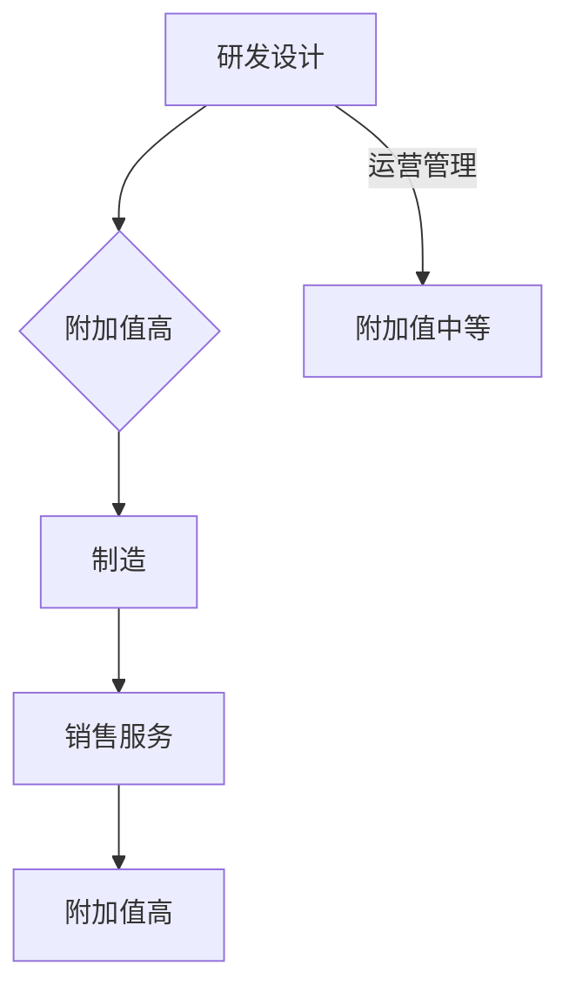

# 价值微笑曲线与AI公司的位置

> 关键词：价值微笑曲线，AI公司，商业模式，产业链，创新，价值链，成本，利润

## 1. 背景介绍

在当今的全球商业环境中，价值微笑曲线是一个重要的概念，它描绘了产品从设计到制造再到销售的全过程，其中不同环节的价值分布。价值微笑曲线理论认为，附加值最高的环节通常位于曲线的两侧——即设计和销售两端，而附加值较低的制造环节则位于曲线的中间部分。这一理论为企业提供了战略定位的指导，尤其是在全球化的今天，企业需要在全球范围内优化资源配置，以实现最大的价值。

随着人工智能（AI）技术的快速发展，AI公司如何在价值微笑曲线中找到自己的位置，成为一个值得探讨的问题。AI公司不仅需要掌握技术核心，还需要在商业模式、产业链整合等方面有所突破，才能在竞争激烈的市场中脱颖而出。

## 2. 核心概念与联系

### 2.1 价值微笑曲线

价值微笑曲线由美国管理学家威廉·金斯伯格（William Kingo）在1986年提出。它描述了一个产品的价值分布，通常呈现为微笑状。以下是价值微笑曲线的Mermaid流程图：



### 2.2 核心概念联系

在价值微笑曲线中，研发设计（R&D）和销售服务环节附加值较高，因为它们涉及到创新、品牌建设、客户关系管理等。制造环节由于竞争激烈，附加值较低。而运营管理环节则处于中间位置，附加值中等。

对于AI公司而言，要在价值微笑曲线中占据有利位置，就需要在研发设计、销售服务、以及产业链整合等方面有所作为。

## 3. 核心算法原理 & 具体操作步骤

### 3.1 算法原理概述

AI公司的核心算法原理在于利用机器学习、深度学习等技术，通过数据驱动的方式解决问题。具体操作步骤包括数据收集、模型训练、模型部署等。

### 3.2 算法步骤详解

1. **数据收集**：收集与业务相关的数据，包括结构化数据和非结构化数据。

2. **数据预处理**：对收集到的数据进行清洗、归一化等处理，以便于模型训练。

3. **模型选择**：根据任务类型选择合适的模型，如分类、回归、聚类等。

4. **模型训练**：使用预处理后的数据训练模型，调整模型参数，优化模型性能。

5. **模型评估**：使用测试集评估模型性能，调整模型结构或参数，直至满足要求。

6. **模型部署**：将训练好的模型部署到实际应用场景中，进行实时预测或决策。

### 3.3 算法优缺点

**优点**：

- **高效性**：AI模型可以快速处理大量数据，提高工作效率。
- **准确性**：在许多任务上，AI模型的准确性优于人类。
- **可扩展性**：AI模型可以轻松扩展到新的任务和数据集。

**缺点**：

- **数据依赖性**：AI模型对数据质量要求较高，数据不足或质量差会导致模型性能下降。
- **可解释性**：许多AI模型（如深度学习模型）缺乏可解释性，难以理解其决策过程。
- **计算资源**：训练和运行AI模型需要较高的计算资源。

### 3.4 算法应用领域

AI技术在多个领域都有广泛的应用，包括：

- **金融**：风险管理、欺诈检测、投资建议等。
- **医疗**：疾病诊断、药物研发、健康管理等。
- **零售**：个性化推荐、需求预测等。
- **交通**：自动驾驶、交通流量预测等。

## 4. 数学模型和公式 & 详细讲解 & 举例说明

### 4.1 数学模型构建

在AI领域中，常见的数学模型包括：

- **线性回归**：用于预测连续值。
- **逻辑回归**：用于预测离散值（如二分类）。
- **支持向量机（SVM）**：用于分类和回归任务。
- **深度学习模型**：如卷积神经网络（CNN）、循环神经网络（RNN）、Transformer等。

### 4.2 公式推导过程

以下以线性回归为例，介绍公式推导过程。

假设我们有一个线性回归模型：

$$
y = wx + b
$$

其中，$y$ 为预测值，$x$ 为输入特征，$w$ 为权重，$b$ 为偏置。

为了最小化预测值与真实值之间的误差，我们需要找到最优的权重和偏置。可以使用最小二乘法进行求解：

$$
w = \frac{\sum_{i=1}^n (y_i - wx_i)^2}{\sum_{i=1}^n x_i^2}
$$

$$
b = \frac{\sum_{i=1}^n (y_i - wx_i)}{n}
$$

### 4.3 案例分析与讲解

假设我们有一个简单的线性回归任务，目标是根据年龄预测一个人的收入。以下是相关数据：

| 年龄 | 收入 |
| ---- | ---- |
| 20   | 30   |
| 30   | 50   |
| 40   | 70   |
| 50   | 90   |

使用线性回归模型进行预测，可以得到以下结果：

- 权重 $w = 2.5$
- 偏置 $b = 10$

根据模型，预测年龄为40岁的人的收入为：

$$
y = 2.5 \times 40 + 10 = 100
$$

实际收入为70，误差为30。通过不断调整模型参数，可以减小误差，提高模型预测的准确性。

## 5. 项目实践：代码实例和详细解释说明

### 5.1 开发环境搭建

以下是一个简单的线性回归项目实践，我们将使用Python和Scikit-learn库进行实现。

```bash
pip install numpy scikit-learn matplotlib
```

### 5.2 源代码详细实现

```python
import numpy as np
import matplotlib.pyplot as plt
from sklearn.linear_model import LinearRegression

# 数据
ages = np.array([20, 30, 40, 50]).reshape(-1, 1)
salaries = np.array([30, 50, 70, 90])

# 创建线性回归模型
model = LinearRegression()

# 训练模型
model.fit(ages, salaries)

# 预测
predicted_salaries = model.predict(ages)

# 可视化
plt.scatter(ages, salaries, color='black')
plt.plot(ages, predicted_salaries, color='blue')
plt.title('线性回归')
plt.xlabel('年龄')
plt.ylabel('收入')
plt.show()
```

### 5.3 代码解读与分析

- `import numpy as np` 和 `import matplotlib.pyplot as plt` 用于导入NumPy和Matplotlib库。
- `from sklearn.linear_model import LinearRegression` 用于导入线性回归模型。
- 数据部分定义了年龄和收入，并使用NumPy的`reshape`方法将年龄数据转换为二维数组。
- 创建`LinearRegression`对象，用于初始化线性回归模型。
- 使用`fit`方法训练模型，将年龄和收入数据作为输入和目标值。
- 使用`predict`方法预测年龄对应的收入。
- 使用Matplotlib库的可视化功能，将年龄、收入和预测结果绘制成散点图和拟合线。

### 5.4 运行结果展示

运行上述代码后，将会得到一个包含散点图和拟合线的图形。散点图展示了年龄和收入之间的关系，拟合线展示了线性回归模型的预测结果。

## 6. 实际应用场景

AI技术在各个领域都有广泛的应用，以下是一些典型的应用场景：

### 6.1 金融

- 风险管理：利用AI模型分析历史数据，预测信用风险，降低坏账率。
- 欺诈检测：识别异常交易行为，防止金融欺诈。
- 投资建议：根据用户的风险偏好，推荐合适的投资组合。

### 6.2 医疗

- 疾病诊断：利用AI模型分析医学影像，辅助医生进行疾病诊断。
- 药物研发：利用AI模型加速新药研发过程。
- 健康管理：根据用户的生活习惯和健康状况，提供个性化的健康管理方案。

### 6.3 零售

- 个性化推荐：根据用户的购买记录和浏览行为，推荐合适的商品。
- 需求预测：根据历史销售数据，预测未来商品需求，优化库存管理。
- 供应链优化：利用AI模型优化供应链管理，降低成本，提高效率。

## 7. 工具和资源推荐

### 7.1 学习资源推荐

- 《深度学习》：Goodfellow等著，全面介绍深度学习理论和实践。
- 《Python机器学习》：Sebastian Raschka著，讲解Python在机器学习领域的应用。
- 《动手学深度学习》：花书，提供丰富的深度学习实践案例。

### 7.2 开发工具推荐

- TensorFlow：由Google开发的开源深度学习框架。
- PyTorch：由Facebook开发的开源深度学习框架。
- Keras：基于TensorFlow和Theano的开源深度学习库。

### 7.3 相关论文推荐

- 《Deep Learning for Natural Language Processing》：全面介绍深度学习在自然语言处理领域的应用。
- 《The Unreasonable Effectiveness of Deep Learning》：介绍深度学习的应用和未来趋势。
- 《Generative Adversarial Nets》：介绍生成对抗网络（GAN）及其在图像生成领域的应用。

## 8. 总结：未来发展趋势与挑战

### 8.1 研究成果总结

AI技术正在快速发展，并在各个领域取得显著的成果。AI公司的商业模式和发展策略也在不断演变，以适应市场的变化。

### 8.2 未来发展趋势

- **跨学科融合**：AI技术将与生物、物理、化学等学科深度融合，产生更多创新应用。
- **边缘计算**：AI模型将应用于边缘设备，实现实时、低延迟的智能应用。
- **可解释AI**：可解释的AI技术将得到发展，提高AI模型的透明度和可信度。

### 8.3 面临的挑战

- **数据隐私**：如何保护用户数据隐私，是AI技术发展面临的重要挑战。
- **算法偏见**：AI模型可能存在算法偏见，需要采取措施消除偏见。
- **就业影响**：AI技术可能对某些工作岗位造成冲击，需要关注就业转型。

### 8.4 研究展望

未来，AI技术将在更多领域发挥重要作用，推动社会进步。AI公司需要不断创新，应对挑战，才能在价值微笑曲线中找到自己的位置，实现可持续发展。

## 9. 附录：常见问题与解答

**Q1：AI公司的核心竞争力是什么？**

A：AI公司的核心竞争力在于技术实力、数据资源、人才队伍和商业模式。

**Q2：AI技术如何影响商业模式？**

A：AI技术可以帮助企业提高效率、降低成本、提升客户体验，从而优化商业模式。

**Q3：AI公司如何应对数据隐私和安全挑战？**

A：AI公司需要采取措施保护用户数据隐私，如数据加密、匿名化等，并加强安全防护措施。

**Q4：AI技术如何影响就业市场？**

A：AI技术可能对某些工作岗位造成冲击，但也会创造新的就业机会。需要关注就业转型，提高劳动者的技能水平。

**Q5：AI公司的未来发展方向是什么？**

A：AI公司的未来发展方向包括技术创新、行业应用拓展、商业模式创新等。

---

作者：禅与计算机程序设计艺术 / Zen and the Art of Computer Programming