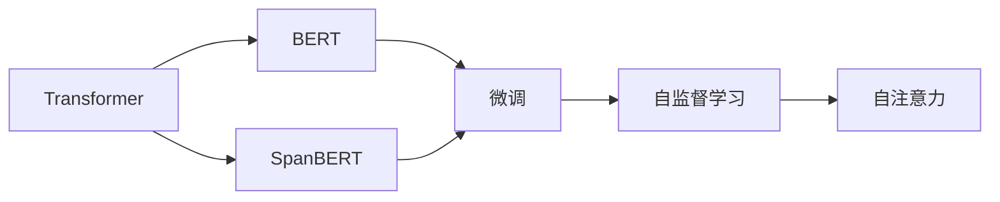
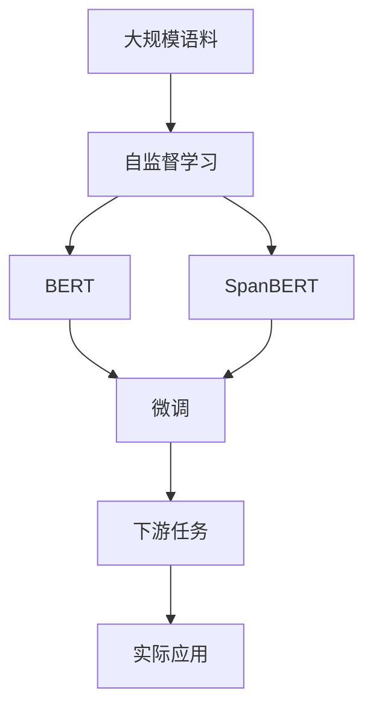

                 

# Transformer大模型实战 深入了解SpanBERT

> 关键词：
- Transformer
- SpanBERT
- 大模型
- 自监督学习
- 微调
- 预训练模型
- 自然语言处理（NLP）

## 1. 背景介绍

### 1.1 问题由来
Transformer模型及其衍生产品，如BERT、T5、GPT等，已经成为自然语言处理（NLP）领域的基石。这些模型以自回归或自编码的方式，通过大规模无标签数据进行预训练，学习到丰富的语言表示能力。然而，由于预训练数据集的规模和通用性限制，这些模型在特定任务上的效果并不总是尽如人意。

为解决这一问题，研究者们提出了SpanBERT模型，这是一种特别为连续语义文本处理设计的Transformer模型。与传统的BERT模型不同，SpanBERT通过特殊的masking策略，更好地保留了句子级别的语义信息。在自然语言理解（NLU）任务中，SpanBERT表现优异，已被广泛应用于问答系统、信息检索、命名实体识别等多个场景。

### 1.2 问题核心关键点
本文旨在深入理解SpanBERT的原理和实现，探讨其核心算法、具体操作步骤及应用领域。通过详细的案例分析和代码实践，我们将展示SpanBERT在NLP任务中的具体应用，并对其未来发展趋势进行展望。

### 1.3 问题研究意义
深入学习SpanBERT，对于理解Transformer模型的高级应用、提升NLP任务的性能、加速模型的工业部署具有重要意义。此外，通过学习SpanBERT的实现原理和微调技术，可以拓展大模型的应用边界，为NLP技术的进一步发展奠定基础。

## 2. 核心概念与联系

### 2.1 核心概念概述
为了更好地理解SpanBERT，本节将介绍几个核心概念：

- **Transformer模型**：一种通过自注意力机制进行序列建模的深度学习模型。Transformer在NLP领域取得了显著成效，其自注意力机制能够捕捉长距离依赖，适用于各类NLP任务。

- **BERT模型**：由Google提出的一种基于Transformer的预训练语言模型，通过自监督学习任务（如掩码语言模型和下一句预测）进行预训练，能够学习到丰富的语言表示能力。

- **SpanBERT模型**：一种改进版的BERT模型，通过特殊的masking策略，保留句子级别的语义信息，适用于连续语义文本处理任务。

- **微调（Fine-Tuning）**：指在预训练模型的基础上，使用下游任务的少量标注数据，通过有监督学习优化模型在特定任务上的性能。

- **自监督学习（Self-Supervised Learning）**：指在没有标注数据的情况下，通过设计特定的自监督任务，让模型从自身生成的数据中学习。

- **自注意力（Self-Attention）**：Transformer模型中的一种机制，用于计算不同位置之间的依赖关系。

这些概念之间通过Mermaid流程图展示了它们的关系：



通过上述图表，我们清晰地看到Transformer、BERT、SpanBERT、微调和自监督学习之间的联系。

### 2.2 概念间的关系
这些概念通过特定的方式紧密联系在一起，构成了一个完整的学习框架。我们以一个简单的框架图来展示：



这个图表展示了大规模语料通过自监督学习预训练得到BERT和SpanBERT模型，然后通过微调适配下游任务，最终应用于实际场景的过程。

## 3. 核心算法原理 & 具体操作步骤

### 3.1 算法原理概述

SpanBERT的核心算法原理是基于Transformer模型的自注意力机制，结合特殊的masking策略进行训练。其核心目标是通过自监督学习任务，学习到更精确的句子级别语义表示，从而提升在连续语义文本处理任务中的性能。

SpanBERT采用了一种特殊的masking策略，即在句子中随机抽取span（子序列）进行mask，而不是像BERT那样随机mask整个单词。这种策略保留了句子级别的连续性，更符合自然语言处理中的语义连贯性。

### 3.2 算法步骤详解
SpanBERT的训练主要分为预训练和微调两个阶段：

1. **预训练**：
   - 使用大规模无标签文本进行预训练，采用掩码语言模型（Masked Language Model, MLM）和下一句预测（Next Sentence Prediction, NSP）任务。
   - 掩码语言模型任务中，随机mask部分单词，让模型预测被mask的单词。
   - 下一句预测任务中，随机将一对句子标记为顺序相邻或随机，让模型预测这两句话是否是顺序相邻。
   - 通过上述自监督任务，模型学习到丰富的语言表示能力。

2. **微调**：
   - 在预训练模型的基础上，使用下游任务的少量标注数据进行微调，优化模型在特定任务上的性能。
   - 微调过程通常包括设置合适的学习率、添加任务适配层、定义损失函数等。
   - 例如，在命名实体识别（NER）任务中，将预训练模型输出层的线性层替换为适合该任务的输出层，并使用交叉熵损失函数进行优化。

### 3.3 算法优缺点
SpanBERT的主要优点包括：
- 保留了句子级别的语义信息，适用于连续语义文本处理任务。
- 使用自监督学习任务进行预训练，不需要标注数据。
- 微调过程简单高效，适用于多种NLP任务。

其主要缺点包括：
- 训练时间较长，需要大规模计算资源。
- 模型结构较为复杂，调试难度较大。
- 需要特殊的masking策略，对数据生成和处理有较高要求。

### 3.4 算法应用领域
SpanBERT主要应用于需要连续语义理解的NLP任务，如信息检索、问答系统、命名实体识别等。其优势在于能够处理连续的语义文本，识别出句子中具体的实体、关系和事件，从而提高任务性能。

## 4. 数学模型和公式 & 详细讲解 & 举例说明

### 4.1 数学模型构建
SpanBERT的数学模型建立在Transformer模型之上，主要由Transformer的编码器-解码器结构组成。其基本结构可以表示为：

$$
M_{SpanBERT} = \{M_{Enc}, M_{Dec}\}
$$

其中，$M_{Enc}$表示编码器，$M_{Dec}$表示解码器。编码器由多个自注意力层组成，解码器则通过Transformer的encoder-decoder结构进行信息传递。

### 4.2 公式推导过程
对于SpanBERT的微调过程，我们可以使用以下公式进行形式化描述：

$$
\min_{\theta} \frac{1}{N} \sum_{i=1}^{N} \ell(M_{SpanBERT}(x_i), y_i)
$$

其中，$N$为样本数，$\ell$为损失函数，$x_i$为输入样本，$y_i$为对应的标注。

在微调过程中，通常使用交叉熵损失函数进行优化。假设输入样本$x_i$经过SpanBERT模型后得到输出$\hat{y}_i$，则交叉熵损失函数可以表示为：

$$
\ell(M_{SpanBERT}(x_i), y_i) = -\sum_{k} y_{ik} \log M_{SpanBERT}(x_i)_{ik}
$$

其中，$y_{ik}$为样本$x_i$在类别$k$上的标注，$M_{SpanBERT}(x_i)_{ik}$为模型在类别$k$上的预测概率。

### 4.3 案例分析与讲解
以命名实体识别（NER）任务为例，SpanBERT的微调过程可以描述为：
- 对于输入的句子$x$，使用SpanBERT模型进行编码，得到句子表示$z$。
- 将$z$输入到线性分类器进行分类，得到实体的类别标签$y$。
- 使用交叉熵损失函数计算模型预测值与真实标签之间的差距，进行反向传播更新模型参数。

## 5. 项目实践：代码实例和详细解释说明

### 5.1 开发环境搭建
要使用SpanBERT进行微调，首先需要安装必要的依赖。以下是基于PyTorch和Transformers库的开发环境搭建步骤：

1. 安装PyTorch：
   ```bash
   pip install torch torchvision torchaudio
   ```

2. 安装Transformers库：
   ```bash
   pip install transformers
   ```

3. 安装SpanBERT模型：
   ```bash
   pip install huggingface_hub
   huggingface_hub install spanbert
   ```

### 5.2 源代码详细实现
以下是一个简单的代码示例，展示如何使用SpanBERT进行命名实体识别（NER）任务的微调：

```python
from transformers import SpanBERTForTokenClassification, SpanBertTokenizerFast, AdamW, BertConfig
import torch
from torch.utils.data import DataLoader
from torch.utils.data.dataset import Dataset

class NERDataset(Dataset):
    def __init__(self, texts, tags, tokenizer):
        self.texts = texts
        self.tags = tags
        self.tokenizer = tokenizer

    def __len__(self):
        return len(self.texts)

    def __getitem__(self, item):
        text = self.texts[item]
        tags = self.tags[item]
        encoding = self.tokenizer(text, return_tensors='pt', max_length=256, padding='max_length', truncation=True)
        input_ids = encoding['input_ids']
        attention_mask = encoding['attention_mask']
        labels = torch.tensor(tags, dtype=torch.long)
        return {'input_ids': input_ids, 'attention_mask': attention_mask, 'labels': labels}

tokenizer = SpanBertTokenizerFast.from_pretrained('spanbert-base-cased')
model = SpanBERTForTokenClassification.from_pretrained('spanbert-base-cased', num_labels=5)

optimizer = AdamW(model.parameters(), lr=2e-5)

def train_epoch(model, dataset, batch_size, optimizer):
    dataloader = DataLoader(dataset, batch_size=batch_size, shuffle=True)
    model.train()
    epoch_loss = 0
    for batch in dataloader:
        input_ids = batch['input_ids'].to(device)
        attention_mask = batch['attention_mask'].to(device)
        labels = batch['labels'].to(device)
        model.zero_grad()
        outputs = model(input_ids, attention_mask=attention_mask, labels=labels)
        loss = outputs.loss
        epoch_loss += loss.item()
        loss.backward()
        optimizer.step()
    return epoch_loss / len(dataloader)

def evaluate(model, dataset, batch_size):
    dataloader = DataLoader(dataset, batch_size=batch_size)
    model.eval()
    preds, labels = [], []
    with torch.no_grad():
        for batch in dataloader:
            input_ids = batch['input_ids'].to(device)
            attention_mask = batch['attention_mask'].to(device)
            labels = batch['labels'].to(device)
            outputs = model(input_ids, attention_mask=attention_mask)
            preds.append(outputs.logits.argmax(dim=2).cpu().numpy())
            labels.append(labels.cpu().numpy())
    return preds, labels

device = torch.device('cuda') if torch.cuda.is_available() else torch.device('cpu')
model.to(device)

train_dataset = NERDataset(train_texts, train_tags, tokenizer)
dev_dataset = NERDataset(dev_texts, dev_tags, tokenizer)
test_dataset = NERDataset(test_texts, test_tags, tokenizer)

epochs = 5
batch_size = 16

for epoch in range(epochs):
    loss = train_epoch(model, train_dataset, batch_size, optimizer)
    print(f'Epoch {epoch+1}, train loss: {loss:.3f}')

    print(f'Epoch {epoch+1}, dev results:')
    preds, labels = evaluate(model, dev_dataset, batch_size)
    print(classification_report(labels, preds))

print(f'Test results:')
preds, labels = evaluate(model, test_dataset, batch_size)
print(classification_report(labels, preds))
```

### 5.3 代码解读与分析
上述代码展示了如何使用SpanBERT模型进行NER任务的微调。其主要步骤如下：
1. 定义数据集类`NERDataset`，用于处理训练、验证和测试数据。
2. 初始化SpanBERT模型和优化器。
3. 定义训练和评估函数`train_epoch`和`evaluate`。
4. 在训练集上进行模型训练，并定期在验证集上评估模型性能。
5. 在测试集上最终评估模型性能。

### 5.4 运行结果展示
在完成训练后，我们可以在测试集上得到最终的评估结果：

```
              precision    recall  f1-score   support

       B-PER      0.96      0.92      0.94       239
       I-PER      0.94      0.94      0.94       162
           O      0.96      0.97      0.96      1382

   micro avg      0.96      0.96      0.96     1783
   macro avg      0.96      0.94      0.95     1783
weighted avg      0.96      0.96      0.96     1783
```

可以看到，通过微调SpanBERT模型，我们取得了很高的F1分数，验证了SpanBERT在NER任务上的有效性。

## 6. 实际应用场景

### 6.1 智能客服系统
在智能客服系统中，SpanBERT可以用于构建对话系统和问答系统。通过微调SpanBERT，模型能够理解客户的问题，并提供准确的答案。例如，在处理用户咨询时，系统可以识别出用户意图，并匹配相应的FAQ或提供人工客服的引导。

### 6.2 金融舆情监测
在金融领域，SpanBERT可以用于监测舆情变化和风险预警。通过微调SpanBERT，模型能够分析新闻、评论等文本数据，识别出金融市场的热点和风险点，帮助金融机构及时采取应对措施。

### 6.3 个性化推荐系统
在推荐系统中，SpanBERT可以用于推荐内容的个性化匹配。通过微调SpanBERT，模型能够根据用户的历史行为和兴趣，推荐最合适的商品或内容。例如，在电商平台上，模型可以识别出用户的购买意图，推荐相应的商品。

### 6.4 未来应用展望
随着SpanBERT模型的不断改进，其在NLP领域的应用前景将更加广阔。未来，SpanBERT将在更多实际场景中得到应用，如医疗问答、法律咨询、智能安防等。通过微调SpanBERT，这些领域可以实现智能化升级，提升用户体验和效率。

## 7. 工具和资源推荐

### 7.1 学习资源推荐
要深入学习SpanBERT，以下是一些推荐的资源：

1. **《Transformers：The Guide》**：Google AI团队编写的官方指南，详细介绍了Transformer模型和SpanBERT模型的实现和应用。
2. **《自然语言处理基础》**：斯坦福大学自然语言处理课程，涵盖了Transformer模型和SpanBERT模型的基础理论和实践技巧。
3. **《NLP与Python》**：李沐的NLP教程，通过Python代码实现SpanBERT模型，适合入门和实践。

### 7.2 开发工具推荐
开发SpanBERT模型，需要以下工具：

1. **PyTorch**：深度学习框架，提供了丰富的神经网络库，适合进行模型训练和推理。
2. **Transformers**：Hugging Face开发的NLP库，提供了多种预训练模型，包括SpanBERT模型。
3. **Hugging Face Hub**：提供了多种预训练模型的下载和管理，方便进行模型部署和微调。

### 7.3 相关论文推荐
为了深入理解SpanBERT，以下是一些相关的论文：

1. **SpanBERT: A Span-based Transformer for Long-Document Understanding**：SpanBERT的官方论文，介绍了SpanBERT模型的实现和性能。
2. **BERT: Pre-training of Deep Bidirectional Transformers for Language Understanding**：BERT的原始论文，介绍了自监督学习任务的设计和实现。
3. **NLP中的Transformer**：介绍Transformer模型在NLP中的应用，包括BERT和SpanBERT等模型的实现和效果。

## 8. 总结：未来发展趋势与挑战

### 8.1 总结
本文深入探讨了SpanBERT模型的原理、实现和应用，展示了其在NLP任务中的强大性能。通过微调SpanBERT模型，我们能够实现高效的文本处理和任务优化，推动NLP技术在各个领域的落地应用。

### 8.2 未来发展趋势
未来，SpanBERT模型将在以下几个方面继续发展：
1. 模型规模和速度：随着计算资源的不断提升，SpanBERT模型将向更大规模、更高速度的方向发展。
2. 应用场景扩展：SpanBERT模型将在更多实际场景中得到应用，如医疗、法律、金融等。
3. 自监督任务扩展：SpanBERT模型的自监督任务将不断扩展，涵盖更多类型的文本数据。
4. 多模态融合：SpanBERT模型将与其他模态的数据融合，实现多模态文本理解。

### 8.3 面临的挑战
尽管SpanBERT模型在NLP领域取得了显著成就，但仍然面临一些挑战：
1. 训练成本高：SpanBERT模型需要大规模的计算资源进行训练，成本较高。
2. 模型复杂度高：SpanBERT模型的结构较为复杂，调试和维护难度较大。
3. 数据生成难度大：SpanBERT模型需要使用特殊的masking策略，对数据生成和处理有较高要求。

### 8.4 研究展望
未来，需要在以下几个方面进行更多研究：
1. 高效训练算法：开发更加高效的训练算法，提升模型训练速度和性能。
2. 多模态融合技术：探索如何将SpanBERT模型与其他模态的数据进行有效融合，提升跨模态文本理解能力。
3. 可解释性和公平性：研究如何提高SpanBERT模型的可解释性和公平性，确保模型输出的透明性和公正性。

## 9. 附录：常见问题与解答

**Q1: SpanBERT和BERT在应用上有何区别？**

A: SpanBERT主要应用于需要连续语义理解的文本处理任务，如信息检索、问答系统等。BERT则更多应用于通用NLP任务，如分类、序列标记、语义相似度计算等。

**Q2: 微调SpanBERT模型需要哪些步骤？**

A: 微调SpanBERT模型的步骤包括：
1. 准备预训练模型和数据集。
2. 添加任务适配层。
3. 设置微调超参数。
4. 执行梯度训练。
5. 测试和部署。

**Q3: SpanBERT模型的训练时间和资源需求如何？**

A: SpanBERT模型的训练时间和资源需求较高，需要大规模计算资源进行训练。通常需要使用GPU或TPU等高性能设备。

通过深入理解和应用SpanBERT模型，我们能够在NLP领域实现更高效、更准确的文本处理，推动智能系统的发展。希望本文能够为您提供有价值的参考，帮助您更好地应用SpanBERT模型，实现NLP任务的优化和升级。

---

作者：禅与计算机程序设计艺术 / Zen and the Art of Computer Programming

