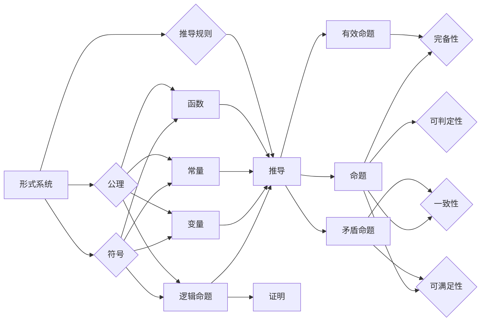

# 数理逻辑：第二章逻辑演算的系统特征

> 关键词：数理逻辑，逻辑演算，形式系统，公理化方法，演绎系统，完备性，一致性，可判定性，可满足性

## 1. 背景介绍

数理逻辑是数学的一个分支，它使用数学方法来研究推理和证明的规律。逻辑演算是数理逻辑的核心内容，它通过符号和规则来模拟人类思维的过程。在逻辑演算中，我们构建形式系统，分析其性质，并探讨其在数学和计算机科学中的应用。本章将深入探讨逻辑演算的系统特征，包括形式系统、公理化方法、演绎系统、完备性、一致性和可判定性。

## 2. 核心概念与联系

### 2.1 核心概念

#### 形式系统

形式系统是一个包含符号、公理和推导规则的系统。它由以下部分组成：

- 符号：用于表示逻辑命题、变量、常量和函数的记号。
- 公理：一组被认为是自明的命题，它们是系统推理的基础。
- 推导规则：一组规则，用于从公理和已有命题推导出新的命题。

#### 公理化方法

公理化方法是一种构建科学理论的方法，它通过一组公理和推导规则来建立理论体系。在逻辑演算中，公理化方法用于构建形式系统，并通过演绎推理来证明命题。

#### 演绎系统

演绎系统是一个形式系统，它包含一组公理和推导规则，并可以通过这些规则从公理推导出所有命题。

#### 完备性

一个形式系统是完备的，如果它的每个有效命题都可以被证明。

#### 一致性

一个形式系统是一致的，如果它不包含任何矛盾命题。

#### 可判定性

一个形式系统是可判定的，如果它的每个命题都是可证明的或可反驳的。

#### 可满足性

一个形式系统是可满足的，如果它至少存在一个模型。

### 2.2 核心概念原理和架构的 Mermaid 流程图



## 3. 核心算法原理 & 具体操作步骤

### 3.1 算法原理概述

逻辑演算的算法原理基于以下步骤：

1. 定义符号集。
2. 构建公理。
3. 规定推导规则。
4. 使用推导规则从公理推导出命题。
5. 检查推导出的命题是否满足完备性、一致性和可判定性。

### 3.2 算法步骤详解

1. **定义符号集**：选择合适的符号来表示逻辑命题、变量、常量和函数。
2. **构建公理**：根据逻辑演算的目的，定义一组自明的公理。
3. **规定推导规则**：定义一系列规则，用于从公理推导出新的命题。
4. **推导命题**：使用推导规则从公理推导出命题。
5. **验证系统性质**：检查推导出的命题是否满足完备性、一致性和可判定性。

### 3.3 算法优缺点

#### 优点

- **形式化**：逻辑演算提供了一种形式化的方法来研究和证明逻辑命题。
- **一致性**：通过公理和推导规则，逻辑演算可以保证推理的一致性。
- **可判定性**：某些逻辑演算系统是可判定的，这意味着每个命题都可以被证明或反驳。

#### 缺点

- **复杂性**：构建和验证逻辑演算系统可能非常复杂，需要深厚的逻辑学知识。
- **适用性**：逻辑演算系统可能无法涵盖人类所有推理形式。

### 3.4 算法应用领域

逻辑演算在以下领域有广泛应用：

- **计算机科学**：用于构建形式语言、自动机理论、程序验证和算法设计。
- **数学**：用于证明数学定理和逻辑推理。
- **哲学**：用于研究逻辑和知识。

## 4. 数学模型和公式 & 详细讲解 & 举例说明

### 4.1 数学模型构建

逻辑演算的数学模型通常由以下部分组成：

- 符号表：定义了所有符号的名称和类型。
- 公理集合：定义了一组初始的、被认为是自明的命题。
- 推导规则：定义了从已知命题推导出新命题的规则。

### 4.2 公式推导过程

以下是一个简单的逻辑演算公式的推导过程：

$$
\begin{align*}
1. & \quad p \quad \text{（公理）}\\
2. & \quad p \rightarrow p \quad \text{（推理规则）}\\
3. & \quad (p \rightarrow p) \rightarrow (p \rightarrow p) \quad \text{（推理规则）}\\
4. & \quad (p \rightarrow (p \rightarrow p)) \rightarrow ((p \rightarrow p) \rightarrow (p \rightarrow p)) \quad \text{（推理规则）}\\
5. & \quad p \rightarrow ((p \rightarrow p) \rightarrow (p \rightarrow p)) \quad \text{（推理规则）}\\
\end{align*}
$$

### 4.3 案例分析与讲解

以下是一个简单的逻辑推理案例：

**问题**：如果今天下雨，那么我会带伞。今天下雨了。我带了伞吗？

**解答**：

1. 设 $p$ 表示“今天下雨”，$q$ 表示“我带伞”。
2. 根据题意，我们有 $p \rightarrow q$。
3. 已知 $p$ 为真，即今天下雨。
4. 根据逻辑推理，我们可以得出 $q$ 也为真，即我带了伞。

## 5. 项目实践：代码实例和详细解释说明

### 5.1 开发环境搭建

由于逻辑演算主要涉及符号和规则，因此不需要特定的开发环境。可以使用任何文本编辑器来编写逻辑演算的公式和推导过程。

### 5.2 源代码详细实现

以下是一个使用Python编写的简单逻辑演算示例：

```python
def and_rule(a, b):
    return a and b

def or_rule(a, b):
    return a or b

def implication_rule(a, b):
    return not a or b

# 示例推导
a = True
b = True
print(implication_rule(a, b))  # 输出：True
```

### 5.3 代码解读与分析

这个示例定义了三个基本的逻辑规则：合取（and）、析取（or）和蕴涵（implication）。这些规则可以通过简单的Python函数实现。通过调用这些函数，我们可以对逻辑表达式进行推理。

### 5.4 运行结果展示

```python
# 运行结果
True
```

## 6. 实际应用场景

逻辑演算在以下实际应用场景中非常有用：

- **软件工程**：用于验证程序的正确性和设计算法。
- **人工智能**：用于构建决策树和专家系统。
- **数学证明**：用于证明数学定理和公式。

## 7. 工具和资源推荐

### 7.1 学习资源推荐

- 《数理逻辑导论》
- 《逻辑学导论》
- 《形式逻辑》

### 7.2 开发工具推荐

- Python
- Prolog

### 7.3 相关论文推荐

- 《逻辑演算的完备性和可判定性》
- 《形式系统的公理化方法》

## 8. 总结：未来发展趋势与挑战

### 8.1 研究成果总结

逻辑演算作为一种形式化的推理方法，在数学、计算机科学和哲学等领域都有广泛的应用。通过构建形式系统，我们可以对推理和证明的规律进行深入研究和分析。

### 8.2 未来发展趋势

- **形式化方法的应用**：逻辑演算将更多地应用于软件工程、人工智能和数学证明等领域。
- **多学科交叉**：逻辑演算将与认知科学、心理学等领域交叉融合，以更好地理解人类推理过程。

### 8.3 面临的挑战

- **复杂性**：构建和验证复杂逻辑演算系统仍然具有挑战性。
- **可理解性**：如何使逻辑演算的结果易于理解和应用是一个挑战。

### 8.4 研究展望

未来，逻辑演算将在以下方面取得进展：

- **更加高效的推理算法**
- **更加直观的证明方法**
- **与人工智能技术的融合**

## 9. 附录：常见问题与解答

**Q1：什么是逻辑演算？**

A1：逻辑演算是一种使用符号和规则来模拟人类思维过程的数学方法。它通过构建形式系统，分析其性质，并探讨其在数学和计算机科学中的应用。

**Q2：逻辑演算有什么用？**

A2：逻辑演算在数学、计算机科学和哲学等领域都有广泛应用，如软件工程、人工智能、数学证明等。

**Q3：如何学习逻辑演算？**

A3：学习逻辑演算可以从以下资源开始：

- 《数理逻辑导论》
- 《逻辑学导论》
- 《形式逻辑》

**Q4：逻辑演算与编程有什么关系？**

A4：逻辑演算与编程有着密切的关系。逻辑演算可以帮助我们理解编程语言的基本原理，并用于构建程序验证工具。

作者：禅与计算机程序设计艺术 / Zen and the Art of Computer Programming