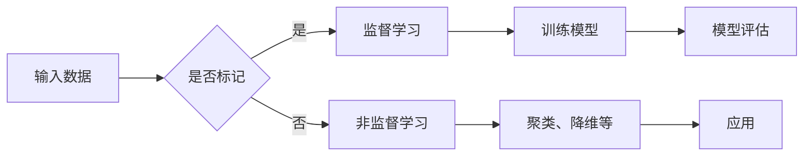

> 关键词：机器学习，监督学习，非监督学习，强化学习，深度学习，算法原理，Python实现，项目实践

# 机器学习(Machine Learning) - 原理与代码实例讲解

## 1. 背景介绍

机器学习作为人工智能领域的一个核心分支，已经成为改变世界的驱动力之一。它通过让计算机从数据中学习，从而无需明确编程指令就能完成特定任务。从推荐系统到自动驾驶，从语音识别到医疗诊断，机器学习技术的应用无处不在。

本文将深入探讨机器学习的核心概念、算法原理，并通过Python代码实例进行讲解，帮助读者全面理解机器学习。

## 2. 核心概念与联系

### 2.1 核心概念

- **监督学习（Supervised Learning）**：通过带有标签的训练数据来训练模型，使得模型能够对未知数据进行预测或分类。
- **非监督学习（Unsupervised Learning）**：没有标签的数据，模型通过发现数据中的结构或模式来进行学习。
- **强化学习（Reinforcement Learning）**：通过与环境交互，学习最大化奖励信号的行为。
- **深度学习（Deep Learning）**：一种特殊的机器学习方法，使用深层神经网络来学习数据表示。

### 2.2 核心概念原理和架构的 Mermaid 流程图



## 3. 核心算法原理 & 具体操作步骤

### 3.1 算法原理概述

#### 3.1.1 监督学习

监督学习算法通过学习输入数据和输出标签之间的关系来预测新的数据点。常见的监督学习算法包括线性回归、逻辑回归、支持向量机（SVM）、决策树、随机森林等。

#### 3.1.2 非监督学习

非监督学习算法在无标签数据上工作，寻找数据的内在结构。常见的非监督学习算法包括K-均值聚类、主成分分析（PCA）、自编码器等。

#### 3.1.3 强化学习

强化学习算法通过尝试不同的动作并从环境中获得奖励来学习最优策略。常见的强化学习算法包括Q学习、深度Q网络（DQN）、策略梯度等。

#### 3.1.4 深度学习

深度学习是机器学习的一个子集，它使用多层神经网络来学习数据表示。深度学习在图像识别、语音识别等领域取得了显著的成功。

### 3.2 算法步骤详解

#### 3.2.1 监督学习

1. 数据收集：收集用于训练的数据集。
2. 数据预处理：清洗和转换数据，使其适合模型训练。
3. 模型选择：选择合适的算法模型。
4. 模型训练：使用训练数据训练模型。
5. 模型评估：使用验证集评估模型性能。
6. 模型优化：根据评估结果调整模型参数。

#### 3.2.2 非监督学习

1. 数据收集：收集数据集。
2. 数据预处理：与监督学习类似。
3. 算法选择：选择合适的非监督学习算法。
4. 模型训练：训练非监督学习模型。
5. 结果分析：分析模型的输出结果。

#### 3.2.3 强化学习

1. 环境定义：定义强化学习的问题环境。
2. 策略定义：定义如何选择动作。
3. 模型训练：训练强化学习模型。
4. 策略评估：评估策略的有效性。

### 3.3 算法优缺点

#### 3.3.1 监督学习

优点：
- 精确度较高。
- 应用范围广泛。

缺点：
- 需要大量的标注数据。
- 对于复杂问题，模型可能过拟合。

#### 3.3.2 非监督学习

优点：
- 不需要标注数据。
- 可以发现数据中的隐藏结构。

缺点：
- 精确度通常低于监督学习。
- 结果解释性较差。

#### 3.3.3 强化学习

优点：
- 可以解决复杂问题。
- 可以学习到最优策略。

缺点：
- 训练时间较长。
- 需要复杂的奖励设计。

#### 3.3.4 深度学习

优点：
- 在某些任务上表现优异。
- 自动学习特征。

缺点：
- 计算资源需求高。
- 模型可解释性差。

### 3.4 算法应用领域

- **监督学习**：图像识别、语音识别、文本分类、推荐系统等。
- **非监督学习**：聚类、降维、异常检测等。
- **强化学习**：自动驾驶、游戏、机器人等。
- **深度学习**：图像识别、语音识别、自然语言处理等。

## 4. 数学模型和公式 & 详细讲解 & 举例说明

### 4.1 数学模型构建

机器学习中的数学模型通常包括输入层、隐藏层和输出层。每个层由多个神经元组成，神经元之间的连接由权重表示。

### 4.2 公式推导过程

以线性回归为例，假设我们有输入向量 $x$ 和输出向量 $y$，模型的预测值 $y'$ 为：

$$
y' = Wx + b
$$

其中 $W$ 为权重，$b$ 为偏置。

### 4.3 案例分析与讲解

以下是一个使用Python实现线性回归的简单例子：

```python
import numpy as np

# 输入数据
X = np.array([[1], [2], [3], [4]])
y = np.array([1, 2, 2.5, 4])

# 计算权重和偏置
W = np.linalg.inv(X.T @ X) @ X.T @ y
b = y - W @ X

# 预测
y_pred = W @ X + b

# 输出预测结果
print("预测结果：", y_pred)
```

## 5. 项目实践：代码实例和详细解释说明

### 5.1 开发环境搭建

1. 安装Python和pip。
2. 安装机器学习库，如scikit-learn、TensorFlow、PyTorch等。

### 5.2 源代码详细实现

以下是一个使用scikit-learn实现分类任务的例子：

```python
from sklearn.datasets import load_iris
from sklearn.model_selection import train_test_split
from sklearn.ensemble import RandomForestClassifier

# 加载数据集
iris = load_iris()
X, y = iris.data, iris.target

# 划分训练集和测试集
X_train, X_test, y_train, y_test = train_test_split(X, y, test_size=0.2, random_state=42)

# 创建分类器
clf = RandomForestClassifier(n_estimators=100)

# 训练模型
clf.fit(X_train, y_train)

# 预测
y_pred = clf.predict(X_test)

# 输出预测结果
print("预测结果：", y_pred)
```

### 5.3 代码解读与分析

这段代码首先加载了Iris数据集，然后将其分为训练集和测试集。接着创建了一个随机森林分类器，并用训练数据训练模型。最后，使用测试数据对模型进行预测，并输出预测结果。

### 5.4 运行结果展示

运行上述代码，可以得到测试数据集上的预测结果，并与实际标签进行比较。

## 6. 实际应用场景

### 6.1 贷款审批

使用机器学习算法分析借款人的信用历史，预测其还款能力，从而决定是否批准贷款。

### 6.2 疾病诊断

使用机器学习算法分析医疗影像和患者数据，帮助医生诊断疾病。

### 6.3 语音识别

使用机器学习算法将语音信号转换为文本。

### 6.4 图片识别

使用机器学习算法识别图像中的对象和场景。

## 7. 工具和资源推荐

### 7.1 学习资源推荐

- 《机器学习》（周志华）
- 《统计学习方法》（李航）
- Coursera上的《机器学习》课程

### 7.2 开发工具推荐

- scikit-learn
- TensorFlow
- PyTorch

### 7.3 相关论文推荐

- "A Few Useful Things to Know about Machine Learning" by Pedro Domingos
- "The Unreasonable Effectiveness of Deep Learning" by Geoffrey Hinton

## 8. 总结：未来发展趋势与挑战

### 8.1 研究成果总结

机器学习作为人工智能的核心技术，已经取得了显著的进展。随着计算能力的提升和数据量的增加，机器学习将在更多领域得到应用。

### 8.2 未来发展趋势

- 深度学习将进一步发展，模型将更加复杂。
- 机器学习将与其他人工智能技术（如自然语言处理、计算机视觉）进一步融合。
- 机器学习将在更多领域得到应用。

### 8.3 面临的挑战

- 数据隐私和安全性问题。
- 模型可解释性问题。
- 模型偏见问题。

### 8.4 研究展望

未来，机器学习将朝着更加高效、安全、可解释的方向发展，为人类社会创造更多价值。

## 9. 附录：常见问题与解答

**Q1：机器学习与人工智能有何区别？**

A：机器学习是人工智能的一个子领域，它关注于通过算法从数据中学习。人工智能则是一个更广泛的概念，包括机器学习、自然语言处理、计算机视觉等多个领域。

**Q2：机器学习需要什么编程语言？**

A：Python是目前最受欢迎的机器学习编程语言，因为它拥有丰富的机器学习库和工具。

**Q3：机器学习有哪些应用？**

A：机器学习的应用非常广泛，包括推荐系统、自动驾驶、医疗诊断、金融分析等。

**Q4：机器学习需要大量的数据吗？**

A：机器学习的效果很大程度上取决于数据的质量和数量。对于一些复杂的任务，可能需要大量的数据。

**Q5：机器学习是否会导致失业？**

A：机器学习可以自动化许多重复性工作，但这并不意味着会导致大规模失业。相反，机器学习可以释放人类从繁琐的任务中解放出来，从事更有创造性和价值的工作。

作者：禅与计算机程序设计艺术 / Zen and the Art of Computer Programming