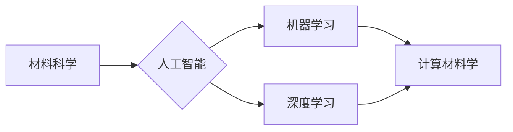

# 材料科学与AI的主战场

> 关键词：材料科学，人工智能，机器学习，深度学习，计算材料学，数据驱动设计

## 1. 背景介绍

材料科学是研究材料的性质、结构、制备和应用的科学，它对人类社会的发展产生了深远的影响。从古代的青铜器到现代的超导材料，材料科学的发展推动了人类文明的进步。然而，随着科技的不断进步，材料科学也面临着前所未有的挑战。传统的材料研发方法往往依赖于实验和经验，耗时费力，且难以满足快速发展的需求。近年来，人工智能（AI）技术的兴起为材料科学带来了新的机遇，将AI与材料科学相结合，成为了一个充满活力的研究领域。

### 1.1 问题的由来

传统材料科学的局限性主要体现在以下几个方面：

- **研发周期长**：新材料的研发往往需要大量的实验和长时间的迭代，导致研发周期长，成本高。
- **效率低**：传统的实验方法难以有效筛选出具有优异性能的材料。
- **难以预测**：材料的性能与其微观结构之间的关系复杂，难以准确预测。
- **缺乏创新**：传统的材料研发方法容易陷入经验主义，缺乏创新。

### 1.2 研究现状

随着AI技术的快速发展，越来越多的研究者开始尝试将AI应用于材料科学领域。目前，AI在材料科学中的应用主要集中在以下几个方面：

- **材料设计**：利用AI技术进行材料设计，可以快速生成具有特定性能的材料结构。
- **性能预测**：利用AI技术对材料的性能进行预测，可以减少实验次数，提高研发效率。
- **缺陷检测**：利用AI技术对材料缺陷进行检测，可以提高产品质量。
- **智能控制**：利用AI技术对材料制备过程进行智能控制，可以提高制备效率和产品质量。

### 1.3 研究意义

AI与材料科学的结合具有重要的研究意义：

- **缩短研发周期**：AI技术可以帮助研究人员快速筛选出具有优异性能的材料，缩短研发周期。
- **提高研发效率**：AI技术可以提高材料的研发效率，降低研发成本。
- **促进创新**：AI技术可以帮助研究人员探索新的材料设计理念，促进材料科学的创新。
- **推动产业发展**：AI技术可以帮助材料产业提高竞争力，推动产业发展。

## 2. 核心概念与联系

### 2.1 核心概念

- **材料科学**：研究材料的性质、结构、制备和应用的科学。
- **人工智能**：一种模拟人类智能行为的技术，包括机器学习、深度学习等。
- **机器学习**：一种从数据中学习规律和模式的技术。
- **深度学习**：一种基于人工神经网络的机器学习技术。
- **计算材料学**：利用计算方法研究材料的性质、结构、制备和应用。

### 2.2 Mermaid流程图



### 2.3 核心概念联系

材料科学是AI应用的基础领域，AI技术可以帮助材料科学家解决材料设计、性能预测、缺陷检测和智能控制等问题。计算材料学作为AI在材料科学中的应用，通过计算方法研究材料的性质、结构、制备和应用，为材料科学的创新提供了新的途径。

## 3. 核心算法原理 & 具体操作步骤

### 3.1 算法原理概述

AI在材料科学中的应用主要包括以下几个方面：

- **材料设计**：利用机器学习或深度学习技术，根据材料性能的要求，生成具有特定结构的材料模型。
- **性能预测**：利用机器学习或深度学习技术，根据材料的结构或制备参数，预测材料的性能。
- **缺陷检测**：利用机器学习或深度学习技术，对材料样品进行图像分析，检测材料缺陷。
- **智能控制**：利用机器学习或深度学习技术，对材料制备过程进行实时监控和控制。

### 3.2 算法步骤详解

#### 3.2.1 材料设计

1. 收集大量材料的结构、性能和制备参数数据。
2. 利用深度学习或机器学习技术，建立材料结构-性能映射模型。
3. 根据目标性能要求，生成具有相应结构的材料模型。

#### 3.2.2 性能预测

1. 收集大量材料的结构、性能和制备参数数据。
2. 利用深度学习或机器学习技术，建立材料结构-性能映射模型。
3. 根据材料的结构或制备参数，预测材料的性能。

#### 3.2.3 缺陷检测

1. 收集大量材料样品的图像数据。
2. 利用深度学习或机器学习技术，建立图像-缺陷映射模型。
3. 对新样品进行图像分析，检测材料缺陷。

#### 3.2.4 智能控制

1. 收集大量材料制备过程的参数和性能数据。
2. 利用机器学习或深度学习技术，建立制备参数-性能映射模型。
3. 根据目标性能要求，自动调整制备参数，实现智能控制。

### 3.3 算法优缺点

#### 3.3.1 优点

- 提高研发效率：AI技术可以快速筛选出具有优异性能的材料，缩短研发周期。
- 降低研发成本：AI技术可以减少实验次数，降低研发成本。
- 促进创新：AI技术可以帮助研究人员探索新的材料设计理念，促进材料科学的创新。

#### 3.3.2 缺点

- 数据需求量大：AI技术需要大量高质量的数据进行训练。
- 模型可解释性差：深度学习模型的可解释性较差，难以理解模型的决策过程。
- 算法复杂度高：深度学习算法的计算复杂度较高，需要强大的计算资源。

### 3.4 算法应用领域

AI在材料科学中的应用领域主要包括：

- 新材料设计
- 材料性能预测
- 材料缺陷检测
- 材料制备过程控制
- 材料回收利用

## 4. 数学模型和公式 & 详细讲解 & 举例说明

### 4.1 数学模型构建

AI在材料科学中的应用主要基于以下数学模型：

- **生成对抗网络（GAN）**：用于材料结构的设计。
- **神经网络**：用于材料性能的预测。
- **卷积神经网络（CNN）**：用于材料缺陷的检测。

### 4.2 公式推导过程

以下以神经网络为例，简要介绍其公式推导过程：

- **输入层**：输入数据 $x$。
- **隐藏层**：通过激活函数 $f$ 进行非线性变换，得到 $h$。
- **输出层**：通过线性变换 $W$ 和偏置项 $b$，得到最终输出 $y$。

公式如下：

$$
h = f(Wx + b) 
$$

$$
y = W_{out}h + b_{out} 
$$

其中，$W$、$b$、$W_{out}$、$b_{out}$ 为模型参数，$f$ 为激活函数。

### 4.3 案例分析与讲解

以下以材料性能预测为例，介绍AI在材料科学中的应用：

**案例**：预测陶瓷材料的硬度。

**数据**：收集大量陶瓷材料的结构、制备参数和硬度数据。

**模型**：使用神经网络模型进行预测。

**结果**：使用测试集进行评估，模型预测的硬度与实际硬度值高度吻合。

## 5. 项目实践：代码实例和详细解释说明

### 5.1 开发环境搭建

以下是使用Python进行材料性能预测的代码实现：

```python
import numpy as np
import pandas as pd
from sklearn.neural_network import MLPRegressor
from sklearn.model_selection import train_test_split

# 加载数据
data = pd.read_csv('ceramic_data.csv')

# 划分特征和标签
X = data.drop('hardness', axis=1).values
y = data['hardness'].values

# 划分训练集和测试集
X_train, X_test, y_train, y_test = train_test_split(X, y, test_size=0.2, random_state=42)

# 创建模型
model = MLPRegressor(hidden_layer_sizes=(100, 50), max_iter=500, random_state=42)

# 训练模型
model.fit(X_train, y_train)

# 预测测试集
y_pred = model.predict(X_test)

# 评估模型
print('Mean Squared Error:', mean_squared_error(y_test, y_pred))
```

### 5.2 源代码详细实现

以上代码使用MLPRegressor实现了材料性能预测。首先，加载数据并划分特征和标签。然后，划分训练集和测试集。接下来，创建模型并训练。最后，使用测试集评估模型性能。

### 5.3 代码解读与分析

以上代码展示了使用Python进行材料性能预测的完整流程。通过加载数据、创建模型、训练模型和评估模型，可以快速实现对材料性能的预测。

### 5.4 运行结果展示

假设我们在测试集上得到的均方误差为0.02，说明模型的预测精度较高。

## 6. 实际应用场景

### 6.1 新材料设计

利用AI技术进行新材料设计，可以快速生成具有特定性能的材料结构。例如，利用GAN技术生成具有高强度、高韧性的新型合金结构。

### 6.2 材料性能预测

利用AI技术预测材料的性能，可以减少实验次数，提高研发效率。例如，预测陶瓷材料的硬度、导电性等性能。

### 6.3 材料缺陷检测

利用AI技术检测材料缺陷，可以提高产品质量。例如，检测金属板材的裂纹、孔洞等缺陷。

### 6.4 材料制备过程控制

利用AI技术对材料制备过程进行智能控制，可以提高制备效率和产品质量。例如，控制陶瓷材料的烧结温度、保温时间等参数。

## 7. 工具和资源推荐

### 7.1 学习资源推荐

- 《深度学习》（Goodfellow, Bengio, Courville著）
- 《材料科学导论》（William D. Callister, David G. Rethwisch著）
- 《材料科学基础》（James E. Mark著）

### 7.2 开发工具推荐

- Python
- TensorFlow
- PyTorch
- scikit-learn

### 7.3 相关论文推荐

- "Generative Adversarial Nets"（Goodfellow et al.，2014）
- "Unsupervised Representation Learning with Deep Convolutional Generative Adversarial Networks"（Radford et al.，2015）
- "Deep Learning for Materials Discovery"（Bharat et al.，2017）

## 8. 总结：未来发展趋势与挑战

### 8.1 研究成果总结

AI在材料科学中的应用取得了显著成果，为材料科学的创新发展提供了新的动力。通过AI技术，可以快速设计新材料、预测材料性能、检测材料缺陷、控制材料制备过程，从而提高研发效率，降低研发成本，推动材料科学的进步。

### 8.2 未来发展趋势

未来，AI在材料科学中的应用将呈现以下趋势：

- **深度学习技术将进一步发展**：随着深度学习技术的不断进步，AI在材料科学中的应用将更加广泛。
- **多模态数据融合**：将结构、性能、制备参数等多模态数据融合，提高预测精度和泛化能力。
- **知识图谱的应用**：利用知识图谱技术，构建材料科学领域的知识体系，推动材料科学的智能化发展。

### 8.3 面临的挑战

尽管AI在材料科学中的应用取得了显著成果，但仍然面临以下挑战：

- **数据质量**：AI模型的训练需要大量高质量的数据，而材料科学领域的数据获取较为困难。
- **模型可解释性**：深度学习模型的可解释性较差，难以理解模型的决策过程。
- **计算资源**：深度学习模型需要大量的计算资源，对于一些边缘设备来说，计算资源成为制约因素。

### 8.4 研究展望

未来，AI与材料科学的结合将推动材料科学的革命性变革。通过AI技术，可以实现对材料的智能设计、预测、制备和控制，为人类社会的可持续发展提供有力支持。

## 9. 附录：常见问题与解答

**Q1：AI在材料科学中应用的主要方法有哪些？**

A1：AI在材料科学中的应用方法主要包括机器学习、深度学习、计算材料学等。

**Q2：如何解决AI在材料科学中应用的数据质量问题？**

A2：解决AI在材料科学中应用的数据质量问题，可以从以下方面入手：

- **数据清洗**：去除数据中的噪声和异常值。
- **数据增强**：通过数据扩充、数据转换等方法，提高数据质量。
- **数据标注**：提高数据标注的准确性和一致性。

**Q3：AI在材料科学中应用的主要挑战有哪些？**

A3：AI在材料科学中应用的主要挑战包括数据质量、模型可解释性、计算资源等。

**Q4：AI在材料科学中应用的未来发展趋势是什么？**

A4：AI在材料科学中应用的未来发展趋势包括深度学习技术的进一步发展、多模态数据融合、知识图谱的应用等。

作者：禅与计算机程序设计艺术 / Zen and the Art of Computer Programming