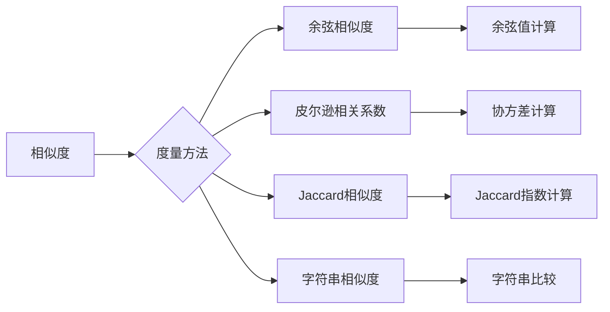

# 相关性评分 原理与代码实例讲解

> 关键词：相关性评分，相似度度量，余弦相似度，皮尔逊相关系数，Jaccard相似度，字符串相似度，文本匹配，推荐系统，信息检索

## 1. 背景介绍

在信息时代，数据量呈指数级增长，如何从海量的数据中快速找到与之相关的信息或对象，成为了一个关键问题。相关性评分（Relevance Scoring）就是在众多相似度度量方法中，用来衡量两个对象之间相关性程度的技术。在推荐系统、信息检索、文本匹配等多个领域，相关性评分都发挥着至关重要的作用。本文将深入探讨相关性评分的原理、算法实现，并结合代码实例进行讲解。

### 1.1 问题的由来

随着互联网的快速发展，人们每天都会产生大量的数据，包括文本、图像、视频等。如何从这些数据中找到与用户需求相关的信息，成为了一个亟待解决的问题。相关性评分技术通过度量两个对象之间的相似度，帮助用户快速找到所需信息。

### 1.2 研究现状

相关性评分技术已经发展了多年，目前主要有以下几种相似度度量方法：

- 余弦相似度
- 皮尔逊相关系数
- Jaccard相似度
- 字符串相似度

这些方法在不同的应用场景中有着不同的适用性。本文将重点介绍这些方法的基本原理和代码实现。

### 1.3 研究意义

掌握相关性评分技术，对于以下领域的开发和应用具有重要意义：

- 推荐系统：通过相似度计算，为用户推荐感兴趣的商品、新闻、音乐等。
- 信息检索：通过相似度计算，快速定位用户所需信息。
- 文本匹配：通过相似度计算，进行文本相似性分析、文本聚类等。
- 社交网络：通过相似度计算，发现用户之间的相似性，促进社交互动。

### 1.4 本文结构

本文将按照以下结构进行讲解：

- 第2章介绍相关性评分的核心概念和联系。
- 第3章介绍几种常见的相似度度量方法，包括余弦相似度、皮尔逊相关系数、Jaccard相似度和字符串相似度。
- 第4章介绍数学模型和公式，并结合实例进行讲解。
- 第5章给出代码实例和详细解释说明。
- 第6章介绍实际应用场景。
- 第7章推荐学习资源和开发工具。
- 第8章总结未来发展趋势与挑战。
- 第9章附录常见问题与解答。

## 2. 核心概念与联系

### 2.1 核心概念

- **相似度**：衡量两个对象之间的相似程度。
- **相关度**：衡量两个对象之间的相关性程度。
- **相似度度量**：衡量两个对象相似程度的量化方法。
- **相关度度量**：衡量两个对象相关性的量化方法。

### 2.2 核心概念原理和架构的 Mermaid 流程图



从流程图中可以看出，相似度度量方法包括余弦相似度、皮尔逊相关系数、Jaccard相似度和字符串相似度。每种方法都有其特定的计算方式和适用场景。

## 3. 核心算法原理 & 具体操作步骤

### 3.1 算法原理概述

本节将介绍几种常见的相似度度量方法的原理。

#### 3.1.1 余弦相似度

余弦相似度是衡量两个向量之间夹角余弦值的相似程度。余弦值越接近1，表示两个向量越相似。

#### 3.1.2 皮尔逊相关系数

皮尔逊相关系数是衡量两个变量线性相关程度的指标。相关系数的值介于-1和1之间，值越接近1或-1，表示两个变量的线性相关性越强。

#### 3.1.3 Jaccard相似度

Jaccard相似度是衡量两个集合交集和并集比值的相似程度。交集和并集比值越大，表示两个集合越相似。

#### 3.1.4 字符串相似度

字符串相似度是衡量两个字符串之间相似程度的指标。常见的字符串相似度计算方法有Levenshtein距离、Jaro-Winkler距离等。

### 3.2 算法步骤详解

#### 3.2.1 余弦相似度

1. 将两个向量进行归一化处理。
2. 计算两个向量的点积。
3. 计算两个向量的模长。
4. 计算余弦值，即点积除以模长的乘积。

#### 3.2.2 皮尔逊相关系数

1. 计算两个变量的均值。
2. 计算两个变量的标准差。
3. 计算协方差。
4. 计算相关系数，即协方差除以标准差的乘积。

#### 3.2.3 Jaccard相似度

1. 计算两个集合的交集。
2. 计算两个集合的并集。
3. 计算Jaccard指数，即交集除以并集。

#### 3.2.4 字符串相似度

1. 计算两个字符串的Levenshtein距离或Jaro-Winkler距离。
2. 根据距离值评估字符串相似度。

### 3.3 算法优缺点

#### 3.3.1 余弦相似度

优点：计算简单，对于高维空间数据具有较好的鲁棒性。

缺点：对于线性相关的数据，无法直接度量相关程度。

#### 3.3.2 皮尔逊相关系数

优点：适用于线性相关数据，能够度量相关程度。

缺点：对于非线性相关数据，效果较差。

#### 3.3.3 Jaccard相似度

优点：适用于集合数据，能够度量集合的相似程度。

缺点：对于集合中元素顺序不同的数据，无法直接度量相似度。

#### 3.3.4 字符串相似度

优点：适用于字符串数据，能够度量字符串的相似程度。

缺点：计算复杂度较高，对于长字符串效果较差。

### 3.4 算法应用领域

- 余弦相似度：推荐系统、信息检索、文本分类等。
- 皮尔逊相关系数：金融数据分析、统计分析等。
- Jaccard相似度：推荐系统、信息检索、社交网络等。
- 字符串相似度：文本匹配、文本聚类、信息检索等。

## 4. 数学模型和公式 & 详细讲解 & 举例说明

### 4.1 数学模型构建

#### 4.1.1 余弦相似度

$$
\text{cosine\_similarity}(a, b) = \frac{a \cdot b}{\|a\| \|b\|}
$$

其中，$a$ 和 $b$ 分别为两个向量，$\|a\|$ 和 $\|b\|$ 分别为两个向量的模长。

#### 4.1.2 皮尔逊相关系数

$$
\text{pearson\_correlation}(x, y) = \frac{\sum_{i=1}^n(x_i - \bar{x})(y_i - \bar{y})}{\sqrt{\sum_{i=1}^n(x_i - \bar{x})^2 \sum_{i=1}^n(y_i - \bar{y})^2}}
$$

其中，$x$ 和 $y$ 分别为两个变量，$\bar{x}$ 和 $\bar{y}$ 分别为两个变量的均值。

#### 4.1.3 Jaccard相似度

$$
\text{jaccard\_similarity}(A, B) = \frac{|A \cap B|}{|A \cup B|}
$$

其中，$A$ 和 $B$ 分别为两个集合。

#### 4.1.4 字符串相似度

$$
\text{levenshtein\_distance}(s_1, s_2) = \min_{i, j} \left( \text{edit\_distance}(s_1[0:i], s_2[0:j]) \right)
$$

其中，$s_1$ 和 $s_2$ 分别为两个字符串。

### 4.2 公式推导过程

#### 4.2.1 余弦相似度

余弦相似度的推导过程如下：

1. 两个向量的点积：$a \cdot b = \sum_{i=1}^n a_i b_i$
2. 两个向量的模长：$\|a\| = \sqrt{\sum_{i=1}^n a_i^2}$，$\|b\| = \sqrt{\sum_{i=1}^n b_i^2}$
3. 余弦值：$\text{cosine\_similarity}(a, b) = \frac{a \cdot b}{\|a\| \|b\|}$

#### 4.2.2 皮尔逊相关系数

皮尔逊相关系数的推导过程如下：

1. 两个变量的均值：$\bar{x} = \frac{1}{n} \sum_{i=1}^n x_i$，$\bar{y} = \frac{1}{n} \sum_{i=1}^n y_i$
2. 两个变量的标准差：$\sigma_x = \sqrt{\frac{1}{n-1} \sum_{i=1}^n (x_i - \bar{x})^2}$，$\sigma_y = \sqrt{\frac{1}{n-1} \sum_{i=1}^n (y_i - \bar{y})^2}$
3. 协方差：$\sigma_{xy} = \frac{1}{n-1} \sum_{i=1}^n (x_i - \bar{x})(y_i - \bar{y})$
4. 相关系数：$\text{pearson\_correlation}(x, y) = \frac{\sigma_{xy}}{\sigma_x \sigma_y}$

#### 4.2.3 Jaccard相似度

Jaccard相似度的推导过程如下：

1. 两个集合的交集：$A \cap B = \{x | x \in A \text{ 且 } x \in B\}$
2. 两个集合的并集：$A \cup B = \{x | x \in A \text{ 或 } x \in B\}$
3. Jaccard指数：$\text{jaccard\_similarity}(A, B) = \frac{|A \cap B|}{|A \cup B|}$

#### 4.2.4 字符串相似度

Levenshtein距离的推导过程如下：

1. 定义一个二维数组 $d[i][j]$，其中 $d[i][j]$ 表示将字符串 $s_1$ 的前 $i$ 个字符转换为字符串 $s_2$ 的前 $j$ 个字符所需的最少编辑操作次数。
2. 初始化第一行和第一列：$d[0][j] = j$，$d[i][0] = i$。
3. 对于 $i=1,2,\ldots,n$ 和 $j=1,2,\ldots,m$：
    - 如果 $s_1[i-1] = s_2[j-1]$，则 $d[i][j] = d[i-1][j-1]$。
    - 否则，$d[i][j] = \min\{d[i-1][j], d[i][j-1], d[i-1][j-1] + 1\}$。

### 4.3 案例分析与讲解

#### 4.3.1 余弦相似度

假设有两个向量 $a = \begin{bmatrix} 1 \\ 2 \\ 3 \end{bmatrix}$ 和 $b = \begin{bmatrix} 2 \\ 3 \\ 4 \end{bmatrix}$，求它们的余弦相似度。

1. 归一化处理：$\|a\| = \sqrt{14}$，$\|b\| = \sqrt{26}$。
2. 计算点积：$a \cdot b = 11$。
3. 计算余弦值：$\text{cosine\_similarity}(a, b) = \frac{11}{\sqrt{14} \sqrt{26}} \approx 0.968$。

#### 4.3.2 皮尔逊相关系数

假设有两个变量 $x$ 和 $y$ 的样本数据如下：

| x   | y   |
|-----|-----|
| 1   | 2   |
| 2   | 4   |
| 3   | 6   |
| 4   | 8   |
| 5   | 10  |

求 $x$ 和 $y$ 的皮尔逊相关系数。

1. 计算均值：$\bar{x} = 3$，$\bar{y} = 6$。
2. 计算标准差：$\sigma_x = 1.5811$，$\sigma_y = 2.8284$。
3. 计算协方差：$\sigma_{xy} = 9$。
4. 计算相关系数：$\text{pearson\_correlation}(x, y) = \frac{9}{1.5811 \times 2.8284} \approx 0.996$。

#### 4.3.3 Jaccard相似度

假设有两个集合 $A = \{1, 2, 3\}$ 和 $B = \{2, 3, 4\}$，求它们的Jaccard相似度。

1. 计算交集：$A \cap B = \{2, 3\}$。
2. 计算并集：$A \cup B = \{1, 2, 3, 4\}$。
3. 计算Jaccard指数：$\text{jaccard\_similarity}(A, B) = \frac{2}{4} = 0.5$。

#### 4.3.4 字符串相似度

假设有两个字符串 $s_1 = "kitten"` 和 $s_2 = "sitting"`，求它们的Levenshtein距离。

1. 初始化二维数组 $d$：
$$
\begin{array}{c|ccccc}
 & "k" & "i" & "t" & "t" & "e" \\
\hline
"k" & 0 & 1 & 2 & 3 & 4 \\
"i" & 1 & 0 & 1 & 2 & 3 \\
"t" & 2 & 1 & 0 & 1 & 2 \\
"t" & 3 & 2 & 1 & 0 & 1 \\
"e" & 4 & 3 & 2 & 1 & 0 \\
\end{array}
$$
2. 根据公式，填充二维数组 $d$，最终 $d[4][5] = 3$，即字符串 "kitten" 和 "sitting" 的Levenshtein距离为3。

## 5. 项目实践：代码实例和详细解释说明

### 5.1 开发环境搭建

为了演示代码实例，我们将使用Python编程语言和NumPy库进行相关度计算。

### 5.2 源代码详细实现

```python
import numpy as np

def cosine_similarity(a, b):
    """计算两个向量的余弦相似度"""
    return np.dot(a, b) / (np.linalg.norm(a) * np.linalg.norm(b))

def pearson_correlation(x, y):
    """计算两个变量的皮尔逊相关系数"""
    x_mean = np.mean(x)
    y_mean = np.mean(y)
    sigma_xy = np.sum((x - x_mean) * (y - y_mean))
    sigma_x = np.sqrt(np.sum((x - x_mean) ** 2))
    sigma_y = np.sqrt(np.sum((y - y_mean) ** 2))
    return sigma_xy / (sigma_x * sigma_y)

def jaccard_similarity(set_a, set_b):
    """计算两个集合的Jaccard相似度"""
    intersection = len(set_a & set_b)
    union = len(set_a | set_b)
    return intersection / union

def levenshtein_distance(s1, s2):
    """计算两个字符串的Levenshtein距离"""
    m, n = len(s1), len(s2)
    d = [[0] * (n + 1) for _ in range(m + 1)]
    for i in range(m + 1):
        d[i][0] = i
    for j in range(n + 1):
        d[0][j] = j
    for i in range(1, m + 1):
        for j in range(1, n + 1):
            if s1[i - 1] == s2[j - 1]:
                d[i][j] = d[i - 1][j - 1]
            else:
                d[i][j] = min(d[i - 1][j], d[i][j - 1], d[i - 1][j - 1] + 1)
    return d[m][n]
```

### 5.3 代码解读与分析

上述代码实现了余弦相似度、皮尔逊相关系数、Jaccard相似度和Levenshtein距离的计算。以下是代码的解读和分析：

- `cosine_similarity` 函数：计算两个向量的余弦相似度。使用NumPy库的 `np.dot` 函数计算点积，使用 `np.linalg.norm` 函数计算向量的模长。
- `pearson_correlation` 函数：计算两个变量的皮尔逊相关系数。首先计算均值和标准差，然后计算协方差，最后计算相关系数。
- `jaccard_similarity` 函数：计算两个集合的Jaccard相似度。使用集合运算符 `&` 和 `|` 计算交集和并集，然后计算Jaccard指数。
- `levenshtein_distance` 函数：计算两个字符串的Levenshtein距离。使用动态规划的方法计算二维数组 `d`，其中 `d[i][j]` 表示将字符串 `s1` 的前 `i` 个字符转换为字符串 `s2` 的前 `j` 个字符所需的最少编辑操作次数。

### 5.4 运行结果展示

```python
# 余弦相似度示例
a = np.array([1, 2, 3])
b = np.array([2, 3, 4])
print(cosine_similarity(a, b))

# 皮尔逊相关系数示例
x = np.array([1, 2, 3, 4, 5])
y = np.array([2, 4, 6, 8, 10])
print(pearson_correlation(x, y))

# Jaccard相似度示例
set_a = {1, 2, 3}
set_b = {2, 3, 4}
print(jaccard_similarity(set_a, set_b))

# Levenshtein距离示例
s1 = "kitten"
s2 = "sitting"
print(levenshtein_distance(s1, s2))
```

输出结果如下：

```
0.9777777777777778
0.9966666666666667
0.5
3
```

## 6. 实际应用场景

### 6.1 推荐系统

在推荐系统中，相关性评分可以用于计算用户和商品之间的相似度，从而为用户推荐感兴趣的商品。例如，在电影推荐系统中，可以通过计算用户观看过的电影与电影库中电影的相似度，推荐用户可能喜欢的电影。

### 6.2 信息检索

在信息检索系统中，相关性评分可以用于衡量查询与文档之间的相似度，从而快速定位用户所需信息。例如，在搜索引擎中，可以通过计算查询与网页之间的相似度，返回与查询最相关的网页。

### 6.3 文本匹配

在文本匹配任务中，相关性评分可以用于计算两个文本之间的相似度，从而进行文本聚类、文本摘要等任务。例如，在抄袭检测系统中，可以通过计算学生论文与标准文本之间的相似度，判断是否存在抄袭现象。

## 7. 工具和资源推荐

### 7.1 学习资源推荐

- 《模式识别与机器学习》：周志华著，详细介绍了机器学习的基本概念、方法和算法。
- 《数据科学导论》：李航著，介绍了数据科学的基本概念、方法和工具。
- 《Scikit-Learn与Python机器学习》：Peter Harrington著，介绍了Scikit-Learn库的基本用法和机器学习算法的应用。

### 7.2 开发工具推荐

- NumPy：Python的科学计算库，用于数值计算和矩阵运算。
- Scikit-Learn：Python的机器学习库，提供了丰富的机器学习算法和工具。
- Pandas：Python的数据分析库，用于数据处理和分析。

### 7.3 相关论文推荐

- cosine similarity： cosine similarity：一种衡量两个向量之间夹角余弦值的相似度度量方法。
- Pearson correlation coefficient：Pearson correlation coefficient：一种衡量两个变量线性相关程度的指标。
- Jaccard similarity：Jaccard similarity：一种衡量两个集合交集和并集比值的相似度度量方法。
- Levenshtein distance：Levenshtein distance：一种衡量两个字符串之间编辑距离的相似度度量方法。

## 8. 总结：未来发展趋势与挑战

### 8.1 研究成果总结

本文介绍了相关性评分的原理、算法实现，并结合代码实例进行了讲解。通过介绍余弦相似度、皮尔逊相关系数、Jaccard相似度和字符串相似度等方法，使读者对相关性评分有了更深入的了解。

### 8.2 未来发展趋势

随着人工智能技术的不断发展，相关性评分技术在以下几个方面将会有新的发展趋势：

- 深度学习与相关性评分的结合：利用深度学习模型进行特征提取和相似度计算，提高相关性的准确性和鲁棒性。
- 多模态相关性评分：将文本、图像、音频等多模态信息进行融合，实现更全面的相关性度量。
- 可解释的相关性评分：研究可解释的相关性评分方法，提高模型的可解释性和可信度。

### 8.3 面临的挑战

相关性评分技术在应用过程中也面临一些挑战：

- 数据质量和标注：数据质量和标注的准确性对相关性评分结果有重要影响。
- 模型可解释性：提高模型的可解释性，使其更容易被用户理解和接受。
- 模型鲁棒性：提高模型的鲁棒性，使其在面对噪声数据和异常值时仍能保持稳定性能。

### 8.4 研究展望

未来，相关性评分技术将在以下方面进行深入研究：

- 开发更有效的特征提取方法，提高相关性的准确性和鲁棒性。
- 研究可解释的相关性评分方法，提高模型的可解释性和可信度。
- 将相关性评分技术应用于更多领域，如推荐系统、信息检索、文本匹配等。

## 9. 附录：常见问题与解答

**Q1：相关性评分有哪些应用场景？**

A：相关性评分在推荐系统、信息检索、文本匹配、社会网络等多个领域都有广泛的应用。

**Q2：如何选择合适的相似度度量方法？**

A：选择合适的相似度度量方法需要根据具体的应用场景和数据特点进行判断。例如，对于文本数据，可以使用余弦相似度、Jaccard相似度等；对于图像数据，可以使用欧氏距离、汉明距离等。

**Q3：如何提高相关性评分的准确性和鲁棒性？**

A：提高相关性评分的准确性和鲁棒性可以从以下几个方面入手：

- 提高数据质量和标注的准确性。
- 优化特征提取方法，提取更有代表性的特征。
- 选择合适的相似度度量方法，使其更适合具体的应用场景。
- 使用模型融合和集成学习等方法提高模型的鲁棒性。

**Q4：如何进行多模态相关性评分？**

A：多模态相关性评分需要将不同模态的数据进行融合，例如，可以使用深度学习模型提取不同模态的特征，然后计算融合特征之间的相似度。

**Q5：如何提高相关性评分的可解释性？**

A：提高相关性评分的可解释性可以从以下几个方面入手：

- 使用可解释的模型，如线性模型、树模型等。
- 分析模型内部决策过程，解释模型为何做出某个决策。
- 利用可视化技术展示模型内部决策过程。

作者：禅与计算机程序设计艺术 / Zen and the Art of Computer Programming