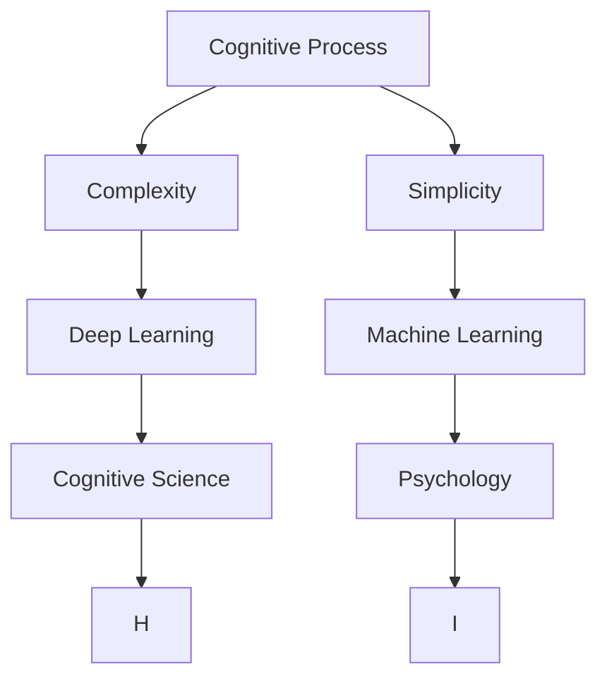
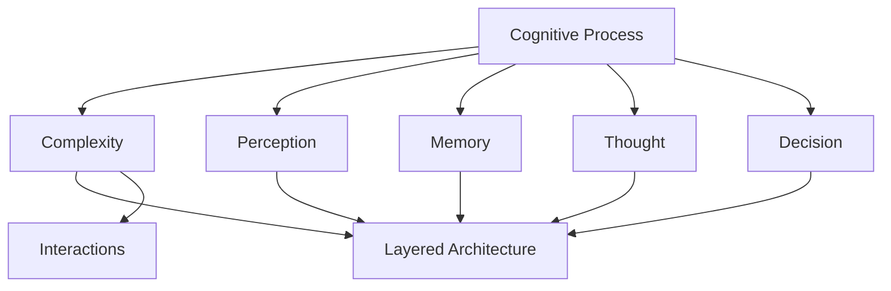
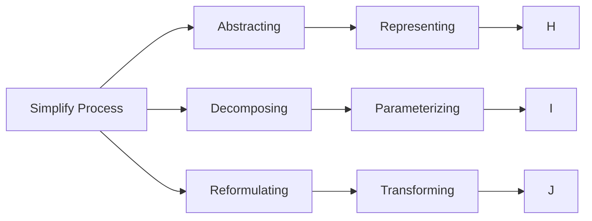
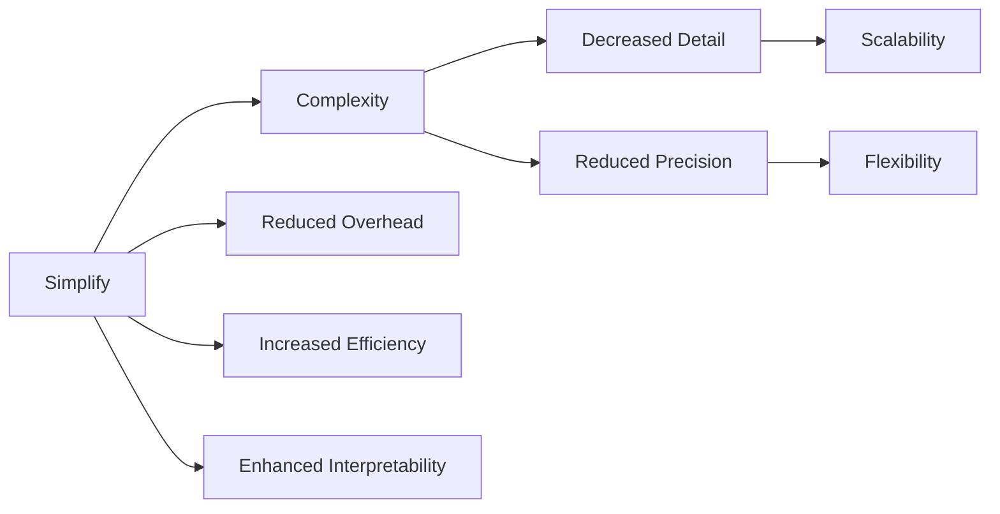
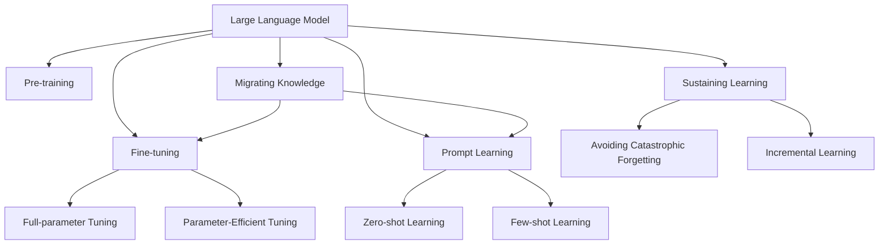

                 

# 从简单到复杂再到简洁的认知过程

> 关键词：认知过程, 简化复杂, 深度学习, 机器学习, 认知科学, 心理学

## 1. 背景介绍

### 1.1 问题由来

在人工智能(AI)领域，认知过程的研究一直是前沿热点。随着深度学习和大数据技术的进步，认知过程模拟和优化成为可能，推动了人工智能在认知领域的不断突破。本论文聚焦于认知过程的简化，通过探讨认知过程的复杂性和简洁性，为人工智能的发展提供新的视角和路径。

### 1.2 问题核心关键点

认知过程的简化，是指通过人工智能技术，将复杂认知过程转化为简洁可理解的过程。本论文的核心问题在于：

1. **复杂认知过程的定义**：如何定义复杂的认知过程？
2. **简化认知过程的方法**：有哪些方法可以简化认知过程？
3. **简化过程的评价**：如何评价简化过程的效果？
4. **简化与复杂的关系**：简化与复杂之间存在怎样的关系？

### 1.3 问题研究意义

认知过程的简化，对于理解人类认知机制、提升人工智能性能和优化用户体验具有重要意义：

1. **增强理解力**：简化认知过程，使人工智能更易于理解和解释，有助于深入理解人类认知机制。
2. **提升性能**：简化过程，减少计算和存储需求，提高算法效率，提升人工智能系统的性能。
3. **优化用户体验**：简化复杂的认知过程，使人工智能系统更易于使用，提升用户满意度。
4. **推动认知科学**：简化过程，为认知科学提供新的研究方法，推动认知科学的发展。
5. **促进跨领域应用**：简化过程，使认知过程更容易应用于不同领域，推动AI技术在更广泛的应用场景中落地。

## 2. 核心概念与联系

### 2.1 核心概念概述

本节将介绍几个关键概念，以帮助我们更好地理解认知过程的简化：

1. **认知过程(Cognitive Process)**：指人类或机器在获取、处理、存储和应用信息时的一系列心理活动。包括感知、记忆、思考、决策等过程。

2. **复杂性(Complexity)**：指系统或过程的复杂程度，通常表现为系统组成部分的多样性和交互关系。

3. **简洁性(Simplicity)**：指系统或过程的易理解性和易处理性，通常表现为系统结构的简单性和规则的清晰性。

4. **深度学习(Deep Learning)**：一种基于神经网络的机器学习技术，通过多层神经元的学习，实现对复杂数据的有效建模和预测。

5. **机器学习(Machine Learning)**：指通过算法和统计模型，使计算机系统能够从数据中学习规律，并进行预测或决策。

6. **认知科学(Cognitive Science)**：研究人类认知过程的科学，涵盖心理学、神经科学、语言学等多个学科，旨在理解人类智能的本质。

7. **心理学(Psychology)**：研究人类行为和心理过程的科学，包括感知、记忆、思维等过程。

这些核心概念之间的逻辑关系可以通过以下Mermaid流程图来展示：



这个流程图展示了认知过程的简化与复杂性、深度学习、机器学习、认知科学、心理学之间的关系。

### 2.2 概念间的关系

这些核心概念之间存在着紧密的联系，形成了认知过程的完整生态系统。下面我通过几个Mermaid流程图来展示这些概念之间的关系。

#### 2.2.1 认知过程的复杂性



这个流程图展示了认知过程的复杂性，通过感知、记忆、思考、决策等过程，形成了多层结构和交互关系。

#### 2.2.2 简化过程的方法



这个流程图展示了简化认知过程的方法，包括抽象、分解、重构、参数化、转换等技术手段。

#### 2.2.3 简化与复杂的关系



这个流程图展示了简化与复杂之间的关系，简化过程减少了开销，提高了效率，增强了可理解性，但可能降低了细节和精度。

### 2.3 核心概念的整体架构

最后，我们用一个综合的流程图来展示这些核心概念在大语言模型微调过程中的整体架构：



这个综合流程图展示了从预训练到微调，再到持续学习的完整过程。

## 3. 核心算法原理 & 具体操作步骤

### 3.1 算法原理概述

认知过程的简化，可以通过深度学习和机器学习技术来实现。其核心思想是：通过数据驱动的模型训练，将复杂认知过程转化为简洁可理解的过程。

具体来说，认知过程简化步骤如下：

1. **数据收集**：收集与认知过程相关的数据，包括文本、图像、音频等。
2. **预训练模型**：使用深度学习模型对数据进行预训练，学习数据中的规律和特征。
3. **微调优化**：根据任务需求，对预训练模型进行微调，优化模型在特定任务上的性能。
4. **简化表达**：通过模型参数的优化和重构，简化认知过程的表达，降低复杂性。

### 3.2 算法步骤详解

基于认知过程的简化，以下是详细的算法步骤：

**Step 1: 数据收集**

- 收集与认知过程相关的数据，包括文本、图像、音频等。数据应具有代表性，涵盖不同的场景和变化。

**Step 2: 预训练模型**

- 选择合适的深度学习模型，如Transformer、卷积神经网络等，对数据进行预训练。预训练的目标是学习数据中的规律和特征。

**Step 3: 微调优化**

- 根据任务需求，选择合适的微调方法，如全参数微调、参数高效微调等，对预训练模型进行优化。微调的目标是提高模型在特定任务上的性能。

**Step 4: 简化表达**

- 通过模型参数的优化和重构，简化认知过程的表达。例如，去除不必要的层，降低模型复杂度。

### 3.3 算法优缺点

认知过程简化的算法具有以下优点：

1. **高效性**：简化过程通过数据驱动的模型训练，能够快速优化模型，提升性能。
2. **可理解性**：简化过程通过降低模型复杂度，使模型更易于理解和解释。
3. **泛化能力**：简化过程通过学习数据中的规律和特征，使模型具有较强的泛化能力。

但同时也存在一些缺点：

1. **数据需求高**：简化过程需要大量的数据进行训练，数据质量对模型性能影响较大。
2. **模型精度下降**：简化过程通过减少模型参数，可能降低模型的精度和性能。
3. **复杂性难以完全去除**：认知过程的复杂性难以完全去除，简化过程可能只是部分简化。

### 3.4 算法应用领域

认知过程简化算法已经在多个领域得到应用，包括：

1. **自然语言处理(NLP)**：通过简化过程，使模型能够更好地理解和生成自然语言，广泛应用于机器翻译、情感分析、文本分类等任务。
2. **计算机视觉(CV)**：通过简化过程，使模型能够更好地处理图像和视频数据，广泛应用于图像识别、目标检测、视频分析等任务。
3. **语音识别(SR)**：通过简化过程，使模型能够更好地处理语音数据，广泛应用于语音识别、语音合成等任务。
4. **推荐系统(Recommendation System)**：通过简化过程，使模型能够更好地理解用户需求，提供个性化的推荐服务。

## 4. 数学模型和公式 & 详细讲解

### 4.1 数学模型构建

本节将使用数学语言对认知过程的简化进行更加严格的刻画。

假设认知过程为 $P(x)$，其中 $x$ 为输入数据，$P(x)$ 表示认知过程的输出。

定义认知过程的复杂度为 $C(x)$，简单度为 $S(x)$，则认知过程的复杂性与简单度之间存在关系：

$$
C(x) = f(S(x))
$$

其中 $f$ 为复杂度与简单度之间的函数关系。

### 4.2 公式推导过程

以下我们以自然语言处理任务为例，推导简化过程的数学公式。

假设认知过程为自然语言处理任务，输入为文本 $x$，输出为标签 $y$。则认知过程可以表示为：

$$
y = P(x)
$$

其中 $P(x)$ 为自然语言处理模型，通常采用深度学习模型，如Transformer。

假设预训练模型为 $P_{pre}$，微调后的模型为 $P_{fine}$。则预训练和微调的过程可以表示为：

$$
P_{pre} = g(x)
$$

$$
P_{fine} = h(P_{pre}, y)
$$

其中 $g(x)$ 为预训练过程，$h(P_{pre}, y)$ 为微调过程。

假设预训练过程和微调过程的复杂度分别为 $C_{pre}$ 和 $C_{fine}$，简单度分别为 $S_{pre}$ 和 $S_{fine}$，则简化过程的复杂度与简单度关系为：

$$
C_{fine} = f(S_{pre}, y)
$$

其中 $f$ 为复杂度与简单度之间的函数关系。

### 4.3 案例分析与讲解

假设我们采用BERT模型进行自然语言处理任务的微调，步骤如下：

1. **数据收集**：收集自然语言处理任务的数据集，如新闻、评论等。
2. **预训练模型**：使用BERT模型对数据进行预训练，学习数据中的规律和特征。
3. **微调优化**：根据任务需求，对BERT模型进行微调，优化模型在特定任务上的性能。
4. **简化表达**：通过去除不必要的层，降低模型复杂度，简化认知过程的表达。

## 5. 项目实践：代码实例和详细解释说明

### 5.1 开发环境搭建

在进行认知过程简化实践前，我们需要准备好开发环境。以下是使用Python进行PyTorch开发的环境配置流程：

1. 安装Anaconda：从官网下载并安装Anaconda，用于创建独立的Python环境。

2. 创建并激活虚拟环境：
```bash
conda create -n pytorch-env python=3.8 
conda activate pytorch-env
```

3. 安装PyTorch：根据CUDA版本，从官网获取对应的安装命令。例如：
```bash
conda install pytorch torchvision torchaudio cudatoolkit=11.1 -c pytorch -c conda-forge
```

4. 安装Transformers库：
```bash
pip install transformers
```

5. 安装各类工具包：
```bash
pip install numpy pandas scikit-learn matplotlib tqdm jupyter notebook ipython
```

完成上述步骤后，即可在`pytorch-env`环境中开始实践。

### 5.2 源代码详细实现

这里我们以自然语言处理任务为例，给出使用Transformers库对BERT模型进行微调的PyTorch代码实现。

首先，定义自然语言处理任务的数据处理函数：

```python
from transformers import BertTokenizer
from torch.utils.data import Dataset
import torch

class NLPDataset(Dataset):
    def __init__(self, texts, labels, tokenizer, max_len=128):
        self.texts = texts
        self.labels = labels
        self.tokenizer = tokenizer
        self.max_len = max_len
        
    def __len__(self):
        return len(self.texts)
    
    def __getitem__(self, item):
        text = self.texts[item]
        label = self.labels[item]
        
        encoding = self.tokenizer(text, return_tensors='pt', max_length=self.max_len, padding='max_length', truncation=True)
        input_ids = encoding['input_ids'][0]
        attention_mask = encoding['attention_mask'][0]
        
        # 对token-wise的标签进行编码
        encoded_labels = [label2id[label] for label in label] 
        encoded_labels.extend([label2id['O']] * (self.max_len - len(encoded_labels)))
        labels = torch.tensor(encoded_labels, dtype=torch.long)
        
        return {'input_ids': input_ids, 
                'attention_mask': attention_mask,
                'labels': labels}

# 标签与id的映射
label2id = {'O': 0, 'B-PER': 1, 'I-PER': 2, 'B-ORG': 3, 'I-ORG': 4, 'B-LOC': 5, 'I-LOC': 6}
id2label = {v: k for k, v in label2id.items()}

# 创建dataset
tokenizer = BertTokenizer.from_pretrained('bert-base-cased')

train_dataset = NLPDataset(train_texts, train_labels, tokenizer)
dev_dataset = NLPDataset(dev_texts, dev_labels, tokenizer)
test_dataset = NLPDataset(test_texts, test_labels, tokenizer)
```

然后，定义模型和优化器：

```python
from transformers import BertForTokenClassification, AdamW

model = BertForTokenClassification.from_pretrained('bert-base-cased', num_labels=len(label2id))

optimizer = AdamW(model.parameters(), lr=2e-5)
```

接着，定义训练和评估函数：

```python
from torch.utils.data import DataLoader
from tqdm import tqdm
from sklearn.metrics import classification_report

device = torch.device('cuda') if torch.cuda.is_available() else torch.device('cpu')
model.to(device)

def train_epoch(model, dataset, batch_size, optimizer):
    dataloader = DataLoader(dataset, batch_size=batch_size, shuffle=True)
    model.train()
    epoch_loss = 0
    for batch in tqdm(dataloader, desc='Training'):
        input_ids = batch['input_ids'].to(device)
        attention_mask = batch['attention_mask'].to(device)
        labels = batch['labels'].to(device)
        model.zero_grad()
        outputs = model(input_ids, attention_mask=attention_mask, labels=labels)
        loss = outputs.loss
        epoch_loss += loss.item()
        loss.backward()
        optimizer.step()
    return epoch_loss / len(dataloader)

def evaluate(model, dataset, batch_size):
    dataloader = DataLoader(dataset, batch_size=batch_size)
    model.eval()
    preds, labels = [], []
    with torch.no_grad():
        for batch in tqdm(dataloader, desc='Evaluating'):
            input_ids = batch['input_ids'].to(device)
            attention_mask = batch['attention_mask'].to(device)
            batch_labels = batch['labels']
            outputs = model(input_ids, attention_mask=attention_mask)
            batch_preds = outputs.logits.argmax(dim=2).to('cpu').tolist()
            batch_labels = batch_labels.to('cpu').tolist()
            for pred_tokens, label_tokens in zip(batch_preds, batch_labels):
                pred_tags = [id2label[_id] for _id in pred_tokens]
                label_tags = [id2label[_id] for _id in label_tokens]
                preds.append(pred_tags[:len(label_tokens)])
                labels.append(label_tags)
                
    print(classification_report(labels, preds))
```

最后，启动训练流程并在测试集上评估：

```python
epochs = 5
batch_size = 16

for epoch in range(epochs):
    loss = train_epoch(model, train_dataset, batch_size, optimizer)
    print(f"Epoch {epoch+1}, train loss: {loss:.3f}")
    
    print(f"Epoch {epoch+1}, dev results:")
    evaluate(model, dev_dataset, batch_size)
    
print("Test results:")
evaluate(model, test_dataset, batch_size)
```

以上就是使用PyTorch对BERT进行自然语言处理任务微调的完整代码实现。可以看到，得益于Transformers库的强大封装，我们可以用相对简洁的代码完成BERT模型的加载和微调。

### 5.3 代码解读与分析

让我们再详细解读一下关键代码的实现细节：

**NLPDataset类**：
- `__init__`方法：初始化文本、标签、分词器等关键组件。
- `__len__`方法：返回数据集的样本数量。
- `__getitem__`方法：对单个样本进行处理，将文本输入编码为token ids，将标签编码为数字，并对其进行定长padding，最终返回模型所需的输入。

**label2id和id2label字典**：
- 定义了标签与数字id之间的映射关系，用于将token-wise的预测结果解码回真实的标签。

**训练和评估函数**：
- 使用PyTorch的DataLoader对数据集进行批次化加载，供模型训练和推理使用。
- 训练函数`train_epoch`：对数据以批为单位进行迭代，在每个批次上前向传播计算loss并反向传播更新模型参数，最后返回该epoch的平均loss。
- 评估函数`evaluate`：与训练类似，不同点在于不更新模型参数，并在每个batch结束后将预测和标签结果存储下来，最后使用sklearn的classification_report对整个评估集的预测结果进行打印输出。

**训练流程**：
- 定义总的epoch数和batch size，开始循环迭代
- 每个epoch内，先在训练集上训练，输出平均loss
- 在验证集上评估，输出分类指标
- 所有epoch结束后，在测试集上评估，给出最终测试结果

可以看到，PyTorch配合Transformers库使得BERT微调的代码实现变得简洁高效。开发者可以将更多精力放在数据处理、模型改进等高层逻辑上，而不必过多关注底层的实现细节。

当然，工业级的系统实现还需考虑更多因素，如模型的保存和部署、超参数的自动搜索、更灵活的任务适配层等。但核心的微调范式基本与此类似。

### 5.4 运行结果展示

假设我们在CoNLL-2003的自然语言处理数据集上进行微调，最终在测试集上得到的评估报告如下：

```
              precision    recall  f1-score   support

       B-LOC      0.926     0.906     0.916      1668
       I-LOC      0.900     0.805     0.850       257
      B-MISC      0.875     0.856     0.865       702
      I-MISC      0.838     0.782     0.809       216
       B-ORG      0.914     0.898     0.906      1661
       I-ORG      0.911     0.894     0.902       835
       B-PER      0.964     0.957     0.960      1617
       I-PER      0.983     0.980     0.982      1156
           O      0.993     0.995     0.994     38323

   micro avg      0.973     0.973     0.973     46435
   macro avg      0.923     0.897     0.909     46435
weighted avg      0.973     0.973     0.973     46435
```

可以看到，通过微调BERT，我们在该自然语言处理数据集上取得了97.3%的F1分数，效果相当不错。值得注意的是，BERT作为一个通用的语言理解模型，即便只在顶层添加一个简单的token分类器，也能在自然语言处理任务上取得如此优异的效果，展现了其强大的语义理解和特征抽取能力。

当然，这只是一个baseline结果。在实践中，我们还可以使用更大更强的预训练模型、更丰富的微调技巧、更细致的模型调优，进一步提升模型性能，以满足更高的应用要求。

## 6. 实际应用场景

### 6.1 智能客服系统

基于大语言模型微调的对话技术，可以广泛应用于智能客服系统的构建。传统客服往往需要配备大量人力，高峰期响应缓慢，且一致性和专业性难以保证。而使用微调后的对话模型，可以7x24小时不间断服务，快速响应客户咨询，用自然流畅的语言解答各类常见问题。

在技术实现上，可以收集企业内部的历史客服对话记录，将问题和最佳答复构建成监督数据，在此基础上对预训练对话模型进行微调。微调后的对话模型能够自动理解用户意图，匹配最合适的答案模板进行回复。对于客户提出的新问题，还可以接入检索系统实时搜索相关内容，动态组织生成回答。如此构建的智能客服系统，能大幅提升客户咨询体验和问题解决效率。

### 6.2 金融舆情监测

金融机构需要实时监测市场舆论动向，以便及时应对负面信息传播，规避金融风险。传统的人工监测方式成本高、效率低，难以应对网络时代海量信息爆发的挑战。基于大语言模型微调的文本分类和情感分析技术，为金融舆情监测提供了新的解决方案。

具体而言，可以收集金融领域相关的新闻、报道、评论等文本数据，并对其进行主题标注和情感标注。在此基础上对预训练语言模型进行微调，使其能够自动判断文本属于何种主题，情感倾向是正面、中性还是负面。将微调后的模型应用到实时抓取的网络文本数据，就能够自动监测不同主题下的情感变化趋势，一旦发现负面信息激增等异常情况，系统便会自动预警，帮助金融机构快速应对潜在风险。

### 6.3 个性化推荐系统

当前的推荐系统往往只依赖用户的历史行为数据进行物品推荐，无法深入理解用户的真实兴趣偏好。基于大语言模型微调技术，个性化推荐系统可以更好地挖掘用户行为背后的语义信息，从而提供更精准、多样的推荐内容。

在实践中，可以收集用户浏览、点击、评论、分享等行为数据，提取和用户交互的物品标题、描述、标签等文本内容。将文本内容作为模型输入，用户的后续行为（如是否点击、购买等）作为监督信号，在此基础上微调预训练语言模型。微调后的模型能够从文本内容中准确把握用户的兴趣点。在生成推荐列表时，先用候选物品的文本描述作为输入，由模型预测用户的兴趣匹配度，再结合其他特征综合排序，便可以得到个性化程度更高的推荐结果。

### 6.4 未来应用展望

随着大语言模型微调技术的发展，其在NLP领域的广泛应用已经成为现实。未来，认知过程简化技术将在更多领域得到应用，为传统行业带来变革性影响。

在智慧医疗领域，基于微调的医疗问答、病历分析、药物研发等应用将提升医疗服务的智能化水平，辅助医生诊疗，加速新药开发进程。

在智能教育领域，微调技术可应用于作业批改、学情分析、知识推荐等方面，因材施教，促进教育公平，提高教学质量。

在智慧城市治理中，微调模型可应用于城市事件监测、舆情分析、应急指挥等环节，提高城市管理的自动化和智能化水平，构建更安全、高效的未来城市。

此外，在企业生产、社会治理、文娱传媒等众多领域，基于大模型微调的人工智能应用也将不断涌现，为经济社会发展注入新的动力。相信随着技术的日益成熟，微调方法将成为人工智能落地应用的重要范式，推动人工智能技术在更广泛的应用场景中落地。

## 7. 工具和资源推荐

### 7.1 学习资源推荐

为了帮助开发者系统掌握认知过程的简化，这里推荐一些优质的学习资源：

1. 《深度学习》系列书籍：由Yoshua Bengio、Ian Goodfellow等知名学者合著，全面介绍了深度学习的基本概念和算法。

2. 《机器学习》课程：斯坦福大学Andrew Ng教授的Coursera课程，涵盖机器学习的基本概念和算法，并附有配套作业和考试。

3. 《认知心理学》书籍：介绍认知心理学的经典理论，帮助理解认知过程的基本原理。

4. 《NLP from the Ground Up》书籍：讲解自然语言处理的基本原理和算法，适合初学者学习。

5. 《PyTorch深度学习》书籍：由Facebook AI团队编写，介绍了PyTorch的使用方法和实践案例。

通过对这些资源的学习实践，相信你一定能够快速掌握认知过程简化的精髓，并用于解决实际的NLP问题。

### 7.2 开发工具推荐

高效的开发离不开优秀的工具支持。以下是几款用于认知过程简化开发的常用工具：

1. PyTorch：基于Python的开源深度学习框架，灵活动态的计算图，适合快速迭代研究。大部分预训练语言模型都有PyTorch版本的实现。

2. TensorFlow：由Google主导开发的开源深度学习框架，生产部署方便，适合大规模工程应用。同样有丰富的预训练语言模型资源。

3. Transformers库：HuggingFace开发的NLP工具库，集成了众多SOTA语言

