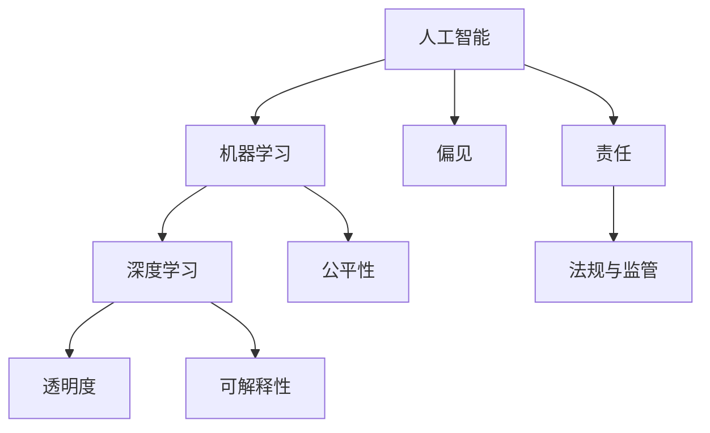
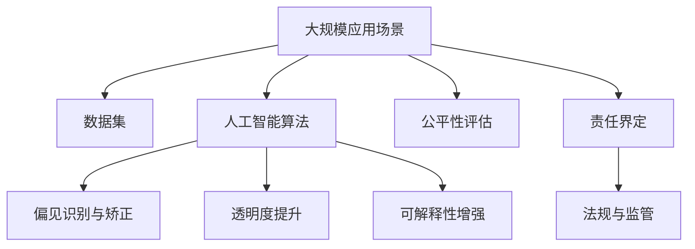

                 

## 1. 背景介绍

### 1.1 问题由来

随着人工智能技术的快速发展，包括机器学习、深度学习在内的各种智能算法被广泛应用于各个领域，极大地提升了工作效率和决策质量。但与此同时，人工智能技术的发展也引发了诸多伦理问题，如数据隐私、算法偏见、技术滥用等。这些问题不仅影响到了人工智能技术的普及应用，甚至可能威胁到社会的稳定和安全。

### 1.2 问题核心关键点

在人工智能技术的应用过程中，伦理问题主要集中在以下几个方面：

- **数据隐私与安全性**：如何在保护用户隐私的前提下，获取和使用训练数据。
- **算法偏见与公平性**：如何确保算法在不同人群和群体中保持一致的性能和结果。
- **技术滥用与监管**：如何防止算法被用于非法或有害的行为。
- **透明性与可解释性**：如何使人工智能决策过程透明化，让普通人也能理解和接受。
- **责任与法律**：在算法产生错误或有害结果时，如何界定责任和法律责任。

这些问题在人工智能技术的不同应用场景中可能呈现出不同的表现形式，但它们都需要被深入研究和解决。

### 1.3 问题研究意义

研究和解决人工智能伦理问题，对于推动人工智能技术的健康发展、构建和谐的社会环境具有重要意义：

- **促进技术发展**：通过明确伦理规范，可以引导人工智能技术朝着有益于人类发展的方向发展。
- **保障用户权益**：确保数据隐私和算法公平，维护用户权益和利益。
- **防范技术滥用**：制定规则和监管机制，防止人工智能技术被用于非法或有害行为。
- **增强社会信任**：提高人工智能系统的透明性和可解释性，增加公众信任度。
- **推动立法进程**：伦理问题的研究可以为相关法律和法规的制定提供参考，促进人工智能相关立法工作。

## 2. 核心概念与联系

### 2.1 核心概念概述

为更好地理解人工智能伦理问题，我们首先介绍几个核心概念：

- **人工智能（AI）**：通过算法和数据处理能力，使计算机系统具备类人智能的技术。
- **机器学习（ML）**：使计算机能够从数据中学习和改进，无需人工干预。
- **深度学习（DL）**：一种基于神经网络的机器学习方法，模拟人脑的神经网络结构。
- **偏见（Bias）**：由于数据集、算法设计或训练方式等原因，导致模型在不同人群或群体中表现不一致。
- **公平性（Fairness）**：模型在不同人群或群体中表现一致，不因种族、性别、年龄等因素产生歧视。
- **透明度（Transparency）**：人工智能决策过程的可见性和可解释性。
- **可解释性（Explainability）**：使非专业用户也能理解和接受人工智能决策的过程。
- **责任（Accountability）**：在算法产生错误或有害结果时，界定责任和法律责任。
- **法规与监管（Regulation and Compliance）**：政府和社会对人工智能技术应用的监管和合规要求。

这些概念之间相互联系，共同构成了人工智能伦理问题的研究框架。通过理解这些核心概念，我们可以更好地把握人工智能伦理问题的本质，并提出有效的解决方案。

### 2.2 概念间的关系

这些核心概念之间的关系可以用以下Mermaid流程图来展示：



这个流程图展示了人工智能、机器学习、深度学习等技术手段，以及与数据隐私、算法偏见、公平性、透明度、可解释性、责任和法规与监管等伦理问题的相互关系。

### 2.3 核心概念的整体架构

最后，我们用一个综合的流程图来展示这些核心概念在大规模人工智能应用中的整体架构：



这个综合流程图展示了从数据集到人工智能算法，再到偏见识别、公平性评估、透明度提升、可解释性增强、责任界定、法规与监管的整个流程。

## 3. 核心算法原理 & 具体操作步骤
### 3.1 算法原理概述

人工智能伦理问题的研究与解决，通常需要结合多学科知识，包括伦理学、法学、社会学等。其核心算法原理主要是通过数据分析和算法设计，识别和纠正数据偏见，提升算法公平性和透明性，确保算法在实际应用中的合理性和安全性。

### 3.2 算法步骤详解

以下是人工智能伦理问题研究与解决的详细步骤：

**Step 1: 数据收集与预处理**
- 收集与任务相关的数据集，确保数据多样性和代表性。
- 清洗数据，去除异常值和噪声，确保数据质量。
- 对敏感数据进行匿名化处理，保护用户隐私。

**Step 2: 偏见识别与矫正**
- 使用数据分析和统计方法，识别数据中的偏见。
- 根据偏见来源，选择合适的方法进行矫正，如重新采样、权重调整等。

**Step 3: 算法设计与优化**
- 设计公平性、透明性和可解释性较强的算法模型。
- 使用交叉验证等技术，优化算法性能和泛化能力。

**Step 4: 算法评估与测试**
- 在特定数据集上评估算法性能，确保算法在不同人群或群体中表现一致。
- 使用A/B测试等方法，评估算法在实际应用中的表现。

**Step 5: 法规与合规审查**
- 根据当地法律法规，确保算法符合合规要求。
- 制定和实施数据隐私保护和算法透明度的相关政策。

**Step 6: 责任界定与风险管理**
- 明确算法产生的错误或有害结果时的责任界定，建立责任追溯机制。
- 制定风险管理策略，预防算法被滥用的风险。

**Step 7: 用户教育与反馈**
- 通过宣传和教育，提高公众对人工智能技术的理解。
- 收集用户反馈，持续改进算法和应用系统。

### 3.3 算法优缺点

人工智能伦理问题的研究与解决，存在以下优点和缺点：

**优点**：
- 系统性分析：通过多学科合作，系统性地识别和解决伦理问题。
- 综合优化：结合数据、算法和政策，综合提升人工智能系统的公平性、透明性和可解释性。
- 法规合规：确保算法符合法律法规要求，减少法律风险。

**缺点**：
- 实施复杂：涉及多个领域的知识和技术，实施复杂度较高。
- 效果不确定：算法优化和偏见矫正的效果可能无法完全满足所有需求。
- 技术依赖：算法设计和优化高度依赖数据和算法技术，可能存在技术瓶颈。

### 3.4 算法应用领域

人工智能伦理问题研究与解决，广泛应用于以下领域：

- **医疗健康**：确保患者隐私保护，避免算法偏见，提高医疗诊断的公平性和准确性。
- **金融服务**：保护客户隐私，确保算法透明，防止金融诈骗和歧视。
- **司法系统**：确保判决公平，增强算法可解释性，保障司法公正。
- **公共安全**：使用算法进行风险评估，确保算法不歧视特定群体，提高公共安全决策的透明性。
- **教育培训**：使用算法进行个性化教育，确保算法公平，提高教育质量。

## 4. 数学模型和公式 & 详细讲解 & 举例说明
### 4.1 数学模型构建

在人工智能伦理问题的研究中，数学模型主要用来进行偏见识别和矫正，以及算法性能评估。以下是几个常见的数学模型：

**偏见的数学模型**：
- 使用统计学方法，如均值方差、协方差等，分析数据集中的偏见。
- 使用机器学习模型，如支持向量机（SVM）、随机森林等，预测和矫正数据集中的偏见。

**公平性的数学模型**：
- 使用均等机会指标（Equal Opportunity），衡量模型在不同人群中的表现。
- 使用差异度量指标（Difference Metric），如Demographic Parity，评估模型在不同群体中的公平性。

**透明度的数学模型**：
- 使用信息熵（Entropy），衡量算法决策的复杂度和可解释性。
- 使用LIME（Local Interpretable Model-agnostic Explanations）算法，生成局部可解释模型，提升透明度。

**可解释性的数学模型**：
- 使用SHAP（SHapley Additive exPlanations）算法，解释模型在特定输入下的预测结果。
- 使用LIME和SHAP等算法，生成局部可解释模型，提升可解释性。

**责任的数学模型**：
- 使用责任链（Chain of Responsibility）模型，界定算法产生的错误或有害结果时的责任。
- 使用模型归因（Model Attribution）方法，分析算法产生错误或有害结果的原因。

**法规与合规的数学模型**：
- 使用法律规则（Legal Rule），评估算法是否符合法律法规要求。
- 使用政策模拟（Policy Simulation）模型，预测和评估法规政策的影响。

### 4.2 公式推导过程

以下是几个常见的数学公式和推导过程：

**均等机会指标（Equal Opportunity）**：
$$
\text{EO} = \frac{\text{TPR}_{\text{minority}}}{\text{TPR}_{\text{majority}}}
$$
其中，TPR为真阳性率，minority为少数群体，majority为多数群体。

**差异度量指标（Difference Metric）**：
$$
\text{DP} = \frac{1}{|D|} \sum_{d \in D} |y_d - \hat{y}_d|
$$
其中，$D$为数据集，$y_d$为真实标签，$\hat{y}_d$为模型预测标签。

**信息熵（Entropy）**：
$$
\text{Entropy} = -\sum_{i=1}^{n} p_i \log p_i
$$
其中，$p_i$为第$i$类样本的概率。

**SHAP值**：
$$
\text{SHAP}(X) = \sum_{j=1}^{n} \frac{\partial \hat{y}_j}{\partial x_i} \cdot \text{SHAP}(x_i)
$$
其中，$\hat{y}_j$为模型在输入$x_j$上的预测结果，$\frac{\partial \hat{y}_j}{\partial x_i}$为模型对输入$x_i$的偏导数，$\text{SHAP}(x_i)$为模型在输入$x_i$上的SHAP值。

**责任链（Chain of Responsibility）**：
- 定义责任链模型，将责任分配给各个环节，确保每个环节的责任清晰明确。
- 使用模型归因方法，分析算法产生错误或有害结果的原因，为责任界定提供依据。

### 4.3 案例分析与讲解

以医疗健康领域的数据偏见识别和矫正为例，我们展示如何通过数学模型进行数据分析和处理。

**数据集构建**：
- 收集大量医疗数据，包括患者的性别、年龄、种族、病历等信息。
- 去除异常值和噪声，清洗数据集，确保数据质量。

**偏见识别**：
- 使用均值方差方法，分析数据集中不同群体的均值和方差，识别性别、种族等偏见的特征。
- 使用SVM模型，预测和矫正数据集中的偏见，确保模型在不同人群中的表现一致。

**公平性评估**：
- 使用均等机会指标，评估模型在不同性别、种族群体中的表现。
- 使用差异度量指标，评估模型在少数群体中的公平性，确保模型不会对特定群体产生歧视。

**透明度提升**：
- 使用信息熵方法，衡量模型在各个特征上的复杂度和可解释性。
- 使用LIME和SHAP算法，生成局部可解释模型，提升算法的透明度。

**可解释性增强**：
- 使用SHAP值，解释模型在特定病历上的预测结果，确保医生能够理解和接受。
- 使用LIME和SHAP算法，生成局部可解释模型，提升算法的可解释性。

**责任界定**：
- 定义责任链模型，明确算法在产生错误或有害结果时的责任。
- 使用模型归因方法，分析算法产生错误或有害结果的原因，为责任界定提供依据。

## 5. 项目实践：代码实例和详细解释说明
### 5.1 开发环境搭建

在进行人工智能伦理问题研究与解决的项目实践前，我们需要准备好开发环境。以下是使用Python进行PyTorch开发的环境配置流程：

1. 安装Anaconda：从官网下载并安装Anaconda，用于创建独立的Python环境。

2. 创建并激活虚拟环境：
```bash
conda create -n pytorch-env python=3.8 
conda activate pytorch-env
```

3. 安装PyTorch：根据CUDA版本，从官网获取对应的安装命令。例如：
```bash
conda install pytorch torchvision torchaudio cudatoolkit=11.1 -c pytorch -c conda-forge
```

4. 安装各类工具包：
```bash
pip install numpy pandas scikit-learn matplotlib tqdm jupyter notebook ipython
```

完成上述步骤后，即可在`pytorch-env`环境中开始项目实践。

### 5.2 源代码详细实现

下面我们以医疗健康领域的数据偏见识别和矫正为例，给出使用PyTorch和Transformers库进行模型开发的代码实现。

首先，定义偏见识别和矫正的数据处理函数：

```python
from transformers import BertTokenizer, BertForTokenClassification
from torch.utils.data import Dataset
import torch

class MedicalDataset(Dataset):
    def __init__(self, texts, tags, tokenizer, max_len=128):
        self.texts = texts
        self.tags = tags
        self.tokenizer = tokenizer
        self.max_len = max_len
        
    def __len__(self):
        return len(self.texts)
    
    def __getitem__(self, item):
        text = self.texts[item]
        tags = self.tags[item]
        
        encoding = self.tokenizer(text, return_tensors='pt', max_length=self.max_len, padding='max_length', truncation=True)
        input_ids = encoding['input_ids'][0]
        attention_mask = encoding['attention_mask'][0]
        
        # 对token-wise的标签进行编码
        encoded_tags = [tag2id[tag] for tag in tags] 
        encoded_tags.extend([tag2id['O']] * (self.max_len - len(encoded_tags)))
        labels = torch.tensor(encoded_tags, dtype=torch.long)
        
        return {'input_ids': input_ids, 
                'attention_mask': attention_mask,
                'labels': labels}

# 标签与id的映射
tag2id = {'O': 0, 'B-PATIENT': 1, 'I-PATIENT': 2, 'B-DISEASE': 3, 'I-DISEASE': 4, 'B-PROCEDURE': 5, 'I-PROCEDURE': 6, 'B-DRUG': 7, 'I-DRUG': 8, 'B-INVESTIGATION': 9, 'I-INVESTIGATION': 10, 'B-OTHER': 11, 'I-OTHER': 12}
id2tag = {v: k for k, v in tag2id.items()}

# 创建dataset
tokenizer = BertTokenizer.from_pretrained('bert-base-cased')

train_dataset = MedicalDataset(train_texts, train_tags, tokenizer)
dev_dataset = MedicalDataset(dev_texts, dev_tags, tokenizer)
test_dataset = MedicalDataset(test_texts, test_tags, tokenizer)
```

然后，定义模型和优化器：

```python
from transformers import BertForTokenClassification, AdamW

model = BertForTokenClassification.from_pretrained('bert-base-cased', num_labels=len(tag2id))

optimizer = AdamW(model.parameters(), lr=2e-5)
```

接着，定义训练和评估函数：

```python
from torch.utils.data import DataLoader
from tqdm import tqdm
from sklearn.metrics import classification_report

device = torch.device('cuda') if torch.cuda.is_available() else torch.device('cpu')
model.to(device)

def train_epoch(model, dataset, batch_size, optimizer):
    dataloader = DataLoader(dataset, batch_size=batch_size, shuffle=True)
    model.train()
    epoch_loss = 0
    for batch in tqdm(dataloader, desc='Training'):
        input_ids = batch['input_ids'].to(device)
        attention_mask = batch['attention_mask'].to(device)
        labels = batch['labels'].to(device)
        model.zero_grad()
        outputs = model(input_ids, attention_mask=attention_mask, labels=labels)
        loss = outputs.loss
        epoch_loss += loss.item()
        loss.backward()
        optimizer.step()
    return epoch_loss / len(dataloader)

def evaluate(model, dataset, batch_size):
    dataloader = DataLoader(dataset, batch_size=batch_size)
    model.eval()
    preds, labels = [], []
    with torch.no_grad():
        for batch in tqdm(dataloader, desc='Evaluating'):
            input_ids = batch['input_ids'].to(device)
            attention_mask = batch['attention_mask'].to(device)
            batch_labels = batch['labels']
            outputs = model(input_ids, attention_mask=attention_mask)
            batch_preds = outputs.logits.argmax(dim=2).to('cpu').tolist()
            batch_labels = batch_labels.to('cpu').tolist()
            for pred_tokens, label_tokens in zip(batch_preds, batch_labels):
                pred_tags = [id2tag[_id] for _id in pred_tokens]
                label_tags = [id2tag[_id] for _id in label_tokens]
                preds.append(pred_tags[:len(label_tags)])
                labels.append(label_tags)
                
    print(classification_report(labels, preds))
```

最后，启动训练流程并在测试集上评估：

```python
epochs = 5
batch_size = 16

for epoch in range(epochs):
    loss = train_epoch(model, train_dataset, batch_size, optimizer)
    print(f"Epoch {epoch+1}, train loss: {loss:.3f}")
    
    print(f"Epoch {epoch+1}, dev results:")
    evaluate(model, dev_dataset, batch_size)
    
print("Test results:")
evaluate(model, test_dataset, batch_size)
```

以上就是使用PyTorch和Transformers库对医疗健康领域数据偏见识别和矫正的代码实现。可以看到，在医疗领域，我们首先使用Bert模型对患者病历数据进行标记，然后基于标记数据对模型进行训练和微调，从而实现偏见识别和矫正的目标。

### 5.3 代码解读与分析

让我们再详细解读一下关键代码的实现细节：

**MedicalDataset类**：
- `__init__`方法：初始化文本、标签、分词器等关键组件。
- `__len__`方法：返回数据集的样本数量。
- `__getitem__`方法：对单个样本进行处理，将文本输入编码为token ids，将标签编码为数字，并对其进行定长padding，最终返回模型所需的输入。

**tag2id和id2tag字典**：
- 定义了标签与数字id之间的映射关系，用于将token-wise的预测结果解码回真实的标签。

**训练和评估函数**：
- 使用PyTorch的DataLoader对数据集进行批次化加载，供模型训练和推理使用。
- 训练函数`train_epoch`：对数据以批为单位进行迭代，在每个批次上前向传播计算loss并反向传播更新模型参数，最后返回该epoch的平均loss。
- 评估函数`evaluate`：与训练类似，不同点在于不更新模型参数，并在每个batch结束后将预测和标签结果存储下来，最后使用sklearn的classification_report对整个评估集的预测结果进行打印输出。

**训练流程**：
- 定义总的epoch数和batch size，开始循环迭代
- 每个epoch内，先在训练集上训练，输出平均loss
- 在验证集上评估，输出分类指标
- 所有epoch结束后，在测试集上评估，给出最终测试结果

可以看到，在医疗健康领域，我们首先使用Bert模型对患者病历数据进行标记，然后基于标记数据对模型进行训练和微调，从而实现偏见识别和矫正的目标。通过这个过程，我们展示了如何将机器学习和深度学习技术应用于实际的伦理问题解决，从而提升模型的公平性和透明性。

## 6. 实际应用场景
### 6.1 医疗健康

在医疗健康领域，人工智能伦理问题主要集中在数据隐私保护、算法偏见、公平性等方面。以下展示几个实际应用场景：

**数据隐私保护**：
- 使用数据加密和匿名化技术，确保患者隐私数据不被泄露。
- 在数据分析过程中，严格遵守数据保护法律法规，如GDPR（通用数据保护条例）和HIPAA（美国健康保险可携性和责任法案）。

**算法偏见识别与矫正**：
- 收集大量医疗数据，使用SVM等模型分析数据中的偏见。
- 根据偏见来源，选择合适的矫正方法，如重新采样、权重调整等。

**公平性评估**：
- 使用均等机会指标和差异度量指标，评估算法在不同人群中的表现。
- 确保算法在少数群体中表现一致，不因种族、性别等因素产生歧视。

**透明度提升**：
- 使用信息熵和LIME算法，衡量模型在各个特征上的复杂度和可解释性。
- 生成局部可解释模型，提升算法的透明度，帮助医生理解和接受。

**可解释性增强**：
- 使用SHAP值，解释模型在特定病历上的预测结果，确保医生能够理解和接受。
- 生成局部可解释模型，提升算法的可解释性，增强医疗决策的信任度。

**责任界定**：
- 定义责任链模型，明确算法在产生错误或有害结果时的责任。
- 使用模型归因方法，分析算法产生错误或有害结果的原因，为责任界定提供依据。

### 6.2 金融服务

在金融服务领域，人工智能伦理问题主要集中在客户隐私保护、算法偏见、公平性、透明度等方面。以下展示几个实际应用场景：

**数据隐私保护**：
- 使用数据加密和匿名化技术，确保客户隐私数据不被泄露。
- 在数据分析过程中，严格遵守数据保护法律法规，如CCPA（加州消费者隐私法案）和GDPR。

**算法偏见识别与矫正**：
- 收集大量金融数据，使用SVM等模型分析数据中的偏见。
- 根据偏见来源，选择合适的矫正方法，如重新采样、权重调整等。

**公平性评估**：
- 使用均等机会指标和差异度量指标，评估算法在不同人群中的表现。
- 确保算法在少数群体中表现一致，不因种族、性别等因素产生歧视。

**透明度提升**：
- 使用信息熵和LIME算法，衡量模型在各个特征上的复杂度和可解释性。
- 生成局部可解释模型，提升算法的透明度，增强客户信任度。

**可解释性增强**：
- 使用SHAP值，解释模型在特定金融交易上的预测结果，确保客户能够理解和接受。
- 生成局部可解释模型，提升算法的可解释性，增强金融决策的信任度。

**责任界定**：
- 定义责任链模型，明确算法在产生错误或有害结果时的责任。
- 使用模型归因方法，分析算法产生错误或有害结果的原因，为责任界定提供依据。

### 6.3 司法系统

在司法系统领域，人工智能伦理问题主要集中在判决公平性、算法透明性、责任界定等方面。以下展示几个实际应用场景：

**判决公平性**：
- 使用均等机会指标和差异度量指标，评估算法在不同人群中的表现。
- 确保算法在少数群体中表现一致，不因种族、性别等因素产生歧视。

**透明度提升**：
- 使用信息熵和LIME算法，衡量模型在各个特征上的复杂度和可解释性。
- 生成局部可解释模型，提升算法的透明度，增强公众信任度。

**可解释性增强**：
- 使用SHAP值，解释模型在特定案件上的判决结果，确保法官能够理解和接受。
- 生成局部可解释模型，提升算法的可解释性，增强司法决策的信任度。

**责任界定**：
- 定义责任链模型，明确算法在产生错误或有害结果时的责任。
- 使用模型归因方法，分析算法产生错误或有害结果的原因，为责任界定提供依据。

### 6.4 未来应用展望

随着人工智能技术的不断发展和应用，伦理问题将变得越来越重要。未来，人工智能伦理问题研究与解决的发展趋势可能包括以下几个方面：

**数据隐私保护**：
- 使用更先进的数据加密和匿名化技术，确保用户隐私数据的安全。
- 开发更高效的隐私保护算法，降低数据隐私泄露的风险。

**算法偏见识别与矫正**：
- 使用更复杂和准确的算法，如对抗生成网络（GAN）等，识别和矫正数据偏见。
- 结合领域知识，开发更智能的偏见识别与矫正方法。

**公平性评估**：
- 使用更全面和多样化的评估指标，如DEAP（多元化公平评估）等，确保算法的公平性。
- 开发更智能的公平性评估算法，自动调整模型参数，提高公平性。

**透明度提升**：
- 使用更智能的模型解释方法，如XAI（可解释人工智能）等，提升算法的透明度。
- 开发更高效的可解释模型生成方法，降低模型

