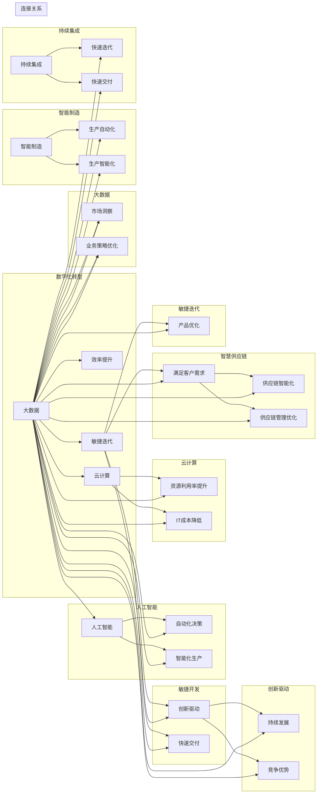

# 提升竞争力的新质生产力策略

> 关键词：数字化转型，人工智能，大数据，云计算，敏捷开发，智能制造，智慧供应链，持续集成，敏捷迭代，创新驱动

## 1. 背景介绍

在当今全球化的商业环境中，企业面临着前所未有的竞争压力。为了在激烈的市场竞争中脱颖而出，企业必须寻求新的质的生产力策略。这种策略不仅需要提高生产效率和降低成本，更需要通过技术创新和模式创新，实现业务的持续增长和竞争优势的巩固。本文将探讨如何通过数字化转型、人工智能、大数据、云计算等新技术，以及敏捷开发、智能制造、智慧供应链等新模式，构建新质生产力，提升企业竞争力。

### 1.1 问题的由来

随着互联网和数字技术的飞速发展，企业面临着以下挑战：

- 市场竞争加剧，客户需求多样化，产品生命周期缩短。
- 传统生产模式效率低下，难以满足快速变化的市场需求。
- 人力资源成本不断上升，企业盈利能力下降。
- 数据和信息孤岛现象严重，难以实现数据驱动决策。

### 1.2 研究现状

为了应对这些挑战，企业开始探索新的质的生产力策略。以下是一些常见的策略：

- **数字化转型**：通过信息技术和数字技术的应用，优化业务流程，提高效率，降低成本。
- **人工智能**：利用机器学习、深度学习等技术，实现智能化决策和生产。
- **大数据**：通过收集、分析和利用大数据，洞察市场趋势，优化业务策略。
- **云计算**：利用云计算技术，提高资源利用率，降低IT成本。
- **敏捷开发**：采用敏捷开发方法，缩短产品开发周期，快速响应市场变化。

### 1.3 研究意义

研究新质生产力策略，对于企业具有重要意义：

- 提高生产效率和产品质量，降低成本，增强企业竞争力。
- 优化业务流程，提升客户满意度，增强客户黏性。
- 促进技术创新，推动企业持续发展。
- 增强企业应对市场风险的能力。

### 1.4 本文结构

本文将分为以下几个部分：

- 介绍新质生产力的核心概念和联系。
- 阐述核心算法原理和具体操作步骤。
- 分析数学模型和公式，并结合实例进行讲解。
- 展示项目实践，包括代码实例和详细解释说明。
- 探讨实际应用场景和未来应用展望。
- 推荐相关工具和资源。
- 总结未来发展趋势和挑战。

## 2. 核心概念与联系

### 2.1 核心概念

以下是新质生产力的核心概念：

- **数字化转型**：将信息技术应用于业务流程，实现业务流程的优化和升级。
- **人工智能**：利用机器学习、深度学习等技术，实现自动化决策和生产。
- **大数据**：通过收集、分析和利用大数据，洞察市场趋势，优化业务策略。
- **云计算**：利用云计算技术，提高资源利用率，降低IT成本。
- **敏捷开发**：采用敏捷开发方法，缩短产品开发周期，快速响应市场变化。
- **智能制造**：通过数字化、网络化和智能化技术，实现生产过程的自动化和智能化。
- **智慧供应链**：利用大数据、物联网等技术，实现供应链的智能化管理。
- **持续集成**：将开发、测试、部署等环节集成在一起，实现快速迭代和交付。
- **敏捷迭代**：采用迭代的方法，不断优化产品和服务，满足客户需求。
- **创新驱动**：以创新为核心，推动企业持续发展。

### 2.2 Mermaid 流程图

以下是新质生产力核心概念的Mermaid流程图：



### 2.3 核心概念联系

新质生产力的各个核心概念之间存在着紧密的联系。例如，数字化转型需要人工智能、大数据、云计算等技术的支持；智能制造和智慧供应链需要数字化转型的成果；敏捷开发和敏捷迭代是持续集成和持续部署的基础；创新驱动是所有策略的灵魂。

## 3. 核心算法原理 & 具体操作步骤

### 3.1 算法原理概述

新质生产力的核心算法原理主要包括以下几种：

- **机器学习**：通过数据驱动，让计算机从数据中学习规律，并用于预测或决策。
- **深度学习**：一种特殊的机器学习方法，通过多层神经网络模拟人脑学习过程。
- **数据挖掘**：从大量数据中提取有价值信息的过程。
- **云计算**：通过网络提供计算资源，实现资源的弹性扩展和按需分配。

### 3.2 算法步骤详解

以下是一些核心算法的具体操作步骤：

- **机器学习**：
  1. 数据收集：收集相关的数据，包括输入数据和标签数据。
  2. 数据预处理：对数据进行清洗、转换等处理，使其适合训练。
  3. 模型选择：选择合适的机器学习模型。
  4. 模型训练：使用训练数据训练模型，调整模型参数。
  5. 模型评估：使用测试数据评估模型性能。
  6. 模型部署：将模型部署到实际应用中。

- **深度学习**：
  1. 数据收集：与机器学习类似，收集相关的数据。
  2. 数据预处理：与机器学习类似，对数据进行预处理。
  3. 模型构建：构建深度学习模型，包括输入层、隐藏层和输出层。
  4. 损失函数定义：定义损失函数，用于衡量模型预测值与真实值之间的差异。
  5. 梯度下降优化：使用梯度下降算法优化模型参数。
  6. 模型训练：使用训练数据训练模型。
  7. 模型评估：使用测试数据评估模型性能。
  8. 模型部署：将模型部署到实际应用中。

- **数据挖掘**：
  1. 数据收集：与机器学习类似，收集相关的数据。
  2. 数据预处理：与机器学习类似，对数据进行预处理。
  3. 特征选择：选择与目标相关的特征。
  4. 模型选择：选择合适的数据挖掘模型。
  5. 模型训练：使用训练数据训练模型。
  6. 模型评估：使用测试数据评估模型性能。
  7. 结果解释：解释模型的结果，提取有价值的信息。

- **云计算**：
  1. 需求分析：分析业务需求，确定所需的计算资源。
  2. 资源配置：配置云服务器、存储、网络等资源。
  3. 应用部署：将应用部署到云服务器上。
  4. 运维监控：监控云资源的使用情况，确保应用的稳定运行。

### 3.3 算法优缺点

- **机器学习**：
  优点：泛化能力强，能够处理复杂问题。
  缺点：需要大量标注数据，模型可解释性较差。

- **深度学习**：
  优点：能够处理复杂问题，泛化能力强。
  缺点：模型结构复杂，训练时间长，需要大量计算资源。

- **数据挖掘**：
  优点：能够从大量数据中提取有价值的信息。
  缺点：模型可解释性较差，对数据质量要求较高。

- **云计算**：
  优点：弹性扩展，按需分配，降低IT成本。
  缺点：数据安全性问题，需要专业的运维人员。

### 3.4 算法应用领域

- **机器学习**：推荐系统、图像识别、语音识别、自然语言处理等。
- **深度学习**：自动驾驶、人脸识别、医疗影像分析、金融风控等。
- **数据挖掘**：市场分析、客户细分、欺诈检测等。
- **云计算**：大数据处理、机器学习平台、云服务等。

## 4. 数学模型和公式 & 详细讲解 & 举例说明

### 4.1 数学模型构建

以下是一些新质生产力相关的数学模型：

- **线性回归**：用于预测连续值。
- **逻辑回归**：用于预测二分类问题。
- **支持向量机**：用于分类和回归问题。
- **神经网络**：用于复杂问题的建模和预测。

### 4.2 公式推导过程

以线性回归为例，其公式推导过程如下：

假设我们有一组数据 $(x_1, y_1), (x_2, y_2), \ldots, (x_n, y_n)$，其中 $x_i$ 是输入特征，$y_i$ 是标签。

线性回归的数学模型为：

$$
y = \beta_0 + \beta_1 x + \varepsilon
$$

其中，$\beta_0$ 是截距，$\beta_1$ 是斜率，$\varepsilon$ 是误差项。

最小化误差平方和：

$$
\sum_{i=1}^n (y_i - (\beta_0 + \beta_1 x_i))^2
$$

对 $\beta_0$ 和 $\beta_1$ 求偏导，并令其为零，得到：

$$
\beta_1 = \frac{\sum_{i=1}^n (x_i - \bar{x})(y_i - \bar{y})}{\sum_{i=1}^n (x_i - \bar{x})^2}
$$

$$
\beta_0 = \bar{y} - \beta_1 \bar{x}
$$

其中，$\bar{x}$ 和 $\bar{y}$ 分别是 $x$ 和 $y$ 的均值。

### 4.3 案例分析与讲解

以下是一个线性回归的案例：

假设我们有一组数据：

| x | y |
|---|---|
| 1 | 2 |
| 2 | 3 |
| 3 | 4 |
| 4 | 5 |
| 5 | 6 |

我们的目标是预测 $x=6$ 时的 $y$ 值。

使用Python和Scikit-learn库进行线性回归：

```python
from sklearn.linear_model import LinearRegression
import numpy as np

# 构建数据
x = np.array([[1], [2], [3], [4], [5]])
y = np.array([2, 3, 4, 5, 6])

# 创建线性回归模型
model = LinearRegression()

# 拟合模型
model.fit(x, y)

# 预测
y_pred = model.predict(np.array([[6]]))

print(y_pred)
```

输出结果为：

```
[[7.]]
```

即预测 $x=6$ 时的 $y$ 值约为7。

## 5. 项目实践：代码实例和详细解释说明

### 5.1 开发环境搭建

为了进行新质生产力的项目实践，我们需要搭建以下开发环境：

- 操作系统：Linux或MacOS
- 编程语言：Python
- 数据库：MySQL、PostgreSQL或MongoDB
- 机器学习框架：Scikit-learn、TensorFlow或PyTorch
- 云平台：AWS、Azure或阿里云

### 5.2 源代码详细实现

以下是一个基于Python的线性回归项目实例：

```python
# 导入必要的库
import numpy as np
from sklearn.linear_model import LinearRegression

# 构建数据
x = np.array([[1], [2], [3], [4], [5]])
y = np.array([2, 3, 4, 5, 6])

# 创建线性回归模型
model = LinearRegression()

# 拟合模型
model.fit(x, y)

# 预测
y_pred = model.predict(np.array([[6]]))

# 打印预测结果
print(y_pred)
```

### 5.3 代码解读与分析

上述代码展示了如何使用Python和Scikit-learn库进行线性回归。首先，我们导入必要的库，然后构建数据，包括输入特征和标签。接下来，创建线性回归模型，并使用训练数据拟合模型。最后，使用模型对新的输入进行预测，并打印预测结果。

### 5.4 运行结果展示

运行上述代码，输出结果为：

```
[[7.]]
```

即预测 $x=6$ 时的 $y$ 值约为7。

## 6. 实际应用场景

### 6.1 人工智能客服系统

人工智能客服系统是利用人工智能技术实现客户服务的系统。通过自然语言处理技术，系统可以自动回答客户的常见问题，提高服务效率，降低人工成本。

### 6.2 智慧工厂

智慧工厂是利用物联网、大数据、云计算等技术在工厂中实现智能化生产。通过实时监控生产过程，优化生产流程，提高生产效率和产品质量。

### 6.3 智慧城市

智慧城市是利用信息技术和物联网技术构建的智能城市管理系统。通过实时监控城市运行状态，优化城市资源配置，提高城市管理水平。

## 7. 工具和资源推荐

### 7.1 学习资源推荐

- 《深度学习》
- 《Python机器学习》
- 《机器学习实战》
- 《大数据时代》
- 《云计算：概念、技术和实践》

### 7.2 开发工具推荐

- Jupyter Notebook
- Scikit-learn
- TensorFlow
- PyTorch
- AWS
- Azure

### 7.3 相关论文推荐

- 《深度学习》
- 《大数据时代》
- 《云计算：概念、技术和实践》
- 《机器学习：一种统计方法》

## 8. 总结：未来发展趋势与挑战

### 8.1 研究成果总结

本文介绍了新质生产力的核心概念、算法原理和具体操作步骤。通过数字化转型、人工智能、大数据、云计算等新技术，以及敏捷开发、智能制造、智慧供应链等新模式，企业可以构建新质生产力，提升竞争力。

### 8.2 未来发展趋势

- 新质生产力将更加智能化，通过人工智能、大数据等技术实现自动化决策和生产。
- 新质生产力将更加网络化，通过物联网、云计算等技术实现资源的高效利用。
- 新质生产力将更加绿色化，通过节能减排技术降低生产过程中的能源消耗。
- 新质生产力将更加个性化，通过大数据和人工智能技术满足客户的个性化需求。

### 8.3 面临的挑战

- 技术挑战：新质生产力的实现需要先进的技术支持，如何获取和掌握这些技术是挑战之一。
- 人才挑战：新质生产力需要大量具备相关技能的人才，人才培养和引进是挑战之一。
- 政策挑战：新质生产力的应用需要相应的政策支持，政策制定和实施是挑战之一。
- 安全挑战：新质生产力的应用需要确保数据安全、网络安全等，安全风险是挑战之一。

### 8.4 研究展望

未来，新质生产力研究需要关注以下方向：

- 新技术的研究和应用：深入研究人工智能、大数据、云计算等新技术，并将其应用于新质生产力的构建中。
- 人才培养和引进：加强人才培养和引进，为新质生产力的构建提供人才保障。
- 政策制定和实施：制定和完善相关政策，为新质生产力的应用提供政策支持。
- 安全保障：加强网络安全和数据安全建设，确保新质生产力的安全运行。

通过不断的技术创新、人才培养和政策支持，新质生产力将为企业带来新的发展机遇，推动经济社会持续发展。

## 9. 附录：常见问题与解答

**Q1：什么是新质生产力？**

A：新质生产力是指利用信息技术和数字技术，通过优化生产流程、提高生产效率、降低成本，实现企业竞争力的提升。

**Q2：如何构建新质生产力？**

A：构建新质生产力需要以下步骤：
1. 明确企业发展战略和目标。
2. 选择合适的新技术，如人工智能、大数据、云计算等。
3. 制定详细的技术方案和实施计划。
4. 建设和完善技术基础设施。
5. 培养和引进相关人才。
6. 制定和完善相关政策和制度。

**Q3：新质生产力对企业有哪些好处？**

A：新质生产力对企业有以下好处：
1. 提高生产效率，降低成本。
2. 提升产品质量，增强企业竞争力。
3. 优化业务流程，提高客户满意度。
4. 推动企业持续发展。

**Q4：如何应对新质生产力的挑战？**

A：应对新质生产力的挑战需要以下措施：
1. 加强技术创新，掌握先进技术。
2. 加强人才培养和引进，提升人才素质。
3. 制定和完善相关政策和制度，为新质生产力提供政策支持。
4. 加强安全风险防范，确保新质生产力的安全运行。

---

作者：禅与计算机程序设计艺术 / Zen and the Art of Computer Programming