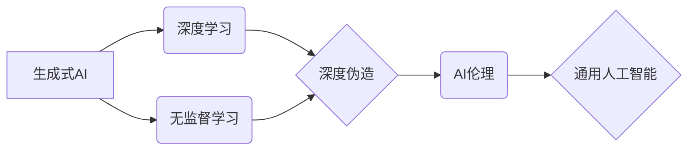

# 生成式AI：金矿还是泡沫？第二部分：AI不是万能药

> 关键词：生成式AI，深度学习，无监督学习，深度伪造，AI伦理，通用人工智能，AI泡沫

## 1. 背景介绍

在上一部分中，我们探讨了生成式AI的兴起及其带来的变革。从GPT-3到DALL-E，生成式AI在图像生成、文本创作、音乐合成等领域展现出了惊人的能力。然而，随着AI技术的飞速发展，我们也开始意识到其潜在的风险和挑战。本篇文章将深入探讨AI是否真的是万能药，以及我们在拥抱AI的同时，需要警惕哪些风险。

## 2. 核心概念与联系

### 2.1 核心概念原理

- **生成式AI**：一种能够生成数据（如图像、文本、音频等）的人工智能系统。它通过学习大量数据，学会数据的分布，并能够根据输入生成新的数据。

- **深度学习**：一种机器学习范式，它通过构建多层的神经网络模型，从大量数据中学习复杂模式。

- **无监督学习**：一种机器学习方法，它不需要标签数据，而是通过学习数据内在的结构和模式。

- **深度伪造**：使用AI技术制作假图像、视频、音频等，这些内容在外观上可能难以与真实内容区分。

- **AI伦理**：关注AI技术的道德和伦理问题，包括隐私、歧视、公平性等。

- **通用人工智能**：一种能够执行任何人类智能任务的AI系统。

### 2.2 核心概念架构图



## 3. 核心算法原理 & 具体操作步骤

### 3.1 算法原理概述

生成式AI的核心是深度学习，特别是生成对抗网络（GANs）和变分自编码器（VAEs）。GANs由两个网络组成：生成器和判别器。生成器尝试生成数据，而判别器则试图区分生成器和真实数据。VAEs则通过最大化数据分布的似然性来生成数据。

### 3.2 算法步骤详解

1. 数据准备：收集大量相关数据，用于训练生成模型。
2. 模型选择：选择合适的生成模型，如GANs或VAEs。
3. 模型训练：使用数据集训练生成模型，调整模型参数以优化生成质量。
4. 生成数据：使用训练好的模型生成新数据。
5. 评估与优化：评估生成数据的质量，并调整模型参数以提升生成效果。

### 3.3 算法优缺点

**优点**：

- 能够生成高质量、逼真的数据。
- 不需要标签数据，适用于无监督学习任务。
- 应用领域广泛，包括图像生成、文本生成、音频生成等。

**缺点**：

- 训练过程复杂，需要大量计算资源。
- 模型训练可能存在模式崩溃（mode collapse）问题。
- 难以控制生成数据的细节。

### 3.4 算法应用领域

生成式AI在以下领域有广泛的应用：

- 图像和视频生成：如GANs在艺术创作、电影特效、医学图像等方面的应用。
- 文本生成：如GPT系列在文章写作、对话系统、机器翻译等方面的应用。
- 音频生成：如音乐创作、语音合成等方面的应用。

## 4. 数学模型和公式 & 详细讲解 & 举例说明

### 4.1 数学模型构建

GANs的数学模型如下：

$$
\text{Generator}(G) : \mathbb{R}^{z} \rightarrow \mathbb{R}^{x} \\
\text{Discriminator}(D) : \mathbb{R}^{x} \rightarrow \mathbb{R}
$$

其中 $G$ 是生成器，$D$ 是判别器，$z$ 是随机噪声向量，$x$ 是生成数据的空间。

### 4.2 公式推导过程

GANs的训练过程可以理解为以下两个对抗性游戏的迭代：

1. 生成器试图生成数据，使得判别器无法区分真实数据和生成数据。
2. 判别器试图区分真实数据和生成数据。

### 4.3 案例分析与讲解

以GANs在图像生成的应用为例，生成器生成图像，判别器判断图像的真实性。通过不断迭代，生成器的图像质量会逐渐提升，直至接近真实图像。

## 5. 项目实践：代码实例和详细解释说明

### 5.1 开发环境搭建

由于生成式AI需要大量计算资源，以下以Python和TensorFlow为例，介绍开发环境的搭建。

1. 安装Python和pip。
2. 安装TensorFlow：`pip install tensorflow-gpu`（如果使用GPU）。

### 5.2 源代码详细实现

以下是一个简单的GANs图像生成示例：

```python
import tensorflow as tf
from tensorflow import keras

# 生成器模型
def build_generator():
    model = keras.Sequential([
        keras.layers.Dense(7 * 7 * 256, activation="relu", input_shape=(100,)),
        keras.layers.Reshape((7, 7, 256)),
        keras.layers.Conv2DTranspose(128, (4, 4), strides=2, padding="same", activation="relu"),
        keras.layers.Conv2DTranspose(64, (4, 4), strides=2, padding="same", activation="relu"),
        keras.layers.Conv2DTranspose(1, (4, 4), strides=2, padding="same", activation="tanh"),
    ])
    return model

# 判别器模型
def build_discriminator():
    model = keras.Sequential([
        keras.layers.Conv2D(64, (5, 5), strides=2, padding="same", input_shape=[28, 28, 1]),
        keras.layers.LeakyReLU(alpha=0.2),
        keras.layers.Flatten(),
        keras.layers.Dense(1, activation="sigmoid"),
    ])
    return model

# 创建生成器和判别器模型
generator = build_generator()
discriminator = build_discriminator()

# 编译模型
generator.compile(loss="binary_crossentropy", optimizer=keras.optimizers.Adam())
discriminator.compile(loss="binary_crossentropy", optimizer=keras.optimizers.Adam())

# 运行训练
# ...
```

### 5.3 代码解读与分析

以上代码定义了生成器和判别器模型，并编译了GANs。在实际训练过程中，需要设计训练循环，通过迭代优化生成器和判别器的参数。

### 5.4 运行结果展示

通过训练，生成器可以生成逼真的图像。

## 6. 实际应用场景

生成式AI在以下场景有实际应用：

- **艺术创作**：如生成艺术作品、音乐、视频等。
- **游戏开发**：如生成游戏场景、角色、物品等。
- **医学影像**：如生成医学图像、辅助诊断等。
- **娱乐**：如生成虚拟偶像、角色扮演等。

## 7. 工具和资源推荐

### 7.1 学习资源推荐

- 《深度学习》（Goodfellow, Bengio, Courville）
- 《Generative Adversarial Nets》
- 《Unsupervised Representation Learning with Deep Convolutional Generative Adversarial Networks》

### 7.2 开发工具推荐

- TensorFlow
- PyTorch
- Keras

### 7.3 相关论文推荐

- Generative Adversarial Nets
- Unsupervised Representation Learning with Deep Convolutional Generative Adversarial Networks
- InfoGAN: Interpretable Representation Learning by Information Maximizing Generative Adversarial Nets

## 8. 总结：未来发展趋势与挑战

### 8.1 研究成果总结

生成式AI作为一种新兴的人工智能技术，在图像、文本、音频等领域展现出巨大的潜力。然而，其发展也面临着诸多挑战，如计算资源、模型复杂度、伦理问题等。

### 8.2 未来发展趋势

- 模型小型化：为了降低计算成本，生成式AI模型将趋向于小型化。
- 可解释性：为了提高AI系统的透明度和可信度，生成式AI的可解释性将得到重视。
- 多模态融合：生成式AI将与其他模态（如图像、音频）进行融合，生成更丰富的数据。

### 8.3 面临的挑战

- 计算资源：生成式AI需要大量的计算资源，限制了其应用范围。
- 模型复杂度：生成式AI模型的复杂度高，难以理解和优化。
- 伦理问题：生成式AI可能被用于生成虚假信息、侵犯隐私等，引发伦理问题。

### 8.4 研究展望

生成式AI的未来发展将更加注重以下几个方面：

- 降低计算成本，提高模型效率。
- 提高模型的可解释性和可信度。
- 加强AI伦理研究，确保AI技术的健康发展。

## 9. 附录：常见问题与解答

**Q1：生成式AI和生成对抗网络（GANs）有什么区别？**

A：生成式AI是一种更广泛的概念，包括GANs、VAEs等。GANs是生成式AI的一种具体实现，通过对抗性训练生成数据。

**Q2：生成式AI有哪些潜在风险？**

A：生成式AI可能被用于生成虚假信息、侵犯隐私、误导消费者等，引发伦理和道德问题。

**Q3：如何确保生成式AI的伦理和道德？**

A：需要建立完善的AI伦理和道德规范，加强监管，确保AI技术的健康发展。

作者：禅与计算机程序设计艺术 / Zen and the Art of Computer Programming