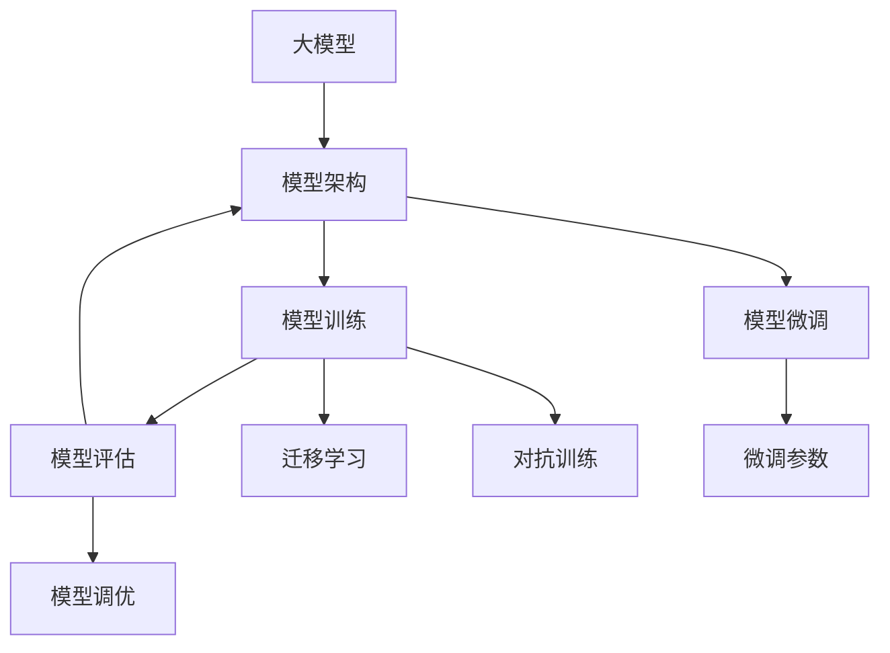
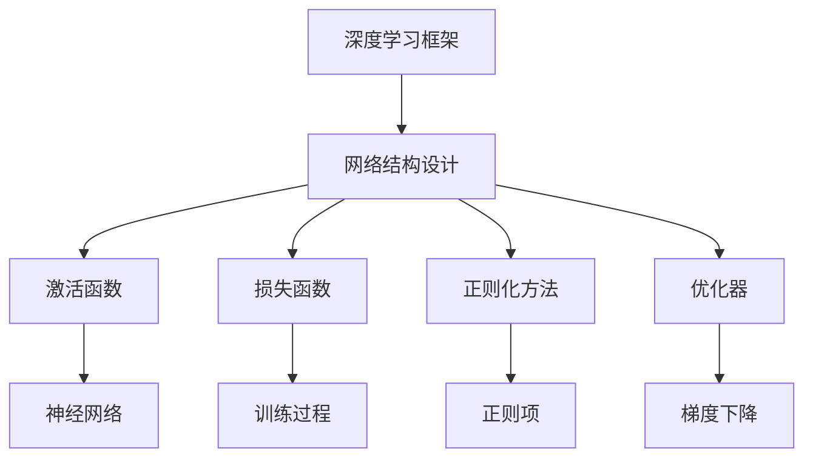
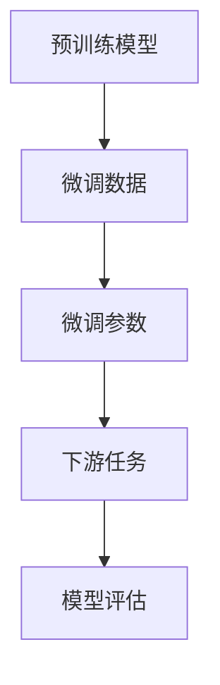

                 

# 从零开始大模型开发与微调：模型的设计

> 关键词：大模型,微调,模型设计,模型架构,模型训练,模型评估,深度学习,自然语言处理(NLP),计算机视觉(CV),机器学习

## 1. 背景介绍

### 1.1 问题由来
近年来，随着深度学习技术的飞速发展，大模型在计算机视觉、自然语言处理、语音识别等领域的性能显著提升，广泛应用于自动驾驶、智能客服、智能翻译、语音识别等场景。然而，大模型开发和微调仍是一项复杂而高难度的工作，需要深厚的专业知识和丰富的工程经验。

为了帮助广大开发者系统地掌握大模型开发和微调的技术要点，我们撰写此文，从模型的设计、训练到微调各个方面进行详细讲解，希望能为大家提供有益的参考。

### 1.2 问题核心关键点
本文将详细介绍大模型开发和微调的关键点，包括：

1. 大模型设计原则和架构。
2. 模型的训练和优化策略。
3. 微调方法的选择和应用。
4. 模型评估和性能调优技巧。
5. 实际应用场景和未来发展趋势。

## 2. 核心概念与联系

### 2.1 核心概念概述

为更好地理解大模型的开发与微调，本节将介绍几个密切相关的核心概念：

- **大模型**：指基于深度学习框架训练的庞大参数量模型，如BERT、GPT、ResNet等。通过在大量数据上预训练，大模型具备了强大的特征提取和泛化能力。

- **模型架构**：指大模型内部的层次结构和组件配置，包括卷积层、池化层、全连接层、注意力机制等。架构设计直接影响模型的性能和复杂度。

- **模型训练**：指通过大量数据训练大模型，优化参数以匹配模型输出和目标输出的过程。训练过程需要选择合适的优化器、学习率、批次大小等超参数。

- **模型评估**：指在验证集或测试集上评估模型性能，包括准确率、召回率、F1分数等指标。评估过程需确保模型在未知数据上的泛化能力。

- **模型微调**：指在预训练模型基础上，使用下游任务数据进一步优化模型，使其适应特定任务。微调过程需要调整模型参数，保持预训练权重。

- **迁移学习**：指将一个领域的知识迁移到另一个领域，提升模型在新任务上的性能。常见于大模型预训练到微调的过程。

- **对抗训练**：指在训练过程中加入对抗样本，提升模型对攻击的鲁棒性。

- **正则化**：指在损失函数中加入正则项，防止过拟合，保持模型的泛化能力。

这些概念之间存在着紧密的联系，形成了大模型开发和微调的核心生态系统。以下通过一个简单的Mermaid流程图展示这些概念之间的关系：



这个流程图展示了从模型设计、训练到微调的完整过程，以及各环节之间的紧密联系。

### 2.2 概念间的关系

这些核心概念之间存在着紧密的联系，形成了大模型开发和微调的整体架构。下面我们通过几个Mermaid流程图来展示这些概念之间的关系。

#### 2.2.1 大模型设计



这个流程图展示了从深度学习框架选择到模型设计的各个环节，包括网络结构、激活函数、损失函数、正则化方法和优化器的选择。

#### 2.2.2 模型训练


这个流程图展示了模型训练的基本流程，包括数据输入、前向传播、损失函数计算、反向传播和参数更新。

#### 2.2.3 模型微调



这个流程图展示了模型微调的过程，包括预训练模型的引入、微调数据的准备、微调参数的调整以及下游任务的评估。

## 3. 核心算法原理 & 具体操作步骤

### 3.1 算法原理概述

大模型的开发和微调，本质上是一个从无到有、从有到优的过程。其核心思想是通过大量数据训练模型，使其具备良好的泛化能力，并在特定任务上进行微调，提升模型在目标任务上的性能。

形式化地，假设我们有一个输入为 $x$，输出为 $y$ 的模型 $M$，训练数据集为 $D=\{(x_i, y_i)\}_{i=1}^N$。我们的目标是最小化模型在训练集上的损失函数：

$$
\min_{\theta} \sum_{i=1}^N \ell(M(x_i), y_i)
$$

其中 $\ell$ 为损失函数，可以是均方误差、交叉熵等。在训练过程中，我们通过梯度下降等优化算法，更新模型参数 $\theta$，使得损失函数最小化。

在模型训练完成后，我们使用下游任务数据集 $D'$ 对模型进行微调，使其在特定任务上取得更好的性能。微调过程的目标是最小化模型在微调数据集 $D'$ 上的损失函数：

$$
\min_{\theta} \sum_{i=1}^M \ell'(M(x_i'), y_i')
$$

其中 $\ell'$ 为微调数据集上的损失函数，$\theta$ 为模型参数。

### 3.2 算法步骤详解

大模型的开发和微调一般包括以下几个关键步骤：

**Step 1: 数据准备与预处理**
- 收集或购买数据集，确保数据的多样性和代表性。
- 对数据进行预处理，包括数据清洗、归一化、特征提取等。

**Step 2: 模型设计**
- 选择合适的深度学习框架（如TensorFlow、PyTorch等）和网络结构。
- 设计模型的层次结构和组件配置，包括卷积层、池化层、全连接层、注意力机制等。
- 确定激活函数、损失函数、正则化方法和优化器。

**Step 3: 模型训练**
- 将数据集分为训练集、验证集和测试集。
- 设置训练参数，包括学习率、批次大小、迭代轮数等。
- 使用梯度下降等优化算法，不断更新模型参数，最小化损失函数。
- 在验证集上监测模型性能，避免过拟合。

**Step 4: 模型微调**
- 收集或生成下游任务数据集。
- 在预训练模型的基础上，调整模型参数，适应特定任务。
- 使用对抗训练、正则化等方法，提升模型鲁棒性。
- 在测试集上评估微调后的模型性能。

**Step 5: 模型评估与优化**
- 使用准确率、召回率、F1分数等指标，评估模型在测试集上的性能。
- 对模型进行调优，调整超参数、优化器等。
- 返回训练好的模型，用于实际应用。

### 3.3 算法优缺点

大模型开发和微调具有以下优点：
1. 强大的泛化能力：通过预训练在大规模数据上学习通用特征，提高模型在新任务上的泛化能力。
2. 高精度：大模型拥有大量参数，可以有效捕捉数据细节，提高模型精度。
3. 可迁移性：预训练模型可以作为基础，适应多种下游任务。
4. 计算效率：大模型在特定任务上的微调往往参数量较少，计算效率高。

同时，大模型开发和微调也存在以下缺点：
1. 数据需求高：预训练模型需要大量数据，数据准备和获取成本高。
2. 计算资源消耗大：大模型训练和微调需要高性能计算资源，如GPU/TPU。
3. 过拟合风险：大模型参数量大，容易过拟合，需要正则化等技术。
4. 模型复杂度高：大模型结构复杂，难以理解和调试。

### 3.4 算法应用领域

大模型开发和微调技术在多个领域得到了广泛应用，包括：

- 计算机视觉：用于图像分类、目标检测、语义分割等任务。
- 自然语言处理：用于文本分类、情感分析、机器翻译等任务。
- 语音识别：用于语音命令识别、语音合成等任务。
- 推荐系统：用于用户行为预测、商品推荐等任务。
- 医疗健康：用于疾病诊断、治疗方案推荐等任务。
- 金融科技：用于风险评估、欺诈检测等任务。

## 4. 数学模型和公式 & 详细讲解

### 4.1 数学模型构建

大模型的开发和微调涉及多个数学模型，包括训练模型、损失函数、优化算法等。以下是一些常见的数学模型：

- **训练模型**：假设模型为 $M(x; \theta)$，其中 $x$ 为输入，$\theta$ 为模型参数。
- **损失函数**：假设损失函数为 $\ell(M(x), y)$，其中 $y$ 为真实标签。
- **优化算法**：假设优化算法为 $\nabla_{\theta} \ell(M(x), y)$，其中 $\nabla_{\theta}$ 为参数梯度。

### 4.2 公式推导过程

以二分类任务为例，展示模型的训练和微调过程：

**训练过程**：

假设模型为 $M(x; \theta) = \sigma(Wx + b)$，其中 $\sigma$ 为激活函数，$W$ 和 $b$ 为模型参数。

对于每个样本 $(x, y)$，其损失函数为：

$$
\ell(M(x), y) = -(y\log(M(x)) + (1-y)\log(1-M(x)))
$$

通过反向传播算法，计算梯度 $\nabla_{\theta} \ell(M(x), y)$：

$$
\nabla_{\theta} \ell(M(x), y) = (M(x) - y)\nabla_{\theta} M(x)
$$

更新模型参数：

$$
\theta \leftarrow \theta - \eta \nabla_{\theta} \ell(M(x), y)
$$

其中 $\eta$ 为学习率。

**微调过程**：

假设微调数据集为 $D' = \{(x_i', y_i')\}_{i=1}^M$，微调损失函数为：

$$
\ell'(M(x_i'), y_i') = -(y_i'\log(M(x_i'))) - (1-y_i')\log(1-M(x_i'))
$$

微调过程中，更新模型参数：

$$
\theta \leftarrow \theta - \eta' \nabla_{\theta} \ell'(M(x_i'), y_i')
$$

其中 $\eta'$ 为微调学习率。

### 4.3 案例分析与讲解

以ResNet为例，展示大模型开发和微调的具体过程：

**ResNet架构**：

ResNet采用残差网络结构，通过跨层连接解决梯度消失问题，提高深度网络的表达能力。

**训练过程**：

假设ResNet模型为 $M(x; \theta) = \sum_i \phi_i(x)$，其中 $\phi_i$ 为各层变换函数。

对于每个样本 $(x, y)$，其损失函数为：

$$
\ell(M(x), y) = \frac{1}{N}\sum_i \ell_i(M(x), y)
$$

其中 $\ell_i$ 为各层的损失函数。

通过反向传播算法，计算梯度 $\nabla_{\theta} \ell(M(x), y)$：

$$
\nabla_{\theta} \ell(M(x), y) = \frac{1}{N}\sum_i \nabla_{\theta} \ell_i(M(x), y)
$$

更新模型参数：

$$
\theta \leftarrow \theta - \eta \nabla_{\theta} \ell(M(x), y)
$$

**微调过程**：

假设微调数据集为 $D' = \{(x_i', y_i')\}_{i=1}^M$，微调损失函数为：

$$
\ell'(M(x_i'), y_i') = \frac{1}{M}\sum_i \ell'_i(M(x_i'), y_i')
$$

其中 $\ell'_i$ 为各层的微调损失函数。

更新模型参数：

$$
\theta \leftarrow \theta - \eta' \nabla_{\theta} \ell'(M(x_i'), y_i')
$$

## 5. 项目实践：代码实例和详细解释说明

### 5.1 开发环境搭建

在进行大模型开发和微调前，需要准备好开发环境。以下是使用Python进行TensorFlow开发的环境配置流程：

1. 安装Anaconda：从官网下载并安装Anaconda，用于创建独立的Python环境。

2. 创建并激活虚拟环境：
```bash
conda create -n tf-env python=3.8 
conda activate tf-env
```

3. 安装TensorFlow：根据CUDA版本，从官网获取对应的安装命令。例如：
```bash
conda install tensorflow=2.6 -c tf -c conda-forge
```

4. 安装各类工具包：
```bash
pip install numpy pandas scikit-learn matplotlib tqdm jupyter notebook ipython
```

完成上述步骤后，即可在`tf-env`环境中开始大模型开发和微调实践。

### 5.2 源代码详细实现

下面我们以ImageNet分类任务为例，给出使用TensorFlow进行ResNet模型开发和微调的代码实现。

首先，定义ResNet模型：

```python
import tensorflow as tf
from tensorflow.keras import layers, models

def resnet_layer(inputs, num_filters, size, strides=1):
    filters_in = tf.keras.layers.get_shape(inputs)[3]
    if strides > 1:
        inputs = tf.keras.layers.Conv2D(num_filters, (size, size), strides=strides, padding='same', activation='relu', name='conv' + str(i+1))(inputs)
        inputs = tf.keras.layers.BatchNormalization(name='bn' + str(i+1))(inputs)
        inputs = tf.keras.layers.Conv2D(num_filters, (size, size), strides=1, padding='same', activation='relu', name='conv' + str(i+2))(inputs)
        inputs = tf.keras.layers.BatchNormalization(name='bn' + str(i+2))(inputs)
        return tf.keras.layers.MaxPooling2D((2, 2), strides=strides, padding='same', name='pool' + str(i+1))(inputs)
    else:
        inputs = tf.keras.layers.Conv2D(num_filters, (size, size), strides=strides, padding='same', activation='relu', name='conv' + str(i+1))(inputs)
        inputs = tf.keras.layers.BatchNormalization(name='bn' + str(i+1))(inputs)
        return inputs

def resnet_v1(input_shape=(224, 224, 3), num_classes=1000):
    inputs = tf.keras.layers.Input(shape=input_shape)
    x = layers.Conv2D(64, (7, 7), strides=(2, 2), padding='same', activation='relu', name='conv1')(inputs)
    x = layers.MaxPooling2D((3, 3), strides=(2, 2), padding='same', name='pool1')(x)
    x = resnet_layer(x, 64, 3)
    x = resnet_layer(x, 64, 3, strides=2)
    x = resnet_layer(x, 128, 3)
    x = resnet_layer(x, 128, 3, strides=2)
    x = resnet_layer(x, 256, 3)
    x = resnet_layer(x, 256, 3, strides=2)
    x = resnet_layer(x, 512, 3)
    x = resnet_layer(x, 512, 3, strides=2)
    x = layers.Flatten()(x)
    x = tf.keras.layers.Dense(4096, activation='relu', name='fc1')(x)
    x = tf.keras.layers.Dropout(0.4)(x)
    outputs = tf.keras.layers.Dense(num_classes, activation='softmax', name='fc2')(x)
    model = models.Model(inputs, outputs)
    return model
```

然后，定义训练和评估函数：

```python
from tensorflow.keras.optimizers import RMSprop
from tensorflow.keras.datasets import cifar10

batch_size = 32
epochs = 100

def train_epoch(model, data, optimizer):
    x_train, y_train = data[0]
    x_val, y_val = data[1]
    model.compile(optimizer=optimizer, loss='categorical_crossentropy', metrics=['accuracy'])
    model.fit(x_train, y_train, batch_size=batch_size, epochs=1, validation_data=(x_val, y_val))
    return model.evaluate(x_val, y_val)

def evaluate(model, data, batch_size):
    x_test, y_test = data[0]
    return model.evaluate(x_test, y_test, batch_size=batch_size)
```

接着，启动训练流程：

```python
model = resnet_v1()
optimizer = RMSprop(lr=0.001)
data = cifar10.load_data()
train_epoch(model, data, optimizer)
evaluate(model, data, batch_size)
```

以上就是使用TensorFlow进行ResNet模型开发和微调的完整代码实现。可以看到，得益于TensorFlow的高效API，我们可以用相对简洁的代码完成模型的构建和微调。

### 5.3 代码解读与分析

让我们再详细解读一下关键代码的实现细节：

**resnet_layer函数**：
- 实现ResNet层的网络结构，包括卷积层、池化层、批归一化等。
- 注意使用 strides 参数控制卷积层的步长。

**resnet_v1函数**：
- 定义完整的ResNet模型架构。
- 使用 layers.Conv2D 创建卷积层，使用 layers.MaxPooling2D 创建池化层，使用 layers.Flatten 创建全连接层。
- 在全连接层之前添加 Dropout 层，防止过拟合。

**train_epoch函数**：
- 使用 model.compile 进行模型编译，设置损失函数和评价指标。
- 使用 model.fit 进行模型训练，设置 batch_size 和 epochs。
- 返回模型在验证集上的评估结果。

**evaluate函数**：
- 使用 model.evaluate 进行模型评估，返回模型在测试集上的评估结果。

**训练流程**：
- 定义模型、优化器、数据集。
- 使用 train_epoch 函数进行训练，并在每个epoch后评估模型性能。
- 在测试集上评估模型性能。

可以看到，TensorFlow提供的高级API使得模型开发和微调过程变得简洁高效。开发者可以专注于模型设计、数据准备和超参数调优等高层逻辑，而不必过多关注底层的实现细节。

当然，实际应用中还需要考虑更多因素，如模型裁剪、量化加速、服务化封装、弹性伸缩、监控告警等，以确保大模型在实际场景中能够稳定、高效、安全地运行。

## 6. 实际应用场景

### 6.1 智能推荐系统

基于大模型的智能推荐系统，可以广泛应用于电商、社交、内容等领域。传统推荐系统往往依赖用户行为数据进行推荐，无法深入理解用户真实兴趣。通过大模型微调，推荐系统可以更好地挖掘用户语义信息，实现更精准的个性化推荐。

在实践中，可以收集用户浏览、点击、评论、分享等行为数据，提取和用户交互的物品标题、描述、标签等文本内容。将文本内容作为模型输入，用户的后续行为（如是否点击、购买等）作为监督信号，在此基础上微调预训练语言模型。微调后的模型能够从文本内容中准确把握用户的兴趣点。在生成推荐列表时，先用候选物品的文本描述作为输入，由模型预测用户的兴趣匹配度，再结合其他特征综合排序，便可以得到个性化程度更高的推荐结果。

### 6.2 医疗影像诊断

大模型在医疗影像诊断中的应用也备受关注。传统影像诊断依赖于专家经验，成本高、效率低。通过大模型微调，医生可以快速准确地诊断疾病，提升诊疗效率。

在实践中，可以收集大量医疗影像数据，包括CT、MRI、X光等。将影像数据作为模型输入，医生的诊断结果作为监督信号，在此基础上微调预训练模型。微调后的模型能够学习到疾病与影像特征之间的关联关系，提升对新影像的诊断能力。在临床实践中，医生只需输入新病人的影像数据，系统即可给出初步诊断结果，显著提升诊断效率和准确性。

### 6.3 金融风险管理

金融领域面临海量数据和高风险问题，需要通过大模型微调进行风险管理。通过微调，金融模型可以学习到市场行为、风险特征之间的复杂关系，实时预测风险，降低金融机构的损失。

在实践中，可以收集历史交易数据、市场新闻、社交媒体等，提取其中的金融相关信息。将文本和数值数据作为模型输入，金融事件的频率和影响程度作为监督信号，在此基础上微调预训练模型。微调后的模型能够实时监测市场变化，预测风险事件，帮助金融机构及时采取应对措施，降低风险损失。

## 7. 工具和资源推荐

### 7.1 学习资源推荐

为了帮助开发者系统掌握大模型开发和微调的理论基础和实践技巧，这里推荐一些优质的学习资源：

1. 《深度学习入门》系列书籍：由李沐等撰写的入门书籍，深入浅出地介绍了深度学习的基础知识和大模型开发实践。

2. 《自然语言处理综述》系列文章：知乎专栏，涵盖了NLP领域的经典模型和最新研究进展，适合深度学习从业者阅读。

3. Coursera《深度学习专项课程》：斯坦福大学开设的深度学习课程，提供丰富的视频教程和作业练习，帮助入门者建立坚实的理论基础。

4. Udacity《深度学习纳米学位》：提供实战项目的深度学习课程，适合希望系统学习大模型开发和微调的技术人员。

5. Kaggle竞赛平台：提供丰富的竞赛项目，锻炼实战能力和创新思维，适合希望在实践中提升技能的学习者。

通过对这些资源的学习实践，相信你一定能够快速掌握大模型开发和微调的精髓，并用于解决实际的NLP问题。

### 7.2 开发工具推荐

高效的开发离不开优秀的工具支持。以下是几款用于大模型开发和微调开发的常用工具：

1. TensorFlow：基于Python的开源深度学习框架，计算图灵活，适合复杂模型和大规模训练。

2. PyTorch：基于Python的开源深度学习框架，动态图设计，适合快速原型开发和实验。

3. Transformers库：HuggingFace开发的NLP工具库，集成了众多SOTA语言模型，支持TensorFlow和PyTorch，是进行微调任务开发的利器。

4. Jupyter Notebook：强大的交互式开发环境，支持多种编程语言，适合快速迭代实验和文档记录。

5. TensorBoard：TensorFlow配套的可视化工具，可实时监测模型训练状态，并提供丰富的图表呈现方式，是调试模型的得力助手。

6. Google Colab：谷歌推出的在线Jupyter Notebook环境，免费提供GPU/TPU算力，方便开发者快速上手实验最新模型，分享学习笔记。

合理利用这些工具，可以显著提升大模型开发和微调的效率，加快创新迭代的步伐。

### 7.3 相关论文推荐

大模型开发和微调技术的发展源于学界的持续研究。以下是几篇奠基性的相关论文，推荐阅读：

1. ImageNet大规模视觉识别竞赛（ImageNet Large Scale Visual Recognition Challenge, ILSVRC）：展示了深度学习在计算机视觉领域的强大能力，推动了ResNet、Inception等经典模型的诞生。

2. Attention is All You Need：提出了Transformer结构，开启了NLP领域的预训练大模型时代。

3. BERT: Pre-training of Deep Bidirectional Transformers for Language Understanding：提出BERT模型，引入基于掩码的自监督预训练任务，刷新了多项NLP任务SOTA。

4. GPT-2: Language Models are Unsupervised Multitask Learners：展示了大模型在自然语言生成任务上的强大zero-shot学习能力，引发了对于通用人工智能的新一轮思考。

5. Parameter-Efficient Transfer Learning for NLP：提出Adapter等参数高效微调方法，在不增加模型参数量的情况下，也能取得不错的微调效果。

6. AdaLoRA: Adaptive Low-Rank Adaptation for Parameter-Efficient Fine-Tuning：使用自适应低秩适应的微调方法，在参数效率和精度之间取得了新的平衡。

这些论文代表了大模型开发和微调技术的发展脉络。通过学习这些前沿成果，可以帮助研究者把握学科前进方向，激发更多的创新灵感。

除上述资源外，还有一些值得关注的前沿资源，帮助开发者紧跟大模型微调技术的最新进展，例如：

1. arXiv论文预印本：人工智能领域最新研究成果的发布平台，包括大量尚未发表的前沿工作，学习前沿

