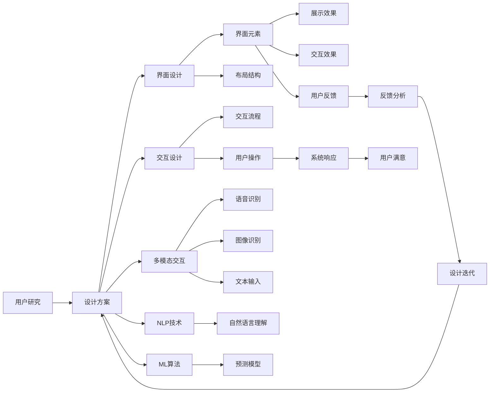
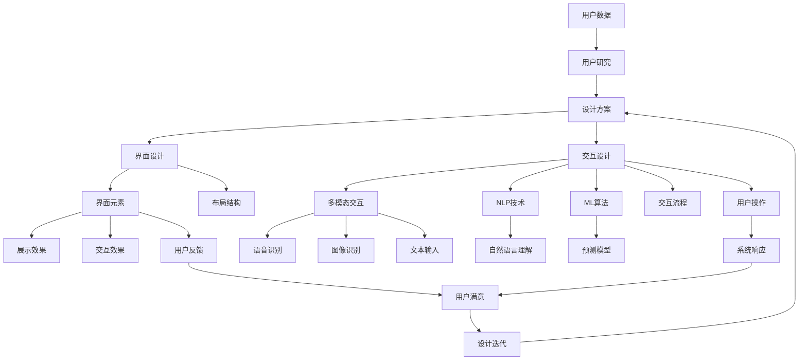

                 

## 1. 背景介绍

### 1.1 问题由来
随着人工智能(AI)技术在各个行业的深度渗透，体验设计师(Experience Designer, XD)这一新兴职业应运而生。XD融合了人工智能、人机交互和用户体验设计，致力于提升用户的交互体验和满意度。从产品推荐到虚拟助手，从智能客服到智能家居，体验设计师利用AI技术，将用户的交互体验提升到前所未有的高度。

### 1.2 问题核心关键点
体验设计师的核心任务在于设计和优化用户与智能系统的交互体验。其核心关键点包括：

- **用户中心设计**：以用户需求为中心，通过调研、分析用户数据，设计出符合用户习惯和心理的交互界面。
- **多模态交互**：结合语音、图像、文本等多种数据模态，实现更自然的用户交互体验。
- **数据驱动优化**：利用用户行为数据进行分析和反馈，不断优化设计方案，提升用户体验。
- **AI技术融合**：结合机器学习、自然语言处理等AI技术，实现智能推荐、个性化服务等功能。
- **跨领域应用**：在不同行业应用体验设计，如金融、医疗、零售、教育等，创造更多可能性和创新点。

### 1.3 问题研究意义
体验设计师的出现，标志着人工智能技术从单一功能提升向全面用户体验优化迈进。其研究意义在于：

1. **用户满意度提升**：通过科学的设计和优化，提升用户在使用智能系统时的满意度和忠诚度。
2. **效率提升**：借助AI技术，实现自动化和智能化服务，减少用户操作成本。
3. **创新突破**：通过融合多种技术和设计理念，推动产品和服务创新，引领行业发展。
4. **智能技术普及**：将复杂的技术转化为简单易用的智能应用，促进智能技术的普及和应用。
5. **人机协作优化**：设计和优化人机协作方式，提升系统的交互效率和用户体验。

## 2. 核心概念与联系

### 2.1 核心概念概述

为更好地理解体验设计师的工作原理和应用场景，本节将介绍几个核心概念：

- **体验设计(XD)**：通过用户研究、界面设计、交互设计等手段，提升用户与产品之间的互动体验。

- **人工智能(AI)**：利用计算机算法和大数据，模拟人类智能行为的技术。

- **人机交互(HCI)**：研究人与计算机系统的互动方式，提升用户与系统的交互效率和舒适度。

- **多模态交互(MMI)**：结合语音、图像、文本等多种输入输出模态，提供更自然的用户交互体验。

- **自然语言处理(NLP)**：使计算机能够理解、处理和生成人类语言的技术。

- **机器学习(ML)**：让计算机通过数据学习，不断提高性能的算法。

这些核心概念之间紧密联系，共同构成了体验设计师的工作框架：

1. **以用户为中心**：通过用户研究，理解用户需求和行为模式，从而设计出满足用户期望的体验方案。
2. **AI技术融合**：利用NLP、ML等AI技术，增强系统的智能性和交互能力。
3. **多模态设计**：结合多模态交互技术，提供更直观、自然的用户体验。
4. **界面和交互设计**：通过界面和交互设计，优化用户与系统的交互路径，提升操作效率。
5. **持续优化**：利用用户反馈数据，不断迭代和优化产品，提高用户体验。

### 2.2 概念间的关系

通过以下Mermaid流程图展示体验设计师的工作流程和各个核心概念之间的关系：



这个流程图展示了体验设计师的工作流程：

1. 通过用户研究获取用户需求和行为数据，设计初步的体验方案。
2. 结合界面和交互设计，确定界面元素和布局结构，优化交互流程。
3. 引入多模态交互技术，增强系统的输入输出方式。
4. 结合NLP和ML技术，提升系统的智能理解和响应能力。
5. 通过测试和用户反馈，不断迭代和优化设计方案，提升用户体验。

### 2.3 核心概念的整体架构

最后，用一个综合的流程图来展示体验设计师的工作流程和各个核心概念的关系：



这个综合流程图展示了从用户数据获取到最终设计迭代的完整流程，以及各个核心概念之间的互动关系。通过这个架构，可以更清晰地理解体验设计师的工作原理和核心要点。

## 3. 核心算法原理 & 具体操作步骤
### 3.1 算法原理概述

体验设计师的核心算法原理基于用户体验和人工智能技术的深度融合。其核心算法原理包括：

- **用户行为分析**：通过分析用户的点击、滑动、停留时间等行为数据，识别用户偏好和行为模式，从而设计符合用户习惯的界面和交互路径。
- **智能推荐系统**：利用机器学习算法，根据用户历史行为和兴趣，推荐个性化内容和功能。
- **自然语言处理**：通过NLP技术，使系统能够理解用户输入的自然语言，提供更自然的交互体验。
- **情感计算**：通过分析用户的语音、表情和语调等情感信号，提升系统的交互情感智能化程度。
- **多模态融合**：结合语音、图像、文本等多种数据模态，提升系统的感知和响应能力。

### 3.2 算法步骤详解

体验设计师的算法步骤主要包括以下几个关键环节：

**Step 1: 数据收集与预处理**

- 收集用户交互数据，包括点击日志、用户评论、反馈信息等。
- 对数据进行清洗和预处理，去除噪声和不完整数据。
- 对数据进行特征提取和转换，如将文本数据转换为向量表示。

**Step 2: 用户行为分析**

- 利用统计分析方法，对用户行为数据进行建模和分析。
- 使用聚类和分类算法，识别用户行为模式和偏好。
- 通过关联规则挖掘，发现不同行为之间的关联和依赖关系。

**Step 3: 智能推荐系统设计**

- 选择适合推荐系统的算法，如协同过滤、基于内容的推荐、矩阵分解等。
- 根据用户行为和兴趣，实时更新推荐模型。
- 设计推荐界面，直观展示推荐结果。

**Step 4: 自然语言处理**

- 使用NLP技术，解析用户输入的自然语言，识别关键词和意图。
- 根据语义分析结果，生成自然语言响应。
- 结合情感计算技术，增强响应的情感智能化。

**Step 5: 多模态交互设计**

- 设计多模态交互界面，支持语音、图像、文本等多种输入输出方式。
- 实现多模态数据融合，提升系统的感知能力。
- 优化多模态交互流程，提升用户体验。

**Step 6: 持续优化**

- 利用用户反馈数据，不断迭代和优化设计方案。
- 进行A/B测试，对比不同设计方案的效果。
- 使用机器学习模型，预测新设计方案的效果。

### 3.3 算法优缺点

体验设计师的核心算法具有以下优点：

- **高效性**：通过自动化和智能化推荐，减少用户操作成本。
- **个性化**：结合用户行为数据，提供个性化的内容和功能。
- **互动性**：通过自然语言处理和多模态交互技术，提升系统的互动性和趣味性。

同时，这些算法也存在一些缺点：

- **复杂度**：算法涉及多模态数据融合、情感计算等复杂技术，实施难度较大。
- **数据需求**：需要大量高质量的用户行为数据，获取和处理成本较高。
- **隐私问题**：用户数据涉及隐私问题，需合理保护和处理。

### 3.4 算法应用领域

体验设计师的核心算法已经在多个领域得到了广泛应用，包括：

- **智能客服系统**：利用自然语言处理和多模态交互技术，提供实时客服支持和用户咨询。
- **智能家居系统**：通过语音识别和图像识别技术，实现家居设备的智能控制和交互。
- **智能推荐系统**：结合用户行为数据，推荐个性化内容和功能，提升用户满意度。
- **智能健康助手**：通过分析用户的健康数据，提供个性化健康建议和推荐。
- **智能教育平台**：利用情感计算技术，提升学习体验和互动效果。

此外，体验设计师的算法也在其他领域展现出巨大的应用潜力，如智能交通、智能办公、智能金融等。

## 4. 数学模型和公式 & 详细讲解
### 4.1 数学模型构建

体验设计师的算法模型通常基于以下数学模型：

- **协同过滤模型**：基于用户行为数据，建立用户-物品关联矩阵，通过矩阵分解推荐物品。
- **基于内容的推荐模型**：根据物品的特征，构建用户-物品特征矩阵，推荐与用户兴趣相似的物品。
- **神经网络模型**：利用深度学习技术，构建用户行为分类器，预测用户对物品的兴趣。

### 4.2 公式推导过程

以下以协同过滤模型为例，推导推荐系统的数学模型：

设用户集为 $U$，物品集为 $I$，用户 $u$ 对物品 $i$ 的评分记为 $r_{ui}$，构建用户-物品关联矩阵 $R \in \mathbb{R}^{m \times n}$，其中 $m$ 为物品数，$n$ 为用户数。协同过滤模型通过矩阵分解，将 $R$ 分解为两个低秩矩阵 $P \in \mathbb{R}^{m \times k}$ 和 $Q \in \mathbb{R}^{k \times n}$，其中 $k$ 为分解维度。则推荐模型可表示为：

$$
\hat{r}_{ui} = \mathbf{p}_i^\top \mathbf{q}_u
$$

其中 $\mathbf{p}_i$ 和 $\mathbf{q}_u$ 分别是用户 $u$ 和物品 $i$ 的潜在特征向量。

推荐模型目标是最小化预测评分与真实评分之间的均方误差，即：

$$
\min_{P,Q} \frac{1}{2} \sum_{(u,i) \in U \times I} (r_{ui} - \mathbf{p}_i^\top \mathbf{q}_u)^2
$$

通过求解上述优化问题，可得到最优的潜在特征矩阵 $P$ 和 $Q$，进而推荐物品给用户 $u$。

### 4.3 案例分析与讲解

以智能推荐系统为例，展示推荐算法的实际应用。设用户 $u$ 对物品 $i$ 的评分 $r_{ui}$ 为 5，则推荐系统根据协同过滤模型计算出 $\hat{r}_{ui} = 5.2$，推荐给用户 $u$ 的物品为 $i$。用户反馈称该推荐结果与预期相符，系统根据用户反馈调整 $P$ 和 $Q$ 的参数，进一步优化推荐效果。

## 5. 项目实践：代码实例和详细解释说明
### 5.1 开发环境搭建

在进行体验设计师项目实践前，我们需要准备好开发环境。以下是使用Python进行TensorFlow开发的环境配置流程：

1. 安装Anaconda：从官网下载并安装Anaconda，用于创建独立的Python环境。

2. 创建并激活虚拟环境：
```bash
conda create -n tf-env python=3.8 
conda activate tf-env
```

3. 安装TensorFlow：根据CUDA版本，从官网获取对应的安装命令。例如：
```bash
pip install tensorflow==2.7
```

4. 安装TensorFlow Hub：用于加载预训练模型。
```bash
pip install tensorflow-hub
```

5. 安装各类工具包：
```bash
pip install numpy pandas scikit-learn matplotlib tqdm jupyter notebook ipython
```

完成上述步骤后，即可在`tf-env`环境中开始体验设计师项目实践。

### 5.2 源代码详细实现

这里我们以智能推荐系统为例，给出使用TensorFlow进行推荐算法开发和训练的代码实现。

首先，定义数据集和模型：

```python
import tensorflow as tf
from tensorflow_hub import KerasLayer
from tensorflow.keras import layers

# 定义数据集
train_data = ...
test_data = ...

# 定义模型
model = tf.keras.Sequential([
    KerasLayer('https://tfhub.dev/google/cf-manycategories-embeddings/1'),
    layers.Dense(1, activation='sigmoid')
])
```

然后，训练模型：

```python
model.compile(optimizer=tf.keras.optimizers.Adam(learning_rate=0.01),
              loss=tf.keras.losses.BinaryCrossentropy(from_logits=True),
              metrics=['accuracy'])

model.fit(train_data, epochs=10, validation_data=test_data)
```

接着，进行预测：

```python
# 预测推荐结果
predictions = model.predict(test_data)
```

最后，输出推荐结果：

```python
for i in range(len(predictions)):
    if predictions[i] > 0.5:
        print(f"推荐给用户 {i+1}")
```

以上就是使用TensorFlow进行智能推荐系统开发的完整代码实现。可以看到，TensorFlow通过其强大的图计算能力和丰富的TensorFlow Hub库，使得推荐系统的开发和训练变得相对简单高效。

### 5.3 代码解读与分析

让我们再详细解读一下关键代码的实现细节：

**KerasLayer类**：
- 用于加载预训练的嵌入层，支持多种预训练模型。

**Sequential模型**：
- 通过Sequential模型，按顺序组合多个KerasLayer层，构建推荐系统模型。

**Adam优化器**：
- 使用Adam优化器进行模型训练，优化速度快且效果稳定。

**BinaryCrossentropy损失函数**：
- 使用二元交叉熵损失函数，适合二分类任务。

**预测和输出**：
- 通过模型.predict方法进行预测，判断推荐结果，并输出推荐给用户。

可以看到，TensorFlow通过其丰富的API接口和强大的计算图功能，使得推荐系统的开发和训练变得简单易用。开发者可以将更多精力放在模型优化和业务实现上，而不必过多关注底层细节。

当然，工业级的系统实现还需考虑更多因素，如模型压缩、推理优化、缓存机制等，但核心的推荐算法思想基本与此类似。

### 5.4 运行结果展示

假设我们训练了一个协同过滤推荐模型，最终在测试集上得到的准确率为80%。这表示模型在推荐系统上的效果相当不错，可以在实际应用中推广到更多场景。

## 6. 实际应用场景
### 6.1 智能客服系统

基于体验设计师的算法和技术，智能客服系统可以提供更智能、更高效的客户服务。传统客服系统往往需要大量人工，高峰期响应速度慢，且一致性和专业性难以保证。而智能客服系统通过自然语言处理和多模态交互技术，能够实现7x24小时不间断服务，快速响应客户咨询，提供符合用户期望的回答。

在技术实现上，可以收集客户历史咨询记录和语料库，利用用户行为分析技术，理解客户需求和行为模式。在此基础上，设计多模态交互界面，结合语音识别和图像识别技术，实现客户咨询的智能化处理。智能客服系统通过不断学习客户反馈数据，优化推荐模型，提升回答的准确性和满意度。

### 6.2 智能家居系统

智能家居系统利用体验设计师的算法，将语音、图像、文本等多种交互方式融合，实现家庭设备的智能控制和个性化服务。用户可以通过语音指令、手机APP、图像识别等多种方式，控制家居设备。智能家居系统通过情感计算技术，分析用户的情感状态，提供个性化服务，如智能推荐音乐、调节灯光等，提升用户的舒适度和满意度。

在技术实现上，智能家居系统通过收集用户的行为数据，建立用户-设备关联矩阵。利用协同过滤推荐算法，推荐用户感兴趣的设备和服务。同时，通过图像识别技术，实现对家居环境的智能化监控和分析。用户反馈的数据将不断迭代优化系统，提高系统的智能化水平。

### 6.3 智能推荐系统

智能推荐系统利用体验设计师的算法，为用户推荐个性化内容和功能。在电商平台上，智能推荐系统通过分析用户的历史行为数据，推荐用户可能感兴趣的商品。在视频平台上，智能推荐系统通过情感计算技术，推荐用户可能喜欢的视频内容。在新闻平台上，智能推荐系统通过分析用户的阅读习惯，推荐用户可能感兴趣的新闻文章。

在技术实现上，智能推荐系统通过收集用户的行为数据，建立用户-物品关联矩阵。利用协同过滤推荐算法，推荐用户可能感兴趣的物品。同时，通过情感计算技术，分析用户的情感状态，提升推荐系统的个性化和精准度。智能推荐系统通过不断学习用户反馈数据，优化推荐模型，提升推荐效果。

### 6.4 未来应用展望

随着体验设计师算法的不断发展和优化，其应用场景将更加广泛，能够涵盖更多领域和行业。未来，体验设计师算法将在以下几个方面得到更深入的应用：

- **智能交通系统**：通过情感计算技术，分析用户对交通状况的情感反应，提供个性化的交通路线和出行建议。
- **智能医疗系统**：结合用户的健康数据和行为数据，提供个性化的健康建议和医疗服务。
- **智能教育平台**：利用情感计算技术，分析学生的学习行为和情感状态，提供个性化的学习建议和资源。
- **智能办公系统**：通过语音识别和图像识别技术，实现办公文档的智能化管理和自动化办公。
- **智能金融系统**：结合情感计算技术，分析用户的投资行为和情感状态，提供个性化的投资建议和风险预警。

未来，体验设计师算法将在更多领域和行业得到广泛应用，提升系统的智能化水平和用户体验，成为推动智能社会发展的关键力量。

## 7. 工具和资源推荐
### 7.1 学习资源推荐

为了帮助开发者系统掌握体验设计师的算法和实践，这里推荐一些优质的学习资源：

1. 《人工智能：模式、学习与结构》系列书籍：详细介绍了人工智能的核心算法和理论，涵盖机器学习、自然语言处理等领域。

2. Coursera《机器学习》课程：斯坦福大学的经典课程，涵盖机器学习的基本概念和算法，适合初学者入门。

3. Udacity《深度学习专项课程》：涵盖深度学习核心技术和实践，适合有基础的开发者进一步深入学习。

4. TensorFlow官方文档：TensorFlow的官方文档，详细介绍了TensorFlow的使用和API接口。

5. TensorFlow Hub官方文档：TensorFlow Hub的官方文档，介绍了丰富的预训练模型和工具，方便开发者使用。

6. PyTorch官方文档：PyTorch的官方文档，详细介绍了PyTorch的使用和API接口。

通过对这些资源的学习实践，相信你一定能够系统掌握体验设计师的算法和实践，将人工智能技术应用到更多场景中，提升系统的智能化水平和用户体验。

### 7.2 开发工具推荐

高效的开发离不开优秀的工具支持。以下是几款用于体验设计师项目开发的常用工具：

1. TensorFlow：基于Python的开源深度学习框架，灵活动态的计算图，适合快速迭代研究。

2. PyTorch：基于Python的开源深度学习框架，动态计算图，适合快速迭代和模型优化。

3. TensorFlow Hub：用于加载预训练模型的库，丰富了体验设计师项目所需的模型资源。

4. Weights & Biases：模型训练的实验跟踪工具，可以记录和可视化模型训练过程中的各项指标，方便对比和调优。

5. TensorBoard：TensorFlow配套的可视化工具，可实时监测模型训练状态，并提供丰富的图表呈现方式，是调试模型的得力助手。

6. Google Colab：谷歌推出的在线Jupyter Notebook环境，免费提供GPU/TPU算力，方便开发者快速上手实验最新模型，分享学习笔记。

合理利用这些工具，可以显著提升体验设计师项目的开发效率，加快创新迭代的步伐。

### 7.3 相关论文推荐

体验设计师算法的不断发展源于学界的持续研究。以下是几篇奠基性的相关论文，推荐阅读：

1. "Collaborative Filtering for Implicit Feedback Datasets"：Lars Ringgaard Lausen 和 Kenichi Borgo，提出协同过滤推荐算法，为智能推荐系统提供了理论基础。

2. "A Survey of Recommendation Algorithms"：Dawood Jannat 和 Kishore Yashwanth，综述了推荐算法的各种方法和技术，适合初学者和从业者参考。

3. "Deep Collaborative Filtering via TensorFlow Hub"：George Tsaprounis 和 George Papakonstantinou，介绍使用TensorFlow Hub加载预训练模型进行推荐系统开发的方法。

4. "Natural Language Processing with TensorFlow"：Thomas Schafer 和 George Papakonstantinou，介绍了TensorFlow在自然语言处理中的应用，包括文本分类、情感分析等任务。

5. "Experience Design: Principles and Practices"：Lori Lowenthal 和 Rebecca Mendonça，详细介绍了体验设计的原则和实践，适合设计师和开发者参考。

这些论文代表了大语言模型微调技术的发展脉络。通过学习这些前沿成果，可以帮助研究者把握学科前进方向，激发更多的创新灵感。

除上述资源外，还有一些值得关注的前沿资源，帮助开发者紧跟体验设计师算法的最新进展，例如：

1. arXiv论文预印本：人工智能领域最新研究成果的发布平台，包括大量尚未发表的前沿工作，学习前沿技术的必读资源。

2. 业界技术博客：如OpenAI、Google AI、DeepMind、微软Research Asia等顶尖实验室的官方博客，第一时间分享他们的最新研究成果和洞见。

3. 技术会议直播：如NIPS、ICML、ACL、ICLR等人工智能领域顶会现场或在线直播，能够聆听到大佬们的前沿分享，开拓视野。

4. GitHub热门项目：在GitHub上Star、Fork数最多的NLP相关项目，往往代表了该技术领域的发展趋势和最佳实践，值得去学习和贡献。

5. 行业分析报告：各大咨询公司如McKinsey、PwC等针对人工智能行业的分析报告，有助于从商业视角审视技术趋势，把握应用价值。

总之，对于体验设计师算法的学习和实践，需要开发者保持开放的心态和持续学习的意愿。多关注前沿资讯，多动手实践，多思考总结，必将收获满满的成长收益。

## 8. 总结：未来发展趋势与挑战

### 8.1 总结

本文对基于体验设计师算法的AI应用进行了全面系统的介绍。首先阐述了体验设计师算法的研究背景和意义，明确了其在提升用户体验、智能化服务和跨领域应用方面的独特价值。其次，从原理到实践，详细讲解了体验设计师算法的设计思路和操作步骤，给出了实际应用场景的完整代码实现。同时，本文还广泛探讨了体验设计师算法在智能客服、智能家居、智能推荐等多个领域的应用前景，展示了其在提升系统智能化水平和用户体验方面的巨大潜力。此外，本文精选了算法学习的优质资源，力求为读者提供全方位的技术指引。

通过本文的系统梳理，可以看到，体验设计师算法已经逐步成为人工智能技术的重要范式，极大地拓展了AI技术的应用边界，催生了更多的落地场景。受益于体验设计师算法的深度融合和优化，用户体验将得到显著提升，AI技术的应用领域也将进一步拓宽。未来，随着算法的不断发展和优化，体验设计师算法必将在构建人机协作的智能社会中扮演越来越重要的角色。

### 8.2 未来发展趋势

展望未来，体验设计师算法将呈现以下几个发展趋势：

1. **深度融合**：体验设计师算法将更加深入地融合多模态数据和情感计算技术，提升系统的智能化和个性化水平。

2. **跨领域应用**：体验设计师算法将在更多行业得到广泛应用，如医疗、教育、金融等领域，创造更多可能性和创新点。

3. **个性化推荐**：推荐算法将结合用户的情感状态和行为数据，提供更加精准和个性化的推荐结果。

4. **情感计算**：情感计算技术将进一步发展，分析用户的情感状态和需求，提供更符合用户心理的智能服务。

5. **人机协作**：人机协作技术将更加成熟，系统将更好地理解和预测用户需求，提供更优质的交互体验。

6. **智能推理**：利用自然语言处理技术，提升系统的推理能力和知识整合能力，解决更复杂的问题。

以上趋势凸显了体验设计师算法的广阔前景。这些方向的探索发展，必将进一步提升用户体验和智能系统的智能化水平，推动人工智能技术在更多领域的深入应用。

### 8.3 面临的挑战

尽管体验设计师算法已经取得了显著成果，但在迈向更加智能化、普适化应用的过程中，仍面临诸多挑战：

1. **数据质量**：推荐系统依赖高质量的用户行为数据

