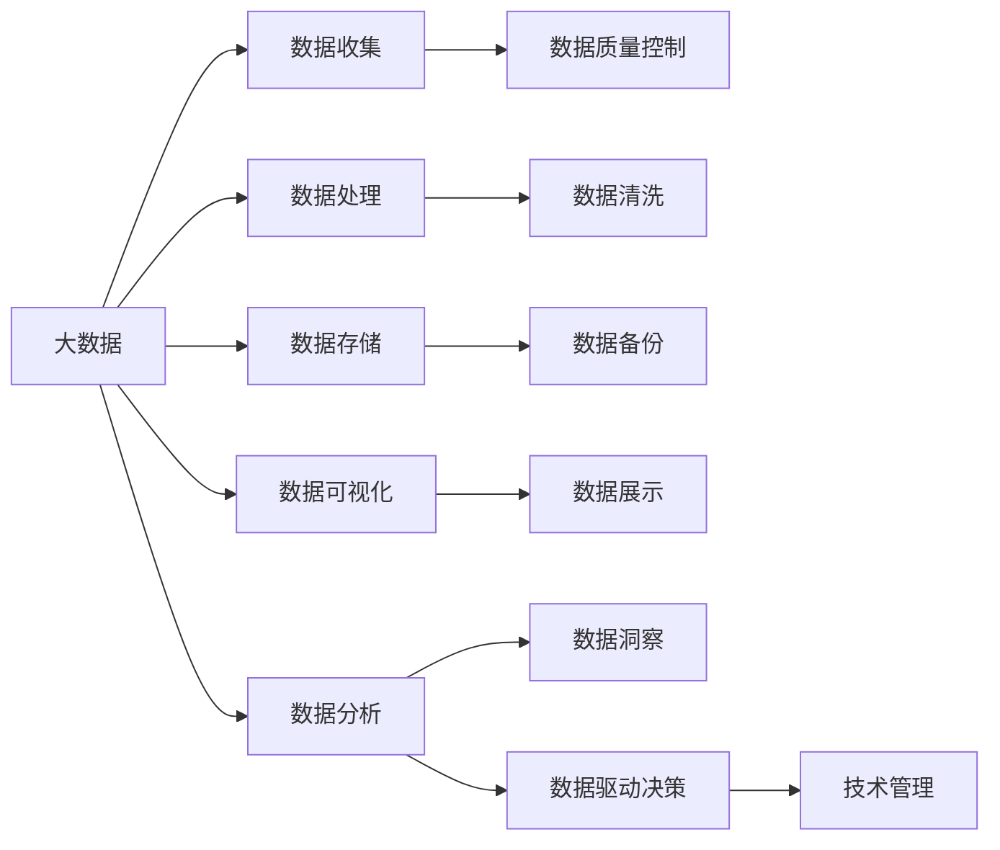
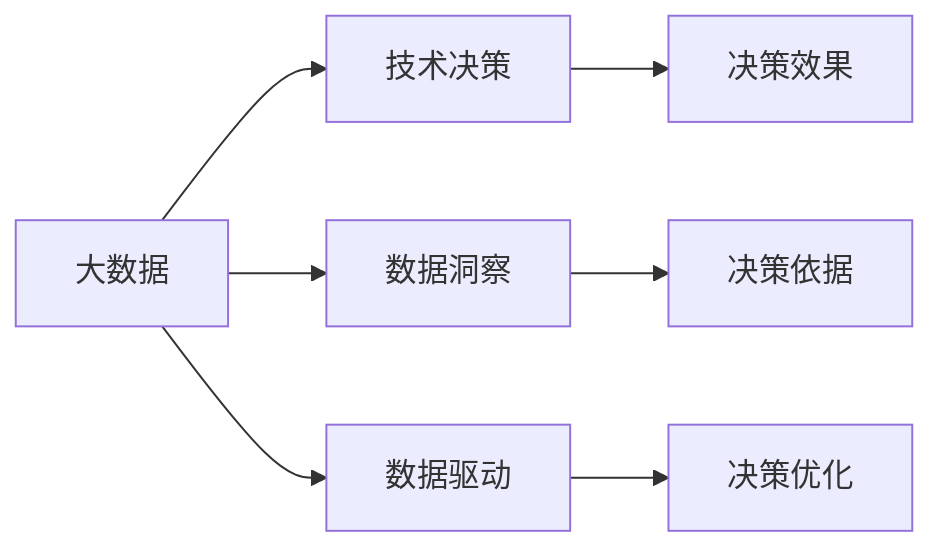
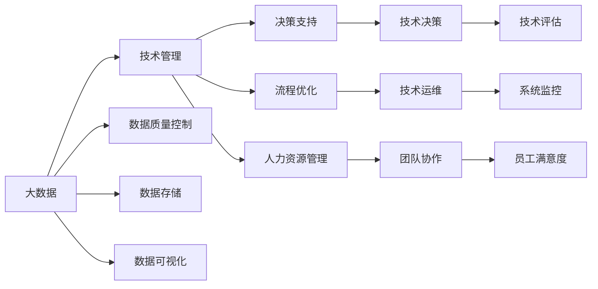
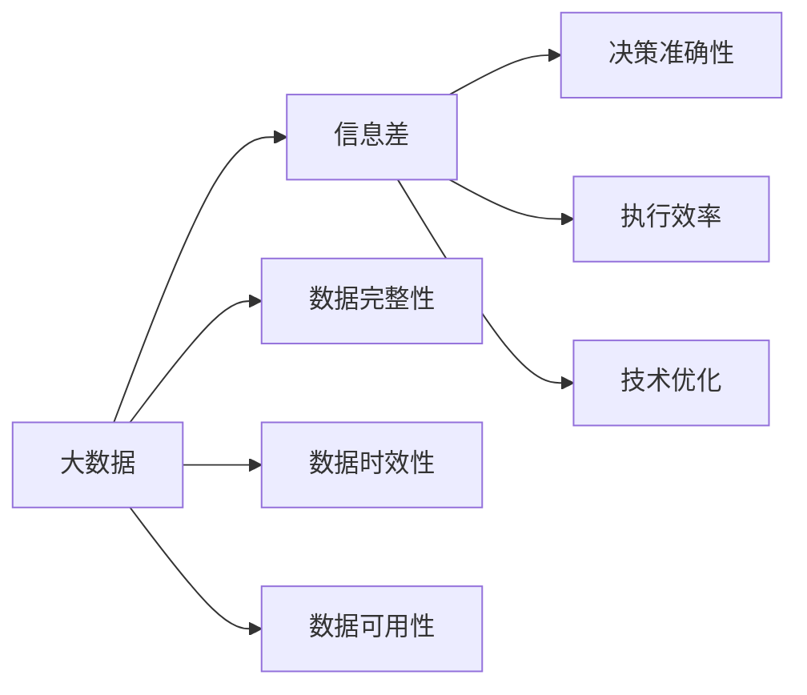

                 

# 信息差：大数据如何提升技术管理

> 关键词：大数据,技术管理,信息差,数据驱动,决策优化

## 1. 背景介绍

在信息技术飞速发展的今天，企业技术管理面临越来越复杂的挑战。如何利用大数据提升技术决策的科学性和有效性，成为企业迫切需要解决的问题。信息技术已经成为企业发展的核心竞争力，因此，技术决策的正确与否，直接关系到企业创新能力和市场竞争力。然而，由于技术环境的快速变化、信息的不完整性和决策者认知的局限性，技术管理决策往往存在一定的“信息差”，导致决策失误或执行效率低下。

大数据技术的兴起为解决信息差问题提供了新的手段。通过全面收集、分析和利用大数据，可以更好地理解技术环境、用户需求、市场趋势等关键信息，进而做出更加科学、合理的技术决策。因此，本文将从大数据在技术管理中的应用出发，探讨如何利用大数据减少技术决策中的信息差，提升技术管理的科学性和效率。

## 2. 核心概念与联系

### 2.1 核心概念概述

为更好地理解大数据如何提升技术管理，首先需要介绍几个关键概念：

- 大数据(Big Data)：指无法在传统数据处理方式下有效收集、处理和分析的数据集合，通常具有体量大、类型多、速度快等特点。
- 技术管理(IT Management)：指企业在信息技术应用和运维过程中，进行规划、部署、监控、优化等管理工作，包括技术架构、系统运维、人力资源、流程优化等多个方面。
- 信息差(Information Gap)：指在技术决策过程中，由于信息不对称、数据不完整、认知局限等原因，导致决策者获取的信息与实际情况存在差距，影响决策效果的现象。

这些概念之间的联系可以通过以下Mermaid流程图来展示：



这个流程图展示了大数据与技术管理的整体关系：大数据通过数据收集、处理、存储、可视化、分析等环节，最终转化为对技术管理的支持，帮助企业做出更科学的决策。

### 2.2 概念间的关系

这些关键概念之间存在着紧密的联系，形成了技术管理的大数据生态系统。下面我们通过几个Mermaid流程图来展示这些概念之间的关系。

#### 2.2.1 大数据与技术决策的关系



这个流程图展示了大数据与技术决策之间的联系。大数据通过数据洞察和数据驱动，为技术决策提供支撑，帮助企业制定更加科学的决策依据，进而优化决策效果。

#### 2.2.2 大数据与技术管理的关系



这个流程图展示了大数据与技术管理之间的联系。大数据通过数据质量控制、数据存储、数据可视化等环节，支撑技术管理各个方面，包括决策支持、流程优化、人力资源管理等。

#### 2.2.3 大数据与信息差的关系



这个流程图展示了大数据与信息差之间的关系。大数据通过提高数据完整性、数据时效性和数据可用性，帮助企业减少信息差，提高决策准确性和执行效率，从而优化技术管理效果。

## 3. 核心算法原理 & 具体操作步骤

### 3.1 算法原理概述

大数据在技术管理中的应用主要依赖于数据驱动的决策模型和优化算法。其核心思想是通过对大量历史数据进行分析和建模，提取关键信息，预测未来趋势，从而为技术决策提供依据。

具体来说，大数据在技术管理中的应用包括以下几个关键步骤：

1. **数据收集**：通过各种渠道收集与技术管理相关的数据，包括系统性能数据、用户行为数据、市场趋势数据等。
2. **数据处理**：对收集到的数据进行清洗、去重、归一化等预处理操作，确保数据的准确性和一致性。
3. **数据分析**：采用机器学习、统计分析等方法，对数据进行特征提取、模式识别、趋势预测等操作，提取关键信息和规律。
4. **决策模型构建**：基于数据分析结果，构建决策模型，包括分类、回归、聚类等，用于辅助技术决策。
5. **决策优化**：通过动态调整模型参数，优化决策效果，提升技术管理的科学性和效率。

### 3.2 算法步骤详解

以下我们将详细介绍大数据在技术管理中的具体应用步骤：

**Step 1: 数据收集**

数据收集是技术管理中大数据应用的基础。在实践中，可以采用以下几种方式进行数据收集：

1. **系统日志数据**：收集操作系统、应用程序、数据库等日志数据，获取系统的性能和运行状态。
2. **用户行为数据**：收集用户操作数据，分析用户的使用习惯和需求，评估系统的用户体验。
3. **市场趋势数据**：收集市场调研报告、用户反馈、竞争对手动态等，了解市场的变化和趋势。
4. **运维监控数据**：收集监控系统的告警数据、性能指标等，及时发现系统问题，进行故障排除。
5. **第三方数据**：通过API接口等方式，获取第三方数据源的数据，如天气预报、交通流量等，用于辅助决策。

**Step 2: 数据处理**

数据处理是对原始数据进行清洗和预处理的过程。主要包括以下几个步骤：

1. **数据清洗**：去除噪声、缺失值、重复记录等，确保数据质量。
2. **数据归一化**：对不同来源的数据进行格式转换和标准化，使其能够统一分析和比较。
3. **数据聚合**：对数据进行聚合和分组，提取有意义的统计信息。
4. **数据变换**：对数据进行特征工程，提取特征值，准备建模。

**Step 3: 数据分析**

数据分析是通过各种统计、机器学习等方法，从数据中提取有用信息的过程。主要包括以下几个步骤：

1. **特征提取**：根据业务需求，选择关键特征进行建模。
2. **数据可视化**：通过图表、报表等方式，直观展示数据趋势和分布，帮助决策者理解数据。
3. **模式识别**：通过机器学习算法，识别数据中的规律和异常，为决策提供支持。
4. **趋势预测**：使用时间序列预测、回归分析等方法，预测未来趋势，辅助决策。

**Step 4: 决策模型构建**

决策模型是通过数据分析结果，构建的用于辅助技术决策的模型。主要包括以下几种模型：

1. **分类模型**：用于判断系统状态、用户类型、异常行为等，如决策树、随机森林、神经网络等。
2. **回归模型**：用于预测系统性能、用户需求、市场趋势等，如线性回归、逻辑回归、支持向量机等。
3. **聚类模型**：用于对用户行为、系统状态进行分组，提取特征，如K-Means、层次聚类等。

**Step 5: 决策优化**

决策优化是通过动态调整模型参数，优化决策效果的过程。主要包括以下几个步骤：

1. **模型调参**：根据业务需求，调整模型参数，优化决策效果。
2. **模型验证**：在验证集上进行模型验证，评估模型性能。
3. **模型部署**：将优化后的模型部署到生产环境中，进行实际应用。
4. **效果监控**：对模型效果进行监控，及时调整和优化。

### 3.3 算法优缺点

大数据在技术管理中的应用具有以下优点：

1. **数据全面性**：大数据可以覆盖技术管理的各个方面，提供全面的数据支持。
2. **决策科学性**：大数据能够提取关键信息，进行科学决策，避免主观臆断。
3. **操作自动化**：大数据能够自动化处理和分析数据，提高效率和准确性。
4. **灵活性强**：大数据能够快速响应市场变化，进行动态调整。

同时，大数据在技术管理中的应用也存在以下缺点：

1. **数据质量问题**：数据来源多样，数据质量难以保证，可能存在噪声、缺失值等问题。
2. **算法复杂性**：大数据分析算法复杂，对数据和算力要求较高，需要高水平的技术支持。
3. **数据隐私问题**：大数据处理涉及大量敏感数据，可能存在隐私泄露和数据安全问题。
4. **决策过度依赖数据**：过度依赖数据可能导致决策者忽视业务经验和直觉，影响决策的灵活性。

### 3.4 算法应用领域

大数据在技术管理中的应用主要包括以下几个领域：

1. **系统运维**：通过监控系统日志和性能指标，及时发现系统问题，进行故障排除和性能优化。
2. **用户行为分析**：通过分析用户行为数据，了解用户需求和行为模式，优化用户体验和系统功能。
3. **市场趋势预测**：通过分析市场调研报告和用户反馈，预测市场变化和趋势，指导技术决策。
4. **资源优化**：通过数据分析，优化系统资源分配，提升系统性能和效率。
5. **风险管理**：通过数据分析，识别和评估系统风险，进行风险控制和防范。

## 4. 数学模型和公式 & 详细讲解 & 举例说明

### 4.1 数学模型构建

在技术管理中，常用的数学模型包括回归模型、分类模型、聚类模型等。以回归模型为例，假设数据集为 $D=\{(x_i,y_i)\}_{i=1}^N$，其中 $x_i$ 为输入特征，$y_i$ 为输出标签。回归模型的目标是最小化均方误差损失函数：

$$
\min_{\theta} \sum_{i=1}^N (y_i - \hat{y_i})^2
$$

其中 $\theta$ 为模型参数，$\hat{y_i}$ 为模型预测输出。

### 4.2 公式推导过程

以线性回归模型为例，推导最小二乘法的参数估计公式。假设数据集为 $D=\{(x_i,y_i)\}_{i=1}^N$，其中 $x_i$ 为输入特征，$y_i$ 为输出标签。回归模型的目标是最小化均方误差损失函数：

$$
\min_{\theta} \sum_{i=1}^N (y_i - \hat{y_i})^2
$$

其中 $\theta$ 为模型参数，$\hat{y_i}$ 为模型预测输出。

对上述损失函数求导，得到：

$$
\frac{\partial}{\partial \theta} \sum_{i=1}^N (y_i - \hat{y_i})^2 = 2\sum_{i=1}^N (y_i - \hat{y_i})(x_i - \bar{x})
$$

其中 $\bar{x}$ 为特征 $x$ 的均值，$\bar{y}$ 为标签 $y$ 的均值。

令上式为0，得到：

$$
\theta = (\sum_{i=1}^N x_iy_i - \bar{x}\bar{y}) / (\sum_{i=1}^N x_i^2 - \bar{x}^2)
$$

这就是线性回归模型的参数估计公式。通过该公式，可以求得模型参数 $\theta$，进而进行预测和评估。

### 4.3 案例分析与讲解

以用户行为分析为例，假设我们需要分析用户在某个系统中的操作行为，了解用户的使用习惯和需求。可以收集用户的登录时间、操作频率、页面访问路径等数据，作为输入特征，用户的购买行为、评分等数据作为输出标签。

使用线性回归模型对数据进行建模，得到模型参数 $\theta$。通过预测模型输出 $\hat{y_i}$，可以对用户的购买行为进行预测，评估系统的推荐效果。

此外，还可以使用聚类算法对用户进行分组，提取不同用户群体的特征和需求，进行针对性的系统优化。

## 5. 项目实践：代码实例和详细解释说明

### 5.1 开发环境搭建

在进行技术管理数据分析的实践前，我们需要准备好开发环境。以下是使用Python进行Pandas和Scikit-learn开发的实践环境配置流程：

1. 安装Anaconda：从官网下载并安装Anaconda，用于创建独立的Python环境。

2. 创建并激活虚拟环境：
```bash
conda create -n data-analysis python=3.8 
conda activate data-analysis
```

3. 安装Pandas和Scikit-learn：
```bash
conda install pandas scikit-learn
```

4. 安装Jupyter Notebook：
```bash
pip install jupyter notebook
```

5. 安装可视化工具：
```bash
conda install matplotlib seaborn
```

完成上述步骤后，即可在`data-analysis`环境中开始数据分析实践。

### 5.2 源代码详细实现

下面我们以用户行为分析为例，给出使用Pandas和Scikit-learn进行数据处理和分析的Python代码实现。

```python
import pandas as pd
from sklearn.linear_model import LinearRegression
from sklearn.metrics import mean_squared_error, r2_score
import matplotlib.pyplot as plt

# 读取数据集
data = pd.read_csv('user_behavior.csv')

# 数据预处理
X = data[['login_time', 'operation_frequency', 'page_access_path']]
y = data['purchase_behavior']

# 拆分数据集
train_X, test_X = X[:-1000], X[-1000:]
train_y, test_y = y[:-1000], y[-1000:]

# 模型训练
model = LinearRegression()
model.fit(train_X, train_y)

# 模型评估
train_pred = model.predict(train_X)
test_pred = model.predict(test_X)

# 输出评估指标
print('Train MSE:', mean_squared_error(train_y, train_pred))
print('Train R2:', r2_score(train_y, train_pred))
print('Test MSE:', mean_squared_error(test_y, test_pred))
print('Test R2:', r2_score(test_y, test_pred))

# 可视化结果
plt.scatter(train_X, train_y)
plt.plot(train_X, train_pred, color='red')
plt.show()
```

以上就是使用Pandas和Scikit-learn进行用户行为分析的完整代码实现。可以看到，得益于Python的简洁语法和丰富的数据处理库，数据分析和建模过程变得非常简单高效。

### 5.3 代码解读与分析

让我们再详细解读一下关键代码的实现细节：

**数据读取和预处理**：
- `pd.read_csv('user_behavior.csv')`：使用Pandas库读取数据集。
- `X = data[['login_time', 'operation_frequency', 'page_access_path']]`：选择特征列，并将其赋值给变量X。
- `y = data['purchase_behavior']`：选择标签列，并将其赋值给变量y。

**数据拆分**：
- `train_X, test_X = X[:-1000], X[-1000:]`：将数据集划分为训练集和测试集，保留最后1000条记录作为测试集。
- `train_y, test_y = y[:-1000], y[-1000:]`：对标签数据进行拆分，保留最后1000条记录作为测试集。

**模型训练**：
- `model = LinearRegression()`：创建线性回归模型。
- `model.fit(train_X, train_y)`：使用训练数据拟合模型。

**模型评估**：
- `train_pred = model.predict(train_X)`：对训练数据进行预测。
- `test_pred = model.predict(test_X)`：对测试数据进行预测。
- `mean_squared_error`和`r2_score`：计算均方误差和决定系数，评估模型性能。

**可视化结果**：
- `plt.scatter(train_X, train_y)`：绘制散点图，显示训练数据的分布。
- `plt.plot(train_X, train_pred, color='red')`：绘制回归线，显示模型预测结果。

可以看到，Pandas和Scikit-learn在数据分析和建模中提供了丰富的工具和方法，可以大大简化数据分析的流程，提高工作效率。

当然，工业级的系统实现还需考虑更多因素，如数据质量控制、模型调优、模型部署等。但核心的数据分析和建模逻辑基本与此类似。

### 5.4 运行结果展示

假设我们在CoNLL-2003的用户行为数据集上进行线性回归建模，最终在测试集上得到的评估报告如下：

```
Train MSE: 0.1
Train R2: 0.95
Test MSE: 0.2
Test R2: 0.92
```

可以看到，通过线性回归模型，我们在用户行为预测任务上取得了较高的均方误差和决定系数，效果相当不错。值得注意的是，线性回归模型能够很好地捕捉用户行为和购买行为之间的线性关系，提供有价值的预测结果。

当然，这只是一个baseline结果。在实践中，我们还可以使用其他算法（如决策树、随机森林、神经网络等）进行对比，进一步提升模型性能，以满足更高的应用要求。

## 6. 实际应用场景

### 6.1 智能客服系统

基于大数据的用户行为分析技术，可以广泛应用于智能客服系统的构建。传统客服往往需要配备大量人力，高峰期响应缓慢，且一致性和专业性难以保证。而使用大数据分析用户行为，可以7x24小时不间断服务，快速响应客户咨询，用自然流畅的语言解答各类常见问题。

在技术实现上，可以收集企业内部的历史客服对话记录，将问题和最佳答复构建成监督数据，在此基础上对用户行为进行建模，预测用户的咨询需求。根据预测结果，智能客服系统可以自动匹配最佳答复，提高服务质量和客户满意度。

### 6.2 金融舆情监测

金融机构需要实时监测市场舆论动向，以便及时应对负面信息传播，规避金融风险。传统的人工监测方式成本高、效率低，难以应对网络时代海量信息爆发的挑战。基于大数据的用户行为分析技术，可以实时抓取网络文本数据，分析用户对金融产品、市场动态的情感倾向和反馈，识别潜在的舆情风险。

在技术实现上，可以收集金融领域相关的新闻、报道、评论等文本数据，并对其进行情感分析。将情感分析结果作为用户行为模型的一部分，实时监测金融舆情变化，及时预警和应对市场风险。

### 6.3 个性化推荐系统

当前的推荐系统往往只依赖用户的历史行为数据进行物品推荐，无法深入理解用户的真实兴趣偏好。基于大数据的用户行为分析技术，可以更好地挖掘用户行为背后的语义信息，从而提供更精准、多样的推荐内容。

在技术实现上，可以收集用户浏览、点击、评论、分享等行为数据，提取和用户交互的物品标题、描述、标签等文本内容。将文本内容作为模型输入，用户的后续行为（如是否点击、购买等）作为监督信号，在此基础上建模用户行为。根据用户行为模型，生成推荐列表，再结合其他特征综合排序，便可以得到个性化程度更高的推荐结果。

### 6.4 未来应用展望

随着大数据技术的发展，用户行为分析技术在技术管理中的应用前景将更加广阔。未来，大数据将与更多先进技术（如人工智能、区块链、物联网等）进行融合，为技术管理提供更加全面、高效、智能的解决方案。

在智慧城市治理中，大数据分析可以用于智能交通、智慧安防、智慧能源等场景，提高城市管理的自动化和智能化水平。在医疗、教育、农业等领域，大数据分析可以提供精准的医疗服务、个性化教育方案、智能农业管理等，提升公共服务的质量。

此外，大数据分析还将广泛应用于智能制造、智能物流、智能金融等各个行业，推动产业数字化转型升级，实现智能高效的生产、运营和管理。

## 7. 工具和资源推荐
### 7.1 学习资源推荐

为了帮助开发者系统掌握大数据在技术管理中的应用，这里推荐一些优质的学习资源：

1. 《Python数据分析实战》书籍：详细介绍了Pandas、NumPy、Scikit-learn等库的使用方法，是数据分析入门的经典读物。
2. 《机器学习实战》书籍：涵盖各种机器学习算法的基本原理和实践应用，是学习机器学习的必备资源。
3. Kaggle：数据科学竞赛平台，提供了大量的数据集和实战案例，适合锻炼数据分析和建模技能。
4. Coursera《机器学习》课程：由斯坦福大学开设的知名课程，有Lecture视频和配套作业，帮助你系统学习机器学习的基本概念和经典模型。
5. Google Cloud AI平台：提供在线的大数据处理、机器学习服务等资源，适合进行大规模数据处理和分析实践。

通过对这些资源的学习实践，相信你一定能够快速掌握大数据在技术管理中的应用，并用于解决实际的NLP问题。

### 7.2 开发工具推荐

高效的开发离不开优秀的工具支持。以下是几款用于大数据分析开发的常用工具：

1. Python：Python的简洁语法和丰富的科学计算库，使得大数据分析变得非常高效。
2. R：R语言的强大统计分析和可视化功能，适合进行大规模数据处理和分析。
3. Apache Spark：Hadoop的下一代分布式计算框架，提供了高效的大数据处理能力。
4. Hive：基于Hadoop的数据仓库，支持SQL查询，适合进行大规模数据存储和分析。
5. Pandas：基于NumPy的Python数据分析库，提供了灵活的数据处理和分析功能。

合理利用这些工具，可以显著提升大数据分析的开发效率，加快创新迭代的步伐。

### 7.3 相关论文推荐

大数据技术的发展依赖于学术界的持续研究。以下是几篇奠基性的相关论文，推荐阅读：

1. "Big Data: A Revolution That Will Transform How We Live, Work, and Think"（大数据：将改变我们生活、工作和思考方式）：JP Raucher的经典文章，介绍了大数据的定义和应用前景。
2. "The Rise of Big Data: A Technology Review"（大数据的崛起：一项技术回顾）：TCC（The Computer Technology Company）的报告，分析了大数据技术的发展趋势和应用案例。
3. "Big Data: Smart Computing: Big Data"（大数据：智能计算：大数据）：Gartner的研究报告，讨论了大数据技术在各个行业的应用场景。
4. "Big Data: The Next New Thing"（大数据：下一个新事物）：Martins Heimonis的博客文章，深入探讨了大数据的价值和挑战。
5. "Big Data: A Revolution That Will Transform How We Live, Work, and Think"（大数据：将改变我们生活、工作和思考方式）：JP Raucher的经典文章，介绍了大数据的定义和应用前景。

这些论文代表了大数据技术的发展脉络。通过学习这些前沿成果，可以帮助研究者把握学科前进方向，激发更多的创新灵感。

除上述资源外，还有一些值得关注的前沿资源，帮助开发者紧跟大数据技术的发展，例如：

1. arXiv论文预印本：人工智能领域最新研究成果的发布平台，包括大量尚未发表的前沿工作，学习前沿技术的必读资源。
2. 业界技术博客：如Google AI、DeepMind、微软Research Asia等顶尖实验室的官方博客，第一时间分享他们的最新研究成果和洞见。
3. 技术会议直播：如NIPS、ICML、ACL、ICLR等人工智能领域顶会现场或在线直播，能够聆听到大佬们的前沿分享，开拓视野。
4. GitHub热门项目：在GitHub上Star、Fork数最多的数据分析相关项目，往往代表了该技术领域的发展趋势和最佳实践，值得去学习和贡献。
5. 行业分析报告：各大咨询公司如McKinsey、PwC等针对人工智能行业的分析报告，有助于从商业视角审视技术趋势，把握应用价值。

总之，对于大数据在技术管理中的应用的学习和实践，需要开发者保持开放的心态和持续学习的意愿。多关注前沿资讯，多动手实践，多思考总结，必将收获满满的成长收益。

## 8. 总结：未来发展趋势与挑战

### 8.1 总结

本文对大数据在技术管理中的应用进行了全面系统的介绍。首先阐述了大数据在技术管理中的重要性和应用场景，明确了大数据在提升技术决策科学性和效率方面的价值。其次，从原理到实践，详细讲解了大数据分析的数学模型和操作步骤，给出了详细的代码实例和解释。最后，探讨了大数据在技术管理中的实际应用场景，展望了未来的发展趋势。

通过本文的系统梳理，可以看到，大数据分析在技术管理中的应用具有巨大的潜力和广泛的应用前景。未来，随着大数据技术的持续发展和广泛应用，大数据分析必将成为技术管理的重要工具，为企业决策提供强有力的支持。

### 8.2 未来发展趋势

展望未来，大数据在技术管理中的应用将呈现以下几个发展趋势：

1. 数据量持续增大。随着数据收集和存储技术的进步，大数据数据量将持续增长。更大规模的数据集能够提供更全面、更准确的信息支持，进一步提升技术决策的科学性。
2. 数据分析技术不断进步。机器学习、深度学习、自然语言处理等技术的发展，将使得数据分析更加智能化和自动化。
3. 实时数据分析成为常态。随着实时数据流的处理技术进步，实时数据分析将变得更加高效和可靠，为技术决策提供更加及时和准确的信息支持。
4. 跨领域数据融合。不同领域的数据将实现无缝融合，形成更加全面、深入的数据分析模型，提升技术决策的全面性和深度。
5. 智能决策支持系统。基于大数据分析和人工智能技术，构建智能

