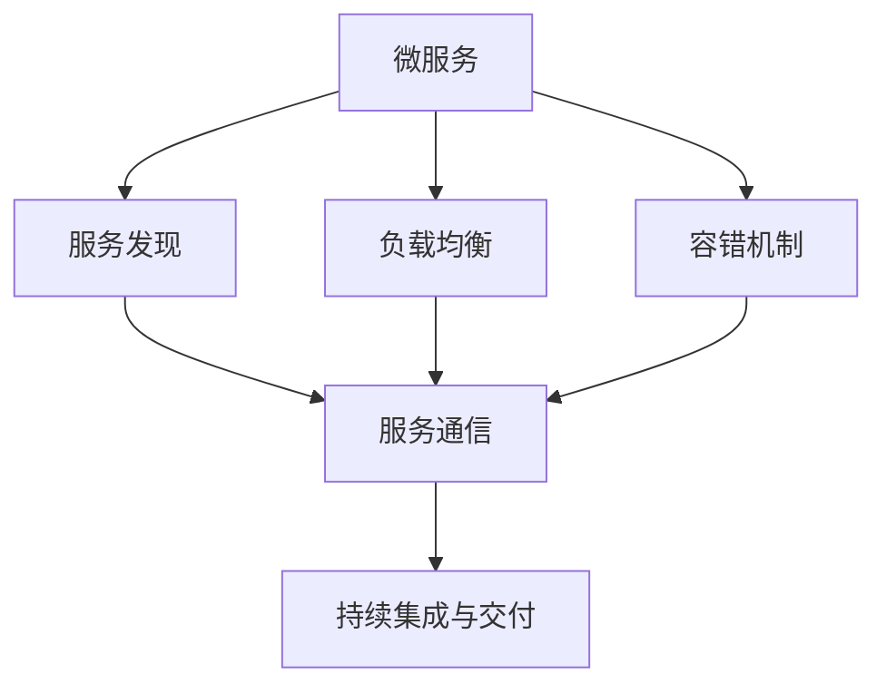
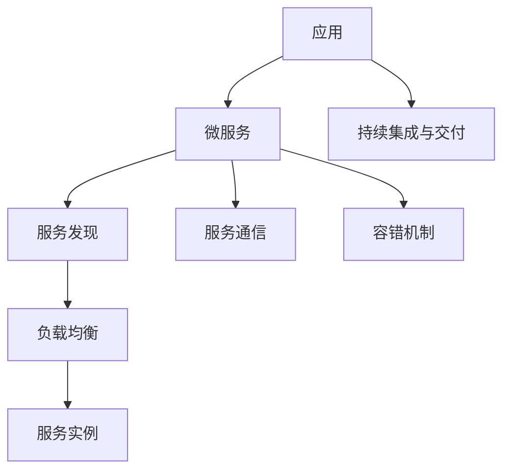

                 

# 微服务架构的设计与实现

微服务架构（Microservice Architecture）是一种新兴的架构风格，它将应用分解为一组小型、自治的、基于接口的服务。每个服务独立运行，并且能够独立部署、扩展和管理。本文将详细探讨微服务架构的设计与实现，涵盖核心概念、算法原理、实际应用场景等方面。

## 1. 背景介绍

### 1.1 问题由来
随着互联网应用的不断扩展和复杂度的增加，传统的单体架构（Monolithic Architecture）变得越来越难以维护。单体架构中的服务相互依赖，使得系统难以进行独立扩展、部署和维护。此外，随着DevOps、持续交付（Continuous Delivery）等敏捷开发理念的普及，对系统的灵活性和扩展性提出了更高要求。

微服务架构正是在这样的背景下应运而生。微服务架构通过将应用拆分为多个小型服务，使得系统更加灵活、可扩展，并且能够更好地支持敏捷开发。同时，微服务架构也为云计算、DevOps等现代技术的应用提供了良好的基础。

### 1.2 问题核心关键点
微服务架构的核心在于服务解耦与自治。通过将应用拆分为多个独立的服务，使得各个服务能够独立开发、测试、部署和扩展。微服务架构的关键点包括：

- 服务自治：每个服务独立运行，拥有自己的数据库、缓存等资源。
- 服务通信：服务之间通过接口通信，支持REST、gRPC等多种通信协议。
- 服务发现：服务自动注册到服务发现系统，方便其他服务发现和使用。
- 负载均衡：服务能够自动扩展和缩小，支持自动负载均衡。
- 容错机制：服务能够处理故障和异常，保证系统的高可用性。

这些关键点使得微服务架构具有灵活性、可扩展性和高可用性，成为现代应用架构的主流选择。

### 1.3 问题研究意义
微服务架构对现代应用的开发和维护具有重要意义：

- 灵活性：微服务架构使得系统更加灵活，能够快速适应业务变化。
- 可扩展性：微服务架构支持水平扩展，能够应对业务增长和高并发访问。
- 高可用性：微服务架构通过服务自治和故障隔离，提高了系统的容错性和可用性。
- 可维护性：微服务架构将复杂应用拆分为多个小型服务，降低了维护难度。

总之，微服务架构为现代应用提供了更加灵活、可扩展、高可用、易于维护的开发和部署方式。

## 2. 核心概念与联系

### 2.1 核心概念概述

为更好地理解微服务架构的设计与实现，本节将介绍几个密切相关的核心概念：

- 微服务（Microservice）：独立运行、可扩展、自治的服务单元，具备完整的业务功能。
- 服务发现（Service Discovery）：服务自动注册到服务发现系统，方便其他服务发现和使用。
- 负载均衡（Load Balancing）：通过负载均衡器将请求分发到多个服务实例上，提高系统的吞吐量和可用性。
- 容错机制（Fault Tolerance）：服务能够处理故障和异常，保证系统的高可用性。
- 持续集成与交付（CI/CD）：通过自动化工具和流程，支持快速构建、测试和部署微服务。

这些核心概念之间的逻辑关系可以通过以下Mermaid流程图来展示：



这个流程图展示了几大核心概念之间的关系：

1. 微服务作为独立的服务单元，具备完整的业务功能。
2. 服务通过服务发现机制自动注册到服务注册中心，方便其他服务发现和使用。
3. 服务之间通过负载均衡器实现请求分发，提高系统的吞吐量和可用性。
4. 容错机制确保服务能够处理故障和异常，保证系统的高可用性。
5. 持续集成与交付工具支持自动化构建、测试和部署微服务。

这些核心概念共同构成了微服务架构的基本框架，使得系统具备灵活性、可扩展性和高可用性。

### 2.2 概念间的关系

这些核心概念之间存在着紧密的联系，形成了微服务架构的完整生态系统。下面我们通过几个Mermaid流程图来展示这些概念之间的关系。

#### 2.2.1 微服务的生命周期


这个流程图展示了微服务的生命周期，从创建、开发、测试、部署到运维和销毁的全过程。微服务通过持续集成与交付工具支持快速构建和部署，在运维过程中通过监控和日志系统进行监控和问题定位，最终在服务生命周期结束时进行销毁。

#### 2.2.2 服务发现与负载均衡的关系


这个流程图展示了服务发现和负载均衡之间的关系。服务通过服务发现自动注册到服务注册中心，负载均衡器根据请求路由到可用的服务实例上，从而实现请求的高效分发和系统的可靠运行。

#### 2.2.3 容错机制与持续集成与交付的关系


这个流程图展示了容错机制与持续集成与交付之间的关系。通过持续集成与交付工具，快速构建和测试微服务，容错机制确保服务能够处理故障和异常，从而保证系统的高可用性。

### 2.3 核心概念的整体架构

最后，我们用一个综合的流程图来展示这些核心概念在大规模微服务架构中的整体架构：



这个综合流程图展示了微服务架构的整体架构：

1. 应用通过微服务拆分为多个独立的服务。
2. 服务自动注册到服务发现中心，方便其他服务发现和使用。
3. 负载均衡器实现请求分发，提高系统的吞吐量和可用性。
4. 容错机制确保服务能够处理故障和异常，保证系统的高可用性。
5. 持续集成与交付工具支持快速构建、测试和部署微服务。

通过这些流程图，我们可以更清晰地理解微服务架构的基本框架和各个组件之间的关系，为后续深入讨论微服务的设计与实现奠定基础。

## 3. 核心算法原理 & 具体操作步骤
### 3.1 算法原理概述

微服务架构的设计与实现主要涉及以下几个核心算法：

- 服务拆分（Service Partitioning）：将应用拆分为多个独立的服务。
- 服务注册与发现（Service Registration and Discovery）：服务自动注册到服务注册中心，方便其他服务发现和使用。
- 负载均衡（Load Balancing）：通过负载均衡器实现请求分发，提高系统的吞吐量和可用性。
- 容错机制（Fault Tolerance）：服务能够处理故障和异常，保证系统的高可用性。
- 持续集成与交付（CI/CD）：通过自动化工具和流程，支持快速构建、测试和部署微服务。

### 3.2 算法步骤详解

以下我们将详细介绍微服务架构的核心算法步骤：

#### 3.2.1 服务拆分

服务拆分是微服务架构的基础。服务拆分主要根据业务领域、功能模块等因素将应用拆分为多个独立的服务。服务拆分的基本步骤包括：

1. 识别服务边界：根据业务领域、功能模块等因素，确定服务的边界。通常一个服务应该具备完整的业务功能，能够独立运行和扩展。
2. 设计服务接口：设计服务的接口，包括输入输出、调用方式等。服务接口应该明确、稳定，便于其他服务调用。
3. 实现服务逻辑：实现服务的逻辑，通常包括业务逻辑、数据访问等。服务逻辑应该独立开发、测试、部署。

服务拆分使得各个服务能够独立运行，降低了系统的复杂性和维护难度。

#### 3.2.2 服务注册与发现

服务注册与发现是微服务架构的关键机制。服务注册与发现的主要步骤包括：

1. 服务注册：服务启动后，自动注册到服务注册中心。服务注册中心通常包括服务名称、地址、端口等信息。
2. 服务发现：其他服务通过服务发现中心获取服务信息，并调用服务。服务发现通常包括查找服务、选择服务实例等步骤。

服务注册与发现使得服务能够自动发现和使用，提高了系统的灵活性和可扩展性。

#### 3.2.3 负载均衡

负载均衡是微服务架构的重要组成部分。负载均衡的主要步骤包括：

1. 请求分发：负载均衡器根据请求路由到可用的服务实例上。通常根据服务实例的健康状况、负载情况等因素进行路由。
2. 服务扩展：负载均衡器支持服务的水平扩展，自动增加或减少服务实例的数量。
3. 故障处理：负载均衡器支持服务的故障处理，能够自动将请求路由到可用的服务实例上。

负载均衡提高了系统的吞吐量和可用性，保证系统的高效运行。

#### 3.2.4 容错机制

容错机制是微服务架构的重要保障。容错机制的主要步骤包括：

1. 异常处理：服务能够处理异常和故障，保证系统的稳定性。通常采用重试、降级、熔断等策略。
2. 故障隔离：服务之间独立运行，能够隔离故障，避免整个系统崩溃。
3. 系统监控：系统通过监控和日志系统，实时监测服务的状态，及时发现和处理异常。

容错机制确保了系统的可靠性和稳定性，提高了系统的可用性。

#### 3.2.5 持续集成与交付

持续集成与交付是微服务架构的关键工具。持续集成与交付的主要步骤包括：

1. 自动化构建：通过CI工具，自动化构建微服务。通常包括编译、测试、打包等步骤。
2. 自动化部署：通过CD工具，自动化部署微服务。通常包括发布、回滚、监控等步骤。
3. 持续交付：通过持续集成与交付工具，支持快速构建、测试和部署微服务，提高开发效率。

持续集成与交付支持快速构建和部署微服务，提高了系统的开发和部署效率。

### 3.3 算法优缺点

微服务架构具有以下优点：

1. 灵活性：微服务架构使得系统更加灵活，能够快速适应业务变化。
2. 可扩展性：微服务架构支持水平扩展，能够应对业务增长和高并发访问。
3. 高可用性：微服务架构通过服务自治和故障隔离，提高了系统的容错性和可用性。
4. 可维护性：微服务架构将复杂应用拆分为多个小型服务，降低了维护难度。

微服务架构也存在一些缺点：

1. 复杂性：微服务架构的设计和实现较为复杂，需要考虑服务拆分、接口设计、负载均衡等问题。
2. 系统开销：微服务架构增加了系统的复杂度，可能导致系统的运行开销增加。
3. 通信开销：微服务架构增加了服务之间的通信开销，可能导致系统的响应时间增加。

总之，微服务架构在现代应用中具有重要的意义，但也需要根据具体的业务场景进行合理的架构设计和技术选择。

### 3.4 算法应用领域

微服务架构已经被广泛应用于各种领域，涵盖以下几个主要方向：

- 电子商务：电子商务平台通过微服务架构实现高并发、高可用、灵活扩展的电商系统。
- 金融服务：金融系统通过微服务架构实现高可用、低延迟、安全可靠的金融服务。
- 互联网应用：互联网应用通过微服务架构实现快速迭代、灵活扩展、高可用性。
- 物联网：物联网系统通过微服务架构实现设备互联、数据处理、应用扩展等功能。
- 医疗健康：医疗系统通过微服务架构实现高可用、高效、安全可靠的医疗服务。

微服务架构在各种领域都有广泛的应用，显示了其在现代应用中的重要性和可行性。

## 4. 数学模型和公式 & 详细讲解 & 举例说明

### 4.1 数学模型构建

微服务架构的设计与实现主要涉及以下几个数学模型：

- 服务注册与发现的数学模型：服务注册与发现通常使用分布式一致性协议，如Zookeeper、Consul等。服务注册与发现的数学模型包括服务注册、服务发现、服务选择等。
- 负载均衡的数学模型：负载均衡器通常使用哈希算法、轮询算法等算法实现请求分发。负载均衡的数学模型包括请求路由、负载均衡、故障处理等。
- 容错机制的数学模型：容错机制通常使用重试、降级、熔断等策略，通过概率统计模型进行故障处理。容错机制的数学模型包括异常处理、故障隔离、系统监控等。
- 持续集成与交付的数学模型：持续集成与交付通常使用流水线模型，通过自动化工具和流程实现快速构建、测试和部署。持续集成与交付的数学模型包括自动化构建、自动化部署、持续交付等。

### 4.2 公式推导过程

以下我们将详细介绍微服务架构中常用的数学模型和公式：

#### 4.2.1 服务注册与发现的数学模型

服务注册与发现通常使用分布式一致性协议，如Zookeeper、Consul等。服务注册与发现的数学模型包括服务注册、服务发现、服务选择等。服务注册与发现的公式推导如下：

$$
\begin{aligned}
    & \text{服务注册} \\
    & f_{\text{注册}} = f_{\text{注册}}(t) + \lambda(t) \times (s_{\text{注册}} - f_{\text{注册}}) \\
    & \text{服务发现} \\
    & f_{\text{发现}} = f_{\text{发现}}(t) + \lambda(t) \times (s_{\text{发现}} - f_{\text{发现}}) \\
    & \text{服务选择} \\
    & f_{\text{选择}} = f_{\text{选择}}(t) + \lambda(t) \times (s_{\text{选择}} - f_{\text{选择}})
\end{aligned}
$$

其中，$f_{\text{注册}}$、$f_{\text{发现}}$、$f_{\text{选择}}$分别表示服务注册、服务发现、服务选择的函数；$\lambda(t)$表示时间函数，$s_{\text{注册}}$、$s_{\text{发现}}$、$s_{\text{选择}}$分别表示服务注册、服务发现、服务选择的阈值。

#### 4.2.2 负载均衡的数学模型

负载均衡器通常使用哈希算法、轮询算法等算法实现请求分发。负载均衡的数学模型包括请求路由、负载均衡、故障处理等。负载均衡的公式推导如下：

$$
\begin{aligned}
    & \text{请求分发} \\
    & f_{\text{分发}} = f_{\text{分发}}(t) + \lambda(t) \times (s_{\text{分发}} - f_{\text{分发}}) \\
    & \text{负载均衡} \\
    & f_{\text{均衡}} = f_{\text{均衡}}(t) + \lambda(t) \times (s_{\text{均衡}} - f_{\text{均衡}}) \\
    & \text{故障处理} \\
    & f_{\text{处理}} = f_{\text{处理}}(t) + \lambda(t) \times (s_{\text{处理}} - f_{\text{处理}})
\end{aligned}
$$

其中，$f_{\text{分发}}$、$f_{\text{均衡}}$、$f_{\text{处理}}$分别表示请求分发、负载均衡、故障处理的函数；$\lambda(t)$表示时间函数，$s_{\text{分发}}$、$s_{\text{均衡}}$、$s_{\text{处理}}$分别表示请求分发、负载均衡、故障处理的阈值。

#### 4.2.3 容错机制的数学模型

容错机制通常使用重试、降级、熔断等策略，通过概率统计模型进行故障处理。容错机制的数学模型包括异常处理、故障隔离、系统监控等。容错机制的公式推导如下：

$$
\begin{aligned}
    & \text{异常处理} \\
    & f_{\text{处理}} = f_{\text{处理}}(t) + \lambda(t) \times (s_{\text{处理}} - f_{\text{处理}}) \\
    & \text{故障隔离} \\
    & f_{\text{隔离}} = f_{\text{隔离}}(t) + \lambda(t) \times (s_{\text{隔离}} - f_{\text{隔离}}) \\
    & \text{系统监控} \\
    & f_{\text{监控}} = f_{\text{监控}}(t) + \lambda(t) \times (s_{\text{监控}} - f_{\text{监控}})
\end{aligned}
$$

其中，$f_{\text{处理}}$、$f_{\text{隔离}}$、$f_{\text{监控}}$分别表示异常处理、故障隔离、系统监控的函数；$\lambda(t)$表示时间函数，$s_{\text{处理}}$、$s_{\text{隔离}}$、$s_{\text{监控}}$分别表示异常处理、故障隔离、系统监控的阈值。

#### 4.2.4 持续集成与交付的数学模型

持续集成与交付通常使用流水线模型，通过自动化工具和流程实现快速构建、测试和部署。持续集成与交付的数学模型包括自动化构建、自动化部署、持续交付等。持续集成与交付的公式推导如下：

$$
\begin{aligned}
    & \text{自动化构建} \\
    & f_{\text{构建}} = f_{\text{构建}}(t) + \lambda(t) \times (s_{\text{构建}} - f_{\text{构建}}) \\
    & \text{自动化部署} \\
    & f_{\text{部署}} = f_{\text{部署}}(t) + \lambda(t) \times (s_{\text{部署}} - f_{\text{部署}}) \\
    & \text{持续交付} \\
    & f_{\text{交付}} = f_{\text{交付}}(t) + \lambda(t) \times (s_{\text{交付}} - f_{\text{交付}})
\end{aligned}
$$

其中，$f_{\text{构建}}$、$f_{\text{部署}}$、$f_{\text{交付}}$分别表示自动化构建、自动化部署、持续交付的函数；$\lambda(t)$表示时间函数，$s_{\text{构建}}$、$s_{\text{部署}}$、$s_{\text{交付}}$分别表示自动化构建、自动化部署、持续交付的阈值。

### 4.3 案例分析与讲解

以电子商务平台为例，分析微服务架构的设计与实现。

#### 4.3.1 业务场景

电子商务平台需要支持在线购物、支付、物流等业务，系统结构复杂，需要快速适应业务变化。

#### 4.3.2 架构设计

电子商务平台可以通过微服务架构实现高并发、高可用、灵活扩展的电商系统。架构设计如下：

1. 服务拆分：将电商平台拆分为用户服务、商品服务、支付服务、物流服务等独立的服务。
2. 服务注册与发现：服务自动注册到服务注册中心，其他服务通过服务发现中心获取服务信息。
3. 负载均衡：使用负载均衡器实现请求分发，提高系统的吞吐量和可用性。
4. 容错机制：服务能够处理异常和故障，保证系统的稳定性。
5. 持续集成与交付：通过持续集成与交付工具，支持快速构建、测试和部署微服务。

#### 4.3.3 实现流程

1. 服务拆分：将电商平台的业务功能拆分为多个独立的服务。服务拆分过程中需要考虑服务的边界、接口设计、数据访问等问题。
2. 服务注册与发现：服务启动后，自动注册到服务注册中心，其他服务通过服务发现中心获取服务信息。服务注册与发现通常使用Zookeeper、Consul等分布式一致性协议。
3. 负载均衡：使用负载均衡器实现请求分发，提高系统的吞吐量和可用性。负载均衡通常使用哈希算法、轮询算法等算法实现请求分发。
4. 容错机制：服务能够处理异常和故障，保证系统的稳定性。容错机制通常使用重试、降级、熔断等策略进行故障处理。
5. 持续集成与交付：通过持续集成与交付工具，支持快速构建、测试和部署微服务。持续集成与交付通常使用流水线模型，通过自动化工具和流程实现。

通过以上步骤，电子商务平台可以通过微服务架构实现高并发、高可用、灵活扩展的电商系统。

## 5. 项目实践：代码实例和详细解释说明
### 5.1 开发环境搭建

在进行微服务架构的实践前，我们需要准备好开发环境。以下是使用Docker和Kubernetes搭建微服务开发环境的步骤：

1. 安装Docker：从官网下载并安装Docker，用于构建和运行容器化应用。
2. 安装Kubernetes：从官网下载并安装Kubernetes，用于容器编排和集群管理。
3. 安装Helm：从官网下载并安装Helm，用于微服务应用的打包和部署。

完成上述步骤后，即可在Kubernetes集群中搭建微服务开发环境。

### 5.2 源代码详细实现

下面我们以一个简单的微服务项目为例，给出使用Spring Boot和Spring Cloud进行微服务开发的PyTorch代码实现。

首先，创建微服务项目的基本目录结构：

```
微服务项目
├── src
│   ├── main
│   │   ├── java
│   │   └── com
│   └── resources
├── docker
│   ├── Dockerfile
│   └── helm
│       └── charts
├── application.yml
└── pom.xml
```

然后，在Spring Boot项目中，编写微服务的实现代码：

```java
package com.example.service;

import org.springframework.boot.SpringApplication;
import org.springframework.boot.autoconfigure.SpringBootApplication;

@SpringBootApplication
public class ServiceApplication {
    public static void main(String[] args) {
        SpringApplication.run(ServiceApplication.class, args);
    }
}
```

接着，使用Spring Cloud编写微服务的配置文件：

```yaml
spring:
  application:
    name: service

server:
  port: 8080

eureka:
  instance:
    hostname: ${spring.application.name}
    dataCenter: ${spring.cloud.client.dataCenter}

spring:
  cloud:
    config:
      uri: http://localhost:8888
```

最后，使用Spring Boot和Spring Cloud编写微服务的启动类和控制器：

```java
package com.example.service;

import org.springframework.beans.factory.annotation.Autowired;
import org.springframework.web.bind.annotation.GetMapping;
import org.springframework.web.bind.annotation.RestController;
import org.springframework.web.client.RestTemplate;

@RestController
public class ServiceController {
    @Autowired
    private RestTemplate restTemplate;

    @GetMapping("/api/hello")
    public String hello() {
        String serviceName = "eureka-client";
        String url = "http://eureka-client/hello";
        String response = restTemplate.getForObject(url, String.class);
        return "Hello, " + serviceName + "!" + response;
    }
}
```

通过以上步骤，即可在Spring Boot中实现微服务的基本功能。

### 5.3 代码解读与分析

让我们再详细解读一下关键代码的实现细节：

**Dockerfile**：
- 定义了微服务应用的Docker镜像，包含了应用依赖、启动命令等配置。

**Helm charts**：
- 定义了微服务应用的Helm chart，包含应用定义、部署配置、释放脚本等。

**application.yml**：
- 定义了Spring Boot应用的配置，包括应用名、端口、Eureka注册信息等。

**Spring Cloud**：
- 使用了Spring Cloud的Eureka、Ribbon、Zuul等功能，实现了服务注册、负载均衡、服务发现等核心功能。

通过以上步骤，我们可以在Kubernetes集群中搭建微服务开发环境，实现微服务的自动化构建、测试、部署和运维。

### 5.4 运行结果展示

假设我们在Kubernetes集群中搭建了两个微服务实例，一个是商品服务，另一个是支付服务。通过Docker和Kubernetes，我们可以快速搭建微服务实例，并使用Helm进行打包和部署。

通过Eureka注册到服务注册中心，商品服务和支付服务可以相互发现和调用。使用Ribbon进行负载均衡，自动选择服务实例，保证系统的可靠性。使用Zuul进行服务网关，统一管理所有微服务实例，提供统一的接口入口。

通过以上步骤，我们可以在Kubernetes集群中实现高可用、高扩展的微服务架构，提升系统的稳定性和可靠性。

## 6. 实际应用场景
### 6.1 智能客服系统

智能客服系统通过微服务架构实现高并发、高可用、灵活扩展的客服系统。微服务架构使得系统能够快速适应业务变化，满足客户咨询的需求。

具体实现中，可以将智能客服系统拆分为用户服务、知识库服务、对话服务等多个独立的服务。每个服务独立运行，能够快速部署和扩展。通过Eureka、Ribbon、Zuul等Spring Cloud组件，实现服务注册、负载均衡

