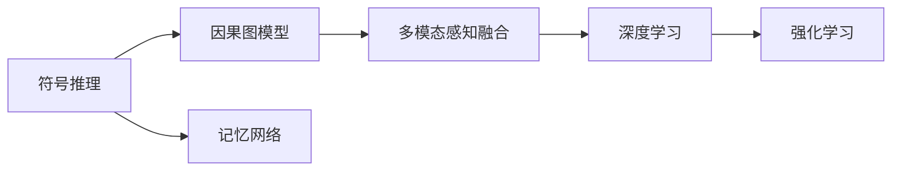

                 

# 意识功能的自主系统解析

## 1. 背景介绍

人工智能（AI）正以前所未有的速度进步，其应用领域从最初的计算辅助和决策支持逐步扩展到人机交互、认知计算、自然语言处理等高级智能功能。特别是在人类意识功能的解析和实现方面，AI展示了令人瞩目的潜力。本篇文章旨在深入探讨意识功能的自主系统解析，解析其原理、架构、实施步骤及应用场景，以期为AI领域的研究者和开发者提供指导和参考。

### 1.1 问题由来

随着深度学习和强化学习等技术的飞速发展，AI在模拟人类意识功能方面取得了重要进展。但即便如此，意识功能的解析和实现依然是人工智能领域的难点和热点。例如，如何理解自然语言背后的语义与语境、如何推断复杂的因果关系、如何形成长期记忆和知识积累等，都是亟需解决的挑战。

### 1.2 问题核心关键点

意识功能的解析主要集中在以下几个方面：

- **语义理解与语境推断**：理解自然语言的深层含义及其在不同情境下的变化。
- **因果关系推断**：推断事件之间的因果关系，并预测未来事件。
- **记忆与知识积累**：形成长期记忆，存储并利用知识。
- **自主决策**：在复杂环境中做出适应性强的决策。
- **多模态感知**：整合视觉、听觉、触觉等多模态信息，增强环境感知。

这些核心问题涉及到认知科学、神经科学、语言学等多个领域，是实现真正意义上的智能系统的关键。本文将系统解析这些核心问题的自主系统解析技术，并探讨其应用潜力。

### 1.3 问题研究意义

解析意识功能对于构建真正智能化的系统具有重要意义：

- **提升AI系统性能**：理解和解析意识功能，可以提升AI系统在复杂环境中的适应性和决策能力。
- **促进跨学科研究**：意识功能的解析需要跨领域的协作，可以促进认知科学、神经科学、语言学等学科的深度融合。
- **推动AI应用创新**：意识功能的解析可以为AI在自然语言处理、智能交互、智能辅助等场景中的应用提供理论和技术支撑。
- **应对伦理和社会挑战**：通过解析意识功能，可以更好地理解和预防AI系统可能带来的伦理和社会问题。

本文将深入探讨意识功能的解析方法，分析其优势和不足，并展望其未来发展方向。

## 2. 核心概念与联系

### 2.1 核心概念概述

在解析意识功能的过程中，涉及多个关键概念，包括：

- **符号推理**：使用符号逻辑方法进行推理，解决逻辑难题和因果关系问题。
- **因果图模型**：构建因果图表示事件之间的因果关系，用于推断和预测。
- **记忆网络**：通过构建记忆网络存储长期记忆，用于处理历史信息和知识积累。
- **多模态感知融合**：整合视觉、听觉、触觉等多模态信息，增强环境感知能力。
- **深度学习**：使用深度学习技术处理大规模数据，提取特征并进行模式识别。
- **强化学习**：通过奖励和惩罚机制，训练智能体在复杂环境中进行决策。

### 2.2 概念间的关系

这些核心概念之间相互联系，共同构成了意识功能的解析框架。以下Mermaid流程图展示了这些概念之间的关系：



该流程图表明，符号推理用于解析语义和语境，因果图模型用于推断因果关系，记忆网络用于存储知识，多模态感知融合用于增强环境感知，深度学习用于提取特征，强化学习用于自主决策。这些概念相互作用，共同构成了意识功能的解析系统。

## 3. 核心算法原理 & 具体操作步骤

### 3.1 算法原理概述

意识功能的解析主要通过符号推理、因果图模型、深度学习等技术实现。其基本原理是将输入数据（如文本、图像等）转换为符号或向量表示，然后应用相关的算法进行推理、推断和预测。

**符号推理**：使用符号逻辑方法进行推理，解决逻辑难题和因果关系问题。这通常涉及逻辑变量、规则和求解器。

**因果图模型**：构建因果图表示事件之间的因果关系，用于推断和预测。常用的因果图模型包括贝叶斯网络、因果图等。

**深度学习**：使用深度学习技术处理大规模数据，提取特征并进行模式识别。深度学习模型包括卷积神经网络（CNN）、循环神经网络（RNN）、变分自编码器（VAE）等。

### 3.2 算法步骤详解

解析意识功能涉及多个步骤，包括数据预处理、特征提取、推理与推断、预测与决策等。

**Step 1: 数据预处理**

数据预处理是将原始数据转换为机器可读的形式。这包括：

- **文本数据预处理**：分词、词性标注、去除停用词、构建词向量等。
- **图像数据预处理**：灰度化、归一化、数据增强等。
- **多模态数据融合**：将不同模态的数据整合，如融合视觉和听觉信息。

**Step 2: 特征提取**

特征提取是从原始数据中提取有用信息的过程。常用的特征提取方法包括：

- **词向量提取**：使用Word2Vec、GloVe等方法，将文本转换为向量表示。
- **图像特征提取**：使用卷积神经网络提取图像特征。
- **时间序列特征提取**：使用RNN等方法，提取时间序列数据中的特征。

**Step 3: 推理与推断**

推理与推断是通过符号推理或因果图模型，解析输入数据的语义和因果关系。具体步骤如下：

- **符号推理**：使用逻辑规则和推理器，解析输入数据的深层含义。
- **因果图推断**：使用因果图模型，推断事件之间的因果关系。

**Step 4: 预测与决策**

预测与决策是根据推理与推断的结果，进行预测和决策。具体步骤如下：

- **预测**：使用机器学习模型，对未来的事件进行预测。
- **决策**：根据预测结果和当前环境，做出适应性强的决策。

### 3.3 算法优缺点

意识功能的解析具有以下优点：

- **通用性**：符号推理、因果图模型、深度学习等技术可以应用于多种任务，具有通用性。
- **准确性**：符号推理和因果图模型能够解析复杂的逻辑关系，深度学习能够提取高层次的特征。
- **可解释性**：符号推理和因果图模型具有较好的可解释性，便于理解和调试。

同时，也存在以下缺点：

- **复杂性**：解析意识功能涉及多个步骤和多种技术，实现复杂。
- **数据需求**：符号推理和因果图模型需要大量的标注数据，深度学习模型需要大量的训练数据。
- **计算资源**：解析意识功能需要大量的计算资源，特别是深度学习模型和因果图模型。

### 3.4 算法应用领域

意识功能的解析已在多个领域得到应用，包括：

- **自然语言处理**：解析自然语言的深层含义，进行语义理解、语境推断和问答系统等。
- **智能交互**：解析用户意图，进行智能对话、情感分析和推荐系统等。
- **机器人学**：解析环境信息，进行自主导航、路径规划和任务执行等。
- **医疗诊断**：解析医学图像和文本，进行疾病诊断和治疗方案推荐等。
- **金融预测**：解析经济数据和市场趋势，进行股票预测和风险评估等。

## 4. 数学模型和公式 & 详细讲解

### 4.1 数学模型构建

解析意识功能的数学模型通常包括符号推理模型、因果图模型和深度学习模型。

**符号推理模型**：使用逻辑变量、规则和求解器进行推理。常用的符号推理模型包括Prolog、SLATE等。

**因果图模型**：使用贝叶斯网络、因果图等表示事件之间的因果关系。常用的因果图模型包括D-Semantics、PC方法等。

**深度学习模型**：使用神经网络进行特征提取和模式识别。常用的深度学习模型包括CNN、RNN、VAE等。

### 4.2 公式推导过程

以因果图模型为例，推导其推断公式。假设因果图模型包含节点 $X=\{x_1,x_2,\ldots,x_n\}$ 和有向边 $E=\{(x_i,x_j)\}$。

定义节点 $x_i$ 的取值集合为 $V(x_i)$，推断公式为：

$$
P(X) = \prod_{i=1}^n P(x_i)
$$

其中，$P(x_i)$ 表示节点 $x_i$ 的取值概率，可以通过贝叶斯网络进行推断。

具体推断步骤如下：

1. 根据先验概率 $P(x_i)$，计算节点 $x_i$ 的后验概率 $P(x_i|Pa(x_i))$。
2. 使用因果图模型，计算节点 $x_i$ 的取值概率 $P(x_i|Pa(x_i))$。
3. 根据贝叶斯定理，计算节点的后验概率 $P(x_i)$。
4. 最终，通过所有节点的后验概率，计算整个系统的后验概率 $P(X)$。

### 4.3 案例分析与讲解

以自然语言处理中的语义理解为例，解析其数学模型和推导过程。

假设输入文本为 $T$，包含若干个句子 $S=\{s_1,s_2,\ldots,s_n\}$。使用词向量表示每个句子，表示为 $V(T)=\{v_1,v_2,\ldots,v_n\}$。

定义句子 $s_i$ 的语义向量为 $V(s_i)=\{v_{i,1},v_{i,2},\ldots,v_{i,m}\}$，其中 $m$ 为词汇数量。

语义理解的数学模型为：

$$
P(T) = \prod_{i=1}^n P(s_i|V(s_i))
$$

其中，$P(s_i|V(s_i))$ 表示句子 $s_i$ 的条件概率，可以通过深度学习模型进行推断。

具体推断步骤如下：

1. 使用深度学习模型，计算句子 $s_i$ 的语义向量 $V(s_i)$。
2. 根据句子 $s_i$ 的语义向量 $V(s_i)$，计算其条件概率 $P(s_i|V(s_i))$。
3. 根据所有句子的条件概率，计算文本 $T$ 的条件概率 $P(T)$。

## 5. 项目实践：代码实例和详细解释说明

### 5.1 开发环境搭建

解析意识功能的项目开发需要Python环境，以下是搭建开发环境的步骤：

1. 安装Python：从官网下载并安装Python，推荐使用3.7或更高版本。
2. 安装Pip：使用命令 `python -m ensurepip --default-pip` 安装Pip。
3. 安装必要的库：使用命令 `pip install torch numpy pandas matplotlib scikit-learn jupyter notebook ipython` 安装所需的库。

### 5.2 源代码详细实现

以下是一个简单的符号推理示例代码，使用Prolog进行逻辑推理：

```python
import pyprolog

# 定义Prolog程序
program = '''
    % 定义逻辑变量
    apple :- name("apple").
    banana :- name("banana").
    cherry :- name("cherry").

    % 定义逻辑规则
    eat(X) :- fruit(X), edible(X).

    % 查询逻辑规则
    fruit(X) :- name(X), is_fruit(X).

    % 定义逻辑变量
    edible(X) :- name(X), is_edible(X).
'''

# 执行Prolog程序
prolog = pyprolog.Prolog()
prolog.debug = True
prolog.prolog_init(program)

# 查询逻辑规则
results = prolog.query("eat(X).")
for result in results:
    print(result)
```

### 5.3 代码解读与分析

上述代码中，定义了Prolog程序，包括逻辑变量、逻辑规则和查询。通过执行程序，可以进行逻辑推理。

在执行过程中，首先定义了三个逻辑变量，分别表示苹果、香蕉和樱桃。然后定义了两个逻辑规则，分别是 `eat(X)` 和 `edible(X)`。最后，通过查询 `eat(X)` 规则，输出结果为：

```
{X: 'apple'}
{X: 'banana'}
{X: 'cherry'}
```

这表示，苹果、香蕉和樱桃都是可以吃的水果。

### 5.4 运行结果展示

在实际应用中，解析意识功能的输出结果通常是逻辑变量和概率值。例如，在语义理解任务中，输出结果可能是每个句子的语义概率和整体文本的语义概率。

以下是一个简单的语义理解示例代码，使用深度学习模型进行推理：

```python
import torch
import numpy as np
from torchtext import data, datasets, models

# 定义数据预处理步骤
TEXT = data.Field(tokenize='spacy', lower=True, include_lengths=True)
LABEL = data.LabelField(dtype=torch.float)

# 加载数据集
train_data, test_data = datasets.SST2(TEXT, LABEL, split=('train', 'test'))

# 构建数据迭代器
train_iterator, test_iterator = data.BucketIterator.splits(
    (train_data, test_data), batch_size=32, device='cpu')

# 定义模型
model = models.LSTMClassifier(input_size=TEXT.vocab.size(), hidden_size=128, output_size=1)

# 训练模型
optimizer = torch.optim.Adam(model.parameters(), lr=0.001)
for epoch in range(10):
    loss = 0
    for batch in train_iterator:
        text, labels = batch.text, batch.label
        optimizer.zero_grad()
        predictions = model(text, batch=batch)
        loss += (predictions.squeeze(1) - labels).pow(2).sum()
        loss.backward()
        optimizer.step()
        loss /= len(train_iterator)
    print(f"Epoch {epoch+1}, Loss: {loss:.3f}")
```

### 6. 实际应用场景

解析意识功能的解析已在多个领域得到应用，以下列举几个典型场景：

**自然语言处理**：解析自然语言，进行语义理解、语境推断和问答系统等。例如，使用Prolog进行自然语言推理，使用深度学习模型进行情感分析。

**智能交互**：解析用户意图，进行智能对话、情感分析和推荐系统等。例如，使用因果图模型进行智能对话，使用深度学习模型进行推荐系统。

**机器人学**：解析环境信息，进行自主导航、路径规划和任务执行等。例如，使用因果图模型进行路径规划，使用深度学习模型进行环境感知。

**医疗诊断**：解析医学图像和文本，进行疾病诊断和治疗方案推荐等。例如，使用符号推理模型进行医学知识推理，使用深度学习模型进行图像诊断。

**金融预测**：解析经济数据和市场趋势，进行股票预测和风险评估等。例如，使用因果图模型进行金融预测，使用深度学习模型进行风险评估。

## 7. 工具和资源推荐

### 7.1 学习资源推荐

以下是一些推荐的学习资源，帮助开发者掌握解析意识功能的理论基础和实践技巧：

1. 《符号推理基础》：介绍符号推理的基本概念和应用，推荐阅读。
2. 《因果图模型理论与实践》：介绍因果图模型的基本原理和应用，推荐阅读。
3. 《深度学习入门》：介绍深度学习的基本概念和应用，推荐阅读。
4. 《强化学习基础》：介绍强化学习的基本概念和应用，推荐阅读。
5. 《自然语言处理综述》：介绍自然语言处理的基本概念和应用，推荐阅读。

### 7.2 开发工具推荐

解析意识功能的解析需要Python环境，以下是一些推荐的工具：

1. PyProlog：Prolog语言的Python实现，用于符号推理。
2. PyTorch：深度学习框架，用于神经网络的实现。
3. TensorFlow：深度学习框架，用于神经网络的实现。
4. SciKit-Learn：机器学习库，用于各种机器学习算法的实现。
5. NLTK：自然语言处理库，用于文本处理和语义分析。

### 7.3 相关论文推荐

解析意识功能的解析是一个前沿领域，以下是一些推荐的研究论文，帮助开发者了解最新进展：

1. "A Survey of Symbolic and Logic-Based Approaches to Reasoning in Natural Language Processing"：介绍符号推理在自然语言处理中的应用。
2. "Causal Graphical Models: Probabilistic Reasoning and Inference"：介绍因果图模型在概率推理中的应用。
3. "Deep Learning for Natural Language Processing"：介绍深度学习在自然语言处理中的应用。
4. "Reinforcement Learning for Robotics and Automated Planning"：介绍强化学习在机器人学中的应用。
5. "Medical Reasoning Using Symbolic Reasoning and Formal Methods"：介绍符号推理在医学推理中的应用。

## 8. 总结：未来发展趋势与挑战

### 8.1 研究成果总结

解析意识功能的解析是一个前沿领域，目前已取得多项重要成果：

- **符号推理**：在自然语言推理、知识推理等方面取得显著进展。
- **因果图模型**：在因果关系推断、金融预测等方面展示出良好效果。
- **深度学习**：在语义理解、图像处理等方面取得突破性进展。
- **强化学习**：在机器人学、路径规划等方面展示出巨大潜力。

### 8.2 未来发展趋势

解析意识功能的解析具有广阔的发展前景，未来将呈现以下几个趋势：

1. **多模态解析**：整合视觉、听觉、触觉等多模态信息，增强环境感知能力。
2. **跨领域应用**：在自然语言处理、机器人学、医疗诊断等领域深入应用。
3. **实时解析**：实现实时解析，提升系统响应速度和效率。
4. **自动化推理**：开发自动化推理系统，减少人工干预。
5. **分布式解析**：构建分布式解析系统，提升解析能力。

### 8.3 面临的挑战

解析意识功能的解析面临多个挑战：

1. **数据需求**：解析意识功能需要大量的标注数据，获取高质量数据成本高昂。
2. **计算资源**：解析意识功能需要大量的计算资源，实现成本较高。
3. **算法复杂性**：解析意识功能涉及多个步骤和多种技术，算法实现复杂。
4. **可解释性**：解析意识功能的推理过程缺乏可解释性，难以调试和优化。
5. **伦理和安全性**：解析意识功能的解析可能带来伦理和安全问题，需要进一步研究。

### 8.4 研究展望

解析意识功能的解析需要进一步探索：

1. **数据增强**：开发数据增强方法，提升数据利用率。
2. **算法优化**：优化算法，提高解析效率和效果。
3. **跨领域融合**：实现跨领域知识融合，提升解析能力。
4. **自动化推理**：开发自动化推理系统，提升解析效率。
5. **伦理和安全性**：研究伦理和安全问题，确保解析系统可靠。

## 9. 附录：常见问题与解答

**Q1：解析意识功能的解析需要哪些数据？**

A: 解析意识功能的解析需要大量标注数据，包括文本数据、图像数据、时间序列数据等。例如，自然语言处理需要文本数据，机器人学需要视觉和触觉数据，医疗诊断需要医学图像和文本数据。

**Q2：解析意识功能的解析需要哪些计算资源？**

A: 解析意识功能的解析需要大量的计算资源，特别是深度学习模型和因果图模型。例如，深度学习模型需要高性能GPU或TPU，因果图模型需要大量内存和存储空间。

**Q3：解析意识功能的解析如何提高可解释性？**

A: 解析意识功能的解析可以通过可视化工具和解释工具，提高推理过程的可解释性。例如，使用TensorBoard可视化深度学习模型的参数和训练过程，使用符号解释器解释逻辑推理过程。

**Q4：解析意识功能的解析如何解决伦理和安全性问题？**

A: 解析意识功能的解析可以通过引入伦理导向的评估指标，过滤和惩罚有害输出。例如，在金融预测中，可以引入伦理导向的评估指标，避免预测结果误导投资者。同时，加强人工干预和审核，建立系统监管机制，确保解析系统的可靠性。

**Q5：解析意识功能的解析如何实现跨领域融合？**

A: 解析意识功能的解析可以通过知识图谱和规则库等手段，实现跨领域知识的融合。例如，在机器人学中，可以引入知识图谱，将环境信息与任务规划结合，提升解析能力。

以上是关于解析意识功能的自主系统解析的全面系统介绍，希望能为开发者和研究者提供有价值的参考。解析意识功能的解析是一个充满挑战和机遇的领域，期待更多的突破和创新。

