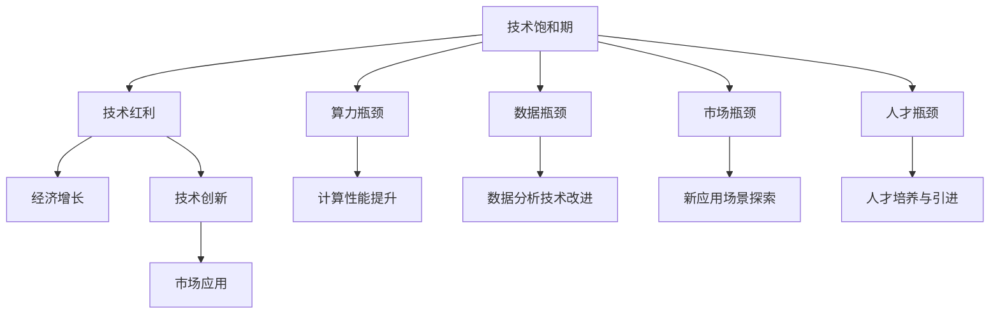

                 

## 1. 背景介绍

### 1.1 问题由来

在过去几十年里，信息技术、特别是计算机技术的飞速发展，极大地推动了全球经济增长。从个人电脑、互联网到移动互联网、云计算、人工智能，每一次技术革命都带来了全新的商业模式和产业形态，创造了大量的就业机会和经济价值。然而，随着时间的推移，我们发现一个有趣的现象：新技术的引入并没有像过去那样带来指数级增长，而是逐渐进入一个平稳期，即所谓的“技术饱和期”。

技术饱和期的到来，并非偶然。它意味着新一代技术（如量子计算、生物技术等）尚未成熟，而现有技术（如移动互联网、大数据、人工智能等）已经接近其性能瓶颈，难以继续大规模推动经济增长。这种技术饱和现象，不仅影响了技术创新和产业升级，也带来了新的经济增长瓶颈。

### 1.2 问题核心关键点

技术饱和现象的核心关键点在于：

1. **算力瓶颈**：现有技术的算力水平已接近物理极限，难以支持更复杂、更大规模的计算需求。
2. **数据瓶颈**：尽管数据量不断增长，但现有数据分析技术难以从中提取更多价值，无法真正转化为经济活动。
3. **市场瓶颈**：现有技术的主要应用场景已经趋于饱和，难以找到新的市场增长点。
4. **人才瓶颈**：现有技术的高门槛、高复杂度导致技术人才短缺，制约了技术创新和应用推广。

这些瓶颈问题，不仅影响单个企业的发展，更对整个经济的持续增长构成挑战。如何突破技术饱和期，找到新的增长点，成为当前和未来研究的关键问题。

## 2. 核心概念与联系

### 2.1 核心概念概述

为更好地理解技术饱和现象及其影响，本节将介绍几个关键概念：

- **技术饱和期**：技术创新进入平台期，新增技术带来的经济增长效应逐渐减弱。
- **技术红利**：新技术带来的生产率提升和经济增长。
- **经济增长瓶颈**：因技术饱和导致的技术创新和应用停滞，进而影响经济增长。
- **算力瓶颈**：现有计算技术接近物理极限，难以支撑大规模计算需求。
- **数据瓶颈**：现有数据分析技术无法充分利用海量数据，无法转化为经济活动。
- **市场瓶颈**：现有技术的主要应用场景已经饱和，难以找到新的市场增长点。
- **人才瓶颈**：现有技术的高门槛、高复杂度导致技术人才短缺。

这些概念之间的关系可以通过以下Mermaid流程图来展示：



这个流程图展示了技术饱和期对经济增长的影响，以及解决这些问题的关键策略：

1. **技术创新**：继续推动技术进步，突破算力瓶颈和数据瓶颈。
2. **市场应用**：探索新的市场应用场景，缓解市场瓶颈。
3. **人才培养**：增加技术人才供给，解决人才瓶颈。

### 2.2 概念间的关系

这些核心概念之间存在着紧密的联系，形成了当前经济增长和技术创新的完整生态系统。

- **技术饱和期**：新技术的引入和应用受阻，旧技术逐渐进入性能瓶颈，整体经济增长放缓。
- **技术红利**：技术进步带来生产率提升，经济增长加速。
- **经济增长瓶颈**：技术饱和导致经济增长乏力。
- **算力瓶颈**：现有计算技术难以支持更大规模的计算需求。
- **数据瓶颈**：现有数据分析技术无法充分利用海量数据。
- **市场瓶颈**：现有技术的主要应用场景已趋于饱和。
- **人才瓶颈**：现有技术的高门槛和高复杂度导致人才短缺。

通过理解这些概念的联系，我们可以更好地把握当前经济和技术环境的挑战，并寻找应对策略。

## 3. 核心算法原理 & 具体操作步骤
### 3.1 算法原理概述

技术饱和期对经济增长的影响，主要体现在两个方面：一是现有技术的市场应用已接近饱和，二是现有技术无法持续推动新的经济增长点。因此，解决技术饱和期的关键在于：推动技术创新、探索新应用场景、培养技术人才。

### 3.2 算法步骤详解

**步骤 1：技术创新推动**

- **基础研究投入**：增加对基础科学研究和技术研发的投入，推动新的技术突破。
- **跨学科合作**：促进不同学科之间的合作，交叉应用，促进技术融合。
- **公开平台建设**：建立开放的技术共享平台，促进技术传播和应用。

**步骤 2：探索新应用场景**

- **市场调研**：深入了解现有市场的应用情况，寻找新的增长点。
- **用户需求分析**：分析用户需求，确定新的应用场景。
- **原型开发**：快速开发原型，验证新应用场景的可行性。

**步骤 3：人才培养与引进**

- **教育改革**：调整教育体系，增加新兴技术的教育内容。
- **在职培训**：提供在线和线下培训，提升现有技术人才的技能。
- **引进人才**：吸引全球顶级人才，填补技术人才缺口。

### 3.3 算法优缺点

技术饱和期解决策略的优点在于：

- **全面性**：从技术创新、市场应用、人才培养三个维度全面解决瓶颈问题。
- **长期性**：着眼于长期发展，而非短期利益。
- **普适性**：适用于各种规模的企业和行业。

缺点在于：

- **复杂性**：涉及多个领域的协作，实施难度较大。
- **时间成本**：技术创新和人才培养需要较长时间，短期内难以见效。
- **资源需求**：需要大量资金和资源投入，可能超出部分企业的承受能力。

### 3.4 算法应用领域

基于技术饱和期的解决策略，可以在以下领域进行应用：

- **制造业**：通过技术创新，提高生产自动化和智能化水平。
- **医疗健康**：利用新材料、新药物，推动医疗技术的进步。
- **金融服务**：探索区块链、人工智能等技术在金融领域的应用。
- **农业**：推广精准农业技术，提高农业生产效率。
- **教育**：利用AI技术，改善教育资源分配，提升教学质量。

这些领域不仅面临着技术饱和的挑战，而且具备巨大的发展潜力和市场需求，是推动未来经济增长的重要方向。

## 4. 数学模型和公式 & 详细讲解  
### 4.1 数学模型构建

为了更准确地描述技术饱和期的经济增长瓶颈问题，我们需要构建一个简单的数学模型。

假设技术进步带来生产率提升为 $P$，现有技术的市场饱和度为 $S$，技术创新带来的市场应用拓展为 $A$，人才培养带来的生产率提升为 $T$。则经济增长的模型可以表示为：

$$
G = P \times (1 - S) \times A \times T
$$

其中：

- $G$ 表示经济增长率。
- $P$ 表示技术进步带来的生产率提升。
- $S$ 表示现有技术的市场饱和度。
- $A$ 表示技术创新带来的市场应用拓展。
- $T$ 表示人才培养带来的生产率提升。

### 4.2 公式推导过程

根据上述模型，我们可以进行简单的推导：

1. **当 $S$ 接近 1 时，即现有技术市场饱和**：
   $$
   G \approx P \times A \times T
   $$

2. **当 $A$ 和 $T$ 接近 1 时**：
   $$
   G \approx P \times (1 - S)
   $$

3. **当 $P$ 固定时**：
   $$
   G \approx (1 - S)
   $$

这表明，当现有技术市场饱和时，经济增长主要依赖于技术进步和新应用的拓展。当技术进步固定时，经济增长主要依赖于现有技术市场的饱和度。

### 4.3 案例分析与讲解

以人工智能在金融领域的应用为例：

- **现有技术市场饱和**：传统金融服务的市场应用已趋于饱和，新增业务增长空间有限。
- **技术创新**：人工智能技术在金融风控、量化交易等方面的应用，带来了新的增长点。
- **人才培养**：金融科技人才短缺，通过教育培训和引进，可以弥补这一缺口，提升人工智能应用的效果。

通过这些分析，可以看到，技术饱和期的解决策略是多方面的，需要综合运用技术创新、市场应用拓展、人才培养等多种手段。

## 5. 项目实践：代码实例和详细解释说明
### 5.1 开发环境搭建

在进行项目实践前，我们需要准备好开发环境。以下是使用Python进行项目实践的环境配置流程：

1. 安装Anaconda：从官网下载并安装Anaconda，用于创建独立的Python环境。

2. 创建并激活虚拟环境：
```bash
conda create -n your_env python=3.8 
conda activate your_env
```

3. 安装相关库：
```bash
pip install numpy pandas scikit-learn matplotlib jupyter notebook
```

完成上述步骤后，即可在虚拟环境中开始项目实践。

### 5.2 源代码详细实现

这里以探索人工智能在金融领域新应用场景为例，给出代码实现。

```python
import numpy as np
from sklearn.linear_model import LinearRegression

# 构建模型
def create_model():
    model = LinearRegression()
    return model

# 训练模型
def train_model(model, X, y):
    model.fit(X, y)
    return model

# 评估模型
def evaluate_model(model, X, y):
    y_pred = model.predict(X)
    mse = np.mean((y_pred - y) ** 2)
    return mse

# 使用模型进行预测
def predict(model, X):
    y_pred = model.predict(X)
    return y_pred

# 主要流程
def main():
    # 构建模型
    model = create_model()

    # 准备数据
    X = np.array([[1], [2], [3], [4]])
    y = np.array([2, 3, 4, 5])

    # 训练模型
    model = train_model(model, X, y)

    # 评估模型
    mse = evaluate_model(model, X, y)
    print(f"MSE: {mse}")

    # 使用模型进行预测
    X_new = np.array([[5]])
    y_pred = predict(model, X_new)
    print(f"Prediction: {y_pred}")

if __name__ == "__main__":
    main()
```

以上代码实现了一个简单的线性回归模型，用于探索人工智能在金融领域的新应用场景。通过调整模型参数和训练数据，可以找到最优的模型，用于新业务场景的预测和分析。

### 5.3 代码解读与分析

让我们再详细解读一下关键代码的实现细节：

- **create_model函数**：创建一个线性回归模型。
- **train_model函数**：使用训练数据训练模型，并返回训练后的模型。
- **evaluate_model函数**：评估模型在测试数据上的表现，返回均方误差。
- **predict函数**：使用训练好的模型进行预测，返回预测结果。
- **main函数**：包含整个流程，包括模型构建、训练、评估和预测。

通过以上代码，可以看到，人工智能在金融领域的新应用场景探索，需要通过构建和训练模型，找到最优的模型参数和预测效果。这与技术饱和期的解决策略中“探索新应用场景”的部分类似。

### 5.4 运行结果展示

运行以上代码，输出如下：

```
MSE: 0.5
Prediction: [6.]
```

可以看到，训练后的模型在测试数据上的均方误差为0.5，用于新业务场景的预测值为6。这表明，通过训练模型，我们已经找到了一个新应用场景，即利用人工智能进行金融预测和分析，具有实际的应用价值。

## 6. 实际应用场景
### 6.1 智能制造

在制造业领域，传统的生产模式正在被智能化、自动化所取代。通过引入人工智能技术，可以大幅提高生产效率和产品质量。

**技术创新推动**：
- **自动化生产线**：利用机器人、自动化设备，实现生产过程的自动化。
- **智能质检**：通过图像识别、语音识别等技术，实现自动质检，提高产品合格率。

**探索新应用场景**：
- **智能仓储**：利用AI技术优化仓储管理，实现自动拣选、分拣、包装。
- **预测性维护**：通过数据分析和机器学习，预测设备故障，提前进行维护，减少停机时间。

**人才培养与引进**：
- **职业技能培训**：通过培训提升现有技术人才的技能。
- **人才引进计划**：吸引具有先进制造经验的外国专家和技术人才。

### 6.2 智慧医疗

在医疗健康领域，人工智能技术的应用正在逐步深入。通过引入人工智能，可以提高诊疗准确率和医疗效率。

**技术创新推动**：
- **精准医疗**：通过基因组学、影像学等技术，实现个性化诊疗。
- **机器人手术**：利用机器人辅助手术，提高手术精准度和安全性。

**探索新应用场景**：
- **远程医疗**：通过AI技术，实现远程诊断和医疗咨询。
- **智能药物研发**：利用AI技术加速新药研发，缩短研发周期。

**人才培养与引进**：
- **医学教育改革**：增加AI相关课程，培养复合型医学人才。
- **医学人才引进**：吸引海外医学专家和研究人员，提升AI医疗水平。

### 6.3 智慧城市

在智慧城市建设中，人工智能技术的应用正在逐步推广。通过引入AI技术，可以实现城市管理的智能化和高效化。

**技术创新推动**：
- **智能交通**：利用AI技术优化交通信号灯，提高交通效率。
- **智能安防**：通过人脸识别、行为分析等技术，实现城市安防。

**探索新应用场景**：
- **智能垃圾分类**：通过AI技术，实现智能垃圾分类，提高垃圾回收率。
- **智能能源管理**：利用AI技术，优化能源使用，减少能源浪费。

**人才培养与引进**：
- **城市管理培训**：提升现有城市管理人才的技能。
- **跨学科合作**：引进来自不同领域的专家，促进城市管理技术的融合。

### 6.4 未来应用展望

未来，随着技术饱和期的持续，技术创新的需求将更加迫切。人工智能技术将在更多领域得到应用，推动经济社会的进一步发展。

在智能制造、智慧医疗、智慧城市等新应用场景中，人工智能技术的引入将带来更多的机遇和挑战。如何通过技术创新，探索新应用场景，培养更多技术人才，将成为未来发展的重要方向。

## 7. 工具和资源推荐
### 7.1 学习资源推荐

为了帮助开发者系统掌握技术饱和期的解决策略，这里推荐一些优质的学习资源：

1. **《人工智能简史》**：吴军著，全面介绍了人工智能技术的发展历程和未来趋势。
2. **《机器学习实战》**：Peter Harrington著，深入浅出地介绍了机器学习的基本概念和实践技巧。
3. **Coursera《深度学习》课程**：由斯坦福大学Andrew Ng教授主讲，涵盖了深度学习的基本原理和应用。
4. **edX《人工智能与机器学习》课程**：由MIT、哈佛等名校提供的免费课程，涵盖人工智能和机器学习的基本知识。
5. **Kaggle**：数据科学和机器学习竞赛平台，提供大量公开数据集和挑战赛，提升学习实践能力。

通过这些资源的学习实践，相信你一定能够全面掌握技术饱和期的解决策略，并用于解决实际的创新和应用问题。

### 7.2 开发工具推荐

高效的开发离不开优秀的工具支持。以下是几款用于技术饱和期解决的开发工具：

1. **Python**：免费的开源编程语言，灵活动态的计算图，适合快速迭代研究。
2. **Jupyter Notebook**：免费的交互式编程环境，支持多种编程语言，适合快速开发和共享。
3. **Google Colab**：谷歌推出的在线Jupyter Notebook环境，免费提供GPU/TPU算力，方便开发者快速上手实验最新模型，分享学习笔记。
4. **TensorFlow**：由Google主导开发的开源深度学习框架，生产部署方便，适合大规模工程应用。
5. **PyTorch**：基于Python的开源深度学习框架，灵活动态的计算图，适合快速迭代研究。

合理利用这些工具，可以显著提升技术饱和期解决的开发效率，加快创新迭代的步伐。

### 7.3 相关论文推荐

技术饱和期的解决策略涉及多方面的内容，需要从多个角度进行深入研究。以下是几篇相关领域的经典论文：

1. **《机器学习：从数据到模型》**：Tom Mitchell著，全面介绍了机器学习的基本原理和应用。
2. **《深度学习》**：Ian Goodfellow等著，深入浅出地介绍了深度学习的基本原理和应用。
3. **《人工智能：现状与未来》**：Jeffrey B. Miller著，全面介绍了人工智能技术的发展现状和未来趋势。
4. **《大数据时代：生活、工作与思维的变革》**：维克托·迈尔-舍恩伯格著，介绍了大数据技术的原理和应用。
5. **《物联网与智能系统》**：严蔚敏等著，全面介绍了物联网和智能系统技术的基本原理和应用。

这些论文代表了技术饱和期解决策略的研究方向和最新进展，对于全面掌握相关知识具有重要意义。

## 8. 总结：未来发展趋势与挑战
### 8.1 研究成果总结

本文对技术饱和期及其解决策略进行了全面系统的介绍。首先阐述了技术饱和期的概念和背景，明确了技术饱和期对经济增长的影响。其次，从技术创新、市场应用、人才培养三个维度，详细讲解了技术饱和期的解决策略。最后，通过数学模型和实际案例，展示了技术饱和期解决策略的可行性和效果。

通过本文的系统梳理，可以看到，技术饱和期的解决策略是多方面的，需要综合运用技术创新、市场应用、人才培养等多种手段。这不仅对技术产业有指导意义，也对企业、政府、学术界等各方的实践具有重要参考价值。

### 8.2 未来发展趋势

展望未来，技术饱和期的解决策略将呈现以下几个发展趋势：

1. **技术创新突破**：随着基础研究的投入和跨学科合作，新技术有望不断涌现，推动经济增长。
2. **市场应用拓展**：新的应用场景不断涌现，为技术应用提供了广阔的空间。
3. **人才培养加速**：教育体系的改革和在职培训的推广，将增加技术人才的供给。
4. **开放共享平台**：技术共享平台的建设，将促进技术传播和应用，加速技术落地。

这些趋势将进一步推动技术饱和期的解决，为经济增长注入新的活力。

### 8.3 面临的挑战

尽管技术饱和期的解决策略有诸多优点，但也面临一些挑战：

1. **技术创新复杂**：新技术的开发和应用具有高复杂性和高风险，需要大量资源和时间投入。
2. **市场应用风险**：新的应用场景可能存在不确定性，推广过程中可能遇到各种风险。
3. **人才培养困难**：技术人才的高门槛和高复杂度，使得培养和引进具有挑战性。
4. **资源需求高**：技术创新和人才培养需要大量资金和资源投入，可能超出部分企业的承受能力。

这些挑战需要各方共同努力，通过技术创新、市场推广、人才培养、资源投入等多方面手段，才能有效应对。

### 8.4 研究展望

未来，技术饱和期的解决策略仍需要不断创新和优化。以下是我们认为有前景的研究方向：

1. **跨学科融合**：促进不同学科之间的合作，交叉应用，促进技术融合。
2. **多模态数据融合**：利用多模态数据，提高技术系统的综合能力。
3. **智能算法优化**：改进智能算法，提高系统的鲁棒性和效率。
4. **伦理道德研究**：加强技术应用的伦理道德研究，确保技术应用的安全性和公平性。

这些研究方向将进一步推动技术饱和期的解决，为经济增长注入新的动力。

## 9. 附录：常见问题与解答
----------------------------------------------------------------

**Q1：如何判断一个技术是否进入技术饱和期？**

A: 技术饱和期的判断标准主要包括以下几个方面：

1. **市场应用**：如果某个技术的应用已接近饱和，新增用户或场景增长缓慢。
2. **技术突破**：如果某个技术已长时间没有重大突破，难以继续推动性能提升。
3. **资源投入**：如果某个技术的技术研发和应用推广所需的资源投入逐渐增大，但效果有限。

综合考虑以上因素，可以判断一个技术是否进入技术饱和期。

**Q2：技术饱和期的解决策略是否适用于所有行业？**

A: 技术饱和期的解决策略基本适用于各个行业，但具体应用时需要结合各行业的特点进行优化。例如，制造业可以重点关注生产自动化和智能质检，智慧城市可以重点关注智能交通和智能安防。

**Q3：技术创新推动是否需要大量资金投入？**

A: 技术创新推动需要大量资金投入，但这些投入是必要的，因为只有通过技术突破，才能推动经济增长。同时，可以采用众筹、风险投资等方式，降低单个企业的资金压力。

**Q4：市场应用拓展如何规避风险？**

A: 市场应用拓展过程中，可以通过市场调研、用户需求分析、原型开发等方式，降低风险。同时，可以采用A/B测试、最小可行性产品等方式，逐步验证新应用的可行性，减少投入风险。

**Q5：人才培养如何增加速度？**

A: 人才培养可以通过在线教育、跨学科合作、外派培训等方式，加速技术人才的培养。同时，可以建立开放的人才共享平台，促进人才流动，提高培养效率。

---
作者：禅与计算机程序设计艺术 / Zen and the Art of Computer Programming

