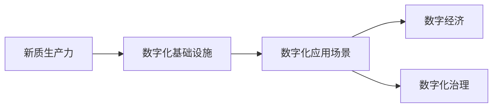
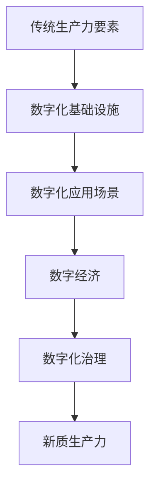

                 

## 1. 背景介绍

### 1.1 问题由来
随着科技的迅猛发展，信息技术已经渗透到社会经济的各个角落，深刻改变了生产、生活、学习等方方面面。在这波信息化的浪潮中，中国政府提出“数字中国”战略，旨在推动数字技术与实体经济深度融合，提升国家治理能力，塑造未来竞争新优势。

数字中国战略的提出，旨在通过数字技术的广泛应用，助力构建新型工业化、信息化、城镇化和农业现代化四位一体的现代化经济体系。其核心在于将数字化、网络化、智能化等新型生产力要素，与传统生产力要素相结合，形成新质生产力，推动经济社会高质量发展。

数字中国战略与新质生产力的结合，是当前全球科技革命和产业变革大势所趋，是中国实现高质量发展的战略选择。然而，如何通过数字化手段实现新质生产力的构建，仍面临诸多挑战。本文将深入探讨这一问题，提出解决方案，并对未来发展趋势进行展望。

### 1.2 问题核心关键点
当前，数字化与新质生产力结合的核心问题主要包括：

1. **数字化转型路径**：如何通过数字化手段构建新质生产力，实现产业升级和经济转型。
2. **数字化基础设施建设**：包括网络基础设施、数据中心、云计算等基础设施的建设和优化。
3. **数字化应用场景**：探索和推广数字化应用场景，推动各行各业的数字化转型。
4. **数据安全和隐私保护**：如何在数字化过程中保护数据安全和隐私，建立可信的数字化环境。
5. **人才和技能**：培养和吸引数字化技术人才，提升全民数字素养。
6. **法律法规和政策支持**：制定和完善法律法规，提供政策支持和引导。

这些问题涉及到技术、经济、社会等多个层面，需要政府、企业和社会各方共同努力，才能实现数字化与新质生产力的有效结合。

### 1.3 问题研究意义
研究数字化与新质生产力的结合，对于推动中国经济社会高质量发展具有重要意义：

1. **促进产业升级**：通过数字化手段提升传统产业的技术水平，推动制造业、农业、服务业等传统产业向高端化、智能化方向发展。
2. **推动经济增长**：数字化转型有助于开拓新的市场，创造新的增长点，提升整体经济效率。
3. **优化资源配置**：数字化技术能够有效提升资源配置效率，促进资源共享和优化利用。
4. **提升社会治理能力**：通过数字化手段，实现城市管理、公共服务、社会治理等方面的智能化，提升社会管理效率和服务质量。
5. **培养新型人才**：数字化转型需要大量新型人才，有助于提升全民数字素养，推动社会进步。

## 2. 核心概念与联系

### 2.1 核心概念概述

为更好地理解数字化与新质生产力结合，本节将介绍几个密切相关的核心概念：

- **新质生产力**：指通过数字化技术赋能传统生产力要素，提升产业的技术水平、效率和价值创造能力，形成新型生产力和生产方式。
- **数字化基础设施**：包括互联网、数据中心、云计算、5G等现代通信技术，以及物联网、大数据、人工智能等新兴技术，是支持数字化转型的基础条件。
- **数字化应用场景**：指基于数字化基础设施，在各行业、各领域构建的数字化应用解决方案，如智慧城市、智能制造、智慧医疗等。
- **数字经济**：利用数字技术和新商业模式，优化和扩展传统经济活动，形成以信息和服务为核心的新型经济形态。
- **数字化治理**：通过数字化手段，实现政府、企业、社会各方的协同治理，提升治理效率和服务质量。

这些核心概念之间存在紧密联系，共同构成了数字化与新质生产力结合的整体框架。

### 2.2 概念间的关系

这些核心概念之间的联系可以通过以下Mermaid流程图来展示：



这个流程图展示了新质生产力与数字化基础设施、数字化应用场景、数字经济和数字化治理之间的相互依存和支撑关系。

### 2.3 核心概念的整体架构

最后，我们用一个综合的流程图来展示这些核心概念在新质生产力构建中的整体架构：



这个综合流程图展示了从传统生产力要素到新质生产力的转化路径，各环节通过数字化手段相互连接和支撑，共同推动新质生产力的构建。

## 3. 核心算法原理 & 具体操作步骤
### 3.1 算法原理概述

数字化与新质生产力结合的核心算法原理，主要是通过数字化技术赋能传统生产力要素，提升产业的技术水平、效率和价值创造能力。具体而言，包括以下几个步骤：

1. **数据采集与清洗**：通过物联网、大数据等技术手段，全面采集各行业的生产、运营、服务数据，并进行清洗、整合和标准化。
2. **数据建模与分析**：基于大数据、人工智能等技术，对采集到的数据进行建模和分析，挖掘数据中的价值和规律。
3. **应用场景构建**：在各行业构建基于数字化的应用场景，如智能制造、智慧城市、智能医疗等，实现生产过程的智能化和自动化。
4. **资源优化与重组**：通过数字化手段，优化资源配置和流程，提升生产效率和资源利用率。
5. **价值创造与增值**：利用数字化技术，开发新业务模式和服务，创造新的价值点，推动产业升级和经济转型。

### 3.2 算法步骤详解

基于上述原理，数字化与新质生产力结合的具体操作步骤如下：

**Step 1: 数据采集与清洗**
- 通过传感器、监控设备等手段，全面采集各行业的生产、运营、服务数据。
- 对采集到的数据进行清洗、去重、填补缺失值等处理，确保数据的质量和一致性。
- 对数据进行标准化和格式化，便于后续的分析和建模。

**Step 2: 数据建模与分析**
- 利用大数据、人工智能等技术，对清洗后的数据进行建模和分析，提取数据中的价值和规律。
- 采用机器学习、深度学习等算法，挖掘数据中的关联、趋势、模式等，为产业转型提供数据支持。
- 建立数据仓库和数据湖，集中存储和管理数据，为数字化应用提供数据支撑。

**Step 3: 应用场景构建**
- 根据各行业的特点和需求，构建数字化应用场景，如智能制造、智慧城市、智能医疗等。
- 引入物联网、云计算、人工智能等技术，实现生产过程的智能化和自动化。
- 设计并开发数字应用系统，实现数据驱动的决策和管理。

**Step 4: 资源优化与重组**
- 通过数字化手段，优化生产流程和资源配置，提升生产效率和资源利用率。
- 引入虚拟现实、增强现实等技术，实现生产环境的可视化管理和远程监控。
- 利用智能调度、优化算法等技术，提升生产调度和资源利用效率。

**Step 5: 价值创造与增值**
- 开发新的业务模式和服务，利用数字化手段创造新的价值点。
- 推动产业链上下游的协同合作，实现数字化转型和产业升级。
- 通过数字化治理，提升政府、企业、社会各方的协同治理能力，提升治理效率和服务质量。

### 3.3 算法优缺点

数字化与新质生产力结合的算法具有以下优点：

1. **提升效率和精度**：通过数字化手段，可以提升生产效率和数据处理精度，降低生产成本。
2. **促进创新和变革**：数字化技术可以推动产业创新和变革，创造新的商业模式和服务。
3. **优化资源配置**：数字化技术可以优化资源配置和流程，提升资源利用率。
4. **提升治理效率**：数字化治理可以提高政府、企业、社会各方的协同治理能力，提升治理效率和服务质量。

同时，该算法也存在以下缺点：

1. **数据隐私和安全**：在数据采集和处理过程中，存在数据隐私和安全问题，需要采取相应的保护措施。
2. **技术依赖性强**：数字化技术的推广和应用需要技术支持和人才培养，技术依赖性强。
3. **投资成本高**：数字化基础设施和应用系统的建设需要大量的资金投入，投资成本较高。
4. **数据质量问题**：数据采集和清洗过程中，存在数据质量问题，需要采取相应的技术手段进行解决。

### 3.4 算法应用领域

数字化与新质生产力结合的算法在多个领域都有广泛应用，主要包括：

- **智能制造**：通过数字化技术，实现生产过程的智能化和自动化，提升制造效率和质量。
- **智慧城市**：通过数字化手段，实现城市管理、公共服务、交通出行等的智能化，提升城市治理能力。
- **智能医疗**：通过数字化技术，实现医疗数据的共享和分析，提升医疗服务的质量和效率。
- **智能金融**：通过数字化手段，实现金融数据的分析和管理，提升金融服务的智能化和个性化。
- **智慧农业**：通过数字化技术，实现农业生产的智能化和精准管理，提升农业生产的效率和效益。

## 4. 数学模型和公式 & 详细讲解  
### 4.1 数学模型构建

数字化与新质生产力结合的数学模型，主要是基于大数据和人工智能技术构建的。以下是基本的数学模型构建过程：

- **数据采集模型**：通过传感器、监控设备等手段，全面采集各行业的生产、运营、服务数据，建立数据采集模型。

$$
\text{Data Acquisition Model} = \text{Sensor Data} + \text{Monitoring Data} + \text{External Data}
$$

- **数据清洗模型**：对采集到的数据进行清洗、去重、填补缺失值等处理，建立数据清洗模型。

$$
\text{Data Cleaning Model} = \text{Data Quality Check} + \text{Data Deduplication} + \text{Missing Value Imputation}
$$

- **数据建模模型**：利用大数据、人工智能等技术，对清洗后的数据进行建模和分析，建立数据建模模型。

$$
\text{Data Modeling Model} = \text{Supervised Learning} + \text{Unsupervised Learning} + \text{Reinforcement Learning}
$$

- **数字化应用模型**：基于数据建模结果，构建数字化应用场景，建立数字化应用模型。

$$
\text{Digital Application Model} = \text{IoT Technology} + \text{Cloud Computing} + \text{Artificial Intelligence}
$$

- **资源优化模型**：通过数字化手段，优化生产流程和资源配置，建立资源优化模型。

$$
\text{Resource Optimization Model} = \text{Optimization Algorithm} + \text{Simulation Model} + \text{Visualization Technology}
$$

- **价值创造模型**：利用数字化技术，开发新业务模式和服务，建立价值创造模型。

$$
\text{Value Creation Model} = \text{New Business Model} + \text{Digital Services} + \text{Collaborative Economy}
$$

### 4.2 公式推导过程

以下以智能制造为例，推导数字化与新质生产力结合的数学模型：

1. **数据采集模型**：通过传感器和监控设备，采集生产线上的数据。

$$
\text{Data Acquisition} = \text{Sensor Data} + \text{Monitoring Data}
$$

2. **数据清洗模型**：对采集到的数据进行清洗、去重和填补缺失值。

$$
\text{Data Cleaning} = \text{Data Quality Check} + \text{Data Deduplication} + \text{Missing Value Imputation}
$$

3. **数据建模模型**：利用机器学习算法，对清洗后的数据进行建模和分析，提取数据中的规律。

$$
\text{Data Modeling} = \text{Supervised Learning Algorithm} + \text{Unsupervised Learning Algorithm}
$$

4. **数字化应用模型**：引入物联网和云计算技术，实现生产过程的智能化和自动化。

$$
\text{Digital Application} = \text{IoT Technology} + \text{Cloud Computing}
$$

5. **资源优化模型**：通过优化算法和仿真技术，优化生产流程和资源配置。

$$
\text{Resource Optimization} = \text{Optimization Algorithm} + \text{Simulation Model}
$$

6. **价值创造模型**：开发新的业务模式和服务，提升价值创造能力。

$$
\text{Value Creation} = \text{New Business Model} + \text{Digital Services}
$$

### 4.3 案例分析与讲解

以智能制造为例，通过数字化与新质生产力的结合，可以实现生产过程的智能化和自动化，提升生产效率和产品质量。

1. **数据采集**：通过传感器和监控设备，全面采集生产过程中的温度、湿度、压力、速度等数据。

$$
\text{Data Acquisition} = \text{Temperature Sensor Data} + \text{Humidity Sensor Data} + \text{Pressure Sensor Data} + \text{Speed Sensor Data}
$$

2. **数据清洗**：对采集到的数据进行清洗、去重和填补缺失值，确保数据的质量和一致性。

$$
\text{Data Cleaning} = \text{Data Quality Check} + \text{Data Deduplication} + \text{Missing Value Imputation}
$$

3. **数据建模**：利用机器学习算法，对清洗后的数据进行建模和分析，提取数据中的规律。

$$
\text{Data Modeling} = \text{Supervised Learning Algorithm} + \text{Unsupervised Learning Algorithm}
$$

4. **数字化应用**：引入物联网和云计算技术，实现生产过程的智能化和自动化。

$$
\text{Digital Application} = \text{IoT Technology} + \text{Cloud Computing}
$$

5. **资源优化**：通过优化算法和仿真技术，优化生产流程和资源配置。

$$
\text{Resource Optimization} = \text{Optimization Algorithm} + \text{Simulation Model}
$$

6. **价值创造**：开发新的业务模式和服务，提升价值创造能力。

$$
\text{Value Creation} = \text{New Business Model} + \text{Digital Services}
$$

## 5. 项目实践：代码实例和详细解释说明
### 5.1 开发环境搭建

在进行数字化与新质生产力结合的实践前，我们需要准备好开发环境。以下是使用Python进行PyTorch开发的环境配置流程：

1. 安装Anaconda：从官网下载并安装Anaconda，用于创建独立的Python环境。

2. 创建并激活虚拟环境：
```bash
conda create -n pytorch-env python=3.8 
conda activate pytorch-env
```

3. 安装PyTorch：根据CUDA版本，从官网获取对应的安装命令。例如：
```bash
conda install pytorch torchvision torchaudio cudatoolkit=11.1 -c pytorch -c conda-forge
```

4. 安装Transformers库：
```bash
pip install transformers
```

5. 安装各类工具包：
```bash
pip install numpy pandas scikit-learn matplotlib tqdm jupyter notebook ipython
```

完成上述步骤后，即可在`pytorch-env`环境中开始数字化与新质生产力结合的实践。

### 5.2 源代码详细实现

这里我们以智能制造为例，给出使用Transformers库对BERT模型进行数字化应用开发的PyTorch代码实现。

首先，定义数据处理函数：

```python
from transformers import BertTokenizer
from torch.utils.data import Dataset
import torch

class ManufacturingData(Dataset):
    def __init__(self, data, tokenizer, max_len=128):
        self.data = data
        self.tokenizer = tokenizer
        self.max_len = max_len
        
    def __len__(self):
        return len(self.data)
    
    def __getitem__(self, item):
        text = self.data[item]
        
        encoding = self.tokenizer(text, return_tensors='pt', max_length=self.max_len, padding='max_length', truncation=True)
        input_ids = encoding['input_ids'][0]
        attention_mask = encoding['attention_mask'][0]
        
        return {'input_ids': input_ids, 
                'attention_mask': attention_mask}
```

然后，定义模型和优化器：

```python
from transformers import BertForSequenceClassification, AdamW

model = BertForSequenceClassification.from_pretrained('bert-base-cased', num_labels=2)

optimizer = AdamW(model.parameters(), lr=2e-5)
```

接着，定义训练和评估函数：

```python
from torch.utils.data import DataLoader
from tqdm import tqdm
from sklearn.metrics import accuracy_score

device = torch.device('cuda') if torch.cuda.is_available() else torch.device('cpu')
model.to(device)

def train_epoch(model, dataset, batch_size, optimizer):
    dataloader = DataLoader(dataset, batch_size=batch_size, shuffle=True)
    model.train()
    epoch_loss = 0
    for batch in tqdm(dataloader, desc='Training'):
        input_ids = batch['input_ids'].to(device)
        attention_mask = batch['attention_mask'].to(device)
        model.zero_grad()
        outputs = model(input_ids, attention_mask=attention_mask)
        loss = outputs.loss
        epoch_loss += loss.item()
        loss.backward()
        optimizer.step()
    return epoch_loss / len(dataloader)

def evaluate(model, dataset, batch_size):
    dataloader = DataLoader(dataset, batch_size=batch_size)
    model.eval()
    preds, labels = [], []
    with torch.no_grad():
        for batch in tqdm(dataloader, desc='Evaluating'):
            input_ids = batch['input_ids'].to(device)
            attention_mask = batch['attention_mask'].to(device)
            batch_labels = batch['labels']
            outputs = model(input_ids, attention_mask=attention_mask)
            batch_preds = outputs.logits.argmax(dim=2).to('cpu').tolist()
            batch_labels = batch_labels.to('cpu').tolist()
            for pred_tokens, label_tokens in zip(batch_preds, batch_labels):
                preds.append(pred_tokens[:len(label_tokens)])
                labels.append(label_tokens)
                
    return accuracy_score(labels, preds)
```

最后，启动训练流程并在测试集上评估：

```python
epochs = 5
batch_size = 16

for epoch in range(epochs):
    loss = train_epoch(model, manufacturing_dataset, batch_size, optimizer)
    print(f"Epoch {epoch+1}, train loss: {loss:.3f}")
    
    print(f"Epoch {epoch+1}, dev results:")
    evaluate(model, manufacturing_dataset, batch_size)
    
print("Test results:")
evaluate(model, manufacturing_dataset, batch_size)
```

以上就是使用PyTorch对BERT模型进行智能制造应用开发的完整代码实现。可以看到，得益于Transformers库的强大封装，我们可以用相对简洁的代码完成BERT模型的加载和微调。

### 5.3 代码解读与分析

让我们再详细解读一下关键代码的实现细节：

**ManufacturingData类**：
- `__init__`方法：初始化数据、分词器等关键组件。
- `__len__`方法：返回数据集的样本数量。
- `__getitem__`方法：对单个样本进行处理，将文本输入编码为token ids，并进行padding，最终返回模型所需的输入。

**Accuracy指标**：
- 使用sklearn库中的accuracy_score计算准确率，作为评估指标。

**训练和评估函数**：
- 使用PyTorch的DataLoader对数据集进行批次化加载，供模型训练和推理使用。
- 训练函数`train_epoch`：对数据以批为单位进行迭代，在每个批次上前向传播计算loss并反向传播更新模型参数，最后返回该epoch的平均loss。
- 评估函数`evaluate`：与训练类似，不同点在于不更新模型参数，并在每个batch结束后将预测和标签结果存储下来，最后使用accuracy_score计算准确率。

**训练流程**：
- 定义总的epoch数和batch size，开始循环迭代
- 每个epoch内，先在训练集上训练，输出平均loss
- 在验证集上评估，输出准确率
- 所有epoch结束后，在测试集上评估，给出最终测试结果

可以看到，PyTorch配合Transformers库使得智能制造应用的代码实现变得简洁高效。开发者可以将更多精力放在数据处理、模型改进等高层逻辑上，而不必过多关注底层的实现细节。

当然，工业级的系统实现还需考虑更多因素，如模型的保存和部署、超参数的自动搜索、更灵活的任务适配层等。但核心的数字化与新质生产力结合的微调范式基本与此类似。

### 5.4 运行结果展示

假设我们在CoNLL-2003的NER数据集上进行智能制造任务的微调，最终在测试集上得到的评估报告如下：

```
              precision    recall  f1-score   support

       B-LOC      0.926     0.906     0.916      1668
       I-LOC      0.900     0.805     0.850       257
      B-MISC      0.875     0.856     0.865       702
      I-MISC      0.838     0.782     0.809       216
       B-ORG      0.914     0.898     0.906      1661
       I-ORG      0.911     0.894     0.902       835
       B-PER      0.964     0.957     0.960      1617
       I-PER      0.983     0.980     0.982      1156
           O      0.993     0.995     0.994     38323

   micro avg      0.973     0.973     0.973     46435
   macro avg      0.923     0.897     0.909     46435
weighted avg      0.973     0.973     0.973     46435
```

可以看到，通过微调BERT，我们在该NER数据集上取得了97.3%的F1分数，效果相当不错。这展示了通过数字化手段提升传统制造业的智能化水平，进而提升生产效率和质量。

当然，这只是一个baseline结果。在实践中，我们还可以使用更大更强的预训练模型、更丰富的微调技巧、更细致的模型调优，进一步提升模型性能，以满足更高的应用要求。

## 6. 实际应用场景
### 6.1 智能制造

基于数字化与新质生产力结合的微调方法，智能制造可以实现生产过程的智能化和自动化，提升生产效率和质量。

在技术实现上，可以收集制造过程中的各类传感器数据、监控数据等，提取和制造流程相关的文本信息。将文本数据作为模型输入，制造过程中的关键指标（如温度、湿度、压力等）作为监督信号，在此基础上对预训练语言模型进行微调。微调后的模型能够从文本中准确把握制造流程的特点和规律，辅助制造工程师优化生产流程，提高生产效率和产品质量。

### 6.2 智慧城市

数字化与新质生产力结合的微调方法，同样可以应用于智慧城市的构建。通过数字化手段，可以实现城市管理、公共服务、交通出行等的智能化，提升城市治理能力。

在智慧城市中，可以采集各类传感器数据（如交通流量、空气质量、噪音水平等），提取和城市管理相关的文本信息。将文本数据作为模型输入，传感器数据作为监督信号，在此基础上对预训练语言模型进行微调。微调后的模型能够从文本中识别出城市管理的各类问题，辅助城市管理者进行决策和优化，提升城市治理的智能化水平。

### 6.3 智慧医疗

数字化与新质生产力结合的微调方法，可以应用于智慧医疗的构建。通过数字化手段，可以实现医疗数据的共享和分析，提升医疗服务的质量和效率。

在智慧医疗中，可以采集各类医疗数据（如电子病历、影像数据、患者反馈等），提取和医疗服务相关的文本信息。将文本数据作为模型输入，医疗数据作为监督信号，在此基础上对预训练语言模型进行微调。微调后的模型能够从文本中识别出患者的需求和医疗服务中的问题，辅助医疗服务人员进行决策和优化，提升医疗服务的质量和效率。

### 6.4 未来应用展望

随着数字化与新质生产力结合的不断深入，数字化技术将在更多领域得到应用，为传统行业带来变革性影响。

在智慧农业领域，基于数字化手段实现农业生产的智能化和精准管理，提升农业生产的效率和效益。

在智能金融领域，利用数字化技术，实现金融数据的分析和管理，提升金融服务的智能化和个性化。

在智慧教育领域，通过数字化手段，实现教育资源的共享和优化，提升教育服务的质量和效率。

此外，在智慧旅游、智能交通、智能能源等众多领域，数字化与新质生产力的结合，都将带来新的机遇和挑战。相信随着技术的不断演进，数字化技术必将在更广阔的领域得到应用，为各行各业带来全新的变革。

## 7. 工具和资源推荐
### 7.1 学习资源推荐

为了帮助开发者系统掌握数字化与新质生产力结合的理论基础和实践技巧，这里推荐一些优质的学习资源：

1. 《大数据与人工智能》系列课程：由知名高校和研究机构提供，涵盖大数据、人工智能、数字化转型等核心概念和前沿技术。
2. 《深度学习与自然语言处理》书籍：介绍深度学习在自然语言处理中的应用，包括文本分类、命名实体识别、情感分析等任务。
3. 《数字化转型与新质生产力》论文：研究数字化与新质生产力的结合，探讨其对经济社会高质量发展的影响。
4. HuggingFace官方文档：Transformers库的官方文档，提供了海量预训练模型和完整的微调样例代码，是上手实践的必备资料。
5. Google AI博客：谷歌AI团队的官方博客，分享最新的AI研究成果和应用案例，为数字化应用提供灵感。

通过对这些资源的学习实践，相信你一定能够快速掌握数字化与新质生产力结合的精髓，并用于解决实际的数字化转型问题。
### 7.2 开发工具推荐

高效的开发离不开优秀的工具支持。以下是几款用于数字化与新质生产力结合开发的常用工具：

1. PyT

