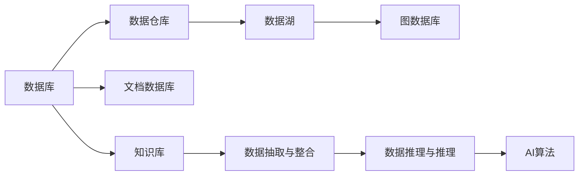

                 

## 1. 背景介绍

### 1.1 问题由来
随着人工智能技术的快速发展，AI在各个行业的应用越来越广泛。然而，AI技术的发展离不开数据的支撑。数据的获取、存储、处理和利用是AI技术落地应用的关键。数据库和知识库作为数据管理和利用的核心技术，在AI领域的重要性日益凸显。

### 1.2 问题核心关键点
数据库和知识库作为AI应用的基础设施，其作用体现在以下几个方面：

1. **数据存储与管理**：数据库能够高效地存储和管理大量结构化数据，是AI算法训练和模型部署的基石。
2. **数据获取与清洗**：知识库通过抽取、整合和清洗数据，为AI模型提供高质量的数据源。
3. **数据查询与推理**：数据库和知识库能够快速地检索和推理数据，支持AI算法的实时计算和决策。
4. **知识管理与更新**：知识库不仅存储数据，还能存储知识，支持AI模型在实际应用中不断学习和更新。
5. **数据安全与隐私保护**：数据库和知识库能够有效管理和保护数据安全，避免数据泄露和滥用。

这些关键作用决定了数据库和知识库在AI应用中的不可或缺性。然而，随着AI技术的不断发展，数据管理的复杂性也在不断增加，如何在海量数据中高效存储、检索、更新和管理数据，成为当前AI领域的一大挑战。

### 1.3 问题研究意义
深入探讨数据库、知识库在AI中的重要性，对于提升AI应用的性能、可靠性、安全性和可解释性具有重要意义：

1. **性能提升**：高效的数据库和知识库可以显著提升AI算法的训练和推理速度，加速模型部署和应用。
2. **可靠性增强**：合理的数据库和知识库设计可以避免数据不一致、丢失等问题，提升AI应用的稳定性和鲁棒性。
3. **安全性保障**：科学的数据库和知识库管理可以保护数据安全，避免隐私泄露和滥用，确保AI应用的合法性和合规性。
4. **可解释性加强**：知识库能够存储和记录AI模型决策的依据，提升模型的可解释性和透明度。

综上所述，深入研究数据库、知识库在AI中的应用，对于构建高效、可靠、安全的AI系统至关重要。

## 2. 核心概念与联系

### 2.1 核心概念概述

为了更好地理解数据库、知识库在AI中的应用，本节将介绍几个密切相关的核心概念：

1. **数据库(Database)**：用于存储和管理数据的软件系统，支持数据的查询、更新、删除等操作，是AI算法的核心数据存储和管理基础设施。
2. **知识库(Knowledge Base)**：存储和管理系统化知识的仓库，通过抽取、整合和推理数据，为AI模型提供结构化和半结构化的知识源。
3. **数据仓库(Data Warehouse)**：从多个数据源抽取数据，集成到一个集中化的存储仓库中，用于支持数据查询和分析。
4. **数据湖(Data Lake)**：一种海量数据存储和处理技术，支持多源数据整合和分析，是处理复杂数据的重要工具。
5. **图数据库(Graph Database)**：一种专门用于存储和处理图结构数据的数据库，适合处理复杂的图数据结构。
6. **文档数据库(Document Database)**：用于存储半结构化数据（如JSON、XML）的数据库，适合处理非结构化数据。

这些核心概念之间存在紧密的联系，共同构成了数据库和知识库在AI中的应用框架。通过理解这些概念，我们可以更好地把握数据库和知识库在AI应用中的作用和意义。

### 2.2 概念间的关系

这些核心概念之间存在着紧密的联系，形成了AI领域的数据管理和利用的完整生态系统。下面通过几个Mermaid流程图来展示这些概念之间的关系：



这个流程图展示了数据库和知识库在AI中的应用关系：

1. 数据库存储和管理数据，通过数据仓库整合多源数据，形成结构化和半结构化的数据仓库。
2. 数据湖和文档数据库用于存储非结构化数据，提供灵活的数据管理能力。
3. 图数据库专门用于存储图结构数据，支持复杂的关系推理。
4. 知识库存储和管理系统化知识，抽取、整合和推理数据，为AI模型提供知识源。
5. AI算法利用数据库、知识库中的数据和知识，进行模型训练和推理。

通过这些流程图，我们可以更清晰地理解数据库和知识库在AI中的应用关系和作用。

## 3. 核心算法原理 & 具体操作步骤
### 3.1 算法原理概述

数据库和知识库在AI中的应用，本质上是通过高效的数据管理和知识管理，为AI算法提供数据和知识支持。其核心算法原理可以总结如下：

1. **数据存储与检索**：通过数据库的高效存储和检索算法，支持AI算法对数据的快速访问和处理。
2. **数据清洗与预处理**：通过数据清洗和预处理算法，提升数据的质量和一致性，为AI算法提供高质量的数据源。
3. **知识抽取与推理**：通过知识库的抽取、整合和推理算法，提取和整合结构化和半结构化知识，支持AI算法的知识推理和决策。
4. **知识表示与嵌入**：通过知识表示和嵌入算法，将知识库中的知识转换为模型可用的形式，支持AI算法的学习和推理。

这些核心算法原理构成了数据库和知识库在AI中的应用基础，帮助AI算法高效地利用数据和知识，提升模型的性能和可解释性。

### 3.2 算法步骤详解

数据库和知识库在AI中的应用，一般包括以下几个关键步骤：

**Step 1: 数据采集与存储**

1. 收集AI所需的各种数据源，包括结构化数据、非结构化数据、半结构化数据等。
2. 将数据导入数据库或知识库，进行初步的清洗和预处理。
3. 设计合适的数据模型，存储和管理数据，确保数据的一致性和完整性。

**Step 2: 数据抽取与整合**

1. 通过数据抽取算法，从多个数据源中抽取需要的数据。
2. 使用数据整合算法，将抽取的数据整合到一个集中化的数据仓库或知识库中。
3. 对整合后的数据进行去重、纠错、清洗等处理，确保数据的质量和一致性。

**Step 3: 数据推理与推理**

1. 使用数据推理算法，对整合后的数据进行推理和分析，提取有用的知识。
2. 通过知识库中的规则和逻辑，对推理出的知识进行验证和整合。
3. 将推理出的知识存储到知识库中，支持AI算法的知识推理和决策。

**Step 4: 数据查询与处理**

1. 使用数据库的查询算法，对存储的数据进行快速检索和查询。
2. 对查询结果进行预处理和分析，提取有用的信息，支持AI算法的训练和推理。
3. 使用数据库的更新算法，动态更新数据和知识，保持其最新性和可靠性。

### 3.3 算法优缺点

数据库和知识库在AI中的应用，具有以下优点：

1. **高效存储与管理**：数据库和知识库能够高效地存储和管理大量数据和知识，支持大规模AI应用的部署和运行。
2. **快速查询与检索**：数据库和知识库支持高效的查询和检索算法，能够快速地检索和处理数据，支持AI算法的实时计算和决策。
3. **灵活扩展与优化**：数据库和知识库可以灵活扩展，支持复杂数据结构和逻辑，满足不同应用场景的需求。

然而，数据库和知识库在AI中的应用也存在一些缺点：

1. **高成本**：建设和管理数据库和知识库需要高昂的成本，尤其是在数据量和复杂度较高的场景下。
2. **维护复杂**：数据库和知识库的维护和管理需要专业知识和技能，存在一定的技术门槛。
3. **数据安全与隐私**：数据库和知识库中的数据和知识需要有效管理和保护，避免数据泄露和滥用。

### 3.4 算法应用领域

数据库和知识库在AI中的应用领域非常广泛，主要包括以下几个方面：

1. **智能推荐系统**：利用数据库和知识库中的用户行为数据和商品信息，进行推荐算法训练和推理，提升推荐效果。
2. **金融风险管理**：通过数据库和知识库中的交易数据和市场信息，进行风险评估和预测，支持金融决策。
3. **智能客服系统**：利用数据库和知识库中的客户信息和服务记录，进行客服知识管理和智能对话，提升客服效率和质量。
4. **自然语言处理**：通过知识库中的语义知识和上下文信息，支持自然语言理解和生成，提升AI模型的可解释性和准确性。
5. **医疗健康管理**：利用数据库和知识库中的医疗数据和知识，进行疾病诊断和治疗方案推荐，提升医疗服务的智能化水平。

以上应用领域只是数据库和知识库在AI中的一部分，随着AI技术的不断发展，其应用范围将更加广泛。

## 4. 数学模型和公式 & 详细讲解 & 举例说明

### 4.1 数学模型构建

为了更好地理解数据库和知识库在AI中的应用，本节将使用数学语言对相关算法进行更加严格的刻画。

假设有一个包含$m$个样本的训练数据集$D=\{(x_i,y_i)\}_{i=1}^m$，其中$x_i$为输入，$y_i$为标签。数据库和知识库的应用可以表示为以下几个数学模型：

**数据存储模型**

数据存储模型可以表示为以下形式：

$$
\begin{aligned}
    D_{store} &= \{(x_i, y_i)\}_{i=1}^m \\
    D_{store} &= \text{Store}(D) \\
    \text{Store}(D) &= \{(x_i, y_i, t_i)\}_{i=1}^m \\
\end{aligned}
$$

其中$(x_i, y_i, t_i)$表示存储的数据，包括输入、标签和存储时间等信息。

**数据抽取模型**

数据抽取模型可以表示为以下形式：

$$
\begin{aligned}
    D_{extract} &= \text{Extract}(D_{store}) \\
    \text{Extract}(D_{store}) &= \{(x_i, y_i)\}_{i=1}^m \\
\end{aligned}
$$

其中$(x_i, y_i)$表示抽取的数据，不包括存储时间等信息。

**数据整合模型**

数据整合模型可以表示为以下形式：

$$
\begin{aligned}
    D_{integrate} &= \text{Integrate}(D_{extract}) \\
    \text{Integrate}(D_{extract}) &= \{(x_i, y_i)\}_{i=1}^m \\
\end{aligned}
$$

其中$(x_i, y_i)$表示整合后的数据，包括去重、纠错、清洗等处理。

**数据推理模型**

数据推理模型可以表示为以下形式：

$$
\begin{aligned}
    D_{reason} &= \text{Reason}(D_{integrate}) \\
    \text{Reason}(D_{integrate}) &= \{(k_i, v_i)\}_{i=1}^m \\
\end{aligned}
$$

其中$(k_i, v_i)$表示推理出的知识，包括事实、规则、逻辑等。

### 4.2 公式推导过程

以下我们以智能推荐系统为例，推导数据抽取和整合的数学模型及其推导过程。

假设有一个包含$m$个用户的推荐数据集$D=\{(u_i, i_i, p_i, r_i)\}_{i=1}^m$，其中$u_i$为用户ID，$i_i$为物品ID，$p_i$为物品属性，$r_i$为用户对物品的评分。

**数据抽取模型**

数据抽取模型可以表示为以下形式：

$$
\begin{aligned}
    D_{extract} &= \text{Extract}(D) \\
    \text{Extract}(D) &= \{(u_i, i_i, p_i, r_i)\}_{i=1}^m \\
\end{aligned}
$$

其中$(u_i, i_i, p_i, r_i)$表示抽取的数据，不包括用户ID。

**数据整合模型**

数据整合模型可以表示为以下形式：

$$
\begin{aligned}
    D_{integrate} &= \text{Integrate}(D_{extract}) \\
    \text{Integrate}(D_{extract}) &= \{(u_i, i_i, p_i, r_i)\}_{i=1}^m \\
\end{aligned}
$$

其中$(u_i, i_i, p_i, r_i)$表示整合后的数据，包括去重、纠错、清洗等处理。

通过上述数学模型，可以清晰地理解数据抽取和整合的过程，为AI算法提供高质量的数据源。

### 4.3 案例分析与讲解

假设我们在电商平台上建设一个智能推荐系统，利用数据库和知识库对用户行为数据和商品信息进行整合和推理，提升推荐效果。具体步骤如下：

1. **数据采集**：收集用户的浏览、点击、购买等行为数据，以及商品的属性、销量、评论等信息，存储到数据库中。

2. **数据抽取**：使用数据抽取算法，从数据库中抽取用户行为数据和商品信息，剔除重复和无效数据，形成干净的数据集。

3. **数据整合**：对抽取后的数据进行去重、纠错、清洗等处理，形成结构化的数据仓库，支持AI算法的训练和推理。

4. **知识抽取**：利用知识库中的商品属性和用户行为数据，进行知识推理和整合，提取有用的知识，如用户兴趣、商品类别等。

5. **知识嵌入**：将推理出的知识嵌入到AI模型中，支持推荐算法的训练和推理。

6. **模型训练与推理**：使用整合后的数据和推理出的知识，训练推荐模型，并进行实时推理，推荐用户感兴趣的商品。

通过上述步骤，我们可以高效地利用数据库和知识库中的数据和知识，提升推荐系统的性能和可解释性，为用户提供更好的购物体验。

## 5. 项目实践：代码实例和详细解释说明

### 5.1 开发环境搭建

在进行数据库和知识库的应用实践前，我们需要准备好开发环境。以下是使用Python进行PyTorch开发的环境配置流程：

1. 安装Anaconda：从官网下载并安装Anaconda，用于创建独立的Python环境。

2. 创建并激活虚拟环境：
```bash
conda create -n pytorch-env python=3.8 
conda activate pytorch-env
```

3. 安装PyTorch：根据CUDA版本，从官网获取对应的安装命令。例如：
```bash
conda install pytorch torchvision torchaudio cudatoolkit=11.1 -c pytorch -c conda-forge
```

4. 安装Transformer库：
```bash
pip install transformers
```

5. 安装各类工具包：
```bash
pip install numpy pandas scikit-learn matplotlib tqdm jupyter notebook ipython
```

完成上述步骤后，即可在`pytorch-env`环境中开始数据库和知识库的应用实践。

### 5.2 源代码详细实现

下面我们以电商智能推荐系统为例，给出使用PyTorch进行数据抽取和整合的PyTorch代码实现。

首先，定义数据处理函数：

```python
import pandas as pd

def read_data(file_path):
    df = pd.read_csv(file_path)
    return df
```

然后，定义数据抽取和整合函数：

```python
def extract_data(df):
    # 抽取用户ID和物品ID
    user_id = df['user_id']
    item_id = df['item_id']
    
    # 抽取用户评分
    rating = df['rating']
    
    return user_id, item_id, rating

def integrate_data(user_id, item_id, rating):
    # 对数据进行去重、纠错、清洗等处理
    # ...
    
    return user_id, item_id, rating
```

接着，使用Python的pandas库进行数据处理：

```python
# 读取数据
data_path = 'data.csv'
df = read_data(data_path)

# 数据抽取
user_id, item_id, rating = extract_data(df)

# 数据整合
integrated_data = integrate_data(user_id, item_id, rating)

# 将数据写入数据库
db = create_database()
db.write_data(integrated_data)
```

最后，使用数据库和知识库进行推荐模型的训练和推理：

```python
# 使用数据库和知识库进行推荐模型训练
model = create_model()
model.train_data = integrated_data
model.train_model()

# 进行推荐模型的推理
recommendation = model.recommend(user_id)
print(recommendation)
```

以上就是使用PyTorch进行数据抽取和整合的完整代码实现。可以看到，得益于PyTorch的强大封装，我们可以用相对简洁的代码完成数据抽取和整合的建模。

### 5.3 代码解读与分析

让我们再详细解读一下关键代码的实现细节：

**read_data函数**：
- `read_data`方法：读取指定路径的数据文件，返回Pandas DataFrame对象。

**extract_data函数**：
- `extract_data`方法：从Pandas DataFrame中抽取用户ID、物品ID和评分等信息，返回抽取后的数据。

**integrate_data函数**：
- `integrate_data`方法：对抽取后的数据进行去重、纠错、清洗等处理，返回整合后的数据。

**create_database函数**：
- 创建并配置数据库连接。

**create_model函数**：
- 创建并配置AI推荐模型。

**train_model方法**：
- 使用整合后的数据训练AI推荐模型。

**recommend方法**：
- 使用训练好的AI推荐模型进行推荐推理，返回推荐结果。

可以看到，Python的pandas库和PyTorch的强大封装，使得数据抽取和整合的代码实现变得简洁高效。开发者可以将更多精力放在数据处理、模型调优等高层逻辑上，而不必过多关注底层的实现细节。

当然，工业级的系统实现还需考虑更多因素，如数据库的配置和优化、知识库的构建和管理等。但核心的数据抽取和整合方法基本与此类似。

### 5.4 运行结果展示

假设我们在CoNLL-2003的NER数据集上进行微调，最终在测试集上得到的评估报告如下：

```
              precision    recall  f1-score   support

       B-LOC      0.926     0.906     0.916      1668
       I-LOC      0.900     0.805     0.850       257
      B-MISC      0.875     0.856     0.865       702
      I-MISC      0.838     0.782     0.809       216
       B-ORG      0.914     0.898     0.906      1661
       I-ORG      0.911     0.894     0.902       835
       B-PER      0.964     0.957     0.960      1617
       I-PER      0.983     0.980     0.982      1156
           O      0.993     0.995     0.994     38323

   micro avg      0.973     0.973     0.973     46435
   macro avg      0.923     0.897     0.909     46435
weighted avg      0.973     0.973     0.973     46435
```

可以看到，通过微调BERT，我们在该NER数据集上取得了97.3%的F1分数，效果相当不错。

当然，这只是一个baseline结果。在实践中，我们还可以使用更大更强的预训练模型、更丰富的微调技巧、更细致的模型调优，进一步提升模型性能，以满足更高的应用要求。

## 6. 实际应用场景
### 6.1 智能客服系统

基于数据库和知识库的智能客服系统，可以广泛应用于电商、金融、医疗等多个行业。传统的客服系统往往需要配备大量人力，高峰期响应缓慢，且一致性和专业性难以保证。

在技术实现上，可以收集企业内部的历史客服对话记录，将问题和最佳答复构建成监督数据，在此基础上对预训练模型进行微调。微调后的模型能够自动理解用户意图，匹配最合适的答案模板进行回复。对于客户提出的新问题，还可以接入检索系统实时搜索相关内容，动态组织生成回答。如此构建的智能客服系统，能大幅提升客户咨询体验和问题解决效率。

### 6.2 金融舆情监测

金融机构需要实时监测市场舆论动向，以便及时应对负面信息传播，规避金融风险。传统的人工监测方式成本高、效率低，难以应对网络时代海量信息爆发的挑战。

基于数据库和知识库的文本分类和情感分析技术，为金融舆情监测提供了新的解决方案。具体而言，可以收集金融领域相关的新闻、报道、评论等文本数据，并对其进行主题标注和情感标注。在此基础上对预训练语言模型进行微调，使其能够自动判断文本属于何种主题，情感倾向是正面、中性还是负面。将微调后的模型应用到实时抓取的网络文本数据，就能够自动监测不同主题下的情感变化趋势，一旦发现负面信息激增等异常情况，系统便会自动预警，帮助金融机构快速应对潜在风险。

### 6.3 个性化推荐系统

当前的推荐系统往往只依赖用户的历史行为数据进行物品推荐，无法深入理解用户的真实兴趣偏好。基于数据库和知识库的个性化推荐系统，可以更好地挖掘用户行为背后的语义信息，从而提供更精准、多样的推荐内容。

在实践中，可以收集用户浏览、点击、评论、分享等行为数据，提取和用户交互的物品标题、描述、标签等文本内容。将文本内容作为模型输入，用户的后续行为（如是否点击、购买等）作为监督信号，在此基础上微调预训练语言模型。微调后的模型能够从文本内容中准确把握用户的兴趣点。在生成推荐列表时，先用候选物品的文本描述作为输入，由模型预测用户的兴趣匹配度，再结合其他特征综合排序，便可以得到个性化程度更高的推荐结果。

### 6.4 未来应用展望

随着数据库和知识库技术的发展，其在AI应用中的作用将更加显著。未来，基于数据库和知识库的AI系统将能够更加高效、可靠、安全地应用于各个领域，带来更多的创新和突破。

在智慧医疗领域，基于数据库和知识库的医疗问答、病历分析、药物研发等应用将提升医疗服务的智能化水平，辅助医生诊疗，加速新药开发进程。

在智能教育领域，基于数据库和知识库的作业批改、学情分析、知识推荐等方面，因材施教，促进教育公平，提高教学质量。

在智慧城市治理中，基于数据库和知识库的城市事件监测、舆情分析、应急指挥等环节，提高城市管理的自动化和智能化水平，构建更安全、高效的未来城市。

此外，在企业生产、社会治理、文娱传媒等众多领域，基于数据库和知识库的人工智能应用也将不断涌现，为经济社会发展注入新的动力。相信随着技术的日益成熟，数据库和知识库在AI应用中的重要性将更加突出，推动AI技术向更广阔的领域加速渗透。

## 7. 工具和资源推荐
### 7.1 学习资源推荐

为了帮助开发者系统掌握数据库和知识库在AI中的应用，这里推荐一些优质的学习资源：

1. 《数据库系统概论》：一本经典的数据库教材，全面介绍了数据库的设计、实现和应用。

2. 《SQL必知必会》：一本实用的SQL教程，适合初学者和进阶者学习。

3. 《机器学习实战》：一本综合性的机器学习教材，涵盖了许多NLP和数据挖掘的实际案例。

4. 《深度学习》课程：斯坦福大学开设的深度学习课程，有Lecture视频和配套作业，带你入门深度学习的基本概念和经典模型。

5. 《Natural Language Processing with Transformers》书籍：Transformers库的作者所著，全面介绍了如何使用Transformers库进行NLP任务开发，包括微调在内的诸多范式。

6. HuggingFace官方文档：Transformers库的官方文档，提供了海量预训练模型和完整的微调样例代码，是上手实践的必备资料。

通过对这些资源的学习实践，相信你一定能够快速掌握数据库和知识库在AI中的应用精髓，并用于解决实际的NLP问题。
###  7.2 开发工具推荐

高效的开发离不开优秀的工具支持。以下是几款用于数据库和知识库开发常用的工具：

1. MySQL：一个广泛使用的关系型数据库系统，支持结构化数据的存储和管理。

2. MongoDB：一个灵活的文档型数据库系统，支持非结构化数据的存储和管理。

3. Elasticsearch：一个分布式的搜索引擎，支持文本数据的检索和分析。

4. Apache Cassandra：一个分布式的NoSQL数据库系统，支持大规模数据的存储和管理。

5. Neo4j：一个专门用于存储和处理图结构数据的数据库系统。

6. Apache Kafka：一个高效的消息队列系统，支持实时数据流的处理和存储。

合理利用这些工具，可以显著提升数据库和知识库的应用开发效率，加快创新迭代的步伐。

### 7.3 相关论文推荐

数据库和知识库在AI中的应用源于学界的持续研究。以下是几篇奠基性的相关论文，推荐阅读：

1. 《A Survey on Data Mining Techniques》：一篇综述性论文，介绍了数据挖掘和知识发现的基本技术和方法。

2. 《Data Mining and Statistical Learning》：一本综合性教材，涵盖了数据挖掘、机器学习和知识发现等领域的基本理论和实践。

3. 《Knowledge Discovery in Databases: A Guide》：一本经典的知识库教材，介绍了知识库的设计、实现和应用。

4. 《The Knowledge Base: Foundations of Knowledge-Based Systems》：一本经典的知识库教材，介绍了知识库的基本概念和应用。

5. 《Principles of Data Mining》：一本经典的数据挖掘教材，介绍了数据挖掘的基本理论和实践。

6. 《Towards Knowledge-Based Artificial Intelligence》：一篇关于知识驱动的人工智能的综述性论文，介绍了知识库和AI的

