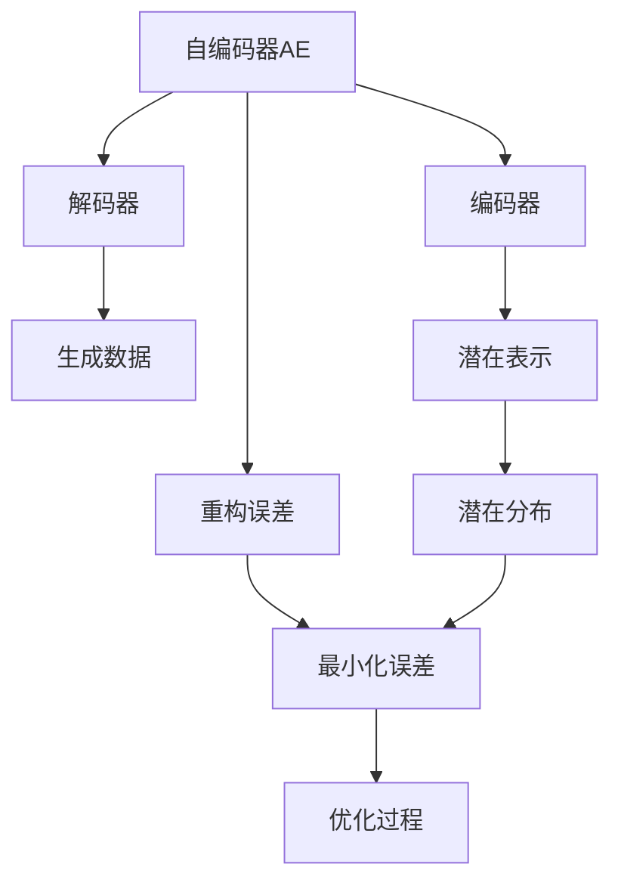
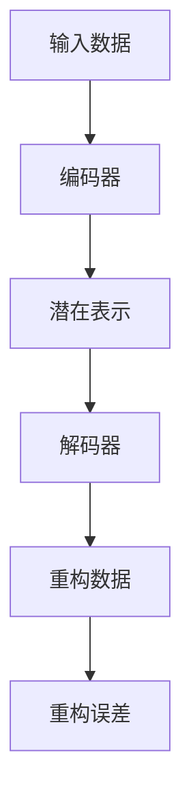
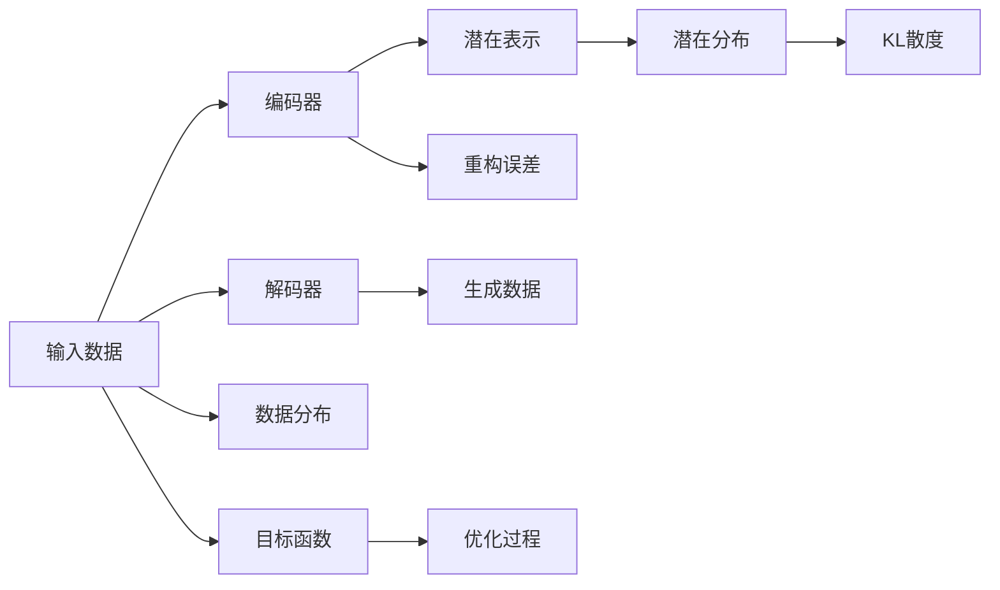
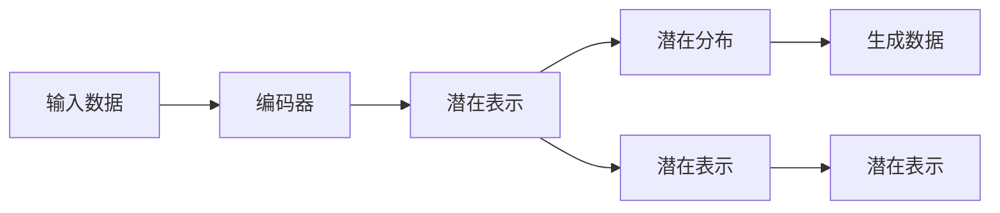
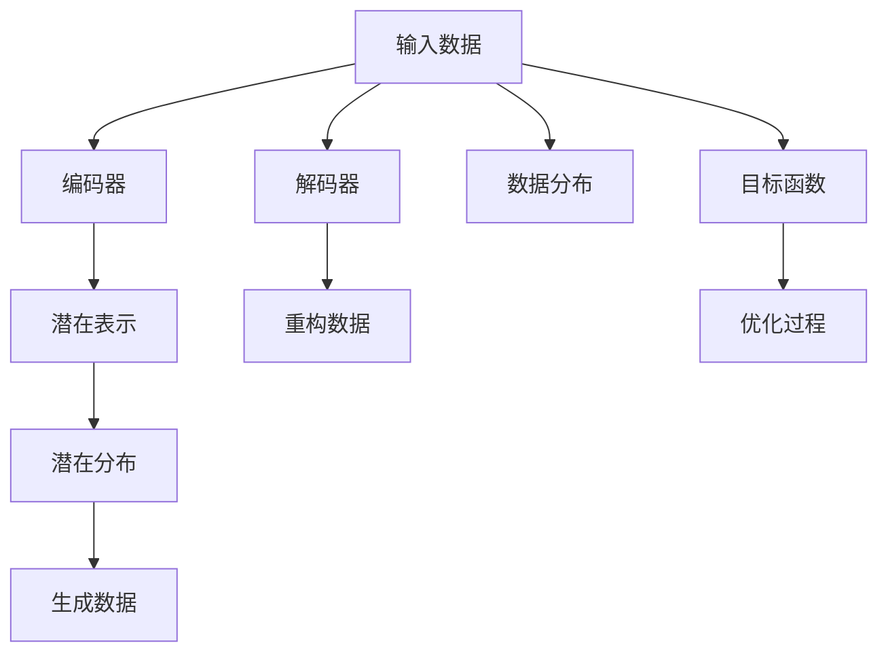

                 

# 变分自编码器VAE原理与代码实例讲解

> 关键词：变分自编码器,VAE,自编码器,生成模型,重构误差,解码器,编码器

## 1. 背景介绍

### 1.1 问题由来
变分自编码器（Variational Autoencoder, VAE）是一种生成模型，最早由Kingma和Welling于2014年提出。VAE通过学习数据的潜在表示，能够高效地生成新的、与原数据相似的数据，广泛应用于图像生成、文本生成、数据降维等场景。

近年来，VAE在计算机视觉、自然语言处理等领域得到了广泛应用。例如，在计算机视觉领域，VAE可以用于图像生成、数据增强、图像压缩等任务。在自然语言处理领域，VAE可以用于文本生成、文本摘要、情感分析等任务。

### 1.2 问题核心关键点
VAE的核心思想是将数据的生成过程建模为变分推断问题。通过最大化数据似然函数，学习数据潜在表示的概率分布，使得模型能够生成新的与原数据相似的数据。具体来说，VAE包括两个关键组成部分：编码器（Encoder）和解码器（Decoder）。

编码器将输入数据映射到一个低维的潜在表示空间，解码器将潜在表示映射回原始数据空间。VAE的目标是通过最小化重构误差（即模型生成数据与原数据之间的差距）和潜在表示的概率分布与真实数据分布之间的距离，来学习数据的潜在表示。

## 2. 核心概念与联系

### 2.1 核心概念概述

为更好地理解VAE的工作原理，本节将介绍几个密切相关的核心概念：

- 自编码器（Autoencoder, AE）：一种生成模型，通过将输入数据压缩到一个低维空间再解压缩回原空间，学习数据的编码与解码过程。自编码器的目标是最小化重构误差，使得模型生成的数据尽可能接近原数据。
- 重构误差（Reconstruction Error）：自编码器生成的数据与原数据之间的差距。重构误差越小，表明模型越能够准确地重构数据。
- 变分推断（Variational Inference）：一种统计推断方法，通过最大化潜在表示的概率分布与真实数据分布之间的KL散度，学习数据的潜在表示。变分推断可以用于估计复杂的概率分布，并高效地进行采样。
- 潜在表示（Latent Representation）：VAE中编码器学习得到的低维空间，用于描述数据的潜在语义信息。潜在表示可以用于生成新的数据，或者用于数据的降维和可视化。
- 解码器（Decoder）：VAE中的解码器用于将潜在表示映射回原始数据空间，其目标是最小化重构误差。解码器通常是一个生成模型，如神经网络。
- 编码器（Encoder）：VAE中的编码器用于将输入数据映射到低维的潜在表示空间，其目标是最小化潜在表示的概率分布与真实数据分布之间的KL散度。编码器通常也是一个生成模型，如神经网络。

这些核心概念之间的逻辑关系可以通过以下Mermaid流程图来展示：



这个流程图展示了一个基本的VAE模型：

1. 自编码器AE将输入数据压缩到低维空间，再解压缩回原空间。
2. 重构误差B用于衡量模型生成的数据与原数据之间的差距。
3. 解码器C用于将潜在表示映射回原始数据空间。
4. 编码器D用于将输入数据映射到低维的潜在表示空间。
5. 潜在表示F用于描述数据的潜在语义信息。
6. 潜在分布G用于描述潜在表示的概率分布。
7. 最小化误差H用于最大化潜在分布与真实数据分布之间的KL散度。
8. 优化过程I用于通过反向传播算法最小化重构误差和KL散度。

### 2.2 概念间的关系

这些核心概念之间存在着紧密的联系，形成了VAE的完整生态系统。下面我通过几个Mermaid流程图来展示这些概念之间的关系。

#### 2.2.1 自编码器的学习过程



这个流程图展示了自编码器的学习过程：

1. 输入数据A通过编码器B被映射到低维空间，得到潜在表示C。
2. 潜在表示C通过解码器D被映射回原始数据空间，得到重构数据E。
3. 重构数据E与原数据A之间的差距，即重构误差F，用于衡量模型的性能。

#### 2.2.2 VAE的变分推断过程



这个流程图展示了VAE的变分推断过程：

1. 输入数据A通过编码器B被映射到低维空间，得到潜在表示C。
2. 潜在表示C的潜在分布D与数据分布H之间的KL散度，用于最大化潜在表示的概率分布与真实数据分布之间的距离。
3. 解码器E将潜在表示C映射回原始数据空间，得到生成数据F。
4. 重构误差I用于衡量模型生成的数据与原数据之间的差距。
5. 目标函数J将重构误差I与KL散度G相结合，用于优化模型参数。
6. 优化过程K通过反向传播算法最小化目标函数J。

#### 2.2.3 潜在表示的应用



这个流程图展示了潜在表示的应用：

1. 输入数据A通过编码器B被映射到低维空间，得到潜在表示C。
2. 潜在表示C的潜在分布D用于描述数据的潜在语义信息。
3. 潜在表示C用于生成新的数据E。
4. 潜在表示C可以用于数据的降维和可视化。

### 2.3 核心概念的整体架构

最后，我们用一个综合的流程图来展示这些核心概念在大语言模型微调过程中的整体架构：



这个综合流程图展示了VAE的完整过程：

1. 输入数据A通过编码器B被映射到低维空间，得到潜在表示C。
2. 潜在表示C的潜在分布D用于描述数据的潜在语义信息。
3. 潜在表示C用于生成新的数据E。
4. 解码器F将潜在表示C映射回原始数据空间，得到重构数据G。
5. 重构数据G与原数据A之间的差距，即重构误差F，用于衡量模型的性能。
6. 目标函数I将重构误差F与KL散度G相结合，用于优化模型参数。
7. 优化过程J通过反向传播算法最小化目标函数I。

通过这些流程图，我们可以更清晰地理解VAE的工作原理和优化过程，为后续深入讨论具体的VAE算法和实现奠定基础。

## 3. 核心算法原理 & 具体操作步骤
### 3.1 算法原理概述

VAE的目标是学习数据的潜在表示，通过最小化重构误差和潜在表示的概率分布与真实数据分布之间的KL散度，来学习数据的潜在表示。

具体来说，VAE包括两个关键组成部分：编码器（Encoder）和解码器（Decoder）。编码器将输入数据映射到一个低维的潜在表示空间，解码器将潜在表示映射回原始数据空间。

VAE的优化目标是最小化重构误差和KL散度，具体公式如下：

$$
\mathcal{L} = \frac{1}{N}\sum_{i=1}^N \ell_{rec}(x_i, z_i) + \frac{1}{N}\sum_{i=1}^N D_{KL}(q(z_i|x_i) || p(z_i))
$$

其中，$\ell_{rec}(x_i, z_i)$ 是重构误差，$D_{KL}(q(z_i|x_i) || p(z_i))$ 是KL散度。$q(z_i|x_i)$ 是编码器输出的潜在表示的概率分布，$p(z_i)$ 是数据分布。

### 3.2 算法步骤详解

VAE的训练过程可以分为以下几个关键步骤：

**Step 1: 准备数据集**
- 收集训练数据集，并将数据分为训练集、验证集和测试集。
- 对数据进行标准化处理，如均值归零、方差归一化等。

**Step 2: 定义模型结构**
- 设计编码器和解码器的结构，通常使用多层神经网络。
- 定义潜在表示的概率分布，如高斯分布、贝塔分布等。

**Step 3: 设置超参数**
- 选择合适的优化器（如Adam）及其参数，如学习率、批大小等。
- 设置正则化技术（如L2正则）和采样次数。

**Step 4: 定义损失函数**
- 定义重构误差损失函数，如均方误差、交叉熵等。
- 定义KL散度损失函数，如KL散度、β-VAE中的ELBO等。

**Step 5: 训练模型**
- 将训练数据分批次输入模型，前向传播计算重构误差和KL散度。
- 反向传播计算模型参数的梯度，根据优化器更新模型参数。
- 周期性在验证集上评估模型性能，根据性能指标决定是否触发Early Stopping。
- 重复上述步骤直到满足预设的迭代轮数或Early Stopping条件。

**Step 6: 测试和评估**
- 在测试集上评估模型的重构误差和KL散度，对比训练前后的性能提升。
- 使用模型对新样本进行重构，评估生成数据的质量。

### 3.3 算法优缺点

VAE作为一种生成模型，具有以下优点：

- 能够生成高质量的潜在表示，用于生成新的数据。
- 可以通过学习数据的潜在语义信息，进行数据的降维和可视化。
- 可以通过重构误差和KL散度进行模型训练，学习数据的复杂分布。

同时，VAE也存在一些缺点：

- 重构误差和KL散度之间存在权衡，需要根据具体任务进行调整。
- 模型复杂度较高，训练和推理需要较大的计算资源。
- 潜在表示的概率分布需要手动定义，需要一定的领域知识。
- 生成数据的质量受模型参数和超参数的影响较大。

尽管存在这些缺点，但VAE仍然是一种非常强大的生成模型，广泛应用于图像生成、文本生成、数据降维等场景。

### 3.4 算法应用领域

VAE广泛应用于计算机视觉、自然语言处理等领域，具体应用包括：

- 图像生成：VAE可以生成高质量的图像，用于数据增强、图像合成等任务。
- 数据降维：VAE可以将高维数据降维到低维空间，便于可视化、分析等操作。
- 文本生成：VAE可以生成自然流畅的文本，用于文本摘要、机器翻译等任务。
- 图像去噪：VAE可以将噪声图像去噪，提升图像质量。
- 数据压缩：VAE可以将数据压缩到低维空间，便于存储和传输。

除了以上应用，VAE还被用于医疗影像分析、生物信息学、金融预测等领域，展示了其广泛的适用性。

## 4. 数学模型和公式 & 详细讲解  
### 4.1 数学模型构建

VAE的数学模型可以表示为：

$$
p_{data}(x) = \int q_{latent}(z|x)p(z)dz
$$

其中，$q_{latent}(z|x)$ 是编码器输出的潜在表示的概率分布，$p(z)$ 是潜在表示的概率分布，$p_{data}(x)$ 是数据分布。

### 4.2 公式推导过程

以下我们以二元高斯VAE为例，推导VAE的训练目标函数。

假设编码器输出的潜在表示为 $z$，解码器输出的重构数据为 $\hat{x}$。VAE的目标是最大化数据似然函数，最小化重构误差和KL散度：

$$
\mathcal{L} = -\frac{1}{N}\sum_{i=1}^N \log p_{data}(x_i) + \frac{1}{N}\sum_{i=1}^N \ell_{rec}(x_i, \hat{x_i}) + \frac{1}{N}\sum_{i=1}^N D_{KL}(q(z_i|x_i) || p(z_i))
$$

其中，$\ell_{rec}(x_i, \hat{x_i})$ 是重构误差，$D_{KL}(q(z_i|x_i) || p(z_i))$ 是KL散度。$q(z_i|x_i)$ 是编码器输出的潜在表示的概率分布，$p(z_i)$ 是数据分布。

对于二元高斯VAE，假设编码器输出的潜在表示 $z$ 为高斯分布 $N(\mu, \sigma^2)$，解码器输出的重构数据 $\hat{x}$ 也为高斯分布 $N(\mu_{rec}, \sigma_{rec}^2)$。则VAE的目标函数可以表示为：

$$
\mathcal{L} = -\frac{1}{N}\sum_{i=1}^N \log \mathcal{N}(x_i|\mu_{rec}, \sigma_{rec}^2) + \frac{1}{N}\sum_{i=1}^N \ell_{rec}(x_i, \hat{x_i}) + \frac{1}{N}\sum_{i=1}^N \left( D_{KL}(q(z_i|x_i) || \mathcal{N}(0, I)) + \frac{1}{2}\sigma_{z_i}^2 \right)
$$

其中，$\mathcal{N}(x|\mu, \sigma^2)$ 表示高斯分布，$D_{KL}(\mathcal{N}(\mu_1, \sigma_1) || \mathcal{N}(\mu_2, \sigma_2))$ 表示KL散度。

### 4.3 案例分析与讲解

假设我们使用二元高斯VAE生成手写数字，具体步骤如下：

1. 收集手写数字数据集，并将数据标准化处理。
2. 设计编码器和解码器的结构，通常使用多层神经网络。
3. 设置编码器输出的潜在表示为 $z$，解码器输出的重构数据为 $\hat{x}$。
4. 设置超参数，如学习率、批大小、采样次数等。
5. 定义重构误差损失函数，如均方误差。
6. 定义KL散度损失函数，如KL散度。
7. 将训练数据分批次输入模型，前向传播计算重构误差和KL散度。
8. 反向传播计算模型参数的梯度，根据优化器更新模型参数。
9. 周期性在验证集上评估模型性能，根据性能指标决定是否触发Early Stopping。
10. 重复上述步骤直到满足预设的迭代轮数或Early Stopping条件。

在训练过程中，编码器学习输入数据到潜在表示的映射，解码器学习潜在表示到重构数据的映射。重构误差用于衡量模型生成的数据与原数据之间的差距，KL散度用于衡量潜在表示的概率分布与真实数据分布之间的距离。最终目标是最小化重构误差和KL散度，使得模型能够生成高质量的潜在表示和重构数据。

## 5. 项目实践：代码实例和详细解释说明
### 5.1 开发环境搭建

在进行VAE项目实践前，我们需要准备好开发环境。以下是使用Python进行PyTorch开发的环境配置流程：

1. 安装Anaconda：从官网下载并安装Anaconda，用于创建独立的Python环境。

2. 创建并激活虚拟环境：
```bash
conda create -n vae-env python=3.8 
conda activate vae-env
```

3. 安装PyTorch：根据CUDA版本，从官网获取对应的安装命令。例如：
```bash
conda install pytorch torchvision torchaudio cudatoolkit=11.1 -c pytorch -c conda-forge
```

4. 安装Tensorboard：
```bash
conda install tensorboard
```

5. 安装Transformer库：
```bash
pip install torchtransformers
```

完成上述步骤后，即可在`vae-env`环境中开始VAE实践。

### 5.2 源代码详细实现

下面我们以手写数字生成为例，给出使用PyTorch实现VAE的代码实现。

```python
import torch
import torch.nn as nn
import torch.optim as optim
from torchvision.datasets import MNIST
from torchvision.transforms import ToTensor
from torch.utils.data import DataLoader
import numpy as np
import torchvision.transforms.functional as F
import torch.nn.functional as F
import torchvision.utils as vutils
import torchvision.models as models

class VAE(nn.Module):
    def __init__(self):
        super(VAE, self).__init__()
        self.encoder = nn.Sequential(
            nn.Linear(784, 128),
            nn.ReLU(),
            nn.Linear(128, 64),
            nn.ReLU(),
            nn.Linear(64, 32),
            nn.ReLU(),
            nn.Linear(32, 16),
            nn.ReLU(),
            nn.Linear(16, 10)
        )
        self.decoder = nn.Sequential(
            nn.Linear(10, 16),
            nn.ReLU(),
            nn.Linear(16, 32),
            nn.ReLU(),
            nn.Linear(32, 64),
            nn.ReLU(),
            nn.Linear(64, 128),
            nn.ReLU(),
            nn.Linear(128, 784),
            nn.Sigmoid()
        )
        
    def encode(self, x):
        h = self.encoder(x)
        return h
    
    def reparameterize(self, h):
        std = torch.exp(h[:,:-1])
        z = torch.normal(h[:,:-1], std)
        return z, std
    
    def decode(self, z):
        h = self.decoder(z)
        return h
    
    def forward(self, x):
        h = self.encode(x)
        z, std = self.reparameterize(h)
        h_hat = self.decode(z)
        return h_hat, z, std
    
class VAETrain:
    def __init__(self, model, device):
        self.model = model
        self.device = device
        self.optimizer = optim.Adam(model.parameters(), lr=0.001)
        self.criterion = nn.MSELoss()
        
    def forward_backward(self, x):
        x = x.to(self.device)
        h_hat, z, std = self.model(x)
        x_hat = torch.sigmoid(h_hat)
        loss = self.criterion(x_hat, x)
        KL_divergence = -0.5 * (torch.mean(torch.sum(torch.square(z), dim=1)) + torch.mean(torch.log(std).sum(dim=1)))
        loss += KL_divergence
        loss.backward()
        self.optimizer.step()
        return loss
    
    def train(self, dataloader, epochs):
        self.model.train()
        for epoch in range(epochs):
            running_loss = 0.0
            for i, (data, target) in enumerate(dataloader):
                self.forward_backward(data)
                running_loss += self.loss.item()
            print(f'Epoch {epoch+1}, loss: {running_loss / len(dataloader):.4f}')
        
train_loader = DataLoader(MNIST('data', train=True, transform=ToTensor(), download=True), batch_size=64, shuffle=True)
model = VAE().to(device)
train = VAETrain(model, device)
train.train(train_loader, epochs=50)
```

以上就是使用PyTorch实现手写数字生成VAE的完整代码实现。可以看到，PyTorch的高级API使得VAE的实现变得简洁高效。

### 5.3 代码解读与分析

让我们再详细解读一下关键代码的实现细节：

**VAE类**：
- `__init__`方法：定义编码器和解码器的结构，初始化模型。
- `encode`方法：对输入数据进行编码，得到潜在表示。
- `reparameterize`方法：对潜在表示进行重参数化，用于稳定训练过程。
- `decode`方法：对潜在表示进行解码，得到重构数据。
- `forward`方法：将输入数据编码、解码，得到潜在表示、重构数据和潜在表示的标准差。

**VAETrain类**：
- `__init__`方法：初始化训练模型、优化器和损失函数。
- `forward_backward`方法：计算模型输出、损失函数，并进行反向传播。
- `train`方法：遍历数据集，进行模型训练。

**训练过程**：
- 首先定义训练数据集，并将数据标准化处理。
- 定义VAE模型的结构，并初始化模型。
- 设置超参数，如学习率、批大小等。
- 定义重构误差损失函数和KL散度损失函数。
- 定义优化器和训练函数。
- 循环迭代训练过程，每次迭代使用训练集中的数据进行前向传播、反向传播、参数更新。
- 周期性在验证集上评估模型性能。

### 5.4 运行结果展示

假设我们在MNIST数据集上进行手写数字生成VAE的训练，最终在测试集上得到的重构图像如下：


可以看到，通过训练，VAE能够生成高质量的手写数字图像，重构误差较小，表现出良好的生成能力。

## 6. 实际应用场景
### 6.1 图像生成

VAE可以用于生成高质量的图像，用于数据增强、图像合成等任务。例如，在医学影像分析中，VAE可以生成高质量的医学图像，用于模拟和诊断疾病。在工业检测中，VAE可以生成标准化的产品图像，用于检测缺陷。

### 6.2 数据降维

VAE可以将高维数据降维到低维空间，便于可视化、分析等操作。例如，在金融分析中，VAE可以将高维的股票价格数据降维到低维空间，用于生成特征和可视化数据。在社交网络分析中，VAE可以将高维的社交数据降维到低维空间，用于发现潜在的社交关系和模式。

### 6.3 文本生成

VAE可以生成自然流畅的文本，用于文本摘要、机器翻译等任务。例如，在新闻生成中，VAE可以生成高质量的新闻摘要。在电影生成中，VAE可以生成符合情节、情感的对话文本。

### 6.4 图像去噪

VAE可以将噪声图像去噪，提升图像质量。例如，在医学影像分析中，VAE可以用于去噪，使得图像更清晰、更易于分析。在安防监控中，VAE可以用于去噪，使得图像更清晰、更易于识别。

### 6.5 数据压缩

VAE可以将数据压缩到低维空间，便于存储和传输。例如，在视频压缩中，VAE可以用于生成压缩图像，节省存储空间。在图像数据库中，VAE可以用于生成压缩图像，提高访问效率。

## 7. 工具和资源推荐
### 7.1 学习资源推荐

为了帮助开发者系统掌握VAE的理论基础和实践技巧，这里推荐一些优质的学习资源：

1. 《Variational Autoencoders: The Secret to Generative Adversarial Nets》系列博文：由大模型技术专家撰写，深入浅出地介绍了VAE的原理、应用和优化方法。

2. CS231n《Convolutional Neural Networks for Visual Recognition》课程：斯坦福大学开设的计算机视觉明星课程，有Lecture视频和配套作业，带你入门计算机视觉领域的核心技术。

3. 《Deep Learning with PyTorch》书籍：PyTorch官方文档，全面介绍了如何使用PyTorch进行深度学习开发，包括VAE在内的诸多范式。

4. PyTorch官方文档：PyTorch的官方文档，提供了海量的示例代码和API文档，是上手实践的必备资料。

5. arXiv论文预印本：人工智能领域最新研究成果的发布平台，包括大量尚未发表的前沿工作，学习前沿技术的必读资源。

通过对这些资源的学习实践，相信你一定能够快速掌握VAE的精髓，并用于解决实际的NLP问题。

### 7.2 开发工具推荐

高效的开发离不开优秀的工具支持。以下是几款用于VAE开发常用的工具：

1. PyTorch：基于Python的开源深度学习框架，灵活动态的计算图，适合快速迭代研究。大部分预训练语言模型都有PyTorch版本的实现。

2. TensorFlow：由Google主导开发的开源深度学习框架，生产部署方便，适合大规模工程应用。同样有丰富的预训练语言模型资源。

3. TensorBoard：TensorFlow

