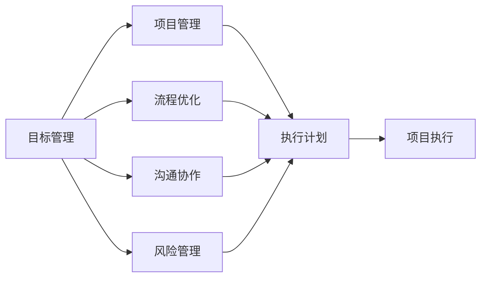
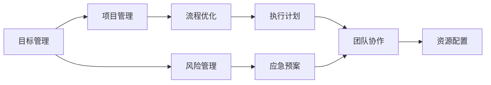

                 

# 执行力：拉开人与人差距的关键

在快速变化和竞争激烈的现代职场，执行力往往成为决定个人和团队成功的关键因素。本文将深入探讨执行力这一核心概念，揭示其背后的原理与关键实践，帮助读者提升自身和团队执行力，在职业生涯中不断超越自我。

## 1. 背景介绍

### 1.1 问题由来
执行力（Execution），通常指将思想转化为行动并达成预期目标的能力。在项目管理、个人发展和企业管理中，执行力被广泛认为是最为关键的能力之一。它不仅影响着团队的生产力和效率，更直接影响着企业的创新能力和竞争力。

随着信息技术的发展，数字化转型和智能化办公逐渐成为企业发展的趋势。然而，数字化并非一蹴而就的过程，它需要强大的执行力作为支撑。如何在数字化浪潮中保持高执行力，提升团队的整体竞争力，成为众多管理者面临的挑战。

### 1.2 问题核心关键点
执行力的强弱，主要体现在以下几个方面：
- **目标设定**：明确、具体、可衡量、可实现、相关性强、时间限定的SMART原则目标。
- **资源分配**：合理分配人力、物力、财力等资源，确保执行过程中的高效运转。
- **过程管理**：通过科学的计划、监控和反馈机制，确保执行过程的顺利进行。
- **团队协作**：有效沟通和团队协作，减少冲突，提高工作效率。
- **风险管理**：识别和应对执行过程中可能出现的风险，确保目标实现。

提升执行力，实际上是提升组织内部的整体协调性和运作效率，使其能够更快速、更有效地达成目标。

### 1.3 问题研究意义
提升执行力，不仅能提升企业竞争力，还能带来诸多间接收益：
- **提高效率**：减少资源浪费，提高工作质量。
- **增强创新**：通过高效的执行力，快速响应市场变化，提升创新能力。
- **增强团队凝聚力**：通过明确的目标和有效的沟通，增强团队凝聚力和向心力。
- **提升品牌声誉**：通过高效率和高质量的项目交付，提升企业品牌声誉。
- **改善客户体验**：快速响应客户需求，提高客户满意度。

## 2. 核心概念与联系

### 2.1 核心概念概述

为了深入理解执行力，我们需首先明确几个核心概念：

- **目标管理（Goal Management）**：设定明确、可衡量的目标，并通过有效的方法和工具进行跟踪和调整。
- **项目管理（Project Management）**：运用科学的工具和技术，系统地规划和执行项目，确保按时高质量完成。
- **流程优化（Process Optimization）**：对执行过程中涉及的各项环节进行优化，提高效率和效果。
- **沟通协作（Communication & Collaboration）**：通过高效的沟通和协作，减少误解，提升团队整体效率。
- **风险管理（Risk Management）**：识别和应对执行过程中可能出现的风险，保障执行结果。

这些概念之间相互联系，共同构成了执行力的核心框架。通过对其原理和架构的深入理解，可以更好地应用到实际的执行环境中。

### 2.2 概念间的关系

执行力涉及的各个概念之间存在着紧密的联系，可以通过以下Mermaid流程图来展示：



这个流程图展示了目标管理、项目管理、流程优化、沟通协作和风险管理之间的关系。其中，目标管理是起点，项目管理和流程优化是执行的具体手段，沟通协作和风险管理则是确保执行顺利进行的保障。

### 2.3 核心概念的整体架构

通过以上 Mermaid 图，我们可以看到，执行力框架的整体架构如下：



此架构图进一步细化了各个概念的关联，显示了目标管理在整个执行过程中的核心地位，以及项目管理、流程优化、团队协作、资源配置和风险管理在执行过程中的重要作用。

## 3. 核心算法原理 & 具体操作步骤

### 3.1 算法原理概述

执行力提升的算法原理，可以归纳为以下几个关键点：

- **目标制定**：使用SMART原则，制定可量化、可实现的目标，并定期评估目标达成情况。
- **流程优化**：通过流程再造、精益管理等方法，提高执行过程中的效率和质量。
- **沟通协作**：建立有效的沟通机制和协作平台，促进信息共享和团队协作。
- **风险管理**：通过预案制定、监控和评估，识别并应对执行过程中的风险，确保项目顺利推进。
- **绩效评估**：设定关键绩效指标（KPIs），定期进行绩效评估，持续改进。

这些算法原理为执行力提升提供了系统化的框架，确保在执行过程中，能够高效地达成目标。

### 3.2 算法步骤详解

以下是提升执行力的详细步骤：

**Step 1: 目标设定**
- 明确项目目标，设定SMART原则的目标。
- 分解目标，确保每个阶段的目标具体且可实现。
- 确定关键绩效指标（KPIs），用于衡量目标达成情况。

**Step 2: 流程设计**
- 识别和梳理执行过程中涉及的各个环节。
- 进行流程优化，简化不必要的步骤，提高效率。
- 引入标准化流程，确保执行的一致性和稳定性。

**Step 3: 资源配置**
- 根据项目需求，合理分配人力、物力和财力。
- 确保资源的高效使用和动态调整，避免资源浪费。
- 引入先进的技术工具，提高执行效率。

**Step 4: 执行计划**
- 制定详细的执行计划，包括时间节点、任务分配和责任人。
- 根据项目进度和风险，定期调整计划。
- 使用敏捷开发等迭代方法，确保执行过程的灵活性和高效性。

**Step 5: 团队协作**
- 建立有效的沟通机制，确保信息及时传递。
- 使用协作平台，促进团队协作和知识共享。
- 定期组织会议，评估执行进展，解决问题。

**Step 6: 风险管理**
- 识别项目中的潜在风险，制定应急预案。
- 通过监控和评估，及时识别并应对风险。
- 建立风险管理机制，确保项目的连续性和稳定性。

**Step 7: 绩效评估**
- 设定关键绩效指标（KPIs），定期进行绩效评估。
- 分析绩效数据，识别问题，进行改进。
- 通过反馈机制，持续优化执行过程。

### 3.3 算法优缺点

提升执行力的算法有以下优点：

- **系统性**：通过科学的步骤和系统化的框架，确保执行过程的高效和稳定。
- **可量化**：通过设定KPIs和定期评估，使执行效果可量化和可追踪。
- **灵活性**：通过迭代方法和敏捷开发，确保执行过程的灵活性和适应性。

同时，该算法也存在一些缺点：

- **复杂性**：涉及多个环节，需要精细化的规划和执行。
- **资源投入**：需要较多的资源投入，尤其是时间和人力资源。
- **变化应对**：在项目过程中，需不断调整和优化，增加了复杂性。

### 3.4 算法应用领域

提升执行力的算法不仅适用于项目管理，还广泛应用于以下领域：

- **企业管理**：提升企业运营效率，增强企业竞争力。
- **软件开发**：提升软件项目的开发效率和质量。
- **市场营销**：提升市场推广效果，增加客户满意度。
- **人力资源管理**：提高招聘和培训效果，优化人才结构。
- **医疗管理**：提升医疗服务质量和效率，改善患者体验。

## 4. 数学模型和公式 & 详细讲解 & 举例说明

### 4.1 数学模型构建

为了更好地理解执行力的提升算法，我们可以通过数学模型来描述其原理。

假设我们有一个项目，设其初始目标为 $T$，项目执行时间为 $t$，初始资源为 $R$，执行过程中需要不断优化资源分配，确保资源的高效使用。我们定义项目的成功度为 $S$，则其数学模型可以表示为：

$$
S = f(T, t, R)
$$

其中 $f$ 为影响成功度的函数，取决于目标设定、时间安排和资源配置等变量。

### 4.2 公式推导过程

为了推导具体的执行算法，我们将上述模型进一步细化，引入一些具体参数：

- 目标完成率 $P$：在项目执行过程中，完成目标的百分比。
- 资源分配效率 $E$：资源配置和使用的高效程度。
- 风险应对能力 $C$：识别和应对风险的能力。
- 团队协作程度 $T$：团队沟通和协作的效率。

基于这些参数，我们可以构建一个更加细致的执行模型：

$$
S = P \times E \times C \times T
$$

通过以上公式，我们可以看到，执行力的提升不仅依赖于目标设定，还依赖于资源配置、风险管理、团队协作等多个因素的综合作用。

### 4.3 案例分析与讲解

为了更好地理解公式的实际应用，我们以一个具体的项目案例进行讲解：

假设有一个软件开发项目，设其初始目标为 $T$，项目执行时间为 $t$，初始资源为 $R$，设目标完成率为 $P=90\%$，资源分配效率 $E=80\%$，风险应对能力 $C=70\%$，团队协作程度 $T=85\%$。

根据上述模型和公式，可以计算项目的成功度 $S$：

$$
S = 0.9 \times 0.8 \times 0.7 \times 0.85 = 0.561
$$

这意味着，如果项目在目标完成率、资源配置、风险管理、团队协作等方面达到上述水平，项目的成功度为56.1%。

## 5. 项目实践：代码实例和详细解释说明

### 5.1 开发环境搭建

在实践执行力的提升算法时，首先需要搭建好开发环境。以下是基于Python进行执行管理开发的流程：

1. 安装Anaconda：从官网下载并安装Anaconda，用于创建独立的Python环境。
2. 创建并激活虚拟环境：
```bash
conda create -n execution-env python=3.8 
conda activate execution-env
```
3. 安装必要的Python库：
```bash
pip install pandas numpy matplotlib requests beautifulsoup4
```
4. 安装项目管理工具：
```bash
pip install project-manager
```
5. 设置代码编辑器：建议使用Visual Studio Code、PyCharm等高效编辑器。

完成上述步骤后，即可在虚拟环境中开始执行力的提升实践。

### 5.2 源代码详细实现

接下来，我们以一个具体的项目管理项目为例，展示如何使用Python和项目管理器实现执行力的提升。

首先，定义项目管理类 `Project`，实现基本的项目信息管理功能：

```python
class Project:
    def __init__(self, name, goal, start_time, end_time):
        self.name = name
        self.goal = goal
        self.start_time = start_time
        self.end_time = end_time
        self.resource = 0
        self.completed = 0

    def set_resource(self, amount):
        self.resource += amount
```

然后，定义资源分配类 `ResourceManager`，用于管理项目资源的分配和优化：

```python
class ResourceManager:
    def __init__(self):
        self.available_resources = 0

    def allocate(self, project, amount):
        if self.available_resources >= amount:
            project.set_resource(amount)
            self.available_resources -= amount
        else:
            print(f"Insufficient resources for project {project.name}")
```

接着，定义目标管理类 `GoalManager`，实现目标的设定、监控和评估：

```python
class GoalManager:
    def __init__(self, project):
        self.project = project
        self.target = 0
        self.current = 0

    def set_target(self, amount):
        self.target = amount

    def update(self, completed):
        self.current += completed
        if self.current == self.target:
            print(f"Goal {self.project.goal} achieved for project {self.project.name}")

    def check(self):
        if self.current >= self.target * 0.9:
            print(f"Goal {self.project.goal} near completion for project {self.project.name}")
```

最后，定义风险管理类 `RiskManager`，实现风险的识别和应对：

```python
class RiskManager:
    def __init__(self, project):
        self.project = project
        self.risks = {}

    def add_risk(self, risk, impact, probability):
        self.risks[risk] = {"impact": impact, "probability": probability}

    def evaluate(self):
        for risk, data in self.risks.items():
            if random.random() < data["probability"]:
                self.project.set_resource(-data["impact"])
                print(f"Risk {risk} occurred for project {self.project.name}")
```

最后，通过调用这些类，实现项目的全面管理：

```python
import random

project = Project("Software Development", "Develop a new feature", "2023-04-01", "2023-05-31")
manager = ResourceManager()
goal_manager = GoalManager(project)
risk_manager = RiskManager(project)

project.set_resource(50)

while project.end_time > project.current_time:
    if random.random() < 0.2:
        risk_manager.evaluate()
    else:
        resource_request = project.request_resource(10)
        if resource_request:
            manager.allocate(project, resource_request)

    goal_manager.update(resource_request)
    project.current_time += 1

if project.current == project.target:
    print(f"Project {project.name} completed")
else:
    print(f"Project {project.name} not completed")
```

通过以上代码，我们可以看到，执行力的提升算法在项目管理中的应用，如何通过目标设定、资源分配、风险管理等手段，实现项目的顺利推进和成功。

### 5.3 代码解读与分析

让我们详细解读一下关键代码的实现细节：

**Project类**：
- `__init__`方法：初始化项目名称、目标、时间等信息。
- `set_resource`方法：用于设定项目的资源分配。
- `request_resource`方法：用于项目资源的请求。

**ResourceManager类**：
- `__init__`方法：初始化可分配资源量。
- `allocate`方法：用于资源的分配和优化。

**GoalManager类**：
- `__init__`方法：初始化项目和目标信息。
- `set_target`方法：设定项目目标。
- `update`方法：更新目标完成情况。
- `check`方法：检查目标完成进度。

**RiskManager类**：
- `__init__`方法：初始化项目和风险信息。
- `add_risk`方法：添加风险信息。
- `evaluate`方法：评估风险事件的发生。

在实际的项目管理中，可以通过以上类和方法，结合具体的业务场景和需求，实现执行力的全面提升。

## 6. 实际应用场景

### 6.1 软件开发

在软件开发项目中，提升执行力可以通过以下方式实现：

- **目标设定**：设定具体的项目里程碑和时间节点。
- **资源分配**：合理分配开发资源，如人员、工具和资金。
- **流程优化**：引入敏捷开发和DevOps等方法，提高开发效率。
- **团队协作**：建立高效的沟通机制，如每日站会、代码评审等。
- **风险管理**：识别技术风险和进度风险，制定应急预案。

通过以上措施，可以显著提升软件开发项目的执行力和成功度。

### 6.2 市场推广

在市场推广中，提升执行力可以通过以下方式实现：

- **目标设定**：设定具体的市场推广目标，如销售额、市场份额等。
- **资源分配**：合理分配推广资源，如广告预算、销售人员等。
- **流程优化**：引入市场分析和预测工具，优化推广策略。
- **团队协作**：建立高效的销售和市场团队，促进信息共享和协作。
- **风险管理**：识别市场风险和竞争对手威胁，制定应对策略。

通过以上措施，可以提升市场推广的执行力和效果，实现市场份额和销售额的快速增长。

### 6.3 医疗管理

在医疗管理中，提升执行力可以通过以下方式实现：

- **目标设定**：设定具体的医疗管理目标，如病患满意度、医疗效率等。
- **资源分配**：合理分配医疗资源，如医生、设备、药品等。
- **流程优化**：引入信息化管理工具，优化医疗流程。
- **团队协作**：建立高效的医护团队，促进信息共享和协作。
- **风险管理**：识别医疗风险和患者安全风险，制定应对策略。

通过以上措施，可以提升医疗管理的执行力和效果，提高医疗服务的质量和效率。

## 7. 工具和资源推荐

### 7.1 学习资源推荐

为了帮助开发者系统掌握执行力的提升算法，以下是一些优质的学习资源：

1. 《执行力的艺术》系列书籍：通过真实的案例和实用的工具，详细介绍了如何提升个人和团队执行力。
2. 《项目管理：流程、工具与技巧》书籍：系统介绍了项目管理的基本流程和工具，适合从入门到进阶的学习者。
3. 《精益管理：消除浪费，提升效率》课程：通过案例分析，介绍精益管理的基本原则和方法。
4. 《敏捷开发：人本、迭代与增量》书籍：介绍了敏捷开发的核心思想和实践方法，适合软件开发团队。
5. 《风险管理：识别、评估与应对》课程：系统讲解了风险管理的原理和实践技巧，适合各类组织。

通过对这些资源的深入学习，相信你一定能够系统掌握执行力的提升方法，并在实际应用中取得优异效果。

### 7.2 开发工具推荐

高效的执行力和项目管理，离不开优质的开发工具支持。以下是几款常用的执行力和项目管理工具：

1. JIRA：功能强大的项目管理工具，支持敏捷开发和DevOps管理。
2. Trello：简单易用的协作工具，适合团队任务管理和沟通。
3. Asana：高效的项目管理工具，支持多种视图和报表功能。
4. Microsoft Project：企业级项目管理工具，支持资源分配和进度跟踪。
5. Slack：强大的沟通平台，支持即时消息、文件共享和协作。

合理利用这些工具，可以显著提升项目管理效率，降低执行过程中的沟通成本。

### 7.3 相关论文推荐

执行力的提升涉及广泛的研究领域，以下是几篇具有代表性的相关论文：

1. "The Lean Startup"：埃里克·莱斯（Eric Ries）的著作，介绍了精益创业的方法和原则，适合各类创业者和项目管理者。
2. "The Effective Executive"：彼得·德鲁克（Peter Drucker）的经典著作，详细讲解了执行力的核心要素和方法。
3. "The Agile Samurai"：约翰·亨特（John Hunt）的著作，介绍了敏捷开发和DevOps的最佳实践。
4. "The Art of Project Management"：玛格丽特·哈伯特（Margaret Heaver）的著作，详细讲解了项目管理的基本原则和工具。
5. "Risk Management in Practice"：理查德·贝尔德（Richard Blyth）的著作，系统讲解了风险管理的原理和实践方法。

这些论文代表了执行力提升的最新研究成果，值得深入学习和研究。

## 8. 总结：未来发展趋势与挑战

### 8.1 总结

本文深入探讨了执行力这一核心概念，揭示了其背后的原理与关键实践，帮助读者提升自身和团队执行力，在职业生涯中不断超越自我。通过详细介绍目标管理、项目管理、流程优化、沟通协作和风险管理等概念，系统展示了提升执行力的科学步骤和算法原理。通过实际案例和代码实现，深入解析了执行力提升的实践细节和应用场景。

通过本文的系统梳理，可以看到，执行力不仅是一个管理概念，更是一种系统化的工作方法和思维方式。它要求我们在执行过程中，严格遵循SMART原则，科学分配资源，优化流程，加强沟通和协作，识别和应对风险。只有全面提升执行力，才能在快速变化和竞争激烈的职场中保持领先地位。

### 8.2 未来发展趋势

展望未来，执行力提升将呈现以下几个发展趋势：

1. **智能化**：随着人工智能技术的发展，智能化执行管理系统将逐渐普及，通过数据分析和机器学习，提高执行效率和效果。
2. **定制化**：基于执行力和组织特点，开发定制化的执行管理系统，满足不同组织的需求。
3. **跨部门协作**：通过整合各部门的执行系统，实现跨部门协作和信息共享，提升整体执行力和效率。
4. **持续改进**：引入持续改进机制，不断优化执行过程，提升执行力和效果。
5. **自适应**：开发自适应执行管理系统，根据项目和环境的变化，灵活调整执行策略。

这些趋势凸显了执行力提升的广泛前景，预示着执行力和项目管理领域将迎来更多的技术创新和应用场景。

### 8.3 面临的挑战

尽管执行力提升在当前企业中已得到广泛应用，但实际执行过程中仍面临诸多挑战：

1. **组织文化**：执行力的提升需要组织文化的支持，如何改变固有的文化惯性，推动执行力的提升，是一大难题。
2. **人员素质**：执行力的提升依赖于高素质的人员，如何培养和激励团队成员，提升其执行力和主动性，是管理者的重要任务。
3. **资源分配**：资源分配的高效性和合理性直接影响到执行力的提升效果，如何科学合理地分配资源，避免浪费和冗余，是管理者面临的挑战。
4. **过程监控**：执行力的提升需要科学的监控机制，如何设定合适的监控指标和频率，确保执行过程的透明和高效，是一大难题。
5. **风险应对**：执行过程中不可避免地会遇到各种风险，如何识别和应对这些风险，确保项目的顺利推进，是管理者的重要任务。

### 8.4 研究展望

面对执行力提升所面临的挑战，未来的研究需要在以下几个方面寻求新的突破：

1. **跨学科融合**：引入心理学、社会学、管理学等领域的知识，深入研究执行力的本质和提升方法。
2. **技术驱动**：利用先进的技术工具和算法，提升执行力的科学性和智能化水平。
3. **数据驱动**：通过大数据和机器学习技术，优化执行过程，提高执行力的效果。
4. **人机协同**：开发人机协同的执行系统，提升执行力的灵活性和适应性。
5. **文化引导**：研究和引导组织文化，培养团队成员的执行力，提升组织的整体执行能力。

这些研究方向将进一步推动执行力的提升，为现代企业管理和组织运营带来新的思路和方法。

## 9. 附录：常见问题与解答

**Q1：提升执行力是否需要大量的资源投入？**

A: 提升执行力需要一定的资源投入，包括人力、物力、财力等。但相较于传统的管理方法，通过科学规划和流程优化，可以在资源有限的情况下，提高执行效率和效果。关键是合理分配资源，避免浪费和冗余，提升资源使用效率。

**Q2：提升执行力是否需要改变组织文化？**

A: 提升执行力确实需要一定的组织文化支持，但这并不意味着要彻底改变现有的文化。可以通过逐步推进，培养团队成员的执行力，提升整个组织的执行力和文化水平。关键是引入科学的管理方法和工具，逐步引导和改变组织文化。

**Q3：提升执行力是否需要复杂的工具和系统？**

A: 提升执行力并不一定需要复杂的工具和系统，选择合适的工具和系统，可以显著提升执行力和效率。关键是根据组织和项目的具体需求，选择适合的执行管理工具和系统。

**Q4：提升执行力是否需要持续改进？**

A: 提升执行力是一个持续的过程，需要不断优化执行过程和监控机制。通过设定合适的指标和周期，定期进行绩效评估和改进，不断提升执行力和效果。关键是建立持续改进机制，不断优化执行过程。

**Q5：提升执行力是否需要跨部门协作？**

A: 提升执行力确实需要跨部门协作，通过整合各部门的信息和资源，实现信息共享和协同合作，提升整体执行力和效率。关键是建立跨部门协作机制，促进信息共享和沟通。

通过以上Q&A，可以看出，提升执行力并不是一个简单的任务，而是一个系统性的过程。只有在科学规划、资源优化、流程优化、风险管理、持续改进等方面全面提升，才能在执行过程中不断超越自我，保持领先地位。

---

作者：禅与计算机程序设计艺术 / Zen and the Art of Computer Programming

