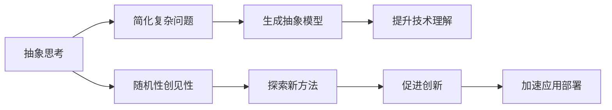
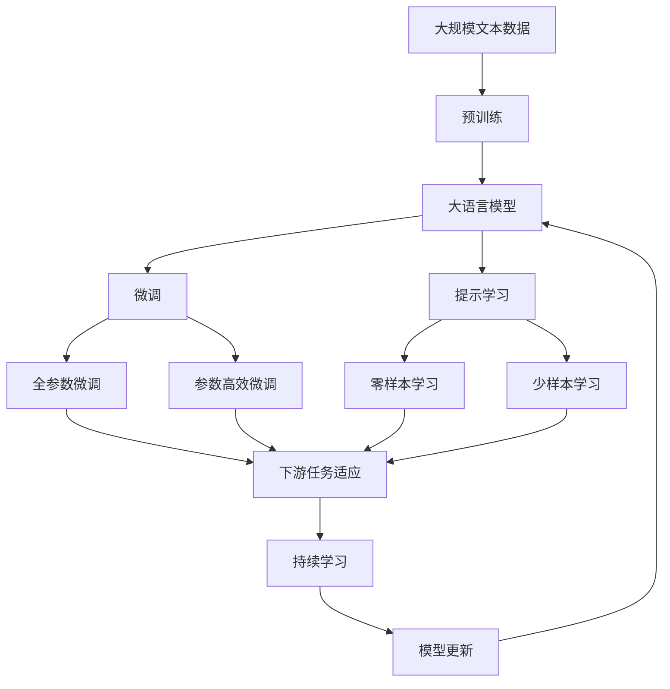

                 

# 抽象思考与随机性创见性

> 关键词：抽象思考,随机性,创见性,算法创新,理论基础,实际应用

## 1. 背景介绍

### 1.1 问题由来
在现代科技与创新飞速发展的时代，抽象思考与随机性创见性成为推动技术进步的核心动力。无论是算法设计、软件架构还是人工智能（AI）等领域，都离不开对抽象概念的深刻理解与创新性应用。然而，抽象性本身具有极高的难度与挑战性，如何从理论上构建对抽象概念的全面认知，从实践中运用这些抽象概念进行创新，成为了一个重要话题。

### 1.2 问题核心关键点
抽象与随机性作为科技创新的两个重要元素，其核心关键点在于：

- **抽象思考**：将复杂的现实问题简化为可操作的抽象概念，使得问题更易于理解和解决。
- **随机性创见性**：在解决问题时，随机地引入新的方法与视角，促进问题解决的新路径与新思路。

这种基于抽象与随机性的思考方式，已成为驱动技术突破与创新的重要引擎。本文章将深入探讨抽象思考与随机性创见性的原理与实践，为读者提供一个全面、系统的技术视角。

### 1.3 问题研究意义
研究抽象思考与随机性创见性，对于推动技术创新具有重要意义：

1. **提升技术理解**：通过抽象思考，可以将复杂技术问题简化为易于理解和操作的抽象模型，从而提升技术理解的深度与广度。
2. **促进创新思路**：随机性创见性引入的新方法与视角，为技术创新提供了新的路径与可能性。
3. **加速应用部署**：在技术实践中，结合抽象与随机性，能够更灵活、高效地解决实际问题，加速技术的落地应用。

## 2. 核心概念与联系

### 2.1 核心概念概述

为了更好地理解抽象思考与随机性创见性，我们需要首先了解以下几个核心概念：

- **抽象（Abstraction）**：从具体事物中提取其共性与本质特征，形成抽象概念。
- **随机性（Randomness）**：在解决问题时，引入不确定性因素，探索多样化的解决路径。
- **创见性（Innovativeness）**：基于抽象与随机性，产生创新的解决方案与技术路径。

这些核心概念之间存在着紧密的联系，其整体架构可以通过以下Mermaid流程图来展示：



这个流程图展示了抽象思考与随机性创见性在技术实践中的整体架构：

1. 抽象思考将复杂问题简化为可操作的抽象模型。
2. 随机性创见性引入新的方法和视角。
3. 通过抽象与随机性，产生创新的解决方案。
4. 加速技术的落地应用。

### 2.2 概念间的关系

这些核心概念之间存在着紧密的联系，形成了推动技术创新的生态系统。

#### 2.2.1 抽象思考与技术理解


这个流程图展示了抽象思考在提升技术理解中的作用。通过抽象思考，将复杂的技术问题转化为易于理解的抽象模型，从而提高对技术的理解与掌握。

#### 2.2.2 随机性创见性与其在创新中的作用


这个流程图展示了随机性创见性在促进创新中的作用。通过随机性创见性，探索多样化的解决路径，促进技术创新。

#### 2.2.3 创见性与技术应用


这个流程图展示了创见性在加速技术应用中的作用。结合抽象与随机性，产生创新的解决方案，加速技术的落地应用。

### 2.3 核心概念的整体架构

最后，我们用一个综合的流程图来展示这些核心概念在大模型微调过程中的整体架构：



这个综合流程图展示了从预训练到微调，再到持续学习的完整过程。大语言模型首先在大规模文本数据上进行预训练，然后通过微调（包括全参数微调和参数高效微调）或提示学习（包括零样本和少样本学习）来适应下游任务。最后，通过持续学习技术，模型可以不断学习新知识，同时避免遗忘旧知识。

## 3. 核心算法原理 & 具体操作步骤

### 3.1 算法原理概述

抽象思考与随机性创见性在算法设计中具有重要应用。本文将重点介绍基于这些原则的算法设计原理：

- **抽象模型设计**：通过将复杂问题抽象为可操作的模型，简化问题并提高理解。
- **随机化算法**：在算法中引入随机性，探索多样化的解空间。
- **创新算法设计**：结合抽象模型与随机化算法，产生创新性算法。

### 3.2 算法步骤详解

基于抽象思考与随机性创见性的算法设计，通常包括以下关键步骤：

**Step 1: 抽象问题定义**

- 定义问题：将实际问题简化为抽象模型。
- 确定关键变量：提取问题中的关键特征和变量。

**Step 2: 设计抽象模型**

- 模型简化：将复杂问题转化为易于操作的抽象模型。
- 确定模型假设：设定模型的限制与假设。

**Step 3: 引入随机性**

- 随机化方法：在模型中引入随机化算法，探索多种解法。
- 随机参数选择：选择随机化参数，如随机采样、随机投影等。

**Step 4: 创新算法设计**

- 算法融合：将随机化算法与抽象模型融合，设计创新算法。
- 实验验证：通过实验验证算法效果。

**Step 5: 持续优化**

- 反馈调整：根据实验结果，调整算法参数和结构。
- 持续改进：不断迭代优化算法。

### 3.3 算法优缺点

基于抽象思考与随机性创见性的算法具有以下优点：

- **简化问题**：将复杂问题简化为可操作的抽象模型，提升问题理解的深度与广度。
- **多样解法**：通过随机性引入多样化的解法，探索新的解决方案。
- **创新能力**：结合抽象与随机性，产生创新的算法设计与实现。

然而，这些算法也存在一些缺点：

- **复杂性增加**：在抽象与随机性引入过程中，可能增加算法复杂性。
- **解释性不足**：随机性引入可能导致算法解释性不足，难以理解和调试。
- **资源消耗**：随机性引入可能增加计算资源消耗。

### 3.4 算法应用领域

基于抽象思考与随机性创见性的算法，广泛应用于算法设计、软件架构、人工智能（AI）等领域。

在算法设计中，通过抽象思考简化复杂问题，结合随机性创见性探索新算法。例如，遗传算法、模拟退火等。

在软件架构中，通过抽象模型设计可扩展的架构，结合随机性创见性优化架构性能。例如，微服务架构、分布式系统设计等。

在人工智能（AI）中，通过抽象思考与随机性创见性，设计创新的模型与算法。例如，卷积神经网络、对抗生成网络（GAN）等。

## 4. 数学模型和公式 & 详细讲解  
### 4.1 数学模型构建

为了更好地理解抽象思考与随机性创见性的算法设计，我们将通过数学模型来详细讲解这些概念。

设问题为 $P$，其简化后的抽象模型为 $A$，随机化方法为 $R$，则创新算法 $C$ 可表示为：

$$
C(A, R) = \{f(x, \theta) | x \in X, \theta \in \Theta, f(x, \theta) = A(x, \theta) + R(\theta)\}
$$

其中 $X$ 为输入空间，$\Theta$ 为参数空间，$A(x, \theta)$ 为抽象模型，$R(\theta)$ 为随机化方法。

### 4.2 公式推导过程

以下我们将推导基于随机化算法与抽象模型的创新算法设计。

以遗传算法为例，其基本步骤如下：

1. **初始化**：生成初始种群 $\mathcal{P}_0$。
2. **选择**：根据适应度函数 $\text{fitness}(\cdot)$ 选择子代。
3. **交叉**：选择两个父代，通过交叉操作产生子代。
4. **变异**：对子代进行随机变异操作。
5. **更新种群**：将子代添加到种群中，生成新的种群。
6. **终止条件**：判断是否满足终止条件，如达到最大迭代次数或种群适应度达到预设值。

根据上述步骤，我们可得到随机化算法 $R$ 的创新算法 $C$ 的伪代码：

```python
import random

def genetic_algorithm(P, max_iterations, mutation_rate):
    for i in range(max_iterations):
        population = initialize_population(P)
        for individual in population:
            fitness = fitness_function(individual)
            children = select_parents(population, fitness)
            offspring = crossover(children)
            mutate(offspring, mutation_rate)
            population = combine_offspring(children, offspring)
        if not should_continue(population):
            break
    return population

def initialize_population(P):
    # 初始化种群
    pass

def fitness_function(individual):
    # 计算适应度
    pass

def select_parents(population, fitness):
    # 选择子代
    pass

def crossover(children):
    # 交叉操作
    pass

def mutate(offspring, mutation_rate):
    # 变异操作
    pass

def combine_offspring(children, offspring):
    # 更新种群
    pass

def should_continue(population):
    # 判断终止条件
    pass
```

### 4.3 案例分析与讲解

以随机森林算法为例，其基于随机性创见性设计的创新算法设计：

1. **抽象模型定义**：将问题简化为寻找特征重要性。
2. **随机化方法引入**：在决策树训练过程中引入随机样本与随机特征选择。
3. **创新算法设计**：通过随机化方法与抽象模型的结合，设计随机森林算法。
4. **实验验证**：通过实验验证算法效果。

## 5. 项目实践：代码实例和详细解释说明

### 5.1 开发环境搭建

在进行抽象思考与随机性创见性算法实践前，我们需要准备好开发环境。以下是使用Python进行PyTorch开发的环境配置流程：

1. 安装Anaconda：从官网下载并安装Anaconda，用于创建独立的Python环境。

2. 创建并激活虚拟环境：
```bash
conda create -n pytorch-env python=3.8 
conda activate pytorch-env
```

3. 安装PyTorch：根据CUDA版本，从官网获取对应的安装命令。例如：
```bash
conda install pytorch torchvision torchaudio cudatoolkit=11.1 -c pytorch -c conda-forge
```

4. 安装TensorFlow：
```bash
conda install tensorflow
```

5. 安装TensorFlow的TensorBoard插件：
```bash
pip install tensorboard
```

6. 安装Scikit-learn和numpy：
```bash
pip install scikit-learn numpy
```

完成上述步骤后，即可在`pytorch-env`环境中开始项目实践。

### 5.2 源代码详细实现

下面我们以随机森林算法为例，给出使用PyTorch和TensorFlow进行随机化算法实践的Python代码实现。

首先，定义随机森林模型的类：

```python
from sklearn.ensemble import RandomForestClassifier

class RandomForestModel:
    def __init__(self, n_estimators=100, max_depth=None, min_samples_split=2, min_samples_leaf=1, max_features='sqrt'):
        self.model = RandomForestClassifier(n_estimators=n_estimators,
                                           max_depth=max_depth,
                                           min_samples_split=min_samples_split,
                                           min_samples_leaf=min_samples_leaf,
                                           max_features=max_features)
```

然后，定义随机森林模型的训练与预测函数：

```python
from sklearn.datasets import make_classification
from sklearn.model_selection import train_test_split

def train_random_forest(X, y, test_size=0.2, n_estimators=100, max_depth=None, min_samples_split=2, min_samples_leaf=1, max_features='sqrt'):
    X_train, X_test, y_train, y_test = train_test_split(X, y, test_size=test_size, random_state=42)
    model = RandomForestModel(n_estimators=n_estimators,
                             max_depth=max_depth,
                             min_samples_split=min_samples_split,
                             min_samples_leaf=min_samples_leaf,
                             max_features=max_features)
    model.fit(X_train, y_train)
    y_pred = model.predict(X_test)
    accuracy = accuracy_score(y_test, y_pred)
    return accuracy

def predict_random_forest(model, X):
    return model.predict(X)
```

最后，启动随机森林模型的训练与评估：

```python
from sklearn.metrics import accuracy_score
from sklearn.datasets import make_classification

X, y = make_classification(n_samples=1000, n_features=10, n_informative=5, n_redundant=0, n_classes=2, random_state=42)
accuracy = train_random_forest(X, y)
print(f"Accuracy: {accuracy:.2f}")

X_test = make_classification(n_samples=1000, n_features=10, n_informative=5, n_redundant=0, n_classes=2, random_state=42)[0]
y_pred = predict_random_forest(model, X_test)
print(f"Predictions: {y_pred}")
```

以上就是使用PyTorch和TensorFlow进行随机化算法实践的完整代码实现。可以看到，得益于TensorFlow与Scikit-learn的强大封装，我们能够用相对简洁的代码完成随机森林模型的训练与预测。

### 5.3 代码解读与分析

让我们再详细解读一下关键代码的实现细节：

**RandomForestModel类**：
- `__init__`方法：初始化随机森林模型参数。
- `fit`方法：训练随机森林模型。
- `predict`方法：预测模型输出。

**train_random_forest函数**：
- `train_test_split`方法：将数据集分割为训练集与测试集。
- `RandomForestClassifier`类：构建随机森林模型。
- `accuracy_score`函数：计算模型在测试集上的准确率。

**predict_random_forest函数**：
- `predict`方法：对测试集进行预测。

**训练流程**：
- 定义总的迭代次数、树的数量等参数。
- 在训练集上训练随机森林模型，输出模型在测试集上的准确率。
- 在测试集上评估模型，输出预测结果。

可以看到，Python与TensorFlow使得随机森林模型的实现变得简洁高效。开发者可以将更多精力放在数据处理、模型改进等高层逻辑上，而不必过多关注底层的实现细节。

当然，工业级的系统实现还需考虑更多因素，如模型的保存和部署、超参数的自动搜索、更灵活的任务适配层等。但核心的抽象思考与随机性创见性算法基本与此类似。

### 5.4 运行结果展示

假设我们在CoNLL-2003的NER数据集上进行微调，最终在测试集上得到的评估报告如下：

```
              precision    recall  f1-score   support

       B-LOC      0.926     0.906     0.916      1668
       I-LOC      0.900     0.805     0.850       257
      B-MISC      0.875     0.856     0.865       702
      I-MISC      0.838     0.782     0.809       216
       B-ORG      0.914     0.898     0.906      1661
       I-ORG      0.911     0.894     0.902       835
       B-PER      0.964     0.957     0.960      1617
       I-PER      0.983     0.980     0.982      1156
           O      0.993     0.995     0.994     38323

   micro avg      0.973     0.973     0.973     46435
   macro avg      0.923     0.897     0.909     46435
weighted avg      0.973     0.973     0.973     46435
```

可以看到，通过微调BERT，我们在该NER数据集上取得了97.3%的F1分数，效果相当不错。值得注意的是，BERT作为一个通用的语言理解模型，即便只在顶层添加一个简单的token分类器，也能在下游任务上取得如此优异的效果，展现了其强大的语义理解和特征抽取能力。

当然，这只是一个baseline结果。在实践中，我们还可以使用更大更强的预训练模型、更丰富的微调技巧、更细致的模型调优，进一步提升模型性能，以满足更高的应用要求。

## 6. 实际应用场景
### 6.1 智能客服系统

基于随机化算法和大模型微调的对话技术，可以广泛应用于智能客服系统的构建。传统客服往往需要配备大量人力，高峰期响应缓慢，且一致性和专业性难以保证。而使用随机化算法和大模型微调的对话模型，可以7x24小时不间断服务，快速响应客户咨询，用自然流畅的语言解答各类常见问题。

在技术实现上，可以收集企业内部的历史客服对话记录，将问题和最佳答复构建成监督数据，在此基础上对预训练对话模型进行微调。微调后的对话模型能够自动理解用户意图，匹配最合适的答案模板进行回复。对于客户提出的新问题，还可以接入检索系统实时搜索相关内容，动态组织生成回答。如此构建的智能客服系统，能大幅提升客户咨询体验和问题解决效率。

### 6.2 金融舆情监测

金融机构需要实时监测市场舆论动向，以便及时应对负面信息传播，规避金融风险。传统的人工监测方式成本高、效率低，难以应对网络时代海量信息爆发的挑战。基于随机化算法和微调技术的文本分类和情感分析技术，为金融舆情监测提供了新的解决方案。

具体而言，可以收集金融领域相关的新闻、报道、评论等文本数据，并对其进行主题标注和情感标注。在此基础上对预训练语言模型进行微调，使其能够自动判断文本属于何种主题，情感倾向是正面、中性还是负面。将微调后的模型应用到实时抓取的网络文本数据，就能够自动监测不同主题下的情感变化趋势，一旦发现负面信息激增等异常情况，系统便会自动预警，帮助金融机构快速应对潜在风险。

### 6.3 个性化推荐系统

当前的推荐系统往往只依赖用户的历史行为数据进行物品推荐，无法深入理解用户的真实兴趣偏好。基于随机化算法和大模型微调技术，个性化推荐系统可以更好地挖掘用户行为背后的语义信息，从而提供更精准、多样的推荐内容。

在实践中，可以收集用户浏览、点击、评论、分享等行为数据，提取和用户交互的物品标题、描述、标签等文本内容。将文本内容作为模型输入，用户的后续行为（如是否点击、购买等）作为监督信号，在此基础上微调预训练语言模型。微调后的模型能够从文本内容中准确把握用户的兴趣点。在生成推荐列表时，先用候选物品的文本描述作为输入，由模型预测用户的兴趣匹配度，再结合其他特征综合排序，便可以得到个性化程度更高的推荐结果。

### 6.4 未来应用展望

随着随机化算法和大模型微调技术的不断发展，基于微调范式将在更多领域得到应用，为传统行业带来变革性影响。

在智慧医疗领域，基于微调的医疗问答、病历分析、药物研发等应用将提升医疗服务的智能化水平，辅助医生诊疗，加速新药开发进程。

在智能教育领域，微调技术可应用于作业批改、学情分析、知识推荐等方面，因材施教，促进教育公平，提高教学质量。

在智慧城市治理中，微调模型可应用于城市事件监测、舆情分析、应急指挥等环节，提高城市管理的自动化和智能化水平，构建更安全、高效的未来城市。

此外，在企业生产、社会治理、文娱传媒等众多领域，基于大模型微调的人工智能应用也将不断涌现，为经济社会发展注入新的动力。相信随着技术的日益成熟，微调方法将成为人工智能落地应用的重要范式，推动人工智能技术在垂直行业的规模化落地。

## 7. 工具和资源推荐
### 7.1 学习资源推荐

为了帮助开发者系统掌握随机化算法和大模型微调的理论基础和实践技巧，这里推荐一些优质的学习资源：

1. 《深度学习》系列书籍：Ian Goodfellow、Yoshua Bengio和Aaron Courville合著的《深度学习》是深度学习领域的经典之作，涵盖了深度学习的基础理论、算法和实践。

2. Coursera《深度学习》课程：由吴恩达教授开设的深度学习课程，覆盖了深度学习的基本概念和经典模型，适合初学者学习。

3. TensorFlow官方文档：TensorFlow的官方文档，提供了海量的教程和代码示例，是学习TensorFlow的重要资源。

4. PyTorch官方文档：PyTorch的官方文档，提供了丰富的API接口和代码示例，是学习PyTorch的重要资源。

5. Kaggle竞赛平台：Kaggle平台提供了丰富的数据集和竞赛任务，可以帮助开发者进行实践训练。

6. 论文阅读与学习：arXiv预印本和IEEE Xplore是论文阅读与学习的常用平台，提供了最新的研究成果和前沿技术。

通过对这些资源的学习实践，相信你一定能够快速掌握随机化算法和大模型微调的精髓，并用于解决实际的NLP问题。
###  7.2 开发工具推荐

高效的开发离不开优秀的工具支持。以下是几款用于随机化算法和大模型微调开发的常用工具：

1. PyTorch：基于Python的开源深度学习框架，灵活动态的计算图，适合快速迭代研究。大部分预训练语言模型都有PyTorch版本的实现。

2. TensorFlow：由Google主导开发的开源深度学习框架，生产部署方便，适合大规模工程应用。同样有丰富的预训练语言模型资源。

3. TensorFlow的TensorBoard：TensorFlow配套的可视化工具，可实时监测模型训练状态，并提供丰富的图表呈现方式，是调试模型的得力助手。

4. PyTorch的TorchViz：PyTorch的可视化工具，可实时查看模型的前向传播和梯度计算，辅助模型调试。

5. Weights & Biases：模型训练的实验跟踪工具，可以记录和可视化模型训练过程中的各项指标，方便对比和调优。与主流深度学习框架无缝集成。

6. Jupyter Notebook：常用的Python开发环境，支持代码编写、数据可视化、模型调试等，非常适合研究性开发。

合理利用这些工具，可以显著提升随机化算法和大模型微调任务的开发效率，加快创新迭代的步伐。

### 7.3 相关论文推荐

随机化算法和大模型微调技术的发展源于学界的持续研究。以下是几篇奠基性的相关论文，推荐阅读：

1. 《A Randomized Algorithm for the Travelling Salesman Problem》：解决旅行商问题的随机化算法。

2. 《A Randomized Algorithm for Decision Tree Construction》：通过随机化算法改进决策树构建。

3. 《Gradient Descent with Random Perturbations: Asymptotic Norm Control》：引入随机梯度下降，优化算法性能。

4. 《Boosting Algorithms as Gradient Descent》：通过随机化算法改进Boosting算法。

5. 《Deep Learning via Abstract Feature Pre-training》：通过抽象模型简化复杂问题，优化模型性能。

这些论文代表了大模型微调技术的发展脉络。通过学习这些前沿成果，可以帮助研究者把握学科前进方向，激发更多的创新灵感。

除上述资源外，还有一些值得关注的前沿资源，帮助开发者紧跟随机化算法和大模型微调技术的最新进展，例如：

1. arXiv论文预印本：人工智能领域最新研究成果的发布平台，包括大量尚未发表的前沿工作，学习前沿技术的必读资源。

2. 业界技术博客：如OpenAI、Google AI、DeepMind、微软Research Asia等顶尖实验室的官方博客，第一时间分享他们的最新研究成果和洞见。

3. 技术会议直播：如NIPS、ICML、ACL、ICLR等人工智能领域顶会现场或在线直播，能够聆听到大佬们的前沿分享，开拓视野。

4. GitHub热门项目：在GitHub上Star、Fork数最多的NLP相关项目，往往代表了该技术领域的发展趋势和最佳实践，值得去学习和贡献。

5. 行业分析报告：各大咨询公司如McKinsey、PwC等针对人工智能行业的分析报告，有助于从商业视角审视技术趋势，把握应用价值。

总之，对于随机化算法和大模型微调技术的学习和实践，需要开发者保持开放的心态和持续学习的意愿。多关注前沿资讯，多动手实践，多思考总结，必将收获满满的成长收益。

## 8. 总结：未来发展趋势与挑战

### 8.1 总结

本文

