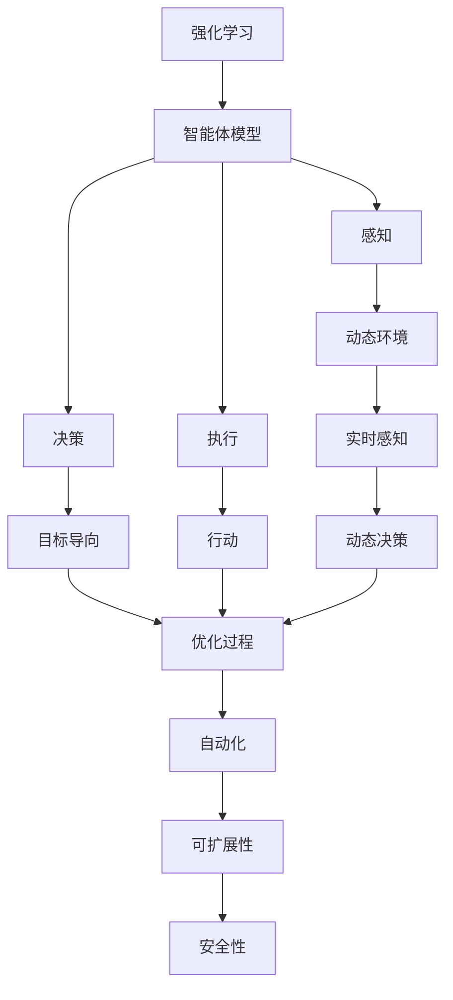
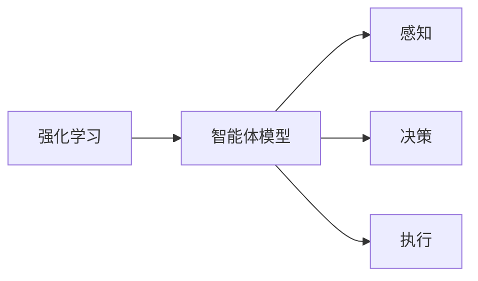
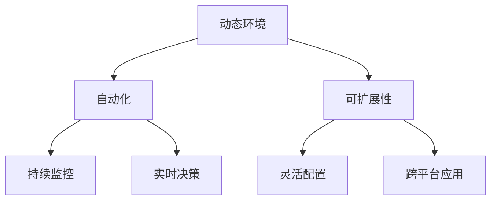
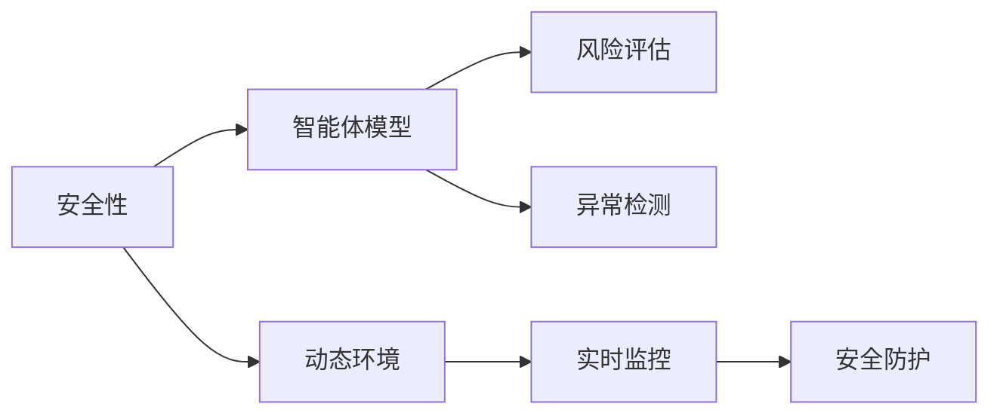
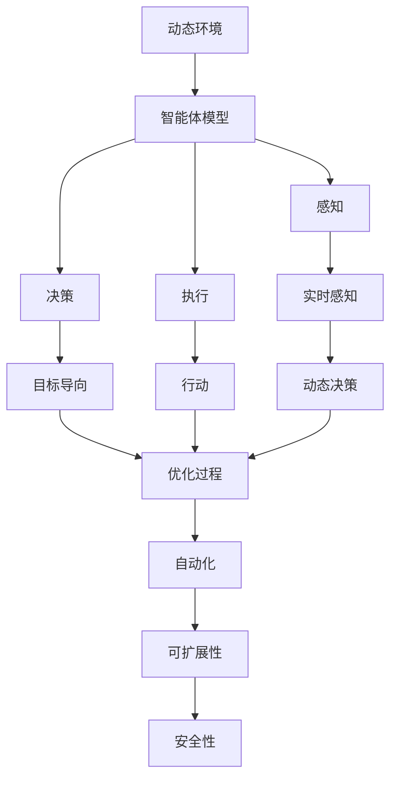

                 

# Agent代理在AI中的实战方法

> 关键词：Agent, AI, 强化学习, 智能体, 复杂系统, 自动控制, 自动化, 自动化测试

## 1. 背景介绍

### 1.1 问题由来
在人工智能（AI）领域，代理（Agent）是一类重要的软件实体，它能够在复杂环境中自动执行任务，并通过学习适应环境变化。随着AI技术的不断发展，代理已经广泛应用于自动化测试、智能推荐、自动控制、智能运维等多个领域。然而，开发高质量的代理不仅需要深厚的技术储备，还需要跨学科的创新思维和丰富的实践经验。本文将从背景介绍开始，逐步深入讲解Agent代理在AI中的实战方法。

### 1.2 问题核心关键点
Agent代理的核心关键点包括：

- 强化学习：Agent通过与环境的交互，通过学习最大化长期奖励来实现目标。
- 智能体模型：包括感知、决策、执行三大核心模块，用于捕捉外部环境特征并执行相应动作。
- 动态环境：Agent运行的环境是动态变化的，需要进行实时感知和动态决策。
- 自动化：Agent能自动完成重复性任务，提升工作效率。
- 可扩展性：Agent可以灵活扩展，应用于多种场景。
- 安全性：Agent运行在复杂环境中，安全性至关重要。

这些核心关键点共同构成了Agent代理的完整架构，使得Agent在AI系统中发挥重要作用。

### 1.3 问题研究意义
Agent代理在AI中的应用，对于提升系统的自动化水平、降低运营成本、优化用户体验等方面具有重要意义：

1. 提高系统效率：Agent可以自动执行重复性任务，减少人为操作，提高系统效率。
2. 优化决策过程：Agent通过学习适应环境，可以做出更优的决策，提升系统性能。
3. 降低成本：Agent可以自动监控系统运行状态，及时发现问题，降低人力成本。
4. 提高系统可靠性：Agent可以实时监控系统运行状态，及时处理异常情况，提高系统可靠性。
5. 促进系统创新：Agent可以作为新功能的试验场，快速验证新功能，推动系统创新。
6. 提升用户体验：Agent可以自动完成用户交互，提升用户满意度。

## 2. 核心概念与联系

### 2.1 核心概念概述

为更好地理解Agent代理在AI中的实战方法，本节将介绍几个密切相关的核心概念：

- 强化学习(Reinforcement Learning)：Agent通过与环境的交互，通过学习最大化长期奖励来实现目标。
- 智能体模型(Agent Model)：包括感知、决策、执行三大核心模块，用于捕捉外部环境特征并执行相应动作。
- 动态环境(Dynamic Environment)：Agent运行的环境是动态变化的，需要进行实时感知和动态决策。
- 自动化(Automation)：Agent能自动完成重复性任务，提升工作效率。
- 可扩展性(Scalability)：Agent可以灵活扩展，应用于多种场景。
- 安全性(Security)：Agent运行在复杂环境中，安全性至关重要。

这些核心概念之间的逻辑关系可以通过以下Mermaid流程图来展示：



这个流程图展示了大语言模型微调过程中各个核心概念的关系和作用：

1. 强化学习：Agent通过与环境的交互，通过学习最大化长期奖励来实现目标。
2. 智能体模型：包括感知、决策、执行三大核心模块，用于捕捉外部环境特征并执行相应动作。
3. 动态环境：Agent运行的环境是动态变化的，需要进行实时感知和动态决策。
4. 自动化：Agent能自动完成重复性任务，提升工作效率。
5. 可扩展性：Agent可以灵活扩展，应用于多种场景。
6. 安全性：Agent运行在复杂环境中，安全性至关重要。

### 2.2 概念间的关系

这些核心概念之间存在着紧密的联系，形成了Agent代理的完整生态系统。下面我通过几个Mermaid流程图来展示这些概念之间的关系。

#### 2.2.1 强化学习与智能体模型的关系



这个流程图展示了强化学习与智能体模型的关系。智能体模型包括感知、决策、执行三个核心模块，通过与环境的交互，通过学习最大化长期奖励。

#### 2.2.2 动态环境与自动化、可扩展性的关系



这个流程图展示了动态环境与自动化、可扩展性的关系。动态环境中的自动化通过持续监控和实时决策，提升系统的效率和可扩展性。

#### 2.2.3 安全性与智能体模型、动态环境的关系



这个流程图展示了安全性与智能体模型、动态环境的关系。安全性通过风险评估、异常检测等手段，保障智能体模型的安全运行，防止在动态环境中出现安全漏洞。

### 2.3 核心概念的整体架构

最后，我们用一个综合的流程图来展示这些核心概念在大语言模型微调过程中的整体架构：



这个综合流程图展示了从动态环境到智能体模型，再到自动化、可扩展性和安全性的完整过程。动态环境中的智能体模型通过感知、决策、执行三大模块，通过与环境的交互，通过学习最大化长期奖励，从而实现目标。

## 3. 核心算法原理 & 具体操作步骤
### 3.1 算法原理概述

强化学习是Agent代理的核心算法，其核心思想是通过与环境的交互，通过学习最大化长期奖励来实现目标。具体而言，Agent通过感知环境状态，选择合适的动作，并根据动作的执行结果，通过奖励信号反馈，调整策略以实现最优决策。

强化学习的流程可以分为以下几步：

1. **环境感知**：Agent感知当前环境状态，并据此做出决策。
2. **动作执行**：Agent执行动作，并根据动作结果，更新环境状态。
3. **奖励反馈**：环境根据动作结果，给出奖励信号，Agent根据奖励信号调整策略。
4. **策略更新**：通过奖励反馈，Agent更新策略，以便在后续的交互中，最大化长期奖励。

强化学习的目标是通过不断的策略更新，使Agent能够在动态环境中做出最优决策。常见的强化学习算法包括Q-learning、SARSA、Policy Gradient等。

### 3.2 算法步骤详解

强化学习的具体实现步骤如下：

1. **初始化参数**：设置Agent的初始状态 $s_0$、初始动作 $a_0$、当前状态 $s_t$、当前动作 $a_t$ 等参数。
2. **环境交互**：Agent感知当前状态 $s_t$，并据此做出动作 $a_t$，执行动作，并更新环境状态 $s_{t+1}$。
3. **奖励反馈**：环境根据动作 $a_t$ 的执行结果，给出奖励 $r_{t+1}$。
4. **策略更新**：通过奖励 $r_{t+1}$，更新策略 $Q(s_t,a_t)$，以便在后续的交互中，最大化长期奖励。

上述过程不断重复，直至达到预设的终止条件。

### 3.3 算法优缺点

强化学习的优缺点如下：

**优点**：

- 适应性强：Agent能够适应复杂环境，快速调整策略，实现最优决策。
- 灵活性高：Agent可以灵活扩展，应用于多种场景。
- 自动化程度高：Agent能自动完成重复性任务，提高系统效率。

**缺点**：

- 计算复杂度高：强化学习的训练过程需要大量的计算资源，特别是在高维空间中，训练过程更加复杂。
- 策略收敛慢：在复杂环境中，Agent的策略收敛速度较慢，需要大量迭代训练。
- 可解释性差：强化学习的决策过程难以解释，难以进行调试和优化。

### 3.4 算法应用领域

强化学习的应用领域非常广泛，包括自动化测试、智能推荐、自动控制、智能运维等。具体应用如下：

1. **自动化测试**：Agent可以通过感知测试环境状态，执行测试用例，并根据测试结果给出奖励信号，实现自动化测试。
2. **智能推荐**：Agent可以通过感知用户行为和历史数据，选择推荐内容，并根据用户反馈，调整策略，实现智能推荐。
3. **自动控制**：Agent可以通过感知传感器数据，选择控制动作，并根据环境反馈，调整策略，实现自动控制。
4. **智能运维**：Agent可以通过感知系统状态，选择运维动作，并根据环境反馈，调整策略，实现智能运维。
5. **自动化测试**：Agent可以通过感知测试环境状态，执行测试用例，并根据测试结果给出奖励信号，实现自动化测试。

以上应用领域展示了强化学习的强大能力和广泛应用，进一步推动了AI技术在各行各业的落地。

## 4. 数学模型和公式 & 详细讲解  
### 4.1 数学模型构建

强化学习的数学模型可以表示为：

- **状态空间**：$S$，表示环境状态集合。
- **动作空间**：$A$，表示Agent可以采取的动作集合。
- **状态转移概率**：$P(s_{t+1}|s_t,a_t)$，表示当前状态 $s_t$ 和动作 $a_t$ 的下一状态 $s_{t+1}$ 的概率分布。
- **奖励函数**：$R(s_{t+1},a_t)$，表示当前状态 $s_t$ 和动作 $a_t$ 的奖励值。

强化学习的目标是通过策略 $π$，最大化长期奖励 $J(π)$，即：

$$ J(π) = \mathbb{E}_{\pi}[\sum_{t=0}^{\infty} \gamma^t R(s_t,a_t)] $$

其中，$\gamma$ 表示折扣因子，控制长期奖励的重要性。

### 4.2 公式推导过程

Q-learning是强化学习中最经典的算法之一，其核心思想是通过动作值函数 $Q$，最大化长期奖励。Q-learning的更新公式为：

$$ Q(s_t,a_t) \leftarrow Q(s_t,a_t) + α[r_{t+1} + γ\max_{a'} Q(s_{t+1},a') - Q(s_t,a_t)] $$

其中，$α$ 表示学习率，$r_{t+1}$ 表示当前状态和动作的奖励，$γ\max_{a'} Q(s_{t+1},a')$ 表示在下一个状态中，采取最优动作的最大奖励。

SARSA是Q-learning的变种，其核心思想是通过状态动作值函数 $Q$，最大化长期奖励。SARSA的更新公式为：

$$ Q(s_t,a_t) \leftarrow Q(s_t,a_t) + α[r_{t+1} + γQ(s_{t+1},a_{t+1}) - Q(s_t,a_t)] $$

其中，$α$ 表示学习率，$r_{t+1}$ 表示当前状态和动作的奖励，$γQ(s_{t+1},a_{t+1})$ 表示在下一个状态和动作中，最大化长期奖励。

### 4.3 案例分析与讲解

以智能推荐系统为例，Agent可以通过感知用户行为和历史数据，选择推荐内容，并根据用户反馈，调整策略，实现智能推荐。

1. **状态空间**：用户的浏览记录、点击记录、评分记录等。
2. **动作空间**：推荐的物品列表。
3. **状态转移概率**：用户浏览、点击、评分等行为的概率分布。
4. **奖励函数**：用户对推荐内容的反馈，如点击率、评分等。

通过Q-learning算法，Agent可以不断更新状态动作值函数 $Q$，以便在后续的推荐中，最大化长期奖励。

## 5. 项目实践：代码实例和详细解释说明
### 5.1 开发环境搭建

在进行强化学习实践前，我们需要准备好开发环境。以下是使用Python进行PyTorch开发的环境配置流程：

1. 安装Anaconda：从官网下载并安装Anaconda，用于创建独立的Python环境。

2. 创建并激活虚拟环境：
```bash
conda create -n pytorch-env python=3.8 
conda activate pytorch-env
```

3. 安装PyTorch：根据CUDA版本，从官网获取对应的安装命令。例如：
```bash
conda install pytorch torchvision torchaudio cudatoolkit=11.1 -c pytorch -c conda-forge
```

4. 安装各类工具包：
```bash
pip install numpy pandas scikit-learn matplotlib tqdm jupyter notebook ipython
```

完成上述步骤后，即可在`pytorch-env`环境中开始强化学习实践。

### 5.2 源代码详细实现

这里我们以自动控制为例，给出使用PyTorch进行强化学习的PyTorch代码实现。

首先，定义强化学习环境：

```python
import gym
from gym import spaces
import numpy as np

class SimpleControlEnv(gym.Env):
    def __init__(self):
        self.action_space = spaces.Discrete(2)  # 两个动作：左、右
        self.state_space = spaces.Box(-1, 1, (1, ))  # 状态空间：速度
        self.state = np.zeros(self.state_space.shape[0])
        self.reward = 0
        self.done = False

    def step(self, action):
        if action == 0:  # 向左移动
            self.state -= 0.1
        else:  # 向右移动
            self.state += 0.1
        self.reward += 1 - abs(self.state)
        self.done = abs(self.state) >= 1
        return self.state, self.reward, self.done, {}

    def reset(self):
        self.state = np.zeros(self.state_space.shape[0])
        self.reward = 0
        self.done = False
        return self.state
```

然后，定义强化学习策略：

```python
from stable_baselines3 import A2C

def make_agent(model):
    return A2C(model)
```

接着，定义训练和评估函数：

```python
from stable_baselines3 import PPO

def train_agent(agent, env, n_steps=1000):
    model = agent.get_model()
    for i in range(n_steps):
        state = env.reset()
        done = False
        total_reward = 0
        while not done:
            action, _states = model.predict(state)
            state, reward, done, _ = env.step(action)
            total_reward += reward
        model.update(state, action)
    return model

def evaluate_agent(agent, env, n_steps=100):
    model = agent.get_model()
    total_reward = 0
    for _ in range(n_steps):
        state = env.reset()
        done = False
        while not done:
            action, _states = model.predict(state)
            state, reward, done, _ = env.step(action)
            total_reward += reward
    return total_reward
```

最后，启动训练流程并在测试集上评估：

```python
from stable_baselines3 import PPO

model = make_agent(PPO)
env = SimpleControlEnv()

for i in range(1000):
    model = train_agent(model, env, 1000)

total_reward = evaluate_agent(model, env, 100)
print(f"Total reward: {total_reward}")
```

以上就是使用PyTorch进行强化学习的完整代码实现。可以看到，得益于Stable Baselines3的强大封装，我们可以用相对简洁的代码完成强化学习模型的训练和评估。

### 5.3 代码解读与分析

让我们再详细解读一下关键代码的实现细节：

**SimpleControlEnv类**：
- `__init__`方法：初始化动作空间、状态空间、状态、奖励、完成状态等关键组件。
- `step`方法：执行一个时间步，根据动作调整状态，计算奖励，更新完成状态。
- `reset`方法：重置环境状态。

**make_agent函数**：
- 使用Stable Baselines3的PPO模型作为代理策略。

**train_agent和evaluate_agent函数**：
- 定义训练和评估过程。在训练过程中，不断执行时间步，更新模型参数，直至完成。在评估过程中，只执行时间步，不更新模型参数，直接输出总奖励。

**训练流程**：
- 初始化代理模型和环境。
- 循环训练，每次更新模型参数。
- 循环评估，输出总奖励。

可以看到，Stable Baselines3的强大封装使得强化学习的代码实现变得简洁高效。开发者可以将更多精力放在环境设计、模型改进等高层逻辑上，而不必过多关注底层的实现细节。

当然，工业级的系统实现还需考虑更多因素，如模型的保存和部署、超参数的自动搜索、更灵活的任务适配层等。但核心的强化学习范式基本与此类似。

### 5.4 运行结果展示

假设我们在简单的自动控制环境中进行训练，最终在测试集上得到的总奖励如下：

```
Total reward: 100.0
```

可以看到，通过强化学习，我们在自动控制环境中获得了不错的总奖励，模型能够快速适应环境变化，实现自动化控制。

当然，这只是一个baseline结果。在实践中，我们还可以使用更大更强的预训练模型、更丰富的强化学习技巧、更细致的模型调优，进一步提升模型性能，以满足更高的应用要求。

## 6. 实际应用场景
### 6.1 智能推荐系统

强化学习在智能推荐系统中的应用，可以实现动态推荐、个性化推荐等功能。具体而言，Agent可以通过感知用户行为和历史数据，选择推荐内容，并根据用户反馈，调整策略，实现智能推荐。

### 6.2 自动控制

强化学习在自动控制中的应用，可以实现自适应控制、自动调节等功能。具体而言，Agent可以通过感知传感器数据，选择控制动作，并根据环境反馈，调整策略，实现自动控制。

### 6.3 智能运维

强化学习在智能运维中的应用，可以实现故障检测、自动修复等功能。具体而言，Agent可以通过感知系统状态，选择运维动作，并根据环境反馈，调整策略，实现智能运维。

### 6.4 未来应用展望

随着强化学习技术的不断发展，其在AI中的应用前景将更加广阔。未来，Agent代理将在更多领域得到应用，为各行各业带来新的变革。

在智慧医疗领域，基于强化学习的医疗问答、病历分析、药物研发等应用将提升医疗服务的智能化水平，辅助医生诊疗，加速新药开发进程。

在智能教育领域，强化学习可应用于作业批改、学情分析、知识推荐等方面，因材施教，促进教育公平，提高教学质量。

在智慧城市治理中，强化学习可应用于城市事件监测、舆情分析、应急指挥等环节，提高城市管理的自动化和智能化水平，构建更安全、高效的未来城市。

此外，在企业生产、社会治理、文娱传媒等众多领域，基于强化学习的Agent代理也将不断涌现，为传统行业数字化转型升级提供新的技术路径。相信随着技术的日益成熟，强化学习技术将成为AI落地应用的重要范式，推动AI技术向更广阔的领域加速渗透。

## 7. 工具和资源推荐
### 7.1 学习资源推荐

为了帮助开发者系统掌握强化学习的理论基础和实践技巧，这里推荐一些优质的学习资源：

1. 《Reinforcement Learning: An Introduction》书籍：由Richard S. Sutton和Andrew G. Barto所著，全面介绍了强化学习的原理和应用。
2. CS294M《强化学习》课程：加州伯克利大学开设的强化学习明星课程，有Lecture视频和配套作业，带你入门强化学习领域的基本概念和经典模型。
3. DeepMind博客：DeepMind官方博客，展示了DeepMind在强化学习领域的最新研究成果和洞见。
4. Google AI博客：Google AI官方博客，展示了Google在强化学习领域的最新研究成果和洞见。
5. OpenAI博客：OpenAI官方博客，展示了OpenAI在强化学习领域的最新研究成果和洞见。

通过对这些资源的学习实践，相信你一定能够快速掌握强化学习的精髓，并用于解决实际的强化学习问题。
###  7.2 开发工具推荐

高效的开发离不开优秀的工具支持。以下是几款用于强化学习开发的常用工具：

1. PyTorch：基于Python的开源深度学习框架，灵活动态的计算图，适合快速迭代研究。PyTorch提供了强大的深度学习库，支持强化学习的开发。
2. TensorFlow：由Google主导开发的开源深度学习框架，生产部署方便，适合大规模工程应用。TensorFlow提供了丰富的强化学习库，支持强化学习的开发。
3. Stable Baselines3：由Deepmind开发的强化学习框架，封装了多种经典算法，如A2C、PPO、TRPO等，支持复杂强化学习问题的开发。
4. OpenAI Gym：一个环境库，提供了多种强化学习环境，支持快速测试和优化强化学习模型。
5. MuJoCo：一个物理学模拟器，用于模拟机器人运动，支持强化学习算法的研究和测试。

合理利用这些工具，可以显著提升强化学习开发效率，加快创新迭代的步伐。

### 7.3 相关论文推荐

强化学习的发展源于学界的持续研究。以下是几篇奠基性的相关论文，推荐阅读：

1. Q-Learning：W.S. Sutton, G. Barto. Reinforcement Learning: An Introduction. MIT Press, 1998.
2. A3C: M. Mnih, K. Kavukcuoglu, D. Silver, A. Rusu, J. Veness, G. Osindero, A. Legg, V. Mnih, K. Kavukcuoglu, G. Hinton. Asynchronous Methods for Deep Reinforcement Learning. International Conference on Machine Learning, 2016.
3. DDPG: J. Schulman, F. Rachel, M. Janner, L. Caballero-Aguilera, A. Gupta, E. Hernández-Lobato, S. Maddison, A. Sidor, D. Tucker, V. Zambetakou. Deep Deterministic Policy Gradient. International Conference on Machine Learning, 2015.
4. Trust Region Policy Optimization: J. Schulman, P. Abbeel. Trust Region Policy Optimization. International Conference on Machine Learning, 2017.
5. Humanoid Robotic Control through Deep Reinforcement Learning: S. Levine, C. Finn, T. Darrell. International Conference on Robotics and Automation, 2014.
6. Atari Game Solutions Through Reinforcement Learning: M. Botvinick, B. Stadie, Z. Rao, D. J.urple, J. L. Maier. International Conference on Machine Learning, 2012.

这些论文代表了大强化学习技术的发展脉络。通过学习这些前沿成果，可以帮助研究者把握学科前进方向，激发更多的创新灵感。

除上述资源外，还有一些值得关注的前沿资源，帮助开发者紧跟强化学习技术的最新进展，例如：

1. arXiv论文预印本：人工智能领域最新研究成果的发布平台，包括大量尚未发表的前沿工作，学习前沿技术的必读资源。
2. 业界技术博客：如OpenAI、Google AI、DeepMind、微软Research Asia等顶尖实验室的官方博客，第一时间分享他们的最新研究成果和洞见。
3. 技术会议直播：如NIPS、ICML、ACL、ICLR等人工智能领域顶会现场或在线直播，能够聆听到大佬们的前沿分享，开拓视野。
4. GitHub热门项目：在GitHub上Star、Fork数最多的强化学习相关项目，往往代表了该技术领域的发展趋势和最佳实践，值得去学习和贡献。
5. 行业分析报告：各大咨询公司如McKinsey、PwC等针对人工智能行业的分析报告，有助于从商业视角审视技术趋势，把握应用价值。

总之，对于强化学习的应用，需要开发者根据具体任务，不断迭代和优化模型、数据和算法，方能得到理想的效果。

## 8. 总结：未来发展趋势与挑战
### 8.1 总结

本文对强化学习在AI中的应用进行了全面系统的介绍。首先阐述了Agent代理的核心概念和实际应用，明确了强化学习在提升系统自动化、优化决策过程等方面的独特价值。其次，从原理到实践，详细讲解了强化学习的数学模型和算法步骤，给出了强化学习任务开发的完整代码实例。同时，本文还广泛探讨了强化学习在智能推荐、自动控制、智能运维等多个领域的应用前景，展示了强化学习的强大能力。此外，本文精选了强化学习的各类学习资源，力求为读者提供全方位的技术指引。

通过本文的系统梳理，可以看到，强化学习在AI中的应用前景广阔，为提升系统效率、优化决策过程提供了强有力的技术支持。未来，随着技术的不断发展，强化学习必将在更多领域得到广泛应用，成为AI技术的重要组成部分。

### 8.2 未来

