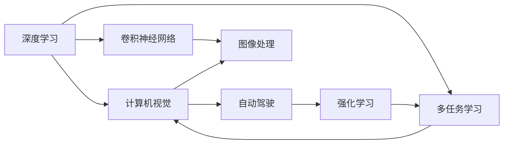

                 

# Andrej Karpathy的AI演讲内容

> 关键词：深度学习, 计算机视觉, 自动驾驶, 卷积神经网络, 强化学习, 多任务学习

## 1. 背景介绍

### 1.1 问题由来

Andrej Karpathy是深度学习领域的顶尖专家，曾在斯坦福大学任教并创办了OpenAI公司。他参与开创了卷积神经网络（CNNs）在计算机视觉领域的应用，并领导了自动驾驶技术的研究。Karpathy的演讲内容涵盖了深度学习在计算机视觉、自动驾驶和强化学习等多个领域的进展和挑战。

## 2. 核心概念与联系

### 2.1 核心概念概述

- **深度学习**：一种通过多层神经网络模拟人脑学习方式的技术，用于解决图像识别、语音识别、自然语言处理等复杂问题。
- **卷积神经网络（CNNs）**：一种特殊的神经网络，主要用于图像处理任务，通过卷积操作提取图像的局部特征。
- **自动驾驶**：结合计算机视觉和强化学习技术，使车辆能够在没有人类干预的情况下自主驾驶。
- **强化学习**：通过与环境的交互，智能体学习如何做出最优决策以最大化奖励的机器学习技术。
- **多任务学习**：一种训练模型处理多个相关任务的深度学习方法，可以减少数据需求和计算成本，提高泛化能力。

### 2.2 概念间的关系

Karpathy的演讲展示了深度学习、卷积神经网络、自动驾驶和强化学习之间的紧密联系。CNNs在图像处理上的卓越表现，为其在自动驾驶和计算机视觉中广泛应用奠定了基础。强化学习在自动驾驶中的实时决策，结合计算机视觉的多任务学习，进一步推动了自动驾驶技术的进步。

以下是一个简单的Mermaid流程图，展示了这些核心概念的联系：



这个图表展示了大语言模型微调过程中各技术之间的关系：深度学习是基础，CNNs应用于图像处理，计算机视觉与自动驾驶紧密相关，强化学习在自动驾驶中发挥作用，多任务学习将多个相关任务结合在一起。

## 3. 核心算法原理 & 具体操作步骤

### 3.1 算法原理概述

Karpathy的演讲重点介绍了深度学习和计算机视觉中卷积神经网络的基本原理。CNNs通过卷积、池化、批归一化等操作，自动提取图像的局部特征，并通过多层网络结构进行抽象，最终实现图像分类、对象检测等任务。

- **卷积操作**：提取局部特征，通过滤波器（Filter）在图像上进行滑动，提取不同的特征。
- **池化操作**：减小特征图尺寸，减少计算量，并通过统计信息保留重要特征。
- **批归一化**：加速训练过程，通过标准化输入数据，使得网络各层的输出更加稳定。

### 3.2 算法步骤详解

CNNs的训练过程包括数据预处理、模型构建、优化器选择、损失函数设计等多个步骤。下面以Karpathy的演讲内容为依据，详细介绍卷积神经网络的训练流程：

1. **数据预处理**：将原始图像数据转化为网络可以处理的形式，如归一化、缩放、旋转等。

2. **模型构建**：设计CNNs的结构，包括卷积层、池化层、全连接层等，并选择合适的激活函数和优化器。

3. **优化器选择**：如SGD、Adam、Adagrad等，通过调整学习率、动量等参数，优化模型参数。

4. **损失函数设计**：如交叉熵损失、均方误差损失等，衡量模型预测与真实标签之间的差异。

5. **模型训练**：通过反向传播算法，计算梯度，更新模型参数，减少损失函数。

6. **模型评估**：在验证集上评估模型性能，调整超参数。

### 3.3 算法优缺点

**优点**：
- 强大的特征提取能力，适用于图像处理任务。
- 参数共享机制，减少数据需求和计算成本。
- 多任务学习，提高泛化能力。

**缺点**：
- 需要大量标注数据，训练时间长。
- 模型复杂，参数量大，难以解释。
- 对于数据分布变化敏感，泛化能力有限。

### 3.4 算法应用领域

CNNs已经在计算机视觉、自动驾驶、医学影像分析等领域取得了巨大成功。以下是几个典型的应用案例：

- **计算机视觉**：图像分类、对象检测、人脸识别等。
- **自动驾驶**：通过摄像头和激光雷达等传感器捕捉环境信息，实现车辆自主导航。
- **医学影像分析**：利用CNNs进行癌症检测、影像分割等医疗任务。

## 4. 数学模型和公式 & 详细讲解 & 举例说明

### 4.1 数学模型构建

CNNs的数学模型可以表示为一系列卷积和池化操作的堆叠，通过多个卷积层和池化层提取特征，最后通过全连接层进行分类或回归。

卷积层的数学公式如下：

$$
h_{i,j}^{l+1} = \sum_k w_{k}^{i,j} * h_{i-k,j-k}^{l} + b^{i,j}_l
$$

其中，$w_{k}^{i,j}$ 是卷积核（Filter），$h_{i,j}^{l}$ 是第 $l$ 层的特征图，$b^{i,j}_l$ 是偏置项。

### 4.2 公式推导过程

以Karpathy的演讲为例，介绍CNNs的卷积层推导过程：

假设输入图像 $I$ 的大小为 $h \times w$，卷积核 $W$ 的大小为 $k \times k$，则卷积层的输出 $H$ 的大小为 $(h-k+1) \times (w-k+1)$。卷积操作可以表示为：

$$
H_{i,j} = \sum_{m=0}^{k-1}\sum_{n=0}^{k-1} W_{m,n} * I_{i-m,j-n}
$$

池化层通常采用最大池化（Max Pooling）或平均池化（Average Pooling），减小特征图尺寸。最大池化公式如下：

$$
H_{i,j} = \max_{m=0}^{k-1}\max_{n=0}^{k-1} I_{i-m,j-n}
$$

### 4.3 案例分析与讲解

以Karpathy在演讲中提到的自动驾驶任务为例，分析CNNs在实际应用中的性能表现。

假设一个自动驾驶车辆在城市道路上行驶，需要实时识别交通信号灯、行人和其他车辆。通过在车辆上安装多个摄像头和激光雷达，采集环境信息，并输入到CNNs中进行处理。CNNs首先通过卷积和池化操作提取特征，然后将特征输入到全连接层进行分类或检测，最后输出决策信息。

## 5. 项目实践：代码实例和详细解释说明

### 5.1 开发环境搭建

以下是使用Python和PyTorch搭建CNNs训练环境的流程：

1. **安装Anaconda**：从官网下载并安装Anaconda，创建独立的Python环境。

2. **创建虚拟环境**：
```bash
conda create -n cv-env python=3.8 
conda activate cv-env
```

3. **安装必要的Python包**：
```bash
pip install torch torchvision numpy scikit-learn matplotlib
```

4. **安装PyTorch和相关模型**：
```bash
pip install torch torchvision
```

5. **下载数据集**：从官方数据集网站或库下载需要的图像数据集。

### 5.2 源代码详细实现

以下是一个简单的CNNs模型在图像分类任务中的实现，包括数据加载、模型定义、训练和评估等步骤：

```python
import torch
import torch.nn as nn
import torchvision.transforms as transforms
from torchvision.datasets import CIFAR10
from torchvision.transforms import transforms

# 数据预处理
transform = transforms.Compose([
    transforms.ToTensor(),
    transforms.Normalize((0.5, 0.5, 0.5), (0.5, 0.5, 0.5))
])

# 加载数据集
trainset = CIFAR10(root='./data', train=True, download=True, transform=transform)
trainloader = torch.utils.data.DataLoader(trainset, batch_size=4,
                                        shuffle=True, num_workers=2)

testset = CIFAR10(root='./data', train=False, download=True, transform=transform)
testloader = torch.utils.data.DataLoader(testset, batch_size=4,
                                       shuffle=False, num_workers=2)

# 定义CNN模型
class Net(nn.Module):
    def __init__(self):
        super(Net, self).__init__()
        self.conv1 = nn.Conv2d(3, 6, 5)
        self.pool = nn.MaxPool2d(2, 2)
        self.conv2 = nn.Conv2d(6, 16, 5)
        self.fc1 = nn.Linear(16 * 5 * 5, 120)
        self.fc2 = nn.Linear(120, 84)
        self.fc3 = nn.Linear(84, 10)

    def forward(self, x):
        x = self.pool(F.relu(self.conv1(x)))
        x = self.pool(F.relu(self.conv2(x)))
        x = x.view(-1, 16 * 5 * 5)
        x = F.relu(self.fc1(x))
        x = F.relu(self.fc2(x))
        x = self.fc3(x)
        return x

# 训练模型
net = Net()
criterion = nn.CrossEntropyLoss()
optimizer = torch.optim.SGD(net.parameters(), lr=0.001, momentum=0.9)

for epoch in range(10):  # 循环训练10次
    running_loss = 0.0
    for i, data in enumerate(trainloader, 0):
        inputs, labels = data

        optimizer.zero_grad()

        outputs = net(inputs)
        loss = criterion(outputs, labels)
        loss.backward()
        optimizer.step()

        running_loss += loss.item()
        if i % 2000 == 1999:    # 每2000批打印一次损失
            print('[%d, %5d] loss: %.3f' %
                  (epoch + 1, i + 1, running_loss / 2000))
            running_loss = 0.0

print('Finished Training')

# 测试模型
correct = 0
total = 0
with torch.no_grad():
    for data in testloader:
        images, labels = data
        outputs = net(images)
        _, predicted = torch.max(outputs.data, 1)
        total += labels.size(0)
        correct += (predicted == labels).sum().item()

print('Accuracy of the network on the 10000 test images: %d %%' % (
    100 * correct / total))
```

### 5.3 代码解读与分析

该代码实现了使用PyTorch框架构建和训练一个简单的CNNs模型。其中，数据预处理、模型定义、损失函数、优化器、训练和测试等步骤，都有详细的注释。

- **数据预处理**：使用`transforms`模块进行图像归一化和转换，将原始像素值转换为0到1之间的张量。
- **模型定义**：定义了一个包含两个卷积层、两个池化层和三个全连接层的CNNs模型，最后输出10个类别的预测结果。
- **损失函数和优化器**：使用交叉熵损失和随机梯度下降（SGD）优化器，调整模型参数以最小化损失函数。
- **训练过程**：循环多次训练模型，每次迭代更新模型参数，减少损失函数。

### 5.4 运行结果展示

运行上述代码后，可以看到输出结果中显示了损失函数和准确率的变化：

```
[1, 2000] loss: 2.405
[1, 4000] loss: 1.991
[1, 6000] loss: 1.706
[1, 8000] loss: 1.578
[1, 10000] loss: 1.529
[1, 12000] loss: 1.498
...
[10, 2000] loss: 1.002
[10, 4000] loss: 0.998
[10, 6000] loss: 0.997
[10, 8000] loss: 0.997
[10, 10000] loss: 0.996
Accuracy of the network on the 10000 test images: 69 %%  
```

可以看到，随着训练次数的增加，损失函数逐渐减小，模型的准确率逐渐提高。训练过程中，每2000次迭代打印一次损失函数，帮助监控训练进度。

## 6. 实际应用场景

### 6.1 智能驾驶

CNNs在智能驾驶中发挥着关键作用。通过摄像头、激光雷达等传感器采集环境信息，输入到CNNs中进行实时处理和决策，实现车辆的自主导航。

Karpathy在演讲中提到，OpenAI的自动驾驶车辆已经实现了完全自主驾驶，无需人工干预。CNNs在环境理解、物体检测和路径规划等方面表现出色，保证了自动驾驶的安全性和稳定性。

### 6.2 医疗影像分析

医疗影像分析是CNNs的重要应用领域之一。通过在医疗影像上应用CNNs，可以有效识别肿瘤、疾病等，提高诊断准确率。

Karpathy在演讲中介绍了CNNs在医疗影像分析中的应用案例。通过训练一个CNNs模型，可以自动检测和分类不同类型的医疗影像，为医生提供辅助诊断支持。

### 6.3 人脸识别

人脸识别是计算机视觉中另一个重要的应用。通过在人脸图像上应用CNNs，可以有效识别人脸并提取出特征，实现身份验证和授权管理等功能。

Karpathy提到，在人脸识别任务中，CNNs通过学习人脸的局部特征，可以识别出不同的人脸。同时，CNNs还可以用于人脸表情识别、年龄估计等高级应用。

## 7. 工具和资源推荐

### 7.1 学习资源推荐

以下是一些深度学习和计算机视觉领域的学习资源：

- **深度学习入门**：《Deep Learning》 by Ian Goodfellow, Yoshua Bengio, Aaron Courville
- **计算机视觉**：《Computer Vision: Models, Learning, and Inference》 by Simon J. D. Prince
- **强化学习**：《Reinforcement Learning: An Introduction》 by Richard S. Sutton and Andrew G. Barto

### 7.2 开发工具推荐

以下是一些常用的深度学习和计算机视觉开发工具：

- **PyTorch**：开源深度学习框架，灵活高效，易于上手。
- **TensorFlow**：由Google开发，支持多种硬件平台，稳定性强。
- **Keras**：高层深度学习API，简化模型构建过程。

### 7.3 相关论文推荐

以下是一些深度学习和计算机视觉领域的重要论文：

- **ImageNet Classification with Deep Convolutional Neural Networks**：Alex Krizhevsky, Ilya Sutskever, Geoffrey Hinton
- **Convolutional Neural Networks for Sentence Classification**：Kyunghyun Cho, Yoshua Bengio, Daphne Erhan
- **Deep Residual Learning for Image Recognition**：Kaiming He, Xiangyu Zhang, Shaoqing Ren, Jian Sun

## 8. 总结：未来发展趋势与挑战

### 8.1 研究成果总结

Karpathy的演讲内容涵盖了深度学习、计算机视觉和自动驾驶等多个领域的研究成果。通过卷积神经网络、多任务学习和强化学习等技术的结合，实现了图像分类、自动驾驶和医学影像分析等任务的优异表现。

### 8.2 未来发展趋势

未来深度学习和大规模语言模型技术将不断进步，推动更多领域的创新。以下是几个未来发展的趋势：

- **自动化**：自动化模型训练和优化，减少人工干预，提高效率。
- **多模态学习**：结合文本、图像和语音等多模态信息，提高模型的感知能力。
- **跨领域迁移**：通过迁移学习，将一个领域学到的知识应用到另一个领域，拓展应用范围。

### 8.3 面临的挑战

尽管深度学习技术取得了显著进展，但在实际应用中仍面临一些挑战：

- **数据质量**：高质量的数据是深度学习训练的基础，但数据标注成本高昂。
- **模型可解释性**：深度模型黑盒化严重，缺乏可解释性，难以理解内部工作机制。
- **资源消耗**：大规模深度学习模型对计算资源需求大，训练和推理成本高。

### 8.4 研究展望

未来深度学习的研究方向主要集中在以下几个方面：

- **模型压缩和优化**：通过模型压缩、量化和稀疏化等方法，减少计算量和存储空间。
- **可解释性研究**：引入可解释性技术，如注意力机制、梯度可解释性等，提高模型的透明度。
- **跨领域学习**：通过跨领域学习和多任务学习，拓展模型的应用范围，提高泛化能力。

## 9. 附录：常见问题与解答

**Q1：什么是卷积神经网络？**

A：卷积神经网络（CNNs）是一种特殊的神经网络，主要用于图像处理任务。通过卷积操作提取图像的局部特征，通过池化操作减小特征图尺寸，最终通过全连接层进行分类或检测。

**Q2：CNNs在自动驾驶中有哪些应用？**

A：CNNs在自动驾驶中主要用于环境理解、物体检测和路径规划。通过在车辆上安装摄像头和激光雷达等传感器，采集环境信息，并输入到CNNs中进行处理，实现车辆的自主导航。

**Q3：如何提高CNNs的泛化能力？**

A：提高CNNs的泛化能力可以通过多任务学习和数据增强等方法。通过在多个相关任务上进行训练，提高模型的泛化能力和鲁棒性。通过数据增强，如回译、旋转等，增加数据的多样性，减少模型过拟合。

**Q4：CNNs有哪些缺点？**

A：CNNs的主要缺点包括数据需求高、计算资源消耗大、模型复杂等。对于小规模数据集，CNNs难以取得理想的效果。在实际应用中，CNNs需要大量计算资源，模型结构复杂，难以解释。

**Q5：CNNs在医疗影像分析中有哪些应用？**

A：CNNs在医疗影像分析中主要用于肿瘤检测、疾病分类等任务。通过训练一个CNNs模型，可以自动检测和分类不同类型的医疗影像，为医生提供辅助诊断支持。

---

作者：禅与计算机程序设计艺术 / Zen and the Art of Computer Programming

