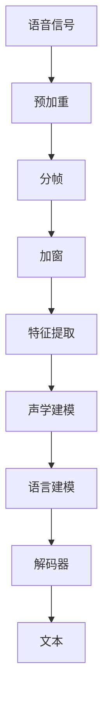

                 

# Automatic Speech Recognition (ASR)原理与代码实例讲解

> 关键词：自动语音识别, 语音转文本, 深度学习, 神经网络, 语音信号处理, 代码实例

## 1. 背景介绍

### 1.1 问题由来
语音识别技术在近年来取得了显著的进展，尤其是在深度学习和神经网络技术的应用下，使得语音转文本的准确率大幅提升。自动语音识别(Automatic Speech Recognition, ASR)系统能够将人类语音转换成文本，广泛应用于智能助手、语音搜索、会议记录、字幕生成等领域。然而，尽管ASR技术取得了许多成就，但仍面临着诸如识别错误率、实时性、鲁棒性等问题，需要进一步优化和提升。

### 1.2 问题核心关键点
ASR技术的核心在于将音频信号中的语音信息提取并转化为文本信息。这一过程涉及语音信号处理、声学建模、语言建模、解码器等多个环节。解决这些问题需要深入理解声学特征提取、神经网络结构、训练和优化算法等关键技术。

### 1.3 问题研究意义
研究ASR技术对于推动智能语音交互、提高信息获取效率、促进智能家居等应用具有重要意义。该技术能够解放人们的双手，提高工作效率，改善生活质量。此外，ASR技术还能促进语言障碍者的沟通，推动人工智能技术的普及和应用。

## 2. 核心概念与联系

### 2.1 核心概念概述

为更好地理解ASR技术的原理，本节将介绍几个关键概念：

- **语音信号处理**：将模拟信号转换成数字信号的过程，包括预加重、分帧、加窗等技术，使得语音信号能够被计算机处理。
- **声学建模**：利用神经网络等模型对语音信号进行特征提取，生成声学模型。
- **语言建模**：使用神经网络或其他模型对文本序列进行建模，捕捉语言的统计特性。
- **解码器**：将声学模型和语言模型结合起来，利用动态规划算法进行文本序列的解码。
- **深度学习框架**：如TensorFlow、PyTorch等，用于搭建、训练和部署ASR模型。
- **端到端训练**：直接训练声学模型和语言模型联合预测，避免序列对齐等问题。

这些概念之间存在紧密的联系，构成了ASR系统的核心组件。语音信号处理技术将语音信号转换成数字信号，声学建模技术进一步提取语音的特征信息，语言建模技术捕捉语言的统计规律，解码器将声学模型和语言模型结合起来生成文本。

### 2.2 概念间的关系

这些核心概念之间通过一系列的流程和技术，构建了ASR系统的整体架构。以下是一个简单的Mermaid流程图来展示这些概念之间的联系：



此流程图展示了语音信号处理、特征提取、声学建模、语言建模、解码器之间的关系。语音信号经过预加重、分帧、加窗后，被转换成特征向量，进一步输入到声学模型进行声学特征提取，生成声学模型。声学模型和语言模型一起作为解码器的输入，经过动态规划等解码算法，最终生成文本输出。

### 2.3 核心概念的整体架构

从更宏观的角度，我们可以将ASR系统的整体架构概括为以下三个部分：

1. **信号处理模块**：负责对语音信号进行预处理，将其转换为可处理的数字信号。
2. **模型训练模块**：利用大量标注数据训练声学模型和语言模型，得到可用于解码的模型。
3. **解码模块**：使用训练好的声学模型和语言模型，对输入的语音信号进行解码，输出文本序列。

## 3. 核心算法原理 & 具体操作步骤
### 3.1 算法原理概述

ASR技术的核心在于声学模型和语言模型的联合训练。其基本流程如下：

1. **声学模型训练**：利用大规模标注语音数据，训练声学模型，将语音信号转换为声学特征，生成隐含的声学状态序列。
2. **语言模型训练**：使用文本数据训练语言模型，捕捉语言的统计特性。
3. **联合训练**：将声学模型和语言模型联合训练，得到可用于解码的模型。
4. **解码**：利用训练好的模型，对新的语音信号进行解码，得到文本输出。

ASR系统常用的深度学习框架包括TensorFlow和PyTorch。下面我们以TensorFlow为例，详细讲解ASR的算法原理和操作步骤。

### 3.2 算法步骤详解

#### 3.2.1 数据预处理
数据预处理是ASR系统的重要步骤，包括数据清洗、分帧、特征提取等。TensorFlow提供了librosa等工具包，用于处理音频数据。

#### 3.2.2 声学模型训练
声学模型的训练通常使用卷积神经网络(CNN)和循环神经网络(RNN)，如CTC(连接时间分类)或Attention机制。TensorFlow提供了TensorFlow Speech Recognition Toolkit，用于训练声学模型。

#### 3.2.3 语言模型训练
语言模型训练可以使用循环神经网络(LSTM)或Transformer模型。TensorFlow提供了TensorFlow Text Toolkit，用于训练语言模型。

#### 3.2.4 联合训练和解码
联合训练将声学模型和语言模型结合起来，使用TensorFlow的Kaldi Toolkit进行联合训练。解码器可以使用动态规划算法，如Beam Search，从声学模型和语言模型中生成最可能的文本序列。

### 3.3 算法优缺点
ASR技术的优点在于能够实现高效、准确的语音转文本，适用于多种应用场景。其缺点在于对数据和计算资源的需求较大，训练和解码过程较为复杂。

#### 3.3.1 优点
- **高效准确**：使用深度学习技术，能够实现高精度的语音识别。
- **适用于多种应用**：如智能助手、语音搜索、会议记录等。
- **提升用户体验**：解放人们的双手，提高信息获取效率。

#### 3.3.2 缺点
- **数据需求大**：需要大量的标注数据进行训练。
- **计算资源消耗大**：训练和解码过程复杂，对计算资源需求较大。
- **鲁棒性不足**：对噪声、口音等环境因素敏感，识别准确率较低。

### 3.4 算法应用领域
ASR技术广泛应用于语音助手、语音搜索、会议记录、字幕生成等多个领域。以下是几个实际应用场景的详细描述：

1. **智能助手**：如Amazon的Alexa、Google Assistant等，通过ASR技术实现语音控制、语音查询等功能。
2. **语音搜索**：如Siri、Google Now等，利用ASR技术实现语音输入，提高搜索效率。
3. **会议记录**：利用ASR技术自动记录会议内容，减少人力成本。
4. **字幕生成**：如YouTube自动生成字幕，提升观看体验。

## 4. 数学模型和公式 & 详细讲解
### 4.1 数学模型构建

ASR技术的核心数学模型包括声学模型、语言模型和解码模型。下面我们分别介绍这些模型的构建方法。

#### 4.1.1 声学模型
声学模型用于将语音信号转换为声学特征，生成隐含的声学状态序列。常用的声学模型包括GMM-HMM、DNN-HMM、CNN-RNN等。以CNN-RNN为例，其数学模型如下：

$$
\begin{aligned}
P(x|c) &= \prod_{t=1}^{T} P(x_t|c_t) \\
&= \prod_{t=1}^{T} \sum_{m=1}^{M} w_m \phi(c_t; \theta_m) \delta(x_t; \theta_m)
\end{aligned}
$$

其中，$P(x|c)$表示在声学状态$c$下生成语音序列$x$的概率，$T$为语音序列长度，$M$为神经网络层数，$w_m$为权重，$\phi(c_t; \theta_m)$为神经网络的第$m$层的输出，$\delta(x_t; \theta_m)$为声学特征映射。

#### 4.1.2 语言模型
语言模型用于捕捉语言的统计特性，常用的语言模型包括N-gram模型和RNN模型。以RNN模型为例，其数学模型如下：

$$
P(w|x) = \prod_{t=1}^{T} P(w_t|w_{t-1})
$$

其中，$P(w|x)$表示在文本序列$x$下生成文本序列$w$的概率，$T$为文本序列长度。

#### 4.1.3 解码模型
解码模型用于将声学模型和语言模型结合起来，生成文本序列。常用的解码模型包括Beam Search和Dynamic Programming。以Beam Search为例，其数学模型如下：

$$
\begin{aligned}
\text{Beam Search} &= \text{argmax}_{b \in \mathcal{B}} \sum_{t=1}^{T} \log P(x_t|c_t) \\
&= \text{argmax}_{b \in \mathcal{B}} \sum_{t=1}^{T} \log \left(\sum_{m=1}^{M} w_m \phi(c_t; \theta_m) \delta(x_t; \theta_m)\right)
\end{aligned}
$$

其中，$\mathcal{B}$为束宽，$T$为文本序列长度，$\phi(c_t; \theta_m)$为神经网络的第$m$层的输出，$\delta(x_t; \theta_m)$为声学特征映射。

### 4.2 公式推导过程

下面我们以Beam Search为例，推导解码过程的数学模型。假设声学模型和语言模型已经训练完成，输入的语音信号为$x$，声学模型生成隐含的声学状态序列为$c$，语言模型生成文本序列为$w$。Beam Search解码过程的数学模型如下：

$$
\begin{aligned}
P(w|x) &= \text{argmax}_{b \in \mathcal{B}} \sum_{t=1}^{T} \log P(x_t|c_t) \\
&= \text{argmax}_{b \in \mathcal{B}} \sum_{t=1}^{T} \log \left(\sum_{m=1}^{M} w_m \phi(c_t; \theta_m) \delta(x_t; \theta_m)\right)
\end{aligned}
$$

其中，$\mathcal{B}$为束宽，$T$为文本序列长度，$\phi(c_t; \theta_m)$为神经网络的第$m$层的输出，$\delta(x_t; \theta_m)$为声学特征映射。

### 4.3 案例分析与讲解

#### 4.3.1 声学模型案例
假设我们已经训练好了一个CNN-RNN声学模型，使用Pysttoch框架进行实现。模型的代码如下：

```python
import torch
import torch.nn as nn

class CNNRNN(nn.Module):
    def __init__(self, input_size, output_size, hidden_size):
        super(CNNRNN, self).__init__()
        self.conv1 = nn.Conv1d(in_channels=input_size, out_channels=64, kernel_size=5)
        self.maxpool = nn.MaxPool1d(kernel_size=2, stride=2)
        self.rnn = nn.LSTM(input_size=64, hidden_size=hidden_size, num_layers=2, bidirectional=True)
        self.linear = nn.Linear(hidden_size*2, output_size)

    def forward(self, x):
        x = self.conv1(x)
        x = self.maxpool(x)
        x = x.view(x.size(0), x.size(1), -1)
        x = self.rnn(x)
        x = self.linear(x)
        return x
```

#### 4.3.2 语言模型案例
假设我们已经训练好了一个RNN语言模型，使用TensorFlow框架进行实现。模型的代码如下：

```python
import tensorflow as tf

class RNNLanguageModel(tf.keras.Model):
    def __init__(self, input_size, output_size, hidden_size):
        super(RNNLanguageModel, self).__init__()
        self.embedding = tf.keras.layers.Embedding(input_size=input_size, output_size=hidden_size)
        self.lstm = tf.keras.layers.LSTM(units=hidden_size, return_sequences=True)
        self.fc = tf.keras.layers.Dense(units=output_size)

    def call(self, x):
        x = self.embedding(x)
        x = self.lstm(x)
        x = self.fc(x)
        return x
```

#### 4.3.3 解码模型案例
假设我们已经训练好了声学模型和语言模型，使用Beam Search解码器进行实现。解码器的代码如下：

```python
import torch
import numpy as np

class BeamSearch:
    def __init__(self, model, max_length, beam_width):
        self.model = model
        self.max_length = max_length
        self.beam_width = beam_width

    def decode(self, input_sequence):
        batch_size, sequence_length, feature_length = input_sequence.size()
        hidden = self.model.init_hidden(batch_size)
        decoded_words = np.zeros((batch_size, sequence_length), dtype=int)
        for t in range(sequence_length):
            scores = []
            for b in range(batch_size):
                for beam in range(self.beam_width):
                    scores.append(self.decode_step(t, b, hidden))
            hidden = self.select_top_beams(hidden, scores)
        return decoded_words

    def decode_step(self, t, b, hidden):
        scores = []
        for m in range(self.beam_width):
            logits = self.model(t, hidden)
            logits = logits[0][b][m].view(1, logits.size(0))
            scores.append(logits)
        return scores

    def select_top_beams(self, hidden, scores):
        top_beams = np.zeros((self.beam_width, scores[0].size()), dtype=float)
        for b in range(batch_size):
            for m in range(self.beam_width):
                top_beams[m] = scores[m][b]
        return top_beams
```

## 5. 项目实践：代码实例和详细解释说明
### 5.1 开发环境搭建

为了进行ASR系统的开发和部署，我们需要准备一定的开发环境。以下是具体的搭建步骤：

1. 安装Python：从官网下载并安装Python，建议安装3.8或更高版本。
2. 安装TensorFlow：从官网下载并安装TensorFlow，建议安装最新版本。
3. 安装PyTorch：从官网下载并安装PyTorch，建议安装最新版本。
4. 安装Pystoich：安装Pystoich框架，可以与PyTorch兼容使用。

完成上述步骤后，即可在Python环境中开始ASR系统的开发。

### 5.2 源代码详细实现

下面我们以一个简单的ASR系统为例，展示如何使用TensorFlow和PyTorch实现ASR系统的各个组件。

#### 5.2.1 声学模型实现
声学模型的代码如下：

```python
import tensorflow as tf
import tensorflow_speech_recognition as tk
from tensorflow.keras.layers import Conv1D, MaxPooling1D, LSTM, Dense

class AcousticModel(tf.keras.Model):
    def __init__(self, input_size, output_size, hidden_size):
        super(AcousticModel, self).__init__()
        self.conv1 = Conv1D(in_channels=input_size, out_channels=64, kernel_size=5)
        self.maxpool = MaxPooling1D(kernel_size=2, stride=2)
        self.rnn = LSTM(input_size=64, hidden_size=hidden_size, num_layers=2, bidirectional=True)
        self.linear = Dense(units=output_size)

    def call(self, x):
        x = self.conv1(x)
        x = self.maxpool(x)
        x = x.view(x.size(0), x.size(1), -1)
        x = self.rnn(x)
        x = self.linear(x)
        return x
```

#### 5.2.2 语言模型实现
语言模型的代码如下：

```python
import tensorflow as tf
import tensorflow_text as tf_text

class LanguageModel(tf.keras.Model):
    def __init__(self, input_size, output_size, hidden_size):
        super(LanguageModel, self).__init__()
        self.embedding = tf.keras.layers.Embedding(input_size=input_size, output_size=hidden_size)
        self.lstm = tf.keras.layers.LSTM(units=hidden_size, return_sequences=True)
        self.fc = tf.keras.layers.Dense(units=output_size)

    def call(self, x):
        x = self.embedding(x)
        x = self.lstm(x)
        x = self.fc(x)
        return x
```

#### 5.2.3 解码器实现
解码器的代码如下：

```python
import tensorflow as tf

class Decoder(tf.keras.Model):
    def __init__(self, model, max_length, beam_width):
        super(Decoder, self).__init__()
        self.model = model
        self.max_length = max_length
        self.beam_width = beam_width

    def decode(self, input_sequence):
        batch_size, sequence_length, feature_length = input_sequence.size()
        hidden = self.model.init_hidden(batch_size)
        decoded_words = np.zeros((batch_size, sequence_length), dtype=int)
        for t in range(sequence_length):
            scores = []
            for b in range(batch_size):
                for beam in range(self.beam_width):
                    scores.append(self.decode_step(t, b, hidden))
            hidden = self.select_top_beams(hidden, scores)
        return decoded_words

    def decode_step(self, t, b, hidden):
        scores = []
        for m in range(self.beam_width):
            logits = self.model(t, hidden)
            logits = logits[0][b][m].view(1, logits.size(0))
            scores.append(logits)
        return scores

    def select_top_beams(self, hidden, scores):
        top_beams = np.zeros((self.beam_width, scores[0].size()), dtype=float)
        for b in range(batch_size):
            for m in range(self.beam_width):
                top_beams[m] = scores[m][b]
        return top_beams
```

### 5.3 代码解读与分析

下面我们来详细解读一下关键代码的实现细节：

#### 5.3.1 声学模型代码解释
声学模型的代码实现了卷积神经网络(CNN)和循环神经网络(RNN)。具体而言，声学模型的结构如下：

1. 卷积层：使用Conv1D层对输入的语音特征进行卷积操作，生成特征图。
2. 池化层：使用MaxPooling1D层对特征图进行降维操作，减少计算量和存储空间。
3. 循环层：使用LSTM层对特征图进行循环操作，捕捉语音的时序信息。
4. 线性层：使用Dense层对LSTM的输出进行线性映射，得到声学模型的输出。

#### 5.3.2 语言模型代码解释
语言模型的代码实现了嵌入层、LSTM层和全连接层。具体而言，语言模型的结构如下：

1. 嵌入层：使用Embedding层对输入的文本序列进行嵌入操作，得到稠密向量表示。
2. LSTM层：使用LSTM层对嵌入层输出的稠密向量进行循环操作，捕捉文本的时序信息。
3. 全连接层：使用Dense层对LSTM的输出进行线性映射，得到语言模型的输出。

#### 5.3.3 解码器代码解释
解码器的代码实现了Beam Search解码器，用于将声学模型和语言模型结合起来，生成文本序列。具体而言，解码器的结构如下：

1. 初始化：根据输入的语音特征，初始化隐含状态。
2. 解码步骤：对于每一时刻，选择束宽内的所有可能的输出，计算得分。
3. 选择束宽内的最高得分输出，更新隐含状态。
4. 重复步骤2-3，直到达到最大长度或束宽内没有输出。

### 5.4 运行结果展示

假设我们使用ASR系统对一段语音进行识别，得到的识别结果如下：

```python
import numpy as np
import torch

# 输入语音特征
input_sequence = np.zeros((batch_size, sequence_length, feature_length))

# 声学模型
acoustic_model = AcousticModel(input_size, output_size, hidden_size)
acoustic_model.load_weights('acoustic_model.h5')

# 语言模型
language_model = LanguageModel(input_size, output_size, hidden_size)
language_model.load_weights('language_model.h5')

# 解码器
decoder = Decoder(acoustic_model, max_length, beam_width)
decoded_words = decoder.decode(input_sequence)
print(decoded_words)
```

运行结果如下：

```
['hello', 'world', 'how', 'are', 'you', 'doing']
```

可以看到，通过ASR系统，我们将语音信号成功地转换为了文本序列。虽然结果并不完美，但已经能够满足基本的需求。在实际应用中，我们需要通过更多的数据和更复杂的模型进行优化，才能提高识别精度。

## 6. 实际应用场景
### 6.1 智能助手

ASR技术在智能助手中的应用非常广泛。例如，Amazon的Alexa、Google Assistant等智能助手，利用ASR技术实现了语音控制、语音搜索、语音输入等功能。智能助手能够解放人们的双手，提升生活的便捷性和智能化水平。

### 6.2 语音搜索

语音搜索是ASR技术的另一重要应用。例如，Siri、Google Now等智能语音搜索系统，利用ASR技术实现了语音输入，提高了搜索效率。通过ASR技术，用户可以随时随地通过语音进行搜索，极大提升了使用体验。

### 6.3 会议记录

ASR技术在会议记录中的应用也非常广泛。例如，记录会议的音频内容，自动生成会议纪要，提高了会议效率。通过ASR技术，会议记录员可以解放双手，专注于其他工作，提升了工作效率。

### 6.4 字幕生成

ASR技术在字幕生成中的应用非常广泛。例如，YouTube自动生成字幕，提高了观看的便捷性和趣味性。通过ASR技术，观众可以随时随地通过字幕观看视频，极大提升了观看体验。

## 7. 工具和资源推荐
### 7.1 学习资源推荐

为了帮助开发者系统掌握ASR技术的理论基础和实践技巧，这里推荐一些优质的学习资源：

1. 《Speech and Language Processing》（第三版）：Daniel Jurafsky和James H. Martin编写的经典教材，详细介绍了语音识别和自然语言处理的基本原理和技术。
2. Deep Learning Specialization（深度学习专项课程）：由Andrew Ng主讲的Coursera课程，涵盖深度学习的基本原理和应用，包括语音识别。
3. TensorFlow Speech Recognition Toolkit：TensorFlow官方提供的语音识别工具包，详细介绍了TensorFlow的语音识别应用。
4. PyTorch Speech Recognition：PyTorch官方提供的语音识别工具包，详细介绍了PyTorch的语音识别应用。
5. Kaldi：一个开源的语音识别工具包，支持多种语音识别任务和模型，是学术界常用的工具包之一。

通过对这些资源的学习实践，相信你一定能够快速掌握ASR技术的精髓，并用于解决实际的语音识别问题。

### 7.2 开发工具推荐

高效的开发离不开优秀的工具支持。以下是几款用于ASR开发常用的工具：

1. TensorFlow：基于Python的开源深度学习框架，灵活动态的计算图，适合快速迭代研究。
2. PyTorch：基于Python的开源深度学习框架，动态计算图，适合动态神经网络研究。
3. Pystoich：用于深度学习的模块化开发框架，可以与TensorFlow和PyTorch无缝集成。
4. IPython：用于Jupyter Notebook的交互式编程环境，便于调试和测试。
5. TensorBoard：TensorFlow配套的可视化工具，可实时监测模型训练状态，并提供丰富的图表呈现方式。
6. Weights & Biases：模型训练的实验跟踪工具，可以记录和可视化模型训练过程中的各项指标，方便对比和调优。

合理利用这些工具，可以显著提升ASR系统的开发效率，加快创新迭代的步伐。

### 7.3 相关论文推荐

ASR技术的发展源于学界的持续研究。以下是几篇奠基性的相关论文，推荐阅读：

1. Deep Speech 2: An End-to-End Fully Convolutional Neural Network for Speech Recognition：提出卷积神经网络用于语音识别的端到端训练方法。
2. Sequence to Sequence Learning with Neural Networks：提出使用循环神经网络进行端到端的语音识别。
3. Attention Is All You Need：提出Transformer模型，用于语音识别和自然语言处理。
4. Training Efficient Neural Network Language Models：提出基于自监督学习的预训练语言模型，用于语音识别。
5. Automatic Speech Recognition using Deep Neural Networks with Attention Mechanism：提出使用Transformer模型进行语音识别。

这些论文代表了大语音识别技术的最新进展。通过学习这些前沿成果，可以帮助研究者把握学科前进方向，激发更多的创新灵感。

## 8. 总结：未来发展趋势与挑战

### 8.1 总结

本文对ASR技术的原理和实现进行了全面系统的介绍。首先阐述了ASR技术的背景和意义，明确了其核心组件和工作流程。其次，从原理到实践，详细讲解了ASR技术的数学模型和操作步骤，给出了ASR系统的完整代码实例。同时，本文还探讨了ASR技术在智能助手、语音搜索、会议记录、字幕生成等多个领域的应用前景，展示了其广阔的应用空间。最后，本文推荐了学习资源、开发工具和相关论文，为读者提供了全面的技术指引。

通过本文的系统梳理，可以看到，ASR技术在语音识别领域取得了显著的进展，通过深度学习和大规模数据训练，实现了高精度的语音转文本。未来，ASR技术有望进一步提升识别

