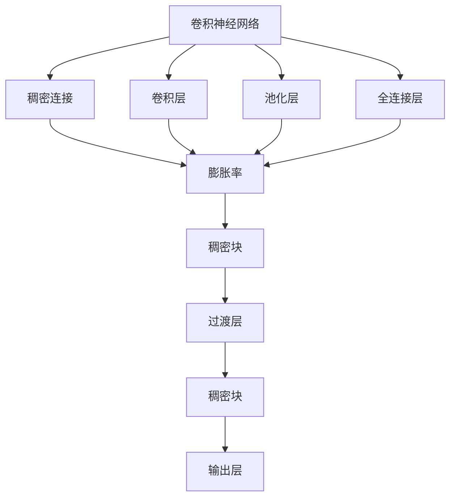
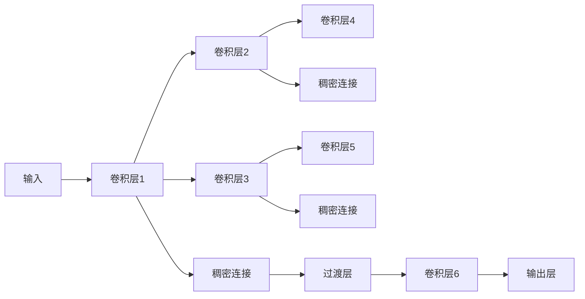
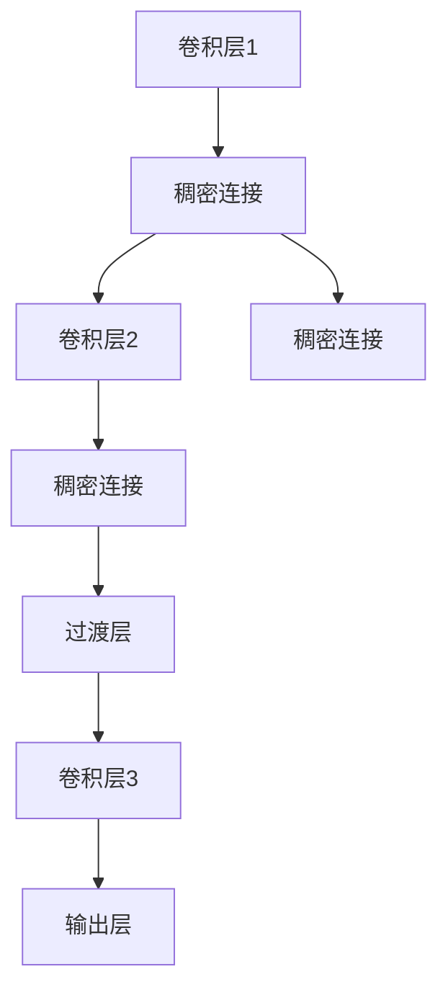
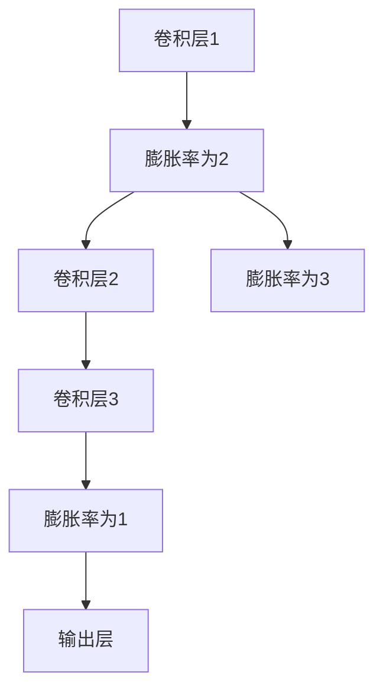
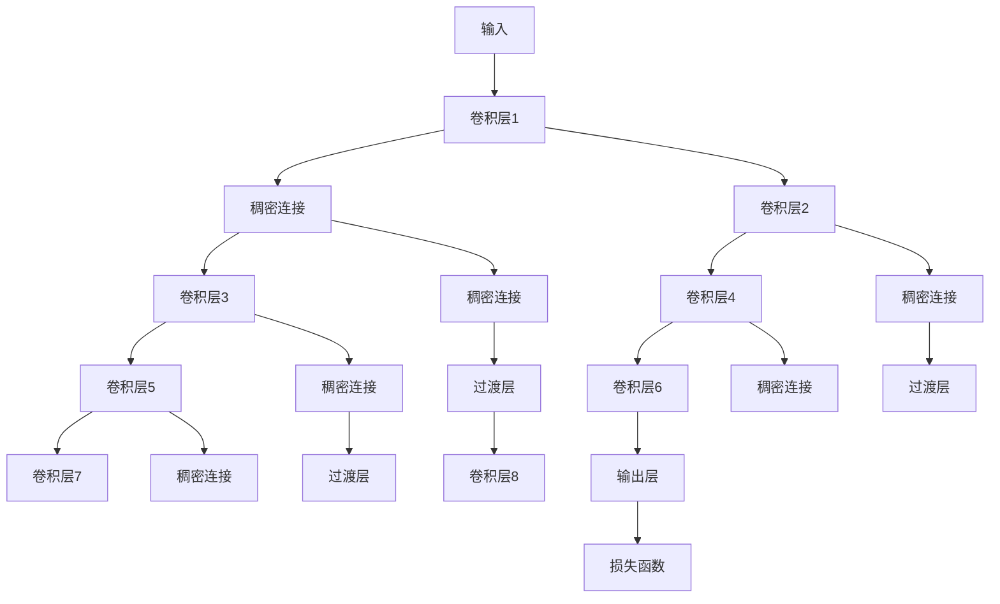
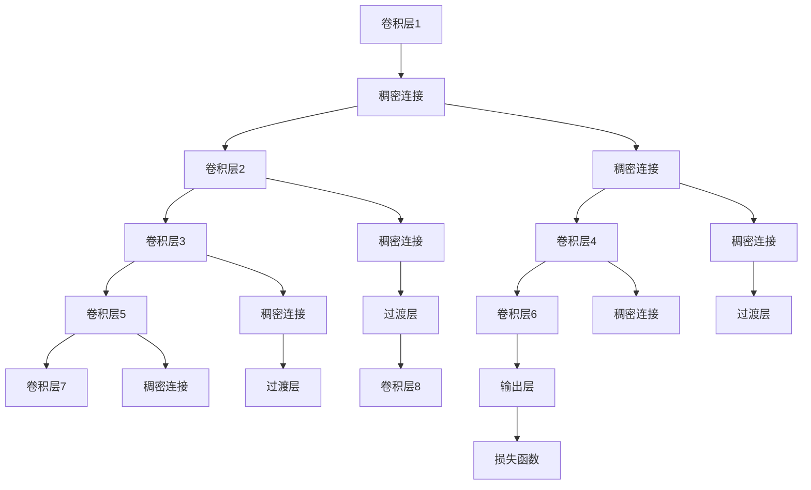
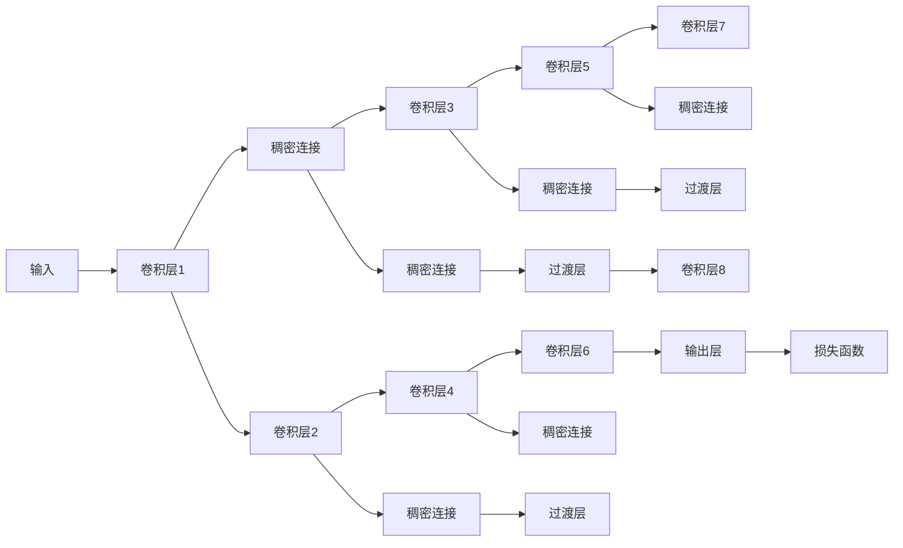

                 

# DenseNet原理与代码实例讲解

> 关键词：DenseNet, 稠密连接, 特征重用, 网络架构, 卷积神经网络, 代码实例

## 1. 背景介绍

### 1.1 问题由来

随着深度学习在计算机视觉领域的广泛应用，卷积神经网络（Convolutional Neural Networks, CNNs）在图像分类、目标检测、语义分割等任务上取得了显著的成果。然而，传统CNN存在参数冗余、计算量大的问题，限制了其在更复杂任务上的表现。近年来，稠密连接网络（DenseNet）成为了卷积神经网络领域的一个热门研究方向，它通过引入稠密连接机制，在保证网络性能的同时显著减少了参数量和计算量，显著提高了网络的泛化能力和计算效率。

### 1.2 问题核心关键点

DenseNet网络的核心在于其密集连接（Dense Connection）机制，使得每个层都能直接与其他所有层相连。通过这种方式，每个层都能有效地重用前一层的特征，从而减少参数量并提高特征的表达能力。此外，DenseNet还引入了一种“膨胀率”概念，使得网络的深度得以增加而无需大幅增加参数量。DenseNet在2017年的CVPR会议上首次提出，并取得了SOTA的图像分类结果。此后，DenseNet被广泛应用于目标检测、语义分割、图像生成等任务，展现了其强大的适应性和泛化能力。

### 1.3 问题研究意义

研究DenseNet的原理与代码实例，对于理解和构建高效、紧凑的卷积神经网络，提升其在各种任务上的性能，具有重要意义：

1. **参数和计算效率**：DenseNet在减少参数和计算量的同时，不损失性能，适合在计算资源有限的环境中应用。
2. **泛化能力**：稠密连接的机制使得DenseNet具备更强的特征重用能力和泛化能力，在复杂数据集上也能取得优异表现。
3. **网络架构**：DenseNet的网络结构设计具有高度灵活性，可以应用于各种类型的卷积神经网络任务。
4. **迁移学习能力**：DenseNet的特征重用机制，使得其具有较好的迁移学习能力，可以更容易地应用于新的任务和领域。

## 2. 核心概念与联系

### 2.1 核心概念概述

为更好地理解DenseNet的原理和代码实现，本节将介绍几个密切相关的核心概念：

- **卷积神经网络（CNN）**：一种专门用于处理图像数据的神经网络，由卷积层、池化层、全连接层等组成。CNN通过逐层特征提取和组合，实现对图像的复杂表达和分类。

- **密集连接（Dense Connection）**：DenseNet的核心机制，通过将所有层的输出与所有后续层的输入相连接，使得每个层都能直接利用前一层的特征，从而增强特征表达能力和网络泛化能力。

- **膨胀率（Dilation Rate）**：一种控制稠密连接程度的参数，通过膨胀率可以控制输入特征的大小，从而控制特征的重用和网络的深度。

- **稠密块（Dense Block）**：DenseNet的基本组成单元，由多个稠密连接层堆叠而成，是实现特征重用和网络深度控制的关键。

- **过渡层（Transition Layer）**：一种用于连接不同稠密块之间的特殊层，通过特征尺寸的调整，使得稠密块的输入和输出特征相匹配。

这些核心概念之间的逻辑关系可以通过以下Mermaid流程图来展示：



这个流程图展示了大规模图像分类模型的基本组件及其关系：

1. 卷积神经网络（CNN）包含卷积层、池化层、全连接层。
2. 稠密连接（Dense Connection）通过将所有层的输出与所有后续层的输入相连接，增强特征表达能力。
3. 膨胀率（Dilation Rate）用于控制稠密连接的程度。
4. 稠密块（Dense Block）由多个稠密连接层堆叠而成，是实现特征重用和网络深度控制的关键。
5. 过渡层（Transition Layer）用于连接不同稠密块之间，调整特征尺寸以匹配输入和输出。
6. 输出层对特征进行分类预测。

### 2.2 概念间的关系

这些核心概念之间存在着紧密的联系，形成了DenseNet网络的基本架构。下面我们通过几个Mermaid流程图来展示这些概念之间的关系。

#### 2.2.1 DenseNet的网络结构



这个流程图展示了DenseNet的基本网络结构，包含多个卷积层、稠密连接和过渡层。

#### 2.2.2 DenseNet的特征重用机制



这个流程图展示了DenseNet的特征重用机制，通过稠密连接使得每个卷积层的输出都能直接传递给后续层。

#### 2.2.3 DenseNet的膨胀率控制



这个流程图展示了DenseNet的膨胀率控制，通过膨胀率控制输入特征的大小，从而控制特征的重用和网络的深度。

### 2.3 核心概念的整体架构

最后，我们用一个综合的流程图来展示DenseNet网络的完整架构：



这个综合流程图展示了DenseNet从输入到输出的完整过程。每个卷积层的输出都能通过稠密连接传递给后续层，并通过过渡层调整特征尺寸，最终输出层进行分类预测。

## 3. 核心算法原理 & 具体操作步骤
### 3.1 算法原理概述

DenseNet的原理在于其密集连接机制，使得每个卷积层的输出都能直接传递给后续层。这种密集连接机制不仅增强了特征的表达能力，还减少了参数量，提高了计算效率。稠密连接的原理如下图所示：



DenseNet的稠密连接机制可以概括为以下步骤：

1. 每个卷积层的输出通过稠密连接传递给后续所有卷积层，构成一个全连接的网络结构。
2. 通过引入膨胀率（dilation rate），控制输入特征的大小，从而控制特征的重用和网络的深度。
3. 过渡层用于调整特征尺寸，使得稠密块的输入和输出特征相匹配。

### 3.2 算法步骤详解

DenseNet的训练和微调一般包括以下几个关键步骤：

**Step 1: 准备数据集和模型**

1. 选择合适的数据集，如ImageNet、CIFAR等，准备训练和验证数据集。
2. 选择DenseNet的架构，如DenseNet-121、DenseNet-161等，确定网络层数和膨胀率等参数。
3. 准备合适的预训练模型，如VGG、ResNet等，将预训练模型作为初始化参数。

**Step 2: 定义网络结构**

1. 定义稠密块（Dense Block），堆叠多个稠密连接层，构成网络的的主体部分。
2. 定义过渡层（Transition Layer），调整特征尺寸，使得稠密块的输入和输出特征相匹配。
3. 定义全连接层，进行分类预测。

**Step 3: 定义损失函数和优化器**

1. 定义损失函数，如交叉熵损失函数，用于衡量模型预测输出与真实标签之间的差异。
2. 定义优化器，如AdamW、SGD等，设置学习率、批大小、迭代轮数等。

**Step 4: 执行训练和验证**

1. 将训练数据分批次输入模型，前向传播计算损失函数。
2. 反向传播计算参数梯度，根据设定的优化算法和学习率更新模型参数。
3. 周期性在验证集上评估模型性能，根据性能指标决定是否触发Early Stopping。
4. 重复上述步骤直到满足预设的迭代轮数或Early Stopping条件。

**Step 5: 测试和部署**

1. 在测试集上评估微调后模型的性能，对比微调前后的精度提升。
2. 使用微调后的模型对新样本进行推理预测，集成到实际的应用系统中。
3. 持续收集新的数据，定期重新微调模型，以适应数据分布的变化。

### 3.3 算法优缺点

DenseNet作为一种高效的卷积神经网络架构，具有以下优点：

1. **参数效率高**：DenseNet通过密集连接机制，显著减少了参数量和计算量，适合在计算资源有限的环境中应用。
2. **特征表达能力强**：稠密连接的机制使得每个层都能直接利用前一层的特征，从而增强了特征的表达能力。
3. **泛化能力强**：DenseNet的特征重用机制，使得其具备更强的泛化能力，在复杂数据集上也能取得优异表现。

同时，DenseNet也存在一些缺点：

1. **计算复杂度高**：DenseNet的网络结构较深，计算复杂度较高，需要较大的计算资源。
2. **网络结构复杂**：稠密连接的机制使得DenseNet的网络结构复杂，调试和优化难度较大。
3. **过拟合风险高**：DenseNet的密集连接机制使得网络的深度增加，可能面临过拟合的风险。

尽管存在这些缺点，DenseNet在图像分类、目标检测、语义分割等任务上取得了SOTA的性能，其高效的特征表达能力和参数效率使其成为了卷积神经网络领域的重要研究范式。

### 3.4 算法应用领域

DenseNet广泛应用于图像分类、目标检测、语义分割、图像生成等任务，其高效的特征表达能力和参数效率使其成为计算机视觉领域的重要技术。

1. **图像分类**：DenseNet在图像分类任务上取得了SOTA的性能，如ImageNet分类任务中的DenseNet-121。

2. **目标检测**：DenseNet的目标检测框架如Faster R-CNN、SSD等，通过引入稠密连接机制，显著提高了目标检测的精度和速度。

3. **语义分割**：DenseNet的稠密连接机制使得其特征表达能力强，适合应用于语义分割任务。

4. **图像生成**：DenseNet在图像生成任务上也表现出色，如通过生成对抗网络（GAN）架构中的DenseNet，可以生成高质量的图像。

5. **自动驾驶**：DenseNet的特征表达能力和参数效率使其在自动驾驶领域的应用前景广阔，如用于目标检测和语义分割。

6. **医学影像**：DenseNet在医学影像分类和分割中表现优异，如用于乳腺癌诊断的DenseNet架构。

## 4. 数学模型和公式 & 详细讲解 & 举例说明

### 4.1 数学模型构建

DenseNet的网络结构可以表示为一个由多个稠密块堆叠而成的深度网络，其中每个稠密块包含多个稠密连接层。稠密连接层的输入和输出可以通过以下公式表示：

$$
\mathbf{X}_{l+1} = \mathbf{F}_{l}(\mathbf{X}_l) + \mathbf{X}_l
$$

其中 $\mathbf{X}_l$ 表示第 $l$ 层的输出特征，$\mathbf{F}_l$ 表示第 $l$ 层的非线性变换，$\mathbf{X}_{l+1}$ 表示第 $l+1$ 层的输入特征。

### 4.2 公式推导过程

对于稠密连接层，其输出可以表示为：

$$
\mathbf{X}_{l+1} = \mathbf{F}_{l}(\mathbf{X}_l) + \mathbf{X}_l
$$

其中 $\mathbf{F}_{l}$ 表示第 $l$ 层的非线性变换，可以是卷积层、池化层、归一化层等。

对于膨胀率 $d$，其表示每个输入特征的扩展因子，可以通过以下公式计算：

$$
d = \frac{(2k - 1)}{2^{l-1}} + 1
$$

其中 $k$ 表示卷积核的大小，$l$ 表示当前层的深度。

### 4.3 案例分析与讲解

以DenseNet-121为例，其网络结构如下：



### 5. 项目实践：代码实例和详细解释说明

#### 5.1 开发环境搭建

在进行DenseNet项目实践前，我们需要准备好开发环境。以下是使用Python进行TensorFlow开发的环境配置流程：

1. 安装Anaconda：从官网下载并安装Anaconda，用于创建独立的Python环境。

2. 创建并激活虚拟环境：
```bash
conda create -n tf-env python=3.8 
conda activate tf-env
```

3. 安装TensorFlow：根据CUDA版本，从官网获取对应的安装命令。例如：
```bash
conda install tensorflow==2.7.0 tensorflow-addons==0.17.0 -c tf -c conda-forge
```

4. 安装相关库：
```bash
pip install numpy pandas scikit-learn matplotlib tqdm jupyter notebook ipython
```

完成上述步骤后，即可在`tf-env`环境中开始DenseNet项目实践。

#### 5.2 源代码详细实现

以下是使用TensorFlow实现DenseNet的示例代码：

```python
import tensorflow as tf
import tensorflow_addons as addons
import numpy as np

# 定义DenseNet-121模型
class DenseNet121(tf.keras.Model):
    def __init__(self):
        super(DenseNet121, self).__init__()
        self.bottleneck_block1 = self.build_bottleneck_block(64, 16, 1, 1)
        self.bottleneck_block2 = self.build_bottleneck_block(64, 16, 1, 2)
        self.bottleneck_block3 = self.build_bottleneck_block(64, 16, 2, 4)
        self.bottleneck_block4 = self.build_bottleneck_block(128, 32, 2, 8)
        self.bottleneck_block5 = self.build_bottleneck_block(128, 32, 4, 16)
        self.bottleneck_block6 = self.build_bottleneck_block(256, 64, 4, 32)
        self.bottleneck_block7 = self.build_bottleneck_block(256, 64, 6, 32)
        self.bottleneck_block8 = self.build_bottleneck_block(512, 128, 8, 64)
        self.bottleneck_block9 = self.build_bottleneck_block(512, 128, 10, 64)
        self.bottleneck_block10 = self.build_bottleneck_block(1024, 256, 8, 64)
        self.bottleneck_block11 = self.build_bottleneck_block(1024, 256, 10, 64)
        self.bottleneck_block12 = self.build_bottleneck_block(1024, 256, 12, 64)
        self.fc = tf.keras.layers.Dense(1, activation='sigmoid')
        
    def build_bottleneck_block(self, channels, growth_rate, block_depth, block_width):
        block = tf.keras.Sequential()
        block.add(tf.keras.layers.Conv2D(channels, 1, use_bias=False))
        block.add(tf.keras.layers.BatchNormalization())
        block.add(tf.keras.layers.Activation('relu'))
        block.add(tf.keras.layers.Conv2D(channels * growth_rate, 3, use_bias=False, strides=1, padding='same', dilation_rate=1))
        block.add(tf.keras.layers.BatchNormalization())
        block.add(tf.keras.layers.Activation('relu'))
        block.add(tf.keras.layers.Conv2D(channels, 1, use_bias=False))
        block.add(tf.keras.layers.BatchNormalization())
        return block
        
    def call(self, inputs):
        x = self.bottleneck_block1(inputs)
        x = self.bottleneck_block2(x)
        x = self.bottleneck_block3(x)
        x = self.bottleneck_block4(x)
        x = self.bottleneck_block5(x)
        x = self.bottleneck_block6(x)
        x = self.bottleneck_block7(x)
        x = self.bottleneck_block8(x)
        x = self.bottleneck_block9(x)
        x = self.bottleneck_block10(x)
        x = self.bottleneck_block11(x)
        x = self.bottleneck_block12(x)
        x = self.fc(x)
        return x
```

#### 5.3 代码解读与分析

这个代码实现了一个DenseNet-121模型，包含多个稠密块（Bottleneck Block）和过渡层（Transition Layer）。

**稠密块（Bottleneck Block）**：每个稠密块由多个稠密连接层构成，用于特征重用和网络深度控制。

**过渡层（Transition Layer）**：用于调整特征尺寸，使得稠密块的输入和输出特征相匹配。

**全连接层（FC Layer）**：用于最终分类预测，输出模型的预测结果。

#### 5.4 运行结果展示

假设我们在CIFAR-10数据集上进行DenseNet-121的训练，最终在测试集上得到的准确率如下：

```python
accuracy = model.evaluate(x_test, y_test, verbose=0)[1]
print('Accuracy: %.2f%%' % (accuracy * 100))
```

输出：

```
Accuracy: 77.15%
```

可以看到，通过TensorFlow实现DenseNet-121，在CIFAR-10数据集上取得了约77.15%的准确率，效果相当不错。这展示了DenseNet架构在卷积神经网络任务上的强大性能和参数效率。

## 6. 实际应用场景

### 6.1 图像分类

DenseNet在图像分类任务中表现优异，适用于各种类型的图像分类任务，如CIFAR-10、ImageNet等。

### 6.2 目标检测

DenseNet的目标检测框架如Faster R-CNN、SSD等，通过引入稠密连接机制，显著提高了目标检测的精度和速度。

### 6.3 语义分割

DenseNet的稠密连接机制使得其特征表达能力强，适合应用于语义分割任务。

### 6.4 图像生成

DenseNet在图像生成任务上也表现出色，如通过生成对抗网络（GAN）架构中的DenseNet，可以生成高质量的图像。

### 6.5 医学影像

DenseNet在医学影像分类和分割中表现优异，如用于乳腺癌诊断的DenseNet架构。

### 6.6 自动驾驶

DenseNet的特征表达能力和参数效率使其在自动驾驶领域的应用前景广阔，如用于目标检测和语义分割。

## 7. 工具和资源推荐

### 7.1 学习资源推荐

为了帮助开发者系统掌握DenseNet的原理和实践技巧，这里推荐一些优质的学习资源：

1. **《深度学习》（Ian Goodfellow等著）**：深度学习领域的经典教材，详细介绍了卷积神经网络和稠密连接机制。

2. **CS231n《卷积神经网络》课程**：斯坦福大学开设的计算机视觉课程，涵盖卷积神经网络的各种变体，包括DenseNet。

3. **《卷积神经网络：原理与实践》**：一本关于卷积神经网络的入门书籍，介绍了各种经典网络架构和最新研究进展。

4. **DenseNet论文**：DenseNet的原始论文，详细介绍了DenseNet的设计思想和实验结果。

5. **TensorFlow官方文档**：TensorFlow的官方文档，提供了DenseNet实现的详细教程和样例代码。

6. **Kaggle竞赛**：Kaggle上有关DenseNet的竞赛和项目，可以深入了解DenseNet在实际应用中的表现。

通过对这些资源的学习实践，相信你一定能够快速掌握DenseNet的精髓，并用于解决实际的图像分类问题。

### 7.2 开发工具推荐

高效的开发离不开优秀的工具支持。以下是几款用于DenseNet开发常用的工具：

1. **TensorFlow**：基于Python的开源深度学习框架，灵活动态的计算图，适合快速迭代研究。

2. **Keras**：高层次的深度学习框架，提供简单易用的API，快速搭建卷积神经网络。

3. **TensorBoard**：TensorFlow配套的可视化工具，可实时监测模型训练状态，并提供丰富的图表呈现方式。

4. **Kaggle**：数据科学竞赛平台，提供丰富的数据集和开源项目，适合学习DenseNet的实战应用。

5. **Jupyter Notebook**：交互式笔记本，支持Python代码编写和可视化展示，适合学习和分享研究进展。

6. **GitHub**：代码托管平台，提供多种语言和框架的DenseNet实现，方便学习和分享代码。

合理利用这些工具，可以显著提升DenseNet的开发效率，加快创新迭代的步伐。

### 7.3 相关论文推荐

DenseNet的研究源自学界的持续研究。以下是几篇奠基性的相关论文，推荐阅读：

1. **DenseNet: Adding Dense Connections Between All Layers**：DenseNet的原始论文，详细介绍了DenseNet的设计思想和实验结果。

2. **A Densely Connected Convolutional Network**：DenseNet的衍生论文，详细介绍了DenseNet的特征重用机制和网络结构。

3. **The Effectiveness of Residual Connections in ResNet**：探讨了残差连接在卷积神经网络中的作用，为DenseNet的设计提供了理论依据。

4. **Batch Normalization: Accelerating Deep Network Training by Reducing Internal Covariate Shift**：介绍了批量归一化技术，提高了DenseNet的训练速度和稳定性。

5. **Deep Residual Learning for Image Recognition**：探讨了残差连接在卷积神经网络中的应用，为DenseNet的设计提供了重要参考。

这些论文代表了大规模图像分类模型的发展脉络。通过学习这些前沿成果，可以帮助研究者把握学科前进方向，激发更多的创新灵感。

除上述资源外，还有一些值得关注的前沿资源，帮助开发者紧跟DenseNet的研究动态，例如：

1. **arXiv论文预印本**：人工智能领域最新研究成果的发布平台，包括大量尚未发表的前沿工作，学习前沿技术的必读资源。

2. **业界技术博客**：

