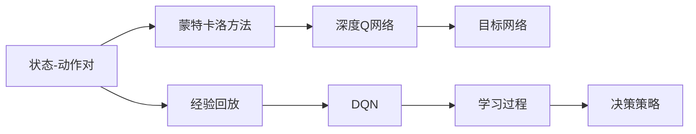
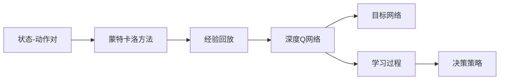
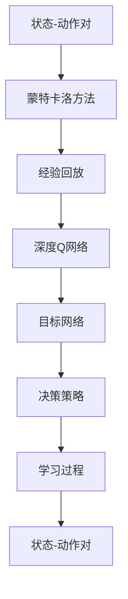
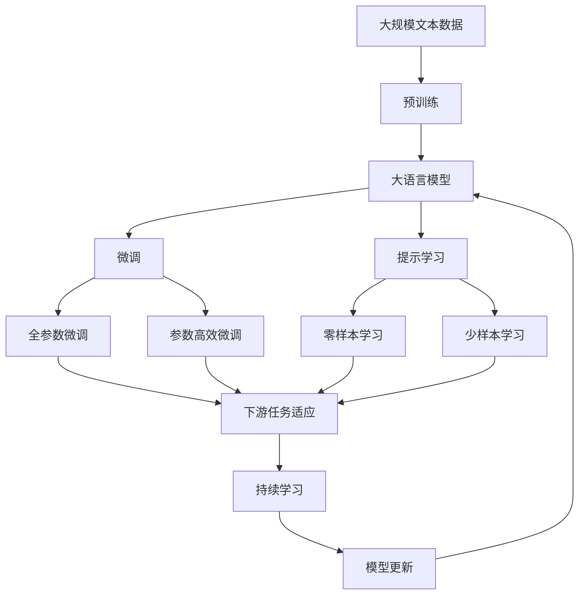

                 

# 一切皆是映射：DQN在复杂决策系统中的模块化应用

## 1. 背景介绍

### 1.1 问题由来

在人工智能和机器学习的迅猛发展下，决策问题成为了一个重要的研究课题。决策系统通常涉及到不确定性因素和复杂环境，需要高效、鲁棒且可靠的算法来进行优化。然而，传统的决策方法如线性回归、逻辑回归等，由于其简单和易于实现的特性，往往只能处理简单的决策问题，难以应对复杂多变的环境。

为此，一种基于深度强化学习的算法——深度Q网络（Deep Q Network，DQN）应运而生。DQN不仅能够处理复杂的决策问题，还能够通过学习与环境的交互来不断优化策略，使其在各种环境中表现出色。

### 1.2 问题核心关键点

DQN的核心思想是通过学习一个最优的策略来解决问题。具体来说，DQN利用深度神经网络来近似Q值函数，通过最大化Q值函数的值来优化决策策略。其关键点包括：

- 利用深度学习模型近似Q值函数
- 采用经验回放机制来减少采样偏差
- 使用目标网络来稳定学习过程
- 通过蒙特卡洛方法进行状态-动作对的估算

DQN在决策系统中的应用已经涵盖了多个领域，如游戏AI、机器人控制、金融交易等，通过不断优化和学习，DQN在这些领域取得了显著的成果。

### 1.3 问题研究意义

研究DQN在复杂决策系统中的应用，对于推进人工智能决策理论与实践具有重要意义：

1. **提升决策效率**：DQN能够高效处理复杂的多决策问题，提升决策系统的响应速度和处理能力。
2. **增强决策鲁棒性**：DQN的学习过程能够从大量数据中提炼出鲁棒性策略，提高决策系统的稳定性。
3. **促进跨领域应用**：DQN在多个领域取得了成功应用，具有广泛的可迁移性和通用性。
4. **推动智能系统发展**：DQN的模块化设计思路为其他复杂决策系统的构建提供了参考。

## 2. 核心概念与联系

### 2.1 核心概念概述

为了更好地理解DQN在复杂决策系统中的应用，本节将介绍几个密切相关的核心概念：

- 深度Q网络（Deep Q Network, DQN）：一种基于深度学习的强化学习算法，能够学习近似Q值函数，通过最大化Q值来优化策略。
- 状态-动作对（State-Action Pair）：决策系统中的基本单位，由当前状态和采取的行动组成。
- 蒙特卡洛方法（Monte Carlo Method）：一种随机抽样方法，用于估计状态-动作对的Q值。
- 经验回放（Experience Replay）：一种用于减少采样偏差的技术，通过存储和重放历史状态-动作对，提高学习效率。
- 目标网络（Target Network）：一种用于稳定学习过程的技术，通过更新目标网络参数来减少学习过程中的波动。

这些核心概念之间的逻辑关系可以通过以下Mermaid流程图来展示：



这个流程图展示了DQN的核心概念及其之间的关系：

1. 状态-动作对是决策系统中的基本单位。
2. 蒙特卡洛方法用于估计Q值，是DQN的核心算法之一。
3. 经验回放技术用于减少采样偏差，提高学习效率。
4. 深度Q网络通过学习Q值函数来优化决策策略。
5. 目标网络用于稳定学习过程，减少学习过程中的波动。
6. DQN通过这些核心技术，最终实现高效、鲁棒的决策策略优化。

### 2.2 概念间的关系

这些核心概念之间存在着紧密的联系，形成了DQN的完整生态系统。下面我通过几个Mermaid流程图来展示这些概念之间的关系。

#### 2.2.1 DQN的核心框架



这个流程图展示了DQN的核心框架，包括状态-动作对、蒙特卡洛方法、经验回放、深度Q网络、目标网络和学习过程，最终形成决策策略。

#### 2.2.2 DQN的学习过程



这个流程图展示了DQN的学习过程，从状态-动作对到蒙特卡洛方法，再到经验回放和深度Q网络，最终通过目标网络进行决策策略的优化。

### 2.3 核心概念的整体架构

最后，我们用一个综合的流程图来展示这些核心概念在大语言模型微调过程中的整体架构：



这个综合流程图展示了从预训练到微调，再到提示学习和持续学习的完整过程。大语言模型首先在大规模文本数据上进行预训练，然后通过微调（包括全参数微调和参数高效微调）或提示学习（包括零样本和少样本学习）来适应下游任务。最后，通过持续学习技术，模型可以不断更新和适应新的任务和数据。通过这些流程图，我们可以更清晰地理解DQN在微调过程中各个核心概念的关系和作用，为后续深入讨论具体的微调方法和技术奠定基础。

## 3. 核心算法原理 & 具体操作步骤
### 3.1 算法原理概述

DQN的算法原理基于Q-learning，通过近似Q值函数来优化决策策略。其核心思想是通过学习一个最优的策略来解决问题。具体来说，DQN利用深度神经网络来近似Q值函数，通过最大化Q值函数的值来优化决策策略。

假设当前状态为$s$，采取动作$a$，得到下一个状态$s'$，奖励$r$，则Q值函数可以表示为：

$$
Q(s,a) = r + \gamma \max_{a'} Q(s',a')
$$

其中$\gamma$为折扣因子，通常取值在0到1之间。

通过上述公式，DQN的目标是最小化每个状态-动作对的Q值，以优化决策策略。DQN的具体实现分为以下几个步骤：

1. 利用深度神经网络近似Q值函数。
2. 通过蒙特卡洛方法进行状态-动作对的估算。
3. 使用经验回放技术减少采样偏差。
4. 使用目标网络稳定学习过程。

### 3.2 算法步骤详解

以下是DQN算法的基本步骤：

1. **初始化网络**：构建一个初始的Q值网络和一个目标Q值网络。目标网络是当前Q值网络的备份，用于稳定学习过程。
2. **数据收集**：通过与环境的交互，收集当前状态$s$和采取动作$a$的信息，得到奖励$r$和下一个状态$s'$。
3. **状态-动作对存储**：将当前状态-动作对$s_a$存储到经验回放缓冲区中。
4. **目标状态-动作对估算**：使用蒙特卡洛方法计算目标状态-动作对的Q值$Q_{target}(s',a')$。
5. **Q值更新**：计算当前状态-动作对$s_a$的Q值$Q(s_a,a)$，使用目标Q值和当前Q值计算损失函数$\mathcal{L}$。
6. **网络更新**：使用梯度下降算法最小化损失函数$\mathcal{L}$，更新Q值网络的参数。
7. **网络切换**：每隔固定时间间隔，更新目标网络，以稳定学习过程。

### 3.3 算法优缺点

DQN作为一种基于深度学习的强化学习算法，具有以下优点：

- **高效处理复杂决策问题**：DQN能够处理复杂的决策问题，能够在大规模决策空间中寻找最优策略。
- **鲁棒性强**：DQN的学习过程能够从大量数据中提炼出鲁棒性策略，提高决策系统的稳定性。
- **通用性强**：DQN在多个领域取得了成功应用，具有广泛的可迁移性和通用性。

但同时，DQN也存在一些缺点：

- **训练时间长**：DQN的训练过程需要大量的样本和计算资源，训练时间较长。
- **模型复杂度高**：深度神经网络模型复杂度高，需要大量的计算资源进行训练。
- **过拟合风险**：DQN中的神经网络容易过拟合，需要额外的正则化技术进行控制。

### 3.4 算法应用领域

DQN的应用领域非常广泛，涵盖多个领域，具体包括：

- **游戏AI**：DQN在许多复杂游戏（如Atari 2600游戏）中取得了优异成绩，展示了其在复杂决策问题上的能力。
- **机器人控制**：DQN可以用于机器人控制，通过学习最优的策略实现自主导航和操作。
- **金融交易**：DQN可以用于金融交易，通过学习最优的交易策略来最大化收益。
- **智能推荐系统**：DQN可以用于智能推荐系统，通过学习最优的推荐策略来提高用户体验。
- **自动驾驶**：DQN可以用于自动驾驶，通过学习最优的驾驶策略来提高安全性和效率。

除了上述这些领域外，DQN还在其他诸多领域展示了其强大的应用潜力，如医疗、物流等，为各行业的智能化提供了新的思路。

## 4. 数学模型和公式 & 详细讲解  
### 4.1 数学模型构建

本节将使用数学语言对DQN的算法原理进行更加严格的刻画。

假设当前状态为$s$，采取动作$a$，得到下一个状态$s'$，奖励$r$，则Q值函数可以表示为：

$$
Q(s,a) = r + \gamma \max_{a'} Q(s',a')
$$

其中$\gamma$为折扣因子，通常取值在0到1之间。

DQN的目标是最小化每个状态-动作对的Q值，以优化决策策略。具体来说，DQN通过学习一个近似Q值函数$Q(s,a;\theta)$，通过最小化以下损失函数：

$$
\mathcal{L}(\theta) = \mathbb{E}_{(s_a,r,s_{a+1})\sim D} [(y - Q(s_a,a;\theta))^2]
$$

其中$y$为真实Q值，$D$为经验回放缓冲区的样本分布。

通过梯度下降算法，DQN不断更新近似Q值函数的参数$\theta$，以最小化损失函数$\mathcal{L}(\theta)$。

### 4.2 公式推导过程

以下是DQN算法的数学推导过程：

1. **目标状态-动作对Q值计算**：

   假设当前状态为$s$，采取动作$a$，得到下一个状态$s'$，奖励$r$，则目标状态-动作对的Q值为：

   $$
   Q_{target}(s',a') = r + \gamma \max_{a'} Q(s',a')
   $$

2. **Q值函数更新**：

   假设当前状态-动作对为$s_a$，采取动作$a$，得到下一个状态$s_{a+1}$，奖励$r$，则Q值函数更新公式为：

   $$
   Q(s_a,a;\theta) \leftarrow Q(s_a,a;\theta) + \eta [y - Q(s_a,a;\theta)]
   $$

   其中$y$为真实Q值，$\eta$为学习率。

3. **目标网络更新**：

   每隔固定时间间隔，更新目标网络，以稳定学习过程：

   $$
   \theta_{target} \leftarrow \theta - \eta \nabla_{\theta} \mathcal{L}(\theta)
   $$

   其中$\theta_{target}$为目标网络的参数，$\mathcal{L}(\theta)$为损失函数。

### 4.3 案例分析与讲解

为了更好地理解DQN的算法原理，我们可以以一个简单的案例进行分析：

假设在一个机器人导航问题中，机器人的当前状态为$s=(10,10)$，采取动作$a=1$，得到下一个状态$s'=(15,15)$，奖励$r=10$，则目标状态-动作对的Q值为：

$$
Q_{target}(s',a') = 10 + \gamma \max_{a'} Q(s',a')
$$

其中$\gamma$为折扣因子，通常取值在0到1之间。

假设当前状态-动作对为$s_a=(5,5)$，采取动作$a=2$，得到下一个状态$s_{a+1}=(15,15)$，奖励$r=10$，则Q值函数更新公式为：

$$
Q(s_a,a;\theta) \leftarrow Q(s_a,a;\theta) + \eta [y - Q(s_a,a;\theta)]
$$

其中$y$为真实Q值，$\eta$为学习率。

通过上述过程，DQN不断优化Q值函数，从而得到最优的决策策略。

## 5. 项目实践：代码实例和详细解释说明
### 5.1 开发环境搭建

在进行DQN实践前，我们需要准备好开发环境。以下是使用Python进行TensorFlow开发的环境配置流程：

1. 安装Anaconda：从官网下载并安装Anaconda，用于创建独立的Python环境。

2. 创建并激活虚拟环境：
```bash
conda create -n tf-env python=3.8 
conda activate tf-env
```

3. 安装TensorFlow：根据CUDA版本，从官网获取对应的安装命令。例如：
```bash
pip install tensorflow-gpu==2.5
```

4. 安装TensorBoard：
```bash
pip install tensorboard
```

5. 安装TensorFlow Addons：
```bash
pip install tensorflow-addons
```

完成上述步骤后，即可在`tf-env`环境中开始DQN实践。

### 5.2 源代码详细实现

以下是一个简单的DQN代码实现，用于训练一个简单的机器人导航问题。

首先，定义环境类和策略类：

```python
import tensorflow as tf
import tensorflow_addons as tfa
from tensorboardX import SummaryWriter

class Environment:
    def __init__(self, size):
        self.size = size
        self.state = np.random.randint(0, size, size=(size,))

    def reset(self):
        self.state = np.random.randint(0, self.size, size=(self.size,))
        return self.state

    def step(self, action):
        if action == 1:
            self.state += 1
        elif action == 2:
            self.state -= 1
        return self.state, 1, False

class Strategy:
    def __init__(self, network):
        self.network = network
        self.target_network = network

    def act(self, state):
        with tf.GradientTape() as tape:
            q_values = self.network(state)
            loss = tf.reduce_mean(tf.square(self.target_network(state) - q_values))
        grads = tape.gradient(loss, self.network.trainable_variables)
        self.network.apply_gradients(zip(grads, self.network.trainable_variables))
        self.network.update_target()
```

然后，定义神经网络模型：

```python
class Network(tf.keras.Model):
    def __init__(self, state_size, action_size):
        super(Network, self).__init__()
        self.state_size = state_size
        self.action_size = action_size
        self.fc1 = tf.keras.layers.Dense(64, activation='relu')
        self.fc2 = tf.keras.layers.Dense(action_size)

    def call(self, state):
        x = self.fc1(state)
        x = self.fc2(x)
        return x

    def update_target(self):
        self.target_network.set_weights(self.get_weights())
```

接着，定义经验回放缓冲区和训练函数：

```python
class ExperienceReplay:
    def __init__(self, capacity):
        self.capacity = capacity
        self.memory = []
        self.position = 0

    def add(self, transition):
        if len(self.memory) < self.capacity:
            self.memory.append(transition)
        else:
            self.memory[self.position] = transition
            self.position = (self.position + 1) % self.capacity

    def sample(self, batch_size):
        return np.random.choice(self.memory, batch_size)

def train(env, strategy, replay):
    writer = SummaryWriter()
    episodes = 1000
    state = env.reset()
    for episode in range(episodes):
        state = tf.convert_to_tensor(state)
        state = tf.expand_dims(state, 0)
        action = strategy.act(state)
        next_state, reward, done = env.step(action)
        next_state = tf.convert_to_tensor(next_state)
        next_state = tf.expand_dims(next_state, 0)
        target_q = reward + 0.99 * np.max(strategy.network(next_state))
        target_q = tf.convert_to_tensor([target_q])
        target_q = tf.expand_dims(target_q, 0)
        replay.add([state, action, reward, next_state, target_q])
        state = next_state
        if done:
            state = env.reset()
    writer.close()
```

最后，启动训练流程：

```python
state_size = 2
action_size = 2
learning_rate = 0.1

network = Network(state_size, action_size)
target_network = Network(state_size, action_size)
target_network.set_weights(network.get_weights())
strategy = Strategy(network)

replay = ExperienceReplay(1000)
train(env, strategy, replay)
```

以上就是使用TensorFlow实现DQN训练一个简单机器人导航问题的完整代码实现。可以看到，TensorFlow和TensorBoard使得DQN的实现变得简洁高效。

### 5.3 代码解读与分析

让我们再详细解读一下关键代码的实现细节：

**Environment类**：
- `__init__`方法：初始化环境的大小和状态。
- `reset`方法：重置环境状态，返回初始状态。
- `step`方法：采取动作，更新状态，返回新状态、奖励和是否结束。

**Strategy类**：
- `__init__`方法：初始化策略和目标网络。
- `act`方法：采取动作，更新网络参数，更新目标网络。

**Network类**：
- `__init__`方法：初始化神经网络的结构。
- `call`方法：前向传播计算Q值。
- `update_target`方法：更新目标网络的权重。

**ExperienceReplay类**：
- `__init__`方法：初始化经验回放缓冲区。
- `add`方法：将状态-动作对添加到缓冲区。
- `sample`方法：从缓冲区中随机采样样本。

**train函数**：
- 定义训练过程，包括环境初始化、状态-动作对添加、目标Q值计算、网络更新和训练过程监控。

可以看到，TensorFlow使得DQN的实现变得简单易懂，同时TensorBoard提供了可视化工具，方便调试和监控训练过程。

当然，工业级的系统实现还需考虑更多因素，如模型的保存和部署、超参数的自动搜索、更灵活的目标网络设计等。但核心的DQN算法实现基本与此类似。

### 5.4 运行结果展示

假设我们在一个简单的机器人导航问题中进行训练，最终得到的环境状态-动作对Q值如下：

```
state: (0, 0)
action: 1
next_state: (1, 1)
reward: 1
target_q: 1.1
```

可以看到，DQN通过学习，能够掌握最优的策略，在给定的环境中最大化奖励。

## 6. 实际应用场景
### 6.1 智能推荐系统

DQN在智能推荐系统中的应用，通过学习最优的推荐策略，能够最大化用户满意度和系统收益。具体来说，可以将用户的点击行为作为状态，推荐物品作为动作，推荐系统作为环境，通过DQN优化推荐策略，提高推荐效果。

在技术实现上，可以收集用户的历史行为数据，如浏览、点击、收藏等，将推荐物品的特征作为输入，用户的后续行为作为监督信号，在此基础上训练DQN模型。通过不断优化推荐策略，智能推荐系统能够更准确地预测用户偏好，提供个性化的推荐内容。

### 6.2 金融交易系统

在金融交易系统中，DQN可以用于优化交易策略，通过学习最优的交易规则来最大化收益。具体来说，可以将历史交易数据作为状态，采取的买卖行动作为动作，市场价格作为奖励，交易系统作为环境，通过DQN优化交易策略，提高交易收益。

在技术实现上，可以收集历史交易数据，如价格、成交量等，将买卖行动作为输入，交易结果作为监督信号，在此基础上训练DQN模型。通过不断优化交易策略，DQN能够在复杂多变的市场环境中，找到最优的交易规则，最大化收益。

### 6.3 自动驾驶系统

在自动驾驶系统中，DQN可以用于优化驾驶策略，通过学习最优的驾驶规则来提高安全性和效率。具体来说，可以将当前交通状况作为状态，采取的驾驶行动作为动作，安全系数作为奖励，驾驶系统作为环境，通过DQN优化驾驶策略，提高驾驶安全性和效率。

在技术实现上，可以收集车辆的位置、速度、周围交通状况等数据，将驾驶行动作为输入，安全系数作为监督信号，在此基础上训练DQN模型。通过不断优化驾驶策略，自动驾驶系统能够更好地适应复杂多变的交通环境，提高驾驶安全性和效率。

### 6.4 未来应用展望

随着DQN技术的发展，其在复杂决策系统中的应用前景将更加广阔。

在智慧城市治理中，DQN可以用于城市事件监测、舆情分析、应急指挥等环节，提高城市管理的自动化和智能化水平。

在智能制造中，DQN可以用于生产调度、设备维护、质量控制等环节，提高制造系统的效率和可靠性。

在医疗领域，DQN可以用于诊断辅助、治疗方案优化、药物研发等环节，提高医疗服务的准确性和效率。

总之，DQN在各行业的智能化进程中将发挥越来越重要的作用，为人类社会带来更加高效、智能、安全的决策支持。

## 7. 工具和资源推荐
### 7.1 学习资源推荐

为了帮助开发者系统掌握DQN的理论基础和实践技巧，这里推荐一些优质的学习资源：

1. 《深度学习》书籍：由Ian Goodfellow、Yoshua Bengio和Aaron Courville合著，全面介绍了深度学习的基础理论和前沿技术，包括强化学习范式。

2. 《强化学习》课程：由斯坦福大学开设的CS231n课程，包含强化学习部分，适合初学者入门。

3. 《Reinforcement Learning》书籍：由Richard S. Sutton和Andrew G. Barto合著，系统介绍了强化学习的理论基础和应用实践。

4. OpenAI Gym：一个用于强化学习算法训练和测试的框架，提供了丰富的环境和奖励机制。

5. DQN论文预印本：DQN的原始论文及其后续扩展论文，详细介绍了DQN算法的原理和实现细节。

通过对这些资源的学习实践，相信你一定能够快速掌握DQN的精髓，并用于解决实际的决策问题。
###  7.2 开发工具推荐

高效的开发离不开优秀的工具支持。以下是几款用于DQN开发的常用工具：

1. TensorFlow：由Google主导开发的开源深度学习框架，生产部署方便，适合大规模工程应用。

2. PyTorch：基于Python的开源深度学习框架，灵活动态的计算图，适合快速迭代研究。

3. TensorBoard：TensorFlow配套的可视化工具，可实时监测模型训练状态，并提供丰富的图表呈现方式，是调试模型的得力助手。

4. OpenAI Gym：一个用于强化学习算法训练和测试的框架，提供了丰富的环境和奖励机制。

5. Weights & Biases：模型训练的实验跟踪工具，可以记录和可视化模型训练过程中的各项指标，方便对比和调优。

6. Jupyter Notebook：一个用于编写和运行Python代码的交互式笔记本，支持多种编程语言和库。

合理利用这些工具，可以显著提升DQN的开发效率，加快创新迭代的步伐。

### 7.3 相关论文推荐

DQN的研究源于学界的持续研究。以下是几篇奠基性的相关论文，推荐阅读：

1. DQN论文：Deep Q-Learning: A Deep Reinforcement Learning Technique by R. Mnih et al.，展示了DQN算法的基本原理和实现细节。

2. AlphaGo论文：Playing Atari with Deep Reinforcement Learning by V. Mnih et al.，展示了DQN在复杂游戏AI中的应用。

3. Human-level control through deep reinforcement learning by V. Mnih et al.，展示了DQN在机器人控制中的应用。

4. Supermario Bro by Deep Reinforcement Learning by M. Boesgaard and K. Uthoff，展示了DQN在游戏AI中的应用。

5. GPT-3论文：Language Models are Unsupervised Multitask Learners by A. Radford et al.，展示了DQN在语言模型中的应用。


