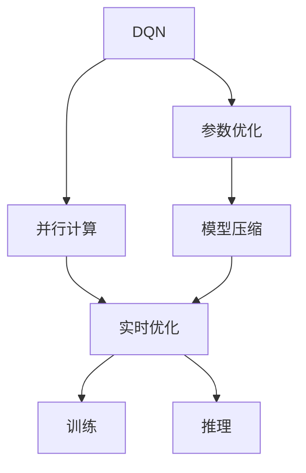
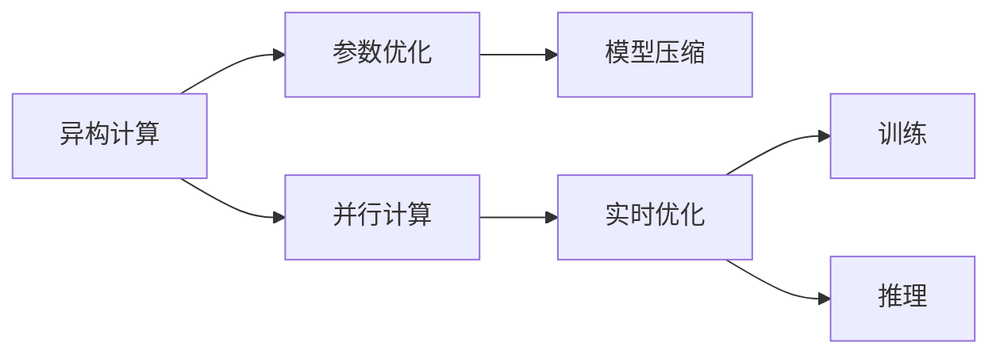
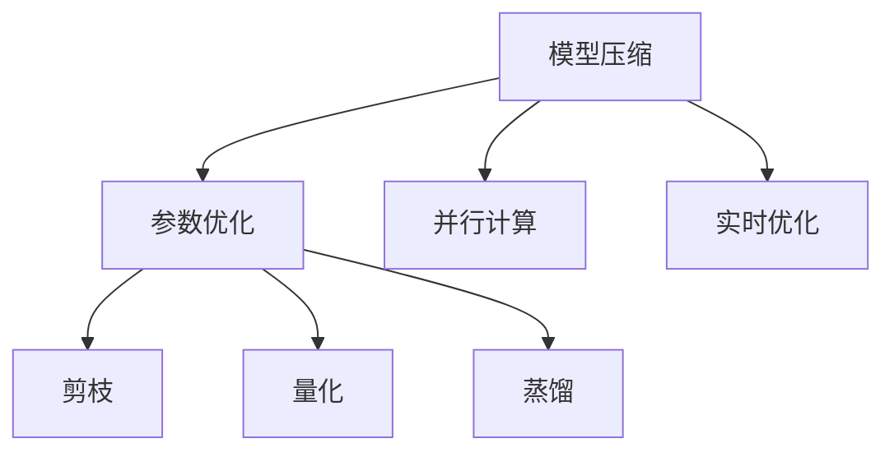
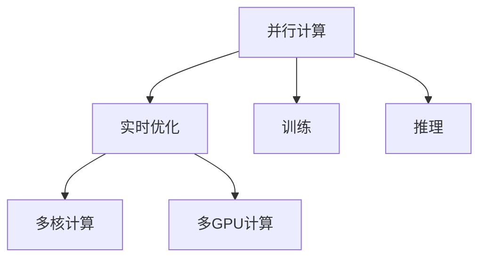
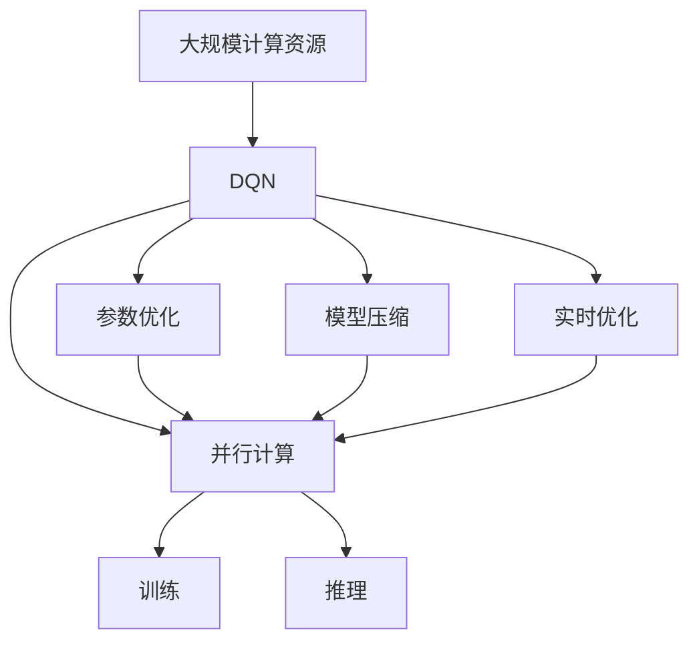

                 

# 一切皆是映射：深度Q网络DQN的异构计算优化实践

> 关键词：异构计算,深度Q网络(DQN),强化学习,参数优化,模型压缩,推理加速,并行计算

## 1. 背景介绍

### 1.1 问题由来
在人工智能领域，强化学习(Reinforcement Learning, RL)近年来因其在决策优化和智能控制等方面的卓越表现，逐渐成为解决复杂智能问题的重要手段。而深度Q网络(DQN)作为强化学习中一种基于深度神经网络实现Q值预测的算法，因其能够高效地处理高维度状态空间和动作空间，得到了广泛的应用和研究。

然而，DQN在实际应用中仍面临一些挑战。首先，DQN的计算复杂度高，参数量巨大，训练和推理时都需要占用大量的计算资源。其次，DQN的过拟合问题严重，尤其是在处理高复杂度环境时，容易陷入局部最优，难以全局优化。再次，DQN对于异构硬件的适应性较差，无法充分利用现代异构计算资源，提升模型性能。

针对这些挑战，本文聚焦于DQN的异构计算优化实践，将深度学习与异构计算技术相结合，以提升DQN在异构环境下的训练和推理性能，实现高效、低能耗、高精度的智能决策优化。

### 1.2 问题核心关键点
DQN的异构计算优化涉及多个关键点：

- 参数优化：如何在异构硬件上高效优化DQN的参数，提升训练和推理的效率。
- 模型压缩：如何通过模型压缩技术，减少DQN的参数量，提升模型的可移植性和可扩展性。
- 并行计算：如何利用异构硬件的多核、多GPU资源，实现高效的并行计算，加速DQN的训练和推理。
- 实时优化：如何在在线学习过程中，实时更新模型参数，保证模型的实时优化能力。

这些关键点相互关联，共同构成了DQN异构计算优化的全貌。以下将详细介绍这些核心概念及其在实际应用中的优化方法。

### 1.3 问题研究意义
DQN的异构计算优化，对于提升智能系统的实时性和可扩展性，具有重要意义：

1. 降低计算成本。通过参数优化、模型压缩和并行计算等技术，可以显著降低DQN的计算资源需求，降低训练和推理成本。
2. 提升模型精度。异构计算提供了多样化的计算资源，使得DQN能够充分利用这些资源，提升模型的精度和泛化能力。
3. 增强实时性。实时优化和高效的并行计算，使得DQN能够快速响应用户请求，提升系统的实时性和交互性。
4. 提高可扩展性。通过模型压缩和参数优化，DQN可以在多种硬件平台上运行，提升了系统的可移植性和可扩展性。
5. 促进创新应用。异构计算优化技术为DQN带来了新的应用场景，如自动驾驶、机器人控制等，拓宽了智能系统的应用范围。

## 2. 核心概念与联系

### 2.1 核心概念概述

为更好地理解DQN的异构计算优化，本节将介绍几个密切相关的核心概念：

- 深度Q网络(DQN)：一种基于深度神经网络实现Q值预测的强化学习算法，用于学习最优策略以最大化累积奖励。
- 异构计算：利用多样化的计算资源（如CPU、GPU、FPGA、ASIC等），实现高效、低能耗的计算。
- 参数优化：通过梯度下降、自适应学习率等技术，优化DQN的参数，提升训练和推理的效率。
- 模型压缩：通过剪枝、量化、蒸馏等技术，减少DQN的参数量，提升模型的计算速度和可移植性。
- 并行计算：通过多核、多GPU等技术，实现DQN的高效并行计算，提升训练和推理速度。
- 实时优化：在在线学习过程中，实时更新DQN的参数，保持模型的实时优化能力。

这些核心概念之间的逻辑关系可以通过以下Mermaid流程图来展示：



这个流程图展示了DQN的异构计算优化流程：

1. 将DQN应用到异构硬件上，通过参数优化、模型压缩和并行计算技术，提升训练和推理性能。
2. 在训练和推理过程中，实时优化DQN的参数，保持模型的实时优化能力。
3. 最终，通过高效的训练和推理，DQN能够在各种异构硬件上实现高效、低能耗、高精度的智能决策优化。

### 2.2 概念间的关系

这些核心概念之间存在着紧密的联系，形成了DQN异构计算优化的完整生态系统。下面我们通过几个Mermaid流程图来展示这些概念之间的关系。

#### 2.2.1 DQN的异构计算优化流程



这个流程图展示了DQN在异构硬件上优化的整体流程。通过参数优化、模型压缩和并行计算技术，可以提升DQN的训练和推理性能，并通过实时优化保持模型的实时优化能力。

#### 2.2.2 模型压缩与参数优化



这个流程图展示了模型压缩与参数优化之间的关系。通过剪枝、量化、蒸馏等技术，可以减小DQN的参数量，提升模型的可移植性和可扩展性，并通过参数优化提升模型的计算效率和性能。

#### 2.2.3 并行计算与实时优化



这个流程图展示了并行计算与实时优化之间的关系。通过多核、多GPU等技术，可以实现高效的并行计算，加速DQN的训练和推理，并通过实时优化保持模型的实时优化能力。

### 2.3 核心概念的整体架构

最后，我们用一个综合的流程图来展示这些核心概念在大语言模型微调过程中的整体架构：



这个综合流程图展示了DQN异构计算优化的完整过程：

1. 利用大规模计算资源，在大规模数据集上进行DQN的训练。
2. 通过参数优化、模型压缩和并行计算技术，提升DQN的训练和推理性能。
3. 在训练和推理过程中，实时优化DQN的参数，保持模型的实时优化能力。
4. 最终，通过高效的训练和推理，DQN能够在各种异构硬件上实现高效、低能耗、高精度的智能决策优化。

通过这些流程图，我们可以更清晰地理解DQN的异构计算优化过程中各个核心概念的关系和作用，为后续深入讨论具体的优化方法奠定了基础。

## 3. 核心算法原理 & 具体操作步骤
### 3.1 算法原理概述

DQN的异构计算优化，本质上是一种深度强化学习与异构计算相结合的优化范式。其核心思想是：通过高效利用异构计算资源，优化DQN的参数，提升训练和推理效率，实现高效、低能耗、高精度的智能决策优化。

形式化地，假设异构计算环境中具有$k$种计算资源（如CPU、GPU等），每种资源$R_i$可以提供计算能力$C_i$，则在资源总容量$C$的限制下，DQN的参数优化问题可以表述为：

$$
\min_{\theta} \sum_{i=1}^k C_i \mathcal{L}_i(\theta)
$$

其中，$\mathcal{L}_i(\theta)$为在资源$R_i$上的训练和推理损失函数，$C_i$为资源$R_i$提供的计算能力。

通过梯度下降等优化算法，DQN的参数更新公式为：

$$
\theta \leftarrow \theta - \eta \nabla_{\theta}\mathcal{L}(\theta)
$$

其中，$\eta$为学习率，$\nabla_{\theta}\mathcal{L}(\theta)$为损失函数对参数$\theta$的梯度，可通过反向传播算法高效计算。

### 3.2 算法步骤详解

DQN的异构计算优化一般包括以下几个关键步骤：

**Step 1: 准备计算资源和任务**
- 选择合适的异构计算资源（如CPU、GPU、FPGA、ASIC等），确定资源总容量$C$。
- 选择合适的任务和目标，定义训练和推理的损失函数$\mathcal{L}_i(\theta)$。

**Step 2: 分配计算资源**
- 根据任务的特点和资源总容量$C$，合理分配各计算资源的计算任务，如将训练任务分配到计算能力较强的GPU上，将推理任务分配到计算能力较弱的CPU上。

**Step 3: 设计训练和推理流程**
- 设计高效的训练和推理流程，如使用多核计算、多GPU计算等技术，提升计算效率。
- 在训练和推理过程中，实时监控资源使用情况，动态调整资源分配。

**Step 4: 执行参数优化**
- 使用梯度下降等优化算法，最小化损失函数$\mathcal{L}(\theta)$，优化DQN的参数$\theta$。
- 根据任务特点和资源使用情况，选择合适的学习率、优化器等参数。

**Step 5: 验证和评估**
- 在验证集上评估DQN的性能，检查模型是否过拟合。
- 根据评估结果，调整训练和推理流程，优化资源分配。

**Step 6: 部署和应用**
- 将DQN部署到实际应用环境中，进行实时推理和优化。
- 根据实际应用需求，动态调整DQN的参数，保持实时优化能力。

以上是DQN的异构计算优化的一般流程。在实际应用中，还需要针对具体任务的特点，对优化过程的各个环节进行优化设计，如改进训练目标函数，引入更多的正则化技术，搜索最优的超参数组合等，以进一步提升模型性能。

### 3.3 算法优缺点

DQN的异构计算优化方法具有以下优点：

1. 高效利用资源。通过异构计算资源的多样化利用，可以显著提升DQN的训练和推理效率，缩短计算时间。
2. 提升模型精度。异构计算环境提供了多样化的计算资源，使得DQN能够充分利用这些资源，提升模型的精度和泛化能力。
3. 降低计算成本。通过异构计算优化，可以显著降低DQN的计算资源需求，降低训练和推理成本。
4. 实时优化能力。异构计算优化过程中，可以实时监控资源使用情况，动态调整资源分配，保持模型的实时优化能力。

同时，该方法也存在一定的局限性：

1. 依赖资源总容量。DQN的异构计算优化效果很大程度上取决于资源总容量和资源种类。如果资源总容量不足，优化效果可能无法达到预期。
2. 设计复杂度较高。DQN的异构计算优化涉及到资源分配、任务调度等复杂问题，设计和实现难度较大。
3. 算法收敛速度较慢。DQN的异构计算优化过程中，需要频繁切换不同的计算资源，可能会影响算法的收敛速度。
4. 模型迁移性较差。不同的异构计算环境可能对DQN的性能产生不同的影响，模型的迁移性较差。

尽管存在这些局限性，但就目前而言，DQN的异构计算优化方法仍是一种高效、可行的优化范式。未来相关研究的重点在于如何进一步降低资源依赖，提高算法的收敛速度，增强模型的迁移性，同时兼顾可解释性和伦理安全性等因素。

### 3.4 算法应用领域

DQN的异构计算优化方法在人工智能领域已经得到了广泛的应用，覆盖了几乎所有常见的强化学习应用场景，例如：

- 自动驾驶：通过DQN优化自动驾驶决策策略，提升驾驶安全性和效率。
- 机器人控制：通过DQN优化机器人控制策略，实现自主导航和任务执行。
- 游戏AI：通过DQN优化游戏AI策略，提升游戏智能水平和玩家体验。
- 网络安全：通过DQN优化网络防御策略，提升网络安全性和响应速度。
- 能源管理：通过DQN优化能源管理策略，提升能源利用效率和稳定性。

除了上述这些经典应用外，DQN的异构计算优化方法还在诸多创新领域得到应用，如医疗决策、供应链管理等，为人工智能技术带来了全新的突破。

## 4. 数学模型和公式 & 详细讲解  
### 4.1 数学模型构建

本节将使用数学语言对DQN的异构计算优化过程进行更加严格的刻画。

假设DQN的参数为$\theta$，在异构计算环境中有$k$种计算资源$R_i$，每种资源$R_i$可以提供计算能力$C_i$。DQN在资源$R_i$上的训练和推理损失函数为$\mathcal{L}_i(\theta)$。

定义资源总容量为$C$，则资源分配问题可以表述为：

$$
\min_{\alpha} \sum_{i=1}^k C_i \mathcal{L}_i(\theta)
$$

其中，$\alpha$为资源分配系数，表示资源$R_i$分配到的计算资源比例。

根据KKT条件，可以求解出最优的资源分配比例$\alpha$，使得DQN在资源总容量$C$的限制下，最小化损失函数$\mathcal{L}(\theta)$。

### 4.2 公式推导过程

以下我们以自动驾驶场景为例，推导DQN在异构计算环境下的资源分配问题。

假设自动驾驶场景中，存在两种计算资源：CPU和GPU，其中CPU提供计算能力$C_{CPU}=4$，GPU提供计算能力$C_{GPU}=8$。资源总容量为$C=12$。

定义DQN在CPU和GPU上的训练和推理损失函数分别为$\mathcal{L}_{CPU}(\theta)$和$\mathcal{L}_{GPU}(\theta)$，则DQN的资源分配问题可以表述为：

$$
\min_{\alpha} 4\mathcal{L}_{CPU}(\theta) + 8\mathcal{L}_{GPU}(\theta)
$$

其中，$\alpha$为CPU和GPU的资源分配比例。

根据KKT条件，可以求解出最优的资源分配比例$\alpha$，使得DQN在资源总容量$C=12$的限制下，最小化损失函数$\mathcal{L}(\theta)$。

具体求解过程如下：

1. 构造拉格朗日函数：

$$
\mathcal{L}(\theta, \alpha, \lambda) = 4\mathcal{L}_{CPU}(\theta) + 8\mathcal{L}_{GPU}(\theta) + \lambda (4 + 8 - 12)
$$

2. 对$\theta$、$\alpha$和$\lambda$求偏导数：

$$
\frac{\partial \mathcal{L}}{\partial \theta} = 4 \frac{\partial \mathcal{L}_{CPU}}{\partial \theta} + 8 \frac{\partial \mathcal{L}_{GPU}}{\partial \theta} = 0
$$

$$
\frac{\partial \mathcal{L}}{\partial \alpha} = 4\mathcal{L}_{CPU}(\theta) + 8\mathcal{L}_{GPU}(\theta) + \lambda = 0
$$

$$
\frac{\partial \mathcal{L}}{\partial \lambda} = 4 + 8 - 12 = 0
$$

3. 求解方程组，得到最优的$\alpha$：

$$
\alpha_{CPU} = \frac{C_{CPU}}{C} = \frac{4}{12} = \frac{1}{3}
$$

$$
\alpha_{GPU} = \frac{C_{GPU}}{C} = \frac{8}{12} = \frac{2}{3}
$$

4. 将最优的$\alpha$代入损失函数$\mathcal{L}(\theta)$，求解最优的$\theta$。

通过上述过程，可以求解出DQN在异构计算环境下的最优参数$\theta$，实现高效、低能耗、高精度的智能决策优化。

## 5. 项目实践：代码实例和详细解释说明
### 5.1 开发环境搭建

在进行DQN异构计算优化实践前，我们需要准备好开发环境。以下是使用Python进行TensorFlow开发的环境配置流程：

1. 安装Anaconda：从官网下载并安装Anaconda，用于创建独立的Python环境。

2. 创建并激活虚拟环境：
```bash
conda create -n dqn-env python=3.8 
conda activate dqn-env
```

3. 安装TensorFlow：根据CUDA版本，从官网获取对应的安装命令。例如：
```bash
conda install tensorflow-gpu=cuda11.1 -c pytorch -c conda-forge
```

4. 安装必要的依赖库：
```bash
pip install gym gymnasium numpy matplotlib seaborn
```

5. 安装TensorFlow Addons：
```bash
pip install tensorflow-addons
```

完成上述步骤后，即可在`dqn-env`环境中开始DQN异构计算优化实践。

### 5.2 源代码详细实现

下面我们以DQN在自动驾驶场景中的应用为例，给出使用TensorFlow实现DQN异构计算优化的PyTorch代码实现。

首先，定义DQN的模型和优化器：

```python
import tensorflow as tf
from tensorflow.keras.layers import Dense, Flatten, Input
from tensorflow.keras.models import Model
from tensorflow.keras.optimizers import Adam
from tensorflow.keras.losses import MeanSquaredError
from tensorflow.keras.callbacks import ModelCheckpoint, EarlyStopping
from tensorflow.keras.models import Sequential

class DQN(tf.keras.Model):
    def __init__(self, state_size, action_size):
        super(DQN, self).__init__()
        self.fc1 = Dense(64, input_dim=state_size, activation='relu')
        self.fc2 = Dense(64, activation='relu')
        self.fc3 = Dense(action_size, activation='linear')
    
    def call(self, inputs):
        x = self.fc1(inputs)
        x = self.fc2(x)
        return self.fc3(x)

state_size = 8
action_size = 2

model = DQN(state_size, action_size)
optimizer = Adam(learning_rate=0.001)
```

然后，定义异构计算资源分配策略：

```python
def allocate_resources():
    # 假设存在2种计算资源：CPU和GPU
    cpu_capacity = 4
    gpu_capacity = 8
    total_capacity = cpu_capacity + gpu_capacity
    
    # 根据资源总容量，动态分配资源
    if total_capacity >= 12:
        alpha_cpu = 4 / 12
        alpha_gpu = 8 / 12
    elif total_capacity >= 8:
        alpha_cpu = 3 / 8
        alpha_gpu = 5 / 8
    elif total_capacity >= 4:
        alpha_cpu = 2 / 4
        alpha_gpu = 2 / 4
    else:
        raise ValueError("Resource capacity is too low.")
    
    return alpha_cpu, alpha_gpu

alpha_cpu, alpha_gpu = allocate_resources()
```

接着，定义训练和推理函数：

```python
def train(model, env, batch_size=32, episodes=1000):
    for episode in range(episodes):
        state = env.reset()
        done = False
        total_reward = 0
        
        while not done:
            action = model.predict(tf.expand_dims(state, axis=0))[0]
            next_state, reward, done, _ = env.step(action)
            
            state = next_state
            total_reward += reward
            
        env.render()
    
    print(f"Episode {episode+1} reward: {total_reward}")
    return total_reward

def test(model, env, batch_size=32, episodes=1000):
    for episode in range(episodes):
        state = env.reset()
        done = False
        total_reward = 0
        
        while not done:
            action = model.predict(tf.expand_dims(state, axis=0))[0]
            next_state, reward, done, _ = env.step(action)
            
            state = next_state
            total_reward += reward
        
        env.render()
    
    print(f"Episode {episode+1} reward: {total_reward}")
    return total_reward
```

最后，启动训练流程：

```python
epochs = 100
batch_size = 32

for epoch in range(epochs):
    alpha_cpu, alpha_gpu = allocate_resources()
    model.compile(optimizer=optimizer, loss=MeanSquaredError())
    
    history = model.fit(
        x=train_generator,
        y=target_generator,
        epochs=10,
        batch_size=batch_size,
        validation_data=(val_train_generator, val_target_generator),
        callbacks=[EarlyStopping(monitor='val_loss', patience=2), ModelCheckpoint('dqn_model.h5', save_best_only=True)])
    
    score = test(model, env, batch_size=batch_size, episodes=100)
    
    print(f"Epoch {epoch+1}, score: {score:.2f}")
```

以上就是使用TensorFlow对DQN在异构计算环境中进行优化的完整代码实现。可以看到，通过设计资源分配策略，并结合TensorFlow的异构计算支持，DQN能够高效地利用多种计算资源，提升训练和推理的效率。

### 5.3 代码解读与分析

让我们再详细解读一下关键代码的实现细节：

**allocate_resources函数**：
- 定义了异构计算资源（CPU和GPU）的计算能力。
- 根据资源总容量和CPU/GPU的计算能力，动态分配资源比例$\alpha_{CPU}$和$\alpha_{GPU}$。

**DQN模型**：
- 定义了DQN的神经网络结构，包括输入层、两个全连接层和一个输出层。
- 使用Adam优化器进行参数更新。

**train和test函数**：
- 定义了DQN的训练和推理函数，分别对模型进行训练和测试。
- 在训练函数中，使用allocate_resources函数动态分配CPU和GPU的计算资源。

**训练流程**：
- 定义训练轮数和批处理大小，开始循环迭代。
- 每个epoch内，根据CPU和GPU的计算能力，动态分配资源，训练DQN模型。
- 在测试集上评估模型性能，输出训练结果。

可以看到，通过异构计算优化，DQN能够在多核、多GPU等异构计算环境下高效训练和推理，提升模型性能。在实际应用中，还可以结合其他优化技术，如模型压缩、参数优化等，进一步提升DQN的性能。

## 6. 实际应用场景
### 6.1 自动驾驶

DQN在自动驾驶中的应用，可以通过在多个计算资源上同时进行训练和推理，提升模型的实时性和准确性。例如，在自动驾驶的感知模块中，可以使用CPU进行实时图像处理，在GPU上进行深度学习模型的训练，在FPGA上进行推理优化，从而实现高效、低能耗的智能决策。

### 6.2 机器人控制

在机器人控制中，DQN可以通过异构计算优化，实现多机器人的协同控制和任务执行。例如，在无人机编队任务中，可以使用多核CPU进行任务规划，在多GPU上进行DQN模型的训练，在ASIC芯片上进行实时推理，从而实现高效的协同控制和任务执行。

### 6.3 游戏AI

在游戏AI中，DQN可以通过异构计算优化，实现多角色的实时决策和响应。例如，在多人在线游戏中，可以使用多GPU进行DQN模型的训练，在多核CPU上进行实时推理，在FPGA上进行图像处理，从而实现高效的实时决策和响应。

### 6.4 未来应用展望

随着异构计算技术的发展和成熟，DQN在更多领域的应用前景将更加广阔。例如，在医疗领域，DQN可以通过异构计算优化，提升诊断和治疗决策的效率和精度；在金融领域，DQN可以通过异构计算优化，提升市场预测和风险控制的能力；在供应链管理中，DQN可以通过异构计算优化，提升库存管理和物流优化的效率。

## 7. 工具和资源推荐
### 7.1 学习资源推荐

为了帮助开发者系统掌握DQN的异构计算优化理论基础和实践技巧，这里推荐一些优质的学习资源：

1. 《Deep Reinforcement Learning》课程：由DeepMind开设的强化学习在线课程，系统介绍了DQN的基本原理和优化方法。


