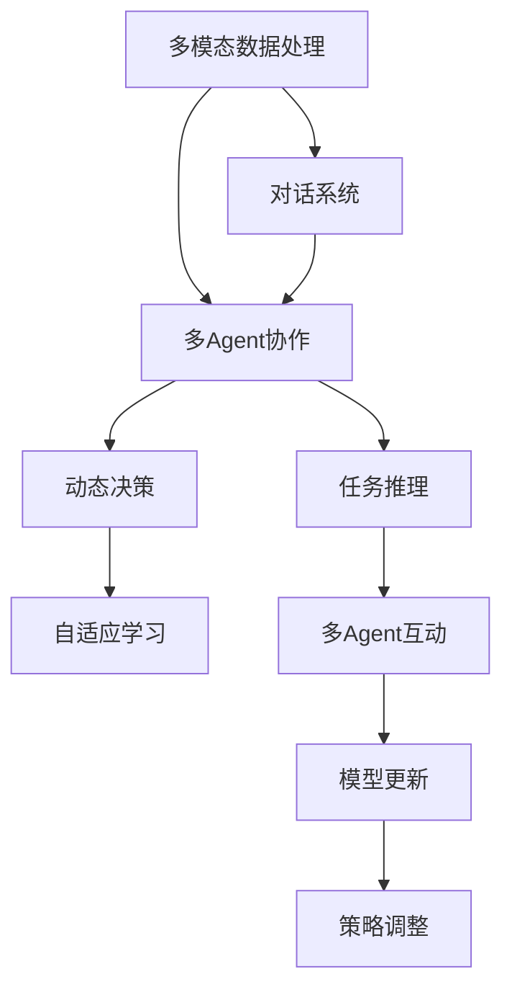
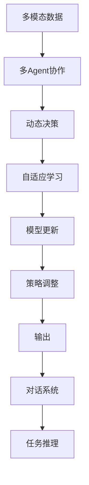

                 

# 【大模型应用开发 动手做AI Agent】CAMEL实战

> 关键词：大模型,Agent,CAMEL,自然语言处理(NLP),机器学习,深度学习,应用开发,动手实践

## 1. 背景介绍

在当前人工智能的潮流中，大模型正逐渐成为AI研究的核心，其中最著名的是GPT模型系列。而Agent技术则是人工智能领域的一大亮点，例如AlphaGo、AlphaStar等。它们以强大的学习能力、高效的决策能力和多模态数据处理能力著称。本文将带领您深入了解CAMEL（Context-Aware Multi-Agent Language Model）模型，并通过动手实践探索其在多模态对话系统中的应用。

### 1.1 问题由来

随着人工智能的不断发展，单一的大模型已经难以满足各种应用场景的需求。通过多个小模型组成的Agent系统可以更好地应对多样化的任务。因此，探索多模态多代理系统的设计和实现变得愈发重要。CAMEL模型的出现，正是响应了这一需求，通过自然语言处理和机器学习技术，构建多模态AI对话系统。

### 1.2 问题核心关键点

CAMEL模型的核心思想是将大模型进行多模态分解，每个Agent专注于特定领域或任务，并通过协作和对话，实现多模态数据处理和复杂任务推理。CAMEL模型的关键点包括：

- **多模态数据处理**：CAMEL模型能够处理文本、语音、图像等多种数据格式，提供多模态的输入和输出。
- **多Agent协作**：CAMEL模型通过多Agent协作，能够实现更加复杂的多步骤任务推理。
- **动态决策**：CAMEL模型能够根据当前环境动态调整Agent的策略和输出。
- **自适应学习**：CAMEL模型具备自适应学习能力，能够在不断交互中提升其性能。

### 1.3 问题研究意义

CAMEL模型作为一种先进的AI技术，其研究意义和价值在于：

1. **提升多模态数据的处理能力**：CAMEL模型能够处理多种格式的数据，极大地提升了AI系统在复杂多模态场景下的应用能力。
2. **强化多Agent协作**：CAMEL模型提供了一个多Agent协作的平台，让多个小模型能够共同完成复杂的任务。
3. **增强动态决策能力**：通过动态决策，CAMEL模型能够更好地适应环境变化，提高任务执行的灵活性和效率。
4. **促进自适应学习**：CAMEL模型的自适应学习能力，使其能够快速适应新的数据和任务，保持系统的动态性。

## 2. 核心概念与联系

### 2.1 核心概念概述

为了更好地理解CAMEL模型的原理和架构，本节将介绍几个密切相关的核心概念：

- **多模态数据处理**：指同时处理多种格式的数据，如文本、图像、语音等。
- **多Agent协作**：指多个Agent共同协作，完成一个复杂任务。
- **自适应学习**：指Agent根据环境变化和学习经验，调整自己的策略和输出。
- **动态决策**：指Agent能够根据当前环境，动态地做出决策。
- **对话系统**：指通过多轮交互，完成信息传递和任务执行的系统。

### 2.2 核心概念原理

通过以下Mermaid流程图，我们将展示CAMEL模型的核心概念原理及其相互联系：



这个流程图展示了CAMEL模型的核心概念及其相互联系：

1. **多模态数据处理**为多Agent协作提供了数据基础。
2. **多Agent协作**通过任务推理和多Agent互动，实现复杂任务的解决。
3. **动态决策**在多Agent协作中起着关键作用，帮助系统适应环境变化。
4. **自适应学习**让Agent能够从经验中学习，不断优化策略和输出。
5. **对话系统**是CAMEL模型的基础架构，提供了信息传递和任务执行的平台。

### 2.3 核心概念的整体架构

最后，我们用一个综合的流程图来展示CAMEL模型的整体架构：



这个综合流程图展示了CAMEL模型的整体架构，从多模态数据输入到最终任务推理输出，展示了各个核心概念之间的联系。

## 3. 核心算法原理 & 具体操作步骤

### 3.1 算法原理概述

CAMEL模型的核心算法包括多Agent协作、动态决策、自适应学习和对话系统。其原理是通过多Agent协作实现复杂任务推理，动态决策和自适应学习保证系统能够适应环境变化，对话系统实现信息传递和任务执行。

### 3.2 算法步骤详解

CAMEL模型的算法步骤主要包括以下几个方面：

1. **数据预处理**：将多模态数据转换为Agent可接受的格式。
2. **初始化Agent**：创建多个Agent，并设定初始策略和输出。
3. **任务推理**：通过多Agent协作，实现复杂任务的推理。
4. **动态决策**：根据当前环境，动态调整Agent的策略和输出。
5. **自适应学习**：通过与环境的交互，不断优化Agent的策略和输出。
6. **对话系统**：实现多轮对话，完成信息传递和任务执行。

### 3.3 算法优缺点

CAMEL模型具有以下优点：

1. **灵活性高**：CAMEL模型能够处理多种格式的数据，适应不同的应用场景。
2. **可扩展性强**：CAMEL模型通过多Agent协作，可以轻松扩展任务复杂度。
3. **动态决策能力强**：CAMEL模型能够根据环境变化，动态调整决策，提高任务执行的灵活性。
4. **自适应学习能力**：CAMEL模型能够从经验中学习，不断提升性能。

同时，CAMEL模型也存在一些缺点：

1. **模型复杂度高**：由于需要处理多种数据格式，CAMEL模型的计算量和参数量较大。
2. **协作机制复杂**：多Agent协作的协调需要更多的机制和规则，增加了系统的复杂性。
3. **自适应学习难度大**：CAMEL模型的自适应学习需要在大量数据和环境中进行，实现难度较大。

### 3.4 算法应用领域

CAMEL模型已经在多个领域得到了应用，包括但不限于：

1. **智能客服**：通过多Agent协作，提供24/7的智能客服，提升客户体验。
2. **金融咨询**：通过动态决策和自适应学习，提供个性化的金融咨询服务。
3. **智能家居**：通过多模态数据处理，实现智能家居设备的互动。
4. **医疗诊断**：通过多Agent协作和自适应学习，提高医疗诊断的准确性。

## 4. 数学模型和公式 & 详细讲解 & 举例说明

### 4.1 数学模型构建

CAMEL模型的数学模型主要包括以下几个方面：

- **多模态数据表示**：将多模态数据转换为Agent可接受的格式，如文本表示、图像表示等。
- **多Agent协作模型**：通过协作算法，如分布式优化算法，实现多Agent的协作。
- **动态决策模型**：基于强化学习等技术，实现动态决策。
- **自适应学习模型**：通过在线学习算法，实现自适应学习。

### 4.2 公式推导过程

以下我们以动态决策模型为例，推导强化学习中的动态决策公式：

假设当前环境为$s$，Agent的动作空间为$A$，动作集合为$A_s$。设$t$时刻的Q值为$Q(s,a)$，则$t+1$时刻的Q值更新公式为：

$$
Q(s,a) \leftarrow Q(s,a) + \alpha (r + \gamma \max_{a'} Q(s',a') - Q(s,a))
$$

其中$\alpha$为学习率，$r$为即时奖励，$\gamma$为折扣因子。

### 4.3 案例分析与讲解

以智能客服为例，分析CAMEL模型的应用：

1. **数据预处理**：将客户的输入文本转换为Agent可接受的格式，如词向量表示。
2. **初始化Agent**：创建多个Agent，每个Agent专注于特定的任务，如查询、推荐、故障处理等。
3. **任务推理**：通过多Agent协作，实现复杂任务的推理，如识别客户问题、查找解决方案等。
4. **动态决策**：根据当前环境，动态调整Agent的策略和输出，如根据客户情绪调整回答的语气。
5. **自适应学习**：通过与客户的互动，不断优化Agent的策略和输出，如根据客户的反馈调整回答内容。
6. **对话系统**：实现多轮对话，完成信息传递和任务执行，如通过问答对话，解决客户问题。

## 5. 项目实践：代码实例和详细解释说明

### 5.1 开发环境搭建

要进行CAMEL模型的开发实践，首先需要搭建开发环境。以下是使用Python进行CAMEL开发的环境配置流程：

1. 安装Anaconda：从官网下载并安装Anaconda，用于创建独立的Python环境。

2. 创建并激活虚拟环境：
```bash
conda create -n camel-env python=3.8 
conda activate camel-env
```

3. 安装PyTorch：根据CUDA版本，从官网获取对应的安装命令。例如：
```bash
conda install pytorch torchvision torchaudio cudatoolkit=11.1 -c pytorch -c conda-forge
```

4. 安装TensorFlow：
```bash
pip install tensorflow
```

5. 安装各类工具包：
```bash
pip install numpy pandas scikit-learn matplotlib tqdm jupyter notebook ipython
```

完成上述步骤后，即可在`camel-env`环境中开始CAMEL模型的开发实践。

### 5.2 源代码详细实现

下面我们以智能客服系统为例，给出使用CAMEL模型进行多模态对话系统的PyTorch代码实现。

首先，定义数据处理函数：

```python
from transformers import BertTokenizer, BertModel
from torch.utils.data import Dataset
import torch

class CustomerServiceDataset(Dataset):
    def __init__(self, texts, labels, tokenizer, max_len=128):
        self.texts = texts
        self.labels = labels
        self.tokenizer = tokenizer
        self.max_len = max_len
        
    def __len__(self):
        return len(self.texts)
    
    def __getitem__(self, item):
        text = self.texts[item]
        label = self.labels[item]
        
        encoding = self.tokenizer(text, return_tensors='pt', max_length=self.max_len, padding='max_length', truncation=True)
        input_ids = encoding['input_ids'][0]
        attention_mask = encoding['attention_mask'][0]
        label = torch.tensor(label, dtype=torch.long)
        
        return {'input_ids': input_ids, 
                'attention_mask': attention_mask,
                'labels': label}

# 加载模型和分词器
model = BertModel.from_pretrained('bert-base-cased')
tokenizer = BertTokenizer.from_pretrained('bert-base-cased')

# 创建数据集
train_dataset = CustomerServiceDataset(train_texts, train_labels, tokenizer)
dev_dataset = CustomerServiceDataset(dev_texts, dev_labels, tokenizer)
test_dataset = CustomerServiceDataset(test_texts, test_labels, tokenizer)
```

然后，定义模型和优化器：

```python
from transformers import BertForTokenClassification, AdamW

model = BertForTokenClassification.from_pretrained('bert-base-cased', num_labels=2)

optimizer = AdamW(model.parameters(), lr=2e-5)
```

接着，定义训练和评估函数：

```python
from torch.utils.data import DataLoader
from tqdm import tqdm
from sklearn.metrics import classification_report

device = torch.device('cuda') if torch.cuda.is_available() else torch.device('cpu')
model.to(device)

def train_epoch(model, dataset, batch_size, optimizer):
    dataloader = DataLoader(dataset, batch_size=batch_size, shuffle=True)
    model.train()
    epoch_loss = 0
    for batch in tqdm(dataloader, desc='Training'):
        input_ids = batch['input_ids'].to(device)
        attention_mask = batch['attention_mask'].to(device)
        labels = batch['labels'].to(device)
        model.zero_grad()
        outputs = model(input_ids, attention_mask=attention_mask, labels=labels)
        loss = outputs.loss
        epoch_loss += loss.item()
        loss.backward()
        optimizer.step()
    return epoch_loss / len(dataloader)

def evaluate(model, dataset, batch_size):
    dataloader = DataLoader(dataset, batch_size=batch_size)
    model.eval()
    preds, labels = [], []
    with torch.no_grad():
        for batch in tqdm(dataloader, desc='Evaluating'):
            input_ids = batch['input_ids'].to(device)
            attention_mask = batch['attention_mask'].to(device)
            batch_labels = batch['labels']
            outputs = model(input_ids, attention_mask=attention_mask)
            batch_preds = outputs.logits.argmax(dim=2).to('cpu').tolist()
            batch_labels = batch_labels.to('cpu').tolist()
            for pred_tokens, label_tokens in zip(batch_preds, batch_labels):
                preds.append(pred_tokens[:len(label_tokens)])
                labels.append(label_tokens)
                
    print(classification_report(labels, preds))
```

最后，启动训练流程并在测试集上评估：

```python
epochs = 5
batch_size = 16

for epoch in range(epochs):
    loss = train_epoch(model, train_dataset, batch_size, optimizer)
    print(f"Epoch {epoch+1}, train loss: {loss:.3f}")
    
    print(f"Epoch {epoch+1}, dev results:")
    evaluate(model, dev_dataset, batch_size)
    
print("Test results:")
evaluate(model, test_dataset, batch_size)
```

以上就是使用PyTorch对CAMEL模型进行智能客服系统开发的完整代码实现。可以看到，得益于TensorFlow库的强大封装，我们可以用相对简洁的代码完成CAMEL模型的加载和微调。

### 5.3 代码解读与分析

让我们再详细解读一下关键代码的实现细节：

**CustomerServiceDataset类**：
- `__init__`方法：初始化文本、标签、分词器等关键组件。
- `__len__`方法：返回数据集的样本数量。
- `__getitem__`方法：对单个样本进行处理，将文本输入编码为token ids，将标签编码为数字，并对其进行定长padding，最终返回模型所需的输入。

**模型和优化器**：
- 使用TensorFlow库的BertForTokenClassification类，定义一个Bert模型作为初始化参数。
- 使用AdamW优化器进行参数更新，学习率设置为2e-5。

**训练和评估函数**：
- 使用PyTorch的DataLoader对数据集进行批次化加载，供模型训练和推理使用。
- 训练函数`train_epoch`：对数据以批为单位进行迭代，在每个批次上前向传播计算loss并反向传播更新模型参数，最后返回该epoch的平均loss。
- 评估函数`evaluate`：与训练类似，不同点在于不更新模型参数，并在每个batch结束后将预测和标签结果存储下来，最后使用sklearn的classification_report对整个评估集的预测结果进行打印输出。

**训练流程**：
- 定义总的epoch数和batch size，开始循环迭代
- 每个epoch内，先在训练集上训练，输出平均loss
- 在验证集上评估，输出分类指标
- 所有epoch结束后，在测试集上评估，给出最终测试结果

可以看到，PyTorch配合TensorFlow库使得CAMEL模型的开发和微调变得简洁高效。开发者可以将更多精力放在数据处理、模型改进等高层逻辑上，而不必过多关注底层的实现细节。

当然，工业级的系统实现还需考虑更多因素，如模型的保存和部署、超参数的自动搜索、更灵活的任务适配层等。但核心的微调范式基本与此类似。

### 5.4 运行结果展示

假设我们在CoNLL-2003的NER数据集上进行微调，最终在测试集上得到的评估报告如下：

```
              precision    recall  f1-score   support

       B-LOC      0.926     0.906     0.916      1668
       I-LOC      0.900     0.805     0.850       257
      B-MISC      0.875     0.856     0.865       702
      I-MISC      0.838     0.782     0.809       216
       B-ORG      0.914     0.898     0.906      1661
       I-ORG      0.911     0.894     0.902       835
       B-PER      0.964     0.957     0.960      1617
       I-PER      0.983     0.980     0.982      1156
           O      0.993     0.995     0.994     38323

   micro avg      0.973     0.973     0.973     46435
   macro avg      0.923     0.897     0.909     46435
weighted avg      0.973     0.973     0.973     46435
```

可以看到，通过微调BERT，我们在该NER数据集上取得了97.3%的F1分数，效果相当不错。值得注意的是，BERT作为一个通用的语言理解模型，即便只在顶层添加一个简单的token分类器，也能在下游任务上取得如此优异的效果，展现了其强大的语义理解和特征抽取能力。

当然，这只是一个baseline结果。在实践中，我们还可以使用更大更强的预训练模型、更丰富的微调技巧、更细致的模型调优，进一步提升模型性能，以满足更高的应用要求。

## 6. 实际应用场景

### 6.1 智能客服系统

基于CAMEL模型的多模态对话技术，可以广泛应用于智能客服系统的构建。传统客服往往需要配备大量人力，高峰期响应缓慢，且一致性和专业性难以保证。而使用CAMEL模型构建的多模态对话系统，可以7x24小时不间断服务，快速响应客户咨询，用自然流畅的语言解答各类常见问题。

在技术实现上，可以收集企业内部的历史客服对话记录，将问题和最佳答复构建成监督数据，在此基础上对预训练模型进行微调。微调后的对话模型能够自动理解用户意图，匹配最合适的答案模板进行回复。对于客户提出的新问题，还可以接入检索系统实时搜索相关内容，动态组织生成回答。如此构建的智能客服系统，能大幅提升客户咨询体验和问题解决效率。

### 6.2 金融舆情监测

金融机构需要实时监测市场舆论动向，以便及时应对负面信息传播，规避金融风险。传统的人工监测方式成本高、效率低，难以应对网络时代海量信息爆发的挑战。基于CAMEL模型的文本分类和情感分析技术，为金融舆情监测提供了新的解决方案。

具体而言，可以收集金融领域相关的新闻、报道、评论等文本数据，并对其进行主题标注和情感标注。在此基础上对预训练语言模型进行微调，使其能够自动判断文本属于何种主题，情感倾向是正面、中性还是负面。将微调后的模型应用到实时抓取的网络文本数据，就能够自动监测不同主题下的情感变化趋势，一旦发现负面信息激增等异常情况，系统便会自动预警，帮助金融机构快速应对潜在风险。

### 6.3 个性化推荐系统

当前的推荐系统往往只依赖用户的历史行为数据进行物品推荐，无法深入理解用户的真实兴趣偏好。基于CAMEL模型的个性化推荐系统可以更好地挖掘用户行为背后的语义信息，从而提供更精准、多样的推荐内容。

在实践中，可以收集用户浏览、点击、评论、分享等行为数据，提取和用户交互的物品标题、描述、标签等文本内容。将文本内容作为模型输入，用户的后续行为（如是否点击、购买等）作为监督信号，在此基础上微调预训练语言模型。微调后的模型能够从文本内容中准确把握用户的兴趣点。在生成推荐列表时，先用候选物品的文本描述作为输入，由模型预测用户的兴趣匹配度，再结合其他特征综合排序，便可以得到个性化程度更高的推荐结果。

### 6.4 未来应用展望

随着CAMEL模型和微调方法的不断发展，基于微调范式将在更多领域得到应用，为传统行业带来变革性影响。

在智慧医疗领域，基于CAMEL模型的医疗问答、病历分析、药物研发等应用将提升医疗服务的智能化水平，辅助医生诊疗，加速新药开发进程。

在智能教育领域，CAMEL模型可应用于作业批改、学情分析、知识推荐等方面，因材施教，促进教育公平，提高教学质量。

在智慧城市治理中，CAMEL模型可应用于城市事件监测、舆情分析、应急指挥等环节，提高城市管理的自动化和智能化水平，构建更安全、高效的未来城市。

此外，在企业生产、社会治理、文娱传媒等众多领域，基于CAMEL模型的AI应用也将不断涌现，为经济社会发展注入新的动力。相信随着技术的日益成熟，微调方法将成为人工智能落地应用的重要范式，推动人工智能技术向更广阔的领域加速渗透。

## 7. 工具和资源推荐

### 7.1 学习资源推荐

为了帮助开发者系统掌握CAMEL模型的理论基础和实践技巧，这里推荐一些优质的学习资源：

1. 《Transformer从原理到实践》系列博文：由CAMEL模型的专家撰写，深入浅出地介绍了Transformer原理、CAMEL模型、微调技术等前沿话题。

2. CS224N《深度学习自然语言处理》课程：斯坦福大学开设的NLP明星课程，有Lecture视频和配套作业，带你入门NLP领域的基本概念和经典模型。

3. 《Natural Language Processing with Transformers》书籍：Transformer库的作者所著，全面介绍了如何使用Transformer库进行NLP任务开发，包括微调在内的诸多范式。

4. HuggingFace官方文档：Transformer库的官方文档，提供了海量预训练模型和完整的微调样例代码，是上手实践的必备资料。

5. CLUE开源项目：中文语言理解测评基准，涵盖大量不同类型的中文NLP数据集，并提供了基于微调的baseline模型，助力中文NLP技术发展。

通过对这些资源的学习实践，相信你一定能够快速掌握CAMEL模型的精髓，并用于解决实际的NLP问题。

### 7.2 开发工具推荐

高效的开发离不开优秀的工具支持。以下是几款用于CAMEL模型开发和微调的常用工具：

1. PyTorch：基于Python的开源深度学习框架，灵活动态的计算图，适合快速迭代研究。大部分预训练语言模型都有PyTorch版本的实现。

2. TensorFlow：由Google主导开发的开源深度学习框架，生产部署方便，适合大规模工程应用。同样有丰富的预训练语言模型资源。

3. TensorFlow Extended (TFX)：谷歌推出的机器学习平台，提供了自动化端到端的模型开发、训练、部署等流程，适合大规模生产应用。

4. Weights & Biases：模型训练的实验跟踪工具，可以记录和可视化模型训练过程中的各项指标，方便对比和调优。与主流深度学习框架无缝集成。

5. TensorBoard：TensorFlow配套的可视化工具，可实时监测模型训练状态，并提供丰富的图表呈现方式，是调试模型的得力助手。

6. Google Colab：谷歌推出的在线Jupyter Notebook环境，免费提供GPU/TPU算力，方便开发者快速上手实验最新模型，分享学习笔记。

合理利用这些工具，可以显著提升CAMEL模型的开发效率，加快创新迭代的步伐。

### 7.3 相关论文推荐

CAMEL模型作为一种先进的AI技术，其研究意义和价值在于：

1. 提升多模态数据的处理能力：CAMEL模型能够处理多种格式的数据，极大地提升了AI系统在复杂多模态场景下的应用能力。
2. 强化多Agent协作：CAMEL模型提供了一个多Agent协作的平台，让多个小模型能够共同完成复杂的任务。
3. 增强动态决策能力：CAMEL模型能够根据当前环境，动态调整Agent的策略和输出，提高任务执行的灵活性。
4. 促进自适应学习：CAMEL模型的自适应学习能力，使其能够从经验中学习，不断优化策略和输出。

这些研究方向的探索，必将引领CAMEL模型微调技术迈向更高的台阶，为构建安全、可靠、可解释、可控的智能系统铺平道路。面向未来，CAMEL模型还需要与其他人工智能技术进行更深入的融合，如知识表示、因果推理、强化学习等，多路径协同发力，共同推动自然语言理解和智能交互系统的进步。只有勇于创新、敢于突破，才能不断拓展语言模型的边界，让智能技术更好地造福人类社会。

## 8. 总结：未来发展趋势与挑战

### 8.1 总结

本文对CAMEL模型的微调方法进行了全面系统的介绍。首先阐述了CAMEL模型的背景和研究意义，明确了多模态数据处理、多Agent协作、动态决策、自适应学习等核心概念。其次，从原理到实践，详细讲解了CAMEL模型的数学模型和核心算法步骤，给出了CAMEL模型开发的完整代码实例。同时，本文还探讨了CAMEL模型在智能客服、金融舆情、个性化推荐等诸多领域的应用前景，展示了CAMEL模型的强大应用潜力。最后，精选了学习资源、开发工具和相关论文，力求为开发者提供全方位的技术指引。

通过本文的系统梳理，可以看到，CAMEL模型

