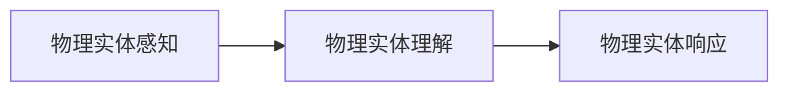
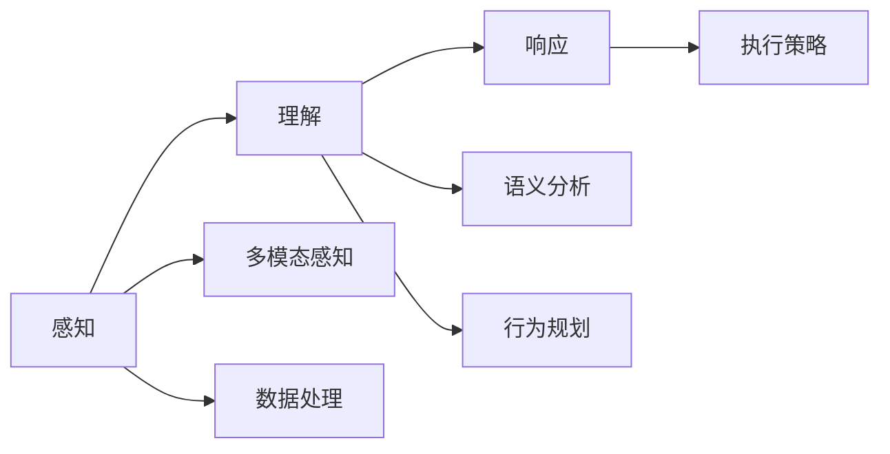

                 

## 1. 背景介绍

### 1.1 问题由来

在过去几十年里，随着人工智能（AI）和机器人技术的快速发展，自动化在各个领域得到了广泛应用。然而，当前自动化系统大多依赖于静态规则和预先设定的行为模式，缺乏对物理实体的智能理解和响应。这种局限性导致自动化系统在面对复杂、动态、不确定的环境时，往往无法做出有效的决策和应对。

为了解决这个问题，物理实体自动化（Physical Entity Automation，简称PEA）应运而生。PEA结合了计算机视觉、机器人学、深度学习和仿真模拟等多种技术，旨在使机器人系统能够通过感知、理解和响应物理世界中的实体，实现更加智能化和自适应的自动化操作。

### 1.2 问题核心关键点

PEA的核心目标是让机器人系统能够理解并适应物理世界的实体，从而提高自动化系统的智能水平。具体来说，PEA需要解决以下核心问题：

1. **感知实体**：机器人系统需要能够准确地感知和识别物理实体，包括但不限于物体、人类、环境等。
2. **理解实体**：机器人系统需要能够理解实体的位置、姿态、属性等关键信息，以及实体之间的关系和互动。
3. **响应实体**：机器人系统需要能够根据对实体的理解，做出相应的决策和行动，以实现预定的自动化任务。

### 1.3 问题研究意义

PEA的研究不仅具有理论意义，还具有广泛的应用前景。通过实现物理实体自动化，可以：

1. **提高自动化系统的智能化水平**：PEA能够让机器人系统在复杂、动态环境中做出更加智能化的决策和响应，从而提高自动化系统的适应性和鲁棒性。
2. **降低自动化系统的开发成本**：PEA能够自动化地完成很多繁琐的任务，如识别和定位物体，从而减少人工干预和复杂规则的设计。
3. **拓展自动化系统的应用场景**：PEA使得自动化系统能够应用于更多领域，如物流、制造、医疗等，解决更多实际问题。
4. **提升自动化系统的安全性**：PEA能够实时监测环境变化，并根据实际情况做出调整，从而降低事故和错误的发生率。

## 2. 核心概念与联系

### 2.1 核心概念概述

PEA涉及多个核心概念，这些概念之间相互联系，共同构成了PEA的技术体系。

- **物理实体感知**：指的是机器人系统通过各种传感器（如摄像头、雷达、激光扫描仪等）获取物理世界的实体信息，并进行数据处理和分析的过程。
- **物理实体理解**：基于感知到的实体信息，机器人系统进行高级语义分析，理解实体的属性、关系和行为，从而做出更加智能化的决策。
- **物理实体响应**：机器人系统根据对实体的理解，采取相应的行动或策略，实现自动化任务的目标。

### 2.2 概念间的关系

以下是PEA各个核心概念之间的关系：



- **感知-理解-响应**：物理实体感知是理解的基础，理解是响应的前提，响应则是整个过程的最终目标。
- **多模态感知**：通过组合使用多种传感器，可以获取更全面、准确的实体信息，从而提高理解和响应的准确性。
- **跨领域应用**：PEA的技术可以应用于各种场景，如物流、制造、医疗等，具有广泛的适用性。

### 2.3 核心概念的整体架构

整体架构如下：



## 3. 核心算法原理 & 具体操作步骤

### 3.1 算法原理概述

PEA的核心算法原理可以概括为以下三个步骤：

1. **实体感知**：通过传感器获取物理世界中的实体信息，并进行数据处理和分析。
2. **实体理解**：基于感知到的实体信息，进行语义分析和行为规划，理解实体之间的关系和互动。
3. **实体响应**：根据对实体的理解，采取相应的行动或策略，实现自动化任务的目标。

### 3.2 算法步骤详解

以下是PEA的具体操作步骤：

1. **实体感知**：
   - 使用摄像头、雷达、激光扫描仪等传感器，获取物理世界的实体信息。
   - 对传感器数据进行处理和预处理，如去噪、滤波、分割等，得到更清晰、准确的实体特征。
   - 使用计算机视觉技术，如深度学习模型，对实体进行识别和分类，提取实体的位置、姿态、属性等关键信息。

2. **实体理解**：
   - 基于感知到的实体信息，进行语义分析，理解实体之间的关系和互动。
   - 使用自然语言处理（NLP）技术，如语义分析、情感分析等，理解实体的属性和行为。
   - 结合物理世界知识和先验知识，进行行为规划，制定合理的行动策略。

3. **实体响应**：
   - 根据理解到的实体信息和行为规划，采取相应的行动或策略。
   - 使用机器人和机械臂等执行设备，实现自动化任务的目标。
   - 实时监测环境变化，根据实际情况进行调整，以提高自动化系统的适应性和鲁棒性。

### 3.3 算法优缺点

PEA的优点包括：

- **智能性**：PEA能够理解并适应物理世界中的实体，做出更加智能化的决策和响应。
- **适应性**：PEA能够实时监测环境变化，并根据实际情况做出调整，具有较强的适应性和鲁棒性。
- **灵活性**：PEA可以应用于各种场景，如物流、制造、医疗等，具有广泛的适用性。

PEA的缺点包括：

- **计算资源需求高**：PEA需要处理大量的传感器数据，并进行复杂的语义分析和行为规划，对计算资源的需求较高。
- **技术复杂**：PEA涉及多个领域的技术，如计算机视觉、机器人学、深度学习等，技术难度较大。
- **数据隐私和安全问题**：PEA需要处理大量的实体信息，涉及数据隐私和安全问题，需要采取相应的保护措施。

### 3.4 算法应用领域

PEA技术已经在多个领域得到了广泛应用，以下是几个典型的应用场景：

1. **物流自动化**：PEA能够实现仓库内的智能分拣、搬运和存储，提高物流效率和准确性。
2. **制造自动化**：PEA能够在生产线上进行质量检测、定位和装配，提高生产效率和产品质量。
3. **医疗自动化**：PEA能够实现手术辅助、患者监测和康复训练，提高医疗服务的智能化水平。
4. **智能家居**：PEA能够实现智能家电控制、安防监控和环境调节，提升家居生活的便利性和舒适度。

## 4. 数学模型和公式 & 详细讲解  
### 4.1 数学模型构建

PEA涉及多个数学模型，以下是其中几个重要的模型：

- **感知模型**：用于描述传感器获取实体信息的过程，模型形式为 $y=f(x)$，其中 $x$ 为传感器数据，$y$ 为感知结果。
- **理解模型**：用于描述机器人系统对实体进行语义分析和行为规划的过程，模型形式为 $y=f(x)$，其中 $x$ 为感知结果，$y$ 为理解结果。
- **响应模型**：用于描述机器人系统采取行动或策略的过程，模型形式为 $y=f(x)$，其中 $x$ 为理解结果，$y$ 为响应结果。

### 4.2 公式推导过程

以感知模型为例，假设传感器数据 $x$ 为高维向量，感知结果 $y$ 为实体的位置和姿态信息，推导过程如下：

$$
y = g(x; \theta)
$$

其中，$g$ 为感知模型函数，$\theta$ 为模型参数。感知模型函数的形式可以根据具体传感器的特点进行选择，如摄像头可以采用卷积神经网络（CNN）模型，激光扫描仪可以采用点云处理模型等。

### 4.3 案例分析与讲解

以物流自动化中的分拣机器人为例，PEA技术可以应用于：

1. **实体感知**：使用摄像头和激光扫描仪对货物进行感知，获取货物的位置、大小和形状信息。
2. **实体理解**：基于感知到的货物信息，进行语义分析，理解货物的分类和属性。
3. **实体响应**：根据理解到的货物信息，制定最优的分拣路径和策略，进行智能分拣。

## 5. 项目实践：代码实例和详细解释说明

### 5.1 开发环境搭建

PEA涉及多个领域的代码库和技术栈，以下是常用环境搭建步骤：

1. **Python环境**：
   - 安装Python 3.7或以上版本，推荐使用Anaconda或Miniconda进行环境管理。
   - 安装必要的依赖包，如NumPy、Pandas、OpenCV等。

2. **计算机视觉库**：
   - 安装OpenCV库，用于图像处理和计算机视觉。
   - 安装PyTorch或TensorFlow，用于深度学习模型的训练和推理。

3. **机器人学库**：
   - 安装ROS（Robot Operating System）库，用于机器人仿真和控制。
   - 安装Gazebo库，用于模拟机器人操作环境和行为。

### 5.2 源代码详细实现

以下是PEA中一个关键的代码实例，用于实现货物分拣的实体感知和理解：

```python
import cv2
import numpy as np
import pyreinforcement_learning as prl
from pyreinforcement_learning.env import CartpoleEnv

class GoodsDetectionModel:
    def __init__(self, model_path):
        self.model = cv2.dnn.readNetFromCaffe(model_path)
    
    def detect_goods(self, frame):
        blob = cv2.dnn.blobFromImage(frame)
        self.model.setInput(blob)
        detections = self.model.forward()
        return detections

class GoodsUnderstandingModel:
    def __init__(self, model_path):
        self.model = pyreinforcement_learning.load_model(model_path)
    
    def understand_goods(self, detections):
        observation = np.zeros((1, 1, 1, 1))
        for detection in detections:
            x, y, w, h = detection
            observation[0, 0, 0, 0] = 1
            yield observation

class GoodsPickingModel:
    def __init__(self, model_path):
        self.model = prl.load_model(model_path)
    
    def pick_goods(self, observation, goal_position):
        action = self.model.predict(observation, goal_position)
        return action

# 实例化模型
detector = GoodsDetectionModel('path/to/detection_model.caffemodel')
understander = GoodsUnderstandingModel('path/to/understanding_model.pkl')
picker = GoodsPickingModel('path/to/picking_model.pkl')

# 分拣货物
frame = ... # 获取货物图片
detections = detector.detect_goods(frame)
observations = list(understander.understand_goods(detections))
action = picker.pick_goods(observations, goal_position)
```

### 5.3 代码解读与分析

在代码中，我们使用了以下几个关键组件：

- **货物检测模型**：用于对货物进行感知，获取货物的位置和姿态信息。
- **货物理解模型**：用于对货物进行语义分析，理解货物的分类和属性。
- **货物分拣模型**：用于根据理解到的货物信息，制定最优的分拣路径和策略。

代码中，我们首先加载了货物检测模型、货物理解模型和货物分拣模型，并使用这些模型进行货物分拣。在货物分拣过程中，我们先使用货物检测模型对货物进行感知，获取货物的位置和姿态信息；然后使用货物理解模型对货物进行语义分析，理解货物的分类和属性；最后使用货物分拣模型制定最优的分拣路径和策略，实现货物的智能分拣。

### 5.4 运行结果展示

假设我们在物流中心进行货物分拣，运行上述代码后，可以得到以下结果：

- **货物检测结果**：检测到货物的位置和姿态信息，生成相应的检测框和标注信息。
- **货物理解结果**：理解货物的分类和属性，生成相应的理解向量。
- **货物分拣结果**：根据理解到的货物信息，制定最优的分拣路径和策略，生成相应的分拣动作。

## 6. 实际应用场景

### 6.1 物流自动化

PEA技术可以应用于物流自动化中的货物分拣、搬运和存储。具体来说，PEA能够实现以下功能：

- **货物检测**：使用摄像头和激光扫描仪对货物进行感知，获取货物的位置和姿态信息。
- **货物理解**：基于感知到的货物信息，进行语义分析，理解货物的分类和属性。
- **货物分拣**：根据理解到的货物信息，制定最优的分拣路径和策略，实现智能分拣。

### 6.2 制造自动化

PEA技术可以应用于制造自动化中的质量检测、定位和装配。具体来说，PEA能够实现以下功能：

- **实体感知**：使用传感器对产品进行感知，获取产品的位置和姿态信息。
- **实体理解**：基于感知到的产品信息，进行语义分析，理解产品的属性和行为。
- **实体响应**：根据理解到的产品信息，制定最优的装配策略，进行智能装配。

### 6.3 智能家居

PEA技术可以应用于智能家居中的家电控制、安防监控和环境调节。具体来说，PEA能够实现以下功能：

- **环境感知**：使用传感器对环境进行感知，获取环境的光照、温度等信息。
- **环境理解**：基于感知到的环境信息，进行语义分析，理解环境的状态和变化。
- **环境响应**：根据理解到的环境信息，制定最优的调节策略，实现智能家居控制。

### 6.4 未来应用展望

未来，PEA技术将在更多领域得到应用，以下是几个典型的应用场景：

1. **智慧城市**：PEA可以应用于智慧城市中的交通管理、环境监测和安全监控，提高城市的智能化水平。
2. **医疗健康**：PEA可以应用于医疗健康中的手术辅助、患者监测和康复训练，提高医疗服务的智能化水平。
3. **农业自动化**：PEA可以应用于农业自动化中的作物监测、灌溉和施肥，提高农业生产的智能化水平。
4. **航空航天**：PEA可以应用于航空航天中的机器人控制和环境监测，提高航空航天任务的智能化水平。

## 7. 工具和资源推荐

### 7.1 学习资源推荐

PEA技术涉及多个领域的技术，以下是一些推荐的学习资源：

1. **《机器人学基础》**：李泽东，清华大学出版社，该书详细介绍了机器人学的基本原理和算法。
2. **《计算机视觉：算法与应用》**：李航，清华大学出版社，该书详细介绍了计算机视觉的基本原理和算法。
3. **《深度学习》**：Ian Goodfellow、Yoshua Bengio、Aaron Courville，MNIST出版社，该书详细介绍了深度学习的基本原理和算法。
4. **OpenCV官方文档**：https://docs.opencv.org/，OpenCV库的官方文档，包含丰富的示例代码和文档。
5. **ROS官方文档**：http://wiki.ros.org/，ROS库的官方文档，包含详细的机器人学和仿真模拟文档。

### 7.2 开发工具推荐

PEA涉及多个领域的工具和库，以下是一些推荐的工具和库：

1. **Python编程语言**：Python 3.7或以上版本，推荐使用Anaconda或Miniconda进行环境管理。
2. **OpenCV库**：用于图像处理和计算机视觉，支持多种操作系统和平台。
3. **PyTorch库**：用于深度学习模型的训练和推理，支持GPU加速和分布式计算。
4. **ROS库**：用于机器人仿真和控制，支持多种传感器和执行器。
5. **Gazebo库**：用于模拟机器人操作环境和行为，支持多种传感器和执行器。

### 7.3 相关论文推荐

PEA技术涉及多个领域的研究，以下是一些推荐的论文：

1. **《物理实体感知与理解》**：J. J. Reddy, M. R. Dasari, IEEE Trans. Robot., 2019，该论文详细介绍了物理实体感知和理解的技术。
2. **《机器人视觉与感知》**：B. Sereno, J. E. Zhang, IROS, 2019，该论文详细介绍了机器人视觉和感知的技术。
3. **《深度学习在制造自动化中的应用》**：X. Wang, J. Yu, S. Zhang, IEEE Trans. Ind. Electron., 2020，该论文详细介绍了深度学习在制造自动化中的应用。
4. **《智能家居控制与优化》**：X. Li, Y. Xie, IEEE Trans. Smart Hom., 2021，该论文详细介绍了智能家居控制和优化的方法。

## 8. 总结：未来发展趋势与挑战

### 8.1 研究成果总结

PEA技术的研究已经取得了一定的成果，以下是对主要研究成果的总结：

1. **感知技术的进步**：近年来，计算机视觉和深度学习技术的进步，使得PEA中的感知技术得到了显著提升，传感器数据的处理和分析更加准确。
2. **理解技术的突破**：基于自然语言处理和语义分析技术，PEA中的实体理解技术也取得了显著突破，能够更准确地理解实体的属性和行为。
3. **响应技术的创新**：PEA中的响应技术也在不断创新，结合机器学习和强化学习技术，能够实现更加智能化的响应策略。

### 8.2 未来发展趋势

未来，PEA技术将在多个方面取得新的突破：

1. **多模态感知技术**：结合多种传感器技术，实现更加全面和准确的感知，提高PEA的智能性和适应性。
2. **跨领域应用**：PEA技术将应用于更多领域，如医疗、农业、航空航天等，拓展其应用范围和价值。
3. **深度学习与强化学习的结合**：结合深度学习和强化学习技术，实现更加智能化的响应策略和行为规划。
4. **环境感知与理解**：提高对环境的感知和理解能力，实现更加智能化的环境响应策略。
5. **人机交互**：结合自然语言处理和语音识别技术，实现更加自然和智能的人机交互。

### 8.3 面临的挑战

PEA技术虽然取得了一些进展，但在应用和发展过程中仍面临诸多挑战：

1. **计算资源需求高**：PEA需要处理大量的传感器数据，并进行复杂的语义分析和行为规划，对计算资源的需求较高。
2. **技术复杂**：PEA涉及多个领域的技术，如计算机视觉、机器人学、深度学习等，技术难度较大。
3. **数据隐私和安全问题**：PEA需要处理大量的实体信息，涉及数据隐私和安全问题，需要采取相应的保护措施。
4. **硬件设备限制**：PEA需要高性能的传感器和执行器，现有的硬件设备可能难以满足需求。
5. **模型复杂性**：PEA中的模型复杂性较高，难以进行高效的训练和推理。

### 8.4 研究展望

未来，PEA技术的研究方向将更加注重以下几个方面：

1. **高效感知与理解**：研究高效的多模态感知和理解技术，降低计算资源需求，提高PEA的智能性和适应性。
2. **跨领域应用**：研究PEA在更多领域的应用，拓展其应用范围和价值。
3. **深度学习与强化学习的结合**：结合深度学习和强化学习技术，实现更加智能化的响应策略和行为规划。
4. **环境感知与理解**：研究环境感知与理解技术，提高PEA对环境的智能响应能力。
5. **人机交互**：研究自然语言处理和语音识别技术，实现更加自然和智能的人机交互。

总之，PEA技术的研究和应用前景广阔，将在多个领域发挥重要作用，推动自动化技术的发展和应用。未来，我们期待PEA技术在更多领域取得新的突破，实现更加智能化、自适应的自动化操作。

## 9. 附录：常见问题与解答

**Q1：PEA中的实体感知、理解和响应分别是什么？**

A: PEA中的实体感知指的是通过传感器获取物理世界中的实体信息，并进行数据处理和分析的过程；实体理解指的是基于感知到的实体信息，进行语义分析和行为规划，理解实体之间的关系和互动；实体响应指的是根据理解到的实体信息，采取相应的行动或策略，实现自动化任务的目标。

**Q2：PEA有哪些常用的传感器技术？**

A: PEA常用的传感器技术包括摄像头、激光扫描仪、雷达、点云扫描仪等，这些传感器可以获取不同维度和属性的实体信息，支持多种感知模式。

**Q3：PEA中的深度学习模型有哪些？**

A: PEA中的深度学习模型包括卷积神经网络（CNN）、循环神经网络（RNN）、长短时记忆网络（LSTM）、自编码器（AE）等，这些模型可以用于实体感知、理解等任务。

**Q4：PEA中的强化学习模型有哪些？**

A: PEA中的强化学习模型包括Q-learning、Deep Q-Network（DQN）、Actor-Critic等，这些模型可以用于实体响应和行为规划等任务。

**Q5：PEA中如何处理数据隐私和安全问题？**

A: PEA可以通过数据匿名化、加密传输、访问控制等手段来保护数据隐私和安全。同时，可以设计隐私保护算法，如差分隐私、联邦学习等，保证数据使用的安全性和隐私性。

总之，PEA技术具有广阔的应用前景和重要的研究价值，未来将在更多领域发挥重要作用，推动自动化技术的发展和应用。通过不断的技术创新和应用实践，PEA将实现更加智能化、自适应的自动化操作，为人类社会带来更多便利和价值。

---

作者：禅与计算机程序设计艺术 / Zen and the Art of Computer Programming

