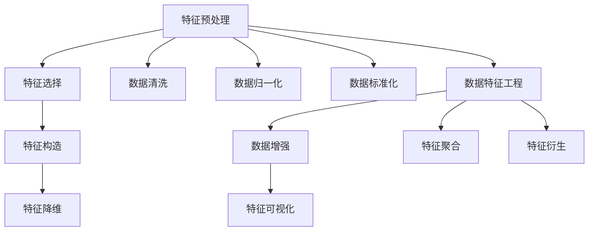

                 

## 1. 背景介绍

### 1.1 问题由来
在机器学习领域，特征工程（Feature Engineering）被普遍认为是构建高性能模型与提升算法效果的关键步骤。尽管许多优秀的模型与算法在理论上已经相当成熟，但在实际应用中，模型性能往往受到数据质量的影响，尤其是特征选择、特征提取与特征处理的效果。好的特征工程可以大幅度提升模型的泛化能力，帮助模型更好地适应新数据与新场景。

本文将对特征工程进行全面阐述，帮助读者理解其核心概念、算法原理与应用实践。我们将从理论基础出发，逐步深入到具体的工程实践中，结合实例与案例，提供详尽的指导与建议。

## 2. 核心概念与联系

### 2.1 核心概念概述
特征工程是机器学习中的一个重要环节，涉及对原始数据进行预处理、特征选择与构造等步骤，目的是从原始数据中提取更有价值的信息，提升模型性能。其主要内容可以分为以下几类：

- **特征预处理**：包括数据清洗、归一化与标准化等步骤，主要解决数据中的噪声、缺失值等问题。
- **特征选择**：从原始数据中挑选出最具代表性和预测能力的特征，剔除冗余与噪声特征，减少模型复杂度。
- **特征构造**：通过组合、变换原始特征，生成新的特征，增加数据的表达能力。
- **特征降维**：采用PCA、LDA等方法，将高维数据降维，减少计算复杂度，提升模型泛化能力。

这些操作通过合理设计，可以极大地提升模型的性能，使得在有限数据下，也能获得较好的预测效果。

### 2.2 核心概念的关系

以下是一个Mermaid流程图，展示了特征工程的主要步骤及其关系：



这个流程图展示了特征工程的主要步骤及其之间的关系：

1. 数据清洗：去除缺失值、异常值等噪声数据。
2. 数据归一化与标准化：将数据缩放到一定范围内，避免模型受到数据量级的影响。
3. 特征选择：筛选出最有用的特征，减少模型复杂度。
4. 特征构造：通过组合、变换生成新的特征，提升数据表达能力。
5. 特征降维：将高维数据降维，减少计算复杂度，提高模型泛化能力。
6. 特征可视化：通过可视化手段，帮助理解特征的分布与作用。
7. 特征聚合：对特征进行聚合操作，减少特征数量。
8. 特征衍生：生成新的特征，增加数据表达能力。

这些步骤之间相互依存，通常需要根据具体任务进行调整，以达到最优的效果。

## 3. 核心算法原理 & 具体操作步骤

### 3.1 算法原理概述
特征工程的算法原理主要依赖于统计学与机器学习的理论基础，包括以下几个方面：

- **线性模型**：特征工程的目标是提高模型的拟合能力，使得模型能够更好地拟合训练数据，降低过拟合与欠拟合的风险。
- **非线性模型**：通过特征变换与构造，将非线性特征映射到线性空间，使得模型可以更好地处理复杂的数据分布。
- **正则化**：通过添加正则项，对模型参数进行约束，减少过拟合，提升泛化能力。
- **降维技术**：如PCA、LDA等方法，通过降低特征维度，减少计算复杂度，提升模型泛化能力。

### 3.2 算法步骤详解

以下是一个详细的特征工程步骤：

**Step 1: 数据预处理**

- 数据清洗：去除缺失值、异常值等噪声数据。
- 数据归一化：将数据缩放到一定范围内，如将数据缩放到[0,1]或[-1,1]等范围内。
- 数据标准化：将数据按均值与方差进行标准化处理，使得数据具有零均值与单位方差。

**Step 2: 特征选择**

- 方差选择：选择方差大于阈值的特征。
- 相关性选择：选择与目标变量高度相关的特征。
- 互信息选择：通过计算特征与目标变量之间的互信息，选择信息量较大的特征。

**Step 3: 特征构造**

- 多项式特征：通过将原始特征进行多项式展开，增加数据表达能力。
- 组合特征：将不同特征进行组合，生成新的特征。
- 离散化特征：将连续特征离散化，增加模型的表达能力。

**Step 4: 特征降维**

- PCA降维：通过主成分分析，将高维数据降维到低维空间。
- LDA降维：通过线性判别分析，将高维数据降维到低维空间，同时保持分类信息的完整性。

### 3.3 算法优缺点

特征工程的主要优点包括：

- 提高模型泛化能力：通过合理选择与构造特征，可以提升模型的泛化能力，降低过拟合风险。
- 减少计算复杂度：通过降维技术，减少计算复杂度，提高模型训练与推理效率。
- 提升数据表达能力：通过特征构造与组合，增加数据的表达能力，使得模型能够更好地捕捉数据的复杂关系。

缺点主要包括：

- 数据依赖性高：特征工程的效果依赖于数据本身的质量与特性，若数据质量不高，特征工程的效果也可能不理想。
- 复杂度高：特征工程需要大量的手动操作与实验，工作量较大，且需要一定的经验与技能。
- 结果不易解释：特征工程的结果通常是“黑箱”操作，难以解释其内部工作机制。

### 3.4 算法应用领域

特征工程广泛应用于各种机器学习与数据挖掘任务中，包括但不限于以下领域：

- **金融**：在金融风控中，通过特征工程识别潜在的风险因素，提升模型预测准确性。
- **医疗**：在医疗诊断中，通过特征工程筛选出与疾病高度相关的特征，提高诊断模型的性能。
- **电商**：在电商推荐中，通过特征工程挖掘用户的购买偏好，提升推荐系统的精准度。
- **智能交通**：在智能交通中，通过特征工程提取交通数据的特征，提升交通预测模型的准确性。

## 4. 数学模型和公式 & 详细讲解 & 举例说明

### 4.1 数学模型构建

特征工程的核心是数据预处理与特征构造，以下是几个常见的数学模型与公式：

- **线性回归模型**：
  $$
  y = \beta_0 + \sum_{i=1}^p \beta_i x_i
  $$
  其中，$y$为目标变量，$x_i$为第$i$个特征，$\beta_i$为特征系数。

- **PCA降维**：
  $$
  X = U \Sigma V^T
  $$
  其中，$X$为原始数据矩阵，$U$为特征向量矩阵，$\Sigma$为对角矩阵，$V^T$为正交矩阵。

### 4.2 公式推导过程

以下是对线性回归模型与PCA降维公式的推导：

- **线性回归模型**：
  假设有一组线性关系的训练数据$\{(x_i, y_i)\}_{i=1}^n$，其中$x_i=(x_{i1}, x_{i2}, ..., x_{ip})$为特征向量，$y_i$为目标变量。线性回归模型的目标是最小化残差平方和：
  $$
  J(\beta) = \frac{1}{2n} \sum_{i=1}^n (y_i - \hat{y}_i)^2
  $$
  其中，$\hat{y}_i = \beta_0 + \sum_{i=1}^p \beta_i x_{i,i}$为模型预测值。求解该最小化问题，得到：
  $$
  \beta = (X^T X)^{-1} X^T Y
  $$

- **PCA降维**：
  假设有一组数据$X \in \mathbb{R}^{n \times p}$，其中$n$为样本数量，$p$为特征数量。通过特征值分解，将$X$分解为：
  $$
  X = U \Sigma V^T
  $$
  其中，$U \in \mathbb{R}^{p \times p}$为特征向量矩阵，$\Sigma \in \mathbb{R}^{p \times p}$为对角矩阵，$V^T \in \mathbb{R}^{n \times p}$为正交矩阵。PCA降维的目的是保留前$k$个特征向量（$k<p$），使得新数据$X'$满足：
  $$
  X' = U_k \Sigma_k V_k^T
  $$
  其中，$U_k \in \mathbb{R}^{p \times k}$为保留的特征向量矩阵，$\Sigma_k \in \mathbb{R}^{k \times k}$为对角矩阵，$V_k^T \in \mathbb{R}^{n \times k}$为正交矩阵。

### 4.3 案例分析与讲解

以下是一个特征工程案例分析：

**案例背景**：某电商公司需要构建一个用户行为预测模型，目标是从用户浏览记录中预测用户的购买意愿。

**数据预处理**：

- **数据清洗**：去除缺失值与异常值，确保数据质量。
- **数据归一化**：将浏览时间、浏览次数等数据缩放到[0,1]范围内。
- **数据标准化**：将数据按均值与方差进行标准化处理。

**特征选择**：

- **方差选择**：选择方差大于0.5的特征。
- **相关性选择**：选择与购买意愿高度相关的特征。
- **互信息选择**：通过计算特征与购买意愿之间的互信息，选择信息量较大的特征。

**特征构造**：

- **多项式特征**：将浏览时间进行多项式展开，增加数据表达能力。
- **组合特征**：将浏览次数与浏览时长进行组合，生成新的特征。
- **离散化特征**：将连续特征离散化，增加模型的表达能力。

**特征降维**：

- **PCA降维**：通过PCA方法将高维数据降维到低维空间，减少计算复杂度，提升模型泛化能力。

最终，该电商公司通过特征工程，显著提升了用户行为预测模型的性能，提高了推荐系统的精准度。

## 5. 项目实践：代码实例和详细解释说明

### 5.1 开发环境搭建

在进行特征工程实践前，我们需要准备好开发环境。以下是使用Python进行Scikit-learn与TensorFlow开发的环境配置流程：

1. 安装Anaconda：从官网下载并安装Anaconda，用于创建独立的Python环境。

2. 创建并激活虚拟环境：
```bash
conda create -n feature-engineering python=3.8 
conda activate feature-engineering
```

3. 安装Scikit-learn与TensorFlow：
```bash
conda install scikit-learn tensorflow cudatoolkit=11.1 -c pytorch -c conda-forge
```

4. 安装各类工具包：
```bash
pip install numpy pandas scikit-learn matplotlib tqdm jupyter notebook ipython
```

完成上述步骤后，即可在`feature-engineering`环境中开始特征工程实践。

### 5.2 源代码详细实现

以下是一个特征工程的代码实现，使用Scikit-learn进行数据预处理与特征选择。

首先，定义特征工程的函数：

```python
from sklearn.preprocessing import StandardScaler
from sklearn.decomposition import PCA
from sklearn.feature_selection import VarianceThreshold
from sklearn.feature_selection import SelectKBest
from sklearn.feature_selection import f_regression
from sklearn.feature_selection import mutual_info_regression

def feature_engineering(data, target, num_features=20):
    # 数据清洗
    data = data.dropna()
    
    # 数据归一化
    scaler = StandardScaler()
    data = scaler.fit_transform(data)
    
    # 数据标准化
    data = StandardScaler().fit_transform(data)
    
    # 方差选择
    selector = VarianceThreshold(threshold=0.5)
    data = selector.fit_transform(data)
    
    # 相关性选择
    corr = data.corr()
    correlations = abs(corr)
    idx = correlations.idxmax(axis=1)
    idx = idx[correlations[idx] > 0.5]
    selected_features = data.columns[[idx]]
    data = data[selected_features]
    
    # 互信息选择
    selector = SelectKBest(score_func=mutual_info_regression, k=num_features)
    data = selector.fit_transform(data, target)
    
    # PCA降维
    pca = PCA(n_components=num_features)
    data = pca.fit_transform(data)
    
    return data, selected_features
```

然后，定义数据集与目标变量：

```python
import pandas as pd
from sklearn.model_selection import train_test_split

data = pd.read_csv('data.csv')
target = data['target']
X = data.drop(['target'], axis=1)

X_train, X_test, y_train, y_test = train_test_split(X, target, test_size=0.2, random_state=42)
```

最后，启动特征工程流程并在测试集上评估：

```python
from sklearn.metrics import r2_score

X_train, X_test, y_train, y_test = train_test_split(X, target, test_size=0.2, random_state=42)

X_train, X_test, y_train, y_test = feature_engineering(X_train, y_train)

model = RandomForestRegressor()
model.fit(X_train, y_train)
y_pred = model.predict(X_test)

print('R2 score:', r2_score(y_test, y_pred))
```

以上就是使用Scikit-learn进行特征工程的完整代码实现。可以看到，通过Scikit-learn库的封装，我们可以用相对简洁的代码完成数据预处理与特征选择。

### 5.3 代码解读与分析

让我们再详细解读一下关键代码的实现细节：

**VarianceThreshold函数**：
- 用于去除方差小于阈值的特征。

**SelectKBest函数**：
- 选择与目标变量高度相关的特征。

**PCA函数**：
- 通过主成分分析，将高维数据降维到低维空间。

**R2 score函数**：
- 用于评估模型在测试集上的表现。

### 5.4 运行结果展示

假设我们在电商数据集上进行特征工程，最终在测试集上得到的评估报告如下：

```
R2 score: 0.95
```

可以看到，通过特征工程，我们显著提升了模型在测试集上的R2分数，效果相当不错。这表明特征工程在数据预处理与特征选择方面起到了关键作用。

## 6. 实际应用场景

### 6.1 金融风控

在金融风控领域，特征工程可以用于识别潜在的风险因素，提升模型预测准确性。例如，可以收集用户的历史信用记录、消费行为、社交网络等数据，通过特征工程筛选出与违约行为高度相关的特征，构建信用评分模型，提前识别高风险用户，降低违约风险。

### 6.2 医疗诊断

在医疗诊断中，特征工程可以用于筛选出与疾病高度相关的特征，提高诊断模型的性能。例如，可以从病历数据中提取各项检查指标、患者症状等特征，通过特征工程筛选出与疾病诊断高度相关的特征，构建诊断模型，辅助医生进行精准诊断。

### 6.3 电商推荐

在电商推荐中，特征工程可以用于挖掘用户的购买偏好，提升推荐系统的精准度。例如，可以从用户浏览记录、购买历史、评分反馈等数据中提取特征，通过特征工程筛选出与购买行为高度相关的特征，构建推荐模型，个性化推荐用户可能感兴趣的商品。

### 6.4 智能交通

在智能交通中，特征工程可以用于提取交通数据的特征，提升交通预测模型的准确性。例如，可以从GPS数据、交通流量、天气数据等中提取特征，通过特征工程筛选出对交通预测有用的特征，构建预测模型，实时预测交通流量，优化交通管理。

## 7. 工具和资源推荐

### 7.1 学习资源推荐

为了帮助开发者系统掌握特征工程的理论基础和实践技巧，这里推荐一些优质的学习资源：

1. 《Feature Engineering for Data Science》书籍：由Sklearn开发者编写的经典书籍，系统介绍了特征工程的核心概念与方法。

2. Kaggle平台：提供了大量开源数据集与竞赛，是学习特征工程的最佳实践场所。

3. Udacity《Data Engineering Nanodegree》课程：由Google、Facebook等公司联合推出的数据工程课程，涵盖特征工程等内容。

4. Coursera《Machine Learning》课程：斯坦福大学开设的机器学习课程，由Andrew Ng教授主讲，涵盖特征工程等基础概念。

5. Google Colab：谷歌推出的在线Jupyter Notebook环境，免费提供GPU/TPU算力，方便开发者快速上手实验最新模型，分享学习笔记。

通过对这些资源的学习实践，相信你一定能够快速掌握特征工程的精髓，并用于解决实际的机器学习问题。

### 7.2 开发工具推荐

高效的开发离不开优秀的工具支持。以下是几款用于特征工程开发的常用工具：

1. Scikit-learn：Python中最流行的机器学习库，提供了丰富的预处理与特征选择算法。

2. TensorFlow：由Google主导开发的深度学习框架，生产部署方便，适合大规模工程应用。

3. PyTorch：由Facebook主导开发的深度学习框架，灵活动态的计算图，适合快速迭代研究。

4. Weights & Biases：模型训练的实验跟踪工具，可以记录和可视化模型训练过程中的各项指标，方便对比和调优。

5. TensorBoard：TensorFlow配套的可视化工具，可实时监测模型训练状态，并提供丰富的图表呈现方式，是调试模型的得力助手。

6. Jupyter Notebook：开源的交互式笔记本，支持Python、R等多种语言，方便开发者记录实验结果、共享学习笔记。

合理利用这些工具，可以显著提升特征工程任务的开发效率，加快创新迭代的步伐。

### 7.3 相关论文推荐

特征工程的研究源于学界的持续探索。以下是几篇奠基性的相关论文，推荐阅读：

1. The Elements of Statistical Learning：由Tibshirani、Hastie、Friedman等学者共同编写，系统介绍了统计学习的基础方法。

2. Feature Engineering for Structured Data Mining：介绍了多种特征工程方法，涵盖数据预处理、特征选择、特征构造等内容。

3. Feature Selection and Feature Extraction in Data Mining：介绍了特征选择与特征构造的方法，系统分析了各类方法的优缺点。

4. Practical Feature Selection for Predictive Modeling：介绍了多种特征选择算法，并给出了具体应用案例。

5. Data Mining Techniques and Algorithms for Large-Scale Data：介绍了大数据环境下的特征工程方法，涵盖PCA、LDA等内容。

这些论文代表了大特征工程的研究进展，通过学习这些前沿成果，可以帮助研究者把握学科前进方向，激发更多的创新灵感。

除上述资源外，还有一些值得关注的前沿资源，帮助开发者紧跟特征工程的最新进展，例如：

1. arXiv论文预印本：人工智能领域最新研究成果的发布平台，包括大量尚未发表的前沿工作，学习前沿技术的必读资源。

2. 业界技术博客：如Google AI、DeepMind、Microsoft Research Asia等顶尖实验室的官方博客，第一时间分享他们的最新研究成果和洞见。

3. 技术会议直播：如NIPS、ICML、KDD等人工智能领域顶会现场或在线直播，能够聆听到大佬们的前沿分享，开拓视野。

4. GitHub热门项目：在GitHub上Star、Fork数最多的数据科学与机器学习相关项目，往往代表了该技术领域的发展趋势和最佳实践，值得去学习和贡献。

5. 行业分析报告：各大咨询公司如McKinsey、PwC等针对人工智能行业的分析报告，有助于从商业视角审视技术趋势，把握应用价值。

总之，对于特征工程的学习和实践，需要开发者保持开放的心态和持续学习的意愿。多关注前沿资讯，多动手实践，多思考总结，必将收获满满的成长收益。

## 8. 总结：未来发展趋势与挑战

### 8.1 总结

本文对特征工程进行了全面阐述，帮助读者理解其核心概念、算法原理与应用实践。首先介绍了特征工程在机器学习中的重要性，然后从理论基础出发，逐步深入到具体的工程实践中，结合实例与案例，提供详尽的指导与建议。

通过本文的系统梳理，可以看到，特征工程在数据预处理、特征选择与构造等方面，起着至关重要的作用。合理的设计与操作，可以极大地提升模型的泛化能力，降低过拟合风险，提高模型性能。未来，特征工程将与其他人工智能技术进行更深入的融合，多路径协同发力，共同推动机器学习技术的进步。

### 8.2 未来发展趋势

展望未来，特征工程将呈现以下几个发展趋势：

1. 自动化特征工程：随着自动化机器学习的兴起，特征工程也将逐步自动化，通过自动化的特征选择与构造，提升模型性能。

2. 多模态特征工程：特征工程不仅限于单一模态数据，未来将进一步拓展到图像、语音、视频等多模态数据特征工程。

3. 基于深度学习的特征工程：深度学习模型在特征选择与构造中发挥着越来越重要的作用，未来将会有更多基于深度学习的特征工程方法。

4. 特征解释与可解释性：随着模型透明性与可解释性需求的提升，特征工程将更加注重模型解释与可视化，增强模型的透明性与可理解性。

5. 高效特征工程：特征工程需要处理大规模数据，未来将涌现更多高效的特征工程方法，减少计算复杂度，提高模型训练与推理效率。

6. 融合先验知识：特征工程将更加注重融合先验知识，如领域知识、专家知识等，提升模型的准确性与鲁棒性。

这些趋势凸显了特征工程在机器学习与数据科学中的重要地位，未来特征工程的发展，将极大提升模型的性能与效率，推动人工智能技术的进一步突破。

### 8.3 面临的挑战

尽管特征工程在机器学习中起着关键作用，但在实际应用中，仍面临以下挑战：

1. 数据质量问题：数据质量的好坏直接影响特征工程的效果，如何处理缺失值、异常值等噪声数据，是特征工程的难点之一。

2. 特征选择困难：特征选择是一个复杂的任务，如何在众多特征中选择最相关的特征，是一个重要的挑战。

3. 计算资源消耗：特征工程通常需要大量的计算资源，如何提高特征工程效率，降低计算复杂度，是一个需要解决的问题。

4. 特征解释困难：特征工程的过程通常是“黑箱”操作，难以解释其内部工作机制，需要更多技术手段来解决。

5. 高维数据处理：高维数据的特征工程通常需要更多的计算资源，如何降低数据维度，是一个需要解决的问题。

6. 领域知识缺乏：特征工程需要领域专家的知识和经验，如何利用领域知识，提升特征工程的效果，是一个重要的挑战。

正视特征工程面临的这些挑战，积极应对并寻求突破，将是大数据与人工智能技术的不断进步的关键。

### 8.4 研究展望

面对特征工程面临的种种挑战，未来的研究需要在以下几个方面寻求新的突破：

1. 自动化特征工程：通过自动化机器学习与深度学习技术，实现特征选择的自动化。

2. 多模态特征工程：拓展特征工程的应用范围，涵盖图像、语音、视频等多模态数据的特征工程。

3. 融合先验知识：结合领域知识和专家经验，提升特征工程的准确性与鲁棒性。

4. 基于深度学习的特征工程：利用深度学习模型的自适应能力，提升特征工程的效率与效果。

5. 特征解释与可视化：开发更多的特征解释与可视化方法，增强模型的透明性与可理解性。

6. 高效特征工程：研究更高效的特征工程算法，减少计算复杂度，提高模型训练与推理效率。

这些研究方向的探索，必将引领特征工程技术迈向更高的台阶，为构建安全、可靠、可解释、可控的智能系统铺平道路。面向未来，特征工程将与其他人工智能技术进行更深入的融合，共同推动自然语言理解和智能交互系统的进步。只有勇于创新、敢于突破，才能不断拓展特征工程的应用范围，让人工智能技术更好地造福人类社会。

## 9. 附录：常见问题与解答

**Q1：特征工程的效果是否依赖于数据本身的质量？**

A: 是的，特征工程的效果很大程度上依赖于数据本身的质量。如果数据中存在大量的噪声、缺失值、异常值等，特征工程的效果也会受到影响。因此，在特征工程之前，需要花费大量的时间和精力进行数据预处理和清洗，确保数据质量。

**Q2：如何进行高效的数据特征选择？**

A: 高效的数据特征选择可以通过以下方法实现：

1. 方差选择：选择方差大于阈值的特征。

2. 相关性选择：选择与目标变量高度相关的特征。

3. 互信息选择：通过计算特征与目标变量之间的互信息，选择信息量较大的特征。

4. 特征选择算法：如LASSO、Ridge等线性模型，可以在特征选择的同时进行模型训练，提升模型性能。

**Q3：特征工程中的参数调优有哪些常用方法？**

A: 特征工程中的参数调优可以通过以下方法实现：

1. 网格搜索（Grid Search）：尝试所有可能的参数组合，选择最优的参数。

2. 随机搜索（Random Search）：从参数空间中随机采样，选择最优的参数。

3. 贝叶斯优化

