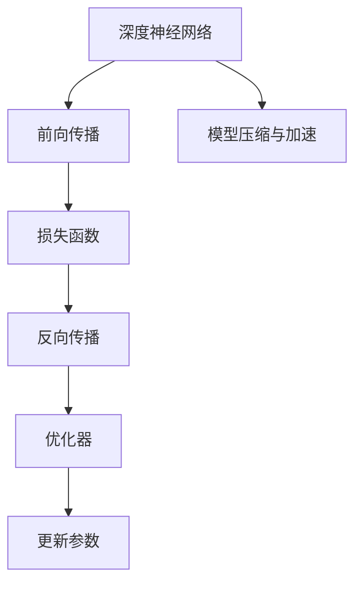
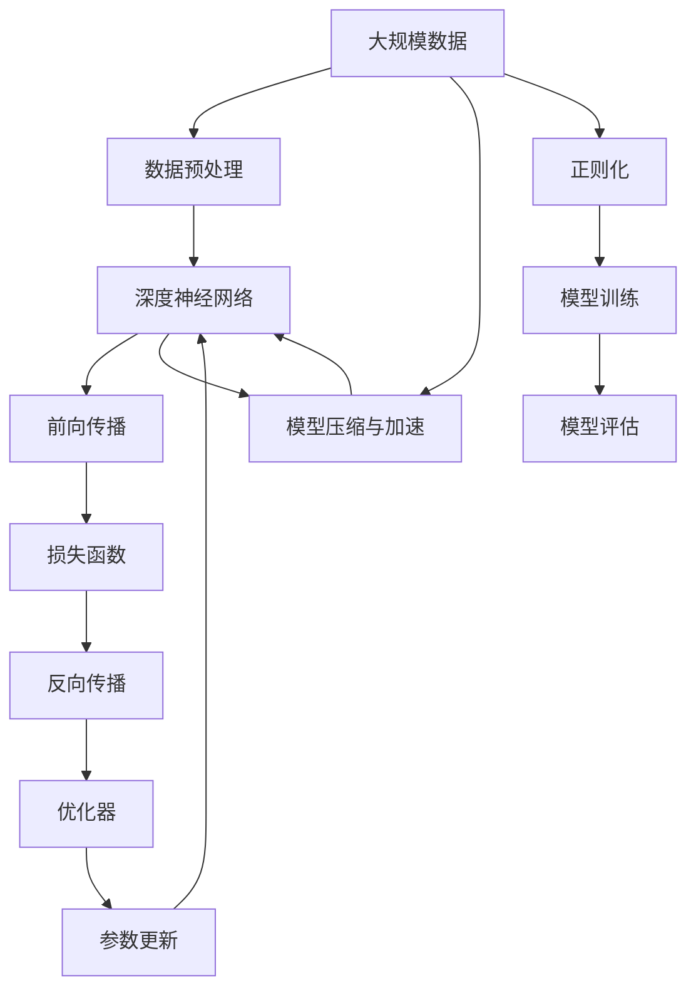

                 

# 深度学习(Deep Learning) - 原理与代码实例讲解

## 1. 背景介绍

### 1.1 问题由来
深度学习(Deep Learning, DL)作为人工智能(AI)领域的重要分支，近年来在计算机视觉、自然语言处理、语音识别、机器人控制等多个领域取得了突破性进展。深度学习的核心思想是通过构建多层神经网络结构，对数据进行抽象、表示和预测，从而解决各类复杂的模式识别与预测问题。

深度学习的成功源自于两大驱动力：
1. **大规模数据**：深度学习依赖于海量标注数据的支持，通过数据驱动的方式学习复杂、非线性的数据分布模式。
2. **强大计算能力**：深度学习的训练过程涉及海量的参数优化，依赖于GPU等高性能计算设备的支持。

这些因素共同促成了深度学习技术的迅速发展，使其成为当前AI应用的主流范式。

### 1.2 问题核心关键点
深度学习技术的核心在于如何高效地训练和优化深度神经网络。其核心算法包括：
- **前向传播**：计算输入数据通过神经网络结构得到输出的过程。
- **反向传播**：通过误差梯度反传，更新模型参数的过程。
- **损失函数**：衡量模型预测与真实标签之间差异的函数。
- **优化器**：如梯度下降、Adam、RMSprop等，用于控制模型的参数更新。
- **正则化技术**：如L2正则、Dropout等，防止过拟合。
- **模型压缩与加速**：如量化、剪枝、分布式训练等，提高模型效率。

深度学习在学术界和工业界的广泛应用，包括但不限于图像分类、目标检测、语音识别、自然语言处理、推荐系统、自动驾驶等，极大地推动了AI技术的落地与发展。

### 1.3 问题研究意义
研究深度学习的原理与代码实例，对于拓展深度学习的应用范围，提升模型的性能，加速AI技术的产业化进程，具有重要意义：

1. **降低开发成本**：通过使用深度学习预训练模型，可以显著减少从头开发所需的数据、计算和人力等成本投入。
2. **提升模型效果**：深度学习模型的复杂结构使其能够处理高维、非线性的数据，在特定任务上取得优异的预测性能。
3. **加速开发进度**：standing on the shoulders of giants，利用预训练模型进行任务适配，可以快速实现应用开发。
4. **带来技术创新**：深度学习范式的不断演进，催生了如自监督学习、迁移学习、生成对抗网络(GAN)等前沿技术，推动AI技术发展。
5. **赋能产业升级**：深度学习技术的成熟应用，为传统行业数字化转型提供了新的技术路径。

## 2. 核心概念与联系

### 2.1 核心概念概述

为更好地理解深度学习的核心原理和代码实现，本节将介绍几个密切相关的核心概念：

- **深度神经网络**：由多个层次的神经元组成，能够对复杂数据进行多层次的抽象和表示。
- **反向传播算法**：通过链式法则，反向传播误差梯度，更新模型参数。
- **损失函数**：衡量模型预测与真实标签之间差异的函数，如交叉熵损失、均方误差损失等。
- **优化器**：如梯度下降、Adam、RMSprop等，用于控制模型的参数更新。
- **正则化技术**：如L2正则、Dropout等，防止过拟合。
- **模型压缩与加速**：如量化、剪枝、分布式训练等，提高模型效率。

这些核心概念之间存在着紧密的联系，形成了深度学习模型的完整训练与优化生态系统。

### 2.2 概念间的关系

这些核心概念之间存在着紧密的联系，形成了深度学习模型的完整训练与优化生态系统。下面我们通过几个Mermaid流程图来展示这些概念之间的关系。

#### 2.2.1 深度学习模型的训练流程



这个流程图展示了深度学习模型从输入数据到输出预测的训练流程：

1. 将输入数据通过神经网络进行前向传播，得到预测结果。
2. 将预测结果与真实标签计算损失函数。
3. 通过反向传播算法，计算误差梯度。
4. 使用优化器，根据误差梯度更新模型参数。
5. 通过模型压缩与加速技术，提高模型效率。

#### 2.2.2 深度学习模型的评估流程


这个流程图展示了深度学习模型对新数据的评估流程：

1. 将测试数据通过神经网络进行前向传播，得到预测结果。
2. 将预测结果与真实标签计算损失函数。
3. 输出预测结果。

通过上述流程，深度学习模型可以在训练过程中不断调整参数，优化预测性能，同时在测试过程中评估模型的泛化能力。

### 2.3 核心概念的整体架构

最后，我们用一个综合的流程图来展示这些核心概念在大规模深度学习模型训练和评估中的整体架构：



这个综合流程图展示了深度学习模型从数据预处理到训练评估的完整过程。

## 3. 核心算法原理 & 具体操作步骤
### 3.1 算法原理概述

深度学习的核心在于通过神经网络结构，对数据进行多层次的抽象和表示，从而实现复杂的模式识别和预测任务。其训练过程主要涉及前向传播、损失函数计算、反向传播、参数更新等步骤。

以一个简单的全连接神经网络为例，其结构如图：


在前向传播阶段，输入数据通过神经网络各层进行线性变换和激活，得到最终的预测结果。在反向传播阶段，通过计算误差梯度，更新模型参数，使模型逐渐逼近真实标签。

### 3.2 算法步骤详解

下面以一个简单的多层感知机(Multilayer Perceptron, MLP)为例，详细讲解深度学习的训练过程。

#### 3.2.1 前向传播

前向传播是深度学习的核心过程之一，用于计算输入数据通过神经网络得到预测结果的过程。以一个包含两个全连接层的MLP为例，其前向传播过程如下：

$$
z^{(1)} = XW^{(1)} + b^{(1)}
$$

$$
h^{(1)} = \sigma(z^{(1)})
$$

$$
z^{(2)} = h^{(1)}W^{(2)} + b^{(2)}
$$

$$
\hat{y} = \sigma(z^{(2)})
$$

其中，$X$为输入数据，$W^{(1)}$、$W^{(2)}$为模型参数，$b^{(1)}$、$b^{(2)}$为偏置项，$\sigma$为激活函数。

#### 3.2.2 损失函数

损失函数用于衡量模型预测与真实标签之间的差异，常见的损失函数包括交叉熵损失、均方误差损失等。以二分类问题为例，交叉熵损失函数为：

$$
L = -\frac{1}{N}\sum_{i=1}^N [y_i\log \hat{y}_i + (1-y_i)\log (1-\hat{y}_i)]
$$

其中，$y_i$为真实标签，$\hat{y}_i$为模型预测结果。

#### 3.2.3 反向传播

反向传播是深度学习的核心过程之一，用于计算误差梯度并更新模型参数的过程。以MLP为例，反向传播过程如下：

$$
\frac{\partial L}{\partial z^{(2)}} = \frac{\partial L}{\partial \hat{y}} \frac{\partial \hat{y}}{\partial z^{(2)}} = (\hat{y}-y)h^{(1)}
$$

$$
\frac{\partial L}{\partial z^{(1)}} = \frac{\partial L}{\partial z^{(2)}} \frac{\partial z^{(2)}}{\partial h^{(1)}} \frac{\partial h^{(1)}}{\partial z^{(1)}} = (\hat{y}-y)W^{(2)}\sigma'(z^{(1)})
$$

$$
\frac{\partial L}{\partial W^{(1)}} = \frac{\partial L}{\partial z^{(1)}} \frac{\partial z^{(1)}}{\partial X} = \frac{\partial L}{\partial z^{(1)}} X^T
$$

$$
\frac{\partial L}{\partial b^{(1)}} = \frac{\partial L}{\partial z^{(1)}} = \frac{\partial L}{\partial z^{(1)}} = \frac{\partial L}{\partial z^{(1)}}
$$

$$
\frac{\partial L}{\partial W^{(2)}} = \frac{\partial L}{\partial z^{(2)}} \frac{\partial z^{(2)}}{\partial h^{(1)}} \frac{\partial h^{(1)}}{\partial z^{(1)}} = \frac{\partial L}{\partial z^{(2)}} h^{(1)}W^{(2)}\sigma'(z^{(1)})
$$

$$
\frac{\partial L}{\partial b^{(2)}} = \frac{\partial L}{\partial z^{(2)}} = \frac{\partial L}{\partial z^{(2)}}
$$

#### 3.2.4 参数更新

参数更新是深度学习的核心过程之一，用于根据误差梯度更新模型参数的过程。以MLP为例，参数更新的过程如下：

$$
W^{(1)} \leftarrow W^{(1)} - \eta \frac{\partial L}{\partial W^{(1)}}
$$

$$
b^{(1)} \leftarrow b^{(1)} - \eta \frac{\partial L}{\partial b^{(1)}}
$$

$$
W^{(2)} \leftarrow W^{(2)} - \eta \frac{\partial L}{\partial W^{(2)}}
$$

$$
b^{(2)} \leftarrow b^{(2)} - \eta \frac{\partial L}{\partial b^{(2)}}
$$

其中，$\eta$为学习率，$\sigma'$为激活函数的导数。

### 3.3 算法优缺点

深度学习具有以下优点：

1. **强大的表达能力**：多层神经网络能够对复杂数据进行多层次的抽象和表示，从而实现复杂的模式识别和预测任务。
2. **自适应学习能力**：深度学习模型能够通过学习大量的数据，自动发现数据的分布规律，从而实现端到端的自动学习。
3. **高精度预测**：深度学习模型在高维数据、非线性数据上具有出色的预测能力，能够在图像、语音、自然语言处理等复杂场景中取得优异表现。

同时，深度学习也存在一些缺点：

1. **计算资源需求高**：深度学习模型通常包含大量参数，需要高性能计算设备来支持训练和推理。
2. **过拟合风险**：深度学习模型容易过拟合，需要大量的数据和正则化技术来防止过拟合。
3. **可解释性不足**：深度学习模型通常被视为"黑盒"系统，难以解释其内部工作机制和决策逻辑。
4. **模型结构复杂**：深度学习模型的结构通常较为复杂，难以优化和调试。

## 4. 数学模型和公式 & 详细讲解  
### 4.1 数学模型构建

深度学习模型的核心在于如何通过多层神经网络，对输入数据进行多层次的抽象和表示。以一个简单的全连接神经网络为例，其结构如图：


在数学上，深度学习模型可以表示为：

$$
z^{(1)} = XW^{(1)} + b^{(1)}
$$

$$
h^{(1)} = \sigma(z^{(1)})
$$

$$
z^{(2)} = h^{(1)}W^{(2)} + b^{(2)}
$$

$$
\hat{y} = \sigma(z^{(2)})
$$

其中，$X$为输入数据，$W^{(1)}$、$W^{(2)}$为模型参数，$b^{(1)}$、$b^{(2)}$为偏置项，$\sigma$为激活函数。

### 4.2 公式推导过程

以一个简单的MLP为例，其前向传播和反向传播过程如下：

#### 前向传播

$$
z^{(1)} = XW^{(1)} + b^{(1)}
$$

$$
h^{(1)} = \sigma(z^{(1)})
$$

$$
z^{(2)} = h^{(1)}W^{(2)} + b^{(2)}
$$

$$
\hat{y} = \sigma(z^{(2)})
$$

其中，$X$为输入数据，$W^{(1)}$、$W^{(2)}$为模型参数，$b^{(1)}$、$b^{(2)}$为偏置项，$\sigma$为激活函数。

#### 损失函数

以二分类问题为例，交叉熵损失函数为：

$$
L = -\frac{1}{N}\sum_{i=1}^N [y_i\log \hat{y}_i + (1-y_i)\log (1-\hat{y}_i)]
$$

其中，$y_i$为真实标签，$\hat{y}_i$为模型预测结果。

#### 反向传播

$$
\frac{\partial L}{\partial z^{(2)}} = (\hat{y}-y)h^{(1)}
$$

$$
\frac{\partial L}{\partial z^{(1)}} = (\hat{y}-y)W^{(2)}\sigma'(z^{(1)})
$$

$$
\frac{\partial L}{\partial W^{(1)}} = X^T\frac{\partial L}{\partial z^{(1)}}
$$

$$
\frac{\partial L}{\partial b^{(1)}} = \frac{\partial L}{\partial z^{(1)}}
$$

$$
\frac{\partial L}{\partial W^{(2)}} = h^{(1)}W^{(2)}\sigma'(z^{(1)})
$$

$$
\frac{\partial L}{\partial b^{(2)}} = \frac{\partial L}{\partial z^{(2)}}
$$

#### 参数更新

参数更新的过程如下：

$$
W^{(1)} \leftarrow W^{(1)} - \eta \frac{\partial L}{\partial W^{(1)}}
$$

$$
b^{(1)} \leftarrow b^{(1)} - \eta \frac{\partial L}{\partial b^{(1)}}
$$

$$
W^{(2)} \leftarrow W^{(2)} - \eta \frac{\partial L}{\partial W^{(2)}}
$$

$$
b^{(2)} \leftarrow b^{(2)} - \eta \frac{\partial L}{\partial b^{(2)}}
$$

其中，$\eta$为学习率，$\sigma'$为激活函数的导数。

### 4.3 案例分析与讲解

以图像分类任务为例，分析深度学习模型的训练过程。

#### 数据预处理

图像分类任务中，首先需要对图像数据进行预处理，包括归一化、裁剪、缩放等。以MNIST数据集为例，其预处理过程如下：

```python
import numpy as np
from tensorflow.keras.datasets import mnist

(X_train, y_train), (X_test, y_test) = mnist.load_data()
X_train = X_train / 255.0
X_test = X_test / 255.0
X_train = X_train.reshape(-1, 28, 28, 1)
X_test = X_test.reshape(-1, 28, 28, 1)
```

#### 构建模型

构建一个简单的卷积神经网络模型，用于对图像进行分类：

```python
from tensorflow.keras import layers, models

model = models.Sequential()
model.add(layers.Conv2D(32, (3, 3), activation='relu', input_shape=(28, 28, 1)))
model.add(layers.MaxPooling2D((2, 2)))
model.add(layers.Conv2D(64, (3, 3), activation='relu'))
model.add(layers.MaxPooling2D((2, 2)))
model.add(layers.Conv2D(64, (3, 3), activation='relu'))
model.add(layers.Flatten())
model.add(layers.Dense(64, activation='relu'))
model.add(layers.Dense(10, activation='softmax'))
```

#### 训练模型

在训练模型时，需要定义损失函数、优化器、批次大小等超参数，并使用训练数据进行模型训练：

```python
from tensorflow.keras import optimizers

loss_fn = 'categorical_crossentropy'
optimizer = optimizers.Adam(lr=0.001)

model.compile(optimizer=optimizer, loss=loss_fn, metrics=['accuracy'])

model.fit(X_train, y_train, epochs=10, batch_size=128, validation_data=(X_test, y_test))
```

#### 评估模型

训练结束后，使用测试数据对模型进行评估：

```python
test_loss, test_acc = model.evaluate(X_test, y_test)
print('Test accuracy:', test_acc)
```

通过上述代码实现，可以直观地理解深度学习模型的训练过程。在实际应用中，还需要根据具体任务进行模型结构、损失函数、优化器、正则化等参数的调整，以实现最佳的训练效果。

## 5. 项目实践：代码实例和详细解释说明
### 5.1 开发环境搭建

在进行深度学习项目实践前，需要先搭建好开发环境。以下是使用Python进行TensorFlow开发的环境配置流程：

1. 安装Anaconda：从官网下载并安装Anaconda，用于创建独立的Python环境。

2. 创建并激活虚拟环境：
```bash
conda create -n tf-env python=3.8 
conda activate tf-env
```

3. 安装TensorFlow：根据CUDA版本，从官网获取对应的安装命令。例如：
```bash
conda install tensorflow
```

4. 安装各类工具包：
```bash
pip install numpy pandas scikit-learn matplotlib tqdm jupyter notebook ipython
```

完成上述步骤后，即可在`tf-env`环境中开始深度学习项目实践。

### 5.2 源代码详细实现

这里我们以图像分类任务为例，使用TensorFlow实现一个简单的卷积神经网络模型。

首先，定义模型结构：

```python
import tensorflow as tf
from tensorflow.keras import layers, models

model = models.Sequential()
model.add(layers.Conv2D(32, (3, 3), activation='relu', input_shape=(28, 28, 1)))
model.add(layers.MaxPooling2D((2, 2)))
model.add(layers.Conv2D(64, (3, 3), activation='relu'))
model.add(layers.MaxPooling2D((2, 2)))
model.add(layers.Conv2D(64, (3, 3), activation='relu'))
model.add(layers.Flatten())
model.add(layers.Dense(64, activation='relu'))
model.add(layers.Dense(10, activation='softmax'))
```

然后，定义损失函数、优化器和批次大小：

```python
loss_fn = 'categorical_crossentropy'
optimizer = optimizers.Adam(lr=0.001)
batch_size = 128
epochs = 10
```

接着，定义数据集并加载数据：

```python
(X_train, y_train), (X_test, y_test) = tf.keras.datasets.mnist.load_data()
X_train = X_train / 255.0
X_test = X_test / 255.0
X_train = X_train.reshape(-1, 28, 28, 1)
X_test = X_test.reshape(-1, 28, 28, 1)
```

最后，开始模型训练：

```python
model.compile(optimizer=optimizer, loss=loss_fn, metrics=['accuracy'])

model.fit(X_train, y_train, epochs=epochs, batch_size=batch_size, validation_data=(X_test, y_test))
```

这就是使用TensorFlow实现图像分类任务的完整代码实现。可以看到，TensorFlow提供了强大的计算图功能，能够轻松实现复杂的神经网络结构，并且支持自动微分和优化算法，使模型的训练过程变得简单高效。

### 5.3 代码解读与分析

让我们再详细解读一下关键代码的实现细节：

**模型定义**：
- `Sequential`类：用于定义顺序结构的神经网络。
- `Conv2D`层：卷积层，用于提取图像的特征。
- `MaxPooling2D`层：池化层，用于减少特征图尺寸。
- `Dense`层：全连接层，用于分类决策。

**损失函数与优化器**：
- `categorical_crossentropy`：交叉熵损失函数，用于多分类问题的损失计算。
- `Adam`：一种常用的优化算法，能够自适应调整学习率。

**数据集加载**：
- `mnist.load_data()`：加载MNIST数据集，包括训练集和测试集。
- `X_train / 255.0`：将图像像素值归一化到0-1之间。
- `X_train.reshape(-1, 28, 28, 1)`：将图像数据从二维数组转换为四维张量，准备输入到卷积层中。

**模型训练**：
- `model.compile()`：编译模型，定义损失函数、优化器等。
- `model.fit()`：开始训练模型，指定批次大小和训练轮数。

**评估模型**：
- `model.evaluate()`：评估模型在测试集上的性能，输出准确率和损失函数。

通过上述代码实现，可以直观地理解深度学习模型的训练过程。在实际应用中，还需要根据具体任务进行模型结构、损失函数、优化器、正则化等参数的调整，以实现最佳的训练效果。

## 6. 实际应用场景

深度学习在各个领域都有广泛的应用，以下是几个典型场景：

### 6.1 计算机视觉

计算机视觉是深度学习的一个重要应用领域，涉及图像分类、目标检测、图像生成、图像分割等任务。深度学习模型在图像识别和理解上取得了巨大成功，广泛应用于自动驾驶、医学影像分析、安防监控等领域。

#### 图像分类

图像分类任务包括将图像分为不同的类别。以手写数字识别为例，使用卷积神经网络可以对输入的图像进行分类：

```python
import tensorflow as tf
from tensorflow.keras import layers, models

model = models.Sequential()
model.add(layers.Conv2D(32, (3, 3), activation='relu', input_shape=(28, 28, 1)))
model.add(layers.MaxPooling2D((2, 2)))
model.add(layers.Conv2D(64, (3, 3), activation='relu'))
model.add(layers.MaxPooling2D((2, 2)))
model.add(layers.Conv2D(64, (3, 3), activation='relu'))
model.add(layers.Flatten())
model.add(layers.Dense(64, activation='relu'))
model.add(layers.Dense(10, activation='softmax'))

loss_fn = 'categorical_crossentropy'
optimizer = optimizers.Adam(lr=0.001)
batch_size = 128
epochs = 10

(X_train, y_train), (X_test, y_test) = tf.keras.datasets.mnist.load_data()
X_train = X_train / 255.0
X_test = X_test / 255.0
X_train = X_train.reshape(-1, 28, 28, 1)
X_test = X_test.reshape(-1, 28, 28, 1)

model.compile(optimizer=optimizer, loss=loss_fn, metrics=['accuracy'])

model.fit(X_train, y_train, epochs=epochs, batch_size=batch_size, validation_data=(X_test, y_test))
```

### 6.2 自然语言处理

自然语言处理(NLP)是深度学习的另一大应用领域，涉及语言模型、机器翻译、文本分类、情感分析等任务。深度学习模型在语言理解和生成上取得了巨大成功，广泛应用于智能客服、信息检索、语音识别等领域。

#### 机器翻译

机器翻译任务包括将一种语言的文本转换为另一种语言的文本。以基于神经网络的机器翻译为例，使用编码器-解码器结构对文本进行翻译：

```python
import tensorflow as tf
from tensorflow.keras import layers, models

class Encoder(tf.keras.Model):
    def __init__(self, vocab_size, embedding_dim):
        super(Encoder, self

