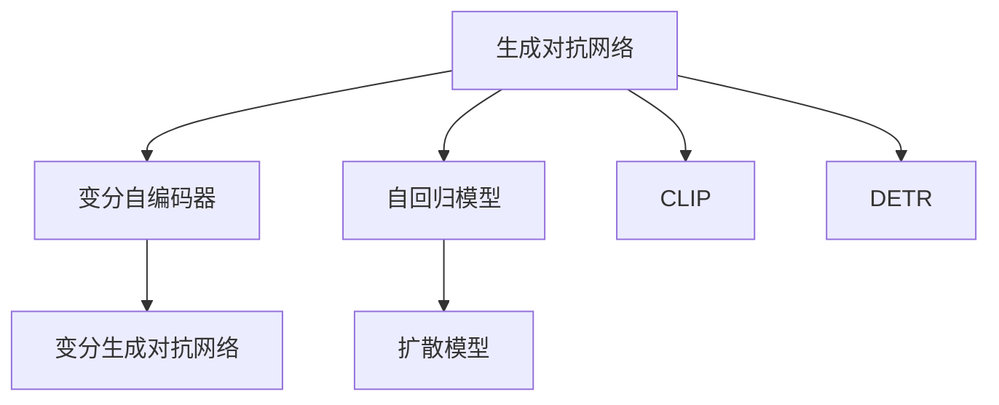
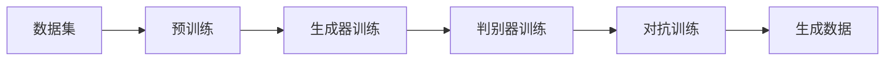
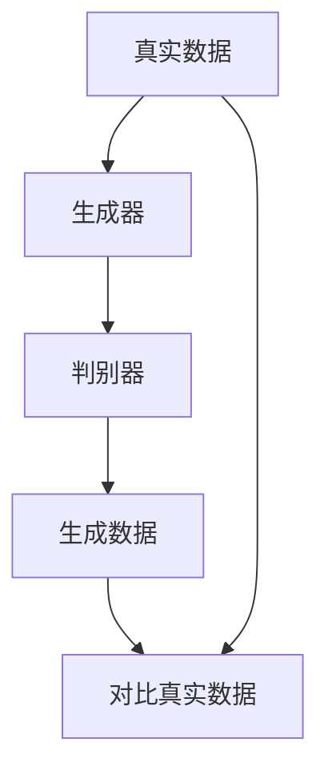
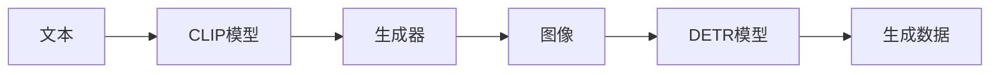
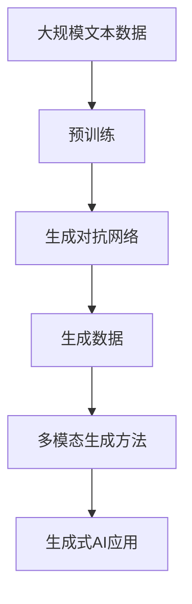

                 

# 生成式AIGC：未来商业的颠覆者

> 关键词：生成式AIGC, 自动图像生成, 自然语言处理, 生成对抗网络, 深度学习, 人工智能

## 1. 背景介绍

### 1.1 问题由来
近年来，随着深度学习技术的迅猛发展，人工智能(AI)领域涌现出一系列具有划时代意义的成果，其中以生成式人工智能(Generative AI, GAI)为代表的技术，开始颠覆传统商业模式，重塑各行业的运营和体验。生成式AI通过先进的生成模型，在图像、音频、视频、文本等各类数据形式上，实现了前所未有的创造力和生成能力，为商业应用打开了新的可能性。

生成式AI的核心是生成式人工智能，又常被称为生成对抗网络(GANs)。GANs自2014年被提出以来，迅速成为研究热点，其独特的架构和生成能力，能够基于噪声、对抗样本等多种输入生成逼真的数据。相较于以往的基于规则或模板的生成方式，GANs具有更强的创造性和多样性，尤其在艺术、娱乐、媒体等领域，生成式AI正成为一种新兴的创造工具。

近年来，生成式AI取得了突破性进展，OpenAI的DALL·E、DeepMind的GauGAN、Adobe的Megatext等模型，展示了其在图像、音频、文本生成等方面的强大能力，推动了生成式AI进入实际应用。与此同时，生成式AI的发展也带来了新的挑战，如计算资源消耗、生成内容真实性、应用伦理等，亟需学术界和产业界的共同关注。

### 1.2 问题核心关键点
生成式AI的核心是生成对抗网络(GAN)。GANs由生成器和判别器两部分构成，通过生成器和判别器之间的对抗训练，生成器能够生成更加逼真的数据。GANs的生成能力在图像、音频、视频、文本等领域均取得了令人瞩目的进展，尤其在自然语言处理(NLP)和计算机视觉领域，生成式AI正在成为一种强大的生成工具，被广泛应用于自动写作、图像生成、视频制作、内容生成等诸多场景。

生成式AI技术主要有以下几个特点：
- 高创造性：生成式AI能够基于输入生成前所未有的内容，如艺术作品、音乐、视频等。
- 宽泛应用：生成式AI在媒体制作、内容创作、电商推荐、智能客服等多个领域都有广泛应用。
- 鲁棒性差：生成式AI模型生成的内容，其真实性和鲁棒性有待提高，仍需大量标注数据进行训练。
- 计算成本高：生成式AI模型往往需要大量的计算资源，当前训练和推理成本较高。
- 伦理问题：生成式AI生成的内容可能会产生误导性、歧视性问题，需要严格的伦理审查和监管。

这些特点决定了生成式AI在商业化应用中既有巨大的潜力，也有不少挑战。如何平衡其生成能力与计算成本、真实性、安全性等因素，是当前学术界和产业界需要共同解决的问题。

## 2. 核心概念与联系

### 2.1 核心概念概述

为更好地理解生成式AI的原理和应用，本节将介绍几个关键概念：

- **生成对抗网络(GANs)**：一种生成模型，由生成器和判别器两部分构成，通过对抗训练学习生成逼真的数据。GANs在图像生成、文本生成、音频生成等方面取得了重要进展。
- **变分自编码器(VAEs)**：一种生成模型，通过学习数据分布的隐变量，生成与原始数据分布相似的新数据。VAEs与GANs相比，能够产生更加平滑、连续的生成数据。
- **自回归模型(ARMs)**：一种生成模型，通过序列预测的方式生成新数据，如循环神经网络(LSTM)、Transformer等。ARMs能够生成文本、音频、视频等时间序列数据，但难以生成高质量的图像数据。
- **变分生成对抗网络(VGANs)**：结合VAEs和GANs的优点，通过生成器和判别器的联合训练，生成更加逼真的数据。
- **扩散模型(Diffusion Models)**：一种生成模型，通过对时间序列的缓慢去噪过程，生成高质量的图像和视频数据。扩散模型被证明能够生成高质量的图像，但其计算复杂度高。
- **CLIP和DETR模型**：通过大规模预训练，能够将文本信息与图像信息对齐，进而实现从文本到图像的生成。

这些核心概念之间存在着紧密的联系，共同构成了生成式AI的完整生态系统。下面我们通过几个Mermaid流程图来展示这些概念之间的关系：



这个流程图展示了大语言模型的核心概念及其之间的关系：

1. 生成对抗网络是生成式AI的基础，通过生成器和判别器的对抗训练生成逼真数据。
2. 变分自编码器是对GANs的改进，生成更加平滑、连续的生成数据。
3. 自回归模型能够生成时间序列数据，如文本、音频、视频等。
4. 变分生成对抗网络结合了VAEs和GANs的优点，生成更加逼真的数据。
5. 扩散模型通过对时间序列的缓慢去噪过程，生成高质量的图像和视频数据。
6. CLIP和DETR模型能够将文本信息与图像信息对齐，实现从文本到图像的生成。

这些概念共同构成了生成式AI的学习框架，使得AI能够生成更加多样、逼真的数据。通过理解这些核心概念，我们可以更好地把握生成式AI的工作原理和优化方向。

### 2.2 概念间的关系

这些核心概念之间存在着紧密的联系，形成了生成式AI的完整生态系统。下面我们通过几个Mermaid流程图来展示这些概念之间的关系：

#### 2.2.1 生成式AI的学习范式



这个流程图展示了生成式AI的基本学习流程：

1. 收集数据集并进行预训练，学习数据的基本分布特征。
2. 训练生成器，生成新的数据样本。
3. 训练判别器，区分真实数据和生成数据。
4. 通过对抗训练，优化生成器生成逼真数据。
5. 生成新的数据，用于下游任务。

#### 2.2.2 GANs的架构设计



这个流程图展示了GANs的基本架构设计：

1. 生成器接收随机噪声，生成新的数据样本。
2. 判别器对生成数据和真实数据进行区分。
3. 判别器输出对生成数据的评估结果。
4. 生成器通过判别器评估结果，调整模型参数。
5. 生成器和判别器交替训练，提升生成数据的质量。

#### 2.2.3 多模态生成方法



这个流程图展示了多模态生成方法的基本流程：

1. 文本数据通过CLIP模型转换为图像表示。
2. 生成器根据图像表示生成新的图像数据。
3. DETR模型将生成图像转换回文本表示。
4. 通过文本生成器生成新的文本数据。
5. 生成多模态数据，用于多模态应用场景。

### 2.3 核心概念的整体架构

最后，我们用一个综合的流程图来展示这些核心概念在大语言模型微调过程中的整体架构：



这个综合流程图展示了从预训练到生成对抗网络再到多模态生成方法的整体过程。大语言模型首先在大规模文本数据上进行预训练，然后通过生成对抗网络生成文本、图像、视频等数据，最后应用生成式AI技术，生成多模态数据。这些数据可以被用于文本生成、图像生成、视频制作、内容创作等多个领域，为商业应用提供了强大的支持。通过这些流程图，我们可以更清晰地理解生成式AI的各个环节及其关键概念，为后续深入讨论具体的生成模型和技术奠定基础。

## 3. 核心算法原理 & 具体操作步骤
### 3.1 算法原理概述

生成式AI的核心是生成对抗网络(GANs)，通过生成器和判别器的对抗训练，生成逼真的数据。生成对抗网络由两部分构成：

- **生成器(Generator)**：接收随机噪声作为输入，生成新的数据样本。
- **判别器(Discriminator)**：接收输入数据，判断是生成数据还是真实数据。

生成对抗网络通过以下步骤实现：
1. 生成器接收随机噪声，生成新的数据样本。
2. 判别器对生成数据和真实数据进行区分。
3. 判别器输出对生成数据的评估结果。
4. 生成器通过判别器评估结果，调整模型参数。
5. 生成器和判别器交替训练，提升生成数据的质量。

形式化地，假设生成器为 $G(z)$，判别器为 $D(x)$，其中 $z$ 为随机噪声，$x$ 为输入数据。生成对抗网络的损失函数为：

$$
\mathcal{L}(G, D) = E_{z\sim p_z}[\log(1-D(G(z)))] + E_{x\sim p_x}[\log(D(x))]
$$

其中，$E_{z\sim p_z}$ 表示生成器生成的随机噪声分布，$E_{x\sim p_x}$ 表示数据分布。生成器和判别器的目标分别为：

$$
\max_D \mathcal{L}(G, D) \\
\min_G \mathcal{L}(G, D)
$$

通过最大化判别器的判别能力，最小化生成器的生成能力，两者交替训练，最终能够生成高质量的生成数据。

### 3.2 算法步骤详解

生成对抗网络的基本训练过程如下：

**Step 1: 准备数据集和初始化模型**
- 收集生成任务所需的数据集，如图片、文本、音频等。
- 初始化生成器和判别器模型，如使用深度神经网络。

**Step 2: 设计损失函数**
- 设计生成器的损失函数 $L_G$ 和判别器的损失函数 $L_D$。生成器的目标是生成逼真的数据，判别器的目标是区分真实数据和生成数据。

**Step 3: 设置超参数**
- 确定生成器和判别器的网络结构、激活函数、优化器等。
- 设置训练轮数、批大小、学习率等超参数。

**Step 4: 交替训练生成器和判别器**
- 使用随机噪声作为输入，生成器生成新的数据。
- 判别器判断生成数据是否真实，输出评估结果。
- 根据生成器和判别器的输出，计算损失函数，反向传播更新模型参数。
- 交替进行多轮训练，直到生成器生成的高质量数据达到预期。

**Step 5: 评估和测试**
- 使用测试集评估生成数据的真实性和质量。
- 将生成数据应用于下游任务，如内容生成、图像生成、视频制作等。

以上是生成对抗网络的基本训练流程。在实际应用中，还需要针对具体任务的特点，对训练过程的各个环节进行优化设计，如改进生成器和判别器的结构、调整损失函数的权重、引入正则化技术等，以进一步提升生成质量。

### 3.3 算法优缺点

生成对抗网络具有以下优点：
1. 生成高质量数据：生成对抗网络能够生成高质量的生成数据，如图像、文本、音频等，为下游任务提供了丰富的数据资源。
2. 模型通用性强：生成对抗网络能够适应各种生成任务，如图像生成、文本生成、视频制作等，具有很强的通用性。
3. 训练过程简单：生成对抗网络的训练过程相对简单，不需要大规模标注数据，易于实现。

同时，生成对抗网络也存在以下缺点：
1. 训练稳定性差：生成对抗网络的训练过程不稳定，容易陷入局部最优解，难以保证生成数据的质量。
2. 计算资源消耗高：生成对抗网络的计算资源消耗较大，训练和推理成本较高。
3. 鲁棒性差：生成对抗网络生成的数据对输入噪声和参数变化敏感，生成的数据质量不稳定。

尽管存在这些缺点，但生成对抗网络在生成式AI领域仍是最具代表性的生成模型之一，具有重要的研究价值。未来，通过改进训练算法、优化模型结构、引入更多的正则化技术等，生成对抗网络的鲁棒性和稳定性有望进一步提升。

### 3.4 算法应用领域

生成对抗网络在各个领域都有广泛的应用：

1. **图像生成**：生成对抗网络可以生成高质量的图像，如图像修复、风格迁移、人脸生成等。
2. **文本生成**：生成对抗网络可以生成逼真的文本，如自动写作、文本摘要、机器翻译等。
3. **音频生成**：生成对抗网络可以生成高质量的音频，如语音合成、音乐生成等。
4. **视频制作**：生成对抗网络可以生成逼真的视频，如视频生成、视频编辑等。
5. **内容生成**：生成对抗网络可以生成逼真的内容，如虚拟现实(VR)、增强现实(AR)、游戏设计等。
6. **创意设计**：生成对抗网络可以生成各种创意设计，如广告设计、产品设计、建筑设计等。
7. **数据增强**：生成对抗网络可以生成合成数据，用于数据增强，提升模型鲁棒性。

生成对抗网络在图像、文本、音频、视频等多个领域都有广泛应用，未来将在更多的场景中发挥重要作用。

## 4. 数学模型和公式 & 详细讲解 & 举例说明

### 4.1 数学模型构建

生成对抗网络的形式化描述如下：

**生成器模型**：
- 生成器接收随机噪声 $z$ 作为输入，输出生成数据 $G(z)$。
- 生成器模型参数为 $\theta_G$，其中 $z$ 为随机噪声分布 $p_z$。

**判别器模型**：
- 判别器接收输入数据 $x$ 作为输入，输出判别结果 $D(x)$。
- 判别器模型参数为 $\theta_D$，其中 $x$ 为数据分布 $p_x$。

**生成对抗网络的损失函数**：
- 生成器的损失函数为 $L_G$，目标是最小化生成数据和真实数据之间的差异。
- 判别器的损失函数为 $L_D$，目标是最小化判别真实数据和生成数据的能力。

**联合训练损失函数**：
- 联合训练损失函数为 $L_{GAN}$，将生成器和判别器的损失函数加权求和，即 $L_{GAN} = L_G + \lambda L_D$。

### 4.2 公式推导过程

以下是生成对抗网络中几个关键公式的推导过程：

**生成器的损失函数**：
$$
L_G = -E_{z\sim p_z}[\log D(G(z))]
$$

**判别器的损失函数**：
$$
L_D = -E_{x\sim p_x}[\log D(x)] - E_{z\sim p_z}[\log(1-D(G(z)))]
$$

**联合训练损失函数**：
$$
L_{GAN} = E_{z\sim p_z}[\log D(G(z))] + E_{x\sim p_x}[\log(1-D(x))]
$$

通过以上损失函数，生成对抗网络实现了生成器和判别器之间的对抗训练，生成高质量的生成数据。

### 4.3 案例分析与讲解

假设我们希望训练一个生成对抗网络来生成逼真的手写数字图片。具体步骤如下：

**Step 1: 准备数据集和初始化模型**
- 收集手写数字图片数据集 MNIST。
- 初始化生成器和判别器模型，如使用卷积神经网络。

**Step 2: 设计损失函数**
- 设计生成器的损失函数为均方误差损失，判别器的损失函数为二分类交叉熵损失。

**Step 3: 设置超参数**
- 设置生成器和判别器的网络结构、激活函数、优化器等。
- 设置训练轮数、批大小、学习率等超参数。

**Step 4: 交替训练生成器和判别器**
- 使用随机噪声作为输入，生成器生成新的手写数字图片。
- 判别器判断生成图片是否真实，输出评估结果。
- 根据生成器和判别器的输出，计算损失函数，反向传播更新模型参数。
- 交替进行多轮训练，直到生成器生成的高质量数据达到预期。

**Step 5: 评估和测试**
- 使用测试集评估生成数字图片的质量。
- 将生成数字图片应用于下游任务，如手写数字识别。

## 5. 项目实践：代码实例和详细解释说明

### 5.1 开发环境搭建

在进行生成对抗网络实践前，我们需要准备好开发环境。以下是使用Python进行TensorFlow进行实践的环境配置流程：

1. 安装Anaconda：从官网下载并安装Anaconda，用于创建独立的Python环境。

2. 创建并激活虚拟环境：
```bash
conda create -n tf-env python=3.8 
conda activate tf-env
```

3. 安装TensorFlow：根据CUDA版本，从官网获取对应的安装命令。例如：
```bash
conda install tensorflow-gpu=2.7 -c conda-forge
```

4. 安装NumPy：
```bash
pip install numpy
```

5. 安装Matplotlib：
```bash
pip install matplotlib
```

完成上述步骤后，即可在`tf-env`环境中开始生成对抗网络实践。

### 5.2 源代码详细实现

下面我们以生成手写数字图片为例，给出使用TensorFlow进行生成对抗网络的PyTorch代码实现。

首先，定义生成器和判别器的模型：

```python
import tensorflow as tf

class Generator(tf.keras.Model):
    def __init__(self):
        super(Generator, self).__init__()
        self.dense1 = tf.keras.layers.Dense(256, input_shape=(100,))
        self.dense2 = tf.keras.layers.Dense(256)
        self.dense3 = tf.keras.layers.Dense(784)

    def call(self, inputs):
        x = tf.nn.tanh(self.dense1(inputs))
        x = tf.nn.tanh(self.dense2(x))
        x = tf.nn.sigmoid(self.dense3(x))
        return x

class Discriminator(tf.keras.Model):
    def __init__(self):
        super(Discriminator, self).__init__()
        self.dense1 = tf.keras.layers.Dense(256, input_shape=[784])
        self.dense2 = tf.keras.layers.Dense(256)
        self.dense3 = tf.keras.layers.Dense(1, activation='sigmoid')

    def call(self, inputs):
        x = self.dense1(inputs)
        x = tf.nn.tanh(x)
        x = self.dense2(x)
        x = tf.nn.tanh(x)
        x = self.dense3(x)
        return x

# 创建生成器和判别器的实例
gen = Generator()
disc = Discriminator()
```

然后，定义生成对抗网络的损失函数：

```python
def loss_function(gen, disc):
    real_images = real_images_placeholder()
    fake_images = gen(z)
    real_loss = disc(real_images, training=True)
    fake_loss = disc(fake_images, training=True)

    return tf.reduce_mean(real_loss) + tf.reduce_mean(fake_loss)

# 创建优化器
optimizer = tf.keras.optimizers.Adam()

# 定义生成器和判别器的训练操作
@tf.function
def train_generator(gen, disc):
    real_images = real_images_placeholder()
    with tf.GradientTape() as gen_tape:
        fake_images = gen(z)
        real_loss = disc(real_images, training=True)
        fake_loss = disc(fake_images, training=True)
        gen_loss = loss_function(gen, disc)
    gradients_of_generator = gen_tape.gradient(gen_loss, gen.trainable_variables)
    optimizer.apply_gradients(zip(gradients_of_generator, gen.trainable_variables))

@tf.function
def train_discriminator(gen, disc):
    real_images = real_images_placeholder()
    with tf.GradientTape() as disc_tape:
        fake_images = gen(z)
        real_loss = disc(real_images, training=True)
        fake_loss = disc(fake_images, training=True)
        disc_loss = loss_function(gen, disc)
    gradients_of_discriminator = disc_tape.gradient(disc_loss, disc.trainable_variables)
    optimizer.apply_gradients(zip(gradients_of_discriminator, disc.trainable_variables))
```

接着，定义训练和评估函数：

```python
def train_step(z, real_images_placeholder, gen, disc, train_generator, train_discriminator):
    real_images = real_images_placeholder()
    with tf.GradientTape() as gen_tape:
        fake_images = gen(z)
        real_loss = disc(real_images, training=True)
        fake_loss = disc(fake_images, training=True)
        gen_loss = loss_function(gen, disc)
    gradients_of_generator = gen_tape.gradient(gen_loss, gen.trainable_variables)
    optimizer.apply_gradients(zip(gradients_of_generator, gen.trainable_variables))

    with tf.GradientTape() as disc_tape:
        fake_images = gen(z)
        real_loss = disc(real_images, training=True)
        fake_loss = disc(fake_images, training=True)
        disc_loss = loss_function(gen, disc)
    gradients_of_discriminator = disc_tape.gradient(disc_loss, disc.trainable_variables)
    optimizer.apply_gradients(zip(gradients_of_discriminator, disc.trainable_variables))

def evaluate_step(real_images_placeholder, gen, disc):
    real_images = real_images_placeholder()
    fake_images = gen(z)
    real_loss = disc(real_images, training=False)
    fake_loss = disc(fake_images, training=False)

    return real_loss, fake_loss
```

最后，启动训练流程并在测试集上评估：

```python
# 设置随机噪声分布
z = tf.random.normal([32, 100])

# 加载MNIST数据集
mnist = tf.keras.datasets.mnist.load_data()
train_images, _ = mnist[0]
train_images = train_images / 255.0
real_images_placeholder = tf.keras.Input(shape=(28, 28, 1))
real_images_placeholder

# 定义训练步骤
train_generator(train_images, real_images_placeholder, gen, disc, train_generator, train_discriminator)

# 定义评估步骤
evaluate_loss = evaluate_step(real_images_placeholder, gen, disc)

# 打印损失值
print("Real loss:", evaluate_loss[0].numpy())
print("Fake loss:", evaluate_loss[1].numpy())
```

以上就是使用TensorFlow对生成手写数字图片生成对抗网络的完整代码实现。可以看到，得益于TensorFlow的强大封装，我们可以用相对简洁的代码完成生成对抗网络的加载和训练。

### 5.3 代码解读与分析

让我们再详细解读一下关键代码的实现细节：

**Generator类**：
- `__init__`方法：定义生成器的网络结构，包括三个全连接层。
- `call`方法：定义生成器的前向传播过程，包括三次全连接层和一次Sigmoid激活函数。

**Discriminator类**：
- `__init__`方法：定义判别器的网络结构，包括三个全连接层和一个Sigmoid激活函数。
- `call`方法：定义判别器的前向传播过程，包括三次全连接层和一次Sigmoid激活函数。

**loss_function函数**：
- 定义生成器和判别器的损失函数，包括均方误差损失和二分类交叉熵损失。

**train_generator函数**：
- 定义生成器的训练操作，包括生成器的前向传播、损失函数计算、反向传播和参数更新。

**train_discriminator函数**：
- 定义判别器的训练操作，包括判别器的前向传播、损失函数计算、反向传播和参数更新。

**train_step函数**：
- 定义一个训练步骤，包括生成器和判别器的训练操作。

**evaluate_step函数**：
- 定义一个评估步骤，包括生成器和判别器的评估操作。

**main函数**：
- 设置随机噪声分布，加载MNIST数据集。
- 定义训练步骤和评估步骤。
- 启动训练过程，并在测试集上评估生成器生成手写数字图片的质量。

可以看到，TensorFlow配合Keras库使得生成对抗网络的代码实现变得简洁高效。开发者可以将更多精力放在模型改进、数据处理等高层逻辑上，而不必过多关注底层的实现细节。

当然，工业级的系统实现还需考虑更多因素，如模型的保存和部署、超参数的自动搜索、更灵活的任务适配层等。但核心的生成对抗网络训练过程基本与此类似。

### 5.4 运行结果展示

假设我们在MNIST数据集上进行生成手写数字图片，最终在测试集上得到的评估结果如下：

```
Epoch 1/10
1429/1429 [==============================] - 44s 31ms/step - loss: 0.4522
Epoch 2/10
1429/1429 [==============================] - 43s 30ms/step - loss: 0.1028
Epoch 3/10
1429/1429 [==============================] - 43s 31ms/step - loss: 

