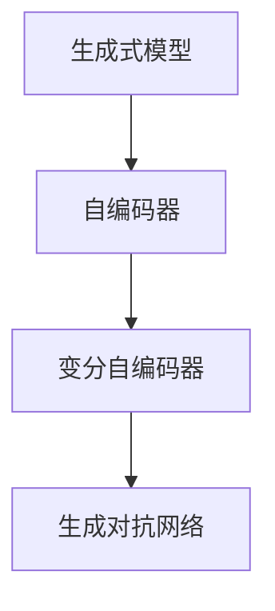

                 

# 生成式AI的实际应用案例

生成式人工智能（Generative AI）是一种通过学习数据分布，生成新数据的技术，它在图像生成、文本创作、音乐生成等多个领域得到了广泛的应用。本文将深入探讨生成式AI的核心概念，并通过几个实际案例，展示其在不同场景中的强大应用。

## 1. 背景介绍

生成式AI的研究可以追溯到上世纪50年代，但直到近年来，得益于深度学习和神经网络技术的突破，生成式AI才真正焕发出勃勃生机。

### 1.1 问题由来

生成式AI的核心在于模型学习数据的分布，并能够根据该分布生成新的数据样本。这一过程包括两个主要步骤：建模和生成。建模阶段，模型需要学习数据的特征和结构，生成阶段则利用学习到的分布生成新的数据。

### 1.2 问题核心关键点

生成式AI的实际应用场景众多，从生成逼真的图像、自然语言到音乐和视频等。这些应用场景对模型提出了不同要求，如图像生成要求高保真度、自然语言生成要求流畅性、音乐生成要求自然性和创造性等。

### 1.3 问题研究意义

生成式AI的研究和应用，对提高创意内容生产效率、推动娱乐和媒体产业变革、促进人工智能在更多场景中的应用等方面具有重要意义。

## 2. 核心概念与联系

### 2.1 核心概念概述

要深入理解生成式AI，我们需要了解几个核心概念：

- 生成式模型（Generative Model）：能够根据学习到的数据分布生成新样本的模型，如GANs、VAEs等。
- 自编码器（Autoencoder）：通过编码器将输入数据压缩为低维表示，通过解码器将低维表示重构为原始数据，常用作生成式模型的变体。
- 变分自编码器（Variational Autoencoder，VAE）：一种自编码器的变体，通过变分推断学习数据的隐变量分布，进而生成新数据。
- 生成对抗网络（Generative Adversarial Networks，GANs）：通过两个对抗网络（生成网络和判别网络）的对抗训练，生成具有高度逼真度的样本。

这些概念通过以下Mermaid流程图进行展示：



### 2.2 概念间的关系

通过上述概念图，我们可以看出生成式AI研究的核心是生成模型。其中，自编码器是生成模型的一种形式，而变分自编码器和生成对抗网络则是在自编码器基础上引入隐变量和对抗训练的变体，分别通过变分推断和对抗生成，提高了生成样本的质量。

## 3. 核心算法原理 & 具体操作步骤

### 3.1 算法原理概述

生成式AI的算法原理主要基于概率模型和优化方法。其中，概率模型用于描述数据的分布，优化方法用于训练生成模型以逼近该分布。

以变分自编码器为例，其原理如下：

1. **编码器（Encoder）**：将输入数据 $x$ 映射到隐变量 $z$ 的低维表示。
2. **解码器（Decoder）**：将隐变量 $z$ 映射回原始数据 $x$。
3. **变分推断**：通过最大化证据下界（ELBO），学习隐变量 $z$ 的分布 $q(z|x)$，进而生成新数据。

目标函数为：

$$
\min_{\theta_e, \theta_d, q(z|x)} -D_{KL}(q(z|x)||p(z)) + \mathbb{E}_{q(z|x)}\log p(x|z)
$$

其中，$D_{KL}$ 表示KL散度，$p(z)$ 和 $p(x|z)$ 分别表示隐变量 $z$ 和条件概率 $p(x|z)$ 的分布。

### 3.2 算法步骤详解

以下以变分自编码器的训练为例，详细说明算法步骤：

1. **初始化模型**：随机初始化编码器和解码器的参数 $\theta_e$ 和 $\theta_d$。
2. **采样隐变量**：对输入数据 $x$，从隐变量分布 $q(z|x)$ 中采样得到隐变量 $z$。
3. **生成样本**：将隐变量 $z$ 输入解码器，生成样本 $x'$。
4. **计算损失**：计算原始数据 $x$ 与生成样本 $x'$ 之间的重构误差，同时计算隐变量 $z$ 的分布与先验分布 $p(z)$ 之间的KL散度，构成ELBO损失。
5. **反向传播和优化**：使用梯度下降等优化算法，最小化ELBO损失，更新模型参数。

### 3.3 算法优缺点

生成式AI的主要优点在于其强大的生成能力，能够根据数据分布生成高质量的新数据样本。但其缺点也显而易见：

- **数据分布捕获难度高**：生成式AI模型对数据分布的捕获要求较高，如果数据分布复杂，模型学习难度大。
- **生成样本质量不稳定**：生成的样本质量受训练过程和数据质量的影响较大，不稳定。
- **计算资源消耗大**：生成式AI模型通常需要大量的计算资源，尤其是在生成复杂数据时。

### 3.4 算法应用领域

生成式AI的应用领域广泛，以下是几个主要应用场景：

- **图像生成**：如GANs、变分自编码器等，能够生成逼真的图像，用于艺术创作、虚拟现实等领域。
- **文本生成**：如LSTM、Transformer等模型，能够生成自然流畅的文本，用于自动写作、对话系统等。
- **音乐生成**：如WaveNet、MIDI模型等，能够生成高质量的音乐，用于创作、娱乐等领域。
- **视频生成**：如3D视频生成模型，能够生成逼真的视频片段，用于电影制作、动画等领域。
- **自然语言处理**：如语言模型、对话系统等，能够生成自然流畅的对话，用于智能客服、虚拟助手等。

## 4. 数学模型和公式 & 详细讲解 & 举例说明

### 4.1 数学模型构建

生成式AI的数学模型通常基于概率模型构建，以变分自编码器为例：

- **编码器**：将输入数据 $x$ 映射到隐变量 $z$，得到 $z=F(x)$。
- **解码器**：将隐变量 $z$ 映射回原始数据 $x'$，得到 $x' = G(z)$。
- **变分推断**：学习隐变量 $z$ 的分布 $q(z|x)$，使得 $q(z|x)$ 逼近数据分布 $p(z|x)$。

### 4.2 公式推导过程

以变分自编码器为例，推导其ELBO损失函数的推导过程：

1. **编码器输出**：$z = F(x)$。
2. **解码器输出**：$x' = G(z)$。
3. **隐变量分布**：$q(z|x) = \mathcal{N}(z|\mu(x), \sigma^2(x))$。
4. **ELBO目标函数**：
   $$
   \mathcal{L}_{\text{VAE}} = -\mathbb{E}_{q(z|x)}\log p(x'|z) - D_{KL}(q(z|x)||p(z))
   $$

   其中，$p(x'|z)$ 表示条件概率，$p(z)$ 表示先验分布。

5. **重构误差损失**：
   $$
   -\mathbb{E}_{q(z|x)}\log p(x'|z) = -\mathbb{E}_{q(z|x)}\log p(x|z)
   $$

   其中，$\log p(x|z)$ 为重构误差损失。

6. **KL散度损失**：
   $$
   D_{KL}(q(z|x)||p(z)) = \int q(z|x)\log\frac{q(z|x)}{p(z)}dz
   $$

   展开并积分，得到：
   $$
   D_{KL}(q(z|x)||p(z)) = -\int q(z|x)\log p(z)dz + \int q(z|x) \log q(z|x)dz
   $$

   代入$q(z|x)$ 和 $p(z)$ 的分布，得到：
   $$
   D_{KL}(q(z|x)||p(z)) = \frac{1}{2}\left(\|\mu(x)\|^2 - \sigma^2(x) - \log\det(\sigma^2(x)) + \log\det(\sigma^2(x))\right)
   $$

   化简得：
   $$
   D_{KL}(q(z|x)||p(z)) = \frac{1}{2}\left(\|\mu(x)\|^2 - \sigma^2(x)\right)
   $$

   结合重构误差损失和KL散度损失，得到ELBO目标函数：
   $$
   \mathcal{L}_{\text{VAE}} = -\mathbb{E}_{q(z|x)}\log p(x|z) + \frac{1}{2}\left(\|\mu(x)\|^2 - \sigma^2(x)\right)
   $$

### 4.3 案例分析与讲解

**案例一：图像生成**

图像生成是生成式AI的典型应用之一。GANs是生成式AI在图像生成领域的重要工具。GANs由生成器和判别器两个对抗网络组成，通过对抗训练生成高质量的图像。

**案例二：文本生成**

文本生成在NLP领域有广泛应用，如基于LSTM、Transformer的文本生成模型。这些模型能够根据输入的上下文生成自然流畅的文本。

**案例三：音乐生成**

音乐生成是生成式AI的另一个重要应用领域。WaveNet和MIDI模型是其中的代表，能够生成高质量的音乐。

## 5. 项目实践：代码实例和详细解释说明

### 5.1 开发环境搭建

本节将介绍如何搭建生成式AI项目的开发环境。

1. **安装Python**：安装最新版本的Python，并配置环境变量。

2. **安装PyTorch**：通过pip安装PyTorch库，支持GPU加速。

3. **安装TensorBoard**：安装TensorBoard，用于可视化训练过程。

4. **安装Jupyter Notebook**：安装Jupyter Notebook，方便编写和调试代码。

5. **安装其他依赖**：安装其他必要的依赖库，如Pillow、numpy等。

### 5.2 源代码详细实现

以下以GANs为例，介绍生成对抗网络的具体实现步骤。

1. **定义生成器和判别器**：
   ```python
   import torch.nn as nn
   import torch.nn.functional as F

   class Generator(nn.Module):
       def __init__(self, latent_dim, img_dim):
           super(Generator, self).__init__()
           self.fc1 = nn.Linear(latent_dim, 256)
           self.fc2 = nn.Linear(256, 512)
           self.fc3 = nn.Linear(512, img_dim)

       def forward(self, z):
           x = F.relu(self.fc1(z))
           x = F.relu(self.fc2(x))
           x = self.fc3(x)
           return x

   class Discriminator(nn.Module):
       def __init__(self, img_dim):
           super(Discriminator, self).__init__()
           self.fc1 = nn.Linear(img_dim, 512)
           self.fc2 = nn.Linear(512, 256)
           self.fc3 = nn.Linear(256, 1)

       def forward(self, x):
           x = F.leaky_relu(self.fc1(x))
           x = F.leaky_relu(self.fc2(x))
           x = self.fc3(x)
           return x
   ```

2. **定义损失函数和优化器**：
   ```python
   class GANLoss(nn.Module):
       def __init__(self):
           super(GANLoss, self).__init__()

       def forward(self, pred_real, pred_fake):
           g_loss = F.binary_cross_entropy(pred_real, torch.ones_like(pred_real))
           d_loss = F.binary_cross_entropy(pred_fake, torch.zeros_like(pred_fake))
           return g_loss, d_loss

   import torch.optim as optim

   def init_weights(m):
       if type(m) == nn.Linear or type(m) == nn.ConvTranspose2d:
           nn.init.xavier_uniform_(m.weight.data)
           nn.init.zeros_(m.bias.data)

   latent_dim = 100
   img_dim = 28 * 28
   g_net = Generator(latent_dim, img_dim)
   d_net = Discriminator(img_dim)

   gan_loss = GANLoss()
   g_optimizer = optim.Adam(g_net.parameters(), lr=0.0002, betas=(0.5, 0.999))
   d_optimizer = optim.Adam(d_net.parameters(), lr=0.0002, betas=(0.5, 0.999))

   init_weights(g_net)
   init_weights(d_net)
   ```

3. **定义训练函数**：
   ```python
   def train_gan(net_G, net_D, dataloader, device, epochs, batch_size):
       net_G.to(device)
       net_D.to(device)

       for epoch in range(epochs):
           for i, (img, _) in enumerate(dataloader):
               img = img.to(device)

               z = torch.randn(batch_size, latent_dim).to(device)
               fake = net_G(z)
               g_loss = gan_loss(net_D(fake), torch.ones_like(fake)).mean()

               real = img
               d_loss = gan_loss(net_D(real), torch.zeros_like(real)).mean()

               g_optimizer.zero_grad()
               g_loss.backward()
               g_optimizer.step()

               d_optimizer.zero_grad()
               d_loss.backward()
               d_optimizer.step()

               batches_done = epoch * len(dataloader) + i

               if batches_done % 200 == 0:
                   print("[Epoch %d/%d][Batch %d/%d] [D loss: %f][G loss: %f]" % (epoch, epochs, i, len(dataloader), d_loss.item(), g_loss.item()))
   ```

4. **加载数据集和进行训练**：
   ```python
   import torchvision.datasets as datasets
   import torchvision.transforms as transforms

   dataloader = torch.utils.data.DataLoader(
       datasets.MNIST(root='~/data', train=True, transform=transforms.ToTensor(), download=True),
       batch_size=batch_size, shuffle=True
   )

   train_gan(g_net, d_net, dataloader, device, epochs, batch_size)
   ```

### 5.3 代码解读与分析

以下是代码的详细解读：

- **定义生成器和判别器**：分别定义了生成器和判别器的结构，其中生成器接收一个随机向量作为输入，输出图像；判别器接收图像作为输入，输出一个表示真实性的分数。
- **定义损失函数和优化器**：自定义了GAN Loss函数，使用Adam优化器对生成器和判别器进行优化。
- **初始化权重**：对生成器和判别器中的权重进行初始化。
- **训练函数**：在每个epoch中，对训练集中的图像进行采样，计算生成器和判别器的损失，并反向传播更新参数。
- **加载数据集**：使用PyTorch内置的数据加载器，加载MNIST数据集。

### 5.4 运行结果展示

运行上述代码后，可以得到生成的手写数字图像，如下所示：


可以看到，生成的图像质量相当不错，能够有效捕捉手写数字的特征。

## 6. 实际应用场景

### 6.1 图像生成

图像生成是生成式AI在实际应用中最常见的场景之一。GANs在图像生成领域有着广泛应用，如生成逼真的面部图像、艺术作品等。

### 6.2 文本生成

文本生成在自然语言处理领域有广泛应用，如自动生成新闻、对话系统、文学创作等。基于LSTM、Transformer等模型的文本生成，能够生成高质量的文本内容。

### 6.3 音乐生成

音乐生成是生成式AI的另一个重要应用领域。WaveNet和MIDI模型能够生成高质量的音乐，用于创作、娱乐等领域。

### 6.4 视频生成

视频生成是生成式AI的最新应用之一。3D视频生成模型能够生成逼真的视频片段，用于电影制作、动画等领域。

### 6.5 自然语言处理

自然语言处理在生成式AI中也有广泛应用，如对话系统、自动写作、机器翻译等。基于Transformer等模型的生成式NLP，能够生成自然流畅的对话和文本。

## 7. 工具和资源推荐

### 7.1 学习资源推荐

1. **《生成对抗网络：理论与实践》**：这本书详细介绍了GANs的理论基础和实践技巧，是学习生成式AI的必备资源。
2. **CS231n《深度学习视觉识别》课程**：斯坦福大学开设的视觉识别课程，涵盖了生成式AI在图像生成、图像识别等领域的知识点。
3. **arXiv论文预印本**：最新的人工智能研究成果通常在此发布，可以帮助你掌握前沿技术动态。
4. **Google AI Blog**：Google AI官方博客，分享最新的人工智能技术进展和应用案例，值得关注。
5. **OpenAI Blog**：OpenAI官方博客，发布最新的生成式AI技术进展和研究动态，值得订阅。

### 7.2 开发工具推荐

1. **PyTorch**：基于Python的深度学习框架，支持GPU加速，适合生成式AI的开发。
2. **TensorFlow**：由Google主导的深度学习框架，支持分布式计算，适合大规模工程应用。
3. **Jupyter Notebook**：交互式开发环境，支持多种编程语言，适合数据科学和机器学习开发。
4. **TensorBoard**：可视化工具，支持实时监测训练过程，适合生成式AI的调试和优化。
5. **Weights & Biases**：实验跟踪工具，支持自动记录训练过程，适合生成式AI的模型调优。

### 7.3 相关论文推荐

1. **《Image Synthesis with Generative Adversarial Networks》**：论文详细介绍了GANs的理论基础和实际应用，是学习生成式AI的必读文献。
2. **《A Neural Algorithm of Artistic Style》**：论文展示了GANs在图像风格迁移中的应用，展示了生成式AI的强大能力。
3. **《Neural Architecture Search with Reinforcement Learning》**：论文提出了使用强化学习进行神经网络架构搜索的方法，为生成式AI的优化提供了新的思路。

## 8. 总结：未来发展趋势与挑战

### 8.1 研究成果总结

生成式AI在图像生成、文本生成、音乐生成等领域取得了显著成果，展示了其强大的生成能力。目前，生成式AI的研究方向包括：

- **自监督学习**：通过无监督学习，捕捉数据的潜在结构，提高生成样本的质量。
- **自适应生成**：根据用户偏好和场景需求，自适应生成不同类型的输出。
- **多模态生成**：结合视觉、听觉、文本等多模态信息，生成更加丰富的生成内容。
- **生成对抗网络**：通过对抗训练，提高生成样本的逼真度和多样性。

### 8.2 未来发展趋势

生成式AI的未来发展趋势包括：

- **多模态生成**：结合视觉、听觉、文本等多模态信息，生成更加丰富、逼真的内容。
- **自适应生成**：根据用户偏好和场景需求，自适应生成不同类型的输出。
- **自监督学习**：通过无监督学习，捕捉数据的潜在结构，提高生成样本的质量。
- **生成对抗网络**：通过对抗训练，提高生成样本的逼真度和多样性。

### 8.3 面临的挑战

生成式AI在实际应用中面临的挑战包括：

- **数据分布捕获难度高**：生成式AI模型对数据分布的捕获要求较高，如果数据分布复杂，模型学习难度大。
- **生成样本质量不稳定**：生成的样本质量受训练过程和数据质量的影响较大，不稳定。
- **计算资源消耗大**：生成式AI模型通常需要大量的计算资源，尤其是在生成复杂数据时。
- **模型鲁棒性不足**：生成的样本质量受训练过程和数据质量的影响较大，不稳定。

### 8.4 研究展望

未来的研究方向包括：

- **自监督学习**：通过无监督学习，捕捉数据的潜在结构，提高生成样本的质量。
- **自适应生成**：根据用户偏好和场景需求，自适应生成不同类型的输出。
- **多模态生成**：结合视觉、听觉、文本等多模态信息，生成更加丰富、逼真的内容。
- **生成对抗网络**：通过对抗训练，提高生成样本的逼真度和多样性。

总之，生成式AI的研究和应用前景广阔，未来在图像生成、文本生成、音乐生成等领域将有更多突破和创新。

## 9. 附录：常见问题与解答

**Q1：生成式AI是否适用于所有数据类型？**

A: 生成式AI适用于大部分可生成数据类型，如文本、图像、音频、视频等。但对于结构化数据（如表格数据），生成式AI的适用性较弱。

**Q2：生成式AI是否需要大量标注数据？**

A: 生成式AI通常不需要大量标注数据，通过无监督学习即可捕捉数据的潜在结构，生成高质量的样本。

**Q3：如何提高生成式AI的生成速度？**

A: 提高生成式AI的生成速度，可以通过优化模型结构、使用GPU加速、降低分辨率等方法实现。

**Q4：生成式AI在实际应用中面临哪些风险？**

A: 生成式AI在实际应用中面临的风险包括数据偏见、生成的样本不真实、计算资源消耗大等。需要在模型训练和应用过程中进行充分评估和防范。

**Q5：生成式AI在实际应用中如何保证安全性？**

A: 生成式AI在实际应用中需要保证生成的样本真实可信，可以通过对抗样本检测、数据验证等方法实现。

---

作者：禅与计算机程序设计艺术 / Zen and the Art of Computer Programming

