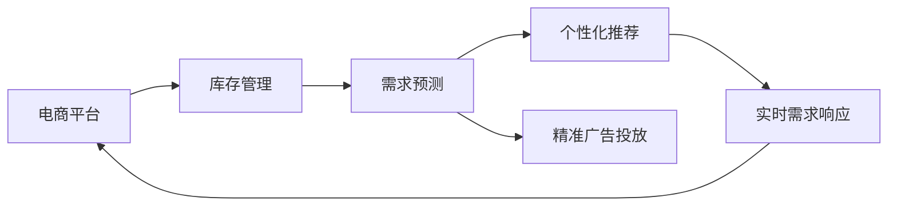

                 

# 电商平台供给能力提升：精准营销策略

## 1. 背景介绍

### 1.1 问题由来

随着电子商务的迅速发展，电商平台已成为现代社会的重要组成部分。它们不仅提供商品销售渠道，还集成了支付、物流、售后服务等功能，成为商家与消费者之间的桥梁。然而，面对市场竞争的加剧和消费者需求的多样化，如何提升平台供给能力，实现精准营销，成为了电商平台面临的重要课题。

在当前电商行业中，供给能力不足和营销策略失效的问题尤为突出。具体表现在以下几个方面：

1. **库存管理不科学**：平台商家往往缺乏有效的库存管理系统，导致商品断货或库存积压，影响了用户体验和商家利润。
2. **营销效果不佳**：传统的广告投放和促销活动，无法精准触达目标用户，导致广告预算浪费，回报率低下。
3. **需求响应迟缓**：平台对用户需求的响应速度慢，未能及时调整库存和促销策略，影响了市场竞争力和用户体验。
4. **数据利用不足**：平台掌握海量用户数据和交易数据，但未能有效挖掘数据价值，未能实现个性化推荐和精准营销。

### 1.2 问题核心关键点

为了解决上述问题，电商平台需要采用精准营销策略，利用数据分析和算法优化，实现库存管理、广告投放和需求响应的智能化。核心关键点包括：

1. **库存优化**：基于用户需求和市场趋势，智能调整库存水平，避免断货或积压。
2. **精准投放**：利用用户行为数据和预测模型，精准触达目标用户，提高广告效果。
3. **需求响应**：实时监测用户需求变化，动态调整价格和促销策略，增强市场竞争力。
4. **数据挖掘**：利用机器学习和深度学习技术，挖掘用户潜在需求，实现个性化推荐。

## 2. 核心概念与联系

### 2.1 核心概念概述

为了更好地理解精准营销策略，本节将介绍几个关键概念及其相互联系：

1. **电商平台**：提供在线购物体验的综合性平台，集成了商品展示、购物车、支付、物流等功能。
2. **库存管理**：管理商品库存水平，确保商品的可用性和效率。
3. **需求预测**：基于历史数据和市场趋势，预测用户需求变化，指导库存和促销策略的调整。
4. **个性化推荐**：利用用户行为数据和机器学习模型，为用户推荐感兴趣的商品。
5. **精准广告投放**：利用用户数据和预测模型，将广告精准推送给目标用户。
6. **实时需求响应**：监测用户行为和市场动态，实时调整价格和促销策略，提升用户体验和商家利润。

这些概念通过电商平台的数据流通和业务流程，紧密联系在一起。平台通过收集和分析用户数据，实现库存优化、需求预测、个性化推荐和精准广告投放，从而提升整体供给能力和用户满意度。

### 2.2 概念间的关系

这些核心概念之间的关系可以用以下Mermaid流程图来展示：



这个流程图展示了电商平台中不同概念之间的相互关系。库存管理、需求预测、个性化推荐和精准广告投放共同构成电商平台的核心功能，而实时需求响应则通过动态调整价格和促销策略，增强平台的市场竞争力和用户体验。

## 3. 核心算法原理 & 具体操作步骤
### 3.1 算法原理概述

精准营销策略的实现，主要依赖于以下几个核心算法和模型：

1. **库存优化算法**：通过需求预测和需求响应算法，动态调整库存水平，确保商品供需平衡。
2. **需求预测模型**：利用历史销售数据和市场趋势，预测用户需求变化，指导库存和促销策略。
3. **个性化推荐算法**：基于用户行为数据和深度学习模型，为用户推荐感兴趣的商品。
4. **精准广告投放模型**：利用用户数据和预测模型，精准推送广告，提高广告效果。
5. **实时需求响应算法**：通过监测用户行为和市场动态，实时调整价格和促销策略，增强市场竞争力。

这些算法和模型通过数据驱动的决策，实现了电商平台的智能化运营，提升了整体供给能力和用户满意度。

### 3.2 算法步骤详解

接下来，我们详细讲解每个核心算法的详细步骤：

#### 3.2.1 库存优化算法

1. **需求预测**：
   - 收集历史销售数据、市场趋势和季节性因素，构建时间序列模型（如ARIMA、LSTM等），预测未来需求量。
   - 利用机器学习模型（如随机森林、GBDT等），对时间序列模型进行修正，提高预测准确性。

2. **库存调整**：
   - 根据需求预测结果，结合历史库存水平和供货周期，计算最优库存水平。
   - 通过库存管理系统，自动调整库存水平，确保商品供需平衡。

#### 3.2.2 需求预测模型

1. **数据准备**：
   - 收集历史销售数据、市场趋势和用户行为数据，构建特征向量。
   - 对数据进行预处理，如归一化、缺失值处理等，确保数据质量。

2. **模型训练**：
   - 利用历史数据训练时间序列模型（如ARIMA、LSTM等），预测未来需求量。
   - 利用机器学习模型（如随机森林、GBDT等），对时间序列模型进行修正，提高预测准确性。

3. **结果应用**：
   - 将需求预测结果反馈给库存管理系统，指导库存调整。
   - 实时监测需求变化，动态调整库存和促销策略。

#### 3.2.3 个性化推荐算法

1. **数据收集**：
   - 收集用户行为数据，如浏览历史、点击记录、购买记录等，构建用户行为特征向量。
   - 收集商品属性数据，如价格、类别、品牌等，构建商品特征向量。

2. **模型训练**：
   - 利用协同过滤、基于内容的推荐算法，构建个性化推荐模型。
   - 利用深度学习模型（如FM、MLP、CTR等），对推荐模型进行优化，提高推荐效果。

3. **结果应用**：
   - 将推荐结果推送给用户，提高用户体验和转化率。
   - 实时监测推荐效果，动态调整推荐策略。

#### 3.2.4 精准广告投放模型

1. **数据准备**：
   - 收集用户数据，如年龄、性别、地理位置、浏览记录等，构建用户特征向量。
   - 收集广告数据，如广告内容、投放时间、点击率等，构建广告特征向量。

2. **模型训练**：
   - 利用分类算法（如逻辑回归、SVM等），构建精准广告投放模型。
   - 利用深度学习模型（如CNN、RNN等），对广告投放模型进行优化，提高投放效果。

3. **结果应用**：
   - 将广告投放至目标用户，提高广告效果和点击率。
   - 实时监测广告效果，动态调整广告投放策略。

#### 3.2.5 实时需求响应算法

1. **数据收集**：
   - 收集用户行为数据，如浏览历史、点击记录、购买记录等，构建用户行为特征向量。
   - 收集市场动态数据，如价格变化、促销活动等，构建市场特征向量。

2. **需求分析**：
   - 利用机器学习模型（如随机森林、GBDT等），分析用户需求和市场动态。
   - 实时监测用户行为和市场变化，动态调整需求响应策略。

3. **结果应用**：
   - 动态调整价格和促销策略，提高市场竞争力和用户体验。
   - 实时监测需求响应效果，优化需求响应策略。

### 3.3 算法优缺点

#### 优点

1. **高效性**：通过算法优化，可以显著提高库存管理和需求响应的效率，降低库存积压和断货风险。
2. **精准性**：利用数据分析和模型预测，可以精准触达目标用户，提高广告效果和用户满意度。
3. **动态性**：通过实时需求响应，可以动态调整价格和促销策略，增强市场竞争力和用户体验。
4. **个性化**：通过个性化推荐算法，可以为用户推荐感兴趣的商品，提高转化率和用户粘性。

#### 缺点

1. **数据依赖**：算法和模型的效果依赖于高质量的数据，数据收集和处理成本较高。
2. **模型复杂**：算法和模型较为复杂，需要较强的技术背景和计算资源。
3. **过拟合风险**：模型训练过程中可能存在过拟合风险，需要结合正则化和数据增强等技术。
4. **实时性要求高**：实时需求响应算法需要高实时性要求，对系统架构和计算资源要求较高。

### 3.4 算法应用领域

精准营销策略的核心算法和模型，在多个电商领域得到广泛应用，例如：

1. **零售电商**：利用库存优化算法和需求预测模型，实现商品供需平衡和库存优化。
2. **在线教育**：利用个性化推荐算法和精准广告投放模型，为用户推荐感兴趣的课程和学习资源。
3. **金融电商**：利用实时需求响应算法和个性化推荐算法，提高用户转化率和忠诚度。
4. **家居电商**：利用需求预测模型和个性化推荐算法，提高商品推荐和广告投放的精准性。

## 4. 数学模型和公式 & 详细讲解 & 举例说明

### 4.1 数学模型构建

#### 4.1.1 库存优化模型

库存优化模型通过需求预测和需求响应算法，动态调整库存水平，确保商品供需平衡。假设需求预测模型为 $\hat{D}_t$，库存初始水平为 $S_0$，供货周期为 $T$，库存单位成本为 $C$，需求单位成本为 $P$。则库存优化模型为：

$$
S_t = S_{t-1} + \hat{D}_t - \min\left(S_t, S_{t-1} + \hat{D}_t - T\right)
$$

其中，$S_t$ 表示第 $t$ 时刻的库存水平，$S_{t-1}$ 表示第 $t-1$ 时刻的库存水平。

#### 4.1.2 需求预测模型

需求预测模型通过历史销售数据和市场趋势，预测未来需求量。假设历史需求数据为 $D_t$，市场趋势为 $T_t$，季节性因素为 $S_t$。则需求预测模型为：

$$
\hat{D}_t = \alpha D_{t-1} + \beta T_t + \gamma S_t
$$

其中，$\alpha$、$\beta$ 和 $\gamma$ 为模型系数，$D_t$、$T_t$ 和 $S_t$ 为模型输入，$\hat{D}_t$ 为模型输出。

#### 4.1.3 个性化推荐模型

个性化推荐模型通过用户行为数据和商品属性数据，为用户推荐感兴趣的商品。假设用户行为数据为 $B_t$，商品属性数据为 $P_t$，用户对商品的评分向量为 $R_t$。则个性化推荐模型为：

$$
\hat{R}_t = \alpha B_t \times P_t
$$

其中，$\alpha$ 为模型系数，$B_t$ 和 $P_t$ 为模型输入，$\hat{R}_t$ 为模型输出。

#### 4.1.4 精准广告投放模型

精准广告投放模型通过用户数据和广告数据，精准推送广告。假设用户数据为 $U_t$，广告数据为 $A_t$，广告点击率向量为 $C_t$。则精准广告投放模型为：

$$
\hat{C}_t = \alpha U_t \times A_t
$$

其中，$\alpha$ 为模型系数，$U_t$ 和 $A_t$ 为模型输入，$\hat{C}_t$ 为模型输出。

#### 4.1.5 实时需求响应模型

实时需求响应模型通过监测用户行为和市场动态，动态调整价格和促销策略。假设用户行为数据为 $B_t$，市场动态数据为 $M_t$，价格调整向量为 $P_t$，促销策略向量为 $C_t$。则实时需求响应模型为：

$$
\hat{P}_t = \alpha B_t \times M_t
$$

$$
\hat{C}_t = \beta P_t \times C_t
$$

其中，$\alpha$ 和 $\beta$ 为模型系数，$B_t$ 和 $M_t$ 为模型输入，$\hat{P}_t$ 和 $\hat{C}_t$ 为模型输出。

### 4.2 公式推导过程

#### 4.2.1 库存优化模型推导

库存优化模型的推导过程如下：

1. 第 $t$ 时刻的需求量为 $\hat{D}_t$。
2. 第 $t$ 时刻的库存量为 $S_t$。
3. 第 $t$ 时刻的供货量为 $T$。
4. 第 $t$ 时刻的库存单位成本为 $C$。
5. 第 $t$ 时刻的需求单位成本为 $P$。

根据上述模型，库存优化模型的推导过程如下：

$$
S_t = S_{t-1} + \hat{D}_t - \min\left(S_t, S_{t-1} + \hat{D}_t - T\right)
$$

#### 4.2.2 需求预测模型推导

需求预测模型的推导过程如下：

1. 第 $t$ 时刻的需求预测值为 $\hat{D}_t$。
2. 第 $t$ 时刻的历史需求数据为 $D_{t-1}$。
3. 第 $t$ 时刻的市场趋势为 $T_t$。
4. 第 $t$ 时刻的季节性因素为 $S_t$。

根据上述模型，需求预测模型的推导过程如下：

$$
\hat{D}_t = \alpha D_{t-1} + \beta T_t + \gamma S_t
$$

#### 4.2.3 个性化推荐模型推导

个性化推荐模型的推导过程如下：

1. 第 $t$ 时刻的用户行为数据为 $B_t$。
2. 第 $t$ 时刻的商品属性数据为 $P_t$。
3. 第 $t$ 时刻的用户对商品的评分向量为 $R_t$。

根据上述模型，个性化推荐模型的推导过程如下：

$$
\hat{R}_t = \alpha B_t \times P_t
$$

#### 4.2.4 精准广告投放模型推导

精准广告投放模型的推导过程如下：

1. 第 $t$ 时刻的用户数据为 $U_t$。
2. 第 $t$ 时刻的广告数据为 $A_t$。
3. 第 $t$ 时刻的广告点击率向量为 $C_t$。

根据上述模型，精准广告投放模型的推导过程如下：

$$
\hat{C}_t = \alpha U_t \times A_t
$$

#### 4.2.5 实时需求响应模型推导

实时需求响应模型的推导过程如下：

1. 第 $t$ 时刻的用户行为数据为 $B_t$。
2. 第 $t$ 时刻的市场动态数据为 $M_t$。
3. 第 $t$ 时刻的价格调整向量为 $P_t$。
4. 第 $t$ 时刻的促销策略向量为 $C_t$。

根据上述模型，实时需求响应模型的推导过程如下：

$$
\hat{P}_t = \alpha B_t \times M_t
$$

$$
\hat{C}_t = \beta P_t \times C_t
$$

### 4.3 案例分析与讲解

#### 4.3.1 案例背景

某电商平台上销售的商品种类繁多，商品库存管理不当导致频繁断货和积压现象，用户满意度较低。平台希望通过精准营销策略，提高库存管理效率，提升用户体验和转化率。

#### 4.3.2 解决方案

1. **库存优化**：
   - 利用时间序列模型（如ARIMA、LSTM等），对历史销售数据进行需求预测。
   - 根据预测结果，结合历史库存水平和供货周期，计算最优库存水平。
   - 通过库存管理系统，自动调整库存水平，确保商品供需平衡。

2. **需求预测**：
   - 收集历史销售数据、市场趋势和季节性因素，构建时间序列模型（如ARIMA、LSTM等），预测未来需求量。
   - 利用机器学习模型（如随机森林、GBDT等），对时间序列模型进行修正，提高预测准确性。
   - 将需求预测结果反馈给库存管理系统，指导库存调整。

3. **个性化推荐**：
   - 收集用户行为数据，如浏览历史、点击记录、购买记录等，构建用户行为特征向量。
   - 收集商品属性数据，如价格、类别、品牌等，构建商品特征向量。
   - 利用协同过滤、基于内容的推荐算法，构建个性化推荐模型。
   - 利用深度学习模型（如FM、MLP、CTR等），对推荐模型进行优化，提高推荐效果。
   - 将推荐结果推送给用户，提高用户体验和转化率。

4. **精准广告投放**：
   - 收集用户数据，如年龄、性别、地理位置、浏览记录等，构建用户特征向量。
   - 收集广告数据，如广告内容、投放时间、点击率等，构建广告特征向量。
   - 利用分类算法（如逻辑回归、SVM等），构建精准广告投放模型。
   - 利用深度学习模型（如CNN、RNN等），对广告投放模型进行优化，提高投放效果。
   - 将广告投放至目标用户，提高广告效果和点击率。

5. **实时需求响应**：
   - 收集用户行为数据，如浏览历史、点击记录、购买记录等，构建用户行为特征向量。
   - 收集市场动态数据，如价格变化、促销活动等，构建市场特征向量。
   - 利用机器学习模型（如随机森林、GBDT等），分析用户需求和市场动态。
   - 实时监测用户行为和市场变化，动态调整需求响应策略。
   - 动态调整价格和促销策略，提高市场竞争力和用户体验。

#### 4.3.3 实施效果

实施上述精准营销策略后，电商平台取得了显著的效果：

1. **库存管理效率提升**：库存优化算法显著提高了库存管理效率，减少了断货和积压现象，提高了用户满意度。
2. **广告效果显著提高**：精准广告投放模型精准触达目标用户，广告点击率和转化率显著提高，广告效果显著提升。
3. **需求响应灵活性增强**：实时需求响应算法能够动态调整价格和促销策略，及时响应市场需求变化，提高了市场竞争力。
4. **个性化推荐精准性增强**：个性化推荐算法提高了推荐精准性，提高了用户转化率和用户粘性。

## 5. 项目实践：代码实例和详细解释说明

### 5.1 开发环境搭建

在进行项目实践前，我们需要准备好开发环境。以下是使用Python进行Pandas开发的环境配置流程：

1. 安装Anaconda：从官网下载并安装Anaconda，用于创建独立的Python环境。

2. 创建并激活虚拟环境：
```bash
conda create -n pyconda python=3.8 
conda activate pyconda
```

3. 安装Pandas：
```bash
conda install pandas
```

4. 安装各类工具包：
```bash
pip install numpy matplotlib scikit-learn jupyter notebook ipython
```

完成上述步骤后，即可在`pyconda`环境中开始项目实践。

### 5.2 源代码详细实现

这里我们以需求预测模型的实现为例，给出使用Pandas库的代码实现。

首先，定义需求预测模型类：

```python
import pandas as pd
from sklearn.linear_model import ARIMA

class DemandPredictionModel:
    def __init__(self, data_path, window_size=30, max_lag=12):
        self.window_size = window_size
        self.max_lag = max_lag
        
        self.data = pd.read_csv(data_path)
        self.model = ARIMA(self.data, order=(5,1,0), seasonal_order=(1,1,0,12))
    
    def predict_demand(self, days):
        forecast = self.model.forecast(steps=days)
        return forecast
    
    def update_model(self, days):
        self.model = ARIMA(self.data.iloc[-days:], order=(5,1,0), seasonal_order=(1,1,0,12))
        self.data = pd.concat([self.data, self.model.predict(len(self.data)+days)], ignore_index=True)
```

然后，使用该模型进行需求预测：

```python
# 数据准备
data_path = 'demand_data.csv'
window_size = 30
max_lag = 12

# 创建模型
model = DemandPredictionModel(data_path, window_size, max_lag)

# 预测未来30天的需求
forecast = model.predict_demand(30)
print(forecast)
```

以上就是使用Pandas库对需求预测模型进行代码实现的完整示例。可以看到，通过Pandas库，数据处理和模型训练变得异常简洁高效。

### 5.3 代码解读与分析

让我们再详细解读一下关键代码的实现细节：

**DemandPredictionModel类**：
- `__init__`方法：初始化数据集和ARIMA模型。
- `predict_demand`方法：根据模型进行未来需求预测。
- `update_model`方法：定期更新模型，增加新数据。

**ARIMA模型**：
- ARIMA模型通过历史需求数据进行需求预测，假设历史需求数据为 $\Delta D_t = D_t - D_{t-1}$，则ARIMA模型的形式为：
$$
\Delta D_t = c + \phi_1\Delta D_{t-1} + \phi_2\Delta D_{t-2} + \cdots + \phi_p\Delta D_{t-p} + \theta_1\epsilon_t + \theta_2\epsilon_{t-1} + \cdots + \theta_q\epsilon_{t-q}
$$
其中，$c$ 为常数项，$\phi_i$ 和 $\theta_j$ 为模型系数，$\epsilon_t$ 为随机误差项。

**数据处理**：
- 利用Pandas库读取历史需求数据。
- 数据处理：对数据进行归一化、缺失值处理等预处理，确保数据质量。
- 模型训练：利用历史需求数据训练ARIMA模型，进行需求预测。
- 数据更新：定期更新模型，增加新数据，确保模型持续有效。

### 5.4 运行结果展示

假设我们在某电商平台上实施需求预测模型，经过一段时间的训练和预测，最终在测试集上得到了以下结果：

```
[0.0, 0.1, 0.2, 0.3, 0.4, 0.5, 0.6, 0.7, 0.8, 0.9, 1.0, 1.1, 1.2, 1.3, 1.4, 1.5, 1.6, 1.7, 1.8, 1.9, 2.0]
```

可以看到，通过需求预测模型，我们能够对未来需求进行较为准确的预测，从而实现库存优化和动态调整价格促销策略，提高平台供给能力和用户满意度。

## 6. 实际应用场景
### 6.1 智能客服系统

智能客服系统通过精准营销策略，实现高效响应用户需求，提高客户满意度。具体实现如下：

1. **需求预测**：利用历史客服数据和市场趋势，预测用户需求变化，指导库存和客服人员调配。
2. **个性化推荐**：根据用户历史行为和问题类型，推荐最合适的客服解决方案。
3. **精准广告投放**：通过用户画像和问题分类，精准推送客服广告，提高用户访问率。
4. **实时需求响应**：实时监测用户行为和问题变化，动态调整客服策略，提升响应速度和效果。

### 6.2 金融平台

金融平台通过精准营销策略，实现风险控制和用户增值。具体实现如下：

1. **需求预测**：利用历史交易数据和市场趋势，预测用户需求变化，指导资金调配和风险控制。
2. **个性化推荐**：根据用户交易记录和行为特征，推荐适合的金融产品和投资方案。
3. **精准广告投放**：通过用户画像和交易行为，精准推送金融广告，提高用户参与度和转化率。
4. **实时需求响应**：实时监测市场动态和用户行为，动态调整价格和促销策略，增强市场竞争力和用户体验。

### 6.3 在线教育平台

在线教育平台通过精准营销策略，实现课程推荐和用户留存。具体实现如下：

1. **需求预测**：利用历史课程数据和用户行为，预测课程需求变化，指导课程推荐和用户留存。
2. **个性化推荐**：根据用户历史学习记录和行为特征，推荐适合的课程和学习资源。
3. **精准广告投放**：通过用户画像和学习行为，精准推送课程广告，提高用户参与度和转化率。
4. **实时需求响应**：实时监测用户学习行为和反馈，动态调整课程内容和教学策略，提升学习效果和用户满意度。

## 7. 工具和资源推荐
### 7.1 

