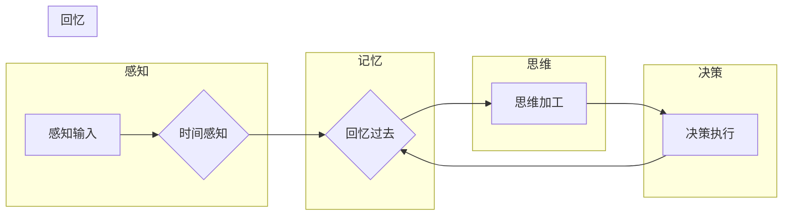

> 时间感知、认知空间、认知基石、形式化方法、信息处理、记忆结构

# 认知的形成：时间是认知空间不可或缺的要素，是认知的基石

## 1. 背景介绍

认知科学作为一门跨学科的领域，致力于理解人类心智的工作原理。在认知过程中，时间扮演着至关重要的角色。从感知到记忆，从决策到学习，时间都是认知活动的基础。本文将探讨时间在认知空间中的地位，以及如何通过形式化方法来解析时间在认知中的作用。

### 1.1 认知的本质

认知是心智活动的过程，包括感知、记忆、思维、决策等多个方面。认知科学试图揭示这些心智活动背后的机制，以及它们如何相互作用，形成我们对外部世界的理解。

### 1.2 时间在认知中的作用

时间在认知中扮演着多重角色：

- **连续性与变化**：时间提供了连续性的背景，使认知活动能够从一个状态过渡到另一个状态。
- **记忆与回忆**：时间记录了信息的积累过程，使得我们能够回忆起过去的事件。
- **决策与规划**：时间感知帮助我们进行决策和规划，以适应不断变化的环境。

### 1.3 形式化方法在认知科学中的应用

形式化方法是认知科学研究中的一种重要工具，它通过数学、逻辑和计算机科学等手段，对认知过程进行建模和模拟。

## 2. 核心概念与联系

### 2.1 时间感知

时间感知是指个体对时间的感知和估计能力。它依赖于生物钟、生理机制以及外部线索。

### 2.2 认知空间

认知空间是一个抽象的概念，它代表了认知活动发生的环境。在这个空间中，时间是一个基本维度。

### 2.3 形式化方法

形式化方法包括数学建模、逻辑推理、计算机模拟等，它们帮助我们理解和分析认知过程。

### 2.4 Mermaid 流程图

以下是一个简化的 Mermaid 流程图，展示了时间在认知空间中的作用：



## 3. 核心算法原理 & 具体操作步骤

### 3.1 算法原理概述

认知的时间处理可以通过多种算法实现，包括：

- **时间序列分析**：分析时间序列数据，识别模式和行为。
- **时间延迟神经网络**：模拟人类记忆和注意力机制。
- **模拟退火算法**：解决优化问题，考虑时间因素。

### 3.2 算法步骤详解

#### 时间序列分析

1. 收集时间序列数据。
2. 使用统计方法分析数据，识别趋势、周期和异常。
3. 根据分析结果进行预测或决策。

#### 时间延迟神经网络

1. 设计神经网络结构，包括时间延迟层。
2. 使用带有时间标签的数据进行训练。
3. 使用训练好的模型进行预测或决策。

#### 模拟退火算法

1. 初始化状态。
2. 随机改变状态。
3. 根据改变前后的成本计算能量差。
4. 如果能量差为负，接受新状态；否则，以一定概率接受。
5. 重复步骤2-4，直到满足终止条件。

### 3.3 算法优缺点

#### 时间序列分析

**优点**：简单易行，能够处理大量数据。

**缺点**：对噪声敏感，难以捕捉复杂模式。

#### 时间延迟神经网络

**优点**：能够模拟人类记忆和注意力机制。

**缺点**：参数调整复杂，训练时间长。

#### 模拟退火算法

**优点**：能够找到全局最优解。

**缺点**：收敛速度慢，难以应用于实时系统。

### 3.4 算法应用领域

时间处理算法在以下领域有广泛应用：

- 数据分析
- 预测
- 决策
- 控制系统
- 人机交互

## 4. 数学模型和公式 & 详细讲解 & 举例说明

### 4.1 数学模型构建

认知时间处理可以构建如下数学模型：

- 时间序列模型：如自回归模型、移动平均模型等。
- 状态空间模型：如马尔可夫决策过程、隐马尔可夫模型等。

### 4.2 公式推导过程

以自回归模型为例，其公式如下：

$$
y_t = \phi_0 + \phi_1 y_{t-1} + \phi_2 y_{t-2} + ... + \phi_p y_{t-p} + \epsilon_t
$$

其中 $y_t$ 是时间序列的当前值，$\phi_0, \phi_1, ..., \phi_p$ 是模型参数，$\epsilon_t$ 是误差项。

### 4.3 案例分析与讲解

假设我们有一个包含股票价格的时间序列数据，我们可以使用自回归模型来预测未来股票价格。

1. 收集股票价格数据。
2. 使用最小二乘法估计模型参数。
3. 使用模型进行未来价格预测。

## 5. 项目实践：代码实例和详细解释说明

### 5.1 开发环境搭建

为了进行时间处理算法的实践，我们需要以下开发环境：

- 编程语言：Python
- 库：NumPy、SciPy、Matplotlib

### 5.2 源代码详细实现

以下是一个使用NumPy实现自回归模型的Python代码示例：

```python
import numpy as np
from scipy.linalg import lstsq

# 模拟股票价格数据
np.random.seed(0)
t = np.arange(0, 100)
y = 10 * np.sin(2 * np.pi * t / 10) + 0.1 * np.random.randn(100)

# 自回归模型参数
p = 5

# 构建模型矩阵
X = np.vander(y, N=p+1)

# 最小二乘法估计模型参数
theta, residuals, rank, s = lstsq(X, y)

# 预测未来价格
y_pred = np.dot(X, theta)

# 绘制结果
import matplotlib.pyplot as plt
plt.plot(t, y, label='实际股票价格')
plt.plot(t, y_pred, label='预测股票价格')
plt.legend()
plt.show()
```

### 5.3 代码解读与分析

上述代码首先模拟了一个含有噪声的正弦波股票价格数据。然后，构建了一个自回归模型，并使用最小二乘法估计模型参数。最后，使用模型进行未来价格预测，并将实际价格和预测价格绘制在同一张图上。

### 5.4 运行结果展示

运行上述代码后，你会得到一个包含实际股票价格和预测股票价格的图形。从图中可以观察到，自回归模型能够较好地拟合实际数据，并对未来价格进行预测。

## 6. 实际应用场景

时间处理算法在实际应用中非常广泛，以下是一些例子：

- **股票市场预测**：使用时间序列模型预测股票价格，帮助投资者做出决策。
- **天气预报**：使用时间序列模型预测天气变化，为公众提供预警信息。
- **交通流量预测**：使用时间序列模型预测交通流量，优化交通信号灯控制。

## 7. 工具和资源推荐

### 7.1 学习资源推荐

- 《认知科学导论》
- 《认知神经科学》
- 《时间序列分析：原理与应用》

### 7.2 开发工具推荐

- Python
- NumPy
- SciPy
- Matplotlib

### 7.3 相关论文推荐

- Time Perception in Humans and Machines
- Time Series Analysis
- Temporal Dynamics of Memory

## 8. 总结：未来发展趋势与挑战

### 8.1 研究成果总结

本文探讨了时间在认知空间中的地位，以及如何通过形式化方法来解析时间在认知中的作用。我们介绍了时间处理算法的原理、步骤和优缺点，并给出了代码实例。

### 8.2 未来发展趋势

- 结合认知科学和人工智能技术，开发更有效的认知模型。
- 研究时间处理算法在跨学科领域的应用。
- 开发可解释性强、鲁棒性高的时间处理算法。

### 8.3 面临的挑战

- 认知过程的复杂性，难以完全模拟。
- 算法复杂度，难以应用于实时系统。
- 数据隐私和安全问题。

### 8.4 研究展望

未来，时间处理算法将在认知科学和人工智能领域发挥重要作用，为理解人类心智提供新的视角。

## 9. 附录：常见问题与解答

**Q1：时间处理算法在哪些领域有应用？**

A：时间处理算法在股票市场预测、天气预报、交通流量预测等领域有广泛应用。

**Q2：时间处理算法有哪些挑战？**

A：时间处理算法面临的主要挑战包括认知过程的复杂性、算法复杂度和数据隐私问题。

**Q3：如何提高时间处理算法的效率？**

A：可以通过以下方法提高时间处理算法的效率：优化算法设计、使用更高效的计算资源、采用并行计算技术。

**Q4：时间处理算法与机器学习算法有什么区别？**

A：时间处理算法侧重于处理时间序列数据，而机器学习算法则更通用，可以处理各种类型的数据。

作者：禅与计算机程序设计艺术 / Zen and the Art of Computer Programming