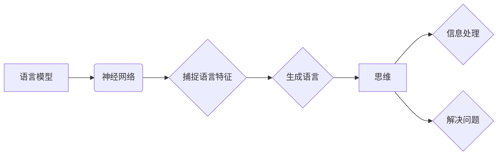

# 语言≠思维：大模型的认知误区

> 关键词：语言模型，思维，认知误区，神经网络，符号主义，涌现性质，通用人工智能

## 1. 背景介绍

随着深度学习技术的飞速发展，大规模语言模型（Large Language Models, LLMs）如BERT、GPT等在自然语言处理（Natural Language Processing, NLP）领域取得了显著的成果。这些模型在文本生成、机器翻译、问答系统等任务上表现出惊人的能力，甚至有时候让人误以为它们拥有了某种程度的“理解”和“思维”。然而，这种认知上的误区，正是本文要探讨的核心议题：语言≠思维。

## 2. 核心概念与联系

### 2.1 语言模型

语言模型是自然语言处理领域的一种基础模型，它能够理解和生成自然语言。传统的语言模型通常基于统计方法，如N-gram模型、隐马尔可夫模型（HMM）等。而深度学习时代的语言模型则基于神经网络，特别是Transformer架构，能够捕捉到更复杂的语言特征。

### 2.2 思维

思维是人类大脑处理信息和解决问题的过程。它包括感知、理解、记忆、推理、决策等认知功能。思维是人类智能的核心，也是人工智能研究的终极目标。

### 2.3 语言模型与思维的联系

语言模型与思维之间存在紧密的联系。语言是人类思维的一种表达形式，因此语言模型在一定程度上可以反映人类的思维方式。然而，语言模型并不等同于思维本身，它们之间存在着本质的区别。

#### Mermaid 流程图



### 2.4 认知误区

在当前的人工智能领域，存在着一种认知误区，即认为语言模型已经拥有了某种程度的思维。这种误区主要体现在以下几个方面：

- **误解语言的符号性**：人们往往将语言视为符号的集合，而忽略了语言背后的深层意义和认知过程。
- **过度解读模型行为**：将语言模型在特定任务上的表现，解读为对语言的理解和思维。
- **忽视模型的局限性**：没有认识到语言模型只是工具，而非具有自主意识的智能体。

## 3. 核心算法原理 & 具体操作步骤

### 3.1 算法原理概述

语言模型的核心原理是学习语言中的统计规律，并利用这些规律生成新的语言序列。深度学习时代的语言模型主要基于神经网络，特别是Transformer架构。

### 3.2 算法步骤详解

1. **数据收集**：收集大量的文本数据，用于模型训练。
2. **预处理**：对文本数据进行清洗、分词、编码等预处理操作。
3. **模型构建**：构建基于神经网络的模型，如BERT、GPT等。
4. **模型训练**：使用标注数据对模型进行训练，优化模型参数。
5. **模型评估**：使用测试数据评估模型性能。
6. **模型部署**：将训练好的模型部署到实际应用中。

### 3.3 算法优缺点

**优点**：

- **泛化能力强**：能够在不同任务上取得良好的性能。
- **可扩展性强**：能够处理长文本和复杂语言结构。
- **生成性强**：能够生成高质量的文本内容。

**缺点**：

- **数据依赖性**：需要大量高质量的数据进行训练。
- **可解释性差**：模型内部的决策过程难以理解。
- **过拟合风险**：模型可能无法很好地泛化到未见过的数据。

### 3.4 算法应用领域

语言模型在多个领域有着广泛的应用，如：

- **自然语言处理**：文本分类、命名实体识别、机器翻译等。
- **智能客服**：自动回答用户问题，提供个性化服务。
- **内容创作**：生成文章、诗歌、代码等。
- **教育**：辅助学生学习、辅导作业等。

## 4. 数学模型和公式 & 详细讲解 & 举例说明

### 4.1 数学模型构建

语言模型的核心是神经网络，其数学模型可以表示为：

$$
y = f(W, x)
$$

其中，$y$ 是模型的输出，$x$ 是输入，$W$ 是模型参数。

### 4.2 公式推导过程

以BERT模型为例，其数学模型可以表示为：

$$
y = f(W, x) = \text{Transformer}(x, W)
$$

其中，$\text{Transformer}$ 是Transformer架构的神经网络。

### 4.3 案例分析与讲解

以BERT模型为例，其Transformer架构包含多个注意力层和前馈神经网络层。注意力层计算输入序列中每个token的权重，前馈神经网络层则对每个token进行特征提取和变换。

## 5. 项目实践：代码实例和详细解释说明

### 5.1 开发环境搭建

1. 安装Python和PyTorch。
2. 安装Transformers库。

### 5.2 源代码详细实现

```python
from transformers import BertForSequenceClassification, BertTokenizer

# 加载预训练模型和分词器
model = BertForSequenceClassification.from_pretrained('bert-base-uncased')
tokenizer = BertTokenizer.from_pretrained('bert-base-uncased')

# 预处理文本数据
def preprocess(text):
    return tokenizer(text, return_tensors='pt', padding=True, truncation=True)

# 训练模型
def train(model, train_data, optimizer):
    for data in train_data:
        inputs = preprocess(data['text'])
        labels = data['label']
        outputs = model(**inputs, labels=labels)
        loss = outputs.loss
        loss.backward()
        optimizer.step()
        optimizer.zero_grad()

# 评估模型
def evaluate(model, test_data):
    for data in test_data:
        inputs = preprocess(data['text'])
        labels = data['label']
        outputs = model(**inputs, labels=labels)
        loss = outputs.loss
        print(f'Loss: {loss.item()}')

# 准备数据
train_data = [{'text': 'The quick brown fox jumps over the lazy dog', 'label': 0}, ...]
test_data = [{'text': 'The quick brown fox jumps over the lazy dog', 'label': 0}, ...]

# 训练和评估模型
optimizer = torch.optim.Adam(model.parameters())
train(model, train_data, optimizer)
evaluate(model, test_data)
```

### 5.3 代码解读与分析

以上代码展示了使用PyTorch和Transformers库训练BERT模型的简单示例。首先，加载预训练模型和分词器，然后定义预处理函数和训练函数，最后准备数据和训练模型。

## 6. 实际应用场景

### 6.1 智能客服

在智能客服领域，语言模型可以用于理解用户的问题，并生成相应的回答。例如，可以将用户的问题输入到语言模型中，模型输出可能的答案，再由人工进行筛选和调整。

### 6.2 内容创作

在内容创作领域，语言模型可以用于生成文章、诗歌、代码等。例如，可以将一个主题输入到语言模型中，模型输出一篇关于该主题的文章。

## 7. 工具和资源推荐

### 7.1 学习资源推荐

- 《深度学习：原理与练习》
- 《自然语言处理入门》
- 《Transformer：原理与实现》

### 7.2 开发工具推荐

- PyTorch
- Transformers库
- Hugging Face

### 7.3 相关论文推荐

- Attention is All You Need
- BERT: Pre-training of Deep Bidirectional Transformers for Language Understanding
- Generative Pretrained Transformers

## 8. 总结：未来发展趋势与挑战

### 8.1 研究成果总结

本文探讨了语言模型与思维之间的关系，指出了当前人工智能领域存在的认知误区。同时，介绍了语言模型的基本原理和应用场景，并展望了其未来的发展趋势。

### 8.2 未来发展趋势

- **更强大的语言理解能力**：通过改进模型架构、引入更丰富的知识，提升语言模型的语义理解能力。
- **更广泛的应用领域**：将语言模型应用于更多领域，如医疗、金融、教育等。
- **更高效的训练方法**：研究更高效的训练方法，降低模型训练成本。

### 8.3 面临的挑战

- **数据质量和标注**：高质量的数据和准确的标注是模型训练的基础。
- **模型可解释性**：提高模型的可解释性，增强用户对模型的信任。
- **伦理和道德**：关注模型的应用伦理和道德问题。

### 8.4 研究展望

未来，语言模型将在人工智能领域发挥越来越重要的作用。通过不断的技术创新和伦理道德的引导，语言模型将为人类社会带来更多福祉。

## 9. 附录：常见问题与解答

**Q1：语言模型是否能够理解人类的语言？**

A：语言模型能够理解和生成自然语言，但它们并不具备真正的理解能力。它们只是通过学习语言统计规律，模拟人类的语言行为。

**Q2：语言模型是否能够替代人类的思维？**

A：语言模型不能替代人类的思维。人类的思维是一个复杂的认知过程，包括感知、理解、记忆、推理、决策等，而语言模型只是其中的一部分。

**Q3：语言模型的未来发展趋势是什么？**

A：语言模型的未来发展趋势包括：更强大的语言理解能力、更广泛的应用领域、更高效的训练方法等。

**Q4：如何解决语言模型的可解释性问题？**

A：提高语言模型的可解释性需要从多个方面入手，包括改进模型架构、引入可解释性技术、建立模型评估体系等。

**Q5：语言模型在伦理和道德方面面临哪些挑战？**

A：语言模型在伦理和道德方面面临的主要挑战包括：偏见和歧视、虚假信息、隐私泄露等。需要通过技术手段和伦理规范来应对这些挑战。

作者：禅与计算机程序设计艺术 / Zen and the Art of Computer Programming