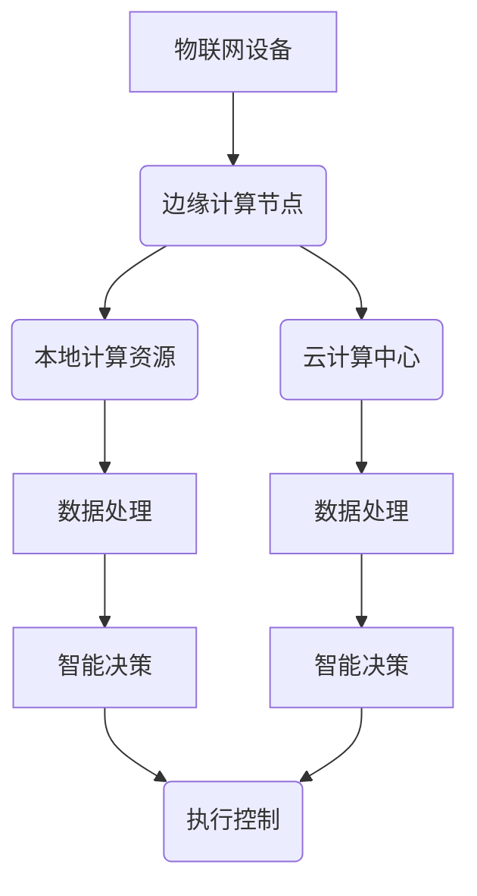

# 边缘计算遇上软件2.0，智能将无处不在

> 关键词：边缘计算，软件2.0，物联网，云计算，智能化，实时性，数据隐私，计算资源，分布式系统

## 1. 背景介绍

随着物联网设备的激增和大数据时代的到来，数据生成和处理的规模呈指数级增长。传统的云计算中心由于距离用户较远，数据处理速度慢，难以满足实时性要求，且对数据隐私保护能力有限。边缘计算作为一种新兴计算范式，通过将计算任务从云端迁移到网络边缘，为解决这些问题提供了新的思路。近年来，随着软件2.0的兴起，边缘计算与软件2.0的结合将推动智能技术的广泛应用，实现智能将无处不在的目标。

### 1.1 物联网与大数据的挑战

物联网设备的广泛应用，使得海量的数据被实时生成和传输。这些数据中蕴含着丰富的价值，但同时也带来了以下挑战：

- **实时性需求**：物联网设备产生的数据需要实时处理，以支持实时的决策和控制。
- **数据隐私**：数据隐私保护成为关注焦点，特别是在个人数据和敏感数据方面。
- **计算资源**：大量的数据需要处理，对计算资源提出了更高的要求。

### 1.2 边缘计算的优势

边缘计算将计算任务从云端迁移到网络边缘，具有以下优势：

- **实时性**：减少数据传输延迟，满足实时性需求。
- **数据隐私**：在本地处理数据，降低数据泄露风险。
- **计算资源**：释放云端计算资源，降低云计算中心的负担。

### 1.3 软件2.0的兴起

软件2.0是继硬件、操作系统、网络之后的新一代软件平台，它强调软件的智能化、自动化和平台化。软件2.0的出现为边缘计算提供了强大的技术支持，推动了智能技术的广泛应用。

## 2. 核心概念与联系

### 2.1 核心概念原理和架构的 Mermaid 流程图



### 2.2 核心概念联系

- **物联网设备**：产生数据，通过网络传输到边缘计算节点或云计算中心。
- **边缘计算节点**：处理实时性要求较高的数据，并将处理结果传输到云计算中心或进行本地决策。
- **本地计算资源**：边缘计算节点上的计算资源，包括CPU、GPU、FPGA等。
- **云计算中心**：处理大量数据，进行复杂计算，并将处理结果返回给边缘计算节点或物联网设备。
- **数据处理**：对物联网设备产生的数据进行清洗、过滤、转换等操作。
- **智能决策**：基于处理后的数据，进行决策，指导物联网设备的操作。
- **执行控制**：根据决策结果，控制物联网设备的操作。

## 3. 核心算法原理 & 具体操作步骤

### 3.1 算法原理概述

边缘计算的核心算法包括：

- **数据采集与传输**：从物联网设备采集数据，并通过网络传输到边缘计算节点或云计算中心。
- **数据预处理**：对采集到的数据进行清洗、过滤、转换等操作。
- **数据存储**：将预处理后的数据存储在本地存储或分布式存储系统中。
- **数据分析与处理**：对存储的数据进行计算、分析和处理，生成智能决策。
- **执行控制**：根据决策结果，控制物联网设备的操作。

### 3.2 算法步骤详解

1. **数据采集与传输**：物联网设备通过传感器、摄像头等设备采集数据，并通过网络传输到边缘计算节点或云计算中心。
2. **数据预处理**：对采集到的数据进行清洗、过滤、转换等操作，使其符合后续处理需求。
3. **数据存储**：将预处理后的数据存储在本地存储或分布式存储系统中，以便后续处理和分析。
4. **数据分析与处理**：使用机器学习、深度学习等技术对存储的数据进行计算、分析和处理，生成智能决策。
5. **执行控制**：根据决策结果，通过物联网设备控制相应的操作。

### 3.3 算法优缺点

**优点**：

- **实时性**：减少数据传输延迟，满足实时性需求。
- **数据隐私**：在本地处理数据，降低数据泄露风险。
- **计算资源**：释放云端计算资源，降低云计算中心的负担。

**缺点**：

- **边缘计算节点资源有限**：边缘计算节点通常资源有限，难以处理大量复杂的计算任务。
- **边缘计算节点管理复杂**：边缘计算节点分布广泛，管理难度较大。
- **网络延迟**：边缘计算节点与云计算中心之间的网络延迟可能影响数据处理速度。

### 3.4 算法应用领域

边缘计算算法广泛应用于以下领域：

- **智慧城市**：交通管理、环境监测、公共安全等。
- **智能制造**：设备监控、生产调度、质量控制等。
- **智能医疗**：远程医疗、疾病监测、健康管理等。
- **智能农业**：环境监测、精准灌溉、病虫害防治等。

## 4. 数学模型和公式 & 详细讲解 & 举例说明

### 4.1 数学模型构建

边缘计算中的数学模型主要包括：

- **数据采集模型**：描述物联网设备采集数据的概率分布。
- **数据处理模型**：描述数据处理过程中的数据转换、计算和预测。
- **决策模型**：描述基于处理后的数据生成的决策过程。

### 4.2 公式推导过程

以数据采集模型为例，假设物联网设备采集数据的概率分布为 $ P(X) $，其中 $ X $ 为采集到的数据。则数据采集模型可以表示为：

$$
 P(X) = \int_{-\infty}^{\infty} P(X|x) P(x) dx 
$$

其中 $ P(X|x) $ 为给定输入 $ x $ 的数据概率，$ P(x) $ 为输入 $ x $ 的概率。

### 4.3 案例分析与讲解

以下以智能交通管理为例，分析边缘计算在智能交通管理中的应用。

假设在某城市，交通管理部门需要实时监测城市道路的车辆流量和拥堵情况。在边缘计算节点上，可以使用以下步骤进行处理：

1. **数据采集**：通过安装在路口的摄像头采集车辆图像，提取车辆数量、车型、行驶方向等信息。
2. **数据处理**：对采集到的图像进行处理，提取车辆特征，并进行车辆计数。
3. **数据分析与处理**：根据车辆计数和历史数据，分析道路拥堵情况，预测未来交通流量。
4. **决策**：根据预测结果，调整红绿灯配时，优化交通流量。
5. **执行控制**：通过交通信号控制系统，控制路口的红绿灯。

通过以上步骤，边缘计算可以实时监测和优化城市道路交通，提高交通效率，减少交通拥堵。

## 5. 项目实践：代码实例和详细解释说明

### 5.1 开发环境搭建

由于边缘计算涉及多个技术和平台，以下列出常用的开发环境：

- **操作系统**：Linux、Windows
- **编程语言**：Python、Java、C++
- **框架**：TensorFlow、PyTorch、OpenCV
- **边缘计算平台**：EdgeX Foundry、Edge TPU、MQTT

### 5.2 源代码详细实现

以下以Python语言使用OpenCV库采集摄像头图像为例，展示边缘计算的基本实现：

```python
import cv2

# 打开摄像头
cap = cv2.VideoCapture(0)

while True:
    # 读取图像
    ret, frame = cap.read()
    
    # 显示图像
    cv2.imshow('Image', frame)
    
    # 按下'q'键退出
    if cv2.waitKey(1) == ord('q'):
        break

# 释放摄像头
cap.release()
# 关闭所有窗口
cv2.destroyAllWindows()
```

### 5.3 代码解读与分析

以上代码展示了使用OpenCV库采集摄像头图像的基本流程：

1. `cv2.VideoCapture(0)`：打开默认摄像头。
2. `ret, frame = cap.read()`：读取一帧图像，其中 `ret` 表示读取成功与否，`frame` 表示读取到的图像。
3. `cv2.imshow('Image', frame)`：显示图像。
4. `cv2.waitKey(1) == ord('q')`：检测按键，如果按下'q'键，则退出循环。
5. `cap.release()`：释放摄像头资源。
6. `cv2.destroyAllWindows()`：关闭所有窗口。

通过以上代码，可以实现对摄像头图像的采集和显示。在实际应用中，可以将采集到的图像进行进一步处理和分析，如车辆检测、人脸识别等。

### 5.4 运行结果展示

运行以上代码，即可在计算机上实时显示摄像头采集到的图像。

## 6. 实际应用场景

### 6.1 智慧城市

边缘计算在智慧城市中的应用包括：

- **智能交通管理**：实时监测交通流量，优化交通信号灯配时。
- **环境监测**：监测空气质量、水质、噪声等环境指标。
- **公共安全**：实时监控城市安全，提高公共安全水平。

### 6.2 智能制造

边缘计算在智能制造中的应用包括：

- **设备监控**：实时监测设备运行状态，预防设备故障。
- **生产调度**：优化生产流程，提高生产效率。
- **质量控制**：实时监测产品质量，提高产品质量。

### 6.3 智能医疗

边缘计算在智能医疗中的应用包括：

- **远程医疗**：实现远程医疗服务，提高医疗服务可及性。
- **疾病监测**：实时监测患者病情，提高疾病诊断准确率。
- **健康管理**：提供个性化健康管理方案，提高患者生活质量。

### 6.4 未来应用展望

随着边缘计算和软件2.0的不断发展，未来边缘计算将在更多领域得到应用，如：

- **智能农业**：实现精准农业，提高农业生产效率。
- **智能能源**：优化能源管理，提高能源利用效率。
- **智能教育**：提供个性化教育方案，提高教育质量。

## 7. 工具和资源推荐

### 7.1 学习资源推荐

- 《边缘计算：原理、架构与实践》
- 《边缘计算：从概念到实践》
- 《软件2.0：构建智能化应用的下一代平台》

### 7.2 开发工具推荐

- **操作系统**：Ubuntu、CentOS
- **编程语言**：Python、Java、C++
- **框架**：TensorFlow、PyTorch、OpenCV
- **边缘计算平台**：EdgeX Foundry、Edge TPU、MQTT

### 7.3 相关论文推荐

- **边缘计算**：
  - Edge Computing: Vision and Challenges
  - Edge Computing: A Comprehensive Survey
- **软件2.0**：
  - Software 2.0: The Next Generation of Software Platforms
  - Software 2.0: A New Paradigm for Software Development

## 8. 总结：未来发展趋势与挑战

### 8.1 研究成果总结

边缘计算与软件2.0的结合，为智能化应用提供了新的解决方案。边缘计算通过将计算任务从云端迁移到网络边缘，实现了实时性、数据隐私和计算资源的优化。软件2.0通过智能化、自动化和平台化，为边缘计算提供了强大的技术支持。两者结合将推动智能技术的广泛应用，实现智能将无处不在的目标。

### 8.2 未来发展趋势

未来，边缘计算与软件2.0将呈现以下发展趋势：

- **边缘计算平台化**：边缘计算平台将提供更加完善的开发、部署和管理工具，降低边缘计算的开发门槛。
- **边缘计算智能化**：边缘计算将更加智能化，能够自动进行任务分配、资源调度和故障处理。
- **边缘计算生态化**：边缘计算将形成更加完善的生态系统，包括硬件、软件、应用和服务等。

### 8.3 面临的挑战

边缘计算与软件2.0在发展过程中也面临以下挑战：

- **边缘计算标准化**：边缘计算技术标准不统一，导致边缘计算平台之间存在兼容性问题。
- **边缘计算安全**：边缘计算设备分布广泛，安全风险较高。
- **边缘计算成本**：边缘计算设备的采购、运维成本较高。

### 8.4 研究展望

为了应对以上挑战，未来需要从以下几个方面进行研究和探索：

- **边缘计算标准化**：制定统一的边缘计算技术标准，促进边缘计算生态的健康发展。
- **边缘计算安全**：加强边缘计算设备的安全防护，确保边缘计算安全可靠。
- **边缘计算成本**：降低边缘计算设备的成本，推动边缘计算的普及应用。

通过不断的研究和探索，边缘计算与软件2.0将推动智能技术的广泛应用，为人类社会带来更加美好的未来。

## 9. 附录：常见问题与解答

**Q1：边缘计算与云计算有何区别？**

A：边缘计算与云计算的区别主要体现在以下几个方面：

- **计算位置**：边缘计算在数据产生地附近进行计算，云计算在数据中心进行计算。
- **计算资源**：边缘计算资源相对有限，云计算拥有海量计算资源。
- **网络延迟**：边缘计算网络延迟较低，云计算网络延迟较高。
- **应用场景**：边缘计算适用于实时性要求较高的应用，云计算适用于大规模数据处理和分析。

**Q2：边缘计算如何保证数据安全？**

A：为了保证边缘计算数据安全，可以采取以下措施：

- **数据加密**：对数据进行加密存储和传输，防止数据泄露。
- **访问控制**：限制对数据访问的权限，防止非法访问。
- **安全审计**：对数据访问进行审计，及时发现和防范安全风险。

**Q3：边缘计算的成本如何？**

A：边缘计算的成本主要包括以下方面：

- **设备成本**：边缘计算设备的采购成本。
- **运维成本**：边缘计算设备的运维成本。
- **网络成本**：边缘计算设备的网络接入成本。

随着边缘计算技术的不断发展，其成本将会逐渐降低。

**Q4：边缘计算与人工智能有何关系？**

A：边缘计算与人工智能密不可分。边缘计算为人工智能提供了实时、高效、安全的计算环境，推动了人工智能技术的发展和应用。同时，人工智能技术也推动了边缘计算的发展，为边缘计算提供了更加智能化的解决方案。

**Q5：未来边缘计算将如何发展？**

A：未来边缘计算将朝着以下方向发展：

- **平台化**：边缘计算平台将提供更加完善的开发、部署和管理工具。
- **智能化**：边缘计算将更加智能化，能够自动进行任务分配、资源调度和故障处理。
- **生态化**：边缘计算将形成更加完善的生态系统，包括硬件、软件、应用和服务等。

通过不断的研究和探索，边缘计算将推动智能技术的广泛应用，为人类社会带来更加美好的未来。

---

作者：禅与计算机程序设计艺术 / Zen and the Art of Computer Programming