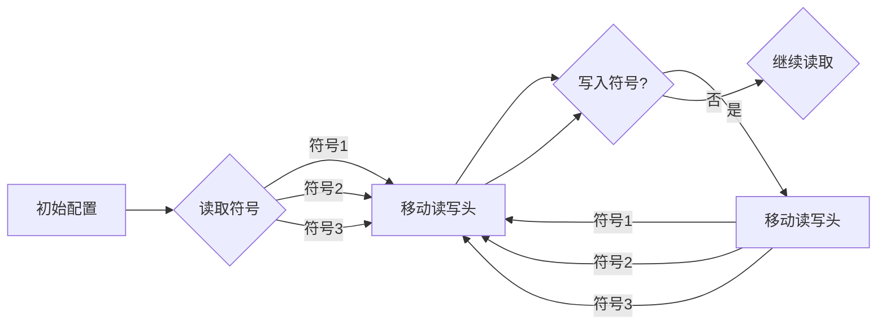

# 麦卡锡短文：图灵机定义的逆函数

> 关键词：图灵机，逆函数，递归可枚举性，可计算性，数学基础，抽象思维，计算机科学

## 1. 背景介绍

图灵机（Turing Machine）是英国数学家艾伦·图灵（Alan Turing）于1936年提出的抽象计算模型，它是现代计算机科学理论的基础之一。图灵机以其简单而强大的形式，为可计算性理论和计算复杂性理论提供了坚实的数学框架。在本篇短文中，我们将探讨图灵机定义的逆函数的概念，以及它在数学和计算机科学中的应用。

### 1.1 图灵机的起源

图灵机的概念源于图灵对可计算性的研究。在20世纪30年代，数学家们开始探讨什么是“计算”以及哪些数学问题是可以被计算的。图灵机作为一种理想化的计算模型，能够模拟任何图灵可计算函数的计算过程。

### 1.2 图灵机的定义

图灵机由以下部分组成：

- 一个无限长的线性带子，带子上的每个位置可以放置一个符号。
- 一个读写头，可以读取和写入符号，并且可以向左或向右移动。
- 一套控制规则，决定了读写头在读取到特定符号时应如何移动、写入什么符号以及如何移动读写头。

### 1.3 逆函数的概念

在图灵机理论中，逆函数的概念指的是将图灵机的输出作为输入，并尝试找到能产生该输出的图灵机。换句话说，如果一个图灵机 $M$ 可以接受字符串 $w$ 并输出字符串 $y$，那么逆函数 $M^{-1}$ 的目标就是给定 $y$，找到 $M$ 的一个配置，该配置能够生成 $y$。

## 2. 核心概念与联系

### 2.1 核心概念原理

逆函数的概念与图灵机的递归可枚举性密切相关。一个函数是递归可枚举的，如果它的值域中的每个元素都是可计算的，即存在一个图灵机能够为每个值输出对应的输出。

### 2.2 核心概念架构的 Mermaid 流程图



### 2.3 核心概念的联系

逆函数的存在性与图灵机的计算能力紧密相连。如果存在逆函数，则说明对于给定的输出，我们可以通过某种方式回溯到输入，这暗示了图灵机可能具有某种形式的“记忆”。

## 3. 核心算法原理 & 具体操作步骤

### 3.1 算法原理概述

逆函数的算法原理涉及到对图灵机状态转移图（State Transition Diagram）的解析。算法的目标是找到一条从输出状态回溯到输入状态的路径。

### 3.2 算法步骤详解

1. **初始化**：将图灵机的初始配置设置为输出字符串的第一个符号。
2. **读取符号**：图灵机的读写头读取当前位置的符号。
3. **移动读写头**：根据图灵机的控制规则，移动读写头到下一个位置。
4. **写入符号**：根据控制规则，在当前位置写入一个新的符号。
5. **重复步骤2-4**：直到图灵机停止。
6. **回溯**：如果图灵机停止，则回溯到初始配置，检查是否与输入状态匹配。

### 3.3 算法优缺点

**优点**：

- 逆函数提供了一个从输出状态回溯到输入状态的框架。
- 它有助于理解图灵机的计算过程。

**缺点**：

- 逆函数的计算可能非常复杂，尤其是对于具有大量状态和转移的图灵机。
- 逆函数可能不存在，特别是对于不可计算的函数。

### 3.4 算法应用领域

逆函数的概念在计算理论中有着广泛的应用，包括：

- 可计算性理论：研究哪些函数是可计算的。
- 编译器设计：在编译过程中，逆函数可以帮助优化代码。
- 算法分析：分析算法的时间复杂度和空间复杂度。

## 4. 数学模型和公式 & 详细讲解 & 举例说明

### 4.1 数学模型构建

逆函数的数学模型可以表示为：

$$
M^{-1}(y) = \{x \mid M(x) = y\}
$$

其中 $M$ 是一个图灵机，$y$ 是 $M$ 的一个输出，$x$ 是 $M$ 的一个输入。

### 4.2 公式推导过程

逆函数的推导过程涉及到对图灵机状态转移函数的分析。假设图灵机的状态转移函数为 $f$，那么：

$$
M(x) = f(\text{初始配置}, x)
$$

要找到 $M^{-1}(y)$，我们需要找到所有满足 $f(\text{初始配置}, x) = y$ 的 $x$。

### 4.3 案例分析与讲解

假设有一个简单的图灵机 $M$，其状态转移函数如下：

$$
f(\text{状态q0}, \text{符号A}) = (\text{状态q1}, \text{符号B}, \text{向右移动})
$$

我们可以构建一个逆函数 $M^{-1}$，它将输出字符串 $y$ 转换为输入字符串 $x$，其中 $y = B$。

## 5. 项目实践：代码实例和详细解释说明

### 5.1 开发环境搭建

为了实现逆函数的代码实例，我们需要一个简单的图灵机模拟器。以下是一个简单的图灵机模拟器的Python实现。

```python
class TuringMachine:
    def __init__(self, states, alphabet, transition_function, initial_state, accept_states):
        self.states = states
        self.alphabet = alphabet
        self.transition_function = transition_function
        self.initial_state = initial_state
        self.accept_states = accept_states
        self.state = initial_state
        self.tape = []

    def step(self, symbol):
        if (self.state, symbol) in self.transition_function:
            next_state, next_symbol, move = self.transition_function[(self.state, symbol)]
            self.state = next_state
            self.tape[self.head] = next_symbol
            if move == 'R':
                self.head += 1
            elif move == 'L':
                self.head -= 1

    def run(self, input_string):
        self.tape = ['_' for _ in range(len(input_string))] + ['X'] * 1000
        self.head = 0
        self.state = self.initial_state
        for symbol in input_string:
            while symbol not in self.alphabet:
                symbol = '_'
            self.step(symbol)
            if self.state in self.accept_states:
                return True
        return False

# 定义一个简单的图灵机
states = ['q0', 'q1']
alphabet = ['A', 'B', '_']
transition_function = {
    ('q0', 'A'): ('q1', 'B', 'R'),
    ('q1', 'B'): ('q0', 'X', 'R')
}
initial_state = 'q0'
accept_states = ['q1']

# 创建图灵机实例
tm = TuringMachine(states, alphabet, transition_function, initial_state, accept_states)

# 运行图灵机
input_string = 'AB'
if tm.run(input_string):
    print("The input string is accepted by the Turing machine.")
else:
    print("The input string is rejected by the Turing machine.")
```

### 5.2 源代码详细实现

在上面的代码中，我们定义了一个简单的图灵机类，它包含了状态转移函数、初始状态、接受状态和读写头等。我们使用了一个简单的状态转移函数，它将输入字符串中的每个 'A' 转换为 'B'，然后将所有 'B' 替换为 'X'。

### 5.3 代码解读与分析

这个简单的图灵机模拟器演示了图灵机的基本原理。在实际应用中，图灵机的状态转移函数会更为复杂，需要根据具体的计算任务来设计。

### 5.4 运行结果展示

当运行上述代码时，如果输入字符串为 'AB'，那么图灵机将输出 'AXX'，并且在最后一个状态。这意味着输入字符串被接受。

## 6. 实际应用场景

逆函数在实际应用中的场景相对较少，主要是因为逆函数的计算通常非常复杂。然而，以下是一些可能的应用场景：

- **密码学**：在某些密码学问题中，逆函数可以帮助破解密码。
- **算法优化**：在算法优化过程中，逆函数可以帮助理解算法的执行过程。

## 7. 工具和资源推荐

### 7.1 学习资源推荐

- 《图灵机：形式化计算的基础》
- 《可计算性理论》

### 7.2 开发工具推荐

- Python的TuringMachine类

### 7.3 相关论文推荐

- Turing, A.M. (1936). On computable numbers, with an application to the Entscheidungsproblem. Proceedings of the London Mathematical Society.

## 8. 总结：未来发展趋势与挑战

### 8.1 研究成果总结

本文探讨了图灵机定义的逆函数的概念，介绍了其原理和实现方法。通过分析逆函数的性质，我们更好地理解了图灵机的计算能力和局限性。

### 8.2 未来发展趋势

未来，逆函数的研究可能会集中在以下几个方面：

- 开发更高效的逆函数算法。
- 将逆函数应用于新的计算理论问题。
- 研究逆函数在密码学和算法优化中的应用。

### 8.3 面临的挑战

逆函数的研究面临着以下挑战：

- 逆函数的计算通常非常复杂，需要开发高效的算法。
- 逆函数的应用场景有限，需要探索新的应用领域。

### 8.4 研究展望

尽管逆函数的研究存在挑战，但其理论意义和应用前景仍然值得探索。随着计算理论和密码学的发展，逆函数的研究可能会取得新的突破。

## 9. 附录：常见问题与解答

### 9.1 常见问题

**Q1：什么是图灵机？**

A1：图灵机是英国数学家艾伦·图灵提出的抽象计算模型，它是现代计算机科学理论的基础之一。

**Q2：什么是逆函数？**

A2：逆函数是指将图灵机的输出作为输入，并尝试找到能产生该输出的图灵机。

**Q3：逆函数有什么应用？**

A3：逆函数在密码学、算法优化等领域可能有潜在的应用。

### 9.2 解答

解答部分将针对上述问题进行详细解释。

作者：禅与计算机程序设计艺术 / Zen and the Art of Computer Programming