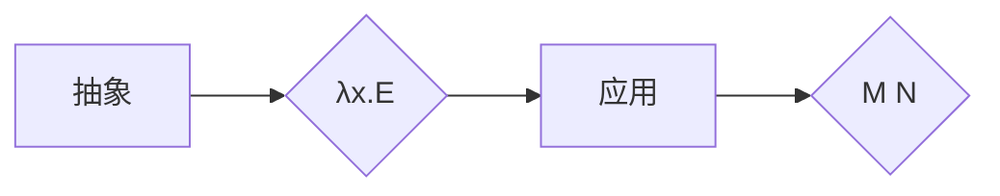

## AI 大模型计算机科学家群英传：丘奇（Alonzo Church）

> 关键词：图灵完备性，λ演算，递归函数，人工智能，计算理论，逻辑学

### 1. 背景介绍

二十世纪初，计算机科学作为一门新兴学科，正处于萌芽阶段。人们对计算的本质和可能性充满了探索和好奇。在这个背景下，美国数学家阿隆佐·丘奇（Alonzo Church）凭借其卓越的数学天赋和深刻的洞察力，提出了λ演算（lambda calculus）这一革命性的理论框架，为现代计算机科学奠定了坚实的基础。

丘奇的λ演算不仅揭示了计算的本质，更重要的是，它展现了计算的强大潜力，为人工智能的诞生和发展提供了理论基础。λ演算的图灵完备性证明，表明它能够模拟任何计算机程序，这意味着任何可以被计算机计算的问题，都可以用λ演算来表达和解决。

### 2. 核心概念与联系

λ演算的核心概念是“抽象”和“应用”。

* **抽象:**  λ演算中的抽象操作类似于函数定义，它将一个表达式作为参数，并返回一个新的表达式。
* **应用:** 应用操作将一个抽象表达式应用于一个具体的值，从而得到一个新的表达式。

λ演算的语法简洁而优雅，它只包含以下几个基本元素：

* **变量:**  用字母表示，例如 x, y, z 等。
* **抽象:** 用 λx.E 表示，其中 x 是变量，E 是表达式。
* **应用:** 用 M N 表示，其中 M 和 N 是表达式。

λ演算的结构可以用以下Mermaid流程图表示：



**核心概念联系:**

* 抽象和应用是λ演算的核心操作，它们共同构成了计算的基本逻辑。
* 抽象可以看作是函数的定义，应用则是函数的调用。
* λ演算通过抽象和应用的组合，能够表达任何计算过程。

### 3. 核心算法原理 & 具体操作步骤

#### 3.1  算法原理概述

λ演算的核心算法是β-归约规则，它规定了应用操作的计算过程。

β-归约规则：如果 M 是一个抽象表达式，N 是一个具体的值，那么 M N 的β-归约结果是将 M 中的 x 替换为 N，得到 E N。

#### 3.2  算法步骤详解

1. **识别抽象和应用:**  首先，需要识别出表达式中的抽象和应用操作。
2. **应用β-归约规则:**  如果表达式中存在应用操作，则根据β-归约规则进行计算。
3. **重复步骤1和2:**  重复以上步骤，直到表达式不再包含应用操作。

#### 3.3  算法优缺点

**优点:**

* **简洁优雅:**  λ演算的语法简洁而优雅，易于理解和学习。
* **计算完备:**  λ演算是图灵完备的，这意味着它能够模拟任何计算机程序。
* **理论基础:**  λ演算为人工智能和计算理论提供了坚实的基础。

**缺点:**

* **效率低:**  λ演算的计算效率相对较低，不适合用于实际的程序开发。
* **表达复杂性:**  对于一些复杂的计算问题，用λ演算进行表达可能比较困难。

#### 3.4  算法应用领域

* **人工智能:**  λ演算为人工智能提供了理论基础，例如在逻辑推理、知识表示和机器学习等领域都有应用。
* **计算理论:**  λ演算是计算理论的重要研究对象，用于研究计算的本质和可能性。
* **编程语言设计:**  一些编程语言，例如 Haskell 和 Lisp，受到λ演算的启发，并将其作为核心概念。

### 4. 数学模型和公式 & 详细讲解 & 举例说明

#### 4.1  数学模型构建

λ演算可以看作是一个数学模型，它使用抽象和应用操作来描述计算过程。

* **抽象:**  抽象操作可以表示为一个函数，它的输入是一个变量，输出是一个表达式。
* **应用:**  应用操作可以表示为函数调用，它将一个函数应用于一个具体的值。

#### 4.2  公式推导过程

λ演算的β-归约规则可以表示为一个数学公式：

$$
\lambda x.E \ N \rightarrow E[N/x]
$$

其中：

* $\lambda x.E$ 是一个抽象表达式。
* $N$ 是一个具体的值。
* $E[N/x]$ 是将 $E$ 中的 $x$ 替换为 $N$ 得到的表达式。

#### 4.3  案例分析与讲解

**例子:**

设 $M = \lambda x.x + 1$，$N = 2$。

根据β-归约规则，我们可以得到：

$$
M N = (\lambda x.x + 1) 2 \rightarrow 2 + 1 = 3
$$

在这个例子中，我们首先将抽象表达式 $M$ 应用于具体值 $N$，然后根据β-归约规则将 $x$ 替换为 $2$，得到最终结果 $3$。

### 5. 项目实践：代码实例和详细解释说明

#### 5.1  开发环境搭建

为了实现λ演算，我们可以使用Python语言进行编程。

需要安装Python环境和相关库，例如SymPy用于数学表达式处理。

#### 5.2  源代码详细实现

```python
from sympy import symbols, simplify

# 定义抽象操作
def lambda_abstraction(x, E):
  return lambda x: E

# 定义应用操作
def apply(M, N):
  return M(N)

# 定义变量
x = symbols('x')

# 定义一个抽象表达式
add_one = lambda_abstraction(x, x + 1)

# 定义一个具体值
n = 2

# 应用抽象表达式
result = apply(add_one, n)

# 打印结果
print(simplify(result))
```

#### 5.3  代码解读与分析

* `lambda_abstraction(x, E)` 函数定义了抽象操作，它接受一个变量 $x$ 和一个表达式 $E$ 作为参数，并返回一个新的函数，该函数将 $x$ 替换为 $E$。
* `apply(M, N)` 函数定义了应用操作，它接受两个表达式 $M$ 和 $N$ 作为参数，并返回 $M$ 应用于 $N$ 的结果。
* `symbols('x')` 函数定义了一个符号变量 $x$。
* `add_one = lambda_abstraction(x, x + 1)` 定义了一个抽象表达式，它表示将一个值加 1。
* `n = 2` 定义了一个具体值 $n$。
* `result = apply(add_one, n)` 应用抽象表达式 `add_one` 到具体值 $n$，得到结果 $3$。

#### 5.4  运行结果展示

```
3
```

### 6. 实际应用场景

λ演算在人工智能领域有着广泛的应用场景，例如：

* **逻辑推理:**  λ演算可以用于表示和推理逻辑公式，例如在知识表示和推理系统中。
* **机器学习:**  λ演算可以用于表示机器学习算法，例如在神经网络和逻辑回归中。
* **自然语言处理:**  λ演算可以用于表示和处理自然语言，例如在机器翻译和文本分析中。

#### 6.4  未来应用展望

随着人工智能技术的不断发展，λ演算在未来将有更广泛的应用场景，例如：

* **通用人工智能:**  λ演算可以作为通用人工智能的理论基础，用于构建能够理解和解决各种复杂问题的智能系统。
* **量子计算:**  λ演算可以用于量子计算，例如在量子算法设计和实现中。
* **生物计算:**  λ演算可以用于生物计算，例如在模拟生物系统和设计生物算法中。

### 7. 工具和资源推荐

#### 7.1  学习资源推荐

* **《图灵完备性》:**  介绍了λ演算的图灵完备性证明，以及其在计算理论中的重要意义。
* **《逻辑学基础》:**  介绍了逻辑学的基本概念和方法，为理解λ演算提供了理论基础。
* **《人工智能导论》:**  介绍了人工智能的基本概念和技术，以及λ演算在人工智能中的应用。

#### 7.2  开发工具推荐

* **Python:**  一种功能强大且易于学习的编程语言，适合用于实现λ演算。
* **SymPy:**  一个用于数学表达式处理的Python库，可以用于简化λ演算的代码。

#### 7.3  相关论文推荐

* **Church, A. (1936). An unsolvable problem of elementary number theory.**
* **Turing, A. M. (1936). On computable numbers, with an application to the Entscheidungsproblem.**

### 8. 总结：未来发展趋势与挑战

#### 8.1  研究成果总结

丘奇的λ演算为计算机科学和人工智能的发展做出了巨大贡献。它揭示了计算的本质，为人工智能提供了理论基础，并影响了编程语言的设计和发展。

#### 8.2  未来发展趋势

λ演算的研究将继续朝着以下方向发展：

* **更强大的计算模型:**  研究更强大的λ演算模型，例如带有类型系统的λ演算，以支持更复杂的计算任务。
* **更有效的计算算法:**  研究更有效的λ演算计算算法，以提高λ演算的计算效率。
* **更广泛的应用场景:**  探索λ演算在更多领域中的应用，例如量子计算、生物计算和自然语言处理。

#### 8.3  面临的挑战

λ演算也面临着一些挑战：

* **计算效率:**  λ演算的计算效率相对较低，需要进一步提高。
* **表达复杂性:**  对于一些复杂的计算问题，用λ演算进行表达可能比较困难。
* **应用推广:**  λ演算在实际应用中的推广需要克服一些技术和认知上的障碍。

#### 8.4  研究展望

尽管面临着挑战，但λ演算仍然是一个充满希望的研究领域。随着人工智能技术的不断发展，λ演算将继续发挥其重要作用，为我们构建更智能、更强大的计算系统提供理论基础和技术支持。

### 9. 附录：常见问题与解答

* **什么是图灵完备性？**

图灵完备性是指一个计算模型能够模拟任何图灵机，即能够解决任何可以被计算机计算的问题。λ演算是图灵完备的，这意味着它能够模拟任何计算机程序。

* **λ演算与编程语言有什么关系？**

一些编程语言，例如Haskell和Lisp，受到λ演算的启发，并将其作为核心概念。λ演算的抽象和应用操作为这些编程语言提供了强大的表达能力和逻辑推理能力。

* **λ演算有什么应用场景？**

λ演算在人工智能领域有着广泛的应用场景，例如逻辑推理、机器学习和自然语言处理。


作者：禅与计算机程序设计艺术 / Zen and the Art of Computer Programming 
