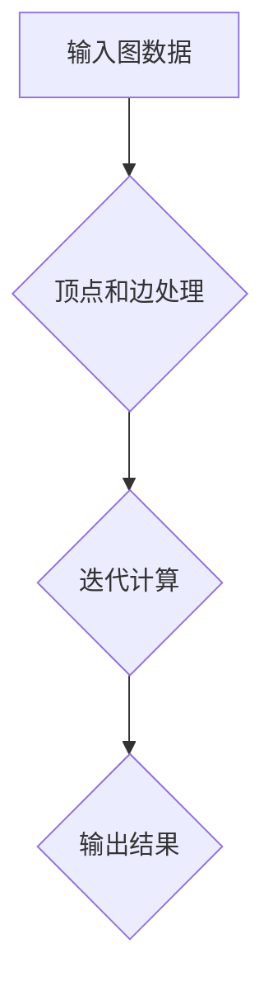

## Giraph原理与代码实例讲解

> 关键词：Giraph, 图计算, 顶点, 边, 迭代算法, Apache, Spark

## 1. 背景介绍

在当今数据爆炸的时代，图数据作为一种强大的数据结构，在社交网络分析、推荐系统、知识图谱构建等领域发挥着越来越重要的作用。传统的数据库系统难以高效处理图数据，因此，专门针对图数据的处理框架应运而生。Giraph 便是其中一个代表性的开源图计算框架，它基于 MapReduce 模型，并提供了一套简洁易用的 API，使得开发者能够方便地编写和执行图计算任务。

Giraph 的出现，为图数据分析提供了新的思路和方法。它利用了分布式计算的优势，能够处理海量图数据，并支持多种图算法的实现。Giraph 的开源特性也使得它更容易被开发者接受和使用，促进了图计算技术的普及和发展。

## 2. 核心概念与联系

Giraph 的核心概念包括顶点、边、迭代算法等。

* **顶点 (Vertex):** 图中的节点，代表图中的实体。
* **边 (Edge):** 连接两个顶点的线段，代表实体之间的关系。
* **迭代算法 (Iterative Algorithm):** Giraph 使用迭代算法来处理图数据，通过多次迭代，逐步更新顶点的状态，最终达到计算目标。

Giraph 的架构可以概括为以下流程：



## 3. 核心算法原理 & 具体操作步骤

### 3.1  算法原理概述

Giraph 基于 MapReduce 模型，将图计算任务分解成多个独立的 Map 和 Reduce 操作。

* **Map 操作:** 对图数据进行遍历，并根据算法需求，将顶点和边信息映射到新的数据结构中。
* **Reduce 操作:** 对 Map 操作产生的数据进行聚合，更新顶点的状态，并最终输出计算结果。

Giraph 的迭代算法通常由多个 Map 和 Reduce 操作组成，通过反复执行这些操作，逐步逼近计算目标。

### 3.2  算法步骤详解

1. **数据加载:** 将图数据加载到 Giraph 框架中。
2. **顶点和边处理:** 对图数据进行预处理，将顶点和边信息转换为 Giraph 框架可以识别的格式。
3. **迭代计算:** 根据算法需求，执行多个 Map 和 Reduce 操作，逐步更新顶点的状态。
4. **结果输出:** 将计算结果输出到指定位置。

### 3.3  算法优缺点

**优点:**

* **分布式计算:** Giraph 基于 MapReduce 模型，能够利用分布式计算的优势，处理海量图数据。
* **易于使用:** Giraph 提供了一套简洁易用的 API，使得开发者能够方便地编写和执行图计算任务。
* **开源特性:** Giraph 是开源框架，可以免费使用和修改。

**缺点:**

* **性能瓶颈:** Giraph 的性能受限于 MapReduce 模型的局限性，对于一些复杂的图算法，性能可能不足。
* **编程复杂度:** 虽然 Giraph 的 API 比较简单，但编写复杂的图算法仍然需要一定的编程经验。

### 3.4  算法应用领域

Giraph 的应用领域非常广泛，包括：

* **社交网络分析:** 分析社交网络结构，发现社区、推荐好友等。
* **推荐系统:** 基于用户行为数据，推荐感兴趣的内容。
* **知识图谱构建:** 建立知识图谱，实现知识推理和查询。
* **生物信息学:** 分析蛋白质相互作用网络、基因表达网络等。

## 4. 数学模型和公式 & 详细讲解 & 举例说明

### 4.1  数学模型构建

图可以表示为一个有序对 (V, E)，其中 V 是顶点集合，E 是边集合。

* **顶点:**  v ∈ V
* **边:** e ∈ E，e = (u, v)，表示顶点 u 和 v 之间存在一条边。

### 4.2  公式推导过程

Giraph 中常用的算法之一是 PageRank 算法，用于计算顶点的重要性。PageRank 算法的公式如下：

$$PR(v) = (1-d) + d \sum_{u \in \text{in}(v)} \frac{PR(u)}{|\text{out}(u)|}$$

其中:

* $PR(v)$ 表示顶点 v 的 PageRank 值。
* $d$ 是阻尼因子，通常取值为 0.85。
* $\text{in}(v)$ 表示指向顶点 v 的所有边。
* $\text{out}(u)$ 表示从顶点 u 出发的所有边。

### 4.3  案例分析与讲解

假设有一个简单的图，包含三个顶点 A、B、C，以及以下边：

* A -> B
* B -> C
* C -> A

如果初始 PageRank 值为每个顶点都为 1，则根据 PageRank 算法公式，可以计算出每个顶点的 PageRank 值。

## 5. 项目实践：代码实例和详细解释说明

### 5.1  开发环境搭建

* Java Development Kit (JDK)
* Apache Giraph
* Hadoop

### 5.2  源代码详细实现

```java
import org.apache.giraph.graph.BasicComputation;
import org.apache.giraph.graph.Vertex;
import org.apache.hadoop.io.DoubleWritable;
import org.apache.hadoop.io.LongWritable;
import org.apache.hadoop.io.Text;

import java.io.IOException;

public class PageRankComputation extends BasicComputation<LongWritable, Text, DoubleWritable, DoubleWritable> {

    @Override
    public void compute(Vertex<LongWritable, Text, DoubleWritable> vertex,
                        Iterable<DoubleWritable> messages) throws IOException {
        long vertexId = vertex.getId();
        Text vertexValue = vertex.getValue();
        double sum = 0;
        for (DoubleWritable message : messages) {
            sum += message.get();
        }
        double pagerank = (1 - dampingFactor) + dampingFactor * sum;
        vertex.setValue(new Text(String.valueOf(pagerank)));
    }

    private static final double dampingFactor = 0.85;
}
```

### 5.3  代码解读与分析

* `PageRankComputation` 类继承自 `BasicComputation`，定义了 PageRank 算法的计算逻辑。
* `compute()` 方法是 Giraph 框架调用的核心方法，用于计算每个顶点的 PageRank 值。
* `dampingFactor` 是阻尼因子，控制着 PageRank 值的更新速度。
* `sum` 变量用于累加来自其他顶点的 PageRank 值。
* `pagerank` 变量存储了计算出的 PageRank 值。

### 5.4  运行结果展示

运行 Giraph 程序后，可以得到每个顶点的 PageRank 值。

## 6. 实际应用场景

Giraph 在实际应用场景中具有广泛的应用前景，例如：

* **社交网络分析:** 分析用户之间的关系，发现社区结构，推荐好友。
* **推荐系统:** 基于用户行为数据，推荐感兴趣的内容。
* **知识图谱构建:** 建立知识图谱，实现知识推理和查询。
* **生物信息学:** 分析蛋白质相互作用网络、基因表达网络等。

### 6.4  未来应用展望

随着图数据的不断增长，Giraph 作为一种高效的图计算框架，将继续发挥重要作用。未来，Giraph 可能朝着以下方向发展：

* **性能优化:** 提高 Giraph 的性能，使其能够处理更大的图数据。
* **算法扩展:** 支持更多类型的图算法，满足更广泛的应用需求。
* **易用性提升:** 提供更友好的 API 和工具，降低 Giraph 的学习门槛。

## 7. 工具和资源推荐

### 7.1  学习资源推荐

* Giraph 官方文档: https://giraph.apache.org/
* Giraph GitHub 仓库: https://github.com/apache/giraph
* 图计算相关的书籍和论文

### 7.2  开发工具推荐

* Apache Hadoop
* Apache Spark
* Eclipse IDE

### 7.3  相关论文推荐

* PageRank: The Anatomy of a Web Page Rank
* Giraph: A Distributed Graph Processing Framework

## 8. 总结：未来发展趋势与挑战

### 8.1  研究成果总结

Giraph 作为一种开源的图计算框架，为图数据分析提供了新的思路和方法。它利用了分布式计算的优势，能够处理海量图数据，并支持多种图算法的实现。

### 8.2  未来发展趋势

未来，图计算技术将继续发展，Giraph 也将朝着更高效、更易用、更强大的方向发展。

### 8.3  面临的挑战

Giraph 还面临一些挑战，例如：

* **性能瓶颈:** Giraph 的性能受限于 MapReduce 模型的局限性，对于一些复杂的图算法，性能可能不足。
* **编程复杂度:** 虽然 Giraph 的 API 比较简单，但编写复杂的图算法仍然需要一定的编程经验。

### 8.4  研究展望

未来，研究人员将继续探索新的图算法和优化方法，以提高 Giraph 的性能和易用性。同时，也将探索 Giraph 在更多领域的应用，例如人工智能、机器学习等。

## 9. 附录：常见问题与解答

* **Giraph 和 Spark 的区别:** Giraph 是基于 MapReduce 模型的图计算框架，而 Spark 是基于内存计算的通用框架，也支持图计算。Giraph 更专注于图计算，而 Spark 更通用。
* **如何安装 Giraph:** Giraph 的安装过程可以参考官方文档。
* **如何编写 Giraph 程序:** Giraph 提供了一套简洁易用的 API，可以参考官方文档和示例代码。


作者：禅与计算机程序设计艺术 / Zen and the Art of Computer Programming