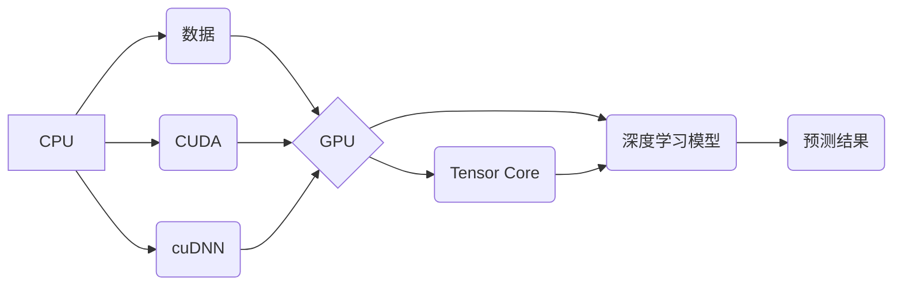

## NVIDIA如何改变了AI算力格局

> 关键词：GPU、深度学习、Tensor Core、CUDA、AI算力、数据中心、Transformer

## 1. 背景介绍

人工智能（AI）的蓬勃发展，对算力的需求呈指数级增长。传统CPU架构在处理海量数据和复杂计算时存在瓶颈，无法满足AI训练和推理的日益严苛要求。而NVIDIA凭借其强大的GPU技术，率先突破了算力瓶颈，成为AI算力的领军者。

从2010年代初开始，深度学习算法的兴起，为GPU提供了新的应用场景。GPU的并行计算能力，能够高效处理深度学习模型中的大量参数和数据，大幅提升训练速度和效率。NVIDIA紧抓这一机遇，不断推陈出新，开发出针对深度学习的专用硬件和软件，如Tesla系列GPU、CUDA平台和cuDNN库，为AI发展提供了坚实的基础。

## 2. 核心概念与联系

**2.1 核心概念**

* **GPU（图形处理单元）：** 专门用于处理图形渲染的处理器，拥有大量并行计算单元，擅长处理大量数据并行计算。
* **深度学习：** 一种机器学习方法，利用多层神经网络模拟人类大脑的学习过程，能够从海量数据中学习复杂模式和特征。
* **Tensor Core：** NVIDIA为深度学习量身定制的专用计算单元，能够加速矩阵乘法和累加运算，大幅提升深度学习训练速度。
* **CUDA（Compute Unified Device Architecture）：** NVIDIA开发的并行计算平台，允许开发者将程序移植到GPU上进行加速计算。
* **cuDNN（CUDA Deep Neural Network library）：** NVIDIA为深度学习开发的库，提供高效的深度学习算法实现，加速深度学习模型训练和推理。

**2.2 架构关系**



## 3. 核心算法原理 & 具体操作步骤

**3.1 算法原理概述**

深度学习算法的核心是神经网络，它由多个层级的神经元组成，每个神经元接收输入信号，进行处理后输出信号。神经网络通过训练学习数据中的模式和特征，从而实现预测、分类等任务。

**3.2 算法步骤详解**

1. **数据预处理:** 将原始数据转换为深度学习模型可以理解的格式，例如归一化、编码等。
2. **模型构建:** 根据任务需求设计神经网络结构，包括层数、神经元数量、激活函数等。
3. **模型训练:** 使用训练数据训练模型，通过调整模型参数，使模型的预测结果与真实值尽可能接近。
4. **模型评估:** 使用测试数据评估模型的性能，例如准确率、召回率等。
5. **模型部署:** 将训练好的模型部署到实际应用场景中，用于预测、分类等任务。

**3.3 算法优缺点**

**优点:**

* 能够学习复杂模式和特征，实现高精度预测。
* 能够处理海量数据，适用于大规模数据分析。
* 具有泛化能力，能够应用于不同领域的任务。

**缺点:**

* 训练时间长，需要大量计算资源。
* 对数据质量要求高，需要大量高质量数据进行训练。
* 模型解释性差，难以理解模型的决策过程。

**3.4 算法应用领域**

* **图像识别:** 人脸识别、物体检测、图像分类等。
* **自然语言处理:** 机器翻译、文本摘要、情感分析等。
* **语音识别:** 语音转文本、语音助手等。
* **推荐系统:** 商品推荐、内容推荐等。
* **医疗诊断:** 病情诊断、疾病预测等。

## 4. 数学模型和公式 & 详细讲解 & 举例说明

**4.1 数学模型构建**

深度学习模型的核心是神经网络，其数学模型可以表示为一系列的线性变换和非线性激活函数。

* **线性变换:**  神经网络中的每个层级都包含多个神经元，每个神经元接收来自上一层级的输入信号，并进行线性变换。
* **非线性激活函数:** 线性变换后的信号需要经过非线性激活函数处理，以引入非线性特征，提高模型的表达能力。

**4.2 公式推导过程**

假设一个神经网络包含输入层、隐藏层和输出层，每个层级的神经元数量分别为 $n_1$, $n_2$, $n_3$。

* **输入层:** $x = [x_1, x_2,..., x_{n_1}]$
* **隐藏层:** $h = f(W_1x + b_1)$
* **输出层:** $y = f(W_2h + b_2)$

其中:

* $W_1$, $W_2$ 是权重矩阵，$b_1$, $b_2$ 是偏置向量。
* $f$ 是非线性激活函数，例如ReLU、Sigmoid等。

**4.3 案例分析与讲解**

以图像分类为例，假设输入图像大小为 $28 \times 28$，隐藏层神经元数量为 128，输出层神经元数量为 10（代表10个类别）。

* 输入层：$x$ 为 $28 \times 28$ 的图像像素值，共有 784 个输入神经元。
* 隐藏层：$h$ 为 128 个神经元，每个神经元接收来自 784 个输入神经元的信号，并经过非线性激活函数处理。
* 输出层：$y$ 为 10 个神经元，每个神经元代表一个类别，输出值表示该类别属于该图像的概率。

## 5. 项目实践：代码实例和详细解释说明

**5.1 开发环境搭建**

* 安装CUDA Toolkit和cuDNN库。
* 安装深度学习框架，例如TensorFlow、PyTorch等。
* 设置开发环境变量，方便调用CUDA和cuDNN库。

**5.2 源代码详细实现**

```python
import tensorflow as tf

# 定义模型结构
model = tf.keras.models.Sequential([
    tf.keras.layers.Flatten(input_shape=(28, 28)),
    tf.keras.layers.Dense(128, activation='relu'),
    tf.keras.layers.Dense(10, activation='softmax')
])

# 编译模型
model.compile(optimizer='adam',
              loss='sparse_categorical_crossentropy',
              metrics=['accuracy'])

# 训练模型
model.fit(x_train, y_train, epochs=10)

# 评估模型
loss, accuracy = model.evaluate(x_test, y_test)
print('Test loss:', loss)
print('Test accuracy:', accuracy)
```

**5.3 代码解读与分析**

* 使用TensorFlow框架定义一个简单的深度学习模型，包含一个全连接层和一个输出层。
* 使用Adam优化器、交叉熵损失函数和准确率指标进行模型训练。
* 使用训练数据训练模型，并使用测试数据评估模型性能。

**5.4 运行结果展示**

训练完成后，可以查看模型的训练损失和准确率曲线，以及测试集上的准确率。

## 6. 实际应用场景

**6.1 图像识别**

* **自动驾驶:** 识别道路标志、行人、车辆等物体，辅助车辆安全行驶。
* **医疗诊断:** 识别病灶、肿瘤等异常区域，辅助医生诊断疾病。
* **安防监控:** 识别嫌疑人、违规行为等，提高安防效率。

**6.2 自然语言处理**

* **机器翻译:** 将文本从一种语言翻译成另一种语言。
* **文本摘要:** 自动生成文本的简要摘要。
* **聊天机器人:** 与用户进行自然语言对话，提供信息和服务。

**6.3 语音识别**

* **语音助手:** 理解用户的语音指令，执行相应的操作。
* **语音转文本:** 将语音转换为文本，方便记录和搜索。
* **听力辅助设备:** 将语音转换为文字，帮助听障人士理解语音信息。

**6.4 其他应用场景**

* **推荐系统:** 根据用户的历史行为和偏好，推荐相关商品、内容等。
* **金融分析:** 分析市场数据，预测股票价格、风险等。
* **科学研究:** 加速科学计算、数据分析等。

**6.5 未来应用展望**

随着AI技术的不断发展，NVIDIA的GPU算力将继续推动AI应用的创新和发展，在更多领域发挥重要作用，例如：

* **通用人工智能:** 开发能够像人类一样学习和解决各种问题的通用人工智能。
* **边缘计算:** 将AI模型部署到边缘设备，实现实时数据处理和决策。
* **量子计算:** 与量子计算相结合，加速科学发现和技术创新。

## 7. 工具和资源推荐

**7.1 学习资源推荐**

* **NVIDIA官网:** https://www.nvidia.com/en-us/
* **CUDA官方文档:** https://docs.nvidia.com/cuda/
* **cuDNN官方文档:** https://docs.nvidia.com/deeplearning/cudnn/index.html
* **TensorFlow官方文档:** https://www.tensorflow.org/
* **PyTorch官方文档:** https://pytorch.org/

**7.2 开发工具推荐**

* **CUDA Toolkit:** https://developer.nvidia.com/cuda-toolkit
* **cuDNN:** https://developer.nvidia.com/cudnn
* **TensorFlow:** https://www.tensorflow.org/
* **PyTorch:** https://pytorch.org/

**7.3 相关论文推荐**

* **ImageNet Classification with Deep Convolutional Neural Networks**
* **Deep Residual Learning for Image Recognition**
* **Attention Is All You Need**

## 8. 总结：未来发展趋势与挑战

**8.1 研究成果总结**

NVIDIA的GPU算力技术在AI领域取得了巨大成功，推动了深度学习算法的快速发展，并广泛应用于各个领域。

**8.2 未来发展趋势**

* **更高效的算力架构:** 继续探索新的GPU架构，提高算力密度和效率。
* **更强大的AI模型:** 开发更深、更复杂的AI模型，提升模型性能和泛化能力。
* **边缘计算和云计算的融合:** 将AI模型部署到边缘设备和云端，实现高效的协同计算。

**8.3 面临的挑战**

* **算力需求的爆炸式增长:** AI模型的规模不断增长，对算力的需求也随之增加，需要持续开发更高效的算力架构。
* **数据隐私和安全:** AI模型的训练和应用需要大量数据，如何保障数据隐私和安全是一个重要的挑战。
* **模型解释性和可信度:** 深度学习模型的决策过程难以理解，如何提高模型的解释性和可信度是一个关键问题。

**8.4 研究展望**

未来，NVIDIA将继续致力于推动AI算力的发展，探索新的技术和应用场景，为人类社会创造更多价值。

## 9. 附录：常见问题与解答

**9.1 如何选择合适的GPU？**

选择合适的GPU需要考虑任务需求、预算和性能等因素。

**9.2 如何安装CUDA和cuDNN？**

NVIDIA官网提供详细的安装指南，可以参考官方文档进行安装。

**9.3 如何使用TensorFlow或PyTorch开发AI模型？**

TensorFlow和PyTorch都提供了丰富的API和教程，可以参考官方文档和开源项目进行学习。


作者：禅与计算机程序设计艺术 / Zen and the Art of Computer Programming 
