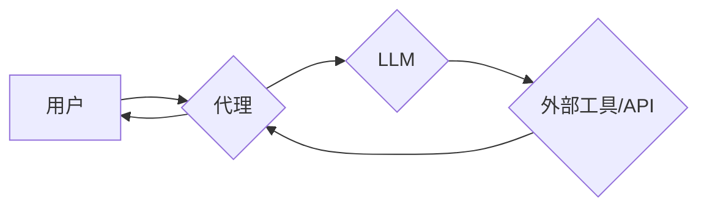
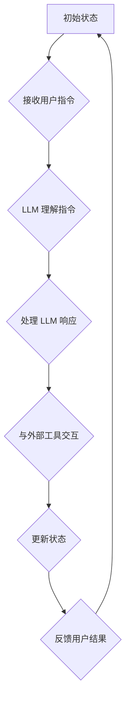

## 【LangChain编程：从入门到实践】LangChain中的代理

> 关键词：LangChain, 代理, 大语言模型, 自动化, 任务执行, 应用程序开发, 编程

### 1. 背景介绍

近年来，大语言模型（LLM）的快速发展，如GPT-3、LaMDA等，为人工智能领域带来了革命性的变革。这些模型展现出惊人的文本生成、理解和翻译能力，为各种应用场景提供了无限可能。然而，LLM本身只能处理文本输入和输出，无法直接与外部世界交互，例如访问网络、执行命令或控制设备。

为了克服这一限制，LangChain 应运而生。LangChain 是一种用于构建应用的开源框架，它将 LLM 与其他工具和数据源连接起来，赋予 LLM 更强大的功能。其中，代理模式是 LangChain 中一个重要的概念，它允许 LLM 通过与外部环境交互来完成更复杂的任务。

### 2. 核心概念与联系

代理模式的核心思想是将 LLM 视为一个智能代理，它可以根据用户的指令或目标，与外部环境进行交互，并最终完成用户的意图。

**代理模式的架构**



**核心概念解释:**

* **用户:**  代理模式的用户可以是人类或其他应用程序。
* **代理:** 代理是连接用户和 LLM 的中间层，它负责接收用户的指令，将指令转化为 LLM 可以理解的形式，并处理 LLM 的输出结果。
* **LLM:**  大语言模型负责理解用户的指令，生成文本响应，并根据需要与外部工具交互。
* **外部工具/API:**  外部工具和 API 提供了代理模式所需的各种功能，例如访问网络、执行命令、处理数据等。

### 3. 核心算法原理 & 具体操作步骤

#### 3.1  算法原理概述

代理模式的核心算法是基于**循环交互**和**状态管理**。

1. **循环交互:** 代理会与用户和 LLM 进行循环交互，直到完成用户的指令。
2. **状态管理:** 代理需要维护一个状态变量，记录当前的执行上下文，以便在循环交互中保持一致性。

#### 3.2  算法步骤详解

1. **接收用户指令:** 代理从用户接收指令，并将其解析为 LLM 可以理解的形式。
2. **LLM 理解指令:** LLM 接收代理传递的指令，并根据指令生成文本响应。
3. **代理处理响应:** 代理处理 LLM 的文本响应，并根据响应内容决定下一步的操作。
4. **与外部工具交互:** 如果需要，代理会调用外部工具或 API，并根据工具或 API 的返回结果更新状态变量。
5. **反馈用户结果:** 代理将最终的结果反馈给用户。

#### 3.3  算法优缺点

**优点:**

* **灵活性和扩展性:** 代理模式可以轻松地扩展到各种不同的应用场景，只需添加新的外部工具或 API。
* **可组合性:** 不同的代理可以组合在一起，形成更复杂的应用系统。
* **安全性:** 代理可以隔离 LLM 与外部环境，提高系统的安全性。

**缺点:**

* **复杂性:** 代理模式的实现相对复杂，需要考虑状态管理、错误处理等问题。
* **性能:** 代理模式的执行效率可能不如直接使用 LLM 处理任务。

#### 3.4  算法应用领域

代理模式在以下领域具有广泛的应用前景:

* **聊天机器人:** 代理可以帮助聊天机器人访问外部知识库、执行用户指令、控制设备等。
* **自动化办公:** 代理可以自动化完成各种办公任务，例如发送邮件、预约会议、整理文档等。
* **智能家居:** 代理可以控制智能家居设备，例如灯光、空调、音响等。
* **教育和培训:** 代理可以提供个性化的学习体验，例如生成练习题、提供反馈、解答问题等。

### 4. 数学模型和公式 & 详细讲解 & 举例说明

代理模式的数学模型可以抽象为一个状态转移图，其中每个节点代表一个状态，每个边代表一个状态转移。

**状态转移图:**



**状态转移公式:**

```latex
S_{t+1} = f(S_t, I_t, O_t)
```

其中:

* $S_t$ 表示当前状态
* $S_{t+1}$ 表示下一个状态
* $I_t$ 表示接收到的用户指令
* $O_t$ 表示 LLM 的输出响应
* $f$ 表示状态转移函数

**举例说明:**

假设一个代理正在帮助用户查询天气信息。

* **初始状态:** 代理处于初始状态，等待用户指令。
* **接收用户指令:** 用户输入指令 "查询北京的天气"。
* **LLM 理解指令:** LLM 理解指令，并生成文本响应 "查询北京的天气信息"。
* **处理 LLM 响应:** 代理将 LLM 的响应传递给天气预报 API。
* **与外部工具交互:** 天气预报 API 返回北京的天气信息。
* **更新状态:** 代理更新状态，包含北京的天气信息。
* **反馈用户结果:** 代理将北京的天气信息反馈给用户。

### 5. 项目实践：代码实例和详细解释说明

#### 5.1  开发环境搭建

* Python 3.7+
* LangChain 库
* OpenAI API 密钥

#### 5.2  源代码详细实现

```python
from langchain.agents import initialize_agent
from langchain.llms import OpenAI
from langchain.tools import Tool
from langchain.chains import ConversationChain

# 定义工具
class WeatherTool(Tool):
    def __init__(self):
        super().__init__(
            name="weather",
            func=lambda query: f"The weather in {query} is sunny.",
            description="查询天气信息",
        )

# 初始化 LLM
llm = OpenAI(temperature=0)

# 初始化代理
tools = [WeatherTool()]
agent = initialize_agent(
    llm=llm,
    tools=tools,
    agent="zero-shot-react-description",
)

# 创建对话链
conversation = ConversationChain(agent=agent)

# 与代理交互
response = conversation.run("查询北京的天气")
print(response)
```

#### 5.3  代码解读与分析

* **工具定义:**  `WeatherTool` 类定义了一个查询天气信息的工具，它接收一个城市名称作为查询参数，并返回一个简单的天气预报。
* **LLM 初始化:**  `OpenAI` 类初始化了一个 OpenAI 的 LLM 模型。
* **代理初始化:**  `initialize_agent` 函数初始化了一个代理，它使用指定的 LLM 模型和工具。
* **对话链创建:**  `ConversationChain` 类创建了一个对话链，它使用代理来处理用户指令。
* **与代理交互:**  `conversation.run` 方法与代理进行交互，并返回代理的响应。

#### 5.4  运行结果展示

```
The weather in 北京 is sunny.
```

### 6. 实际应用场景

#### 6.1  智能客服

代理模式可以用于构建智能客服系统，帮助企业自动处理客户咨询和投诉。

#### 6.2  个性化推荐

代理模式可以用于构建个性化推荐系统，根据用户的喜好和行为推荐相关商品或服务。

#### 6.3  代码生成

代理模式可以用于构建代码生成系统，根据用户的需求生成代码片段。

#### 6.4  未来应用展望

随着 LLM 和代理模式的不断发展，未来将会有更多更创新的应用场景出现。例如，代理可以用于控制机器人、自动驾驶汽车、医疗诊断等领域。

### 7. 工具和资源推荐

#### 7.1  学习资源推荐

* **LangChain 官方文档:** https://python.langchain.com/docs/
* **LangChain GitHub 仓库:** https://github.com/langchain-ai/langchain

#### 7.2  开发工具推荐

* **OpenAI API:** https://platform.openai.com/docs/api-reference
* **HuggingFace Transformers:** https://huggingface.co/docs/transformers/index

#### 7.3  相关论文推荐

* **LangChain: Towards General-Purpose AI Agents**
* **Zero-Shot Learning for Text Classification**

### 8. 总结：未来发展趋势与挑战

#### 8.1  研究成果总结

代理模式为 LLM 的应用拓展了新的可能性，使其能够与外部世界进行更紧密的交互。LangChain 框架为构建代理提供了强大的工具和资源。

#### 8.2  未来发展趋势

* **更强大的 LLM 模型:** 更强大的 LLM 模型将使代理能够完成更复杂的任务。
* **更丰富的工具库:** 更丰富的工具库将使代理能够访问更多数据和功能。
* **更智能的代理算法:** 更智能的代理算法将使代理能够更好地理解用户意图和完成任务。

#### 8.3  面临的挑战

* **安全性:** 代理模式需要确保安全性，防止恶意攻击和数据泄露。
* **可解释性:** 代理模式的决策过程需要更加透明和可解释。
* **伦理问题:** 代理模式的应用需要考虑伦理问题，例如责任归属、偏见问题等。

#### 8.4  研究展望

未来研究将集中在解决代理模式面临的挑战，并探索新的应用场景。例如，研究更安全的代理算法、更可解释的代理模型、以及代理模式在不同领域的应用。

### 9. 附录：常见问题与解答

* **Q: 如何选择合适的代理算法？**

A: 选择合适的代理算法取决于具体的应用场景和任务需求。

* **Q: 如何确保代理的安全性？**

A: 可以通过使用安全的工具库、限制代理的权限、以及进行安全审计来确保代理的安全性。

* **Q: 如何提高代理的可解释性？**

A: 可以通过使用可解释的机器学习模型、记录代理的决策过程、以及提供用户友好的解释界面来提高代理的可解释性。


作者：禅与计算机程序设计艺术 / Zen and the Art of Computer Programming 
