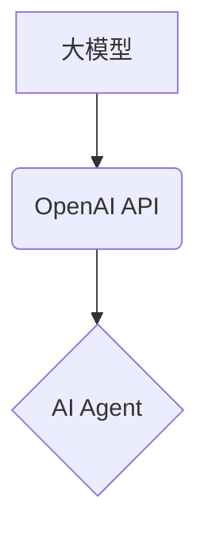

## 【大模型应用开发 动手做AI Agent】OpenAI API实践

> 关键词：大模型、OpenAI API、AI Agent、自然语言处理、文本生成、对话系统、应用开发

### 1. 背景介绍

近年来，大模型技术取得了飞速发展，其强大的文本理解和生成能力为人工智能应用带来了革命性的变革。OpenAI作为人工智能领域的领军者，推出了GPT-3、DALL-E等一系列突破性的模型，并通过OpenAI API开放了这些模型的应用接口，使得开发者能够轻松地将大模型的强大功能集成到自己的应用中。

AI Agent的概念是指能够自主学习、感知环境并做出决策的智能体。传统的AI Agent通常需要复杂的规则和编程逻辑，而大模型的出现为AI Agent的开发带来了新的可能性。通过利用大模型的文本理解和生成能力，我们可以构建更加灵活、智能、高效的AI Agent。

### 2. 核心概念与联系

#### 2.1 大模型

大模型是指参数量巨大的人工智能模型，通常拥有数十亿甚至数千亿个参数。通过训练海量文本数据，大模型能够学习到语言的复杂结构和语义关系，从而具备强大的文本理解和生成能力。

#### 2.2 OpenAI API

OpenAI API是OpenAI公司提供的开放式应用程序接口，允许开发者访问和利用OpenAI的强大大模型，例如GPT-3、DALL-E等。通过API，开发者可以轻松地将大模型的文本生成、翻译、问答等功能集成到自己的应用中。

#### 2.3 AI Agent

AI Agent是指能够自主学习、感知环境并做出决策的智能体。AI Agent通常具有以下特征：

* **感知能力:** 能够从环境中获取信息，例如文本、图像、声音等。
* **推理能力:** 能够对获取的信息进行分析和判断，做出合理的决策。
* **行动能力:** 能够执行特定的动作，例如生成文本、控制机器人等。

#### 2.4 核心概念关系



### 3. 核心算法原理 & 具体操作步骤

#### 3.1 算法原理概述

OpenAI API基于Transformer模型架构，该架构能够有效地捕捉文本序列中的长距离依赖关系。通过训练海量文本数据，Transformer模型学习到语言的语法规则和语义关系，从而能够生成流畅、自然的文本。

#### 3.2 算法步骤详解

1. **数据预处理:** 将文本数据进行清洗、分词、标记等预处理操作，使其能够被模型理解。
2. **模型训练:** 使用训练数据训练Transformer模型，调整模型参数以最小化预测误差。
3. **模型评估:** 使用测试数据评估模型的性能，例如准确率、流畅度等。
4. **模型部署:** 将训练好的模型部署到服务器上，提供API接口供开发者调用。

#### 3.3 算法优缺点

**优点:**

* **强大的文本生成能力:** Transformer模型能够生成流畅、自然的文本，适用于各种文本生成任务。
* **高效的训练:** Transformer模型的训练效率较高，能够在较短的时间内训练出高质量的模型。
* **可扩展性强:** Transformer模型的架构灵活，可以根据需要调整模型大小和参数数量。

**缺点:**

* **参数量大:** Transformer模型的参数量巨大，需要大量的计算资源进行训练和部署。
* **训练数据依赖:** Transformer模型的性能取决于训练数据的质量和数量。
* **解释性差:** Transformer模型的内部机制复杂，难以解释模型的决策过程。

#### 3.4 算法应用领域

* **文本生成:** 文章写作、故事创作、代码生成等。
* **机器翻译:** 将文本从一种语言翻译成另一种语言。
* **问答系统:** 回答用户提出的问题。
* **对话系统:** 与用户进行自然语言对话。
* **文本摘要:** 生成文本的简短摘要。

### 4. 数学模型和公式 & 详细讲解 & 举例说明

#### 4.1 数学模型构建

Transformer模型的核心是自注意力机制，该机制能够捕捉文本序列中的长距离依赖关系。自注意力机制的数学模型可以表示为：

$$
Attention(Q, K, V) = \frac{exp(Q \cdot K^T / \sqrt{d_k})}{exp(Q \cdot K^T / \sqrt{d_k})} \cdot V
$$

其中：

* $Q$：查询矩阵
* $K$：键矩阵
* $V$：值矩阵
* $d_k$：键向量的维度

#### 4.2 公式推导过程

自注意力机制的公式推导过程可以分为以下几个步骤：

1. 计算查询矩阵 $Q$ 与键矩阵 $K$ 的点积，并进行归一化处理。
2. 将归一化后的结果作为权重，对值矩阵 $V$ 进行加权求和。

#### 4.3 案例分析与讲解

假设我们有一个文本序列 "The cat sat on the mat"，我们想要计算 "cat" 与 "mat" 之间的注意力权重。

1. 将文本序列转换为词嵌入向量，得到 $Q$、$K$ 和 $V$ 矩阵。
2. 计算 $Q$ 与 $K$ 的点积，并进行归一化处理。
3. 将归一化后的结果作为权重，对 $V$ 进行加权求和，得到 "cat" 与 "mat" 之间的注意力权重。

### 5. 项目实践：代码实例和详细解释说明

#### 5.1 开发环境搭建

* Python 3.7+
* OpenAI API 访问密钥
* pip install openai

#### 5.2 源代码详细实现

```python
import openai

# 设置 OpenAI API 访问密钥
openai.api_key = "YOUR_API_KEY"

# 定义一个函数，用于使用 OpenAI API 生成文本
def generate_text(prompt):
    response = openai.Completion.create(
        engine="text-davinci-003",
        prompt=prompt,
        max_tokens=100,
        temperature=0.7,
    )
    return response.choices[0].text.strip()

# 示例用法
prompt = "写一篇关于人工智能的短文"
generated_text = generate_text(prompt)
print(generated_text)
```

#### 5.3 代码解读与分析

* 该代码首先导入 openai 库，并设置 OpenAI API 访问密钥。
* 然后定义了一个函数 `generate_text`，该函数接受一个文本提示作为输入，并使用 OpenAI API 的 `Completion.create` 方法生成文本。
* `engine` 参数指定使用的模型，这里使用的是 `text-davinci-003` 模型。
* `prompt` 参数指定文本提示。
* `max_tokens` 参数指定生成的文本最大长度。
* `temperature` 参数控制文本生成的随机性。
* 最后，代码示例调用 `generate_text` 函数，生成一篇关于人工智能的短文。

#### 5.4 运行结果展示

运行该代码后，将输出一篇关于人工智能的短文。

### 6. 实际应用场景

#### 6.1 文本生成

* **内容创作:** 自动生成文章、博客、社交媒体帖子等内容。
* **文案撰写:** 自动生成广告文案、产品描述等文案。
* **代码生成:** 自动生成代码片段，提高开发效率。

#### 6.2 机器翻译

* **跨语言沟通:** 将文本从一种语言翻译成另一种语言，方便跨语言沟通。
* **国际化产品:** 将产品文档、网站等内容翻译成多种语言，拓展市场。

#### 6.3 问答系统

* **客户服务:** 自动回答客户常见问题，提高客户服务效率。
* **知识问答:** 提供对特定领域的知识问答服务。

#### 6.4 对话系统

* **聊天机器人:** 与用户进行自然语言对话，提供信息、娱乐等服务。
* **虚拟助手:** 帮助用户完成日常任务，例如设置提醒、查询天气等。

#### 6.5 其他应用场景

* 文本摘要
* 情感分析
* 文本分类
* 代码理解

### 6.4 未来应用展望

随着大模型技术的不断发展，AI Agent的应用场景将更加广泛，例如：

* **个性化教育:** 根据学生的学习情况，提供个性化的学习内容和辅导。
* **医疗诊断:** 辅助医生进行疾病诊断，提高诊断准确率。
* **金融风险管理:** 识别和预测金融风险，降低风险损失。
* **自动驾驶:** 帮助车辆感知环境，做出安全驾驶决策。

### 7. 工具和资源推荐

#### 7.1 学习资源推荐

* **OpenAI 官方文档:** https://platform.openai.com/docs/
* **Hugging Face Transformers 库:** https://huggingface.co/docs/transformers/index
* **DeepLearning.AI 课程:** https://www.deeplearning.ai/

#### 7.2 开发工具推荐

* **Python:** https://www.python.org/
* **Jupyter Notebook:** https://jupyter.org/
* **Google Colab:** https://colab.research.google.com/

#### 7.3 相关论文推荐

* **Attention Is All You Need:** https://arxiv.org/abs/1706.03762
* **BERT: Pre-training of Deep Bidirectional Transformers for Language Understanding:** https://arxiv.org/abs/1810.04805

### 8. 总结：未来发展趋势与挑战

#### 8.1 研究成果总结

OpenAI API为开发者提供了便捷的途径，可以利用大模型的强大功能构建各种AI Agent应用。

#### 8.2 未来发展趋势

* **模型规模和能力的提升:** 未来大模型的规模和能力将继续提升，能够处理更复杂的任务。
* **多模态AI Agent:** 未来AI Agent将能够处理多种模态数据，例如文本、图像、音频等。
* **个性化AI Agent:** 未来AI Agent将能够根据用户的需求和偏好进行个性化定制。

#### 8.3 面临的挑战

* **数据安全和隐私:** 大模型的训练需要大量数据，如何保证数据安全和隐私是一个重要的挑战。
* **模型解释性和可控性:** 大模型的内部机制复杂，难以解释模型的决策过程，如何提高模型的解释性和可控性是一个重要的研究方向。
* **伦理问题:** 大模型的应用可能会带来一些伦理问题，例如算法偏见、信息操纵等，需要认真思考和解决。

#### 8.4 研究展望

未来，我们将继续研究大模型的应用，探索AI Agent在更多领域的新应用场景，并积极应对大模型带来的挑战，推动人工智能技术向更安全、更可控、更普惠的方向发展。

### 9. 附录：常见问题与解答

* **如何获取 OpenAI API 访问密钥？**

  访问 OpenAI 官网 (https://openai.com/) 注册账号并申请 API 密钥。

* **OpenAI API 的收费标准是什么？**

  OpenAI API 的收费标准根据使用量和模型类型而有所不同，具体请参考 OpenAI 官网的收费页面。

* **如何选择合适的 OpenAI API 模型？**

  选择合适的 OpenAI API 模型取决于具体的应用场景和需求。OpenAI 官网提供了不同模型的详细介绍和性能指标，可以根据实际情况进行选择。


作者：禅与计算机程序设计艺术 / Zen and the Art of Computer Programming 
