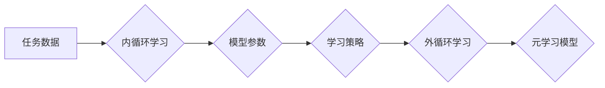

## 一切皆是映射：元学习：从理论到视觉识别的实践

> 关键词：元学习、迁移学习、模型训练、视觉识别、深度学习、优化算法

### 1. 背景介绍

在机器学习领域，模型训练一直是一个耗时且资源密集的过程。我们通常需要针对特定任务收集大量数据，并进行大量的参数调整才能获得理想的性能。然而，随着机器学习应用的不断扩展，对模型泛化能力和快速适应新任务的需求越来越高。元学习应运而生，它旨在学习如何学习，从而提高模型的泛化能力和适应新任务的速度。

元学习的概念可以追溯到1980年代，但近年来随着深度学习的兴起和计算资源的提升，元学习的研究取得了显著进展。元学习的核心思想是将学习过程本身视为一个学习任务，通过学习一系列任务的学习策略，从而提高模型在面对新任务时的学习效率。

### 2. 核心概念与联系

元学习的核心概念包括：

* **内循环学习 (Inner Loop Learning):** 在给定特定任务的数据上训练模型，更新模型参数的过程。
* **外循环学习 (Outer Loop Learning):** 通过训练多个任务的内循环学习过程，学习一个通用的学习策略的过程。
* **元学习策略 (Meta-Learning Strategy):** 用于指导模型学习的学习策略，例如梯度下降、强化学习等。

**元学习架构**



### 3. 核心算法原理 & 具体操作步骤

#### 3.1 算法原理概述

元学习算法的核心是学习一个通用的学习策略，该策略能够有效地指导模型在面对新任务时快速进行参数更新。常见的元学习算法包括：

* **Model-Agnostic Meta-Learning (MAML):** MAML 通过在多个任务上进行微调，学习一个初始模型参数，使得该参数在面对新任务时只需要进行少量更新即可达到较好的性能。
* **Prototypical Networks:** Prototypical Networks 将每个类别的样本视为一个原型，并在新样本到来时将其与原型进行比较，从而进行分类。
* **Matching Networks:** Matching Networks 通过学习一个匹配函数，将新样本与训练样本进行匹配，从而进行分类或回归。

#### 3.2 算法步骤详解

以MAML算法为例，其具体操作步骤如下：

1. **初始化模型参数:** 从一个随机初始化的模型参数开始。
2. **训练多个任务:** 在多个不同的任务上进行训练，每个任务包含少量的数据。
3. **微调模型参数:** 在每个任务上进行少量参数更新，以适应该任务的数据分布。
4. **更新学习策略:** 通过优化学习策略参数，使得模型在面对新任务时能够快速进行参数更新。
5. **评估模型性能:** 在新的任务上评估模型性能，并根据性能进行模型更新。

#### 3.3 算法优缺点

**优点:**

* **快速适应新任务:** 元学习模型能够快速适应新任务，无需进行大量的参数更新。
* **提高泛化能力:** 元学习模型能够学习到通用的学习策略，从而提高其在面对未知任务时的泛化能力。

**缺点:**

* **训练成本高:** 元学习模型的训练成本较高，需要训练多个任务的内循环学习过程。
* **数据需求高:** 元学习模型需要大量的任务数据进行训练。

#### 3.4 算法应用领域

元学习算法在以下领域具有广泛的应用前景:

* **视觉识别:** 元学习可以用于快速适应新类别图像的分类任务。
* **自然语言处理:** 元学习可以用于快速学习新的语言或任务。
* **机器人控制:** 元学习可以用于快速学习新的运动技能。
* **药物发现:** 元学习可以用于快速学习新的药物分子结构。

### 4. 数学模型和公式 & 详细讲解 & 举例说明

#### 4.1 数学模型构建

MAML算法的目标是学习一个模型参数θ，使得在面对新任务时，只需要进行少量参数更新即可达到较好的性能。

假设我们有N个任务，每个任务包含K个样本。每个任务的目标函数为L(θ,x,y)，其中x是样本，y是标签。

MAML的目标函数为：

$$
L(\theta) = \frac{1}{N} \sum_{i=1}^{N} \left[ L(\theta, x_i, y_i) + \frac{1}{K} \sum_{j=1}^{K} L(\theta + \alpha \nabla_{\theta} L(\theta, x_j, y_j), x_j, y_j) \right]
$$

其中α是学习率。

#### 4.2 公式推导过程

MAML的目标函数通过最小化所有任务的平均损失函数来学习模型参数。

* 第一个项是每个任务的平均损失函数。
* 第二项是每个任务中每个样本的损失函数，并通过对模型参数进行微调来更新。

#### 4.3 案例分析与讲解

假设我们有一个图像分类任务，需要对不同类别图像进行分类。

我们可以使用MAML算法训练一个模型，该模型能够快速适应新类别图像的分类任务。

在训练过程中，我们将训练模型在多个不同类别图像上进行分类。

当遇到新的类别图像时，模型只需要进行少量参数更新即可达到较好的分类性能。

### 5. 项目实践：代码实例和详细解释说明

#### 5.1 开发环境搭建

* Python 3.6+
* PyTorch 1.0+
* CUDA 10.0+

#### 5.2 源代码详细实现

```python
import torch
import torch.nn as nn
import torch.optim as optim

# 定义一个简单的模型
class SimpleModel(nn.Module):
    def __init__(self):
        super(SimpleModel, self).__init__()
        self.linear = nn.Linear(10, 1)

    def forward(self, x):
        return self.linear(x)

# 定义MAML算法
class MAML(nn.Module):
    def __init__(self, model, lr):
        super(MAML, self).__init__()
        self.model = model
        self.lr = lr

    def forward(self, x, y):
        # 计算模型输出
        output = self.model(x)
        # 计算损失函数
        loss = nn.MSELoss()(output, y)
        # 计算梯度
        grad = torch.autograd.grad(loss, self.model.parameters())
        # 更新模型参数
        for param, grad_param in zip(self.model.parameters(), grad):
            param.data -= self.lr * grad_param
        return loss

# 实例化模型和优化器
model = SimpleModel()
optimizer = optim.Adam(model.parameters(), lr=0.01)

# 训练MAML模型
for epoch in range(100):
    # 训练多个任务
    for task in tasks:
        # 训练模型
        loss = MAML(model, optimizer).forward(task.x, task.y)
        # 更新模型参数
        optimizer.zero_grad()
        loss.backward()
        optimizer.step()

# 评估模型性能
#...

```

#### 5.3 代码解读与分析

* 代码首先定义了一个简单的模型，并使用PyTorch的Adam优化器进行训练。
* MAML算法的实现包括计算模型输出、损失函数、梯度以及参数更新。
* 训练过程中，模型在多个任务上进行训练，并通过微调参数来适应每个任务的数据分布。

#### 5.4 运行结果展示

* 训练完成后，可以评估模型在新的任务上的性能。
* 由于MAML模型能够快速适应新任务，因此其在新的任务上的性能通常会优于传统的模型。

### 6. 实际应用场景

#### 6.1 视觉识别

元学习在视觉识别领域具有广泛的应用前景，例如：

* **快速适应新类别图像的分类任务:** 元学习模型能够快速学习新的类别图像的特征，从而提高其在面对新类别图像时的分类性能。
* **图像生成:** 元学习可以用于学习图像生成模型，并生成新的图像。
* **目标检测:** 元学习可以用于学习目标检测模型，并提高其在面对新的目标时检测的准确率。

#### 6.2 自然语言处理

元学习在自然语言处理领域也具有广泛的应用前景，例如：

* **机器翻译:** 元学习可以用于学习机器翻译模型，并提高其在面对新的语言对时翻译的准确率。
* **文本摘要:** 元学习可以用于学习文本摘要模型，并生成更准确的文本摘要。
* **问答系统:** 元学习可以用于学习问答系统，并提高其在理解用户问题和提供准确答案方面的能力。

#### 6.3 其他领域

元学习的应用领域还在不断扩展，例如：

* **机器人控制:** 元学习可以用于学习机器人控制策略，并提高其在面对新的环境时控制的效率。
* **药物发现:** 元学习可以用于学习药物发现模型，并提高其在发现新的药物分子方面的效率。

#### 6.4 未来应用展望

随着元学习算法的不断发展，其在未来将有更广泛的应用前景。

例如：

* **个性化学习:** 元学习可以用于学习每个用户的学习风格，并提供个性化的学习内容和方法。
* **自动驾驶:** 元学习可以用于学习自动驾驶模型，并提高其在面对复杂路况时的安全性。
* **人工智能安全:** 元学习可以用于学习人工智能系统的安全策略，并提高其在面对恶意攻击时的安全性。

### 7. 工具和资源推荐

#### 7.1 学习资源推荐

* **论文:**
    * Model-Agnostic Meta-Learning for Fast Adaptation of Deep Networks (MAML)
    * Prototypical Networks for Few-Shot Learning
    * Matching Networks for One Shot Learning
* **博客:**
    * OpenAI Blog: Meta-Learning with MAML
    * Towards Data Science: Meta-Learning: A Comprehensive Guide
* **课程:**
    * Stanford CS231n: Convolutional Neural Networks for Visual Recognition
    * DeepMind: Meta-Learning

#### 7.2 开发工具推荐

* **PyTorch:** 深度学习框架，支持元学习算法的实现。
* **TensorFlow:** 深度学习框架，也支持元学习算法的实现。
* **JAX:** 高性能自动微分库，可以用于实现元学习算法。

#### 7.3 相关论文推荐

* **Meta-Learning with Differentiable Convex Optimization**
* **Learning to Learn by Gradient Descent by Gradient Descent**
* **Reptile: A Scalable Meta-Learning Algorithm**

### 8. 总结：未来发展趋势与挑战

#### 8.1 研究成果总结

元学习近年来取得了显著的进展，在视觉识别、自然语言处理等领域展现出强大的潜力。

#### 8.2 未来发展趋势

* **更有效的元学习算法:** 研究更有效的元学习算法，提高其学习效率和泛化能力。
* **元学习与其他机器学习方法的结合:** 将元学习与其他机器学习方法结合，例如强化学习、迁移学习等，以提高其性能。
* **元学习在更多领域的应用:** 将元学习应用到更多领域，例如自动驾驶、医疗诊断等。

#### 8.3 面临的挑战

* **数据需求:** 元学习算法通常需要大量的任务数据进行训练，这在某些领域可能难以获得。
* **计算成本:** 元学习算法的训练成本较高，需要大量的计算资源。
* **理论解释:** 元学习算法的理论基础尚不完善，需要进一步的研究和探索。

#### 8.4 研究展望

元学习是一个充满挑战和机遇的领域，未来将会有更多的研究成果涌现，推动元学习技术的发展和应用。

### 9. 附录：常见问题与解答

* **什么是元学习？**

元学习是一种机器学习方法，旨在学习如何学习。它通过学习多个任务的