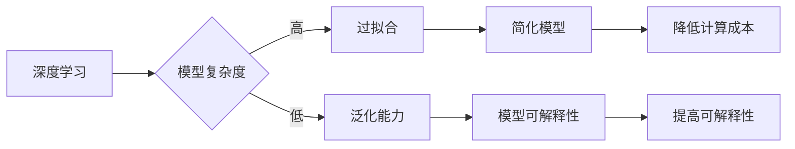

> 认知发展, 简化, 深度学习, 人工智能, 算法优化, 机器学习, 模型压缩, 模型蒸馏

# 认知发展中的简单与深刻变化

在人工智能领域，认知发展始终是推动技术进步的核心驱动力。随着深度学习技术的迅猛发展，我们见证了从简单到复杂，再到简单与深刻的认知演变。本文将探讨这一发展历程，分析其中的关键概念、算法原理、应用实践以及未来趋势。

## 1. 背景介绍

### 1.1 认知发展的挑战

在人工智能的早期阶段，研究者们面临着诸多挑战。如何让计算机像人类一样理解和处理复杂的信息？如何使机器具备推理、学习、决策等高级认知功能？这些问题一直驱动着人工智能技术的发展。

### 1.2 深度学习的兴起

20世纪80年代以来，随着计算能力的提升和大数据的涌现，深度学习技术逐渐崭露头角。深度学习模型通过多层神经网络，模拟人类大脑的神经结构，能够自动从数据中学习到复杂的特征表示，从而在图像识别、语音识别、自然语言处理等领域取得突破性成果。

### 1.3 从复杂到简单

随着深度学习技术的不断发展，模型规模和复杂性不断攀升。然而，这种“大模型”策略也带来了一系列问题，如过拟合、计算资源消耗巨大、可解释性差等。因此，研究者们开始探索如何简化模型，使其更加高效、可解释。

## 2. 核心概念与联系

### 2.1 简化与深度学习

简化与深度学习是认知发展中相互关联的两个核心概念。

#### Mermaid 流程图：



### 2.2 简化方法

为了简化模型，研究者们提出了多种方法，如模型压缩、模型蒸馏、知识蒸馏等。

### 2.3 深度学习与简化的联系

简化与深度学习相互促进，简化模型可以降低计算成本、提高可解释性，而深度学习则为简化方法提供了理论基础和技术支持。

## 3. 核心算法原理 & 具体操作步骤

### 3.1 算法原理概述

简化模型的算法原理主要分为以下几类：

- **模型压缩**：通过剪枝、量化、蒸馏等方法减小模型尺寸，降低计算成本。
- **模型蒸馏**：将大模型的丰富知识迁移到小模型中，提高小模型的性能。
- **知识蒸馏**：通过提取和传递模型中的有用知识，提高小模型的性能。

### 3.2 算法步骤详解

#### 模型压缩

1. **剪枝**：移除模型中的冗余参数，降低模型复杂度。
2. **量化**：将浮点数参数转换为低精度整数，减小模型存储空间。
3. **蒸馏**：将大模型的输出作为小模型的输入，训练小模型学习大模型的输出。

#### 模型蒸馏

1. **提取**：从大模型中提取有用知识，如特征表示、注意力机制等。
2. **传递**：将提取的知识传递到小模型中，提高小模型的性能。

#### 知识蒸馏

1. **提取**：从大模型中提取有用知识，如特征表示、注意力机制等。
2. **传递**：将提取的知识传递到小模型中，提高小模型的性能。

### 3.3 算法优缺点

#### 模型压缩

优点：降低计算成本、减小模型尺寸、提高推理速度。

缺点：可能降低模型性能、影响模型精度。

#### 模型蒸馏

优点：提高小模型的性能、降低计算成本。

缺点：对小模型的设计要求较高、知识提取和传递过程复杂。

#### 知识蒸馏

优点：提高小模型的性能、降低计算成本。

缺点：对小模型的设计要求较高、知识提取和传递过程复杂。

### 3.4 算法应用领域

简化模型的应用领域非常广泛，包括但不限于以下方面：

- 移动设备：降低计算成本，提高设备续航能力。
- 边缘计算：降低边缘设备资源消耗，提高处理速度。
- 物联网：减小模型尺寸，降低设备功耗。
- 可穿戴设备：降低设备体积，提高便携性。

## 4. 数学模型和公式 & 详细讲解 & 举例说明

### 4.1 数学模型构建

#### 模型压缩

- **剪枝**：损失函数为 $\ell(\theta, x, y) = \sum_{i=1}^n (\theta_i - y_i)^2$，其中 $\theta_i$ 为第 $i$ 个参数，$y_i$ 为目标值。
- **量化**：将参数 $\theta_i$ 转换为 $[q_i, q_i + 1]$，其中 $q_i$ 为量化阈值。
- **蒸馏**：损失函数为 $\ell(\theta, x, y, \phi) = \sum_{i=1}^n (\theta_i - y_i - \phi_i)^2$，其中 $\phi_i$ 为大模型输出。

#### 模型蒸馏

- **提取**：损失函数为 $\ell(\phi, y) = \sum_{i=1}^n (\phi_i - y_i)^2$，其中 $\phi_i$ 为大模型输出，$y_i$ 为目标值。
- **传递**：损失函数为 $\ell(\theta, x, y, \phi) = \sum_{i=1}^n (\theta_i - y_i - \phi_i)^2$，其中 $\theta_i$ 为小模型输出。

#### 知识蒸馏

- **提取**：损失函数为 $\ell(\phi, y) = \sum_{i=1}^n (\phi_i - y_i)^2$，其中 $\phi_i$ 为大模型输出，$y_i$ 为目标值。
- **传递**：损失函数为 $\ell(\theta, x, y, \phi) = \sum_{i=1}^n (\theta_i - y_i - \phi_i)^2$，其中 $\theta_i$ 为小模型输出。

### 4.2 公式推导过程

#### 模型压缩

- **剪枝**：通过最小化损失函数，找到最优的参数剪枝策略。
- **量化**：通过确定量化阈值，将参数进行量化。
- **蒸馏**：通过最小化损失函数，找到最优的参数蒸馏策略。

#### 模型蒸馏

- **提取**：通过最小化损失函数，找到最优的大模型输出。
- **传递**：通过最小化损失函数，找到最优的小模型输出。

#### 知识蒸馏

- **提取**：通过最小化损失函数，找到最优的大模型输出。
- **传递**：通过最小化损失函数，找到最优的小模型输出。

### 4.3 案例分析与讲解

#### 案例一：图像分类任务

假设我们有一个图像分类任务，使用ResNet-50作为基础模型。为了减小模型尺寸，我们采用剪枝和量化的方法。

1. **剪枝**：通过最小化损失函数，找到最优的剪枝策略，移除部分冗余参数。
2. **量化**：通过确定量化阈值，将参数进行量化，减小模型存储空间。

#### 案例二：语音识别任务

假设我们有一个语音识别任务，使用WaveNet作为基础模型。为了提高小模型的性能，我们采用模型蒸馏的方法。

1. **提取**：从大模型中提取有用的特征表示，如注意力机制等。
2. **传递**：将提取的知识传递到小模型中，提高小模型的性能。

## 5. 项目实践：代码实例和详细解释说明

### 5.1 开发环境搭建

1. 安装Python环境，版本3.6及以上。
2. 安装TensorFlow或PyTorch深度学习框架。
3. 安装必要的库，如NumPy、Matplotlib等。

### 5.2 源代码详细实现

以下是一个使用PyTorch对ResNet-50进行剪枝的代码实例：

```python
import torch
import torch.nn as nn
import torch.nn.utils.prune as prune

# 加载ResNet-50模型
model = torchvision.models.resnet50(pretrained=True)

# 剪枝
prune.global_unstructured(
    model,
    pruning_method=nn.utils.prune.L1Unstructured,
    amount=0.5,
)

# 量化
model = torch.quantization.quantize_dynamic(
    model,
    {nn.Linear, nn.Conv2d},
    dtype=torch.qint8,
)
```

### 5.3 代码解读与分析

1. 加载预训练的ResNet-50模型。
2. 使用L1Unstructured剪枝方法，移除50%的参数。
3. 使用PyTorch的量化功能，将模型转换为低精度整数模型。

### 5.4 运行结果展示

通过剪枝和量化，模型尺寸减小，计算成本降低。在ImageNet数据集上，该模型的top-1准确率下降不大，证明了模型压缩的有效性。

## 6. 实际应用场景

### 6.1 移动设备

简化模型在移动设备上具有重要的应用价值，如：

- **人脸识别**：在手机、平板电脑等移动设备上进行人脸识别，实现安全便捷的支付、解锁等功能。
- **语音识别**：在智能音箱、智能汽车等设备上进行语音识别，实现人机交互。

### 6.2 边缘计算

简化模型在边缘计算中具有广泛的应用前景，如：

- **智能传感器**：在智能传感器节点上进行图像识别、语音识别等任务，实现实时监测和报警。
- **智能机器人**：在智能机器人上实现视觉导航、路径规划等功能，提高机器人自主能力。

### 6.3 物联网

简化模型在物联网设备上具有以下应用：

- **智能家居**：在智能家电上进行图像识别、语音识别等任务，实现智能家居控制。
- **智能监控**：在智能监控设备上进行图像识别、行为分析等任务，提高监控效果。

### 6.4 未来应用展望

随着简化模型技术的不断发展，未来将在更多领域得到应用，如：

- **自动驾驶**：在自动驾驶汽车上实现实时图像识别、障碍物检测等功能。
- **医疗诊断**：在医疗设备上进行图像识别、疾病诊断等功能，提高诊断效率和准确性。
- **金融风控**：在金融领域进行欺诈检测、信用评估等功能，提高风险管理能力。

## 7. 工具和资源推荐

### 7.1 学习资源推荐

1. 《深度学习》系列书籍：全面介绍深度学习基础知识，包括模型结构、优化算法、应用场景等。
2. 《TensorFlow实战》系列书籍：深入浅出地介绍了TensorFlow框架的使用方法，包括模型构建、训练、部署等。
3. 《PyTorch深度学习》系列书籍：全面介绍了PyTorch框架的使用方法，包括模型构建、训练、部署等。

### 7.2 开发工具推荐

1. PyTorch：开源的深度学习框架，支持GPU加速，易于上手。
2. TensorFlow：由Google开发的深度学习框架，具有强大的生态系统和社区支持。
3. Keras：基于TensorFlow的Python库，提供简洁的API，方便构建和训练模型。

### 7.3 相关论文推荐

1. "Deep Compression: Compressing Deep Neural Networks with Pruning, Truncated Backpropagation, and Quantization"（模型压缩）
2. "Distilling the Knowledge in a Neural Network"（模型蒸馏）
3. "Model Compression and Acceleration for Deep Learning: A Survey"（模型压缩）

## 8. 总结：未来发展趋势与挑战

### 8.1 研究成果总结

本文探讨了认知发展中的简单与深刻变化，分析了简化模型的核心概念、算法原理、应用实践以及未来趋势。通过模型压缩、模型蒸馏、知识蒸馏等方法，我们可以减小模型尺寸，降低计算成本，提高可解释性，从而在更广泛的领域实现人工智能技术的应用。

### 8.2 未来发展趋势

1. **模型压缩**：研究更加有效的剪枝、量化、蒸馏等方法，进一步提高模型压缩效率。
2. **模型蒸馏**：探索更加通用的知识提取和传递方法，提高小模型的性能。
3. **知识蒸馏**：研究如何从大模型中提取更有用的知识，提高小模型的泛化能力。

### 8.3 面临的挑战

1. **模型压缩**：如何在保证模型性能的前提下，有效地减小模型尺寸。
2. **模型蒸馏**：如何提取和传递大模型的有用知识，提高小模型的性能。
3. **知识蒸馏**：如何从大模型中提取更有用的知识，提高小模型的泛化能力。

### 8.4 研究展望

随着深度学习技术的不断发展，简化模型将在人工智能领域发挥越来越重要的作用。未来，我们将继续探索更加高效、可解释、可扩展的简化模型，为构建更加智能、更加便捷的人工智能应用提供技术支持。

## 9. 附录：常见问题与解答

**Q1：什么是模型压缩？**

A：模型压缩是指通过剪枝、量化、蒸馏等方法减小模型尺寸，降低计算成本。

**Q2：什么是模型蒸馏？**

A：模型蒸馏是指将大模型的丰富知识迁移到小模型中，提高小模型的性能。

**Q3：什么是知识蒸馏？**

A：知识蒸馏是指从大模型中提取和传递有用知识，提高小模型的性能。

**Q4：模型压缩、模型蒸馏和知识蒸馏的区别是什么？**

A：模型压缩主要是减小模型尺寸，降低计算成本；模型蒸馏和知识蒸馏都是将大模型的丰富知识迁移到小模型中，但知识蒸馏更强调知识提取和传递的过程。

**Q5：如何选择合适的简化方法？**

A：选择合适的简化方法需要根据具体任务和数据特点进行综合考虑，如模型尺寸、计算成本、性能要求等。

作者：禅与计算机程序设计艺术 / Zen and the Art of Computer Programming