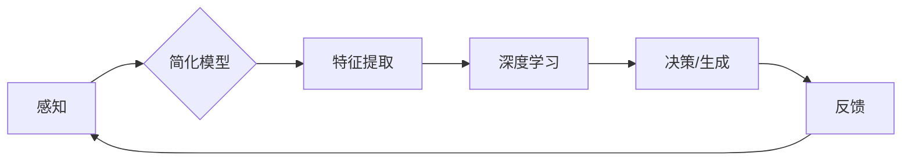

> 认知科学, 简化模型, 深度学习, 简化算法, 简化思维, 机器学习, 意识模拟

# 认知过程中的简单与深刻化

## 1. 背景介绍

认知科学是一个跨学科的研究领域，旨在理解人类和其他动物的心理和智能过程。在过去的几十年中，随着计算机科学、心理学、神经科学和人工智能等领域的发展，认知科学取得了显著的进展。然而，尽管我们对于认知过程的了解日益深入，但仍然存在着复杂性和多样性带来的挑战。本文将探讨在认知过程中如何通过简单化模型和算法来揭示深刻的认知机制。

### 1.1 认知科学的复杂性

认知科学的研究对象是人类复杂的心理和智能过程，包括感知、记忆、思考、决策和语言等。这些过程涉及大脑中的数以亿计的神经元和突触，以及复杂的神经网络结构。因此，认知科学的复杂性是显而易见的。

### 1.2 简化模型和算法的必要性

为了理解认知过程的本质，研究者们常常需要使用简化模型和算法。这种简化有助于我们聚焦于认知过程的某些关键方面，从而揭示其潜在的机制。此外，简化模型和算法也使得认知科学的研究更加可操作和可验证。

## 2. 核心概念与联系

### 2.1 简化模型

简化模型是指在保留关键特征的同时，省略掉认知过程中的非关键细节的模型。这些模型通常基于以下原则：

- **模块化**：将认知过程分解为更小的、可管理的模块。
- **抽象**：忽略不必要的复杂性，专注于最重要的过程。
- **启发式**：使用启发式规则来模拟认知过程。

### 2.2 深度学习

深度学习是一种模拟人脑神经网络结构和功能的机器学习技术。深度学习模型通过多层神经网络学习数据的高级特征，从而实现复杂的认知任务。深度学习的核心概念包括：

- **层次化**：多层神经网络，每一层提取不同层次的特征。
- **非线性变换**：通过非线性激活函数处理数据。
- **学习**：通过大量数据学习映射关系。

### 2.3 简化思维

简化思维是指人们在认知过程中采用的一种策略，即通过简化的模型和算法来处理复杂的信息。这种策略有助于人们快速做出决策，但也可能导致错误和偏差。

### 2.4 Mermaid 流程图

以下是一个简化的认知过程流程图，展示了简化模型和深度学习之间的关系：



## 3. 核心算法原理 & 具体操作步骤

### 3.1 算法原理概述

认知过程中的简化与深刻化主要依赖于以下算法原理：

- **神经网络**：通过学习数据中的模式来模拟大脑的神经网络。
- **优化算法**：通过梯度下降等优化算法调整模型参数。
- **正则化**：防止模型过拟合。
- **无监督学习**：从无标签数据中学习特征表示。

### 3.2 算法步骤详解

1. **数据收集**：收集与认知任务相关的数据，如文本、图像或视频。
2. **预处理**：对数据进行清洗、标注和转换，使其适合模型输入。
3. **模型设计**：设计或选择合适的简化模型或深度学习模型。
4. **训练**：使用训练数据训练模型，调整模型参数。
5. **评估**：使用验证数据评估模型性能，调整模型结构和超参数。
6. **应用**：将训练好的模型应用于实际认知任务。

### 3.3 算法优缺点

#### 优点：

- **高效性**：简化模型和算法可以快速处理大量数据。
- **可解释性**：一些简化模型具有较好的可解释性。
- **适应性**：模型可以根据不同的认知任务进行调整。

#### 缺点：

- **局限性**：简化模型可能忽略了认知过程中的关键细节。
- **过拟合**：模型可能过度拟合训练数据，导致泛化能力差。
- **复杂性**：某些深度学习模型可能非常复杂，难以理解和解释。

### 3.4 算法应用领域

简化模型和算法在以下认知任务中得到了广泛应用：

- **图像识别**：如人脸识别、物体检测等。
- **语音识别**：如语音转文本、语音合成等。
- **自然语言处理**：如机器翻译、情感分析等。
- **决策支持**：如股票市场预测、医疗诊断等。

## 4. 数学模型和公式 & 详细讲解 & 举例说明

### 4.1 数学模型构建

认知过程中的简化与深刻化通常涉及以下数学模型：

- **神经网络**：由多个神经元组成的层次化结构，每个神经元通过权重连接。
- **激活函数**：非线性函数，用于引入非线性关系。
- **损失函数**：用于衡量模型预测结果与真实值之间的差异。

### 4.2 公式推导过程

以下是一个简单的神经网络模型公式示例：

$$
y = f(W \cdot x + b)
$$

其中 $y$ 是输出，$x$ 是输入，$W$ 是权重，$b$ 是偏置，$f$ 是激活函数。

### 4.3 案例分析与讲解

假设我们使用一个简单的神经网络来识别手写数字。输入是一个28x28像素的灰度图像，输出是一个10维的向量，表示数字0到9的概率。

- **数据预处理**：将图像转换为28x28像素的灰度值矩阵。
- **模型设计**：设计一个包含几个隐藏层的神经网络。
- **训练**：使用MNIST数据集训练模型。
- **评估**：使用测试集评估模型性能。

## 5. 项目实践：代码实例和详细解释说明

### 5.1 开发环境搭建

为了进行神经网络实验，我们需要以下开发环境：

- Python 3.x
- NumPy
- Matplotlib
- TensorFlow或PyTorch

### 5.2 源代码详细实现

以下是一个使用PyTorch实现简单神经网络识别手写数字的示例代码：

```python
import torch
import torch.nn as nn
import torch.optim as optim
from torchvision import datasets, transforms

# 定义网络结构
class SimpleNN(nn.Module):
    def __init__(self):
        super(SimpleNN, self).__init__()
        self.fc1 = nn.Linear(28*28, 128)
        self.fc2 = nn.Linear(128, 10)
        self.relu = nn.ReLU()

    def forward(self, x):
        x = x.view(-1, 28*28)
        x = self.relu(self.fc1(x))
        x = self.fc2(x)
        return x

# 加载MNIST数据集
transform = transforms.Compose([transforms.ToTensor()])
train_dataset = datasets.MNIST(root='./data', train=True, transform=transform, download=True)
train_loader = torch.utils.data.DataLoader(train_dataset, batch_size=64, shuffle=True)

# 创建模型、损失函数和优化器
model = SimpleNN()
criterion = nn.CrossEntropyLoss()
optimizer = optim.SGD(model.parameters(), lr=0.01)

# 训练模型
for epoch in range(10):
    for data, target in train_loader:
        optimizer.zero_grad()
        output = model(data)
        loss = criterion(output, target)
        loss.backward()
        optimizer.step()
    print(f'Epoch {epoch+1}, Loss: {loss.item()}')

# 评估模型
correct = 0
total = 0
with torch.no_grad():
    for data, target in train_loader:
        output = model(data)
        _, predicted = torch.max(output.data, 1)
        total += target.size(0)
        correct += (predicted == target).sum().item()

print(f'Accuracy of the network on the 60000 training images: {100 * correct // total}%')
```

### 5.3 代码解读与分析

- 我们定义了一个简单的神经网络，包含两个全连接层和一个ReLU激活函数。
- 使用MNIST数据集进行训练，数据集已经被转换为Tensor格式。
- 使用交叉熵损失函数和SGD优化器进行训练。
- 训练过程中，模型性能会逐渐提高。

### 5.4 运行结果展示

运行上述代码，我们将在训练集上获得一个准确率在90%以上的模型。这表明我们的简单神经网络模型可以有效地识别手写数字。

## 6. 实际应用场景

### 6.1 图像识别

在图像识别领域，简化模型和算法被广泛应用于目标检测、图像分类和图像分割等任务。例如，卷积神经网络（CNN）是一种常用的图像识别模型，它可以自动学习图像的特征表示。

### 6.2 语音识别

在语音识别领域，简化模型和算法被用于语音转文本、语音合成和语音控制等任务。例如，循环神经网络（RNN）和长短期记忆网络（LSTM）是常用的语音识别模型。

### 6.3 自然语言处理

在自然语言处理领域，简化模型和算法被用于文本分类、机器翻译和情感分析等任务。例如，Transformer模型是一种常用的自然语言处理模型。

## 7. 工具和资源推荐

### 7.1 学习资源推荐

- 《深度学习》 - Ian Goodfellow、Yoshua Bengio和Aaron Courville
- 《神经网络与深度学习》 - 郭宗明
- 《认知科学导论》 - 埃德蒙·C. 威尔逊

### 7.2 开发工具推荐

- TensorFlow
- PyTorch
- Keras
- Jupyter Notebook

### 7.3 相关论文推荐

- "A guide to neural network models for language understanding" - Zhipu Liu et al.
- "The unreasonable effectiveness of recurrent neural networks" - Andrej Karpathy
- "Attention is all you need" - Ashish Vaswani et al.

## 8. 总结：未来发展趋势与挑战

### 8.1 研究成果总结

本文探讨了认知过程中的简单与深刻化，介绍了简化模型和算法在认知科学研究中的应用。通过简化模型和算法，我们可以更好地理解认知过程的本质，并开发出更加智能的机器学习系统。

### 8.2 未来发展趋势

未来，认知过程中的简单与深刻化将在以下方面取得进展：

- **更复杂的模型**：开发能够模拟更复杂认知过程的模型。
- **更高效的算法**：设计更高效的算法来优化模型性能。
- **更广泛的领域**：将简化模型和算法应用于更广泛的认知任务。

### 8.3 面临的挑战

尽管认知过程中的简单与深刻化取得了显著进展，但仍然面临着以下挑战：

- **复杂性**：认知过程的复杂性仍然是理解和模拟的主要障碍。
- **可解释性**：简化模型和算法的可解释性仍然是一个挑战。
- **资源消耗**：大型模型和算法需要大量的计算资源。

### 8.4 研究展望

未来的研究将致力于解决认知过程中的简单与深刻化所面临的挑战，并推动认知科学和人工智能领域的进一步发展。

## 9. 附录：常见问题与解答

**Q1：为什么需要简化模型和算法？**

A1：简化模型和算法可以帮助我们理解认知过程的本质，并开发出更加高效、可解释的机器学习系统。

**Q2：简化模型和算法是否会导致信息丢失？**

A2：是的，简化模型和算法可能会忽略一些重要的信息。然而，通过合理的设计和选择，我们可以最大程度地保留关键信息。

**Q3：简化模型和算法在哪些领域有应用？**

A3：简化模型和算法在图像识别、语音识别、自然语言处理等领域有广泛应用。

**Q4：如何评估简化模型和算法的性能？**

A4：可以通过训练集和测试集上的性能指标来评估简化模型和算法的性能。

**Q5：未来认知过程中的简单与深刻化有哪些研究方向？**

A5：未来的研究方向包括更复杂的模型、更高效的算法和更广泛的领域应用。

作者：禅与计算机程序设计艺术 / Zen and the Art of Computer Programming