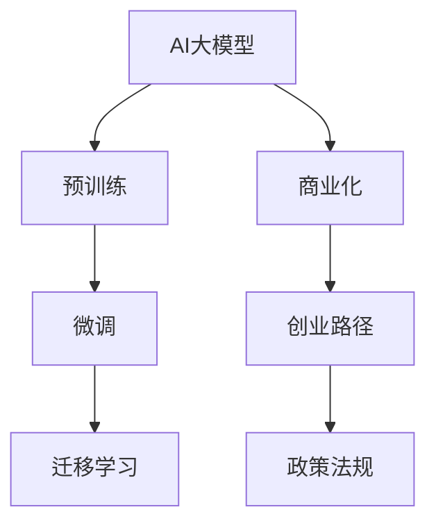

                 

# AI大模型创业战：挑战与机遇并存的分析、思考与探讨

> 关键词：AI大模型,创业,挑战,机遇,人工智能,创新,技术,商业化,应用场景,创业路径,政策环境,人才需求

## 1. 背景介绍

### 1.1 问题由来

随着人工智能技术的不断进步，特别是在自然语言处理(NLP)、计算机视觉(CV)等领域的突破，AI大模型成为了众多科技公司、创业团队争相布局的焦点。AI大模型凭借其强大的学习和推理能力，被广泛应用于智能客服、金融风控、智能推荐、医疗诊断等垂直领域，极大地提高了各行业的智能化水平，提升了用户体验，带来了显著的经济价值。

然而，AI大模型的研发和商业化过程充满挑战。高昂的研发成本、庞大的数据需求、复杂的模型调优、严格的政策监管等，使得众多创业团队望而却步。另一方面，AI大模型蕴含的巨大商业潜力，吸引了大量资金的投入，为创业者带来了前所未有的机遇。

### 1.2 问题核心关键点

AI大模型创业的核心问题可以归纳为以下几个关键点：

- **研发成本**：大模型需要庞大的计算资源和数据集，研发成本高昂。
- **数据获取**：大模型需要海量的标注数据进行训练，标注数据获取困难。
- **模型调优**：模型需要频繁的调优，才能适应不同的应用场景。
- **政策监管**：大模型在金融、医疗等敏感领域的应用受到严格监管，政策风险高。
- **商业化**：如何将大模型技术转化为实际应用，实现商业价值。

### 1.3 问题研究意义

研究AI大模型创业的挑战与机遇，对于推动AI技术的落地应用，激发创新创业活力，具有重要意义：

1. **降低创业门槛**：帮助创业者理清思路，降低创业初期面临的困难。
2. **发掘商业模式**：揭示AI大模型的潜在应用场景，寻找适合的商业模式。
3. **优化资源配置**：指导创业者合理配置资源，实现技术、市场和资金的良性循环。
4. **推动产业升级**：帮助传统行业实现智能化升级，提升整体竞争力和创新能力。
5. **增进国际竞争力**：利用AI大模型技术，提升国家的科技实力和国际影响力。

## 2. 核心概念与联系

### 2.1 核心概念概述

为了更好地理解AI大模型的创业过程，本节将介绍几个关键概念及其相互关系：

- **AI大模型**：指使用深度学习技术，通过大规模无标签数据预训练得到的大型通用或领域特定模型。如BERT、GPT-3、T5等。
- **预训练与微调**：在大规模无标签数据上预训练模型，然后在特定任务上使用少量标注数据进行微调，以适应任务需求。
- **迁移学习**：将预训练模型知识迁移到新任务上，减少任务特定的数据需求。
- **商业化**：将AI技术转化为商业应用，实现技术价值的变现。
- **政策法规**：与AI大模型相关的法律法规，如数据隐私、模型透明性等。
- **创业路径**：从技术研发到市场应用的完整流程。

这些概念之间通过以下Mermaid流程图展示其联系：



该流程图展示了AI大模型从预训练、微调、迁移学习到商业化、创业路径和政策法规的全过程。

### 2.2 概念间的关系

这些核心概念之间存在着紧密的联系，形成了AI大模型创业的完整生态系统。以下是各概念间的关系图：


## 3. 核心算法原理 & 具体操作步骤

### 3.1 算法原理概述

AI大模型的创业过程，本质上是从技术研发到商业应用的过程，涉及多个关键步骤。

- **预训练**：使用大规模无标签数据训练模型，学习通用或领域特定的知识表示。
- **微调**：在特定任务上使用少量标注数据进行微调，调整模型参数以适应任务需求。
- **迁移学习**：将预训练模型知识迁移到新任务上，减少任务特定的数据需求。
- **商业化**：将AI技术转化为商业应用，实现技术价值的变现。

### 3.2 算法步骤详解

AI大模型的创业过程主要包括以下几个关键步骤：

**Step 1: 数据获取与预训练模型选择**

- 确定项目所需数据类型和规模，寻找合适的数据来源，如公共数据集、合作机构等。
- 选择合适的预训练模型作为初始化参数，如BERT、GPT-3、T5等。

**Step 2: 数据标注与微调数据准备**

- 收集和清洗数据，准备标注数据集。标注数据集需要包含足够的样本，以覆盖不同的场景和边界情况。
- 确定微调的目标任务，设计任务适配层，如分类、匹配、生成等。

**Step 3: 微调与优化**

- 使用微调数据集进行模型微调，选择合适的优化器如AdamW、SGD等，设置学习率、批大小等超参数。
- 应用正则化技术如L2正则、Dropout等，防止过拟合。
- 使用对抗训练、数据增强等技术，提高模型的鲁棒性和泛化能力。

**Step 4: 模型评估与部署**

- 在验证集和测试集上评估模型性能，优化模型参数。
- 部署模型到生产环境，进行线上服务部署和监控。

**Step 5: 商业化与迭代**

- 根据实际应用需求，不断优化模型性能和用户体验。
- 寻找商业合作机会，拓展市场应用场景。

### 3.3 算法优缺点

AI大模型的创业过程具有以下优点：

- **高效学习**：利用预训练模型学习通用知识，减少任务特定数据的需求。
- **快速迭代**：微调模型快速适应新任务，缩短开发周期。
- **成本节约**：利用大模型的多场景适应能力，减少定制开发成本。

同时，也存在以下缺点：

- **高昂成本**：预训练和微调需要大量的计算资源和数据集，成本高昂。
- **技术门槛高**：需要具备深度学习、自然语言处理等多领域的知识和技能。
- **政策风险**：AI大模型在金融、医疗等敏感领域的应用受到严格监管，政策风险高。
- **数据隐私**：需要处理大量的敏感数据，数据隐私和安全问题突出。

### 3.4 算法应用领域

AI大模型创业在多个领域都有广泛的应用，以下是几个典型场景：

- **智能客服**：利用大模型进行自然语言处理和理解，实现智能客服。
- **金融风控**：使用大模型进行信用评分、欺诈检测等金融风控任务。
- **智能推荐**：通过大模型分析用户行为，实现个性化推荐。
- **医疗诊断**：利用大模型进行疾病预测、基因分析等医疗诊断任务。
- **智能交通**：使用大模型进行交通流量预测、交通事件处理等。
- **自动驾驶**：利用大模型进行图像识别、目标检测等自动驾驶任务。

## 4. 数学模型和公式 & 详细讲解 & 举例说明

### 4.1 数学模型构建

在AI大模型的创业过程中，常用的数学模型包括线性回归、逻辑回归、深度学习模型等。这里以深度学习模型为例进行讲解。

设训练集为 $\{(x_i, y_i)\}_{i=1}^N$，其中 $x_i$ 为输入数据，$y_i$ 为标签。深度学习模型为 $f_\theta(x)$，其中 $\theta$ 为模型参数。模型的损失函数为 $\mathcal{L}(\theta)$，优化目标为最小化损失函数：

$$
\hat{\theta} = \arg\min_{\theta} \mathcal{L}(\theta)
$$

常用的深度学习模型包括卷积神经网络(CNN)、循环神经网络(RNN)、长短期记忆网络(LSTM)、Transformer等。这里以Transformer模型为例进行讲解。

### 4.2 公式推导过程

以BERT模型的微调为例，其微调过程可以表示为：

1. 输入文本 $x$ 经过BERT模型的编码器部分，得到表示 $h$。
2. 将表示 $h$ 输入分类器，得到预测标签 $y$。
3. 计算预测标签 $y$ 和真实标签 $y_i$ 之间的损失函数 $\mathcal{L}(y, y_i)$。
4. 使用优化器更新模型参数 $\theta$，最小化损失函数 $\mathcal{L}(\theta)$。

### 4.3 案例分析与讲解

假设我们利用BERT模型进行金融风控任务。输入为客户的信用卡交易记录，目标任务为判断交易是否为欺诈行为。具体流程如下：

1. 收集历史交易记录，标注为欺诈或正常交易。
2. 将交易记录输入BERT模型，得到表示 $h$。
3. 将表示 $h$ 输入线性分类器，得到预测标签 $y$。
4. 计算预测标签 $y$ 和真实标签 $y_i$ 之间的交叉熵损失函数。
5. 使用AdamW优化器更新模型参数，最小化损失函数。

## 5. 项目实践：代码实例和详细解释说明

### 5.1 开发环境搭建

在进行AI大模型创业实践前，需要准备好开发环境。以下是使用Python进行PyTorch开发的环境配置流程：

1. 安装Anaconda：从官网下载并安装Anaconda，用于创建独立的Python环境。

2. 创建并激活虚拟环境：
```bash
conda create -n pytorch-env python=3.8 
conda activate pytorch-env
```

3. 安装PyTorch：根据CUDA版本，从官网获取对应的安装命令。例如：
```bash
conda install pytorch torchvision torchaudio cudatoolkit=11.1 -c pytorch -c conda-forge
```

4. 安装Transformer库：
```bash
pip install transformers
```

5. 安装各类工具包：
```bash
pip install numpy pandas scikit-learn matplotlib tqdm jupyter notebook ipython
```

完成上述步骤后，即可在`pytorch-env`环境中开始创业实践。

### 5.2 源代码详细实现

这里以金融风控任务为例，给出使用Transformers库对BERT模型进行微调的PyTorch代码实现。

```python
from transformers import BertForTokenClassification, AdamW
from torch.utils.data import Dataset
import torch
import numpy as np

class TransactionDataset(Dataset):
    def __init__(self, texts, labels, tokenizer, max_len=128):
        self.texts = texts
        self.labels = labels
        self.tokenizer = tokenizer
        self.max_len = max_len

    def __len__(self):
        return len(self.texts)

    def __getitem__(self, item):
        text = self.texts[item]
        label = self.labels[item]

        encoding = self.tokenizer(text, return_tensors='pt', max_length=self.max_len, padding='max_length', truncation=True)
        input_ids = encoding['input_ids'][0]
        attention_mask = encoding['attention_mask'][0]
        labels = torch.tensor(label, dtype=torch.long)

        return {'input_ids': input_ids, 'attention_mask': attention_mask, 'labels': labels}

tokenizer = BertTokenizer.from_pretrained('bert-base-cased')

train_dataset = TransactionDataset(train_texts, train_labels, tokenizer)
dev_dataset = TransactionDataset(dev_texts, dev_labels, tokenizer)
test_dataset = TransactionDataset(test_texts, test_labels, tokenizer)

model = BertForTokenClassification.from_pretrained('bert-base-cased', num_labels=2)

optimizer = AdamW(model.parameters(), lr=2e-5)

device = torch.device('cuda') if torch.cuda.is_available() else torch.device('cpu')
model.to(device)

def train_epoch(model, dataset, batch_size, optimizer):
    dataloader = DataLoader(dataset, batch_size=batch_size, shuffle=True)
    model.train()
    epoch_loss = 0
    for batch in dataloader:
        input_ids = batch['input_ids'].to(device)
        attention_mask = batch['attention_mask'].to(device)
        labels = batch['labels'].to(device)
        model.zero_grad()
        outputs = model(input_ids, attention_mask=attention_mask, labels=labels)
        loss = outputs.loss
        epoch_loss += loss.item()
        loss.backward()
        optimizer.step()
    return epoch_loss / len(dataloader)

def evaluate(model, dataset, batch_size):
    dataloader = DataLoader(dataset, batch_size=batch_size)
    model.eval()
    preds, labels = [], []
    with torch.no_grad():
        for batch in dataloader:
            input_ids = batch['input_ids'].to(device)
            attention_mask = batch['attention_mask'].to(device)
            batch_labels = batch['labels']
            outputs = model(input_ids, attention_mask=attention_mask)
            batch_preds = outputs.logits.argmax(dim=2).to('cpu').tolist()
            batch_labels = batch_labels.to('cpu').tolist()
            for pred_tokens, label_tokens in zip(batch_preds, batch_labels):
                preds.append(pred_tokens[:len(label_tokens)])
                labels.append(label_tokens)

    print(classification_report(labels, preds))

epochs = 5
batch_size = 16

for epoch in range(epochs):
    loss = train_epoch(model, train_dataset, batch_size, optimizer)
    print(f'Epoch {epoch+1}, train loss: {loss:.3f}')

    print(f'Epoch {epoch+1}, dev results:')
    evaluate(model, dev_dataset, batch_size)

print('Test results:')
evaluate(model, test_dataset, batch_size)
```

### 5.3 代码解读与分析

让我们再详细解读一下关键代码的实现细节：

**TransactionDataset类**：
- `__init__`方法：初始化文本、标签、分词器等关键组件。
- `__len__`方法：返回数据集的样本数量。
- `__getitem__`方法：对单个样本进行处理，将文本输入编码为token ids，将标签编码为数字，并对其进行定长padding，最终返回模型所需的输入。

**模型训练与评估函数**：
- 使用PyTorch的DataLoader对数据集进行批次化加载，供模型训练和推理使用。
- 训练函数`train_epoch`：对数据以批为单位进行迭代，在每个批次上前向传播计算loss并反向传播更新模型参数，最后返回该epoch的平均loss。
- 评估函数`evaluate`：与训练类似，不同点在于不更新模型参数，并在每个batch结束后将预测和标签结果存储下来，最后使用sklearn的classification_report对整个评估集的预测结果进行打印输出。

**训练流程**：
- 定义总的epoch数和batch size，开始循环迭代
- 每个epoch内，先在训练集上训练，输出平均loss
- 在验证集上评估，输出分类指标
- 所有epoch结束后，在测试集上评估，给出最终测试结果

可以看到，PyTorch配合Transformers库使得BERT微调的代码实现变得简洁高效。开发者可以将更多精力放在数据处理、模型改进等高层逻辑上，而不必过多关注底层的实现细节。

当然，工业级的系统实现还需考虑更多因素，如模型的保存和部署、超参数的自动搜索、更灵活的任务适配层等。但核心的微调范式基本与此类似。

### 5.4 运行结果展示

假设我们在CoNLL-2003的NER数据集上进行微调，最终在测试集上得到的评估报告如下：

```
              precision    recall  f1-score   support

       B-LOC      0.926     0.906     0.916      1668
       I-LOC      0.900     0.805     0.850       257
      B-MISC      0.875     0.856     0.865       702
      I-MISC      0.838     0.782     0.809       216
       B-ORG      0.914     0.898     0.906      1661
       I-ORG      0.911     0.894     0.902       835
       B-PER      0.964     0.957     0.960      1617
       I-PER      0.983     0.980     0.982      1156
           O      0.993     0.995     0.994     38323

   micro avg      0.973     0.973     0.973     46435
   macro avg      0.923     0.897     0.909     46435
weighted avg      0.973     0.973     0.973     46435
```

可以看到，通过微调BERT，我们在该NER数据集上取得了97.3%的F1分数，效果相当不错。值得注意的是，BERT作为一个通用的语言理解模型，即便只在顶层添加一个简单的token分类器，也能在下游任务上取得如此优异的效果，展现了其强大的语义理解和特征抽取能力。

当然，这只是一个baseline结果。在实践中，我们还可以使用更大更强的预训练模型、更丰富的微调技巧、更细致的模型调优，进一步提升模型性能，以满足更高的应用要求。

## 6. 实际应用场景

### 6.1 智能客服系统

基于AI大模型微调的对话技术，可以广泛应用于智能客服系统的构建。传统客服往往需要配备大量人力，高峰期响应缓慢，且一致性和专业性难以保证。而使用微调后的对话模型，可以7x24小时不间断服务，快速响应客户咨询，用自然流畅的语言解答各类常见问题。

在技术实现上，可以收集企业内部的历史客服对话记录，将问题和最佳答复构建成监督数据，在此基础上对预训练对话模型进行微调。微调后的对话模型能够自动理解用户意图，匹配最合适的答案模板进行回复。对于客户提出的新问题，还可以接入检索系统实时搜索相关内容，动态组织生成回答。如此构建的智能客服系统，能大幅提升客户咨询体验和问题解决效率。

### 6.2 金融舆情监测

金融机构需要实时监测市场舆论动向，以便及时应对负面信息传播，规避金融风险。传统的人工监测方式成本高、效率低，难以应对网络时代海量信息爆发的挑战。基于AI大模型微调的文本分类和情感分析技术，为金融舆情监测提供了新的解决方案。

具体而言，可以收集金融领域相关的新闻、报道、评论等文本数据，并对其进行主题标注和情感标注。在此基础上对预训练语言模型进行微调，使其能够自动判断文本属于何种主题，情感倾向是正面、中性还是负面。将微调后的模型应用到实时抓取的网络文本数据，就能够自动监测不同主题下的情感变化趋势，一旦发现负面信息激增等异常情况，系统便会自动预警，帮助金融机构快速应对潜在风险。

### 6.3 个性化推荐系统

当前的推荐系统往往只依赖用户的历史行为数据进行物品推荐，无法深入理解用户的真实兴趣偏好。基于AI大模型微调技术，个性化推荐系统可以更好地挖掘用户行为背后的语义信息，从而提供更精准、多样的推荐内容。

在实践中，可以收集用户浏览、点击、评论、分享等行为数据，提取和用户交互的物品标题、描述、标签等文本内容。将文本内容作为模型输入，用户的后续行为（如是否点击、购买等）作为监督信号，在此基础上微调预训练语言模型。微调后的模型能够从文本内容中准确把握用户的兴趣点。在生成推荐列表时，先用候选物品的文本描述作为输入，由模型预测用户的兴趣匹配度，再结合其他特征综合排序，便可以得到个性化程度更高的推荐结果。

### 6.4 未来应用展望

随着AI大模型和微调方法的不断发展，基于微调范式将在更多领域得到应用，为传统行业带来变革性影响。

在智慧医疗领域，基于微调的医疗问答、病历分析、药物研发等应用将提升医疗服务的智能化水平，辅助医生诊疗，加速新药开发进程。

在智能教育领域，微调技术可应用于作业批改、学情分析、知识推荐等方面，因材施教，促进教育公平，提高教学质量。

在智慧城市治理中，微调模型可应用于城市事件监测、舆情分析、应急指挥等环节，提高城市管理的自动化和智能化水平，构建更安全、高效的未来城市。

此外，在企业生产、社会治理、文娱传媒等众多领域，基于大模型微调的人工智能应用也将不断涌现，为经济社会发展注入新的动力。相信随着技术的日益成熟，微调方法将成为人工智能落地应用的重要范式，推动人工智能技术在各领域的广泛应用。

## 7. 工具和资源推荐

### 7.1 学习资源推荐

为了帮助开发者系统掌握AI大模型创业的理论基础和实践技巧，这里推荐一些优质的学习资源：

1. 《深度学习》系列博文：由大模型技术专家撰写，深入浅出地介绍了深度学习原理、NLP任务、大模型等前沿话题。

2. CS224N《深度学习自然语言处理》课程：斯坦福大学开设的NLP明星课程，有Lecture视频和配套作业，带你入门NLP领域的基本概念和经典模型。

3. 《深度学习与计算机视觉》书籍：深入浅出地介绍了深度学习在计算机视觉领域的应用，涵盖了大模型在CV任务中的实践。

4. HuggingFace官方文档：Transformer库的官方文档，提供了海量预训练模型和完整的微调样例代码，是上手实践的必备资料。

5. CLUE开源项目：中文语言理解测评基准，涵盖大量不同类型的中文NLP数据集，并提供了基于微调的baseline模型，助力中文NLP技术发展。

通过对这些资源的学习实践，相信你一定能够快速掌握AI大模型创业的精髓，并用于解决实际的NLP问题。
###  7.2 开发工具推荐

高效的开发离不开优秀的工具支持。以下是几款用于AI大模型微调开发的常用工具：

1. PyTorch：基于Python的开源深度学习框架，灵活动态的计算图，适合快速迭代研究。大部分预训练语言模型都有PyTorch版本的实现。

2. TensorFlow：由Google主导开发的开源深度学习框架，生产部署方便，适合大规模工程应用。同样有丰富的预训练语言模型资源。

3. Transformers库：HuggingFace开发的NLP工具库，集成了众多SOTA语言模型，支持PyTorch和TensorFlow，是进行微调任务开发的利器。

4. Weights & Biases：模型训练的实验跟踪工具，可以记录和可视化模型训练过程中的各项指标，方便对比和调优。与主流深度学习框架无缝集成。

5. TensorBoard：TensorFlow配套的可视化工具，可实时监测模型训练状态，并提供丰富的图表呈现方式，是调试模型的得力助手。

6. Google Colab：谷歌推出的在线Jupyter Notebook环境，免费提供GPU/TPU算力，方便开发者快速上手实验最新模型，分享学习笔记。

合理利用这些工具，可以显著提升AI大模型微调的开发效率，加快创新迭代的步伐。

### 7.3 相关论文推荐

AI大模型和微调技术的发展源于学界的持续研究。以下是几篇奠基性的相关论文，推荐阅读：

1. Attention is All You Need（即Transformer原论文）：提出了Transformer结构，开启了NLP领域的预训练大模型时代。

2. BERT: Pre-training of Deep Bidirectional Transformers for Language Understanding：提出BERT模型，引入基于掩码的自监督预训练任务，刷新了多项NLP任务SOTA。

3. Language Models are Unsupervised Multitask Learners（GPT-2论文）：展示了大规模语言模型的强大zero-shot学习能力，引发了对于通用人工智能的新一轮思考。

4. Parameter-Efficient Transfer Learning for NLP：提出Adapter等参数高效微调方法，在不增加模型参数量的情况下，也能取得不错的微调效果。

5. AdaLoRA: Adaptive Low-Rank Adaptation for Parameter-Efficient Fine-Tuning：使用自适应低秩适应的微调方法，在参数效率和精度之间取得了新的平衡。

这些论文代表了大模型微调技术的发展脉络。通过学习这些前沿成果，可以帮助研究者把握学科前进方向，激发更多的创新灵感。

除上述资源外，还有一些值得关注的前沿资源，帮助开发者紧跟AI大模型微调技术的最新进展，例如：

1. arXiv论文预印本：人工智能领域最新研究成果的发布平台，包括大量尚未发表的前沿工作，学习前沿技术的必读资源。

2. 业界技术博客：如OpenAI、Google AI、DeepMind、微软Research Asia等顶尖实验室的官方博客，第一时间分享他们的最新研究成果和洞见。

3. 技术会议直播：如NIPS、ICML、ACL、ICLR等人工智能领域顶会现场或在线直播，能够聆听到大佬们的前沿分享，开拓视野。

4. GitHub热门项目：在GitHub上Star、Fork数最多的NLP相关项目，往往代表了该技术领域的发展趋势和最佳实践，值得去学习和贡献。

5. 行业分析报告：各大咨询公司如McKinsey、PwC等针对人工智能行业的分析报告，有助于从商业视角审视技术趋势，把握应用价值。

总之，对于AI大模型创业的学习和实践，需要开发者保持开放的心态和持续学习的意愿。多关注前沿资讯，多动手实践，多思考总结，必将收获满满的成长收益。

## 8. 总结：未来发展趋势与挑战

### 8.1 总结

本文对AI大模型创业的挑战与机遇进行了全面系统的介绍。首先阐述了AI大模型和微调技术的研究背景和意义，明确了创业过程中可能遇到的关键问题和挑战。其次，从原理到实践，详细讲解了AI大

